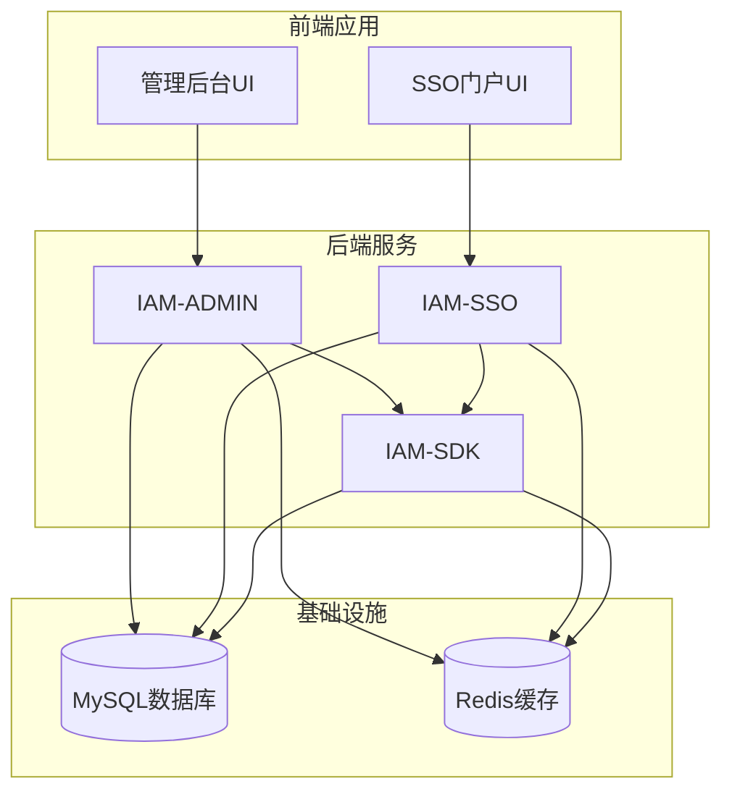
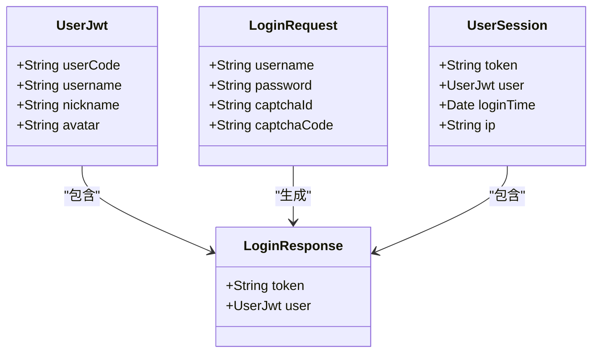
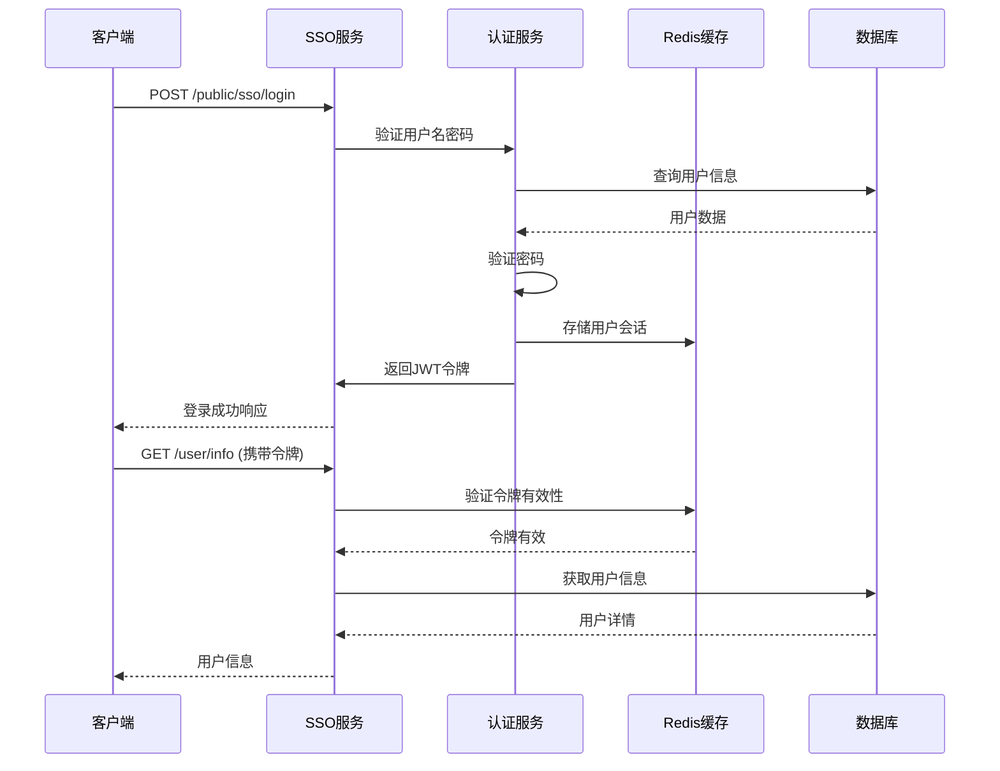
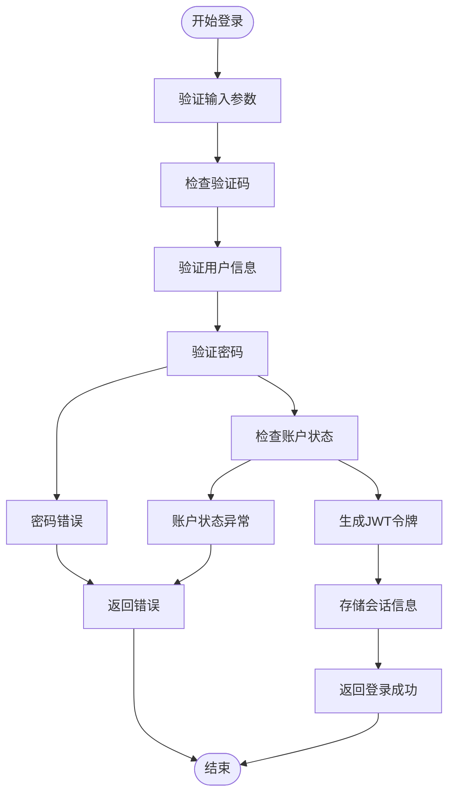
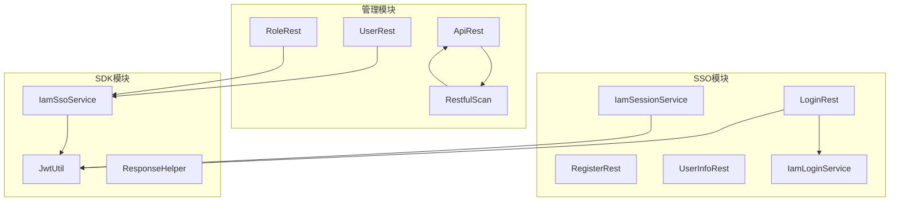

# API接口文档

<cite>
**本文档引用的文件**
- [Route.java](file://iam-admin/src/main/java/com/wkclz/iam/admin/Route.java)
- [Route.java](file://iam-sso/src/main/java/com/wkclz/iam/sso/Route.java)
- [ApiRest.java](file://iam-admin/src/main/java/com/wkclz/iam/admin/rest/ApiRest.java)
- [UserRest.java](file://iam-admin/src/main/java/com/wkclz/iam/admin/rest/UserRest.java)
- [RoleRest.java](file://iam-admin/src/main/java/com/wkclz/iam/admin/rest/RoleRest.java)
- [LoginRest.java](file://iam-sso/src/main/java/com/wkclz/iam/sso/rest/LoginRest.java)
- [RegisterRest.java](file://iam-sso/src/main/java/com/wkclz/iam/sso/rest/RegisterRest.java)
- [UserInfoRest.java](file://iam-sso/src/main/java/com/wkclz/iam/sso/rest/UserInfoRest.java)
- [RestfulScan.java](file://iam-admin/src/main/java/com/wkclz/iam/admin/init/RestfulScan.java)
- [IamSsoService.java](file://iam-sdk/src/main/java/com/wkclz/iam/sdk/service/IamSsoService.java)
- [JwtUtil.java](file://iam-sdk/src/main/java/com/wkclz/iam/sdk/util/JwtUtil.java)
- [IamSessionService.java](file://iam-sso/src/main/java/com/wkclz/iam/sso/service/IamSessionService.java)
- [STORY-015-username-password-login.md](file://docs/stories/STORY-015-username-password-login.md)
- [STORY-017-user-register.md](file://docs/stories/STORY-017-user-register.md)
- [STORY-018-user-logout.md](file://docs/stories/STORY-018-user-logout.md)
- [STORY-027-role-crud.md](file://docs/stories/STORY-027-role-crud.md)
- [STORY-031-api-auto-scan.md](file://docs/stories/STORY-031-api-auto-scan.md)
- [sso.js](file://iam-sso-ui/src/api/sso.js)
- [auth.js](file://iam-sso-ui/src/utils/auth.js)
</cite>

## 目录
1. [简介](#简介)
2. [项目结构](#项目结构)
3. [核心组件](#核心组件)
4. [架构概览](#架构概览)
5. [详细组件分析](#详细组件分析)
6. [依赖关系分析](#依赖关系分析)
7. [性能考虑](#性能考虑)
8. [故障排除指南](#故障排除指南)
9. [结论](#结论)

## 简介

SH-IAM是一个基于Spring Boot的企业级身份认证和权限管理系统，采用前后端分离架构设计。系统主要分为两个核心模块：

- **IAM-ADMIN**：管理后台模块，提供用户管理、角色管理、权限管理等功能
- **IAM-SSO**：单点登录模块，提供认证授权、会话管理、用户信息服务

系统支持多种认证方式，包括用户名密码认证、JWT令牌认证、会话认证等，并提供了完善的API接口用于客户端集成。

## 项目结构



**图表来源**
- [Route.java](file://iam-admin/src/main/java/com/wkclz/iam/admin/Route.java)
- [Route.java](file://iam-sso/src/main/java/com/wkclz/iam/sso/Route.java)

**章节来源**
- [Route.java](file://iam-admin/src/main/java/com/wkclz/iam/admin/Route.java)
- [Route.java](file://iam-sso/src/main/java/com/wkclz/iam/sso/Route.java)

## 核心组件

### 认证与授权组件

系统采用多层认证机制，确保安全性：

1. **JWT令牌管理**：基于HS256算法的JWT令牌生成和验证
2. **会话管理**：Redis分布式会话存储和管理
3. **权限控制**：基于角色的访问控制(RBAC)
4. **API权限**：动态API权限管理和自动扫描

### 数据模型组件



**图表来源**
- [JwtUtil.java](file://iam-sdk/src/main/java/com/wkclz/iam/sdk/util/JwtUtil.java)
- [IamSsoService.java](file://iam-sdk/src/main/java/com/wkclz/iam/sdk/service/IamSsoService.java)

**章节来源**
- [JwtUtil.java](file://iam-sdk/src/main/java/com/wkclz/iam/sdk/util/JwtUtil.java)
- [IamSsoService.java](file://iam-sdk/src/main/java/com/wkclz/iam/sdk/service/IamSsoService.java)

## 架构概览



**图表来源**
- [LoginRest.java](file://iam-sso/src/main/java/com/wkclz/iam/sso/rest/LoginRest.java)
- [JwtUtil.java](file://iam-sdk/src/main/java/com/wkclz/iam/sdk/util/JwtUtil.java)
- [IamSessionService.java](file://iam-sso/src/main/java/com/wkclz/iam/sso/service/IamSessionService.java)

## 详细组件分析

### SSO认证接口

#### 用户名密码登录

**接口定义**
- 方法：POST
- URL：`/iam-sso/public/sso/login`
- 功能：用户通过用户名密码进行系统登录

**请求参数**
```json
{
  "username": "string",
  "password": "string",
  "captchaId": "string",
  "captchaCode": "string"
}
```

**响应参数**
```json
{
  "token": "string",
  "user": {
    "userCode": "string",
    "username": "string",
    "nickname": "string",
    "avatar": "string"
  }
}
```

**认证流程**


**图表来源**
- [STORY-015-username-password-login.md](file://docs/stories/STORY-015-username-password-login.md)

**章节来源**
- [STORY-015-username-password-login.md](file://docs/stories/STORY-015-username-password-login.md)

#### 用户注册接口

**接口定义**
- 方法：POST
- URL：`/iam-sso/public/sso/register`
- 功能：新用户注册账号

**请求参数**
```json
{
  "username": "string",
  "password": "string",
  "email": "string",
  "phone": "string"
}
```

**响应参数**
```json
{
  "code": "number",
  "message": "string",
  "data": {}
}
```

**章节来源**
- [STORY-017-user-register.md](file://docs/stories/STORY-017-user-register.md)

#### 用户登出接口

**接口定义**
- 方法：GET
- URL：`/iam-sso/public/sso/logout`
- 功能：用户主动登出系统

**认证要求**
- 需要提供有效的JWT令牌

**处理流程**
1. 从请求中获取令牌
2. 验证令牌有效性
3. 删除Redis中的会话缓存
4. 使令牌立即失效

**章节来源**
- [STORY-018-user-logout.md](file://docs/stories/STORY-018-user-logout.md)

### 管理后台接口

#### API管理接口

**接口定义**
- 方法：GET
- URL：`/iam-admin/api/page`
- 功能：分页查询API列表

**请求参数**
- 支持按API名称、模块等条件查询

**响应参数**
```json
{
  "current": "number",
  "size": "number",
  "total": "number",
  "records": [
    {
      "id": "number",
      "apiCode": "string",
      "apiName": "string",
      "method": "string",
      "uri": "string",
      "module": "string"
    }
  ]
}
```

**自动扫描功能**
系统支持API自动扫描同步功能：

1. 应用启动时自动执行
2. 基于`@Router`注解扫描所有REST端点
3. 与数据库进行差异对比
4. 支持新增、更新、删除操作

**章节来源**
- [ApiRest.java](file://iam-admin/src/main/java/com/wkclz/iam/admin/rest/ApiRest.java)
- [RestfulScan.java](file://iam-admin/src/main/java/com/wkclz/iam/admin/init/RestfulScan.java)
- [STORY-031-api-auto-scan.md](file://docs/stories/STORY-031-api-auto-scan.md)

#### 用户管理接口

**用户列表查询**
- 方法：GET
- URL：`/iam-admin/user/list`
- 功能：分页查询用户列表

**用户详情查询**
- 方法：GET
- URL：`/iam-admin/user/info`
- 功能：获取用户详细信息

**用户创建**
- 方法：POST
- URL：`/iam-admin/user/create`
- 功能：创建新用户

**用户更新**
- 方法：POST
- URL：`/iam-admin/user/update`
- 功能：更新用户信息

**用户删除**
- 方法：POST
- URL：`/iam-admin/user/remove`
- 功能：删除用户

#### 角色管理接口

**角色列表查询**
- 方法：GET
- URL：`/iam-admin/role/list`
- 功能：查询角色列表

**角色详情查询**
- 方法：GET
- URL：`/iam-admin/role/info`
- 功能：获取角色详情

**角色创建**
- 方法：POST
- URL：`/iam-admin/role/create`
- 功能：创建新角色

**角色更新**
- 方法：POST
- URL：`/iam-admin/role/update`
- 功能：更新角色信息

**角色删除**
- 方法：POST
- URL：`/iam-admin/role/remove`
- 功能：删除角色

**章节来源**
- [UserRest.java](file://iam-admin/src/main/java/com/wkclz/iam/admin/rest/UserRest.java)
- [RoleRest.java](file://iam-admin/src/main/java/com/wkclz/iam/admin/rest/RoleRest.java)
- [STORY-027-role-crud.md](file://docs/stories/STORY-027-role-crud.md)

### 客户端集成指南

#### 前端集成

**认证状态管理**
```javascript
// 获取token
function getToken() {
  return localStorage.getItem('token')
}

// 设置token
function setToken(token) {
  return localStorage.setItem('token', token)
}

// 移除token
function removeToken() {
  return localStorage.removeItem('token')
}
```

**API调用示例**
```javascript
// 登录请求
export const ssoLogin = (data) => {
  return request({
    url: '/iam-sso/public/sso/login',
    method: 'post',
    data
  })
}

// 获取用户信息
export const getUserInfo = () => {
  return request({
    url: '/iam-sso/user/info',
    method: 'get'
  })
}
```

**章节来源**
- [sso.js](file://iam-sso-ui/src/api/sso.js)
- [auth.js](file://iam-sso-ui/src/utils/auth.js)

## 依赖关系分析



**图表来源**
- [LoginRest.java](file://iam-sso/src/main/java/com/wkclz/iam/sso/rest/LoginRest.java)
- [UserRest.java](file://iam-admin/src/main/java/com/wkclz/iam/admin/rest/UserRest.java)
- [IamSsoService.java](file://iam-sdk/src/main/java/com/wkclz/iam/sdk/service/IamSsoService.java)

**章节来源**
- [LoginRest.java](file://iam-sso/src/main/java/com/wkclz/iam/sso/rest/LoginRest.java)
- [UserRest.java](file://iam-admin/src/main/java/com/wkclz/iam/admin/rest/UserRest.java)
- [IamSsoService.java](file://iam-sdk/src/main/java/com/wkclz/iam/sdk/service/IamSsoService.java)

## 性能考虑

### 缓存策略

1. **Redis会话缓存**：用户会话信息存储在Redis中，支持分布式部署
2. **JWT令牌缓存**：令牌验证结果进行短期缓存，减少重复验证开销
3. **API权限缓存**：用户权限信息进行缓存，提高权限检查效率

### 并发控制

1. **令牌并发控制**：同一用户多个设备登录时，采用会话列表管理
2. **API访问控制**：基于令牌的并发访问限制
3. **数据库连接池**：合理配置连接池大小，避免连接泄漏

### 监控指标

1. **请求响应时间**：监控各API的响应时间
2. **错误率统计**：跟踪API错误发生频率
3. **并发用户数**：监控同时在线用户数量

## 故障排除指南

### 常见错误处理

**认证相关错误**
- `INVALID_CREDENTIALS`：用户名或密码错误
- `ACCOUNT_LOCKED`：用户账户被锁定
- `EXPIRED_ACCOUNT`：账户已过期
- `ACCOUNT_DISABLED`：账户已被禁用

**会话相关错误**
- `TOKEN_EXPIRED`：令牌已过期
- `TOKEN_INVALID`：令牌无效
- `SESSION_NOT_FOUND`：会话不存在

**权限相关错误**
- `PERMISSION_DENIED`：权限不足
- `API_NOT_FOUND`：API不存在

### 调试建议

1. **启用详细日志**：在开发环境开启DEBUG级别日志
2. **检查Redis连接**：确认Redis服务正常运行
3. **验证数据库连接**：确保数据库连接池配置正确
4. **测试网络连通性**：确认各服务间网络通信正常

**章节来源**
- [IamSessionService.java](file://iam-sso/src/main/java/com/wkclz/iam/sso/service/IamSessionService.java)
- [JwtUtil.java](file://iam-sdk/src/main/java/com/wkclz/iam/sdk/util/JwtUtil.java)

## 结论

SH-IAM系统提供了完整的身份认证和权限管理解决方案，具有以下特点：

1. **模块化设计**：清晰的模块划分，便于维护和扩展
2. **安全性保障**：多层认证机制，确保系统安全
3. **高可用性**：支持分布式部署，具备良好的扩展性
4. **易用性**：提供完善的API文档和客户端集成示例

系统目前处于快速发展阶段，后续将继续完善注册、权限管理等核心功能，为用户提供更好的使用体验。