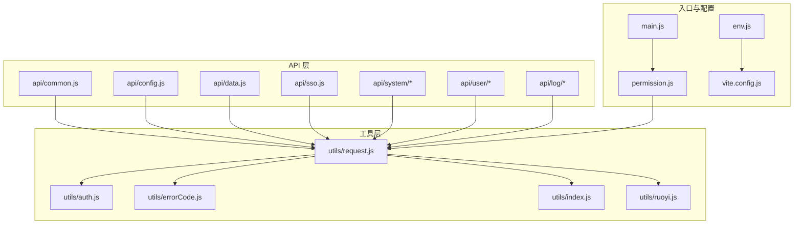
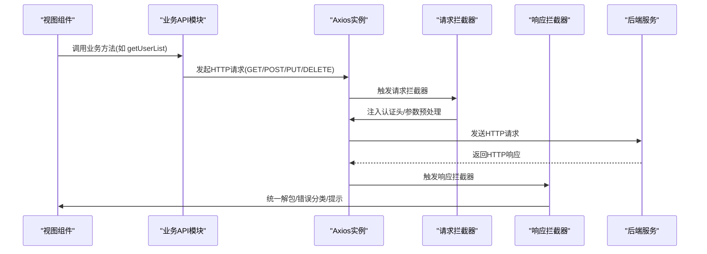
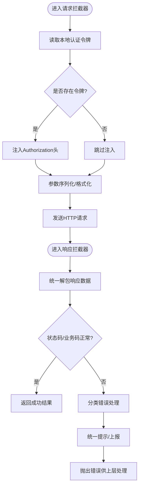
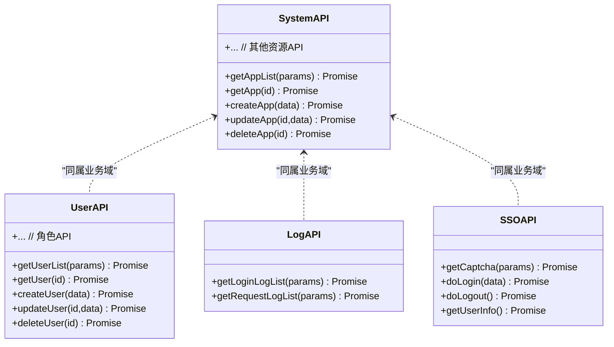
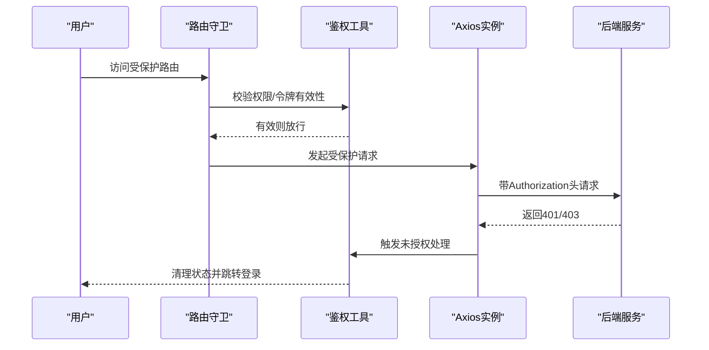
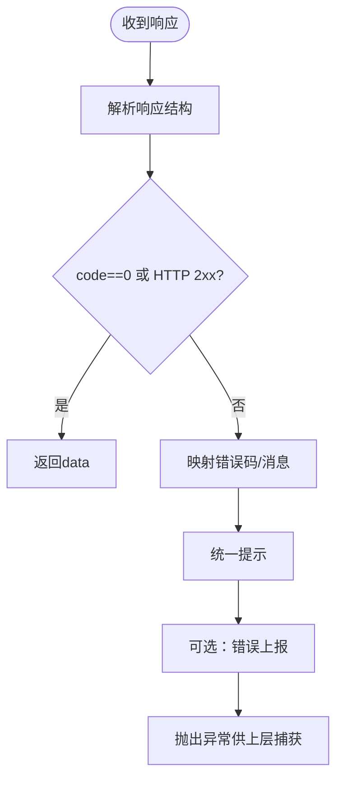
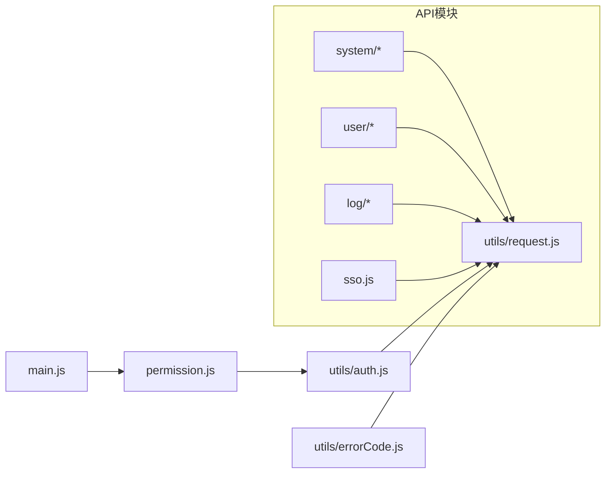

# API服务与工具

<cite>
**本文引用的文件**
- [common.js](file://iam-admin-ui/src/api/common.js)
- [config.js](file://iam-admin-ui/src/api/config.js)
- [data.js](file://iam-admin-ui/src/api/data.js)
- [loginlog.js](file://iam-admin-ui/src/api/log/loginlog.js)
- [requestlog.js](file://iam-admin-ui/src/api/log/requestlog.js)
- [ak-api.js](file://iam-admin-ui/src/api/system/ak-api.js)
- [ak.js](file://iam-admin-ui/src/api/system/ak.js)
- [api.js](file://iam-admin-ui/src/api/system/api.js)
- [app.js](file://iam-admin-ui/src/api/system/app.js)
- [dim.js](file://iam-admin-ui/src/api/system/dim.js)
- [menu.js](file://iam-admin-ui/src/api/system/menu.js)
- [role.js](file://iam-admin-ui/src/api/user/role.js)
- [user.js](file://iam-admin-ui/src/api/user/user.js)
- [sso.js](file://iam-admin-ui/src/api/sso.js)
- [request.js](file://iam-admin-ui/src/utils/request.js)
- [auth.js](file://iam-admin-ui/src/utils/auth.js)
- [errorCode.js](file://iam-admin-ui/src/utils/errorCode.js)
- [index.js](file://iam-admin-ui/src/utils/index.js)
- [ruoyi.js](file://iam-admin-ui/src/utils/ruoyi.js)
- [main.js](file://iam-admin-ui/src/main.js)
- [permission.js](file://iam-admin-ui/src/permission.js)
- [env.js](file://iam-admin-ui/env.js)
- [vite.config.js](file://iam-admin-ui/vite.config.js)
</cite>

## 目录
1. [简介](#简介)
2. [项目结构](#项目结构)
3. [核心组件](#核心组件)
4. [架构总览](#架构总览)
5. [详细组件分析](#详细组件分析)
6. [依赖关系分析](#依赖关系分析)
7. [性能考虑](#性能考虑)
8. [故障排查指南](#故障排查指南)
9. [结论](#结论)
10. [附录](#附录)

## 简介
本文件面向SSO前端的API服务层，系统性梳理RESTful API封装、请求拦截器、响应处理与错误管理机制，详解Axios配置、超时与重试策略，并给出GET/POST/PUT/DELETE等请求的使用范式。同时覆盖认证令牌自动注入、响应数据统一处理、错误状态分类、API版本管理、Mock支持与调试工具的使用方法，帮助开发者快速理解并高效扩展API能力。

## 项目结构
SSO前端API层主要位于 iam-admin-ui/src/api 与 iam-admin-ui/src/utils 下，采用按功能域分层组织：
- api：按业务模块划分（system、user、log），每个模块导出一组CRUD方法
- utils：通用工具（请求封装、鉴权、错误码映射、通用辅助）
- 配置：环境变量与构建配置（用于区分开发/测试/UAT/生产）

图表来源
- [common.js:1-200](file://iam-admin-ui/src/api/common.js#L1-L200)
- [config.js:1-200](file://iam-admin-ui/src/api/config.js#L1-L200)
- [data.js:1-200](file://iam-admin-ui/src/api/data.js#L1-L200)
- [sso.js:1-200](file://iam-admin-ui/src/api/sso.js#L1-L200)
- [ak-api.js:1-200](file://iam-admin-ui/src/api/system/ak-api.js#L1-L200)
- [ak.js:1-200](file://iam-admin-ui/src/api/system/ak.js#L1-L200)
- [api.js:1-200](file://iam-admin-ui/src/api/system/api.js#L1-L200)
- [app.js:1-200](file://iam-admin-ui/src/api/system/app.js#L1-L200)
- [dim.js:1-200](file://iam-admin-ui/src/api/system/dim.js#L1-L200)
- [menu.js:1-200](file://iam-admin-ui/src/api/system/menu.js#L1-L200)
- [role.js:1-200](file://iam-admin-ui/src/api/user/role.js#L1-L200)
- [user.js:1-200](file://iam-admin-ui/src/api/user/user.js#L1-L200)
- [loginlog.js:1-200](file://iam-admin-ui/src/api/log/loginlog.js#L1-L200)
- [requestlog.js:1-200](file://iam-admin-ui/src/api/log/requestlog.js#L1-L200)
- [request.js:1-200](file://iam-admin-ui/src/utils/request.js#L1-L200)
- [auth.js:1-200](file://iam-admin-ui/src/utils/auth.js#L1-L200)
- [errorCode.js:1-200](file://iam-admin-ui/src/utils/errorCode.js#L1-L200)
- [index.js:1-200](file://iam-admin-ui/src/utils/index.js#L1-L200)
- [ruoyi.js:1-200](file://iam-admin-ui/src/utils/ruoyi.js#L1-L200)
- [main.js:1-200](file://iam-admin-ui/src/main.js#L1-L200)
- [permission.js:1-200](file://iam-admin-ui/src/permission.js#L1-L200)
- [env.js:1-200](file://iam-admin-ui/env.js#L1-L200)
- [vite.config.js:1-200](file://iam-admin-ui/vite.config.js#L1-L200)

章节来源
- [common.js:1-200](file://iam-admin-ui/src/api/common.js#L1-L200)
- [config.js:1-200](file://iam-admin-ui/src/api/config.js#L1-L200)
- [data.js:1-200](file://iam-admin-ui/src/api/data.js#L1-L200)
- [sso.js:1-200](file://iam-admin-ui/src/api/sso.js#L1-L200)
- [ak-api.js:1-200](file://iam-admin-ui/src/api/system/ak-api.js#L1-L200)
- [ak.js:1-200](file://iam-admin-ui/src/api/system/ak.js#L1-L200)
- [api.js:1-200](file://iam-admin-ui/src/api/system/api.js#L1-L200)
- [app.js:1-200](file://iam-admin-ui/src/api/system/app.js#L1-L200)
- [dim.js:1-200](file://iam-admin-ui/src/api/system/dim.js#L1-L200)
- [menu.js:1-200](file://iam-admin-ui/src/api/system/menu.js#L1-L200)
- [role.js:1-200](file://iam-admin-ui/src/api/user/role.js#L1-L200)
- [user.js:1-200](file://iam-admin-ui/src/api/user/user.js#L1-L200)
- [loginlog.js:1-200](file://iam-admin-ui/src/api/log/loginlog.js#L1-L200)
- [requestlog.js:1-200](file://iam-admin-ui/src/api/log/requestlog.js#L1-L200)
- [request.js:1-200](file://iam-admin-ui/src/utils/request.js#L1-L200)
- [auth.js:1-200](file://iam-admin-ui/src/utils/auth.js#L1-L200)
- [errorCode.js:1-200](file://iam-admin-ui/src/utils/errorCode.js#L1-L200)
- [index.js:1-200](file://iam-admin-ui/src/utils/index.js#L1-L200)
- [ruoyi.js:1-200](file://iam-admin-ui/src/utils/ruoyi.js#L1-L200)
- [main.js:1-200](file://iam-admin-ui/src/main.js#L1-L200)
- [permission.js:1-200](file://iam-admin-ui/src/permission.js#L1-L200)
- [env.js:1-200](file://iam-admin-ui/env.js#L1-L200)
- [vite.config.js:1-200](file://iam-admin-ui/vite.config.js#L1-L200)

## 核心组件
- Axios请求封装与拦截器
  - 统一请求前缀、超时、重试策略、错误处理
  - 请求头自动注入认证令牌
  - 响应数据统一解包与错误分类
- 业务API模块
  - system：应用、接口、菜单、维度、访问密钥等资源管理
  - user：用户、角色等用户域资源管理
  - log：登录日志、请求日志查询
  - sso：单点登录相关接口
- 工具库
  - 鉴权：获取/刷新/移除Token
  - 错误码映射：HTTP状态码与业务错误码转换
  - 通用：参数序列化、提示、主题等

章节来源
- [request.js:1-200](file://iam-admin-ui/src/utils/request.js#L1-L200)
- [auth.js:1-200](file://iam-admin-ui/src/utils/auth.js#L1-L200)
- [errorCode.js:1-200](file://iam-admin-ui/src/utils/errorCode.js#L1-L200)
- [common.js:1-200](file://iam-admin-ui/src/api/common.js#L1-L200)
- [config.js:1-200](file://iam-admin-ui/src/api/config.js#L1-L200)
- [data.js:1-200](file://iam-admin-ui/src/api/data.js#L1-L200)
- [sso.js:1-200](file://iam-admin-ui/src/api/sso.js#L1-L200)
- [ak-api.js:1-200](file://iam-admin-ui/src/api/system/ak-api.js#L1-L200)
- [ak.js:1-200](file://iam-admin-ui/src/api/system/ak.js#L1-L200)
- [api.js:1-200](file://iam-admin-ui/src/api/system/api.js#L1-L200)
- [app.js:1-200](file://iam-admin-ui/src/api/system/app.js#L1-L200)
- [dim.js:1-200](file://iam-admin-ui/src/api/system/dim.js#L1-L200)
- [menu.js:1-200](file://iam-admin-ui/src/api/system/menu.js#L1-L200)
- [role.js:1-200](file://iam-admin-ui/src/api/user/role.js#L1-L200)
- [user.js:1-200](file://iam-admin-ui/src/api/user/user.js#L1-L200)
- [loginlog.js:1-200](file://iam-admin-ui/src/api/log/loginlog.js#L1-L200)
- [requestlog.js:1-200](file://iam-admin-ui/src/api/log/requestlog.js#L1-L200)

## 架构总览
下图展示从页面到后端的调用链路，以及拦截器对请求/响应的处理位置。

图表来源
- [request.js:1-200](file://iam-admin-ui/src/utils/request.js#L1-L200)
- [auth.js:1-200](file://iam-admin-ui/src/utils/auth.js#L1-L200)
- [errorCode.js:1-200](file://iam-admin-ui/src/utils/errorCode.js#L1-L200)
- [user.js:1-200](file://iam-admin-ui/src/api/user/user.js#L1-L200)
- [role.js:1-200](file://iam-admin-ui/src/api/user/role.js#L1-L200)
- [app.js:1-200](file://iam-admin-ui/src/api/system/app.js#L1-L200)
- [api.js:1-200](file://iam-admin-ui/src/api/system/api.js#L1-L200)
- [menu.js:1-200](file://iam-admin-ui/src/api/system/menu.js#L1-L200)
- [ak.js:1-200](file://iam-admin-ui/src/api/system/ak.js#L1-L200)
- [ak-api.js:1-200](file://iam-admin-ui/src/api/system/ak-api.js#L1-L200)
- [loginlog.js:1-200](file://iam-admin-ui/src/api/log/loginlog.js#L1-L200)
- [requestlog.js:1-200](file://iam-admin-ui/src/api/log/requestlog.js#L1-L200)

## 详细组件分析

### Axios封装与拦截器
- 请求前缀与基础配置
  - 通过统一的axios实例设置基础URL、超时时间、默认请求头
  - 支持在运行时切换不同环境的基础地址
- 请求拦截器
  - 自动从本地存储获取认证令牌并注入Authorization头
  - 对请求参数进行序列化或格式化（如FormData、JSON）
  - 可扩展：统一埋点、签名、加密等
- 响应拦截器
  - 统一解包后端返回的数据结构
  - 分类处理HTTP状态码与业务错误码
  - 失败时统一提示与错误上报
- 超时与重试
  - 超时时间集中配置，避免长请求阻塞UI
  - 可选重试策略（如网络异常自动重试1-2次），需谨慎控制重试范围

图表来源
- [request.js:1-200](file://iam-admin-ui/src/utils/request.js#L1-L200)
- [auth.js:1-200](file://iam-admin-ui/src/utils/auth.js#L1-L200)
- [errorCode.js:1-200](file://iam-admin-ui/src/utils/errorCode.js#L1-L200)

章节来源
- [request.js:1-200](file://iam-admin-ui/src/utils/request.js#L1-L200)
- [auth.js:1-200](file://iam-admin-ui/src/utils/auth.js#L1-L200)
- [errorCode.js:1-200](file://iam-admin-ui/src/utils/errorCode.js#L1-L200)

### 业务API模块设计
- 模块化组织
  - system：应用、接口、菜单、维度、访问密钥等资源的CRUD
  - user：用户、角色等用户域资源的CRUD
  - log：登录日志、请求日志查询
  - sso：单点登录相关接口
- 方法命名规范
  - GET：列表/详情使用 getXXXList/getXXX
  - POST：新增使用 addXXX/createXXX/saveXXX
  - PUT：更新使用 updateXXX/editXXX
  - DELETE：删除使用 removeXXX/deleteXXX
- 参数与返回
  - 参数统一通过查询参数或请求体传递
  - 返回统一包装为 { code, msg, data } 结构，由拦截器解包

图表来源
- [app.js:1-200](file://iam-admin-ui/src/api/system/app.js#L1-L200)
- [api.js:1-200](file://iam-admin-ui/src/api/system/api.js#L1-L200)
- [menu.js:1-200](file://iam-admin-ui/src/api/system/menu.js#L1-L200)
- [dim.js:1-200](file://iam-admin-ui/src/api/system/dim.js#L1-L200)
- [ak.js:1-200](file://iam-admin-ui/src/api/system/ak.js#L1-L200)
- [ak-api.js:1-200](file://iam-admin-ui/src/api/system/ak-api.js#L1-L200)
- [user.js:1-200](file://iam-admin-ui/src/api/user/user.js#L1-L200)
- [role.js:1-200](file://iam-admin-ui/src/api/user/role.js#L1-L200)
- [loginlog.js:1-200](file://iam-admin-ui/src/api/log/loginlog.js#L1-L200)
- [requestlog.js:1-200](file://iam-admin-ui/src/api/log/requestlog.js#L1-L200)
- [sso.js:1-200](file://iam-admin-ui/src/api/sso.js#L1-L200)

章节来源
- [app.js:1-200](file://iam-admin-ui/src/api/system/app.js#L1-L200)
- [api.js:1-200](file://iam-admin-ui/src/api/system/api.js#L1-L200)
- [menu.js:1-200](file://iam-admin-ui/src/api/system/menu.js#L1-L200)
- [dim.js:1-200](file://iam-admin-ui/src/api/system/dim.js#L1-L200)
- [ak.js:1-200](file://iam-admin-ui/src/api/system/ak.js#L1-L200)
- [ak-api.js:1-200](file://iam-admin-ui/src/api/system/ak-api.js#L1-L200)
- [user.js:1-200](file://iam-admin-ui/src/api/user/user.js#L1-L200)
- [role.js:1-200](file://iam-admin-ui/src/api/user/role.js#L1-L200)
- [loginlog.js:1-200](file://iam-admin-ui/src/api/log/loginlog.js#L1-L200)
- [requestlog.js:1-200](file://iam-admin-ui/src/api/log/requestlog.js#L1-L200)
- [sso.js:1-200](file://iam-admin-ui/src/api/sso.js#L1-L200)

### 认证令牌与权限控制
- 令牌获取与注入
  - 登录成功后持久化令牌
  - 请求拦截器自动读取并注入Authorization头
- 权限守卫
  - 路由前置守卫根据用户权限决定是否放行
  - 无权限时跳转至401/403页面
- 会话失效处理
  - 响应拦截器检测未授权或会话过期，清理本地状态并跳转登录页

图表来源
- [auth.js:1-200](file://iam-admin-ui/src/utils/auth.js#L1-L200)
- [permission.js:1-200](file://iam-admin-ui/src/permission.js#L1-L200)
- [request.js:1-200](file://iam-admin-ui/src/utils/request.js#L1-L200)

章节来源
- [auth.js:1-200](file://iam-admin-ui/src/utils/auth.js#L1-L200)
- [permission.js:1-200](file://iam-admin-ui/src/permission.js#L1-L200)
- [request.js:1-200](file://iam-admin-ui/src/utils/request.js#L1-L200)

### 错误处理与状态分类
- HTTP状态码映射
  - 将常见HTTP状态码映射为可读提示
- 业务错误码映射
  - 将后端返回的业务错误码映射为用户可理解的消息
- 统一提示与上报
  - 成功不弹窗，失败统一toast提示
  - 可选上报到监控系统

图表来源
- [errorCode.js:1-200](file://iam-admin-ui/src/utils/errorCode.js#L1-L200)
- [request.js:1-200](file://iam-admin-ui/src/utils/request.js#L1-L200)

章节来源
- [errorCode.js:1-200](file://iam-admin-ui/src/utils/errorCode.js#L1-L200)
- [request.js:1-200](file://iam-admin-ui/src/utils/request.js#L1-L200)

### API版本管理与Mock支持
- 版本管理
  - 建议在基础URL中加入版本号（如 /api/v1/...），便于灰度与兼容
  - 通过环境变量切换不同版本或后端集群
- Mock支持
  - 开发环境下可启用本地Mock，减少对后端依赖
  - Mock数据与真实接口保持一致的返回结构，便于联调

章节来源
- [env.js:1-200](file://iam-admin-ui/env.js#L1-L200)
- [vite.config.js:1-200](file://iam-admin-ui/vite.config.js#L1-L200)

### 调试工具与最佳实践
- 调试工具
  - 浏览器Network面板观察请求/响应
  - 控制台打印拦截器日志（可选）
  - 使用浏览器插件（如Postman）验证接口行为
- 最佳实践
  - 所有请求必须经过Axios封装，避免绕过拦截器
  - 参数校验与空值处理在API层完成
  - 错误提示与业务提示分离，避免重复提示

章节来源
- [request.js:1-200](file://iam-admin-ui/src/utils/request.js#L1-L200)
- [main.js:1-200](file://iam-admin-ui/src/main.js#L1-L200)

## 依赖关系分析
API模块之间低耦合，均依赖统一的Axios封装；业务API依赖鉴权与错误码工具；路由守卫依赖鉴权工具。

图表来源
- [request.js:1-200](file://iam-admin-ui/src/utils/request.js#L1-L200)
- [auth.js:1-200](file://iam-admin-ui/src/utils/auth.js#L1-L200)
- [errorCode.js:1-200](file://iam-admin-ui/src/utils/errorCode.js#L1-L200)
- [permission.js:1-200](file://iam-admin-ui/src/permission.js#L1-L200)
- [main.js:1-200](file://iam-admin-ui/src/main.js#L1-L200)
- [ak-api.js:1-200](file://iam-admin-ui/src/api/system/ak-api.js#L1-L200)
- [ak.js:1-200](file://iam-admin-ui/src/api/system/ak.js#L1-L200)
- [api.js:1-200](file://iam-admin-ui/src/api/system/api.js#L1-L200)
- [app.js:1-200](file://iam-admin-ui/src/api/system/app.js#L1-L200)
- [dim.js:1-200](file://iam-admin-ui/src/api/system/dim.js#L1-L200)
- [menu.js:1-200](file://iam-admin-ui/src/api/system/menu.js#L1-L200)
- [role.js:1-200](file://iam-admin-ui/src/api/user/role.js#L1-L200)
- [user.js:1-200](file://iam-admin-ui/src/api/user/user.js#L1-L200)
- [loginlog.js:1-200](file://iam-admin-ui/src/api/log/loginlog.js#L1-L200)
- [requestlog.js:1-200](file://iam-admin-ui/src/api/log/requestlog.js#L1-L200)
- [sso.js:1-200](file://iam-admin-ui/src/api/sso.js#L1-L200)

章节来源
- [request.js:1-200](file://iam-admin-ui/src/utils/request.js#L1-L200)
- [auth.js:1-200](file://iam-admin-ui/src/utils/auth.js#L1-L200)
- [errorCode.js:1-200](file://iam-admin-ui/src/utils/errorCode.js#L1-L200)
- [permission.js:1-200](file://iam-admin-ui/src/permission.js#L1-L200)
- [main.js:1-200](file://iam-admin-ui/src/main.js#L1-L200)
- [ak-api.js:1-200](file://iam-admin-ui/src/api/system/ak-api.js#L1-L200)
- [ak.js:1-200](file://iam-admin-ui/src/api/system/ak.js#L1-L200)
- [api.js:1-200](file://iam-admin-ui/src/api/system/api.js#L1-L200)
- [app.js:1-200](file://iam-admin-ui/src/api/system/app.js#L1-L200)
- [dim.js:1-200](file://iam-admin-ui/src/api/system/dim.js#L1-L200)
- [menu.js:1-200](file://iam-admin-ui/src/api/system/menu.js#L1-L200)
- [role.js:1-200](file://iam-admin-ui/src/api/user/role.js#L1-L200)
- [user.js:1-200](file://iam-admin-ui/src/api/user/user.js#L1-L200)
- [loginlog.js:1-200](file://iam-admin-ui/src/api/log/loginlog.js#L1-L200)
- [requestlog.js:1-200](file://iam-admin-ui/src/api/log/requestlog.js#L1-L200)
- [sso.js:1-200](file://iam-admin-ui/src/api/sso.js#L1-L200)

## 性能考虑
- 请求合并与防抖
  - 列表查询频繁触发时，建议在组件层做防抖/节流
- 缓存策略
  - 对静态数据或不常变的数据增加本地缓存
- 分页与懒加载
  - 后端分页参数规范化，前端懒加载提升首屏性能
- 超时与重试
  - 合理设置超时阈值，避免长时间等待
  - 仅对幂等请求（GET/HEAD）启用自动重试

## 故障排查指南
- 无法登录/401
  - 检查鉴权工具是否正确写入/读取令牌
  - 确认请求拦截器已注入Authorization头
- 接口报错/提示异常
  - 查看响应拦截器是否正确解包与映射错误码
  - 核对后端返回的code/msg/data结构
- 跨域/代理问题
  - 检查开发代理配置与后端允许的Origin
- Mock不生效
  - 确认开发环境开关与Mock脚本路径

章节来源
- [auth.js:1-200](file://iam-admin-ui/src/utils/auth.js#L1-L200)
- [request.js:1-200](file://iam-admin-ui/src/utils/request.js#L1-L200)
- [errorCode.js:1-200](file://iam-admin-ui/src/utils/errorCode.js#L1-L200)
- [permission.js:1-200](file://iam-admin-ui/src/permission.js#L1-L200)

## 结论
SSO前端API服务层以Axios为核心，通过统一拦截器实现认证、错误处理与响应解包，业务模块按领域清晰拆分，具备良好的可维护性与扩展性。建议在后续迭代中完善版本化路由、Mock体系与性能监控，持续提升开发效率与用户体验。

## 附录
- API调用示例（路径参考）
  - GET 列表：[user.js:1-200](file://iam-admin-ui/src/api/user/user.js#L1-L200)
  - POST 新增：[user.js:1-200](file://iam-admin-ui/src/api/user/user.js#L1-L200)
  - PUT 更新：[user.js:1-200](file://iam-admin-ui/src/api/user/user.js#L1-L200)
  - DELETE 删除：[user.js:1-200](file://iam-admin-ui/src/api/user/user.js#L1-L200)
- 配置与环境
  - 环境变量：[env.js:1-200](file://iam-admin-ui/env.js#L1-L200)
  - 构建配置：[vite.config.js:1-200](file://iam-admin-ui/vite.config.js#L1-L200)
- 入口与权限
  - 应用入口：[main.js:1-200](file://iam-admin-ui/src/main.js#L1-L200)
  - 权限守卫：[permission.js:1-200](file://iam-admin-ui/src/permission.js#L1-L200)