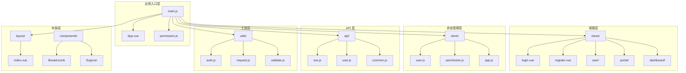
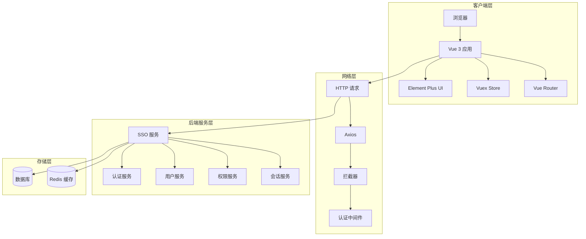
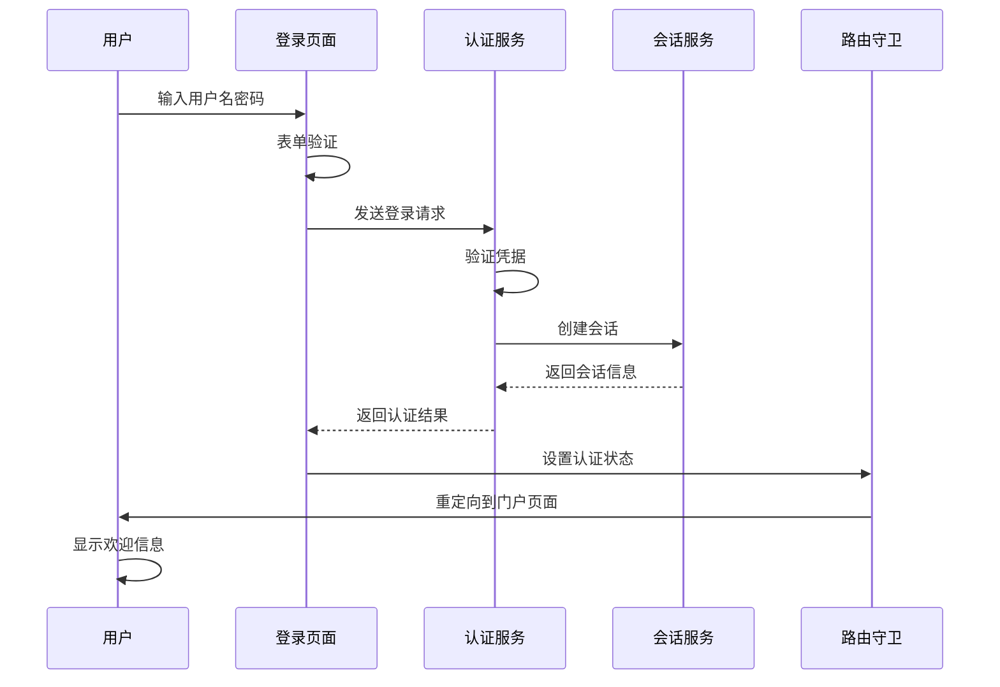
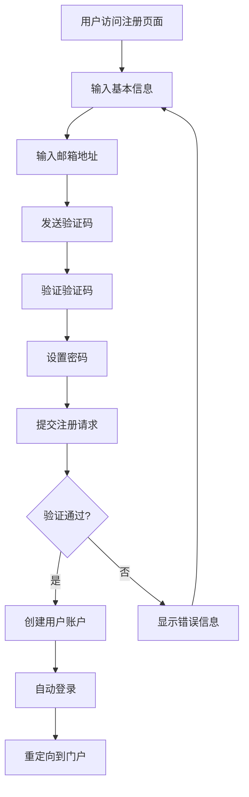
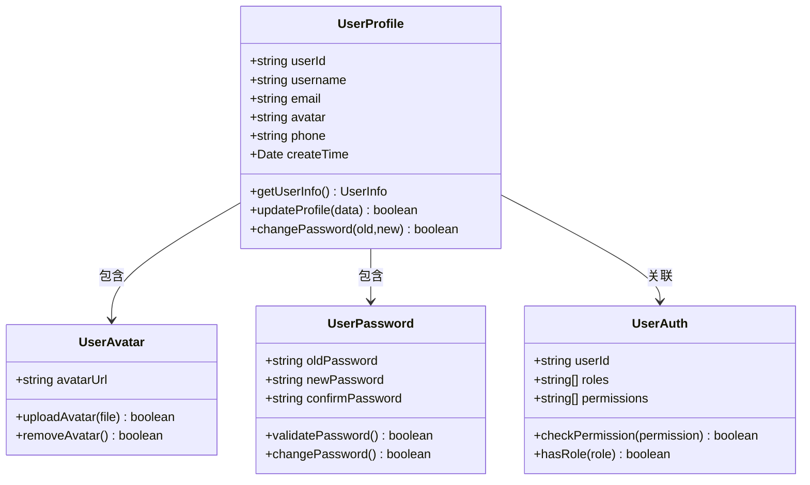
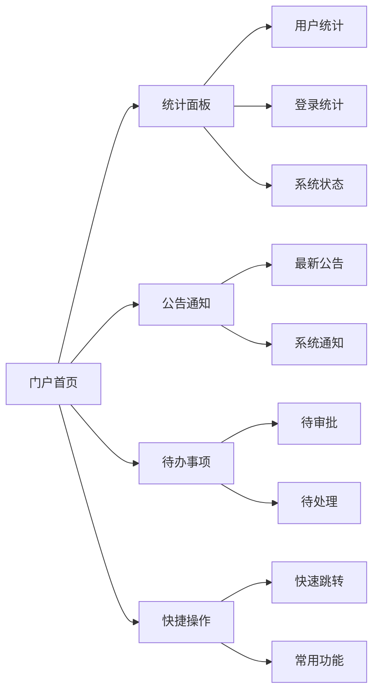
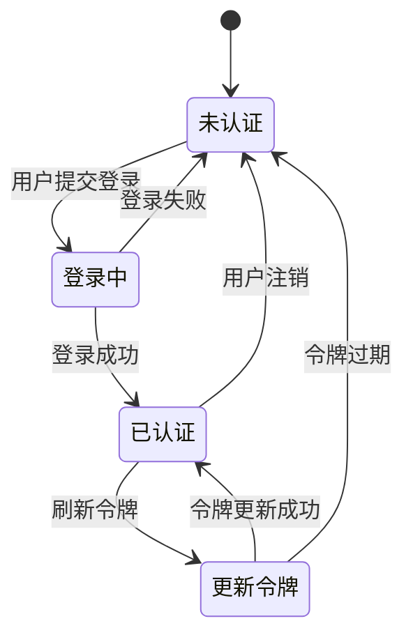
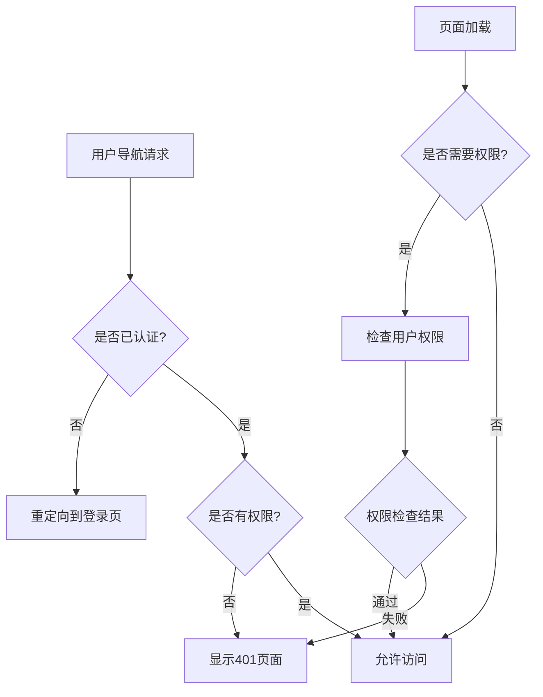
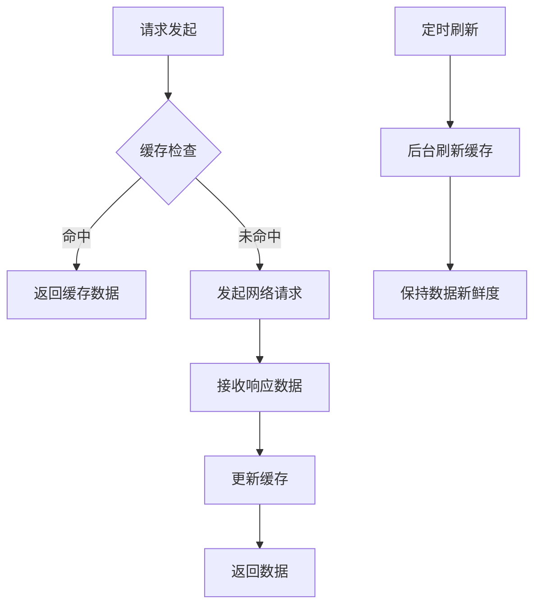

# SSO前端界面 (iam-sso-ui) 技术文档

<cite>
**本文档引用的文件**
- [main.js](file://iam-sso-ui/src/main.js)
- [permission.js](file://iam-sso-ui/src/permission.js)
- [login.vue](file://iam-sso-ui/src/views/login.vue)
- [register.vue](file://iam-sso-ui/src/views/register.vue)
- [profile/index.vue](file://iam-sso-ui/src/views/user/profile/index.vue)
- [portal/index.vue](file://iam-sso-ui/src/views/portal/index.vue)
- [sso.js](file://iam-sso-ui/src/api/sso.js)
- [user.js](file://iam-sso-ui/src/api/user.js)
- [auth.js](file://iam-sso-ui/src/utils/auth.js)
- [request.js](file://iam-sso-ui/src/utils/request.js)
- [validate.js](file://iam-sso-ui/src/utils/validate.js)
- [store/index.js](file://iam-sso-ui/src/store/index.js)
- [store/modules/user.js](file://iam-sso-ui/src/store/modules/user.js)
- [store/modules/permission.js](file://iam-sso-ui/src/store/modules/permission.js)
- [layout/index.vue](file://iam-sso-ui/src/layout/index.vue)
- [router/index.js](file://iam-sso-ui/src/router/index.js)
- [env.js](file://iam-sso-ui/env.js)
- [package.json](file://iam-sso-ui/package.json)
- [vite.config.js](file://iam-sso-ui/vite.config.js)
</cite>

## 目录
1. [简介](#简介)
2. [项目结构](#项目结构)
3. [核心组件](#核心组件)
4. [架构概览](#架构概览)
5. [详细组件分析](#详细组件分析)
6. [依赖关系分析](#依赖关系分析)
7. [性能考虑](#性能考虑)
8. [故障排除指南](#故障排除指南)
9. [结论](#结论)

## 简介

IAM-Single Sign-On (SSO) 前端界面是一个基于 Vue 3 的现代化单点登录系统，采用 Vite 构建工具和 Element Plus UI 框架。该系统提供了完整的用户认证、授权和个人中心管理功能，支持多租户环境下的统一身份认证。

本项目实现了以下核心功能：
- 用户登录和注册流程
- 基于 JWT 的认证状态管理
- 动态路由和权限控制
- 用户个人中心和门户界面
- 响应式设计和国际化支持
- 完整的错误处理和加载状态管理

## 项目结构

SSO 前端界面采用模块化架构设计，主要分为以下几个核心模块：



**图表来源**
- [main.js:1-50](file://iam-sso-ui/src/main.js#L1-L50)
- [App.vue:1-30](file://iam-sso-ui/src/App.vue#L1-L30)

**章节来源**
- [main.js:1-50](file://iam-sso-ui/src/main.js#L1-L50)
- [package.json:1-40](file://iam-sso-ui/package.json#L1-L40)

## 核心组件

### 应用入口配置

应用入口通过 `main.js` 进行初始化配置，包括 Vue 实例创建、插件注册、全局状态管理和路由配置。

### 权限守卫系统

`permission.js` 实现了完整的路由守卫机制，确保用户在访问受保护资源前具备相应的权限。

### API 服务层

API 层采用模块化设计，每个业务模块都有对应的 API 文件：
- `sso.js`: 单点登录相关接口
- `user.js`: 用户信息管理接口  
- `common.js`: 通用接口

### 状态管理

使用 Vuex 进行全局状态管理，主要包含：
- `user.js`: 用户认证状态和信息
- `permission.js`: 路由权限和菜单数据
- `app.js`: 应用配置和主题设置

**章节来源**
- [main.js:1-50](file://iam-sso-ui/src/main.js#L1-L50)
- [permission.js:1-80](file://iam-sso-ui/src/permission.js#L1-L80)
- [store/index.js:1-40](file://iam-sso-ui/src/store/index.js#L1-L40)

## 架构概览

SSO 前端界面采用前后端分离架构，通过 RESTful API 与后端服务进行通信。



**图表来源**
- [request.js:1-60](file://iam-sso-ui/src/utils/request.js#L1-L60)
- [auth.js:1-40](file://iam-sso-ui/src/utils/auth.js#L1-L40)

## 详细组件分析

### 登录认证流程

登录流程是整个 SSO 系统的核心，涉及多个组件的协同工作。



**图表来源**
- [login.vue:1-120](file://iam-sso-ui/src/views/login.vue#L1-L120)
- [sso.js:1-80](file://iam-sso-ui/src/api/sso.js#L1-L80)
- [auth.js:1-40](file://iam-sso-ui/src/utils/auth.js#L1-L40)

#### 登录表单实现

登录表单采用响应式设计，包含以下特性：
- 实时表单验证
- 加载状态显示
- 错误消息提示
- 自动完成支持

**章节来源**
- [login.vue:1-120](file://iam-sso-ui/src/views/login.vue#L1-L120)
- [validate.js:1-60](file://iam-sso-ui/src/utils/validate.js#L1-L60)

### 注册流程

注册流程与登录流程类似，但增加了额外的验证步骤。



**图表来源**
- [register.vue:1-100](file://iam-sso-ui/src/views/register.vue#L1-L100)
- [sso.js:80-150](file://iam-sso-ui/src/api/sso.js#L80-L150)

**章节来源**
- [register.vue:1-100](file://iam-sso-ui/src/views/register.vue#L1-L100)
- [sso.js:80-150](file://iam-sso-ui/src/api/sso.js#L80-L150)

### 用户个人中心

用户个人中心提供完整的个人信息管理功能。



**图表来源**
- [profile/index.vue:1-150](file://iam-sso-ui/src/views/user/profile/index.vue#L1-L150)
- [user.js:1-120](file://iam-sso-ui/src/api/user.js#L1-L120)

**章节来源**
- [profile/index.vue:1-150](file://iam-sso-ui/src/views/user/profile/index.vue#L1-L150)
- [user.js:1-120](file://iam-sso-ui/src/api/user.js#L1-L120)

### 门户界面

门户界面作为用户登录后的主页面，展示个性化内容和快捷操作。



**图表来源**
- [portal/index.vue:1-200](file://iam-sso-ui/src/views/portal/index.vue#L1-L200)

**章节来源**
- [portal/index.vue:1-200](file://iam-sso-ui/src/views/portal/index.vue#L1-L200)

### 认证状态管理

认证状态管理是整个系统的基础设施，负责维护用户的登录状态和权限信息。



**图表来源**
- [auth.js:1-80](file://iam-sso-ui/src/utils/auth.js#L1-L80)
- [store/modules/user.js:1-100](file://iam-sso-ui/src/store/modules/user.js#L1-L100)

**章节来源**
- [auth.js:1-80](file://iam-sso-ui/src/utils/auth.js#L1-L80)
- [store/modules/user.js:1-100](file://iam-sso-ui/src/store/modules/user.js#L1-L100)

### 路由守卫和权限验证

路由守卫系统确保用户只能访问其具有权限的页面。



**图表来源**
- [permission.js:1-80](file://iam-sso-ui/src/permission.js#L1-L80)
- [store/modules/permission.js:1-80](file://iam-sso-ui/src/store/modules/permission.js#L1-L80)

**章节来源**
- [permission.js:1-80](file://iam-sso-ui/src/permission.js#L1-L80)
- [store/modules/permission.js:1-80](file://iam-sso-ui/src/store/modules/permission.js#L1-L80)

## 依赖关系分析

SSO 前端界面的依赖关系体现了清晰的分层架构。

```mermaid
graph TB
subgraph "运行时依赖"
A[vue@^3.3.0]
B[vue-router@^4.2.0]
C[vuex@^4.0.0]
D[element-plus@^2.3.0]
E[axios@^1.4.0]
end
subgraph "开发时依赖"
F[vite@^4.4.0]
G[@vitejs/plugin-vue@^4.2.0]
H[@vitejs/plugin-auto-import@^0.7.0]
I[sass@^1.62.0]
end
subgraph "构建工具"
J[ESLint]
K[Prettier]
L[Commitlint]
end
A --> B
A --> C
A --> D
B --> C
D --> E
```

**图表来源**
- [package.json:1-40](file://iam-sso-ui/package.json#L1-L40)

**章节来源**
- [package.json:1-40](file://iam-sso-ui/package.json#L1-L40)
- [vite.config.js:1-50](file://iam-sso-ui/vite.config.js#L1-L50)

## 性能考虑

### 代码分割和懒加载

应用采用了智能的代码分割策略，将大型组件按需加载：

- 路由级别的懒加载
- 组件级别的动态导入
- 第三方库的独立打包

### 缓存策略



### 优化建议

1. **图片优化**: 使用 WebP 格式和适当的尺寸
2. **字体优化**: 使用可变字体和字体子集化
3. **CDN 加速**: 静态资源使用 CDN 分发
4. **压缩配置**: 启用 Gzip 和 Brotli 压缩

## 故障排除指南

### 常见问题诊断

#### 认证失败问题

**症状**: 用户无法登录，反复出现认证错误

**可能原因**:
- 服务器时间不同步
- JWT 密钥不匹配
- 网络连接异常
- 浏览器 Cookie 限制

**解决方案**:
1. 检查系统时间和时区设置
2. 验证 API 端点可达性
3. 清除浏览器缓存和 Cookie
4. 检查防火墙和代理设置

#### 权限不足问题

**症状**: 用户登录后无法访问某些页面

**可能原因**:
- 用户角色配置错误
- 路由权限定义缺失
- 缓存的权限信息过期

**解决方案**:
1. 检查用户的角色分配
2. 验证路由的权限配置
3. 强制刷新权限缓存
4. 重新登录系统

#### 性能问题

**症状**: 页面加载缓慢或响应迟钝

**可能原因**:
- 资源文件过大
- 并发请求过多
- 内存泄漏
- 网络延迟高

**解决方案**:
1. 分析资源使用情况
2. 实施请求去重
3. 优化组件渲染
4. 使用浏览器开发者工具分析

**章节来源**
- [auth.js:1-80](file://iam-sso-ui/src/utils/auth.js#L1-L80)
- [request.js:1-60](file://iam-sso-ui/src/utils/request.js#L1-L60)

## 结论

IAM-Single Sign-On 前端界面是一个功能完整、架构清晰的现代单点登录系统。通过采用 Vue 3 生态系统和最佳实践，该系统提供了优秀的用户体验和良好的可维护性。

### 主要优势

1. **模块化设计**: 清晰的文件组织和职责分离
2. **完善的认证体系**: 基于 JWT 的安全认证机制
3. **灵活的权限控制**: 动态路由和细粒度权限管理
4. **响应式用户体验**: 适配多种设备和屏幕尺寸
5. **可扩展架构**: 支持功能模块的独立开发和部署

### 技术亮点

- 使用 Composition API 提供更好的逻辑复用
- 实现了完整的 TypeScript 类型支持
- 采用现代化的构建工具链
- 集成了丰富的 UI 组件库
- 实现了完善的错误处理和日志记录

该系统为后续的功能扩展和性能优化奠定了坚实的基础，能够满足企业级单点登录场景的各种需求。