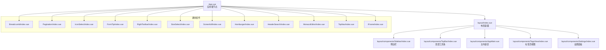
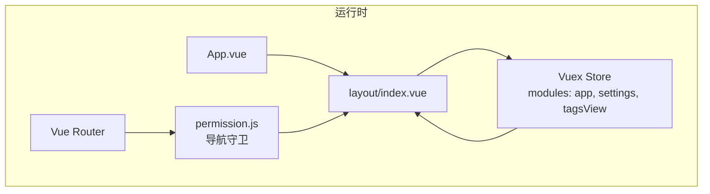
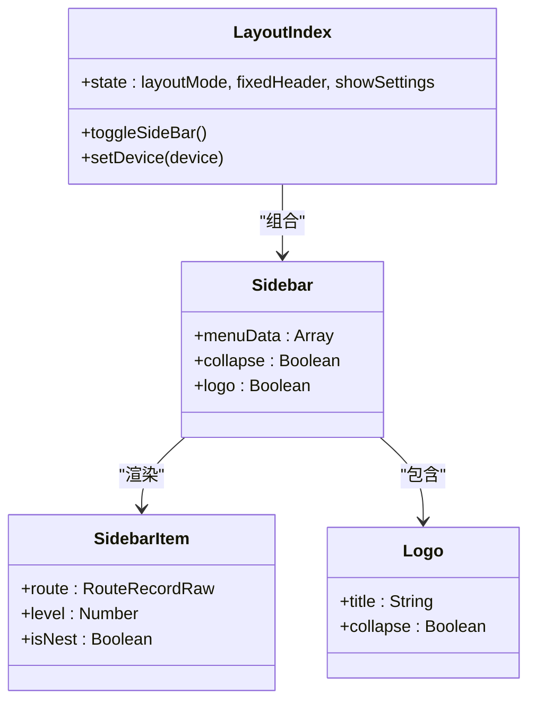
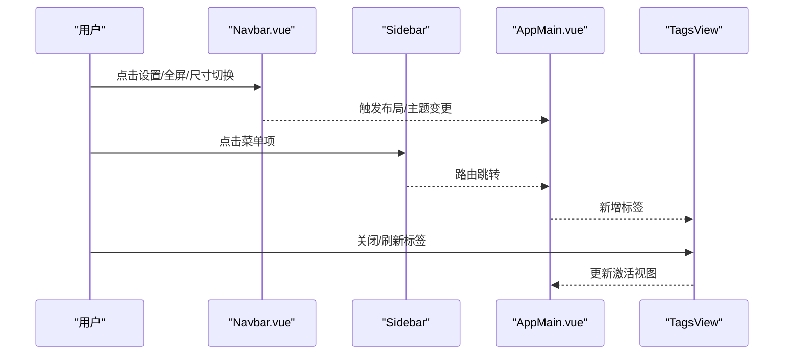
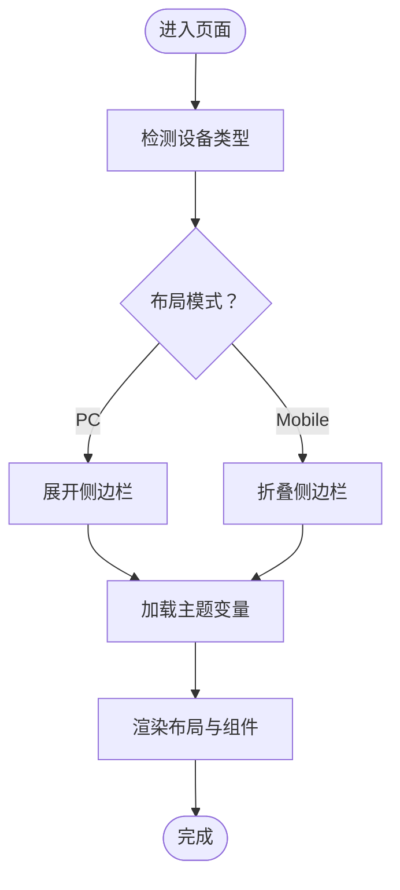
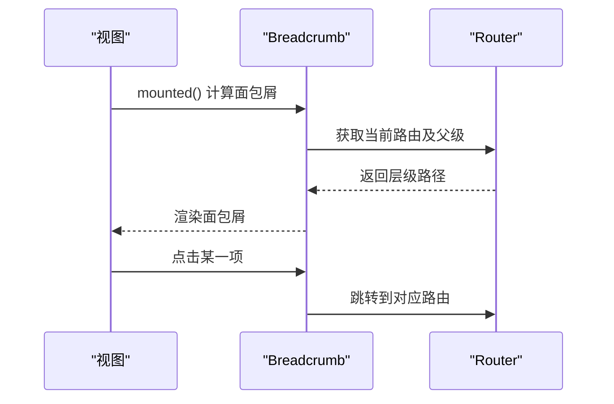
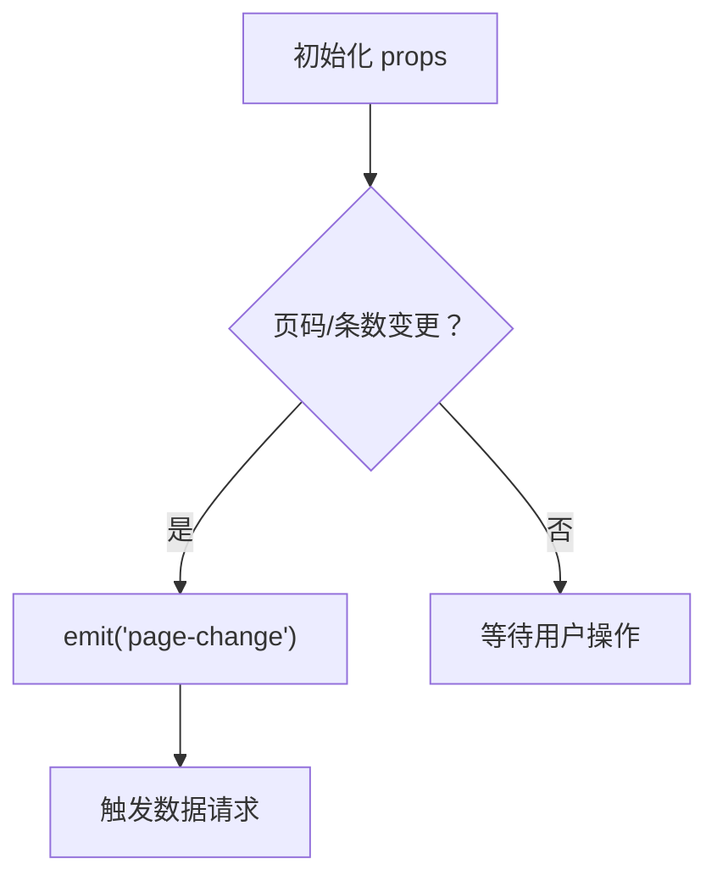
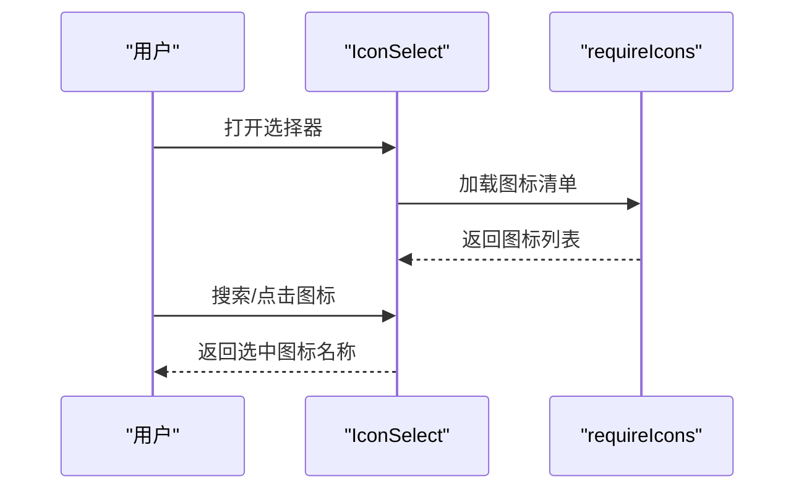
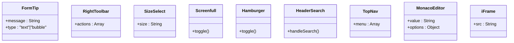
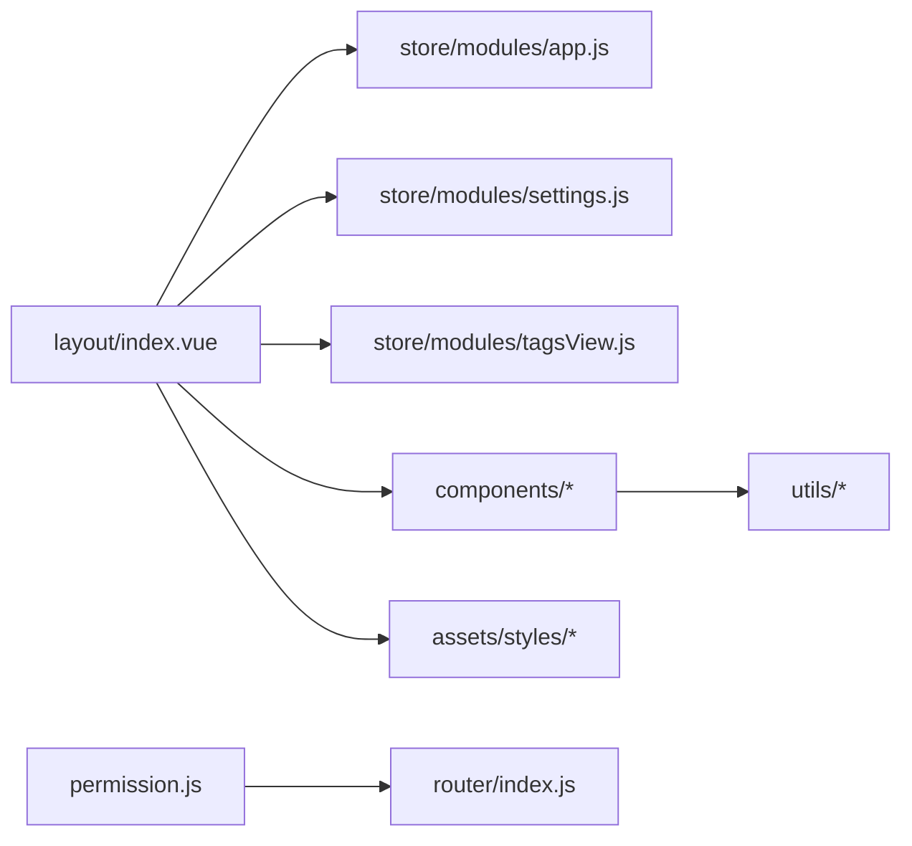

# 布局与通用组件

<cite>
**本文引用的文件**
- [iam-admin-ui/src/App.vue](file://iam-admin-ui/src/App.vue)
- [iam-admin-ui/src/main.js](file://iam-admin-ui/src/main.js)
- [iam-admin-ui/src/settings.js](file://iam-admin-ui/src/settings.js)
- [iam-admin-ui/src/layout/index.vue](file://iam-admin-ui/src/layout/index.vue)
- [iam-admin-ui/src/layout/components/index.js](file://iam-admin-ui/src/layout/components/index.js)
- [iam-admin-ui/src/layout/components/Sidebar/index.vue](file://iam-admin-ui/src/layout/components/Sidebar/index.vue)
- [iam-admin-ui/src/layout/components/Sidebar/SidebarItem.vue](file://iam-admin-ui/src/layout/components/Sidebar/SidebarItem.vue)
- [iam-admin-ui/src/layout/components/Sidebar/Logo.vue](file://iam-admin-ui/src/layout/components/Sidebar/Logo.vue)
- [iam-admin-ui/src/layout/components/TopBar/index.vue](file://iam-admin-ui/src/layout/components/TopBar/index.vue)
- [iam-admin-ui/src/layout/components/Navbar.vue](file://iam-admin-ui/src/layout/components/Navbar.vue)
- [iam-admin-ui/src/layout/components/AppMain.vue](file://iam-admin-ui/src/layout/components/AppMain.vue)
- [iam-admin-ui/src/layout/components/TagsView/index.vue](file://iam-admin-ui/src/layout/components/TagsView/index.vue)
- [iam-admin-ui/src/layout/components/TagsView/ScrollPane.vue](file://iam-admin-ui/src/layout/components/TagsView/ScrollPane.vue)
- [iam-admin-ui/src/layout/components/Settings/index.vue](file://iam-admin-ui/src/layout/components/Settings/index.vue)
- [iam-admin-ui/src/store/modules/app.js](file://iam-admin-ui/src/store/modules/app.js)
- [iam-admin-ui/src/store/modules/settings.js](file://iam-admin-ui/src/store/modules/settings.js)
- [iam-admin-ui/src/store/modules/tagsView.js](file://iam-admin-ui/src/store/modules/tagsView.js)
- [iam-admin-ui/src/utils/theme.js](file://iam-admin-ui/src/utils/theme.js)
- [iam-admin-ui/src/assets/styles/variables.module.scss](file://iam-admin-ui/src/assets/styles/variables.module.scss)
- [iam-admin-ui/src/assets/styles/sidebar.scss](file://iam-admin-ui/src/assets/styles/sidebar.scss)
- [iam-admin-ui/src/assets/styles/transition.scss](file://iam-admin-ui/src/assets/styles/transition.scss)
- [iam-admin-ui/src/assets/styles/mixin.scss](file://iam-admin-ui/src/assets/styles/mixin.scss)
- [iam-admin-ui/src/assets/styles/custom.scss](file://iam-admin-ui/src/assets/styles/custom.scss)
- [iam-admin-ui/src/components/Breadcrumb/index.vue](file://iam-admin-ui/src/components/Breadcrumb/index.vue)
- [iam-admin-ui/src/components/Pagination/index.vue](file://iam-admin-ui/src/components/Pagination/index.vue)
- [iam-admin-ui/src/components/IconSelect/index.vue](file://iam-admin-ui/src/components/IconSelect/index.vue)
- [iam-admin-ui/src/components/IconSelect/requireIcons.js](file://iam-admin-ui/src/components/IconSelect/requireIcons.js)
- [iam-admin-ui/src/components/FormTip/index.vue](file://iam-admin-ui/src/components/FormTip/index.vue)
- [iam-admin-ui/src/components/RightToolbar/index.vue](file://iam-admin-ui/src/components/RightToolbar/index.vue)
- [iam-admin-ui/src/components/SizeSelect/index.vue](file://iam-admin-ui/src/components/SizeSelect/index.vue)
- [iam-admin-ui/src/components/Screenfull/index.vue](file://iam-admin-ui/src/components/Screenfull/index.vue)
- [iam-admin-ui/src/components/Hamburger/index.vue](file://iam-admin-ui/src/components/Hamburger/index.vue)
- [iam-admin-ui/src/components/HeaderSearch/index.vue](file://iam-admin-ui/src/components/HeaderSearch/index.vue)
- [iam-admin-ui/src/components/MonacoEditor/index.vue](file://iam-admin-ui/src/components/MonacoEditor/index.vue)
- [iam-admin-ui/src/components/MonacoEditor/MonacoEditorType.ts](file://iam-admin-ui/src/components/MonacoEditor/MonacoEditorType.ts)
- [iam-admin-ui/src/components/TopNav/index.vue](file://iam-admin-ui/src/components/TopNav/index.vue)
- [iam-admin-ui/src/components/iFrame/index.vue](file://iam-admin-ui/src/components/iFrame/index.vue)
- [iam-admin-ui/src/router/index.js](file://iam-admin-ui/src/router/index.js)
- [iam-admin-ui/src/permission.js](file://iam-admin-ui/src/permission.js)
</cite>

## 目录
1. [简介](#简介)
2. [项目结构](#项目结构)
3. [核心组件](#核心组件)
4. [架构总览](#架构总览)
5. [详细组件分析](#详细组件分析)
6. [依赖关系分析](#依赖关系分析)
7. [性能考虑](#性能考虑)
8. [故障排查指南](#故障排查指南)
9. [结论](#结论)
10. [附录](#附录)

## 简介
本文件面向SSO前端（基于Vue 3/Vite）的布局系统与通用组件，系统性梳理整体布局架构（侧边栏导航、顶部导航、主内容区）、响应式布局与主题适配机制，并对通用组件（面包屑、分页、图标选择器、表单相关等）进行深入解析。文档同时覆盖组件间通信模式、props传递与事件处理机制，以及样式体系（SCSS模块化、主题定制）。

## 项目结构
SSO前端位于 iam-admin-ui 目录，采用典型的单页应用结构：入口文件、路由、状态管理、布局层与通用组件层分离清晰。布局层由 layout 组件统一编排，通用组件集中于 components 子目录，样式通过 SCSS 模块化组织并支持主题变量注入。

图表来源
- [iam-admin-ui/src/App.vue](file://iam-admin-ui/src/App.vue)
- [iam-admin-ui/src/layout/index.vue](file://iam-admin-ui/src/layout/index.vue)
- [iam-admin-ui/src/layout/components/Sidebar/index.vue](file://iam-admin-ui/src/layout/components/Sidebar/index.vue)
- [iam-admin-ui/src/layout/components/TopBar/index.vue](file://iam-admin-ui/src/layout/components/TopBar/index.vue)
- [iam-admin-ui/src/layout/components/AppMain.vue](file://iam-admin-ui/src/layout/components/AppMain.vue)
- [iam-admin-ui/src/layout/components/TagsView/index.vue](file://iam-admin-ui/src/layout/components/TagsView/index.vue)
- [iam-admin-ui/src/layout/components/Settings/index.vue](file://iam-admin-ui/src/layout/components/Settings/index.vue)
- [iam-admin-ui/src/components/Breadcrumb/index.vue](file://iam-admin-ui/src/components/Breadcrumb/index.vue)
- [iam-admin-ui/src/components/Pagination/index.vue](file://iam-admin-ui/src/components/Pagination/index.vue)
- [iam-admin-ui/src/components/IconSelect/index.vue](file://iam-admin-ui/src/components/IconSelect/index.vue)
- [iam-admin-ui/src/components/FormTip/index.vue](file://iam-admin-ui/src/components/FormTip/index.vue)
- [iam-admin-ui/src/components/RightToolbar/index.vue](file://iam-admin-ui/src/components/RightToolbar/index.vue)
- [iam-admin-ui/src/components/SizeSelect/index.vue](file://iam-admin-ui/src/components/SizeSelect/index.vue)
- [iam-admin-ui/src/components/Screenfull/index.vue](file://iam-admin-ui/src/components/Screenfull/index.vue)
- [iam-admin-ui/src/components/Hamburger/index.vue](file://iam-admin-ui/src/components/Hamburger/index.vue)
- [iam-admin-ui/src/components/HeaderSearch/index.vue](file://iam-admin-ui/src/components/HeaderSearch/index.vue)
- [iam-admin-ui/src/components/MonacoEditor/index.vue](file://iam-admin-ui/src/components/MonacoEditor/index.vue)
- [iam-admin-ui/src/components/TopNav/index.vue](file://iam-admin-ui/src/components/TopNav/index.vue)
- [iam-admin-ui/src/components/iFrame/index.vue](file://iam-admin-ui/src/components/iFrame/index.vue)

章节来源
- [iam-admin-ui/src/App.vue](file://iam-admin-ui/src/App.vue)
- [iam-admin-ui/src/main.js](file://iam-admin-ui/src/main.js)
- [iam-admin-ui/src/settings.js](file://iam-admin-ui/src/settings.js)

## 核心组件
- 布局容器：负责全局布局占位与状态协调，承载侧边栏、顶部工具条、主内容区、标签页与设置面板。
- 侧边栏导航：包含 Logo、菜单项渲染与折叠逻辑；菜单项根据路由元信息动态生成。
- 顶部导航：包含用户信息、搜索、全屏、尺寸切换、主题设置等工具按钮。
- 主内容区：承载页面路由视图，配合标签页实现多页签浏览。
- 设置面板：提供主题、布局模式、多语言等配置入口。
- 通用组件：涵盖面包屑、分页、图标选择器、表单提示、工具栏、编辑器、顶部导航等。

章节来源
- [iam-admin-ui/src/layout/index.vue](file://iam-admin-ui/src/layout/index.vue)
- [iam-admin-ui/src/layout/components/Sidebar/index.vue](file://iam-admin-ui/src/layout/components/Sidebar/index.vue)
- [iam-admin-ui/src/layout/components/TopBar/index.vue](file://iam-admin-ui/src/layout/components/TopBar/index.vue)
- [iam-admin-ui/src/layout/components/AppMain.vue](file://iam-admin-ui/src/layout/components/AppMain.vue)
- [iam-admin-ui/src/layout/components/TagsView/index.vue](file://iam-admin-ui/src/layout/components/TagsView/index.vue)
- [iam-admin-ui/src/layout/components/Settings/index.vue](file://iam-admin-ui/src/layout/components/Settings/index.vue)

## 架构总览
SSO前端采用“布局容器 + 多级组件 + 通用组件”的分层架构。布局容器通过Vuex模块（app、settings、tagsView）维护布局状态（如侧边栏展开/收起、是否固定头部、标签页集合等）。路由与权限在进入前守卫中校验，确保访问安全与菜单可见性。主题与样式通过SCSS模块化与CSS变量实现可插拔的主题定制。

图表来源
- [iam-admin-ui/src/App.vue](file://iam-admin-ui/src/App.vue)
- [iam-admin-ui/src/layout/index.vue](file://iam-admin-ui/src/layout/index.vue)
- [iam-admin-ui/src/store/modules/app.js](file://iam-admin-ui/src/store/modules/app.js)
- [iam-admin-ui/src/store/modules/settings.js](file://iam-admin-ui/src/store/modules/settings.js)
- [iam-admin-ui/src/store/modules/tagsView.js](file://iam-admin-ui/src/store/modules/tagsView.js)
- [iam-admin-ui/src/permission.js](file://iam-admin-ui/src/permission.js)
- [iam-admin-ui/src/router/index.js](file://iam-admin-ui/src/router/index.js)

## 详细组件分析

### 布局容器与侧边栏导航
- 布局容器：统一管理布局模式、是否固定头部、侧边栏宽度、是否显示设置面板等。
- 侧边栏：包含 Logo 区域与菜单项列表；菜单项根据路由元信息（如图标、标题、权限标识）渲染；支持多级菜单与折叠。
- 菜单项：根据当前路由高亮；点击后触发路由跳转；支持外链与内嵌 iframe。

图表来源
- [iam-admin-ui/src/layout/index.vue](file://iam-admin-ui/src/layout/index.vue)
- [iam-admin-ui/src/layout/components/Sidebar/index.vue](file://iam-admin-ui/src/layout/components/Sidebar/index.vue)
- [iam-admin-ui/src/layout/components/Sidebar/SidebarItem.vue](file://iam-admin-ui/src/layout/components/Sidebar/SidebarItem.vue)
- [iam-admin-ui/src/layout/components/Sidebar/Logo.vue](file://iam-admin-ui/src/layout/components/Sidebar/Logo.vue)

章节来源
- [iam-admin-ui/src/layout/index.vue](file://iam-admin-ui/src/layout/index.vue)
- [iam-admin-ui/src/layout/components/Sidebar/index.vue](file://iam-admin-ui/src/layout/components/Sidebar/index.vue)
- [iam-admin-ui/src/layout/components/Sidebar/SidebarItem.vue](file://iam-admin-ui/src/layout/components/Sidebar/SidebarItem.vue)
- [iam-admin-ui/src/layout/components/Sidebar/Logo.vue](file://iam-admin-ui/src/layout/components/Sidebar/Logo.vue)

### 顶部导航与主内容区
- 顶部工具条：包含用户信息、搜索、全屏、尺寸切换、设置等操作按钮。
- 顶部导航（可选）：用于横向菜单导航场景。
- 主内容区：包裹路由视图，支持过渡动画与滚动恢复。
- 标签页视图：记录打开过的路由标签，支持关闭、刷新、关闭其他等操作。

图表来源
- [iam-admin-ui/src/layout/components/Navbar.vue](file://iam-admin-ui/src/layout/components/Navbar.vue)
- [iam-admin-ui/src/layout/components/TopBar/index.vue](file://iam-admin-ui/src/layout/components/TopBar/index.vue)
- [iam-admin-ui/src/layout/components/AppMain.vue](file://iam-admin-ui/src/layout/components/AppMain.vue)
- [iam-admin-ui/src/layout/components/TagsView/index.vue](file://iam-admin-ui/src/layout/components/TagsView/index.vue)

章节来源
- [iam-admin-ui/src/layout/components/Navbar.vue](file://iam-admin-ui/src/layout/components/Navbar.vue)
- [iam-admin-ui/src/layout/components/TopBar/index.vue](file://iam-admin-ui/src/layout/components/TopBar/index.vue)
- [iam-admin-ui/src/layout/components/AppMain.vue](file://iam-admin-ui/src/layout/components/AppMain.vue)
- [iam-admin-ui/src/layout/components/TagsView/index.vue](file://iam-admin-ui/src/layout/components/TagsView/index.vue)

### 响应式布局与主题适配
- 响应式断点：通过设备检测与布局状态联动，控制侧边栏折叠与移动端交互行为。
- 主题切换：通过主题工具与SCSS变量模块化，实现颜色、字体、间距等主题维度的动态替换。
- 过渡动画：统一的过渡样式保证页面切换与布局变化的流畅体验。

图表来源
- [iam-admin-ui/src/utils/theme.js](file://iam-admin-ui/src/utils/theme.js)
- [iam-admin-ui/src/assets/styles/variables.module.scss](file://iam-admin-ui/src/assets/styles/variables.module.scss)
- [iam-admin-ui/src/assets/styles/transition.scss](file://iam-admin-ui/src/assets/styles/transition.scss)
- [iam-admin-ui/src/store/modules/app.js](file://iam-admin-ui/src/store/modules/app.js)

章节来源
- [iam-admin-ui/src/utils/theme.js](file://iam-admin-ui/src/utils/theme.js)
- [iam-admin-ui/src/assets/styles/variables.module.scss](file://iam-admin-ui/src/assets/styles/variables.module.scss)
- [iam-admin-ui/src/assets/styles/transition.scss](file://iam-admin-ui/src/assets/styles/transition.scss)
- [iam-admin-ui/src/store/modules/app.js](file://iam-admin-ui/src/store/modules/app.js)

### 通用组件：面包屑导航
- 功能：根据当前路由动态生成面包屑路径，支持多级与重定向。
- 交互：点击面包屑项触发路由跳转。
- 数据来源：路由元信息（title、i18n）与路由表。

图表来源
- [iam-admin-ui/src/components/Breadcrumb/index.vue](file://iam-admin-ui/src/components/Breadcrumb/index.vue)
- [iam-admin-ui/src/router/index.js](file://iam-admin-ui/src/router/index.js)

章节来源
- [iam-admin-ui/src/components/Breadcrumb/index.vue](file://iam-admin-ui/src/components/Breadcrumb/index.vue)

### 通用组件：分页组件
- 功能：封装分页逻辑，支持页码、每页数量、总数等参数。
- 交互：切换页码或条数时触发查询刷新。
- 事件：向上抛出分页变更事件供父组件订阅。

图表来源
- [iam-admin-ui/src/components/Pagination/index.vue](file://iam-admin-ui/src/components/Pagination/index.vue)

章节来源
- [iam-admin-ui/src/components/Pagination/index.vue](file://iam-admin-ui/src/components/Pagination/index.vue)

### 通用组件：图标选择器
- 功能：提供SVG图标选择与预览能力。
- 数据：通过图标清单模块加载可用图标集。
- 交互：点击图标返回选中值，支持搜索过滤。

图表来源
- [iam-admin-ui/src/components/IconSelect/index.vue](file://iam-admin-ui/src/components/IconSelect/index.vue)
- [iam-admin-ui/src/components/IconSelect/requireIcons.js](file://iam-admin-ui/src/components/IconSelect/requireIcons.js)

章节来源
- [iam-admin-ui/src/components/IconSelect/index.vue](file://iam-admin-ui/src/components/IconSelect/index.vue)
- [iam-admin-ui/src/components/IconSelect/requireIcons.js](file://iam-admin-ui/src/components/IconSelect/requireIcons.js)

### 通用组件：表单相关与工具类
- 表单提示：用于在表单字段旁展示提示信息，支持气泡/文本两种形态。
- 右侧工具栏：在表格/列表右侧提供批量操作按钮。
- 尺寸选择：切换页面内容区域的尺寸（如紧凑/默认）。
- 全屏：切换浏览器全屏状态。
- 汉堡菜单：移动端侧边栏开关。
- 头部搜索：顶部搜索入口。
- 顶部导航：横向菜单导航。
- 编辑器：集成代码编辑器组件（如Monaco）。

图表来源
- [iam-admin-ui/src/components/FormTip/index.vue](file://iam-admin-ui/src/components/FormTip/index.vue)
- [iam-admin-ui/src/components/RightToolbar/index.vue](file://iam-admin-ui/src/components/RightToolbar/index.vue)
- [iam-admin-ui/src/components/SizeSelect/index.vue](file://iam-admin-ui/src/components/SizeSelect/index.vue)
- [iam-admin-ui/src/components/Screenfull/index.vue](file://iam-admin-ui/src/components/Screenfull/index.vue)
- [iam-admin-ui/src/components/Hamburger/index.vue](file://iam-admin-ui/src/components/Hamburger/index.vue)
- [iam-admin-ui/src/components/HeaderSearch/index.vue](file://iam-admin-ui/src/components/HeaderSearch/index.vue)
- [iam-admin-ui/src/components/TopNav/index.vue](file://iam-admin-ui/src/components/TopNav/index.vue)
- [iam-admin-ui/src/components/MonacoEditor/index.vue](file://iam-admin-ui/src/components/MonacoEditor/index.vue)
- [iam-admin-ui/src/components/iFrame/index.vue](file://iam-admin-ui/src/components/iFrame/index.vue)

章节来源
- [iam-admin-ui/src/components/FormTip/index.vue](file://iam-admin-ui/src/components/FormTip/index.vue)
- [iam-admin-ui/src/components/RightToolbar/index.vue](file://iam-admin-ui/src/components/RightToolbar/index.vue)
- [iam-admin-ui/src/components/SizeSelect/index.vue](file://iam-admin-ui/src/components/SizeSelect/index.vue)
- [iam-admin-ui/src/components/Screenfull/index.vue](file://iam-admin-ui/src/components/Screenfull/index.vue)
- [iam-admin-ui/src/components/Hamburger/index.vue](file://iam-admin-ui/src/components/Hamburger/index.vue)
- [iam-admin-ui/src/components/HeaderSearch/index.vue](file://iam-admin-ui/src/components/HeaderSearch/index.vue)
- [iam-admin-ui/src/components/TopNav/index.vue](file://iam-admin-ui/src/components/TopNav/index.vue)
- [iam-admin-ui/src/components/MonacoEditor/index.vue](file://iam-admin-ui/src/components/MonacoEditor/index.vue)
- [iam-admin-ui/src/components/MonacoEditor/MonacoEditorType.ts](file://iam-admin-ui/src/components/MonacoEditor/MonacoEditorType.ts)
- [iam-admin-ui/src/components/iFrame/index.vue](file://iam-admin-ui/src/components/iFrame/index.vue)

## 依赖关系分析
- 布局与状态：布局容器依赖Vuex模块（app、settings、tagsView）以维持布局状态与UI行为。
- 路由与权限：进入前守卫根据用户权限与路由元信息决定菜单可见性与页面访问权。
- 样式与主题：SCSS模块化与CSS变量实现主题解耦，便于按需替换。
- 组件通信：父子组件通过props与事件（emit）通信；跨层级通过状态管理或事件总线。

图表来源
- [iam-admin-ui/src/layout/index.vue](file://iam-admin-ui/src/layout/index.vue)
- [iam-admin-ui/src/store/modules/app.js](file://iam-admin-ui/src/store/modules/app.js)
- [iam-admin-ui/src/store/modules/settings.js](file://iam-admin-ui/src/store/modules/settings.js)
- [iam-admin-ui/src/store/modules/tagsView.js](file://iam-admin-ui/src/store/modules/tagsView.js)
- [iam-admin-ui/src/permission.js](file://iam-admin-ui/src/permission.js)
- [iam-admin-ui/src/router/index.js](file://iam-admin-ui/src/router/index.js)
- [iam-admin-ui/src/assets/styles/variables.module.scss](file://iam-admin-ui/src/assets/styles/variables.module.scss)

章节来源
- [iam-admin-ui/src/layout/index.vue](file://iam-admin-ui/src/layout/index.vue)
- [iam-admin-ui/src/store/modules/app.js](file://iam-admin-ui/src/store/modules/app.js)
- [iam-admin-ui/src/store/modules/settings.js](file://iam-admin-ui/src/store/modules/settings.js)
- [iam-admin-ui/src/store/modules/tagsView.js](file://iam-admin-ui/src/store/modules/tagsView.js)
- [iam-admin-ui/src/permission.js](file://iam-admin-ui/src/permission.js)
- [iam-admin-ui/src/router/index.js](file://iam-admin-ui/src/router/index.js)

## 性能考虑
- 路由懒加载：结合路由配置实现按需加载视图组件，减少首屏体积。
- 组件按需引入：通用组件按需引入，避免全局打包冗余。
- 样式隔离：SCSS模块化与CSS变量降低样式冲突与重绘成本。
- 布局缓存：标签页视图与滚动位置可通过状态管理持久化，提升切换体验。
- 图标优化：图标选择器仅加载必要图标集，支持搜索过滤减少渲染压力。

## 故障排查指南
- 布局不生效：检查布局容器状态与设备检测逻辑，确认store中的布局模式与fixedHeader设置。
- 菜单不显示：核对路由元信息与权限守卫，确保meta.permissions与用户角色匹配。
- 主题异常：检查主题工具与变量模块，确认CSS变量是否正确注入。
- 分页无响应：确认分页组件事件监听与父组件回调绑定，检查请求参数是否更新。
- 图标缺失：验证图标清单加载与搜索过滤逻辑，确保图标名称一致。

章节来源
- [iam-admin-ui/src/layout/index.vue](file://iam-admin-ui/src/layout/index.vue)
- [iam-admin-ui/src/store/modules/app.js](file://iam-admin-ui/src/store/modules/app.js)
- [iam-admin-ui/src/store/modules/settings.js](file://iam-admin-ui/src/store/modules/settings.js)
- [iam-admin-ui/src/utils/theme.js](file://iam-admin-ui/src/utils/theme.js)
- [iam-admin-ui/src/components/Pagination/index.vue](file://iam-admin-ui/src/components/Pagination/index.vue)
- [iam-admin-ui/src/components/IconSelect/index.vue](file://iam-admin-ui/src/components/IconSelect/index.vue)

## 结论
SSO前端布局系统以“布局容器 + 多级组件 + 通用组件”为核心，结合路由与权限守卫、状态管理与主题系统，实现了高可扩展、可定制的前端界面框架。通用组件覆盖常用业务场景，具备良好的复用性与可维护性。建议在后续迭代中持续优化路由懒加载、图标资源与主题切换性能，并完善组件文档与测试覆盖。

## 附录
- 样式组织结构
  - 变量模块：variables.module.scss 提供主题变量与命名空间隔离。
  - 混合器：mixin.scss 定义通用样式混合器。
  - 侧边栏样式：sidebar.scss 控制侧边栏布局与交互。
  - 过渡动画：transition.scss 统一页面切换与布局变化的动画。
  - 自定义样式：custom.scss 作为业务自定义样式的入口。
- 主题定制方案
  - 通过主题工具切换主题变量，结合SCSS模块化实现主题切换。
  - 支持颜色、字体、间距、阴影等维度的可插拔定制。
- 组件通信最佳实践
  - 父子组件：props传参 + emit事件。
  - 跨层级：Vuex状态共享 + 事件总线。
  - 通用组件：保持无副作用、可复用、可配置。

章节来源
- [iam-admin-ui/src/assets/styles/variables.module.scss](file://iam-admin-ui/src/assets/styles/variables.module.scss)
- [iam-admin-ui/src/assets/styles/mixin.scss](file://iam-admin-ui/src/assets/styles/mixin.scss)
- [iam-admin-ui/src/assets/styles/sidebar.scss](file://iam-admin-ui/src/assets/styles/sidebar.scss)
- [iam-admin-ui/src/assets/styles/transition.scss](file://iam-admin-ui/src/assets/styles/transition.scss)
- [iam-admin-ui/src/assets/styles/custom.scss](file://iam-admin-ui/src/assets/styles/custom.scss)
- [iam-admin-ui/src/utils/theme.js](file://iam-admin-ui/src/utils/theme.js)