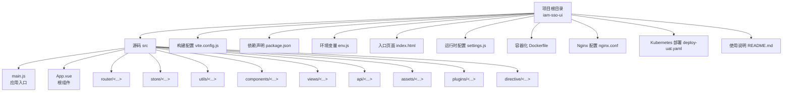
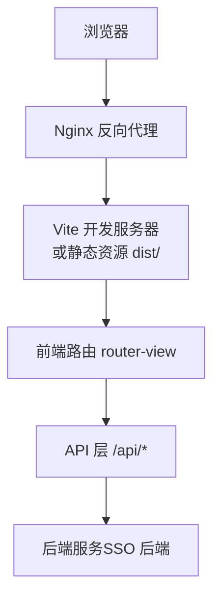
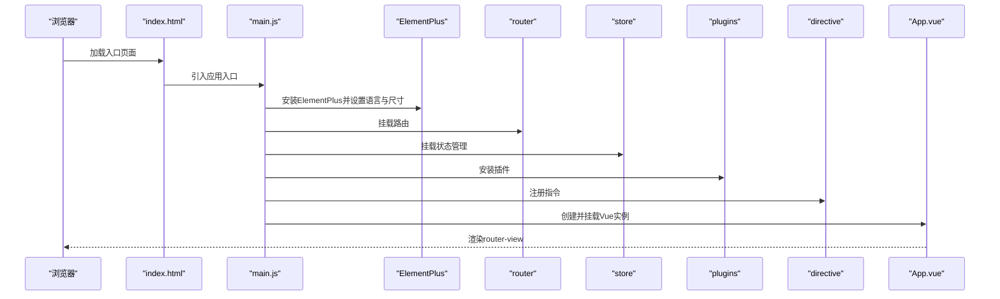
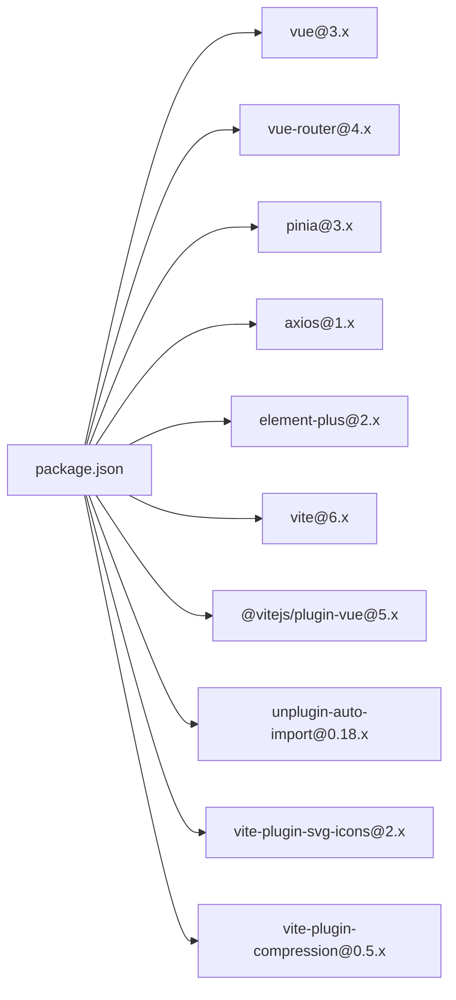

# 应用架构与配置

<cite>
**本文引用的文件**
- [package.json](file://iam-sso-ui/package.json)
- [vite.config.js](file://iam-sso-ui/vite.config.js)
- [main.js](file://iam-sso-ui/src/main.js)
- [App.vue](file://iam-sso-ui/src/App.vue)
- [settings.js](file://iam-sso-ui/src/settings.js)
- [env.js](file://iam-sso-ui/env.js)
- [index.html](file://iam-sso-ui/index.html)
- [nginx.conf](file://iam-sso-ui/nginx.conf)
- [Dockerfile](file://iam-sso-ui/Dockerfile)
- [deploy-uat.yaml](file://iam-sso-ui/deploy-uat.yaml)
- [README.md](file://iam-sso-ui/README.md)
</cite>

## 目录
1. [简介](#简介)
2. [项目结构](#项目结构)
3. [核心组件](#核心组件)
4. [架构总览](#架构总览)
5. [详细组件分析](#详细组件分析)
6. [依赖分析](#依赖分析)
7. [性能考虑](#性能考虑)
8. [故障排查指南](#故障排查指南)
9. [结论](#结论)
10. [附录](#附录)

## 简介
本文件面向SSO前端应用（iam-sso-ui），系统性阐述基于Vue 3与Vite的前端架构设计与工程化配置。重点覆盖以下方面：
- 入口文件配置与应用初始化流程
- Vite构建工具的配置项、环境变量管理与插件体系
- 模块化组织结构、依赖管理与性能优化策略
- 开发与生产环境的配置、打包与部署最佳实践
- 路由、状态管理与API通信的配置示例路径

## 项目结构
iam-sso-ui采用典型的Vue 3单页应用（SPA）结构，结合Vite进行开发与构建。核心目录与文件如下：
- 根级配置：package.json、vite.config.js、env.js、index.html
- 源码目录：src（入口、路由、状态、工具、组件、视图等）
- 构建产物：dist（生产构建输出）
- 运维相关：Dockerfile、nginx.conf、deploy-uat.yaml、README.md

图表来源
- [vite.config.js:1-72](file://iam-sso-ui/vite.config.js#L1-L72)
- [package.json:1-53](file://iam-sso-ui/package.json#L1-L53)
- [main.js:1-107](file://iam-sso-ui/src/main.js#L1-L107)
- [settings.js:1-60](file://iam-sso-ui/src/settings.js#L1-L60)

章节来源
- [package.json:1-53](file://iam-sso-ui/package.json#L1-L53)
- [vite.config.js:1-72](file://iam-sso-ui/vite.config.js#L1-L72)
- [main.js:1-107](file://iam-sso-ui/src/main.js#L1-L107)
- [settings.js:1-60](file://iam-sso-ui/src/settings.js#L1-L60)

## 核心组件
本节聚焦应用启动与初始化的关键环节。

- 应用入口与初始化
  - 通过main.js完成Vue实例创建、Element Plus集成、全局组件与指令注册、路由与状态管理挂载、权限控制与SVG图标注册等。
  - 入口文件还统一引入了全局样式与工具函数，并设置Element Plus的本地化与尺寸默认值。

- 根组件与主题初始化
  - App.vue负责在挂载后按设置初始化主题样式，确保用户偏好与系统主题一致。

- 运行时配置
  - settings.js集中管理页面标题、侧边栏主题、导航模式、标签页、固定头部、Logo、动态标题与版权等界面行为开关。

章节来源
- [main.js:1-107](file://iam-sso-ui/src/main.js#L1-L107)
- [App.vue:1-16](file://iam-sso-ui/src/App.vue#L1-L16)
- [settings.js:1-60](file://iam-sso-ui/src/settings.js#L1-L60)

## 架构总览
下图展示了从浏览器到后端服务的请求链路与静态资源加载关系：

图表来源
- [vite.config.js:40-53](file://iam-sso-ui/vite.config.js#L40-L53)
- [nginx.conf](file://iam-sso-ui/nginx.conf)

## 详细组件分析

### Vite 构建与开发服务器配置
- 基础配置
  - base：应用部署的基础路径，默认“/”。
  - 别名：~指向项目根，@指向src，便于模块导入。
  - 扩展名：支持.mjs/.js/.ts/.jsx/.tsx/.json/.vue。
- 构建输出
  - 生产构建关闭内联SourceMap；chunk与entry命名含哈希；资源目录static。
  - 警告阈值提升至2MB，避免大体积包触发警告。
- 开发服务器
  - 端口80、host开启、自动打开浏览器。
  - 代理规则：将/api前缀转发至本地后端服务（默认8080），并移除前缀。
- CSS处理
  - 移除charset AtRule，避免重复字符集声明。

章节来源
- [vite.config.js:1-72](file://iam-sso-ui/vite.config.js#L1-L72)

### 环境变量与脚本
- 环境变量
  - 通过loadEnv(mode, process.cwd())加载对应模式的.env文件，供插件与构建使用。
  - settings.js读取title来自~/env，实现标题与部署环境的解耦。
- 构建脚本
  - dev：启动开发服务器。
  - build：生产构建。
  - build:stage：以staging模式构建。
  - preview：预览生产构建结果。

章节来源
- [vite.config.js:6-8](file://iam-sso-ui/vite.config.js#L6-L8)
- [settings.js:1](file://iam-sso-ui/src/settings.js#L1)
- [package.json:8-12](file://iam-sso-ui/package.json#L8-L12)

### 插件系统与扩展
- 插件聚合
  - 通过vite.plugins/index.js聚合多个插件，包括自动导入、SVG图标、压缩与setup扩展等。
- 插件职责
  - 自动导入：减少重复import，提升开发效率。
  - SVG图标：统一注册与使用SVG图标组件。
  - 压缩：生成期产物压缩，减小体积。
  - Setup扩展：增强Vue SFC的setup语法体验。

章节来源
- [vite.config.js:3](file://iam-sso-ui/vite.config.js#L3)
- [package.json:40-48](file://iam-sso-ui/package.json#L40-L48)

### 应用初始化流程

图表来源
- [main.js:65-106](file://iam-sso-ui/src/main.js#L65-L106)
- [App.vue:1-16](file://iam-sso-ui/src/App.vue#L1-L16)

### 路由、状态管理与API通信（配置示例路径）
- 路由配置
  - 示例路径：[路由入口与配置](file://iam-sso-ui/src/router)
- 状态管理（Pinia）
  - 示例路径：[状态模块集合](file://iam-sso-ui/src/store/modules)
  - [状态入口](file://iam-sso-ui/src/store/index.js)
- API通信
  - 请求封装与拦截器：[请求工具](file://iam-sso-ui/src/utils/request.js)
  - 接口模块：[系统接口](file://iam-sso-ui/src/api/system)
  - [通用接口](file://iam-sso-ui/src/api/common.js)
  - [SSO接口](file://iam-sso-ui/src/api/sso.js)

章节来源
- [main.js:11-12](file://iam-sso-ui/src/main.js#L11-L12)
- [main.js:16-17](file://iam-sso-ui/src/main.js#L16-L17)
- [main.js:91-97](file://iam-sso-ui/src/main.js#L91-L97)

### 权限控制与守卫
- 权限入口
  - [权限控制入口](file://iam-sso-ui/src/permission.js)
- 功能点
  - 在路由切换时执行鉴权逻辑，结合用户信息与菜单/权限数据进行访问控制。

章节来源
- [main.js:24](file://iam-sso-ui/src/main.js#L24)
- [permission.js](file://iam-sso-ui/src/permission.js)

### 主题与UI框架
- Element Plus
  - 已安装并配置中文字体与默认尺寸，同时提供深色主题CSS变量。
- 全局组件与指令
  - 在入口统一注册常用组件与自定义指令，减少重复导入。
- 主题初始化
  - App.vue在挂载后根据设置初始化主题样式。

章节来源
- [main.js:3-104](file://iam-sso-ui/src/main.js#L3-L104)
- [App.vue:9-14](file://iam-sso-ui/src/App.vue#L9-L14)

## 依赖分析
- 运行时依赖
  - Vue 3、Vue Router、Pinia、Element Plus、Axios等，构成应用基础能力。
- 开发依赖
  - Vite、@vitejs/plugin-vue、unplugin-auto-import、vite-plugin-svg-icons、vite-plugin-compression等，支撑开发体验与构建优化。
- 版本与兼容性
  - 通过overrides锁定部分依赖版本，保证编辑器Quill稳定。

图表来源
- [package.json:18-48](file://iam-sso-ui/package.json#L18-L48)

章节来源
- [package.json:1-53](file://iam-sso-ui/package.json#L1-L53)

## 性能考虑
- 构建优化
  - 关闭生产内联SourceMap，降低包体与调试成本。
  - 统一chunk命名与资源目录，利于CDN缓存与长缓存策略。
  - 提升chunkSizeWarningLimit，避免因第三方库体积导致误报。
- 依赖瘦身
  - 仅引入必要组件与插件，避免全量导入。
  - 使用自动导入与按需注册，减少冗余代码。
- 运行时优化
  - 将全局样式与常用组件在入口集中处理，避免重复加载。
  - 使用SVG图标替代多张图片，降低HTTP请求数。

章节来源
- [vite.config.js:25-39](file://iam-sso-ui/vite.config.js#L25-L39)
- [main.js:78-95](file://iam-sso-ui/src/main.js#L78-L95)

## 故障排查指南
- 代理无法访问后端
  - 检查server.proxy配置与目标地址是否可达；确认rewrite规则是否正确移除了/api前缀。
- 构建后页面空白或资源404
  - 确认base路径与部署路径一致；检查Nginx对dist目录的映射与静态资源路径。
- 开发服务器端口占用
  - 修改vite.config.js中的server.port或释放端口。
- 主题不生效
  - 确认App.vue已调用主题初始化逻辑，且settings.js中主题配置正确。
- 环境变量未生效
  - 确认.env文件存在且模式匹配；检查loadEnv加载顺序与变量命名。

章节来源
- [vite.config.js:40-53](file://iam-sso-ui/vite.config.js#L40-L53)
- [App.vue:9-14](file://iam-sso-ui/src/App.vue#L9-L14)
- [settings.js:1-60](file://iam-sso-ui/src/settings.js#L1-L60)

## 结论
本项目以Vue 3为核心，结合Vite实现高效开发与构建；通过统一的入口初始化、完善的插件体系与清晰的模块划分，形成可维护、可扩展的前端架构。配合Nginx与容器化部署，能够稳定地服务于SSO场景。建议在后续迭代中持续关注依赖升级、构建产物分析与运行时性能监控，以保持长期的工程健康度。

## 附录

### 开发环境配置
- 启动命令
  - npm run dev
- 本地代理
  - /api -> http://localhost:8080（rewrite移除前缀）

章节来源
- [package.json:8](file://iam-sso-ui/package.json#L8)
- [vite.config.js:45-52](file://iam-sso-ui/vite.config.js#L45-L52)

### 生产环境打包与部署
- 打包命令
  - npm run build
- 预览命令
  - npm run preview
- 部署方式
  - 静态托管：将dist目录部署至Nginx。
  - 容器化：使用Dockerfile构建镜像，结合deploy-uat.yaml进行编排部署。

章节来源
- [package.json:10-12](file://iam-sso-ui/package.json#L10-L12)
- [nginx.conf](file://iam-sso-ui/nginx.conf)
- [Dockerfile](file://iam-sso-ui/Dockerfile)
- [deploy-uat.yaml](file://iam-sso-ui/deploy-uat.yaml)

### 环境变量与页面标题
- 页面标题
  - 从~/env读取title，便于不同环境定制标题。
- 环境文件
  - 通过loadEnv(mode, process.cwd())加载对应模式的.env文件。

章节来源
- [settings.js:1](file://iam-sso-ui/src/settings.js#L1)
- [vite.config.js:6-8](file://iam-sso-ui/vite.config.js#L6-L8)