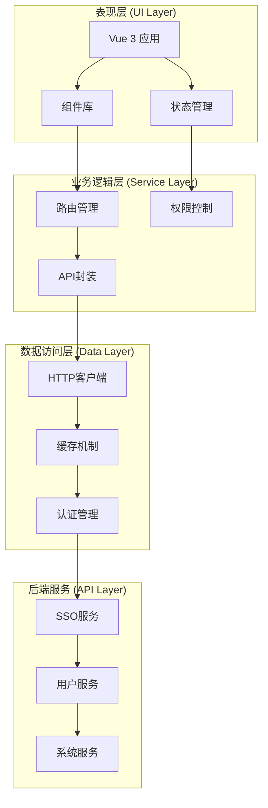
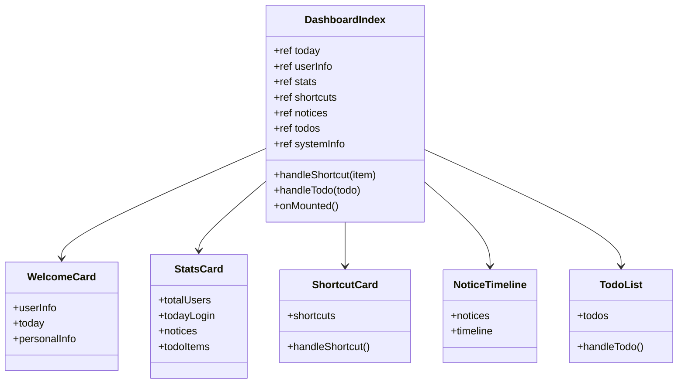
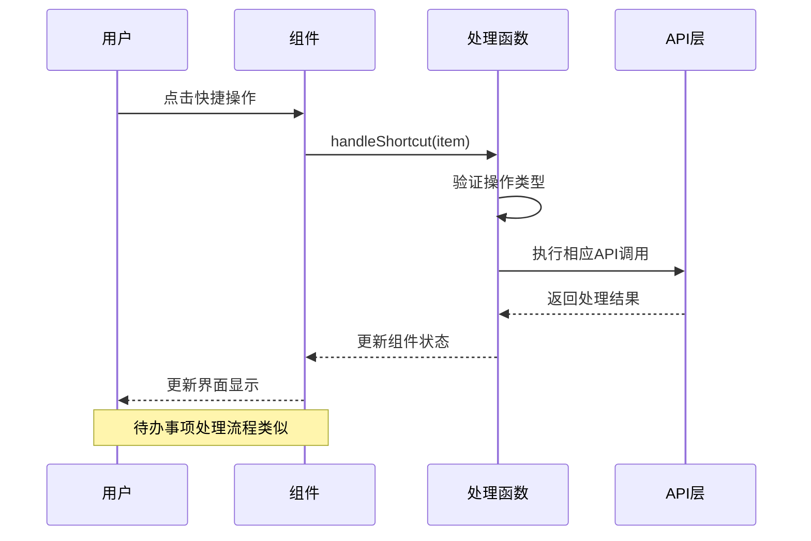
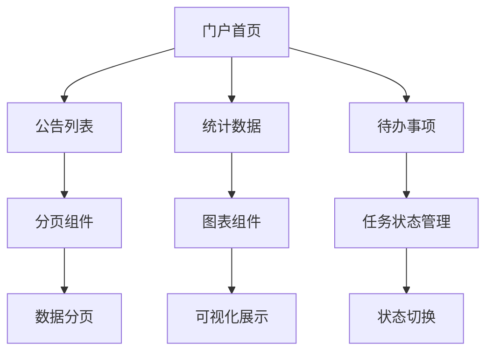
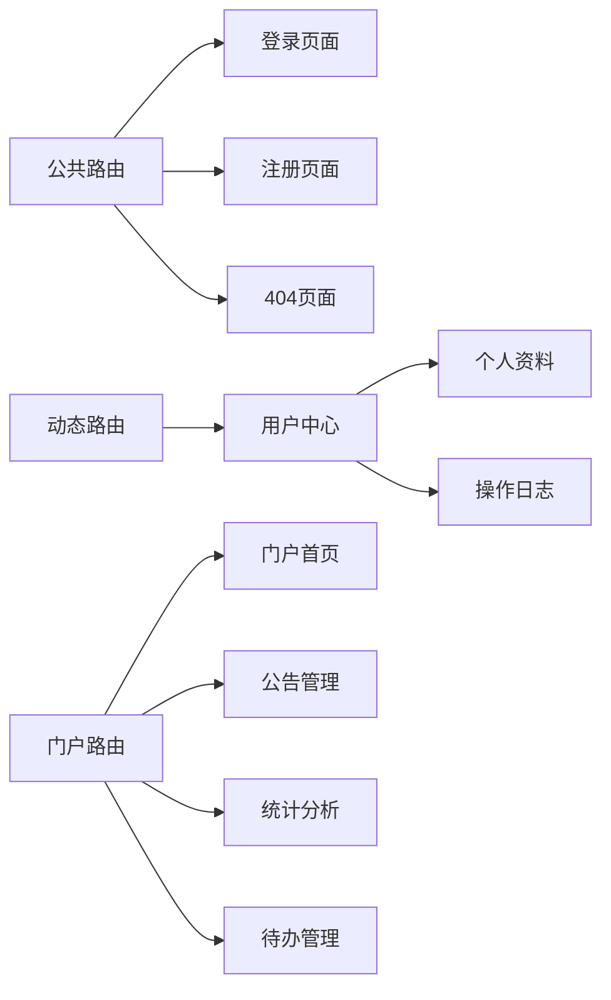
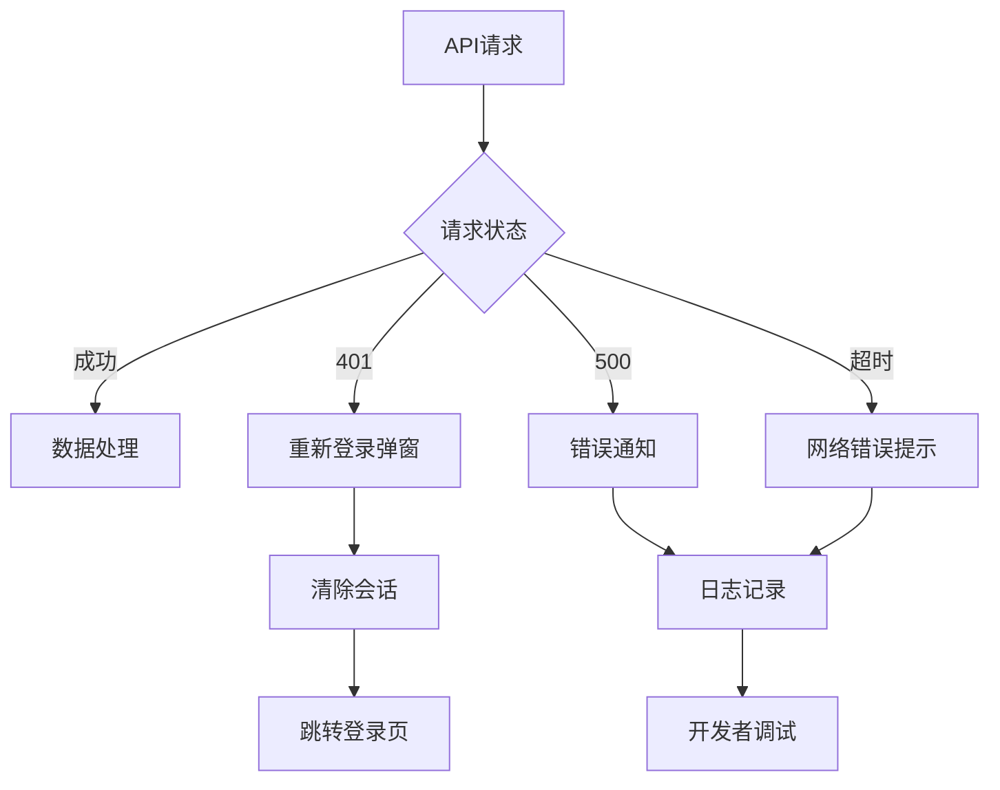
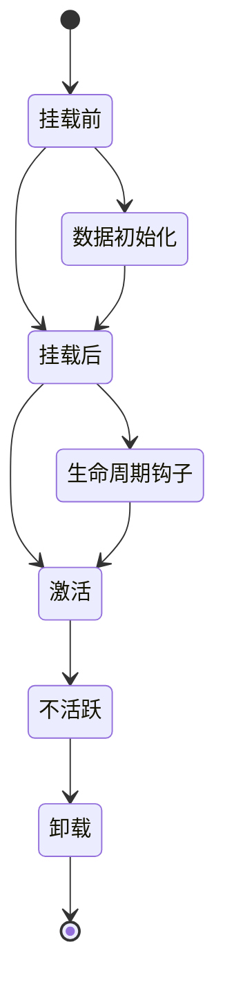

# 用户仪表盘与门户

<cite>
**本文档引用的文件**
- [index.vue](file://iam-sso-ui/src/views/dashboard/index.vue)
- [index.vue](file://iam-sso-ui/src/views/portal/index.vue)
- [notices.vue](file://iam-sso-ui/src/views/portal/notices.vue)
- [statistics.vue](file://iam-sso-ui/src/views/portal/statistics.vue)
- [todo-list.vue](file://iam-sso-ui/src/views/portal/todo-list.vue)
- [index.js](file://iam-sso-ui/src/router/index.js)
- [user.js](file://iam-sso-ui/src/store/modules/user.js)
- [request.js](file://iam-sso-ui/src/utils/request.js)
- [sso.js](file://iam-sso-ui/src/api/sso.js)
- [index.vue](file://iam-sso-ui/src/layout/index.vue)
- [main.js](file://iam-sso-ui/src/main.js)
- [package.json](file://iam-sso-ui/package.json)
</cite>

## 目录
1. [简介](#简介)
2. [项目结构](#项目结构)
3. [核心组件](#核心组件)
4. [架构概览](#架构概览)
5. [详细组件分析](#详细组件分析)
6. [依赖关系分析](#依赖关系分析)
7. [性能考虑](#性能考虑)
8. [故障排除指南](#故障排除指南)
9. [结论](#结论)
10. [附录](#附录)

## 简介
本文件为用户门户界面的详细实现文档，重点介绍用户仪表盘的设计架构，包括通知中心、统计信息和待办事项的功能实现。文档涵盖Vue组件的组织结构、数据绑定和事件处理机制，提供门户页面布局的完整代码示例（包括响应式设计、组件复用和状态管理），解释与后端API的数据交互、实时更新和错误处理策略，并包含用户体验优化、加载状态管理和性能监控方案。

## 项目结构
门户系统采用前后端分离架构，前端基于Vue 3 + Element Plus构建，后端提供RESTful API服务。项目主要目录结构如下：

```mermaid
graph TB
subgraph "前端应用 (iam-sso-ui)"
A[src/] --> B[views/]
A --> C[components/]
A --> D[layout/]
A --> E[router/]
A --> F[store/]
A --> G[utils/]
A --> H[api/]
B --> B1[dashboard/]
B --> B2[portal/]
B --> B3[user/]
B1 --> B11[index.vue]
B2 --> B21[index.vue]
B2 --> B22(notices.vue]
B2 --> B23(statistics.vue]
B2 --> B24(todo-list.vue]
end
subgraph "后端服务"
C1[/iam-sso/]
C2[/iam-admin/]
end
B -.->|"HTTP API"| C1
B -.->|"HTTP API"| C2
```

**图表来源**
- [index.vue:1-505](file://iam-sso-ui/src/views/dashboard/index.vue#L1-L505)
- [index.vue:1-23](file://iam-sso-ui/src/views/portal/index.vue#L1-L23)

**章节来源**
- [index.vue:1-505](file://iam-sso-ui/src/views/dashboard/index.vue#L1-L505)
- [index.vue:1-23](file://iam-sso-ui/src/views/portal/index.vue#L1-L23)
- [package.json:1-53](file://iam-sso-ui/package.json#L1-L53)

## 核心组件
门户系统的核心组件包括仪表盘主页面、门户首页以及三个功能模块页面。每个组件都采用Composition API风格编写，具备响应式设计和良好的可维护性。

### 仪表盘主组件
仪表盘主组件提供了完整的用户界面布局，包含欢迎信息、统计卡片、快捷操作、通知中心和系统信息等模块。组件使用Element Plus的卡片、统计组件和时间轴组件构建。

### 门户功能模块
门户功能模块包含四个独立页面：门户首页、公告列表、统计数据和待办事项列表。每个页面都遵循统一的布局规范和样式标准。

**章节来源**
- [index.vue:1-505](file://iam-sso-ui/src/views/dashboard/index.vue#L1-L505)
- [index.vue:1-23](file://iam-sso-ui/src/views/portal/index.vue#L1-L23)
- [notices.vue:1-23](file://iam-sso-ui/src/views/portal/notices.vue#L1-L23)
- [statistics.vue:1-23](file://iam-sso-ui/src/views/portal/statistics.vue#L1-L23)
- [todo-list.vue:1-23](file://iam-sso-ui/src/views/portal/todo-list.vue#L1-L23)

## 架构概览
门户系统的整体架构采用分层设计，从前端到后端形成清晰的职责边界：



**图表来源**
- [main.js:1-107](file://iam-sso-ui/src/main.js#L1-L107)
- [index.js:1-91](file://iam-sso-ui/src/router/index.js#L1-L91)
- [user.js:1-93](file://iam-sso-ui/src/store/modules/user.js#L1-L93)
- [request.js:1-182](file://iam-sso-ui/src/utils/request.js#L1-L182)

## 详细组件分析

### 仪表盘组件架构
仪表盘组件采用模块化设计，将不同的功能区域划分为独立的组件块：



**图表来源**
- [index.vue:221-305](file://iam-sso-ui/src/views/dashboard/index.vue#L221-L305)

#### 数据绑定机制
组件使用Vue 3的响应式系统实现数据绑定，通过ref和reactive实现状态管理：

- **本地状态管理**：使用ref创建响应式数据，如today、userInfo、stats等
- **模板绑定**：通过v-bind和v-model实现双向数据绑定
- **计算属性**：使用computed处理复杂的计算逻辑

#### 事件处理流程
组件采用事件驱动的方式处理用户交互：



**图表来源**
- [index.vue:282-292](file://iam-sso-ui/src/views/dashboard/index.vue#L282-L292)

**章节来源**
- [index.vue:1-505](file://iam-sso-ui/src/views/dashboard/index.vue#L1-L505)

### 门户页面组件
门户页面采用统一的布局模板，提供一致的用户体验：



**图表来源**
- [index.vue:1-23](file://iam-sso-ui/src/views/portal/index.vue#L1-L23)
- [notices.vue:1-23](file://iam-sso-ui/src/views/portal/notices.vue#L1-L23)
- [statistics.vue:1-23](file://iam-sso-ui/src/views/portal/statistics.vue#L1-L23)
- [todo-list.vue:1-23](file://iam-sso-ui/src/views/portal/todo-list.vue#L1-L23)

**章节来源**
- [index.vue:1-23](file://iam-sso-ui/src/views/portal/index.vue#L1-L23)
- [notices.vue:1-23](file://iam-sso-ui/src/views/portal/notices.vue#L1-L23)
- [statistics.vue:1-23](file://iam-sso-ui/src/views/portal/statistics.vue#L1-L23)
- [todo-list.vue:1-23](file://iam-sso-ui/src/views/portal/todo-list.vue#L1-L23)

### 路由与导航
门户系统采用Vue Router实现页面导航，支持动态路由和权限控制：



**图表来源**
- [index.js:28-77](file://iam-sso-ui/src/router/index.js#L28-L77)

**章节来源**
- [index.js:1-91](file://iam-sso-ui/src/router/index.js#L1-L91)

## 依赖关系分析
门户系统的依赖关系体现了清晰的分层架构：

```mermaid
graph TB
subgraph "运行时依赖"
A[vue@3.5.16]
B[vue-router@4.5.1]
C[element-plus@2.10.7]
D[pinia@3.0.2]
E[axios@1.9.0]
end
subgraph "开发依赖"
F[@vitejs/plugin-vue@5.2.4]
G[sass-embedded@1.89.1]
H[vite@6.3.5]
end
subgraph "工具库"
I[jsencrypt@3.3.2]
J[file-saver@2.0.5]
K[@vueuse/core@13.3.0]
end
A --> C
B --> A
D --> A
E --> A
F --> A
G --> F
H --> F
```

**图表来源**
- [package.json:18-48](file://iam-sso-ui/package.json#L18-L48)

**章节来源**
- [package.json:1-53](file://iam-sso-ui/package.json#L1-L53)

## 性能考虑
门户系统在性能优化方面采用了多项策略：

### 响应式设计
系统采用Element Plus的栅格系统实现响应式布局，支持多种屏幕尺寸：

- **移动端适配**：使用@media查询实现移动端优化
- **弹性布局**：采用Flexbox实现灵活的布局调整
- **组件自适应**：Element Plus组件自动适配不同屏幕尺寸

### 状态管理优化
Pinia状态管理提供了高效的响应式状态更新机制：

- **模块化存储**：按功能划分store模块，减少不必要的状态更新
- **计算属性缓存**：利用computed的缓存特性提升性能
- **异步状态管理**：合理处理异步数据加载和更新

### API调用优化
HTTP客户端实现了多项性能优化措施：

- **请求拦截器**：统一处理请求头和认证信息
- **响应缓存**：避免重复的API调用
- **错误重试机制**：在网络异常时提供重试能力

## 故障排除指南
门户系统提供了完善的错误处理和监控机制：

### 错误处理策略
系统采用多层次的错误处理策略：



**图表来源**
- [request.js:75-125](file://iam-sso-ui/src/utils/request.js#L75-L125)

### 加载状态管理
系统提供了丰富的加载状态指示：

- **全局加载**：使用Element Plus的Loading组件
- **局部加载**：针对特定组件的加载状态
- **骨架屏**：在数据加载前显示占位符

### 性能监控
系统集成了性能监控机制：

- **请求耗时统计**：记录API调用的响应时间
- **错误率监控**：跟踪系统的错误发生频率
- **用户行为追踪**：记录用户的操作行为

**章节来源**
- [request.js:1-182](file://iam-sso-ui/src/utils/request.js#L1-L182)

## 结论
用户门户界面采用现代化的Vue 3技术栈构建，实现了功能完善、性能优良的用户仪表盘系统。系统通过模块化的组件设计、完善的响应式布局和高效的状态管理，为用户提供了优秀的使用体验。同时，系统在安全性、可维护性和扩展性方面也具备良好的基础，能够满足未来业务发展的需求。

## 附录

### API接口规范
门户系统的主要API接口包括：

| 接口 | 方法 | 描述 | 参数 |
|------|------|------|------|
| /iam-sso/public/sso/login | POST | 用户登录 | username, password, captchaCode, captchaId |
| /iam-sso/user/info | GET | 获取用户信息 | token |
| /iam-sso/user/menu/tree/ruoyi | GET | 获取用户菜单树 | token |
| /iam-sso/public/captcha/chart | GET | 获取验证码图片 | 无 |

### 组件生命周期
门户组件遵循标准的Vue 3生命周期：



### 样式规范
系统采用SCSS预处理器，遵循以下样式规范：

- **命名规范**：使用BEM命名法
- **主题定制**：支持多主题切换
- **响应式断点**：基于Bootstrap的响应式设计