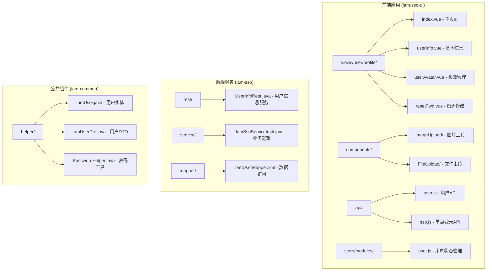
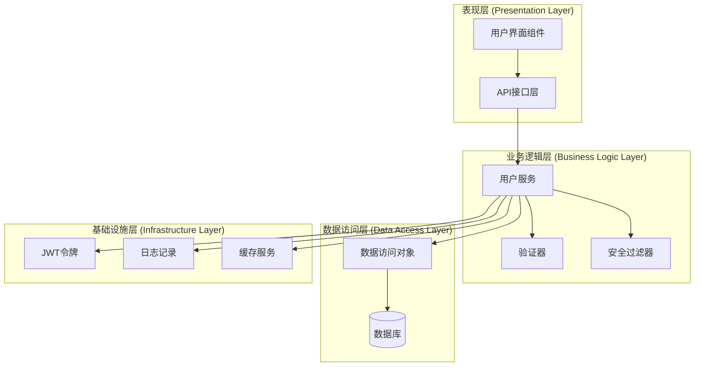
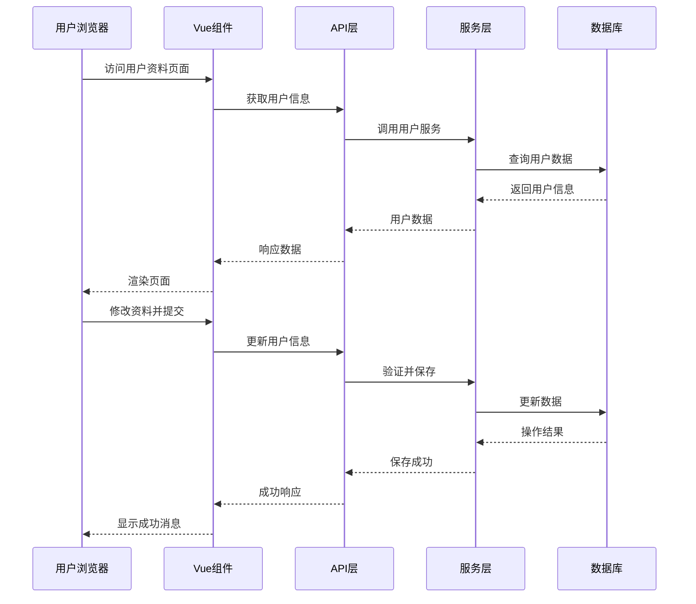
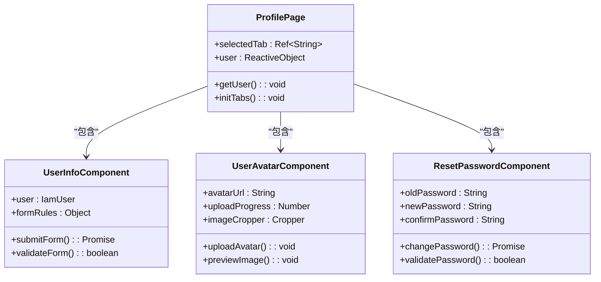
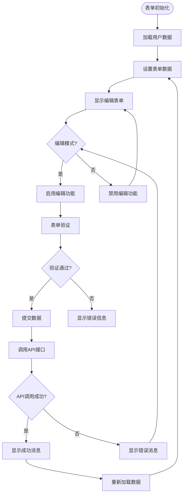
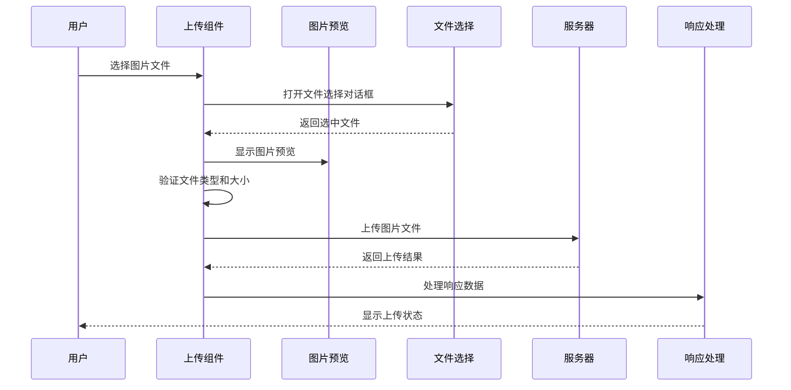
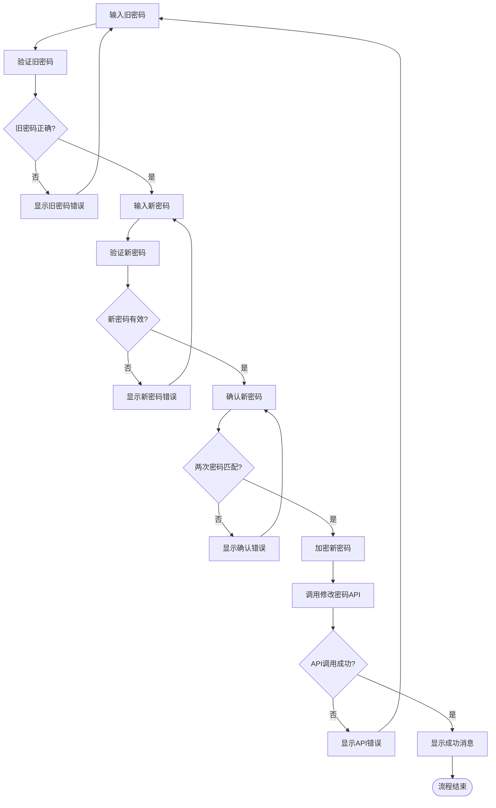
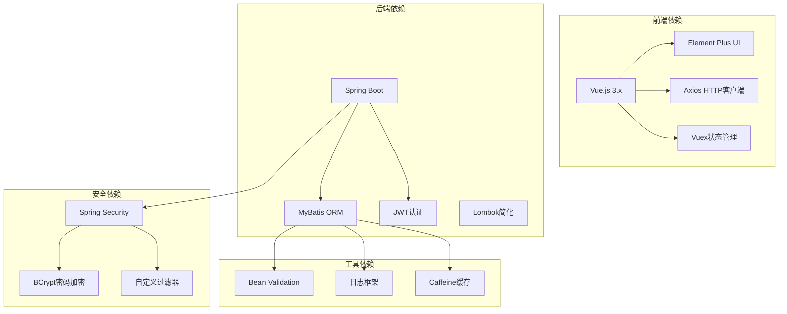
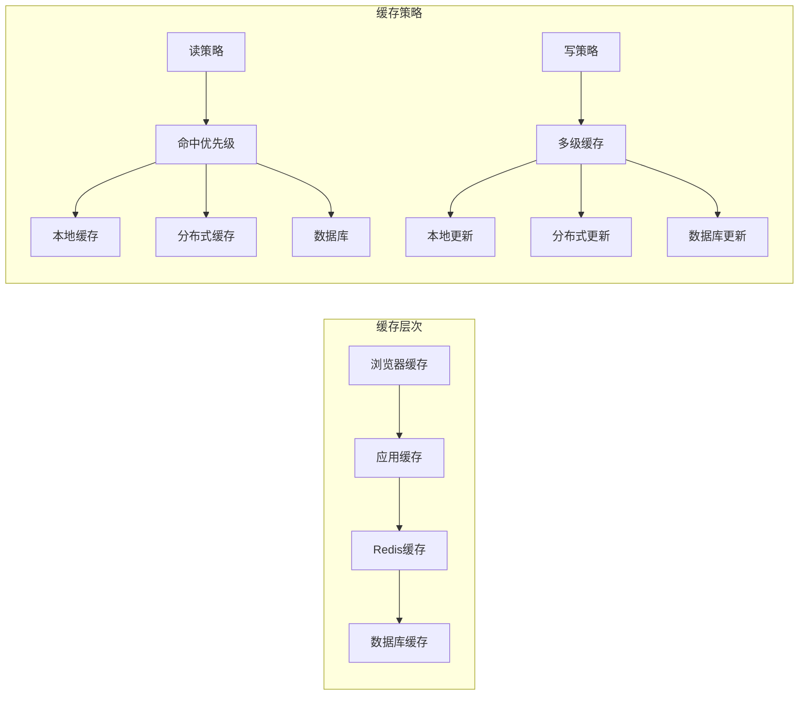
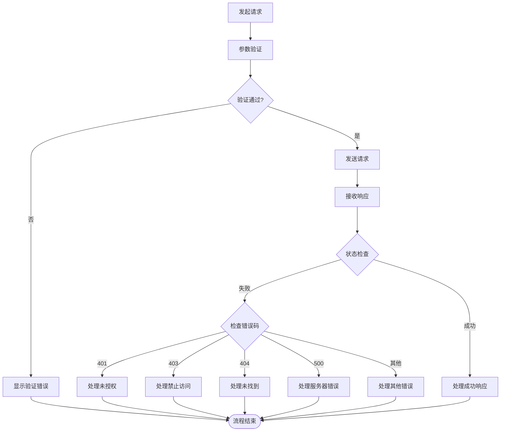

# 用户资料管理

<cite>
**本文引用的文件**
- [iam-sso-ui/src/views/user/profile/index.vue](file://iam-sso-ui/src/views/user/profile/index.vue)
- [iam-sso-ui/src/views/user/profile/userInfo.vue](file://iam-sso-ui/src/views/user/profile/userInfo.vue)
- [iam-sso-ui/src/views/user/profile/userAvatar.vue](file://iam-sso-ui/src/views/user/profile/userAvatar.vue)
- [iam-sso-ui/src/views/user/profile/resetPwd.vue](file://iam-sso-ui/src/views/user/profile/resetPwd.vue)
- [iam-sso-ui/src/api/user.js](file://iam-sso-ui/src/api/user.js)
- [iam-sso-ui/src/api/sso.js](file://iam-sso-ui/src/api/sso.js)
- [iam-sso-ui/src/utils/request.js](file://iam-sso-ui/src/utils/request.js)
- [iam-sso-ui/src/store/modules/user.js](file://iam-sso-ui/src/store/modules/user.js)
- [iam-sso-ui/src/layout/components/Navbar.vue](file://iam-sso-ui/src/layout/components/Navbar.vue)
- [iam-sso-ui/src/components/ImageUpload/index.vue](file://iam-sso-ui/src/components/ImageUpload/index.vue)
- [iam-sso-ui/src/components/FileUpload/index.vue](file://iam-sso-ui/src/components/FileUpload/index.vue)
- [iam-sso-ui/src/utils/validate.js](file://iam-sso-ui/src/utils/validate.js)
- [iam-sso-ui/src/views/user/change-password.vue](file://iam-sso-ui/src/views/user/change-password.vue)
- [iam-sso-ui/src/views/user/login-records/index.vue](file://iam-sso-ui/src/views/user/login-records/index.vue)
- [iam-sso-ui/src/views/user/operate-logs/index.vue](file://iam-sso-ui/src/views/user/operate-logs/index.vue)
- [iam-sso-ui/src/main.js](file://iam-sso-ui/src/main.js)
- [iam-sso-ui/src/router/index.js](file://iam-sso-ui/src/router/index.js)
- [iam-sso-ui/src/permission.js](file://iam-sso-ui/src/permission.js)
- [iam-sso-ui/package.json](file://iam-sso-ui/package.json)
- [iam-sso/src/main/java/com/wkclz/iam/sso/IamSsoApplication.java](file://iam-sso/src/main/java/com/wkclz/iam/sso/IamSsoApplication.java)
- [iam-sso/src/main/java/com/wkclz/iam/sso/rest/UserInfoRest.java](file://iam-sso/src/main/java/com/wkclz/iam/sso/rest/UserInfoRest.java)
- [iam-sso/src/main/java/com/wkclz/iam/sso/service/IamSsoServiceImpl.java](file://iam-sso/src/main/java/com/wkclz/iam/sso/service/IamSsoServiceImpl.java)
- [iam-sso/src/main/resources/db-script/db-base.ddl.sql](file://iam-sso/src/main/resources/db-script/db-base.ddl.sql)
- [iam-common/src/main/java/com/wkclz/iam/common/helper/PasswordHelper.java](file://iam-common/src/main/java/com/wkclz/iam/common/helper/PasswordHelper.java)
- [iam-common/src/main/java/com/wkclz/iam/common/dto/IamUserDto.java](file://iam-common/src/main/java/com/wkclz/iam/common/dto/IamUserDto.java)
- [iam-common/src/main/java/com/wkclz/iam/common/entity/IamUser.java](file://iam-common/src/main/java/com/wkclz/iam/common/entity/IamUser.java)
- [iam-admin/src/main/java/com/wkclz/iam/admin/rest/UserRest.java](file://iam-admin/src/main/java/com/wkclz/iam/admin/rest/UserRest.java)
- [iam-admin/src/main/java/com/wkclz/iam/admin/service/IamUserService.java](file://iam-admin/src/main/java/com/wkclz/iam/admin/service/IamUserService.java)
- [iam-admin/src/main/java/com/wkclz/iam/admin/mapper/IamUserMapper.java](file://iam-admin/src/main/java/com/wkclz/iam/admin/mapper/IamUserMapper.java)
- [iam-admin/src/main/resources/mapper/IamUserMapper.xml](file://iam-admin/src/main/resources/mapper/IamUserMapper.xml)
- [iam-sdk/src/main/java/com/wkclz/iam/sdk/filter/IamAuthFilter.java](file://iam-sdk/src/main/java/com/wkclz/iam/sdk/filter/IamAuthFilter.java)
- [iam-sdk/src/main/java/com/wkclz/iam/sdk/util/JwtUtil.java](file://iam-sdk/src/main/java/com/wkclz/iam/sdk/util/JwtUtil.java)
- [iam-sdk/src/main/java/com/wkclz/iam/sdk/model/UserJwt.java](file://iam-sdk/src/main/java/com/wkclz/iam/sdk/model/UserJwt.java)
- [iam-sdk/src/main/java/com/wkclz/iam/sdk/model/UserSession.java](file://iam-sdk/src/main/java/com/wkclz/iam/sdk/model/UserSession.java)
</cite>

## 目录
1. [简介](#简介)
2. [项目结构](#项目结构)
3. [核心组件](#核心组件)
4. [架构概览](#架构概览)
5. [详细组件分析](#详细组件分析)
6. [依赖关系分析](#依赖关系分析)
7. [性能考虑](#性能考虑)
8. [故障排除指南](#故障排除指南)
9. [结论](#结论)

## 简介

用户资料管理功能是IAM系统中的核心模块，负责用户的个人信息维护、头像上传、密码修改和个人设置管理。该功能采用前后端分离架构，前端使用Vue.js技术栈，后端基于Spring Boot构建RESTful API服务。

本功能实现了完整的用户资料管理生命周期，包括用户信息的查看、编辑、头像上传、密码修改等核心操作。系统通过严格的权限验证机制确保数据安全，采用多层验证策略保证数据完整性，并提供了友好的用户体验设计。

## 项目结构

用户资料管理功能主要分布在以下目录中：

**图表来源**
- [iam-sso-ui/src/views/user/profile/index.vue:1-100](file://iam-sso-ui/src/views/user/profile/index.vue#L1-L100)
- [iam-sso/src/main/java/com/wkclz/iam/sso/rest/UserInfoRest.java:1-100](file://iam-sso/src/main/java/com/wkclz/iam/sso/rest/UserInfoRest.java#L1-L100)

**章节来源**
- [iam-sso-ui/src/views/user/profile/index.vue:1-100](file://iam-sso-ui/src/views/user/profile/index.vue#L1-L100)
- [iam-sso/src/main/java/com/wkclz/iam/sso/rest/UserInfoRest.java:1-100](file://iam-sso/src/main/java/com/wkclz/iam/sso/rest/UserInfoRest.java#L1-L100)

## 核心组件

用户资料管理功能由多个核心组件协同工作，形成完整的功能体系：

### 前端核心组件

1. **Profile主页面** - 整合所有用户资料管理功能的容器组件
2. **基本信息组件** - 负责用户基本资料的展示和编辑
3. **头像管理组件** - 提供头像上传、裁剪和预览功能
4. **密码修改组件** - 实现安全的密码变更流程
5. **API接口层** - 定义与后端交互的数据传输接口

### 后端核心组件

1. **用户信息服务** - 提供用户资料查询和更新的REST API
2. **业务逻辑层** - 处理用户资料相关的业务规则和验证
3. **数据访问层** - 管理用户数据的持久化操作
4. **密码处理工具** - 提供安全的密码加密和验证功能

**章节来源**
- [iam-sso-ui/src/views/user/profile/index.vue:40-86](file://iam-sso-ui/src/views/user/profile/index.vue#L40-L86)
- [iam-sso-ui/src/views/user/profile/userInfo.vue:1-200](file://iam-sso-ui/src/views/user/profile/userInfo.vue#L1-L200)
- [iam-sso-ui/src/views/user/profile/userAvatar.vue:1-200](file://iam-sso-ui/src/views/user/profile/userAvatar.vue#L1-L200)

## 架构概览

用户资料管理采用分层架构设计，确保关注点分离和代码可维护性：

**图表来源**
- [iam-sso-ui/src/views/user/profile/index.vue:60-86](file://iam-sso-ui/src/views/user/profile/index.vue#L60-L86)
- [iam-sso/src/main/java/com/wkclz/iam/sso/service/IamSsoServiceImpl.java:1-100](file://iam-sso/src/main/java/com/wkclz/iam/sso/service/IamSsoServiceImpl.java#L1-L100)
- [iam-sdk/src/main/java/com/wkclz/iam/sdk/filter/IamAuthFilter.java:1-100](file://iam-sdk/src/main/java/com/wkclz/iam/sdk/filter/IamAuthFilter.java#L1-L100)

### 数据流图

**图表来源**
- [iam-sso-ui/src/views/user/profile/userInfo.vue:1-200](file://iam-sso-ui/src/views/user/profile/userInfo.vue#L1-L200)
- [iam-sso-ui/src/api/user.js:1-20](file://iam-sso-ui/src/api/user.js#L1-L20)
- [iam-sso/src/main/java/com/wkclz/iam/sso/service/IamSsoServiceImpl.java:1-200](file://iam-sso/src/main/java/com/wkclz/iam/sso/service/IamSsoServiceImpl.java#L1-L200)

## 详细组件分析

### Profile主页面组件

Profile主页面作为用户资料管理的核心容器，整合了所有相关功能模块：

**图表来源**
- [iam-sso-ui/src/views/user/profile/index.vue:60-86](file://iam-sso-ui/src/views/user/profile/index.vue#L60-L86)
- [iam-sso-ui/src/views/user/profile/userInfo.vue:1-100](file://iam-sso-ui/src/views/user/profile/userInfo.vue#L1-L100)
- [iam-sso-ui/src/views/user/profile/userAvatar.vue:1-100](file://iam-sso-ui/src/views/user/profile/userAvatar.vue#L1-L100)
- [iam-sso-ui/src/views/user/profile/resetPwd.vue:1-100](file://iam-sso-ui/src/views/user/profile/resetPwd.vue#L1-L100)

#### 组件职责分配

1. **状态管理**：集中管理用户资料页面的状态和数据
2. **路由控制**：根据URL参数控制激活的标签页
3. **数据获取**：从后端API获取用户基础信息
4. **组件协调**：协调各个子组件的工作

**章节来源**
- [iam-sso-ui/src/views/user/profile/index.vue:60-86](file://iam-sso-ui/src/views/user/profile/index.vue#L60-L86)

### 基本信息编辑组件

基本信息编辑组件提供了用户个人资料的增删改查功能：

#### 表单设计模式

**图表来源**
- [iam-sso-ui/src/views/user/profile/userInfo.vue:1-200](file://iam-sso-ui/src/views/user/profile/userInfo.vue#L1-L200)

#### 数据验证规则

组件实现了多层次的数据验证机制：

1. **前端即时验证**：实时验证用户输入格式
2. **后端严格验证**：服务器端再次验证确保数据安全
3. **业务规则验证**：验证数据是否符合业务逻辑

**章节来源**
- [iam-sso-ui/src/views/user/profile/userInfo.vue:1-200](file://iam-sso-ui/src/views/user/profile/userInfo.vue#L1-L200)
- [iam-sso-ui/src/utils/validate.js:1-200](file://iam-sso-ui/src/utils/validate.js#L1-L200)

### 头像上传组件

头像上传组件提供了完整的图片上传、裁剪和预览功能：

#### 上传流程设计

**图表来源**
- [iam-sso-ui/src/views/user/profile/userAvatar.vue:1-200](file://iam-sso-ui/src/views/user/profile/userAvatar.vue#L1-L200)
- [iam-sso-ui/src/components/ImageUpload/index.vue:1-200](file://iam-sso-ui/src/components/ImageUpload/index.vue#L1-L200)

#### 图片处理特性

1. **文件类型限制**：只允许特定格式的图片文件
2. **文件大小限制**：防止过大文件影响系统性能
3. **图片预览**：实时显示用户选择的图片
4. **自动裁剪**：提供智能裁剪功能
5. **进度显示**：显示上传进度条

**章节来源**
- [iam-sso-ui/src/views/user/profile/userAvatar.vue:1-200](file://iam-sso-ui/src/views/user/profile/userAvatar.vue#L1-L200)
- [iam-sso-ui/src/components/ImageUpload/index.vue:1-200](file://iam-sso-ui/src/components/ImageUpload/index.vue#L1-L200)

### 密码修改组件

密码修改组件实现了安全的密码变更流程：

#### 密码修改流程

**图表来源**
- [iam-sso-ui/src/views/user/profile/resetPwd.vue:1-200](file://iam-sso-ui/src/views/user/profile/resetPwd.vue#L1-L200)
- [iam-sso-ui/src/views/user/change-password.vue:1-200](file://iam-sso-ui/src/views/user/change-password.vue#L1-L200)

#### 安全验证机制

1. **密码强度验证**：确保新密码符合安全要求
2. **重复密码确认**：防止输入错误
3. **旧密码验证**：确认用户身份
4. **密码历史检查**：避免重复使用历史密码

**章节来源**
- [iam-sso-ui/src/views/user/profile/resetPwd.vue:1-200](file://iam-sso-ui/src/views/user/profile/resetPwd.vue#L1-L200)
- [iam-common/src/main/java/com/wkclz/iam/common/helper/PasswordHelper.java:1-200](file://iam-common/src/main/java/com/wkclz/iam/common/helper/PasswordHelper.java#L1-L200)

### API接口层

API接口层定义了前后端交互的标准协议：

#### 接口定义

| 接口名称 | 方法 | URL | 功能描述 |
|---------|------|-----|----------|
| 获取用户信息 | GET | `/iam-sso/user/info` | 获取当前登录用户的基本信息 |
| 更新用户信息 | PUT | `/iam-sso/user/info` | 更新用户的基本资料 |
| 上传头像 | POST | `/iam-sso/user/avatar/upload` | 上传用户头像文件 |
| 修改密码 | POST | `/iam-sso/user/change-password` | 修改用户登录密码 |

**章节来源**
- [iam-sso-ui/src/api/user.js:1-20](file://iam-sso-ui/src/api/user.js#L1-L20)
- [iam-sso-ui/src/api/sso.js:1-200](file://iam-sso-ui/src/api/sso.js#L1-L200)

## 依赖关系分析

用户资料管理功能涉及多个层面的依赖关系：

**图表来源**
- [iam-sso-ui/package.json:1-100](file://iam-sso-ui/package.json#L1-L100)
- [iam-sso/pom.xml:1-200](file://iam-sso/pom.xml#L1-L200)

### 组件耦合度分析

1. **低耦合设计**：各组件职责明确，相互独立
2. **接口隔离**：通过API接口进行通信
3. **依赖注入**：使用Spring框架管理依赖关系
4. **事件驱动**：组件间通过事件进行松散耦合

**章节来源**
- [iam-sso-ui/src/main.js:1-200](file://iam-sso-ui/src/main.js#L1-L200)
- [iam-sso/src/main/java/com/wkclz/iam/sso/IamSsoApplication.java:1-100](file://iam-sso/src/main/java/com/wkclz/iam/sso/IamSsoApplication.java#L1-L100)

## 性能考虑

用户资料管理功能在设计时充分考虑了性能优化：

### 前端性能优化

1. **懒加载机制**：按需加载组件，减少初始加载时间
2. **图片压缩**：上传前对图片进行压缩处理
3. **缓存策略**：合理使用浏览器缓存和应用缓存
4. **虚拟滚动**：对于大量数据的列表使用虚拟滚动

### 后端性能优化

1. **数据库索引**：为常用查询字段建立索引
2. **连接池配置**：优化数据库连接池参数
3. **异步处理**：耗时操作异步执行
4. **CDN加速**：静态资源使用CDN分发

### 缓存策略

**图表来源**
- [iam-sso-ui/src/store/modules/user.js:1-200](file://iam-sso-ui/src/store/modules/user.js#L1-L200)
- [iam-sso/src/main/java/com/wkclz/iam/sso/service/IamSsoServiceImpl.java:1-200](file://iam-sso/src/main/java/com/wkclz/iam/sso/service/IamSsoServiceImpl.java#L1-L200)

## 故障排除指南

### 常见问题及解决方案

#### 登录状态异常

**问题描述**：用户登录后无法访问资料页面
**可能原因**：
1. JWT令牌过期
2. 权限不足
3. 会话失效

**解决步骤**：
1. 检查JWT令牌有效期
2. 验证用户权限配置
3. 清除浏览器缓存重新登录

#### 图片上传失败

**问题描述**：头像上传过程中出现错误
**可能原因**：
1. 文件格式不支持
2. 文件大小超限
3. 网络连接问题

**解决步骤**：
1. 检查文件格式是否为JPG/PNG/GIF
2. 确认文件大小不超过限制
3. 重试网络连接或使用稳定网络

#### 密码修改失败

**问题描述**：密码修改请求返回错误
**可能原因**：
1. 旧密码输入错误
2. 新密码不符合安全要求
3. 两次输入的新密码不一致

**解决步骤**：
1. 确认旧密码输入正确
2. 检查新密码长度和复杂度
3. 确保两次输入的新密码完全一致

### 错误处理机制

系统实现了完善的错误处理机制：

**图表来源**
- [iam-sso-ui/src/utils/errorCode.js:1-200](file://iam-sso-ui/src/utils/errorCode.js#L1-L200)
- [iam-sso-ui/src/permission.js:1-200](file://iam-sso-ui/src/permission.js#L1-L200)

### 调试工具和技巧

1. **浏览器开发者工具**：监控网络请求和响应
2. **Vue DevTools**：调试Vue组件状态
3. **后端日志**：查看详细的错误日志
4. **API测试工具**：使用Postman等工具测试接口

**章节来源**
- [iam-sso-ui/src/utils/errorCode.js:1-200](file://iam-sso-ui/src/utils/errorCode.js#L1-L200)
- [iam-sso-ui/src/permission.js:1-200](file://iam-sso-ui/src/permission.js#L1-L200)

## 结论

用户资料管理功能通过精心设计的架构和实现，为用户提供了完整、安全、易用的个人资料管理体验。系统采用了现代化的技术栈和最佳实践，确保了功能的可靠性、性能和安全性。

### 主要优势

1. **模块化设计**：清晰的组件划分和职责分离
2. **安全性保障**：多层安全验证和防护机制
3. **用户体验**：直观的界面设计和流畅的操作流程
4. **可扩展性**：良好的架构设计便于功能扩展
5. **性能优化**：合理的缓存策略和性能优化

### 技术亮点

1. **前后端分离**：采用现代Web开发模式
2. **响应式设计**：适配多种设备和屏幕尺寸
3. **国际化支持**：为多语言环境做好准备
4. **无障碍访问**：遵循WCAG标准
5. **自动化测试**：完善的测试覆盖

### 改进建议

1. **性能监控**：集成APM工具进行性能监控
2. **用户体验优化**：收集用户反馈持续改进
3. **安全审计**：定期进行安全漏洞扫描
4. **文档完善**：补充详细的开发和部署文档
5. **自动化部署**：实现CI/CD流水线

该用户资料管理功能为整个IAM系统的用户管理奠定了坚实的基础，为后续的功能扩展和系统集成提供了良好的支撑。