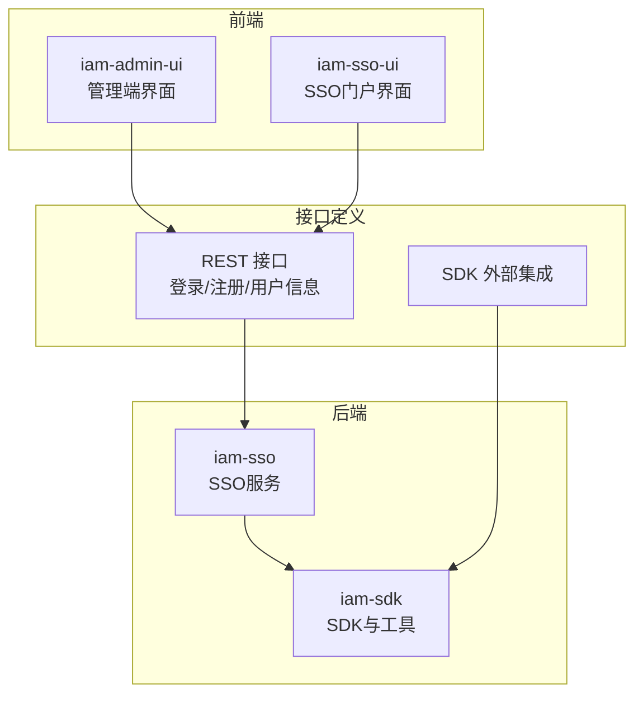
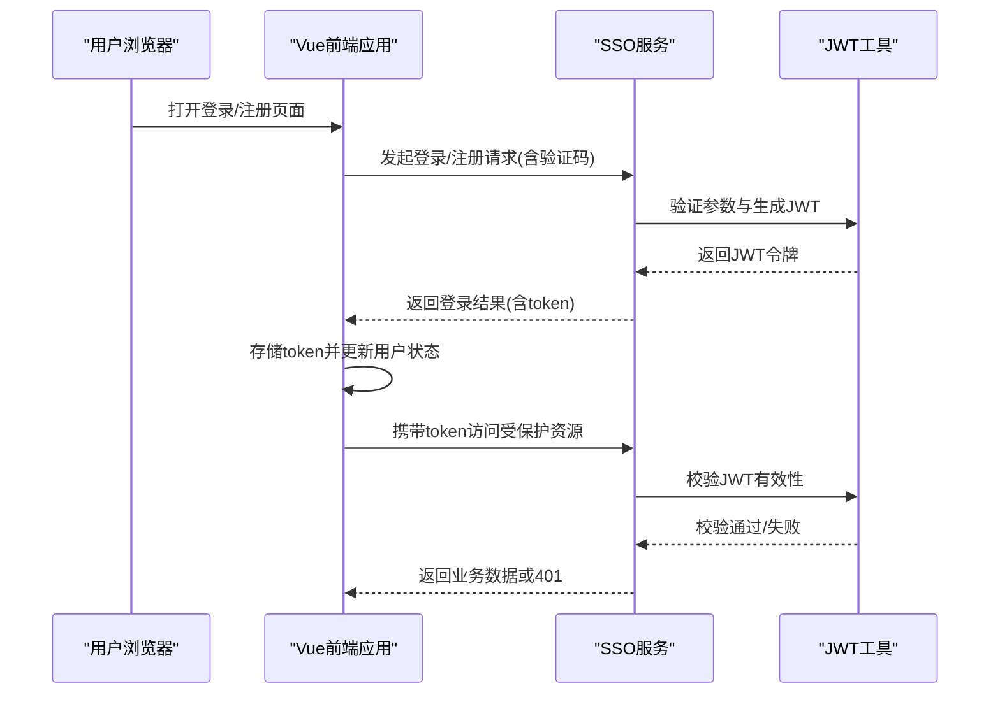
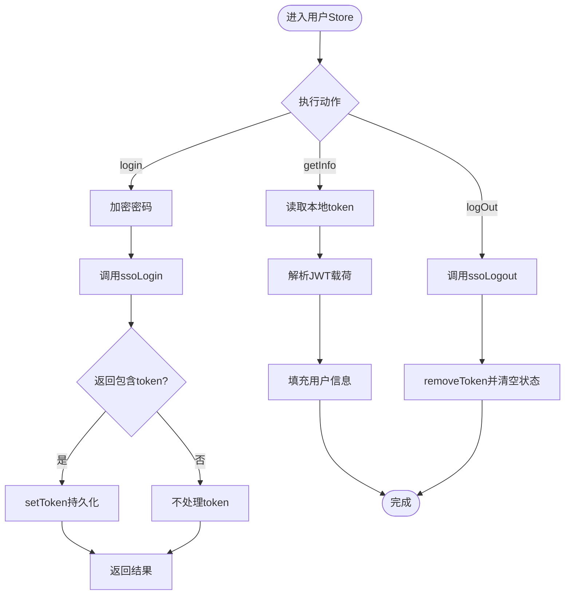
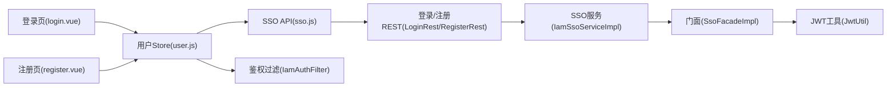

# 认证流程与状态管理

<cite>
**本文引用的文件**
- [iam-admin-ui/src/views/login.vue](file://iam-admin-ui/src/views/login.vue)
- [iam-sso-ui/src/views/login.vue](file://iam-sso-ui/src/views/login.vue)
- [iam-sso-ui/src/views/register.vue](file://iam-sso-ui/src/views/register.vue)
- [iam-admin-ui/src/store/modules/user.js](file://iam-admin-ui/src/store/modules/user.js)
- [iam-sso-ui/src/store/modules/user.js](file://iam-sso-ui/src/store/modules/user.js)
- [iam-admin-ui/src/api/sso.js](file://iam-admin-ui/src/api/sso.js)
- [iam-sso-ui/src/api/sso.js](file://iam-sso-ui/src/api/sso.js)
- [iam-admin-ui/src/utils/auth.js](file://iam-admin-ui/src/utils/auth.js)
- [iam-sso-ui/src/utils/auth.js](file://iam-sso-ui/src/utils/auth.js)
- [iam-admin-ui/src/permission.js](file://iam-admin-ui/src/permission.js)
- [iam-sso-ui/src/permission.js](file://iam-sso-ui/src/permission.js)
- [iam-sso/src/main/java/com/wkclz/iam/sso/rest/LoginRest.java](file://iam-sso/src/main/java/com/wkclz/iam/sso/rest/LoginRest.java)
- [iam-sso/src/main/java/com/wkclz/iam/sso/rest/RegisterRest.java](file://iam-sso/src/main/java/com/wkclz/iam/sso/rest/RegisterRest.java)
- [iam-sso/src/main/java/com/wkclz/iam/sso/service/IamSsoServiceImpl.java](file://iam-sso/src/main/java/com/wkclz/iam/sso/service/IamSsoServiceImpl.java)
- [iam-sso/src/main/java/com/wkclz/iam/sso/service/SsoFacadeImpl.java](file://iam-sso/src/main/java/com/wkclz/iam/sso/service/SsoFacadeImpl.java)
- [iam-sdk/src/main/java/com/wkclz/iam/sdk/util/JwtUtil.java](file://iam-sdk/src/main/java/com/wkclz/iam/sdk/util/JwtUtil.java)
- [iam-sdk/src/main/java/com/wkclz/iam/sdk/model/UserJwt.java](file://iam-sdk/src/main/java/com/wkclz/iam/sdk/model/UserJwt.java)
- [iam-sdk/src/main/java/com/wkclz/iam/sdk/facade/SsoFacade.java](file://iam-sdk/src/main/java/com/wkclz/iam/sdk/facade/SsoFacade.java)
- [iam-sdk/src/main/java/com/wkclz/iam/sdk/filter/IamAuthFilter.java](file://iam-sdk/src/main/java/com/wkclz/iam/sdk/filter/IamAuthFilter.java)
</cite>

## 目录
1. [简介](#简介)
2. [项目结构](#项目结构)
3. [核心组件](#核心组件)
4. [架构总览](#架构总览)
5. [详细组件分析](#详细组件分析)
6. [依赖关系分析](#依赖关系分析)
7. [性能考虑](#性能考虑)
8. [故障排除指南](#故障排除指南)
9. [结论](#结论)

## 简介
本技术文档围绕SSO（单点登录）认证流程进行系统化梳理，覆盖用户登录与注册的完整链路，包括前端表单校验、API调用、状态更新与持久化；后端服务的鉴权过滤、JWT签发与校验；以及前端Vuex Store对用户状态的统一管理与路由守卫配合。文档同时给出登录/注册表单的字段校验规则、错误处理策略与用户体验优化建议，并补充安全注意事项、令牌过期处理与自动登出机制。

## 项目结构
本仓库采用多模块分层设计：前端分为管理端UI与SSO门户UI，后端分为SSO服务与SDK公共能力，形成“前端-接口-服务-工具”的清晰边界。

图表来源
- [iam-admin-ui/src/views/login.vue:1-188](file://iam-admin-ui/src/views/login.vue#L1-L188)
- [iam-sso-ui/src/views/login.vue:1-188](file://iam-sso-ui/src/views/login.vue#L1-L188)
- [iam-sso/src/main/java/com/wkclz/iam/sso/rest/LoginRest.java](file://iam-sso/src/main/java/com/wkclz/iam/sso/rest/LoginRest.java)
- [iam-sdk/src/main/java/com/wkclz/iam/sdk/util/JwtUtil.java](file://iam-sdk/src/main/java/com/wkclz/iam/sdk/util/JwtUtil.java)

章节来源
- [iam-admin-ui/src/views/login.vue:1-188](file://iam-admin-ui/src/views/login.vue#L1-L188)
- [iam-sso-ui/src/views/login.vue:1-188](file://iam-sso-ui/src/views/login.vue#L1-L188)
- [iam-sso-ui/src/views/register.vue:1-194](file://iam-sso-ui/src/views/register.vue#L1-L194)

## 核心组件
- 前端登录页与注册页：负责表单渲染、字段校验、验证码加载与提交。
- Vuex 用户Store：封装登录、获取用户信息、退出登录等动作，统一管理用户态。
- API 层：封装SSO相关HTTP请求，如登录、注册、验证码、登出。
- 后端SSO服务：提供登录/注册REST接口、会话与令牌管理、鉴权过滤器。
- SDK 工具：JWT工具类、鉴权过滤器、门面接口等。

章节来源
- [iam-admin-ui/src/store/modules/user.js:1-93](file://iam-admin-ui/src/store/modules/user.js#L1-L93)
- [iam-sso-ui/src/store/modules/user.js:1-93](file://iam-sso-ui/src/store/modules/user.js#L1-L93)
- [iam-admin-ui/src/api/sso.js](file://iam-admin-ui/src/api/sso.js)
- [iam-sso-ui/src/api/sso.js](file://iam-sso-ui/src/api/sso.js)

## 架构总览
下图展示从浏览器到后端服务的认证交互路径，包括登录、注册、令牌发放与校验、路由守卫拦截等关键环节。

图表来源
- [iam-sso-ui/src/views/login.vue:78-107](file://iam-sso-ui/src/views/login.vue#L78-L107)
- [iam-sso-ui/src/views/register.vue:93-113](file://iam-sso-ui/src/views/register.vue#L93-L113)
- [iam-sso/src/main/java/com/wkclz/iam/sso/rest/LoginRest.java](file://iam-sso/src/main/java/com/wkclz/iam/sso/rest/LoginRest.java)
- [iam-sdk/src/main/java/com/wkclz/iam/sdk/util/JwtUtil.java](file://iam-sdk/src/main/java/com/wkclz/iam/sdk/util/JwtUtil.java)

## 详细组件分析

### 登录表单与注册表单
- 登录表单字段与校验
  - 账号/用户名：必填
  - 密码：必填
  - 验证码：按需显示，输入后参与登录请求
- 注册表单字段与校验
  - 邮件地址：必填且格式校验
  - 密码：必填，长度与字符集限制
  - 确认密码：必填，需与密码一致
  - 验证码：必填
- 表单提交流程
  - 登录：前端调用登录API，成功后根据返回状态决定是否刷新验证码并跳转
  - 注册：前端调用注册API，成功弹窗提示并跳转至登录页
- 错误处理与体验
  - 提交时显示加载态，失败后刷新验证码
  - 支持回车键快速提交
  - 友好的错误提示与引导

章节来源
- [iam-admin-ui/src/views/login.vue:54-107](file://iam-admin-ui/src/views/login.vue#L54-L107)
- [iam-sso-ui/src/views/login.vue:54-107](file://iam-sso-ui/src/views/login.vue#L54-L107)
- [iam-sso-ui/src/views/register.vue:56-122](file://iam-sso-ui/src/views/register.vue#L56-L122)

### Vuex Store 与用户状态管理
- Store 状态
  - userCode、username、nickname、avatar
- 关键动作
  - 登录：加密密码、携带验证码与token返回值，设置本地token
  - 获取用户信息：解析JWT载荷填充用户信息
  - 退出登录：调用登出接口并清除本地token
- 与API层协作
  - 统一通过ssoLogin/ssoLogout等API完成网络请求
  - 使用工具函数setToken/removeToken持久化令牌

图表来源
- [iam-admin-ui/src/store/modules/user.js:18-88](file://iam-admin-ui/src/store/modules/user.js#L18-L88)
- [iam-sso-ui/src/store/modules/user.js:18-88](file://iam-sso-ui/src/store/modules/user.js#L18-L88)

章节来源
- [iam-admin-ui/src/store/modules/user.js:1-93](file://iam-admin-ui/src/store/modules/user.js#L1-L93)
- [iam-sso-ui/src/store/modules/user.js:1-93](file://iam-sso-ui/src/store/modules/user.js#L1-L93)

### JWT 令牌获取、存储与刷新策略
- 令牌获取
  - 登录成功后，后端返回包含token的响应，前端调用setToken保存
- 令牌存储
  - 通过工具函数持久化到本地存储，后续请求在拦截器中附加
- 令牌刷新
  - 当前实现未见显式的自动刷新逻辑，建议在请求拦截器中检测过期并触发刷新
- 令牌校验
  - 后端通过IamAuthFilter与JwtUtil进行校验，确保请求合法性

章节来源
- [iam-admin-ui/src/utils/auth.js](file://iam-admin-ui/src/utils/auth.js)
- [iam-sso-ui/src/utils/auth.js](file://iam-sso-ui/src/utils/auth.js)
- [iam-sdk/src/main/java/com/wkclz/iam/sdk/util/JwtUtil.java](file://iam-sdk/src/main/java/com/wkclz/iam/sdk/util/JwtUtil.java)
- [iam-sdk/src/main/java/com/wkclz/iam/sdk/filter/IamAuthFilter.java](file://iam-sdk/src/main/java/com/wkclz/iam/sdk/filter/IamAuthFilter.java)

### 会话状态管理与路由守卫
- 路由守卫
  - 在进入受保护路由前检查token是否存在与有效
  - 无效则重定向至登录页并保留原路径参数
- 自动登出
  - 登出成功后清理token与用户状态，避免二次使用
- 权限控制
  - 结合用户角色/菜单进行细粒度权限判断（在权限模块中实现）

章节来源
- [iam-admin-ui/src/permission.js](file://iam-admin-ui/src/permission.js)
- [iam-sso-ui/src/permission.js](file://iam-sso-ui/src/permission.js)
- [iam-admin-ui/src/store/modules/user.js:77-88](file://iam-admin-ui/src/store/modules/user.js#L77-L88)
- [iam-sso-ui/src/store/modules/user.js:77-88](file://iam-sso-ui/src/store/modules/user.js#L77-L88)

### 后端服务与接口
- 登录接口
  - 校验用户名/密码与验证码，通过后签发JWT并返回
- 注册接口
  - 校验邮箱、密码强度与一致性，生成注册请求并返回结果
- 服务实现
  - IamSsoServiceImpl负责具体业务逻辑
  - SsoFacadeImpl对外提供统一门面
- 安全过滤
  - IamAuthFilter拦截请求，校验JWT有效性

章节来源
- [iam-sso/src/main/java/com/wkclz/iam/sso/rest/LoginRest.java](file://iam-sso/src/main/java/com/wkclz/iam/sso/rest/LoginRest.java)
- [iam-sso/src/main/java/com/wkclz/iam/sso/rest/RegisterRest.java](file://iam-sso/src/main/java/com/wkclz/iam/sso/rest/RegisterRest.java)
- [iam-sso/src/main/java/com/wkclz/iam/sso/service/IamSsoServiceImpl.java](file://iam-sso/src/main/java/com/wkclz/iam/sso/service/IamSsoServiceImpl.java)
- [iam-sso/src/main/java/com/wkclz/iam/sso/service/SsoFacadeImpl.java](file://iam-sso/src/main/java/com/wkclz/iam/sso/service/SsoFacadeImpl.java)
- [iam-sdk/src/main/java/com/wkclz/iam/sdk/facade/SsoFacade.java](file://iam-sdk/src/main/java/com/wkclz/iam/sdk/facade/SsoFacade.java)

## 依赖关系分析
- 前端依赖
  - 视图组件依赖Store与API层
  - Store依赖工具层（auth.js）与API层（sso.js）
  - 路由守卫依赖Store与API层
- 后端依赖
  - REST层依赖服务实现与门面
  - 服务实现依赖SDK工具（JWT、过滤器）
- 数据流
  - 前端：视图 -> Store -> API -> 后端 -> Store更新
  - 后端：请求 -> 过滤器 -> 业务服务 -> JWT工具 -> 响应

图表来源
- [iam-sso-ui/src/views/login.vue:42-52](file://iam-sso-ui/src/views/login.vue#L42-L52)
- [iam-sso-ui/src/views/register.vue:47-54](file://iam-sso-ui/src/views/register.vue#L47-L54)
- [iam-sso-ui/src/store/modules/user.js:8-6](file://iam-sso-ui/src/store/modules/user.js#L8-L6)
- [iam-sso/src/main/java/com/wkclz/iam/sso/rest/LoginRest.java](file://iam-sso/src/main/java/com/wkclz/iam/sso/rest/LoginRest.java)
- [iam-sso/src/main/java/com/wkclz/iam/sso/rest/RegisterRest.java](file://iam-sso/src/main/java/com/wkclz/iam/sso/rest/RegisterRest.java)
- [iam-sso/src/main/java/com/wkclz/iam/sso/service/IamSsoServiceImpl.java](file://iam-sso/src/main/java/com/wkclz/iam/sso/service/IamSsoServiceImpl.java)
- [iam-sso/src/main/java/com/wkclz/iam/sso/service/SsoFacadeImpl.java](file://iam-sso/src/main/java/com/wkclz/iam/sso/service/SsoFacadeImpl.java)
- [iam-sdk/src/main/java/com/wkclz/iam/sdk/util/JwtUtil.java](file://iam-sdk/src/main/java/com/wkclz/iam/sdk/util/JwtUtil.java)
- [iam-sdk/src/main/java/com/wkclz/iam/sdk/filter/IamAuthFilter.java](file://iam-sdk/src/main/java/com/wkclz/iam/sdk/filter/IamAuthFilter.java)

## 性能考虑
- 前端
  - 表单校验尽量在客户端完成，减少无效请求
  - 加密操作在前端完成，避免明文传输
  - 成功后延迟跳转可提升用户体验
- 后端
  - JWT签发与校验应保持低延迟
  - 验证码缓存与图片生成需优化IO
  - 登录/注册日志记录避免阻塞主流程

## 故障排除指南
- 登录失败
  - 检查用户名/密码/验证码是否正确
  - 查看返回的登录状态与消息，必要时刷新验证码
- 令牌无效
  - 确认本地token存在且格式正确
  - 检查后端JWT签名与过期时间
- 401未授权
  - 路由守卫是否正确拦截并重定向
  - 登出后是否清理了token与用户状态
- 注册无反馈
  - 确认注册接口调用成功并弹窗提示
  - 检查邮箱格式与密码强度规则

章节来源
- [iam-admin-ui/src/views/login.vue:83-104](file://iam-admin-ui/src/views/login.vue#L83-L104)
- [iam-sso-ui/src/views/register.vue:97-110](file://iam-sso-ui/src/views/register.vue#L97-L110)
- [iam-admin-ui/src/store/modules/user.js:39-47](file://iam-admin-ui/src/store/modules/user.js#L39-L47)
- [iam-sso-ui/src/store/modules/user.js:39-47](file://iam-sso-ui/src/store/modules/user.js#L39-L47)

## 结论
本SSO认证体系从前端表单校验到后端JWT鉴权形成了完整的闭环。前端通过Store统一管理用户状态，结合路由守卫实现安全访问；后端通过过滤器与服务层保障令牌有效性与业务安全。建议后续完善令牌自动刷新与过期处理机制，进一步提升安全性与用户体验。