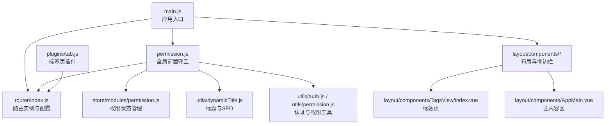
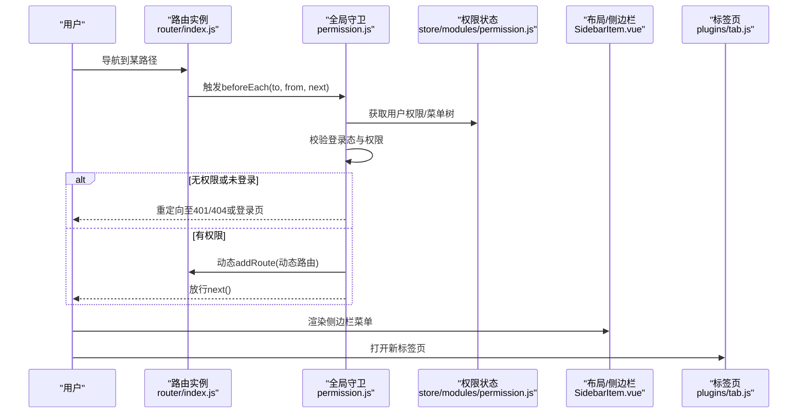
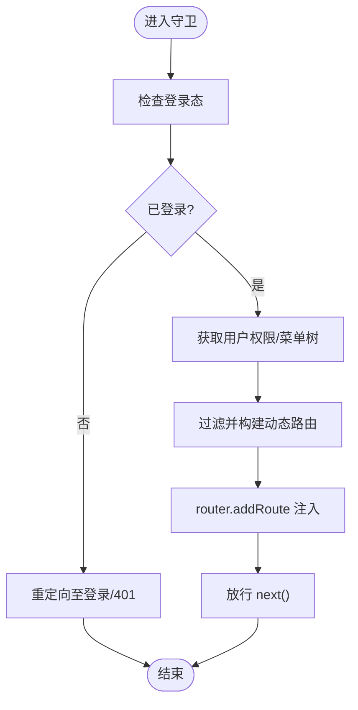
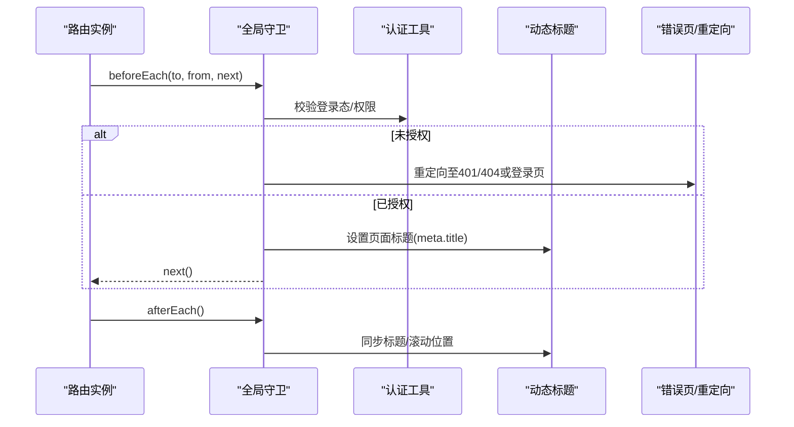
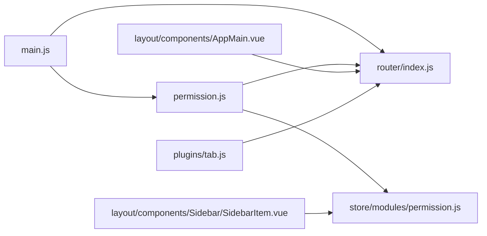

# 路由与导航

<cite>
**本文引用的文件**
- [main.js](file://iam-admin-ui/src/main.js)
- [permission.js](file://iam-admin-ui/src/permission.js)
- [router/index.js](file://iam-admin-ui/src/router/index.js)
- [store/modules/permission.js](file://iam-admin-ui/src/store/modules/permission.js)
- [plugins/tab.js](file://iam-admin-ui/src/plugins/tab.js)
- [layout/components/Sidebar/SidebarItem.vue](file://iam-admin-ui/src/layout/components/Sidebar/SidebarItem.vue)
- [layout/components/TagsView/index.vue](file://iam-admin-ui/src/layout/components/TagsView/index.vue)
- [layout/components/AppMain.vue](file://iam-admin-ui/src/layout/components/AppMain.vue)
- [views/error/401.vue](file://iam-admin-ui/src/views/error/401.vue)
- [views/error/404.vue](file://iam-admin-ui/src/views/error/404.vue)
- [views/redirect/index.vue](file://iam-admin-ui/src/views/redirect/index.vue)
- [utils/dynamicTitle.js](file://iam-admin-ui/src/utils/dynamicTitle.js)
- [utils/auth.js](file://iam-admin-ui/src/utils/auth.js)
- [utils/permission.js](file://iam-admin-ui/src/utils/permission.js)
- [vite.config.js](file://iam-admin-ui/vite.config.js)
- [package.json](file://iam-admin-ui/package.json)
- [sso.js](file://iam-admin-ui/src/api/sso.js)
- [user.js](file://iam-admin-ui/src/api/user.js)
- [settings.js](file://iam-admin-ui/src/settings.js)
</cite>

## 目录
1. [引言](#引言)
2. [项目结构](#项目结构)
3. [核心组件](#核心组件)
4. [架构总览](#架构总览)
5. [详细组件分析](#详细组件分析)
6. [依赖关系分析](#依赖关系分析)
7. [性能考虑](#性能考虑)
8. [故障排查指南](#故障排查指南)
9. [结论](#结论)
10. [附录](#附录)

## 引言
本文件面向SSO前端（iam-admin-ui）的路由系统，系统性阐述Vue Router在本项目中的配置与使用方式，覆盖路由定义、嵌套路由、动态路由、路由守卫、权限控制、菜单生成与动态加载、导航拦截、懒加载、元信息配置、性能优化与缓存策略、以及SEO友好实践。文档以“循序渐进”的方式组织内容，既适合初学者快速上手，也为高级开发者提供深入的技术参考。

## 项目结构
SSO前端采用Vite+Vue3+Element Plus技术栈，路由系统位于iam-admin-ui/src/router，配合全局守卫、权限状态管理、标签页插件与布局组件共同构成完整的导航体系。关键位置如下：
- 路由入口与配置：iam-admin-ui/src/router/index.js
- 全局前置守卫与动态路由注入：iam-admin-ui/src/permission.js
- 应用挂载与路由注册：iam-admin-ui/src/main.js
- 权限状态管理（常量/动态路由集合、用户权限树）：iam-admin-ui/src/store/modules/permission.js
- 标签页导航与路由联动：iam-admin-ui/src/plugins/tab.js
- 布局与侧边栏菜单渲染：iam-admin-ui/src/layout/components/Sidebar/SidebarItem.vue
- 标题动态更新与SEO：iam-admin-ui/src/utils/dynamicTitle.js
- 认证与权限工具：iam-admin-ui/src/utils/auth.js、iam-admin-ui/src/utils/permission.js
- 错误页面与重定向视图：iam-admin-ui/src/views/error、iam-admin-ui/src/views/redirect

图表来源
- [main.js:1-120](file://iam-admin-ui/src/main.js#L1-L120)
- [router/index.js:1-120](file://iam-admin-ui/src/router/index.js#L1-L120)
- [permission.js:1-120](file://iam-admin-ui/src/permission.js#L1-L120)
- [store/modules/permission.js:1-120](file://iam-admin-ui/src/store/modules/permission.js#L1-L120)
- [plugins/tab.js:1-120](file://iam-admin-ui/src/plugins/tab.js#L1-L120)
- [layout/components/Sidebar/SidebarItem.vue:1-200](file://iam-admin-ui/src/layout/components/Sidebar/SidebarItem.vue#L1-L200)
- [layout/components/TagsView/index.vue:1-200](file://iam-admin-ui/src/layout/components/TagsView/index.vue#L1-L200)
- [layout/components/AppMain.vue:1-200](file://iam-admin-ui/src/layout/components/AppMain.vue#L1-L200)
- [utils/dynamicTitle.js:1-120](file://iam-admin-ui/src/utils/dynamicTitle.js#L1-L120)
- [utils/auth.js:1-200](file://iam-admin-ui/src/utils/auth.js#L1-L200)
- [utils/permission.js:1-200](file://iam-admin-ui/src/utils/permission.js#L1-L200)

章节来源
- [main.js:1-120](file://iam-admin-ui/src/main.js#L1-L120)
- [router/index.js:1-120](file://iam-admin-ui/src/router/index.js#L1-L120)

## 核心组件
- 路由实例与配置：在router/index.js中创建路由实例，定义常量路由与动态路由集合，并通过history模式挂载到应用。
- 全局前置守卫：在permission.js中实现登录态校验、权限校验与动态路由注入，确保仅向已授权用户开放可访问路由。
- 权限状态管理：store/modules/permission.js维护常量路由、动态路由、用户权限树与菜单树，供侧边栏与守卫使用。
- 标签页导航：plugins/tab.js基于当前路由进行标签页增删改查与跳转，提升多页面体验。
- 布局与菜单：SidebarItem.vue根据权限树渲染菜单；AppMain.vue承载页面内容；TagsView.vue展示当前打开的标签页。
- SEO与标题：dynamicTitle.js结合路由元信息动态设置页面标题，提升SEO友好度。
- 认证与权限工具：auth.js提供登录态判断与令牌处理；permission.js提供指令级权限判断能力。

章节来源
- [router/index.js:1-120](file://iam-admin-ui/src/router/index.js#L1-L120)
- [permission.js:1-120](file://iam-admin-ui/src/permission.js#L1-L120)
- [store/modules/permission.js:1-120](file://iam-admin-ui/src/store/modules/permission.js#L1-L120)
- [plugins/tab.js:1-120](file://iam-admin-ui/src/plugins/tab.js#L1-L120)
- [layout/components/Sidebar/SidebarItem.vue:1-200](file://iam-admin-ui/src/layout/components/Sidebar/SidebarItem.vue#L1-L200)
- [layout/components/TagsView/index.vue:1-200](file://iam-admin-ui/src/layout/components/TagsView/index.vue#L1-L200)
- [layout/components/AppMain.vue:1-200](file://iam-admin-ui/src/layout/components/AppMain.vue#L1-L200)
- [utils/dynamicTitle.js:1-120](file://iam-admin-ui/src/utils/dynamicTitle.js#L1-L120)
- [utils/auth.js:1-200](file://iam-admin-ui/src/utils/auth.js#L1-L200)
- [utils/permission.js:1-200](file://iam-admin-ui/src/utils/permission.js#L1-L200)

## 架构总览
SSO前端路由系统围绕“路由配置—权限守卫—动态注入—状态管理—UI联动”展开，形成闭环。下图展示了从用户导航到页面渲染的关键流程：

图表来源
- [permission.js:1-120](file://iam-admin-ui/src/permission.js#L1-L120)
- [store/modules/permission.js:1-120](file://iam-admin-ui/src/store/modules/permission.js#L1-L120)
- [router/index.js:1-120](file://iam-admin-ui/src/router/index.js#L1-L120)
- [layout/components/Sidebar/SidebarItem.vue:1-200](file://iam-admin-ui/src/layout/components/Sidebar/SidebarItem.vue#L1-L200)
- [plugins/tab.js:1-120](file://iam-admin-ui/src/plugins/tab.js#L1-L120)

## 详细组件分析

### 路由定义与配置
- 路由实例创建：使用createRouter与createWebHashHistory，结合routes数组统一挂载。
- 常量路由与动态路由：常量路由（如登录、错误页、重定向）与动态路由（按权限生成）分离，便于静态资源与权限控制解耦。
- 历史模式选择：采用哈希历史，避免服务端配置复杂度，适合SSO场景。
- 路由元信息：通过meta字段承载title、icon、noCache等属性，用于标题更新与缓存控制。

章节来源
- [router/index.js:1-120](file://iam-admin-ui/src/router/index.js#L1-L120)

### 嵌套路由与页面布局
- 布局容器：AppMain.vue承载页面主体内容，结合keep-alive与缓存策略实现页面复用。
- 侧边栏菜单：SidebarItem.vue递归渲染菜单树，支持多级嵌套与图标显示。
- 标签页：TagsView.vue记录已访问路由，支持关闭、刷新、清空等操作，增强多页面体验。

章节来源
- [layout/components/AppMain.vue:1-200](file://iam-admin-ui/src/layout/components/AppMain.vue#L1-L200)
- [layout/components/Sidebar/SidebarItem.vue:1-200](file://iam-admin-ui/src/layout/components/Sidebar/SidebarItem.vue#L1-L200)
- [layout/components/TagsView/index.vue:1-200](file://iam-admin-ui/src/layout/components/TagsView/index.vue#L1-L200)

### 动态路由与权限控制
- 权限状态管理：store/modules/permission.js维护常量路由、动态路由、用户权限树与菜单树，提供过滤与构建能力。
- 动态注入：permission.js在守卫中根据用户权限过滤出可访问路由并调用router.addRoute注入。
- 指令级权限：utils/permission.js提供hasPermi/hasRole等指令，用于按钮级权限控制。

图表来源
- [permission.js:1-120](file://iam-admin-ui/src/permission.js#L1-L120)
- [store/modules/permission.js:1-120](file://iam-admin-ui/src/store/modules/permission.js#L1-L120)

章节来源
- [permission.js:1-120](file://iam-admin-ui/src/permission.js#L1-L120)
- [store/modules/permission.js:1-120](file://iam-admin-ui/src/store/modules/permission.js#L1-L120)
- [utils/permission.js:1-200](file://iam-admin-ui/src/utils/permission.js#L1-L200)

### 路由守卫与导航拦截
- 前置守卫：在permission.js中实现登录态校验、权限校验与动态路由注入，确保安全边界。
- 后置守卫：在permission.js中实现afterEach，用于滚动位置、标签页同步与SEO标题更新。
- 错误页与重定向：401/404错误页与redirect视图提供一致的用户体验。

图表来源
- [permission.js:1-120](file://iam-admin-ui/src/permission.js#L1-L120)
- [utils/dynamicTitle.js:1-120](file://iam-admin-ui/src/utils/dynamicTitle.js#L1-L120)
- [views/error/401.vue:1-200](file://iam-admin-ui/src/views/error/401.vue#L1-L200)
- [views/error/404.vue:1-200](file://iam-admin-ui/src/views/error/404.vue#L1-L200)
- [views/redirect/index.vue:1-200](file://iam-admin-ui/src/views/redirect/index.vue#L1-L200)

章节来源
- [permission.js:1-120](file://iam-admin-ui/src/permission.js#L1-L120)
- [utils/dynamicTitle.js:1-120](file://iam-admin-ui/src/utils/dynamicTitle.js#L1-L120)
- [views/error/401.vue:1-200](file://iam-admin-ui/src/views/error/401.vue#L1-L200)
- [views/error/404.vue:1-200](file://iam-admin-ui/src/views/error/404.vue#L1-L200)
- [views/redirect/index.vue:1-200](file://iam-admin-ui/src/views/redirect/index.vue#L1-L200)

### 菜单生成与路由动态加载
- 菜单数据来源：后端返回的菜单树经权限模块转换为路由结构，再由SidebarItem.vue递归渲染。
- 动态加载：通过router.addRoute按需注入，避免一次性加载全部路由带来的体积与初始化成本。
- 指令级控制：hasPermi/hasRole指令在模板层屏蔽不可见/禁用的按钮，减少无效交互。

章节来源
- [store/modules/permission.js:1-120](file://iam-admin-ui/src/store/modules/permission.js#L1-L120)
- [layout/components/Sidebar/SidebarItem.vue:1-200](file://iam-admin-ui/src/layout/components/Sidebar/SidebarItem.vue#L1-L200)
- [utils/permission.js:1-200](file://iam-admin-ui/src/utils/permission.js#L1-L200)

### 路由懒加载与元信息配置
- 懒加载：通过动态import实现按需加载组件，降低首屏包体与首次渲染时间。
- 元信息：在路由定义中配置title、icon、noCache等，用于标题更新与缓存控制。
- keep-alive：结合AppMain.vue与路由元信息noCache，实现页面级缓存策略。

章节来源
- [router/index.js:1-120](file://iam-admin-ui/src/router/index.js#L1-L120)
- [layout/components/AppMain.vue:1-200](file://iam-admin-ui/src/layout/components/AppMain.vue#L1-L200)

### 标签页导航与多页面体验
- 插件tab.js：封装标签页增删改查与跳转逻辑，与路由实例紧密协作。
- 与守卫联动：在导航切换时同步标签页状态，保证一致性。
- 最近访问：支持删除左侧/右侧/其他标签页，保留最近访问路径。

章节来源
- [plugins/tab.js:1-120](file://iam-admin-ui/src/plugins/tab.js#L1-L120)
- [layout/components/TagsView/index.vue:1-200](file://iam-admin-ui/src/layout/components/TagsView/index.vue#L1-L200)

### SEO友好与标题动态更新
- dynamicTitle.js：根据路由元信息动态设置document.title，提升SEO与用户体验。
- 配合守卫afterEach：在每次导航完成后同步标题，避免重复设置与闪烁。

章节来源
- [utils/dynamicTitle.js:1-120](file://iam-admin-ui/src/utils/dynamicTitle.js#L1-L120)
- [permission.js:1-120](file://iam-admin-ui/src/permission.js#L1-L120)

## 依赖关系分析
- 组件耦合：permission.js强依赖store/modules/permission.js提供的权限树；router/index.js被main.js与permission.js共同使用；layout组件依赖store与router完成菜单与内容渲染。
- 外部依赖：Vite负责构建与开发服务器；Element Plus提供UI组件库；Vue Router负责路由编排。
- 循环依赖风险：当前结构通过模块化拆分避免循环依赖；若后续扩展，建议保持“守卫→状态→UI”的单向依赖。

图表来源
- [main.js:1-120](file://iam-admin-ui/src/main.js#L1-L120)
- [router/index.js:1-120](file://iam-admin-ui/src/router/index.js#L1-L120)
- [permission.js:1-120](file://iam-admin-ui/src/permission.js#L1-L120)
- [store/modules/permission.js:1-120](file://iam-admin-ui/src/store/modules/permission.js#L1-L120)
- [layout/components/Sidebar/SidebarItem.vue:1-200](file://iam-admin-ui/src/layout/components/Sidebar/SidebarItem.vue#L1-L200)
- [layout/components/AppMain.vue:1-200](file://iam-admin-ui/src/layout/components/AppMain.vue#L1-L200)
- [plugins/tab.js:1-120](file://iam-admin-ui/src/plugins/tab.js#L1-L120)

章节来源
- [main.js:1-120](file://iam-admin-ui/src/main.js#L1-L120)
- [router/index.js:1-120](file://iam-admin-ui/src/router/index.js#L1-L120)
- [permission.js:1-120](file://iam-admin-ui/src/permission.js#L1-L120)
- [store/modules/permission.js:1-120](file://iam-admin-ui/src/store/modules/permission.js#L1-L120)
- [layout/components/Sidebar/SidebarItem.vue:1-200](file://iam-admin-ui/src/layout/components/Sidebar/SidebarItem.vue#L1-L200)
- [layout/components/AppMain.vue:1-200](file://iam-admin-ui/src/layout/components/AppMain.vue#L1-L200)
- [plugins/tab.js:1-120](file://iam-admin-ui/src/plugins/tab.js#L1-L120)

## 性能考虑
- 路由懒加载：通过动态import实现按需加载，显著降低首屏体积与白屏时间。
- keep-alive与noCache：结合路由元信息控制页面缓存，平衡性能与数据新鲜度。
- 动态路由注入：仅注入已授权路由，避免无效渲染与资源浪费。
- 标签页缓存：通过标签页插件与keep-alive协同，减少重复渲染。
- 构建优化：Vite配置与打包策略（如压缩、分包）有助于整体性能提升。

章节来源
- [router/index.js:1-120](file://iam-admin-ui/src/router/index.js#L1-L120)
- [layout/components/AppMain.vue:1-200](file://iam-admin-ui/src/layout/components/AppMain.vue#L1-L200)
- [plugins/tab.js:1-120](file://iam-admin-ui/src/plugins/tab.js#L1-L120)
- [vite.config.js:1-200](file://iam-admin-ui/vite.config.js#L1-L200)
- [package.json:1-200](file://iam-admin-ui/package.json#L1-L200)

## 故障排查指南
- 登录后无法进入受控页面
  - 检查permission.js中的登录态校验与权限校验逻辑是否正确执行。
  - 确认store/modules/permission.js是否成功下发动态路由。
- 动态路由未生效
  - 确认router.addRoute是否被调用且传入合法路由对象。
  - 检查路由name与path是否唯一且符合规范。
- 标题未更新或SEO异常
  - 检查路由meta.title是否存在且拼写正确。
  - 确认afterEach中dynamicTitle是否被调用。
- 标签页异常
  - 检查plugins/tab.js中currentRoute与匹配逻辑。
  - 确认TagsView组件与路由实例的联动是否正常。
- 401/404页面显示不正确
  - 检查对应视图组件是否正确引入与导出。
  - 确认重定向逻辑与路由守卫分支。

章节来源
- [permission.js:1-120](file://iam-admin-ui/src/permission.js#L1-L120)
- [store/modules/permission.js:1-120](file://iam-admin-ui/src/store/modules/permission.js#L1-L120)
- [utils/dynamicTitle.js:1-120](file://iam-admin-ui/src/utils/dynamicTitle.js#L1-L120)
- [plugins/tab.js:1-120](file://iam-admin-ui/src/plugins/tab.js#L1-L120)
- [views/error/401.vue:1-200](file://iam-admin-ui/src/views/error/401.vue#L1-L200)
- [views/error/404.vue:1-200](file://iam-admin-ui/src/views/error/404.vue#L1-L200)
- [views/redirect/index.vue:1-200](file://iam-admin-ui/src/views/redirect/index.vue#L1-L200)

## 结论
SSO前端路由系统通过“常量路由+动态路由”的组合、严格的全局守卫与权限状态管理、以及标签页与布局的协同，实现了安全、灵活、高性能的导航体验。配合懒加载、缓存策略与SEO友好设计，满足了企业级SSO系统的复杂需求。后续可在现有基础上进一步完善权限指令的粒度、路由预取与骨架屏策略，持续优化首屏与交互体验。

## 附录
- 关键实现位置索引
  - 路由实例与配置：[router/index.js:1-120](file://iam-admin-ui/src/router/index.js#L1-L120)
  - 全局守卫与动态注入：[permission.js:1-120](file://iam-admin-ui/src/permission.js#L1-L120)
  - 权限状态管理：[store/modules/permission.js:1-120](file://iam-admin-ui/src/store/modules/permission.js#L1-L120)
  - 标签页插件：[plugins/tab.js:1-120](file://iam-admin-ui/src/plugins/tab.js#L1-L120)
  - 布局与菜单：[layout/components/Sidebar/SidebarItem.vue:1-200](file://iam-admin-ui/src/layout/components/Sidebar/SidebarItem.vue#L1-L200)
  - SEO与标题：[utils/dynamicTitle.js:1-120](file://iam-admin-ui/src/utils/dynamicTitle.js#L1-L120)
  - 认证与权限工具：[utils/auth.js:1-200](file://iam-admin-ui/src/utils/auth.js#L1-L200)、[utils/permission.js:1-200](file://iam-admin-ui/src/utils/permission.js#L1-L200)
  - 错误页与重定向：[views/error/401.vue:1-200](file://iam-admin-ui/src/views/error/401.vue#L1-L200)、[views/error/404.vue:1-200](file://iam-admin-ui/src/views/error/404.vue#L1-L200)、[views/redirect/index.vue:1-200](file://iam-admin-ui/src/views/redirect/index.vue#L1-L200)
  - 构建与依赖：[vite.config.js:1-200](file://iam-admin-ui/vite.config.js#L1-L200)、[package.json:1-200](file://iam-admin-ui/package.json#L1-L200)
  - API与用户信息：[sso.js:1-200](file://iam-admin-ui/src/api/sso.js#L1-L200)、[user.js:1-200](file://iam-admin-ui/src/api/user.js#L1-L200)
  - 应用设置：[settings.js:1-200](file://iam-admin-ui/src/settings.js#L1-L200)