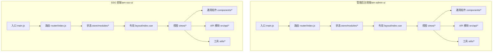
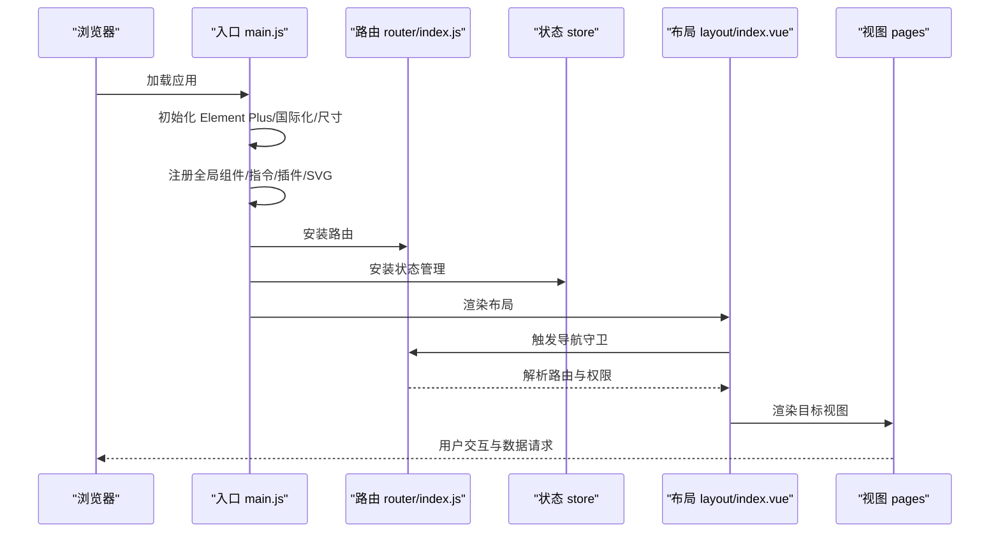
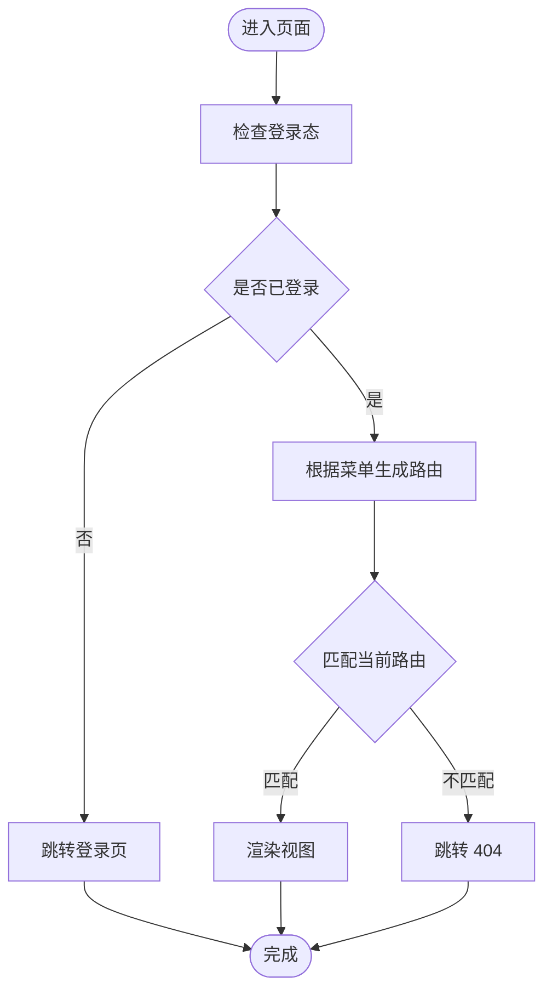
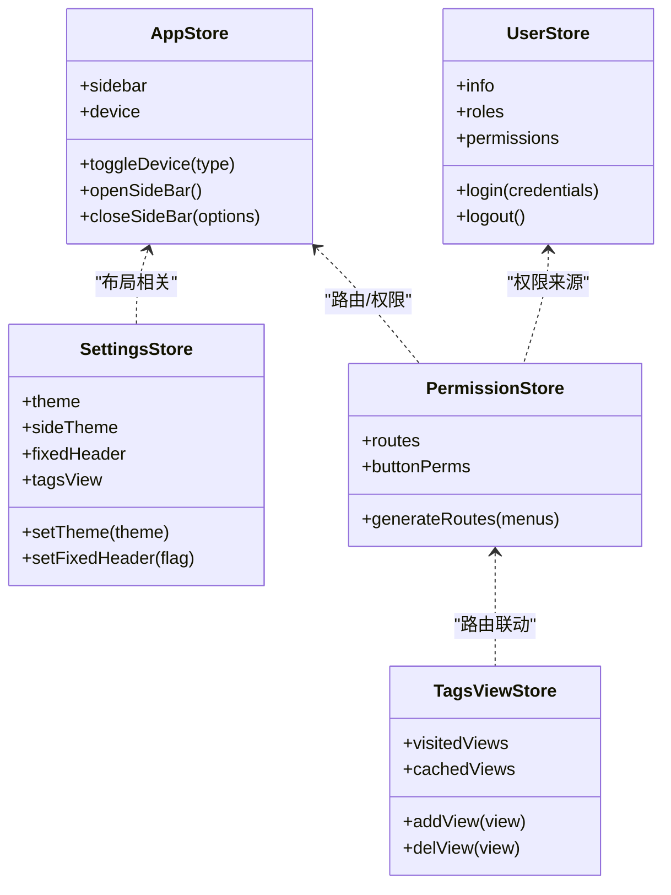
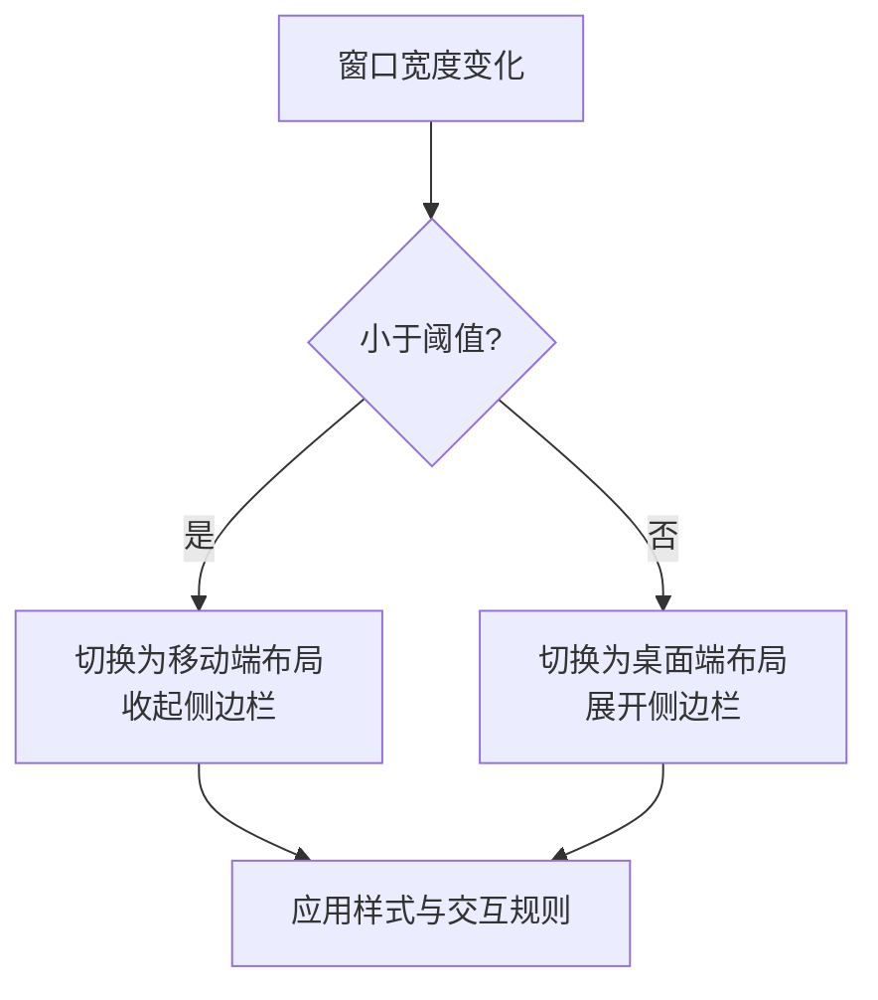
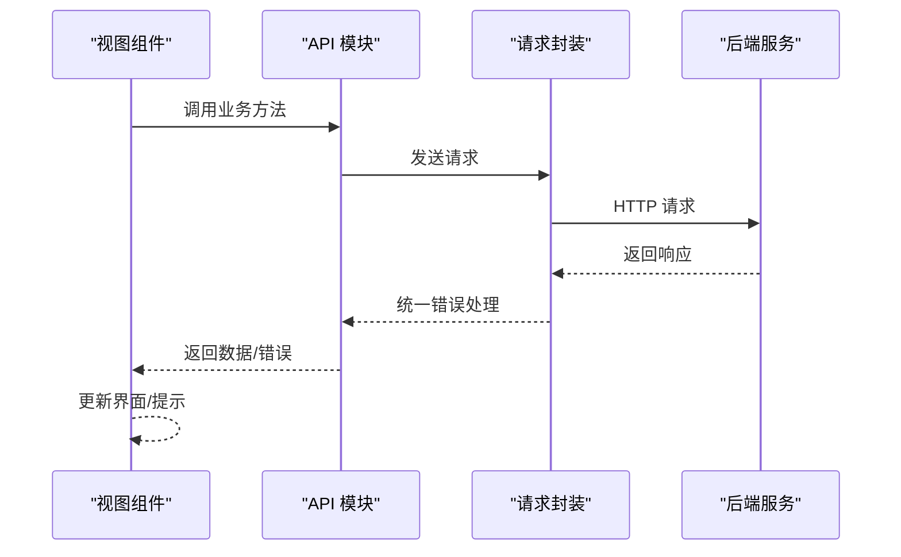
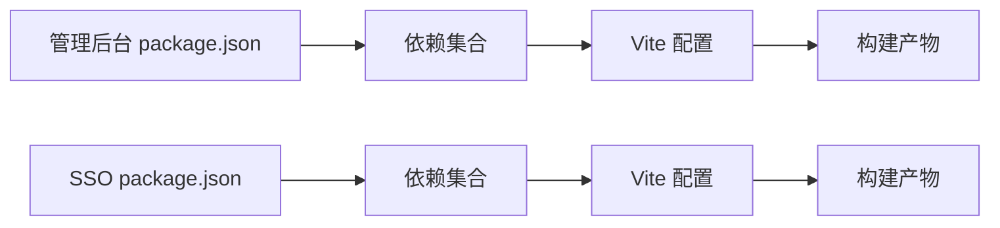

# 前端应用

<cite>
**本文引用的文件**
- [iam-admin-ui/package.json](file://iam-admin-ui/package.json)
- [iam-sso-ui/package.json](file://iam-sso-ui/package.json)
- [iam-admin-ui/src/main.js](file://iam-admin-ui/src/main.js)
- [iam-sso-ui/src/main.js](file://iam-sso-ui/src/main.js)
- [iam-admin-ui/vite.config.js](file://iam-admin-ui/vite.config.js)
- [iam-sso-ui/vite.config.js](file://iam-sso-ui/vite.config.js)
- [iam-admin-ui/src/layout/index.vue](file://iam-admin-ui/src/layout/index.vue)
- [iam-sso-ui/src/layout/index.vue](file://iam-sso-ui/src/layout/index.vue)
- [iam-admin-ui/src/assets/styles/index.scss](file://iam-admin-ui/src/assets/styles/index.scss)
- [iam-sso-ui/src/assets/styles/index.scss](file://iam-sso-ui/src/assets/styles/index.scss)
- [iam-admin-ui/src/components/Pagination/index.vue](file://iam-admin-ui/src/components/Pagination/index.vue)
- [iam-sso-ui/src/components/Pagination/index.vue](file://iam-sso-ui/src/components/Pagination/index.vue)
- [iam-admin-ui/src/utils/request.js](file://iam-admin-ui/src/utils/request.js)
- [iam-sso-ui/src/utils/request.js](file://iam-sso-ui/src/utils/request.js)
- [iam-admin-ui/src/views/system/user/index.vue](file://iam-admin-ui/src/views/system/user/index.vue)
- [iam-sso-ui/src/views/dashboard/index.vue](file://iam-sso-ui/src/views/dashboard/index.vue)
- [iam-admin-ui/src/views/error/404.vue](file://iam-admin-ui/src/views/error/404.vue)
- [iam-sso-ui/src/views/error/404.vue](file://iam-sso-ui/src/views/error/404.vue)
- [iam-admin-ui/src/plugins/auth.js](file://iam-admin-ui/src/plugins/auth.js)
- [iam-sso-ui/src/plugins/auth.js](file://iam-sso-ui/src/plugins/auth.js)
- [iam-admin-ui/src/store/modules/user.js](file://iam-admin-ui/src/store/modules/user.js)
- [iam-sso-ui/src/store/modules/user.js](file://iam-sso-ui/src/store/modules/user.js)
- [iam-admin-ui/src/router/index.js](file://iam-admin-ui/src/router/index.js)
- [iam-sso-ui/src/router/index.js](file://iam-sso-ui/src/router/index.js)
</cite>

## 目录
1. [引言](#引言)
2. [项目结构](#项目结构)
3. [核心组件](#核心组件)
4. [架构总览](#架构总览)
5. [详细组件分析](#详细组件分析)
6. [依赖关系分析](#依赖关系分析)
7. [性能考虑](#性能考虑)
8. [故障排查指南](#故障排查指南)
9. [结论](#结论)
10. [附录](#附录)

## 引言
本文件面向 SH-IAM 的前端应用，系统性梳理“管理后台前端（iam-admin-ui）”与“SSO 前端（iam-sso-ui）”的应用架构、组件设计与用户体验。重点覆盖技术栈（Vue 3 + Element Plus）、状态管理（Pinia）、路由配置、组件开发规范、样式定制与响应式设计，并提供 API 集成范式、错误处理策略与性能优化建议。同时明确两套前端的差异化定位与适用场景。

## 项目结构
两套前端均采用 Vite + Vue 3 + Element Plus 技术栈，目录组织遵循“按功能域划分”的模块化思路：API 层、组件层、布局层、工具层、视图层、状态层、插件层等。两者在入口初始化、构建配置、主题与样式、组件生态、路由与权限控制等方面高度一致，差异主要体现在业务视图与部分工具函数。

图表来源
- [iam-admin-ui/src/main.js:1-107](file://iam-admin-ui/src/main.js#L1-L107)
- [iam-sso-ui/src/main.js:1-107](file://iam-sso-ui/src/main.js#L1-L107)
- [iam-admin-ui/src/layout/index.vue:1-117](file://iam-admin-ui/src/layout/index.vue#L1-L117)
- [iam-sso-ui/src/layout/index.vue:1-117](file://iam-sso-ui/src/layout/index.vue#L1-L117)

章节来源
- [iam-admin-ui/package.json:1-53](file://iam-admin-ui/package.json#L1-L53)
- [iam-sso-ui/package.json:1-53](file://iam-sso-ui/package.json#L1-L53)
- [iam-admin-ui/vite.config.js:1-72](file://iam-admin-ui/vite.config.js#L1-L72)
- [iam-sso-ui/vite.config.js:1-72](file://iam-sso-ui/vite.config.js#L1-L72)

## 核心组件
- 应用入口与初始化
  - 两个前端的入口均完成 Element Plus 国际化与尺寸配置、全局组件注册、指令与插件挂载、SVG 图标体系注册、全局工具方法注入以及权限守卫加载。
  - 管理后台与 SSO 前端在入口初始化上的差异主要体现在全局方法注入处：管理后台注入字典与通用工具；SSO 前端额外注入配置读取方法。
- 布局系统
  - 两套前端共享同一布局骨架：侧边栏、顶部导航、标签页、主内容区与设置面板。通过响应式监听设备宽度自动切换移动端/桌面端布局行为。
- 组件生态
  - 通用组件库包括分页、富文本、文件/图片上传与预览、字典标签、表格设置、表单/标签提示、布局切分等，统一注册为全局组件，便于复用。
- 工具与 API
  - 请求封装统一基于 axios，支持拦截器、错误码映射与下载能力；各模块 API 文件按领域拆分（如系统、用户、日志、SSO 等），便于维护与测试。
- 状态管理
  - 使用 Pinia 进行模块化状态管理，典型模块包括 app、settings、permission、tagsView、user 等，分别负责布局状态、主题设置、权限树、标签页与用户信息等。

章节来源
- [iam-admin-ui/src/main.js:1-107](file://iam-admin-ui/src/main.js#L1-L107)
- [iam-sso-ui/src/main.js:1-107](file://iam-sso-ui/src/main.js#L1-L107)
- [iam-admin-ui/src/layout/index.vue:1-117](file://iam-admin-ui/src/layout/index.vue#L1-L117)
- [iam-sso-ui/src/layout/index.vue:1-117](file://iam-sso-ui/src/layout/index.vue#L1-L117)

## 架构总览
下图展示两套前端的启动流程与关键交互：从入口初始化到路由守卫、状态管理、布局渲染与视图加载的完整链路。

图表来源
- [iam-admin-ui/src/main.js:1-107](file://iam-admin-ui/src/main.js#L1-L107)
- [iam-sso-ui/src/main.js:1-107](file://iam-sso-ui/src/main.js#L1-L107)
- [iam-admin-ui/src/layout/index.vue:1-117](file://iam-admin-ui/src/layout/index.vue#L1-L117)
- [iam-sso-ui/src/layout/index.vue:1-117](file://iam-sso-ui/src/layout/index.vue#L1-L117)

## 详细组件分析

### 路由与权限控制
- 路由配置
  - 两套前端均在入口安装路由模块，结合权限模块实现菜单驱动的动态路由生成与访问控制。
  - 管理后台侧重系统管理类页面（用户、角色、菜单、接口、数据维度、访问密钥等）；SSO 前端侧重门户与个人中心（仪表盘、通知、统计、操作日志、个人资料等）。
- 权限守卫
  - 在进入路由前进行登录态校验与权限判定，未授权或登录失效时跳转至相应错误页或登录页。
- 动态菜单
  - 基于后端返回的菜单树生成路由表，支持多级嵌套与外链打开。

图表来源
- [iam-admin-ui/src/router/index.js](file://iam-admin-ui/src/router/index.js)
- [iam-sso-ui/src/router/index.js](file://iam-sso-ui/src/router/index.js)

章节来源
- [iam-admin-ui/src/router/index.js](file://iam-admin-ui/src/router/index.js)
- [iam-sso-ui/src/router/index.js](file://iam-sso-ui/src/router/index.js)

### 状态管理（Pinia）
- 模块职责
  - app：布局开关、设备类型、侧边栏显示状态等。
  - settings：主题色、侧边主题、固定头部、标签页开关等。
  - permission：菜单树、按钮权限集合、路由白名单等。
  - tagsView：标签页列表与当前激活项。
  - user：用户信息、登录态、角色与权限集合。
- 数据流
  - 视图通过 store 实例读取状态并触发动作；动作内部可调用 API 获取/更新数据，再写回状态，最终驱动视图更新。

图表来源
- [iam-admin-ui/src/store/modules/app.js](file://iam-admin-ui/src/store/modules/app.js)
- [iam-sso-ui/src/store/modules/app.js](file://iam-sso-ui/src/store/modules/app.js)
- [iam-admin-ui/src/store/modules/settings.js](file://iam-admin-ui/src/store/modules/settings.js)
- [iam-sso-ui/src/store/modules/settings.js](file://iam-sso-ui/src/store/modules/settings.js)
- [iam-admin-ui/src/store/modules/permission.js](file://iam-admin-ui/src/store/modules/permission.js)
- [iam-sso-ui/src/store/modules/permission.js](file://iam-sso-ui/src/store/modules/permission.js)
- [iam-admin-ui/src/store/modules/tagsView.js](file://iam-admin-ui/src/store/modules/tagsView.js)
- [iam-sso-ui/src/store/modules/tagsView.js](file://iam-sso-ui/src/store/modules/tagsView.js)
- [iam-admin-ui/src/store/modules/user.js](file://iam-admin-ui/src/store/modules/user.js)
- [iam-sso-ui/src/store/modules/user.js](file://iam-sso-ui/src/store/modules/user.js)

章节来源
- [iam-admin-ui/src/store/modules/user.js](file://iam-admin-ui/src/store/modules/user.js)
- [iam-sso-ui/src/store/modules/user.js](file://iam-sso-ui/src/store/modules/user.js)

### 布局与响应式设计
- 布局骨架
  - 侧边栏、顶部导航、标签页、主内容区与设置面板构成统一布局容器；支持主题色与侧边主题切换。
- 响应式行为
  - 基于窗口宽度阈值自动切换移动端/桌面端模式；移动端自动收起侧边栏并支持遮罩点击关闭。
- 样式体系
  - 全局样式引入 Element Plus 样式与暗色变量；自定义 SCSS 变量与混入提升主题一致性；侧边栏宽度、固定头部宽度等通过 CSS 变量与 SCSS 变量协同控制。

图表来源
- [iam-admin-ui/src/layout/index.vue:38-54](file://iam-admin-ui/src/layout/index.vue#L38-L54)
- [iam-sso-ui/src/layout/index.vue:38-54](file://iam-sso-ui/src/layout/index.vue#L38-L54)

章节来源
- [iam-admin-ui/src/layout/index.vue:1-117](file://iam-admin-ui/src/layout/index.vue#L1-L117)
- [iam-sso-ui/src/layout/index.vue:1-117](file://iam-sso-ui/src/layout/index.vue#L1-L117)
- [iam-admin-ui/src/assets/styles/index.scss](file://iam-admin-ui/src/assets/styles/index.scss)
- [iam-sso-ui/src/assets/styles/index.scss](file://iam-sso-ui/src/assets/styles/index.scss)

### 通用组件与复用机制
- 组件清单
  - 分页、富文本编辑器、文件/图片上传与预览、字典标签、表格设置、表单/标签提示、布局切分等。
- 复用方式
  - 通过全局注册减少重复导入；组件内部通过 props/事件与父组件解耦；配合工具函数与 API 模块实现数据驱动。

章节来源
- [iam-admin-ui/src/components/Pagination/index.vue](file://iam-admin-ui/src/components/Pagination/index.vue)
- [iam-sso-ui/src/components/Pagination/index.vue](file://iam-sso-ui/src/components/Pagination/index.vue)

### API 集成与错误处理
- 请求封装
  - 基于 axios 的请求实例统一拦截器、超时与错误码映射；提供下载能力与进度反馈。
- 错误处理
  - 对不同 HTTP 状态与业务错误码进行统一处理，结合消息提示与页面跳转（如 401 登录态失效、403 权限不足、404 资源不存在）。
- 业务 API
  - 管理后台按系统域拆分（用户、角色、菜单、接口、数据维度、访问密钥、日志等）；SSO 前端按门户域拆分（仪表盘、个人中心、日志等）。

图表来源
- [iam-admin-ui/src/utils/request.js](file://iam-admin-ui/src/utils/request.js)
- [iam-sso-ui/src/utils/request.js](file://iam-sso-ui/src/utils/request.js)

章节来源
- [iam-admin-ui/src/utils/request.js](file://iam-admin-ui/src/utils/request.js)
- [iam-sso-ui/src/utils/request.js](file://iam-sso-ui/src/utils/request.js)
- [iam-admin-ui/src/views/system/user/index.vue](file://iam-admin-ui/src/views/system/user/index.vue)
- [iam-sso-ui/src/views/dashboard/index.vue](file://iam-sso-ui/src/views/dashboard/index.vue)

### 插件与指令体系
- 插件
  - 认证插件、缓存插件、模态框插件、标签页插件等，统一在入口注册，按需调用。
- 指令
  - 权限指令（按钮级权限控制）、复制文本指令等，通过全局指令注册实现简洁的 DOM 级权限控制。

章节来源
- [iam-admin-ui/src/plugins/auth.js](file://iam-admin-ui/src/plugins/auth.js)
- [iam-sso-ui/src/plugins/auth.js](file://iam-sso-ui/src/plugins/auth.js)

## 依赖关系分析
- 技术栈
  - Vue 3、Element Plus、Vue Router、Pinia、Axios、Monaco Editor、ECharts、Quill、Vite 等。
- 开发工具
  - Vite 插件链：自动导入、SVG 图标、压缩、PostCSS Charset 移除等。
- 构建与运行
  - 本地开发服务器端口、代理规则、打包输出与资源命名策略一致；生产环境开启无 sourcemap 以减小体积。

图表来源
- [iam-admin-ui/package.json:18-39](file://iam-admin-ui/package.json#L18-L39)
- [iam-sso-ui/package.json:18-39](file://iam-sso-ui/package.json#L18-L39)
- [iam-admin-ui/vite.config.js:25-39](file://iam-admin-ui/vite.config.js#L25-L39)
- [iam-sso-ui/vite.config.js:25-39](file://iam-sso-ui/vite.config.js#L25-L39)

章节来源
- [iam-admin-ui/package.json:1-53](file://iam-admin-ui/package.json#L1-L53)
- [iam-sso-ui/package.json:1-53](file://iam-sso-ui/package.json#L1-L53)
- [iam-admin-ui/vite.config.js:1-72](file://iam-admin-ui/vite.config.js#L1-L72)
- [iam-sso-ui/vite.config.js:1-72](file://iam-sso-ui/vite.config.js#L1-L72)

## 性能考虑
- 代码分割与懒加载
  - 路由级懒加载与按需加载大型组件（如编辑器、图表），降低首屏体积。
- 资源优化
  - 启用静态资源压缩与 Gzip/Brotli；合理配置 chunk 大小与命名策略，避免单文件过大。
- 请求优化
  - 统一拦截器中启用重试与取消；对高频请求做防抖与缓存；长列表使用虚拟滚动。
- 主题与样式
  - 使用 CSS 变量与 SCSS 变量集中管理主题，减少重复计算与重绘。
- 组件优化
  - 对复杂列表与表格使用 v-memo 或稳定 key；避免不必要的响应式穿透与深层监听。

## 故障排查指南
- 登录态问题
  - 现象：频繁跳转登录页或 401。
  - 排查：检查 Token 是否过期、刷新逻辑是否正确、后端跨域与安全头配置。
- 权限不足
  - 现象：按钮不可见或点击无反应。
  - 排查：确认后端返回的权限集合与前端按钮指令绑定是否一致。
- 路由异常
  - 现象：进入页面空白或 404。
  - 排查：检查路由表生成逻辑、菜单树结构与路径匹配规则。
- 样式错乱
  - 现象：主题色不生效或布局错位。
  - 排查：确认主题变量与 SCSS 变量是否正确引入，Element Plus 版本兼容性。
- 构建失败
  - 现象：依赖解析错误或打包报错。
  - 排查：核对 Node 版本、依赖版本与 Vite 插件配置。

章节来源
- [iam-admin-ui/src/views/error/404.vue](file://iam-admin-ui/src/views/error/404.vue)
- [iam-sso-ui/src/views/error/404.vue](file://iam-sso-ui/src/views/error/404.vue)

## 结论
两套前端在技术栈、工程化与组件生态上保持高度一致，差异主要体现在业务视图与部分工具函数。管理后台前端聚焦系统管理与权限治理，SSO 前端聚焦用户门户与个人中心。通过统一的状态管理、路由与权限控制、布局与样式体系，以及完善的 API 与错误处理机制，两套前端共同支撑 SH-IAM 的前后端协作与用户体验。

## 附录
- 两套前端的差异与适用场景
  - 管理后台前端（iam-admin-ui）
    - 场景：平台管理员进行用户、角色、菜单、接口、数据维度、访问密钥等系统管理。
    - 特点：系统域 CRUD 丰富、权限粒度细、日志与审计完善。
  - SSO 前端（iam-sso-ui）
    - 场景：终端用户进行登录、注册、个人信息维护、操作日志查询与门户浏览。
    - 特点：门户化程度高、个人中心丰富、轻量化的系统管理能力。