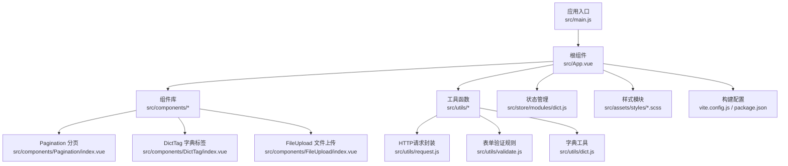
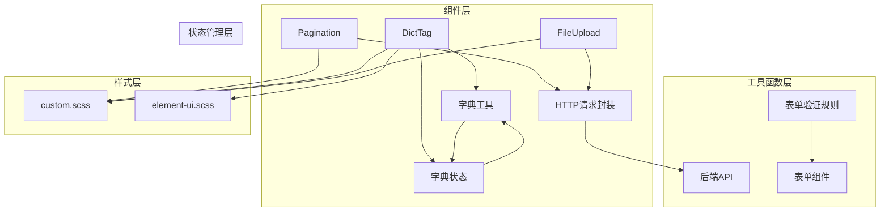
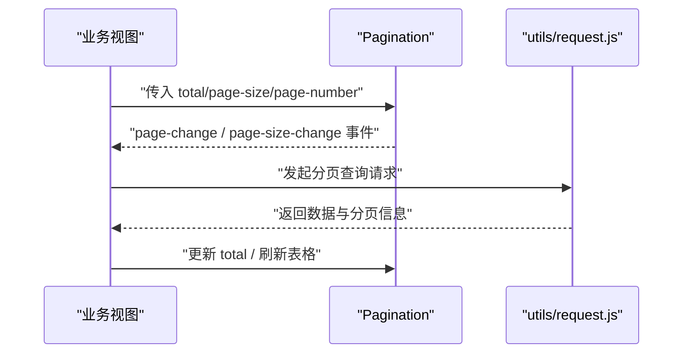
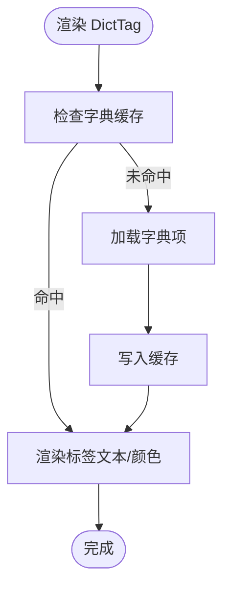
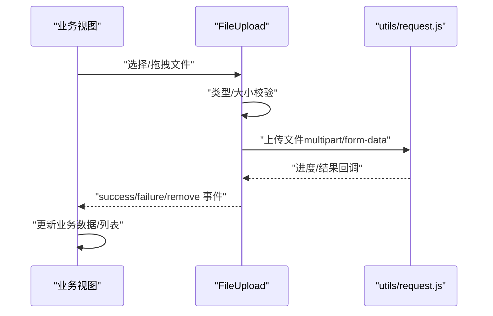
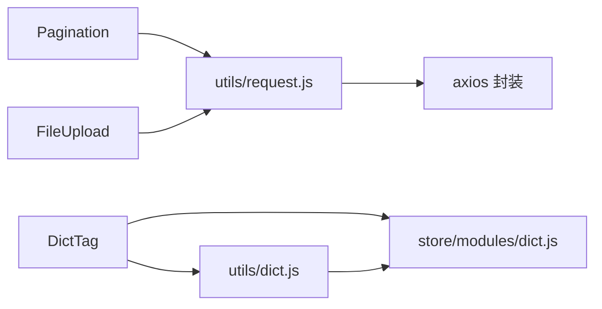

# UI组件库与工具函数

<cite>
**本文档引用的文件**
- [iam-admin-ui/src/components/Pagination/index.vue](file://iam-admin-ui/src/components/Pagination/index.vue)
- [iam-admin-ui/src/components/DictTag/index.vue](file://iam-admin-ui/src/components/DictTag/index.vue)
- [iam-admin-ui/src/components/FileUpload/index.vue](file://iam-admin-ui/src/components/FileUpload/index.vue)
- [iam-admin-ui/src/utils/request.js](file://iam-admin-ui/src/utils/request.js)
- [iam-admin-ui/src/utils/validate.js](file://iam-admin-ui/src/utils/validate.js)
- [iam-admin-ui/src/utils/dict.js](file://iam-admin-ui/src/utils/dict.js)
- [iam-admin-ui/src/store/modules/dict.js](file://iam-admin-ui/src/store/modules/dict.js)
- [iam-admin-ui/src/main.js](file://iam-admin-ui/src/main.js)
- [iam-admin-ui/src/App.vue](file://iam-admin-ui/src/App.vue)
- [iam-admin-ui/src/assets/styles/custom.scss](file://iam-admin-ui/src/assets/styles/custom.scss)
- [iam-admin-ui/src/assets/styles/element-ui.scss](file://iam-admin-ui/src/assets/styles/element-ui.scss)
- [iam-admin-ui/vite.config.js](file://iam-admin-ui/vite.config.js)
- [iam-admin-ui/package.json](file://iam-admin-ui/package.json)
</cite>

## 目录
1. [简介](#简介)
2. [项目结构](#项目结构)
3. [核心组件](#核心组件)
4. [架构总览](#架构总览)
5. [详细组件分析](#详细组件分析)
6. [依赖关系分析](#依赖关系分析)
7. [性能考虑](#性能考虑)
8. [故障排查指南](#故障排查指南)
9. [结论](#结论)
10. [附录](#附录)

## 简介
本文件面向SH-IAM管理后台的UI组件库与工具函数，系统性梳理分页组件、字典标签、文件上传等通用组件的设计理念与实现方式；同时深入解析HTTP请求封装、表单验证规则与数据格式化工具，并提供组件属性配置、事件处理与样式定制的参考路径。文档还涵盖可复用性设计、性能优化策略与无障碍访问支持建议，以及组件测试方法与开发最佳实践。

## 项目结构
IAM管理后台前端位于 iam-admin-ui 目录，采用Vue 3 + Vite技术栈，组件集中在 src/components 下，工具函数位于 src/utils 中，状态管理通过 src/store/modules 组织，样式通过 SCSS 模块化组织。

图表来源
- [iam-admin-ui/src/main.js](file://iam-admin-ui/src/main.js)
- [iam-admin-ui/src/App.vue](file://iam-admin-ui/src/App.vue)
- [iam-admin-ui/src/components/Pagination/index.vue](file://iam-admin-ui/src/components/Pagination/index.vue)
- [iam-admin-ui/src/components/DictTag/index.vue](file://iam-admin-ui/src/components/DictTag/index.vue)
- [iam-admin-ui/src/components/FileUpload/index.vue](file://iam-admin-ui/src/components/FileUpload/index.vue)
- [iam-admin-ui/src/utils/request.js](file://iam-admin-ui/src/utils/request.js)
- [iam-admin-ui/src/utils/validate.js](file://iam-admin-ui/src/utils/validate.js)
- [iam-admin-ui/src/utils/dict.js](file://iam-admin-ui/src/utils/dict.js)
- [iam-admin-ui/src/store/modules/dict.js](file://iam-admin-ui/src/store/modules/dict.js)
- [iam-admin-ui/src/assets/styles/custom.scss](file://iam-admin-ui/src/assets/styles/custom.scss)
- [iam-admin-ui/src/assets/styles/element-ui.scss](file://iam-admin-ui/src/assets/styles/element-ui.scss)
- [iam-admin-ui/vite.config.js](file://iam-admin-ui/vite.config.js)
- [iam-admin-ui/package.json](file://iam-admin-ui/package.json)

章节来源
- [iam-admin-ui/src/main.js](file://iam-admin-ui/src/main.js)
- [iam-admin-ui/src/App.vue](file://iam-admin-ui/src/App.vue)
- [iam-admin-ui/vite.config.js](file://iam-admin-ui/vite.config.js)
- [iam-admin-ui/package.json](file://iam-admin-ui/package.json)

## 核心组件
本节聚焦三大通用组件：Pagination（分页）、DictTag（字典标签）、FileUpload（文件上传）。它们均以Vue单文件组件形式提供，具备明确的props接口、事件回调与样式扩展点，便于在各业务页面复用。

- Pagination（分页）
  - 功能特性：支持页码切换、每页条数选择、快速跳转、总数展示；内部维护当前页与每页数量状态；对外抛出 page-change 与 page-size-change 事件。
  - 使用方法：传入 total、page-size、page-number 等属性；监听事件以刷新表格数据。
  - 可复用性：无副作用，纯展示+事件触发，适合在多处列表页复用。
  - 性能优化：避免频繁重算total变化；合理设置默认页大小；必要时结合虚拟滚动或服务端分页。
  - 无障碍支持：提供键盘导航与屏幕阅读器友好的label描述。

- DictTag（字典标签）
  - 功能特性：根据字典类型与字典值渲染带颜色/样式的标签；支持从全局字典缓存中获取标签文本与样式。
  - 使用方法：传入 dict-type 与 dict-label（或对应值）；可选配置颜色/类名映射。
  - 可复用性：与字典状态管理解耦，通过工具函数统一转换，利于跨模块共享。
  - 性能优化：字典数据本地缓存，减少重复请求；批量渲染时注意key稳定。
  - 无障碍支持：确保标签文本可读，颜色对比度符合WCAG标准。

- FileUpload（文件上传）
  - 功能特性：支持单文件/多文件上传、拖拽上传、预览缩略图、进度反馈、限制大小与类型；内置校验与错误提示。
  - 使用方法：传入 accept、limit-size、multiple、auto-upload 等属性；监听成功/失败事件更新业务数据。
  - 可复用性：封装上传细节，暴露标准化事件，适配不同业务场景。
  - 性能优化：大文件分片/断点续传（如需）；上传前压缩图片；并发控制。
  - 无障碍支持：提供上传区域的ARIA标签与键盘操作说明。

章节来源
- [iam-admin-ui/src/components/Pagination/index.vue](file://iam-admin-ui/src/components/Pagination/index.vue)
- [iam-admin-ui/src/components/DictTag/index.vue](file://iam-admin-ui/src/components/DictTag/index.vue)
- [iam-admin-ui/src/components/FileUpload/index.vue](file://iam-admin-ui/src/components/FileUpload/index.vue)

## 架构总览
下图展示了组件库与工具函数的整体交互关系：组件通过工具函数进行数据转换与网络请求，状态管理提供字典缓存，样式模块统一主题风格。

图表来源
- [iam-admin-ui/src/utils/request.js](file://iam-admin-ui/src/utils/request.js)
- [iam-admin-ui/src/utils/dict.js](file://iam-admin-ui/src/utils/dict.js)
- [iam-admin-ui/src/store/modules/dict.js](file://iam-admin-ui/src/store/modules/dict.js)
- [iam-admin-ui/src/assets/styles/custom.scss](file://iam-admin-ui/src/assets/styles/custom.scss)
- [iam-admin-ui/src/assets/styles/element-ui.scss](file://iam-admin-ui/src/assets/styles/element-ui.scss)

## 详细组件分析

### 分页组件（Pagination）
- 设计理念：最小可用集，仅负责分页UI与事件传递，不关心数据来源，保证高复用性。
- 关键属性（示意）：total、page-size、page-number、pager-count、layout等。
- 事件（示意）：page-change、page-size-change。
- 样式定制：通过SCSS变量覆盖Element UI分页样式；支持紧凑/迷你模式。
- 无障碍：为页码按钮添加aria-label；支持键盘导航（Tab/Enter）。

图表来源
- [iam-admin-ui/src/components/Pagination/index.vue](file://iam-admin-ui/src/components/Pagination/index.vue)
- [iam-admin-ui/src/utils/request.js](file://iam-admin-ui/src/utils/request.js)

章节来源
- [iam-admin-ui/src/components/Pagination/index.vue](file://iam-admin-ui/src/components/Pagination/index.vue)
- [iam-admin-ui/src/assets/styles/element-ui.scss](file://iam-admin-ui/src/assets/styles/element-ui.scss)

### 字典标签组件（DictTag）
- 设计理念：将“值”映射为“标签”，统一展示风格，降低重复逻辑。
- 关键属性（示意）：dict-type、dict-label（或value），可选display-style。
- 数据来源：优先从全局字典缓存（store/modules/dict.js）读取；若未命中则按需拉取。
- 样式定制：通过颜色/类名映射实现语义化展示（成功/警告/危险等）。

图表来源
- [iam-admin-ui/src/components/DictTag/index.vue](file://iam-admin-ui/src/components/DictTag/index.vue)
- [iam-admin-ui/src/utils/dict.js](file://iam-admin-ui/src/utils/dict.js)
- [iam-admin-ui/src/store/modules/dict.js](file://iam-admin-ui/src/store/modules/dict.js)

章节来源
- [iam-admin-ui/src/components/DictTag/index.vue](file://iam-admin-ui/src/components/DictTag/index.vue)
- [iam-admin-ui/src/utils/dict.js](file://iam-admin-ui/src/utils/dict.js)
- [iam-admin-ui/src/store/modules/dict.js](file://iam-admin-ui/src/store/modules/dict.js)

### 文件上传组件（FileUpload）
- 设计理念：封装上传流程与校验，暴露标准化事件，简化业务接入成本。
- 关键属性（示意）：accept、limit-size、multiple、auto-upload、show-preview。
- 事件（示意）：success、failure、progress、remove。
- 安全与性能：前端类型/大小校验；服务端二次校验；大文件分片/并发控制。

图表来源
- [iam-admin-ui/src/components/FileUpload/index.vue](file://iam-admin-ui/src/components/FileUpload/index.vue)
- [iam-admin-ui/src/utils/request.js](file://iam-admin-ui/src/utils/request.js)

章节来源
- [iam-admin-ui/src/components/FileUpload/index.vue](file://iam-admin-ui/src/components/FileUpload/index.vue)
- [iam-admin-ui/src/utils/request.js](file://iam-admin-ui/src/utils/request.js)

## 依赖关系分析
- 组件到工具函数：Pagination依赖request进行分页查询；DictTag依赖dict与store进行字典渲染；FileUpload依赖request进行上传。
- 工具函数到外部：request基于axios封装，统一拦截器、超时与错误处理；validate提供表单规则；dict提供字典转换。
- 样式依赖：组件样式依赖custom.scss与element-ui.scss，确保主题一致性。

图表来源
- [iam-admin-ui/src/components/Pagination/index.vue](file://iam-admin-ui/src/components/Pagination/index.vue)
- [iam-admin-ui/src/components/DictTag/index.vue](file://iam-admin-ui/src/components/DictTag/index.vue)
- [iam-admin-ui/src/components/FileUpload/index.vue](file://iam-admin-ui/src/components/FileUpload/index.vue)
- [iam-admin-ui/src/utils/request.js](file://iam-admin-ui/src/utils/request.js)
- [iam-admin-ui/src/utils/dict.js](file://iam-admin-ui/src/utils/dict.js)
- [iam-admin-ui/src/store/modules/dict.js](file://iam-admin-ui/src/store/modules/dict.js)

章节来源
- [iam-admin-ui/src/utils/request.js](file://iam-admin-ui/src/utils/request.js)
- [iam-admin-ui/src/utils/dict.js](file://iam-admin-ui/src/utils/dict.js)
- [iam-admin-ui/src/store/modules/dict.js](file://iam-admin-ui/src/store/modules/dict.js)

## 性能考虑
- 组件层面
  - Pagination：避免频繁更新total；合理设置默认页大小；对大数据量采用服务端分页。
  - DictTag：字典缓存去重；批量渲染时保持key稳定；延迟加载未显示字典。
  - FileUpload：限制并发；大文件分片；上传前压缩图片；失败重试策略。
- 工具函数层面
  - request：统一超时与重试；错误分类处理；取消重复请求。
  - validate：规则缓存；异步校验防抖；避免阻塞主线程。
- 样式层面
  - 模块化SCSS，按需引入；避免全局污染；主题变量集中管理。

## 故障排查指南
- 分页无数据
  - 检查 total 是否正确更新；确认 page-change 事件是否触发；核对后端分页参数。
- 字典标签不显示
  - 检查 dict-type 与 dict-label 是否匹配；确认字典缓存是否已加载；查看网络请求是否报错。
- 文件上传失败
  - 查看上传接口返回；检查文件类型/大小限制；确认网络状态与CORS配置。
- 样式异常
  - 检查 custom.scss 与 element-ui.scss 的导入顺序；确认主题变量覆盖是否生效。

章节来源
- [iam-admin-ui/src/components/Pagination/index.vue](file://iam-admin-ui/src/components/Pagination/index.vue)
- [iam-admin-ui/src/components/DictTag/index.vue](file://iam-admin-ui/src/components/DictTag/index.vue)
- [iam-admin-ui/src/components/FileUpload/index.vue](file://iam-admin-ui/src/components/FileUpload/index.vue)
- [iam-admin-ui/src/utils/request.js](file://iam-admin-ui/src/utils/request.js)
- [iam-admin-ui/src/utils/validate.js](file://iam-admin-ui/src/utils/validate.js)

## 结论
该UI组件库以“低耦合、高内聚”为核心设计原则，通过清晰的属性接口、事件回调与样式扩展点，实现了良好的可复用性与可维护性。配合完善的工具函数与状态管理，能够支撑复杂业务场景下的高效开发与迭代。

## 附录

### 组件属性与事件参考路径
- Pagination 属性与事件：[iam-admin-ui/src/components/Pagination/index.vue](file://iam-admin-ui/src/components/Pagination/index.vue)
- DictTag 属性与渲染逻辑：[iam-admin-ui/src/components/DictTag/index.vue](file://iam-admin-ui/src/components/DictTag/index.vue)
- FileUpload 属性与事件：[iam-admin-ui/src/components/FileUpload/index.vue](file://iam-admin-ui/src/components/FileUpload/index.vue)

### 工具函数参考路径
- HTTP请求封装：[iam-admin-ui/src/utils/request.js](file://iam-admin-ui/src/utils/request.js)
- 表单验证规则：[iam-admin-ui/src/utils/validate.js](file://iam-admin-ui/src/utils/validate.js)
- 字典工具与缓存：[iam-admin-ui/src/utils/dict.js](file://iam-admin-ui/src/utils/dict.js)，[iam-admin-ui/src/store/modules/dict.js](file://iam-admin-ui/src/store/modules/dict.js)

### 样式定制参考路径
- 自定义样式入口：[iam-admin-ui/src/assets/styles/custom.scss](file://iam-admin-ui/src/assets/styles/custom.scss)
- Element UI样式覆盖：[iam-admin-ui/src/assets/styles/element-ui.scss](file://iam-admin-ui/src/assets/styles/element-ui.scss)

### 开发最佳实践
- 组件设计
  - 明确职责边界，单一功能单一组件。
  - 提供稳定的props与事件接口，避免内部实现频繁变更。
  - 充分利用插槽与类名扩展，支持主题与样式定制。
- 工具函数
  - 统一错误处理与日志记录；提供可测试的纯函数。
  - 对异步操作进行超时与重试控制。
- 性能
  - 合理使用虚拟滚动与懒加载；缓存热点数据；避免不必要的重渲染。
- 测试
  - 单元测试：针对工具函数与纯组件逻辑。
  - 集成测试：模拟网络请求与用户交互。
  - 可访问性测试：键盘导航、屏幕阅读器支持、颜色对比度。