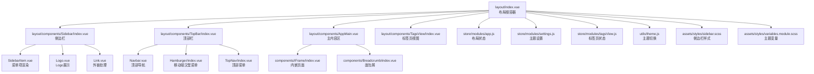
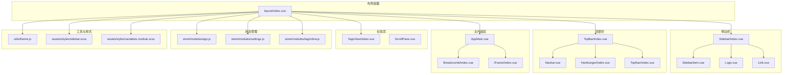
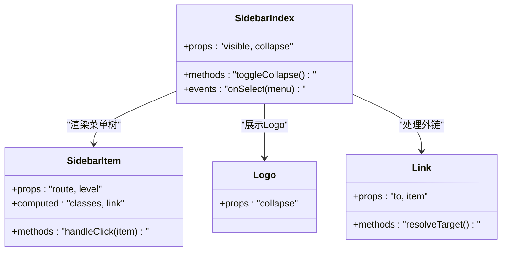
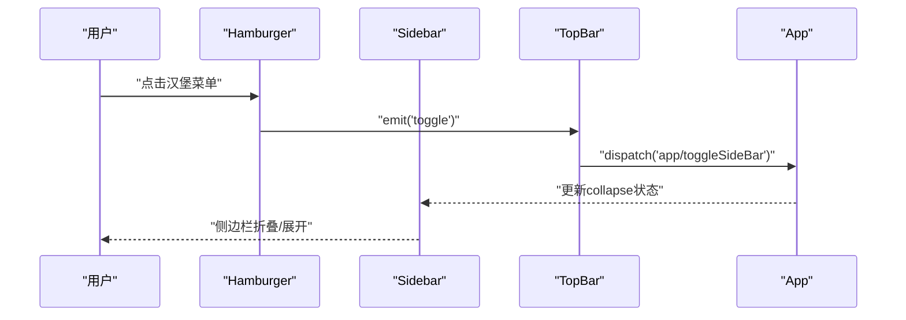
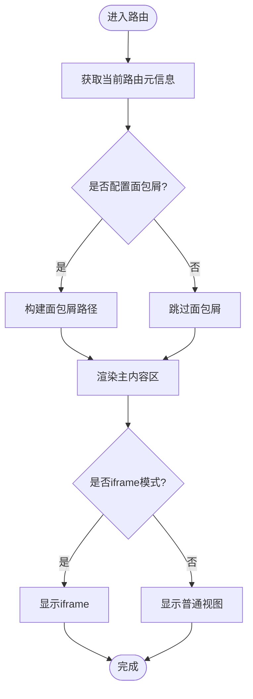
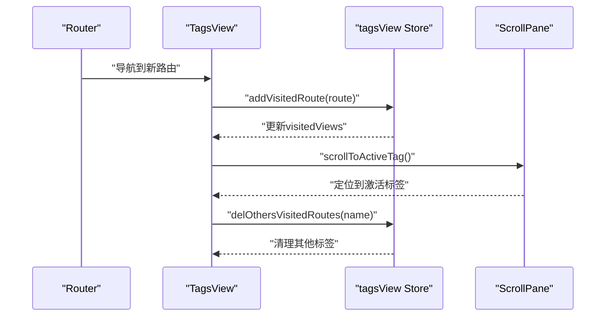
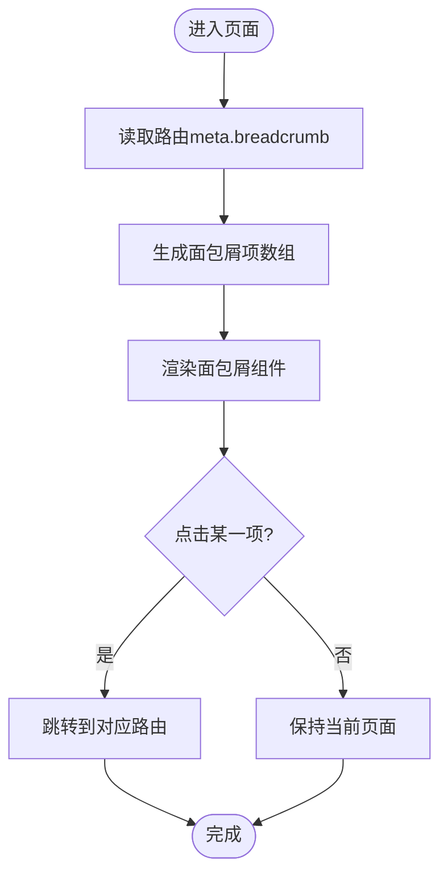
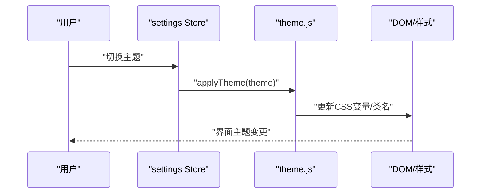
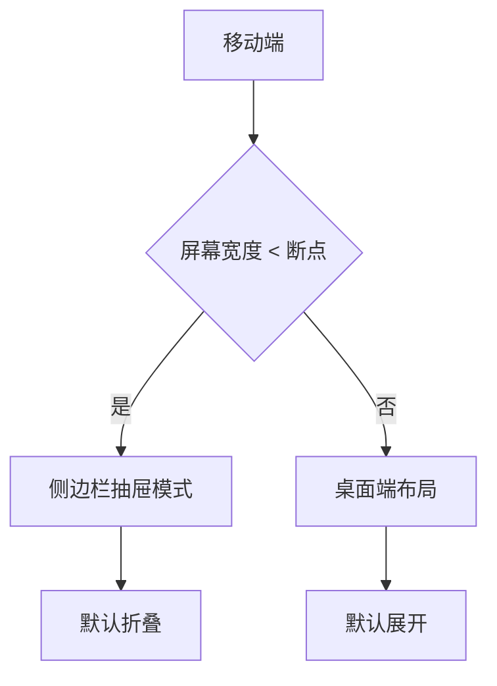
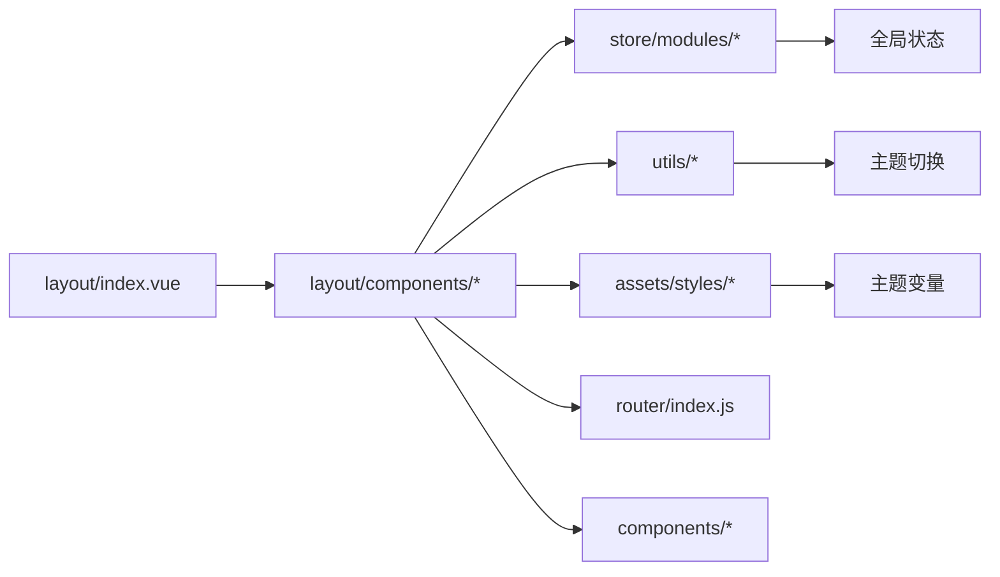

# 布局系统与导航

<cite>
**本文引用的文件**
- [layout/index.vue](file://iam-admin-ui/src/layout/index.vue)
- [layout/components/index.js](file://iam-admin-ui/src/layout/components/index.js)
- [layout/components/AppMain.vue](file://iam-admin-ui/src/layout/components/AppMain.vue)
- [layout/components/Navbar.vue](file://iam-admin-ui/src/layout/components/Navbar.vue)
- [layout/components/TopBar/index.vue](file://iam-admin-ui/src/layout/components/TopBar/index.vue)
- [layout/components/Sidebar/index.vue](file://iam-admin-ui/src/layout/components/Sidebar/index.vue)
- [layout/components/Sidebar/SidebarItem.vue](file://iam-admin-ui/src/layout/components/Sidebar/SidebarItem.vue)
- [layout/components/Sidebar/Logo.vue](file://iam-admin-ui/src/layout/components/Sidebar/Logo.vue)
- [layout/components/Sidebar/Link.vue](file://iam-admin-ui/src/layout/components/Sidebar/Link.vue)
- [layout/components/TagsView/index.vue](file://iam-admin-ui/src/layout/components/TagsView/index.vue)
- [layout/components/TagsView/ScrollPane.vue](file://iam-admin-ui/src/layout/components/TagsView/ScrollPane.vue)
- [store/modules/app.js](file://iam-admin-ui/src/store/modules/app.js)
- [store/modules/settings.js](file://iam-admin-ui/src/store/modules/settings.js)
- [store/modules/tagsView.js](file://iam-admin-ui/src/store/modules/tagsView.js)
- [utils/theme.js](file://iam-admin-ui/src/utils/theme.js)
- [assets/styles/sidebar.scss](file://iam-admin-ui/src/assets/styles/sidebar.scss)
- [assets/styles/variables.module.scss](file://iam-admin-ui/src/assets/styles/variables.module.scss)
- [components/Breadcrumb/index.vue](file://iam-admin-ui/src/components/Breadcrumb/index.vue)
- [components/Hamburger/index.vue](file://iam-admin-ui/src/components/Hamburger/index.vue)
- [components/TopNav/index.vue](file://iam-admin-ui/src/components/TopNav/index.vue)
- [components/iFrame/index.vue](file://iam-admin-ui/src/components/iFrame/index.vue)
- [components/Settings/index.vue](file://iam-admin-ui/src/components/Settings/index.vue)
- [components/Copyright/index.vue](file://iam-admin-ui/src/components/Copyright/index.vue)
- [components/IframeToggle/index.vue](file://iam-admin-ui/src/components/IframeToggle/index.vue)
- [components/InnerLink/index.vue](file://iam-admin-ui/src/components/InnerLink/index.vue)
- [router/index.js](file://iam-admin-ui/src/router/index.js)
- [main.js](file://iam-admin-ui/src/main.js)
- [settings.js](file://iam-admin-ui/src/settings.js)
</cite>

## 目录
1. [引言](#引言)
2. [项目结构](#项目结构)
3. [核心组件](#核心组件)
4. [架构总览](#架构总览)
5. [详细组件分析](#详细组件分析)
6. [依赖关系分析](#依赖关系分析)
7. [性能考虑](#性能考虑)
8. [故障排除指南](#故障排除指南)
9. [结论](#结论)

## 引言
本文件面向SH-IAM管理后台的前端布局系统，围绕基于Element Plus的响应式布局进行深入技术说明。重点覆盖侧边栏导航、顶部导航栏、主内容区、面包屑导航、标签页视图等模块的实现方式与交互流程；阐述布局组件的层级结构、样式体系与响应式适配策略；解释侧边栏折叠展开逻辑、标签页切换机制、主题定制与暗黑模式支持、移动端适配方案，并总结组件间通信与状态同步策略。

## 项目结构
管理后台采用Vue 3 + Element Plus + Vite的前端架构，布局系统位于iam-admin-ui/src/layout目录下，配合Vuex状态管理（store/modules）与工具函数（utils），形成清晰的分层组织：

- 布局容器：layout/index.vue作为根容器，组合侧边栏、顶部栏、主内容区、标签页等子组件
- 子组件：Sidebar、TopBar、AppMain、TagsView等按职责拆分
- 状态管理：app.js（布局开关）、settings.js（主题设置）、tagsView.js（标签页）
- 样式系统：sidebar.scss、variables.module.scss等提供布局与主题变量
- 工具函数：theme.js负责主题切换逻辑

图表来源
- [layout/index.vue:1-200](file://iam-admin-ui/src/layout/index.vue#L1-L200)
- [layout/components/Sidebar/index.vue:1-200](file://iam-admin-ui/src/layout/components/Sidebar/index.vue#L1-L200)
- [layout/components/TopBar/index.vue:1-200](file://iam-admin-ui/src/layout/components/TopBar/index.vue#L1-L200)
- [layout/components/AppMain.vue:1-200](file://iam-admin-ui/src/layout/components/AppMain.vue#L1-L200)
- [layout/components/TagsView/index.vue:1-200](file://iam-admin-ui/src/layout/components/TagsView/index.vue#L1-L200)
- [store/modules/app.js:1-200](file://iam-admin-ui/src/store/modules/app.js#L1-L200)
- [store/modules/settings.js:1-200](file://iam-admin-ui/src/store/modules/settings.js#L1-L200)
- [store/modules/tagsView.js:1-200](file://iam-admin-ui/src/store/modules/tagsView.js#L1-L200)
- [utils/theme.js:1-200](file://iam-admin-ui/src/utils/theme.js#L1-L200)
- [assets/styles/sidebar.scss:1-200](file://iam-admin-ui/src/assets/styles/sidebar.scss#L1-L200)
- [assets/styles/variables.module.scss:1-200](file://iam-admin-ui/src/assets/styles/variables.module.scss#L1-L200)

章节来源
- [layout/index.vue:1-200](file://iam-admin-ui/src/layout/index.vue#L1-L200)
- [layout/components/index.js:1-200](file://iam-admin-ui/src/layout/components/index.js#L1-L200)

## 核心组件
- 布局根容器：负责整体布局结构与响应式断点控制，协调各子组件显示隐藏
- 侧边栏：包含Logo、菜单树渲染、外链跳转、折叠展开控制
- 顶部栏：包含顶部导航、面包屑、用户信息、主题切换入口
- 主内容区：承载路由视图，支持iframe内嵌与面包屑联动
- 标签页视图：记录访问历史，支持滚动切换与关闭操作

章节来源
- [layout/index.vue:1-200](file://iam-admin-ui/src/layout/index.vue#L1-L200)
- [layout/components/Sidebar/index.vue:1-200](file://iam-admin-ui/src/layout/components/Sidebar/index.vue#L1-L200)
- [layout/components/TopBar/index.vue:1-200](file://iam-admin-ui/src/layout/components/TopBar/index.vue#L1-L200)
- [layout/components/AppMain.vue:1-200](file://iam-admin-ui/src/layout/components/AppMain.vue#L1-L200)
- [layout/components/TagsView/index.vue:1-200](file://iam-admin-ui/src/layout/components/TagsView/index.vue#L1-L200)

## 架构总览
布局系统通过根容器统一调度，结合Vuex状态与工具函数实现主题、布局、标签页的集中控制。组件间通过props、事件与状态共享实现松耦合协作。

图表来源
- [layout/index.vue:1-200](file://iam-admin-ui/src/layout/index.vue#L1-L200)
- [layout/components/Sidebar/index.vue:1-200](file://iam-admin-ui/src/layout/components/Sidebar/index.vue#L1-L200)
- [layout/components/TopBar/index.vue:1-200](file://iam-admin-ui/src/layout/components/TopBar/index.vue#L1-L200)
- [layout/components/AppMain.vue:1-200](file://iam-admin-ui/src/layout/components/AppMain.vue#L1-L200)
- [layout/components/TagsView/index.vue:1-200](file://iam-admin-ui/src/layout/components/TagsView/index.vue#L1-L200)
- [store/modules/app.js:1-200](file://iam-admin-ui/src/store/modules/app.js#L1-L200)
- [store/modules/settings.js:1-200](file://iam-admin-ui/src/store/modules/settings.js#L1-L200)
- [store/modules/tagsView.js:1-200](file://iam-admin-ui/src/store/modules/tagsView.js#L1-L200)
- [utils/theme.js:1-200](file://iam-admin-ui/src/utils/theme.js#L1-L200)
- [assets/styles/sidebar.scss:1-200](file://iam-admin-ui/src/assets/styles/sidebar.scss#L1-L200)
- [assets/styles/variables.module.scss:1-200](file://iam-admin-ui/src/assets/styles/variables.module.scss#L1-L200)

## 详细组件分析

### 侧边栏导航
侧边栏是布局的核心导航载体，承担菜单树渲染、Logo展示与外链处理。其折叠展开由应用状态驱动，支持移动端与桌面端差异化体验。

图表来源
- [layout/components/Sidebar/index.vue:1-200](file://iam-admin-ui/src/layout/components/Sidebar/index.vue#L1-L200)
- [layout/components/Sidebar/SidebarItem.vue:1-200](file://iam-admin-ui/src/layout/components/Sidebar/SidebarItem.vue#L1-L200)
- [layout/components/Sidebar/Logo.vue:1-200](file://iam-admin-ui/src/layout/components/Sidebar/Logo.vue#L1-L200)
- [layout/components/Sidebar/Link.vue:1-200](file://iam-admin-ui/src/layout/components/Sidebar/Link.vue#L1-L200)

章节来源
- [layout/components/Sidebar/index.vue:1-200](file://iam-admin-ui/src/layout/components/Sidebar/index.vue#L1-L200)
- [layout/components/Sidebar/SidebarItem.vue:1-200](file://iam-admin-ui/src/layout/components/Sidebar/SidebarItem.vue#L1-L200)
- [layout/components/Sidebar/Logo.vue:1-200](file://iam-admin-ui/src/layout/components/Sidebar/Logo.vue#L1-L200)
- [layout/components/Sidebar/Link.vue:1-200](file://iam-admin-ui/src/layout/components/Sidebar/Link.vue#L1-L200)

### 顶部导航栏
顶部导航包含顶部菜单、面包屑、用户信息与主题设置入口。移动端通过汉堡菜单触发侧边栏抽屉式交互。

图表来源
- [components/Hamburger/index.vue:1-200](file://iam-admin-ui/src/components/Hamburger/index.vue#L1-L200)
- [layout/components/TopBar/index.vue:1-200](file://iam-admin-ui/src/layout/components/TopBar/index.vue#L1-L200)
- [store/modules/app.js:1-200](file://iam-admin-ui/src/store/modules/app.js#L1-L200)
- [layout/components/Sidebar/index.vue:1-200](file://iam-admin-ui/src/layout/components/Sidebar/index.vue#L1-L200)

章节来源
- [layout/components/TopBar/index.vue:1-200](file://iam-admin-ui/src/layout/components/TopBar/index.vue#L1-L200)
- [components/Hamburger/index.vue:1-200](file://iam-admin-ui/src/components/Hamburger/index.vue#L1-L200)
- [components/TopNav/index.vue:1-200](file://iam-admin-ui/src/components/TopNav/index.vue#L1-L200)

### 主内容区域
主内容区承载路由视图，支持面包屑联动与iframe内嵌场景。面包屑根据当前路由动态生成路径，标签页视图记录访问历史并支持关闭。

图表来源
- [layout/components/AppMain.vue:1-200](file://iam-admin-ui/src/layout/components/AppMain.vue#L1-L200)
- [components/Breadcrumb/index.vue:1-200](file://iam-admin-ui/src/components/Breadcrumb/index.vue#L1-L200)
- [components/iFrame/index.vue:1-200](file://iam-admin-ui/src/components/iFrame/index.vue#L1-L200)

章节来源
- [layout/components/AppMain.vue:1-200](file://iam-admin-ui/src/layout/components/AppMain.vue#L1-L200)
- [components/Breadcrumb/index.vue:1-200](file://iam-admin-ui/src/components/Breadcrumb/index.vue#L1-L200)
- [components/iFrame/index.vue:1-200](file://iam-admin-ui/src/components/iFrame/index.vue#L1-L200)

### 标签页视图
标签页视图记录访问历史，支持滚动切换与关闭操作。通过状态管理维护标签页列表与当前激活项，支持右键菜单与快捷键操作。

图表来源
- [layout/components/TagsView/index.vue:1-200](file://iam-admin-ui/src/layout/components/TagsView/index.vue#L1-L200)
- [layout/components/TagsView/ScrollPane.vue:1-200](file://iam-admin-ui/src/layout/components/TagsView/ScrollPane.vue#L1-L200)
- [store/modules/tagsView.js:1-200](file://iam-admin-ui/src/store/modules/tagsView.js#L1-L200)

章节来源
- [layout/components/TagsView/index.vue:1-200](file://iam-admin-ui/src/layout/components/TagsView/index.vue#L1-L200)
- [layout/components/TagsView/ScrollPane.vue:1-200](file://iam-admin-ui/src/layout/components/TagsView/ScrollPane.vue#L1-L200)
- [store/modules/tagsView.js:1-200](file://iam-admin-ui/src/store/modules/tagsView.js#L1-L200)

### 面包屑导航
面包屑根据路由元信息动态生成，支持多级路径展示与点击跳转。与主内容区联动，确保导航一致性。

图表来源
- [components/Breadcrumb/index.vue:1-200](file://iam-admin-ui/src/components/Breadcrumb/index.vue#L1-L200)
- [router/index.js:1-200](file://iam-admin-ui/src/router/index.js#L1-L200)

章节来源
- [components/Breadcrumb/index.vue:1-200](file://iam-admin-ui/src/components/Breadcrumb/index.vue#L1-L200)
- [router/index.js:1-200](file://iam-admin-ui/src/router/index.js#L1-L200)

### 主题定制与暗黑模式
主题系统通过工具函数与样式模块实现，支持明暗主题切换与变量覆盖。布局组件通过状态管理与样式类名控制主题表现。

图表来源
- [store/modules/settings.js:1-200](file://iam-admin-ui/src/store/modules/settings.js#L1-L200)
- [utils/theme.js:1-200](file://iam-admin-ui/src/utils/theme.js#L1-L200)
- [assets/styles/variables.module.scss:1-200](file://iam-admin-ui/src/assets/styles/variables.module.scss#L1-L200)

章节来源
- [store/modules/settings.js:1-200](file://iam-admin-ui/src/store/modules/settings.js#L1-L200)
- [utils/theme.js:1-200](file://iam-admin-ui/src/utils/theme.js#L1-L200)
- [assets/styles/variables.module.scss:1-200](file://iam-admin-ui/src/assets/styles/variables.module.scss#L1-L200)

### 移动端适配
移动端通过汉堡菜单触发侧边栏抽屉式交互，顶部栏与标签页在窄屏下进行自适应布局调整，保证可用性与可读性。

图表来源
- [layout/components/TopBar/index.vue:1-200](file://iam-admin-ui/src/layout/components/TopBar/index.vue#L1-L200)
- [layout/components/Sidebar/index.vue:1-200](file://iam-admin-ui/src/layout/components/Sidebar/index.vue#L1-L200)
- [assets/styles/sidebar.scss:1-200](file://iam-admin-ui/src/assets/styles/sidebar.scss#L1-L200)

章节来源
- [layout/components/TopBar/index.vue:1-200](file://iam-admin-ui/src/layout/components/TopBar/index.vue#L1-L200)
- [layout/components/Sidebar/index.vue:1-200](file://iam-admin-ui/src/layout/components/Sidebar/index.vue#L1-L200)
- [assets/styles/sidebar.scss:1-200](file://iam-admin-ui/src/assets/styles/sidebar.scss#L1-L200)

## 依赖关系分析
布局系统内部组件依赖清晰，通过状态管理与工具函数实现解耦。外部依赖主要来自Element Plus组件库与Vite构建工具链。

图表来源
- [layout/index.vue:1-200](file://iam-admin-ui/src/layout/index.vue#L1-L200)
- [store/modules/app.js:1-200](file://iam-admin-ui/src/store/modules/app.js#L1-L200)
- [store/modules/settings.js:1-200](file://iam-admin-ui/src/store/modules/settings.js#L1-L200)
- [store/modules/tagsView.js:1-200](file://iam-admin-ui/src/store/modules/tagsView.js#L1-L200)
- [utils/theme.js:1-200](file://iam-admin-ui/src/utils/theme.js#L1-L200)
- [assets/styles/sidebar.scss:1-200](file://iam-admin-ui/src/assets/styles/sidebar.scss#L1-L200)
- [assets/styles/variables.module.scss:1-200](file://iam-admin-ui/src/assets/styles/variables.module.scss#L1-L200)
- [router/index.js:1-200](file://iam-admin-ui/src/router/index.js#L1-L200)

章节来源
- [layout/index.vue:1-200](file://iam-admin-ui/src/layout/index.vue#L1-L200)
- [store/modules/app.js:1-200](file://iam-admin-ui/src/store/modules/app.js#L1-L200)
- [store/modules/settings.js:1-200](file://iam-admin-ui/src/store/modules/settings.js#L1-L200)
- [store/modules/tagsView.js:1-200](file://iam-admin-ui/src/store/modules/tagsView.js#L1-L200)
- [utils/theme.js:1-200](file://iam-admin-ui/src/utils/theme.js#L1-L200)
- [assets/styles/sidebar.scss:1-200](file://iam-admin-ui/src/assets/styles/sidebar.scss#L1-L200)
- [assets/styles/variables.module.scss:1-200](file://iam-admin-ui/src/assets/styles/variables.module.scss#L1-L200)
- [router/index.js:1-200](file://iam-admin-ui/src/router/index.js#L1-L200)

## 性能考虑
- 菜单渲染优化：使用虚拟滚动或懒加载减少大菜单树的渲染开销
- 标签页管理：限制标签页数量，及时清理非活跃标签，避免内存泄漏
- 主题切换：批量更新CSS变量，避免频繁重排
- 图片与资源：对图标与静态资源进行压缩与缓存策略
- 路由守卫：在进入路由前预加载必要数据，减少首屏等待

## 故障排除指南
- 侧边栏不显示或折叠异常
  - 检查应用状态是否正确更新，确认事件派发与订阅链路
  - 参考：[layout/components/TopBar/index.vue:1-200](file://iam-admin-ui/src/layout/components/TopBar/index.vue#L1-L200)、[store/modules/app.js:1-200](file://iam-admin-ui/src/store/modules/app.js#L1-L200)
- 面包屑不更新
  - 确认路由元信息配置与面包屑组件联动逻辑
  - 参考：[components/Breadcrumb/index.vue:1-200](file://iam-admin-ui/src/components/Breadcrumb/index.vue#L1-L200)、[router/index.js:1-200](file://iam-admin-ui/src/router/index.js#L1-L200)
- 标签页无法关闭或切换异常
  - 检查标签页状态管理与滚动定位逻辑
  - 参考：[layout/components/TagsView/index.vue:1-200](file://iam-admin-ui/src/layout/components/TagsView/index.vue#L1-L200)、[layout/components/TagsView/ScrollPane.vue:1-200](file://iam-admin-ui/src/layout/components/TagsView/ScrollPane.vue#L1-L200)、[store/modules/tagsView.js:1-200](file://iam-admin-ui/src/store/modules/tagsView.js#L1-L200)
- 主题切换无效
  - 检查主题工具函数与样式变量更新流程
  - 参考：[utils/theme.js:1-200](file://iam-admin-ui/src/utils/theme.js#L1-L200)、[assets/styles/variables.module.scss:1-200](file://iam-admin-ui/src/assets/styles/variables.module.scss#L1-L200)

章节来源
- [layout/components/TopBar/index.vue:1-200](file://iam-admin-ui/src/layout/components/TopBar/index.vue#L1-L200)
- [store/modules/app.js:1-200](file://iam-admin-ui/src/store/modules/app.js#L1-L200)
- [components/Breadcrumb/index.vue:1-200](file://iam-admin-ui/src/components/Breadcrumb/index.vue#L1-L200)
- [router/index.js:1-200](file://iam-admin-ui/src/router/index.js#L1-L200)
- [layout/components/TagsView/index.vue:1-200](file://iam-admin-ui/src/layout/components/TagsView/index.vue#L1-L200)
- [layout/components/TagsView/ScrollPane.vue:1-200](file://iam-admin-ui/src/layout/components/TagsView/ScrollPane.vue#L1-L200)
- [store/modules/tagsView.js:1-200](file://iam-admin-ui/src/store/modules/tagsView.js#L1-L200)
- [utils/theme.js:1-200](file://iam-admin-ui/src/utils/theme.js#L1-L200)
- [assets/styles/variables.module.scss:1-200](file://iam-admin-ui/src/assets/styles/variables.module.scss#L1-L200)

## 结论
SH-IAM管理后台布局系统以清晰的组件分层与状态管理为核心，结合Element Plus组件库与响应式设计，在保证功能完整性的同时兼顾了性能与可维护性。通过侧边栏折叠、标签页视图、面包屑导航与主题切换等能力，为用户提供一致且高效的管理体验。建议在后续迭代中持续优化大菜单树渲染、标签页生命周期管理与移动端交互细节，进一步提升系统稳定性与用户体验。