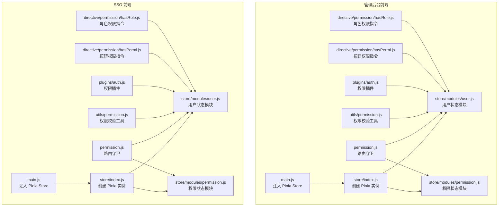
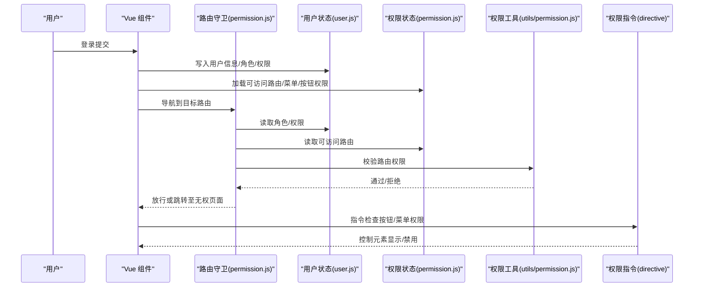
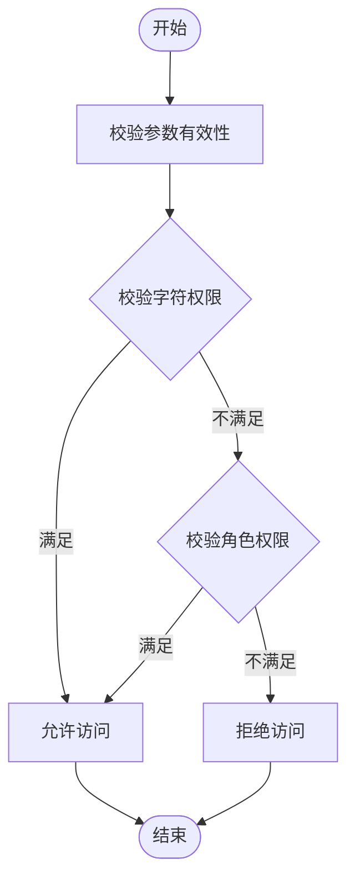
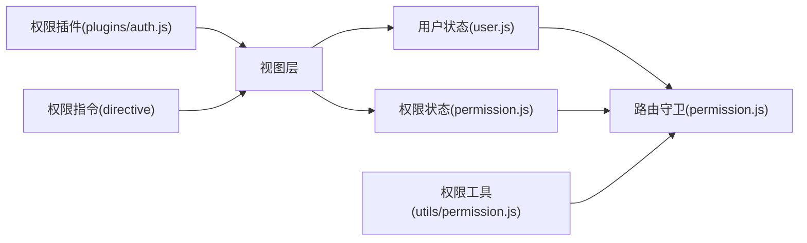

# 状态管理与权限控制

<cite>
**本文引用的文件**
- [iam-admin-ui/src/store/index.js](file://iam-admin-ui/src/store/index.js)
- [iam-sso-ui/src/store/index.js](file://iam-sso-ui/src/store/index.js)
- [iam-admin-ui/src/store/modules/user.js](file://iam-admin-ui/src/store/modules/user.js)
- [iam-sso-ui/src/store/modules/user.js](file://iam-sso-ui/src/store/modules/user.js)
- [iam-admin-ui/src/store/modules/permission.js](file://iam-admin-ui/src/store/modules/permission.js)
- [iam-sso-ui/src/store/modules/permission.js](file://iam-sso-ui/src/store/modules/permission.js)
- [iam-admin-ui/src/utils/permission.js](file://iam-admin-ui/src/utils/permission.js)
- [iam-sso-ui/src/utils/permission.js](file://iam-sso-ui/src/utils/permission.js)
- [iam-admin-ui/src/plugins/auth.js](file://iam-admin-ui/src/plugins/auth.js)
- [iam-sso-ui/src/plugins/auth.js](file://iam-sso-ui/src/plugins/auth.js)
- [iam-admin-ui/src/directive/permission/hasPermi.js](file://iam-admin-ui/src/directive/permission/hasPermi.js)
- [iam-admin-ui/src/directive/permission/hasRole.js](file://iam-admin-ui/src/directive/permission/hasRole.js)
- [iam-admin-ui/src/main.js](file://iam-admin-ui/src/main.js)
- [iam-admin-ui/src/permission.js](file://iam-admin-ui/src/permission.js)
- [iam-admin-ui/src/utils/request.js](file://iam-admin-ui/src/utils/request.js)
- [iam-admin-ui/src/utils/cache.js](file://iam-admin-ui/src/utils/cache.js)
- [iam-sso-ui/src/utils/request.js](file://iam-sso-ui/src/utils/request.js)
- [iam-sso-ui/src/utils/cache.js](file://iam-sso-ui/src/utils/cache.js)
</cite>

## 目录
1. [引言](#引言)
2. [项目结构](#项目结构)
3. [核心组件](#核心组件)
4. [架构总览](#架构总览)
5. [详细组件分析](#详细组件分析)
6. [依赖关系分析](#依赖关系分析)
7. [性能考虑](#性能考虑)
8. [故障排查指南](#故障排查指南)
9. [结论](#结论)

## 引言
本技术文档围绕 SH-IAM 管理后台的状态管理与权限控制体系展开，重点覆盖 Pinia 状态管理在用户态、权限态与应用配置态中的设计与实现；详解权限控制机制（路由权限、按钮权限、菜单权限）的动态加载与校验；给出登录状态管理、Token 存储与权限验证流程的参考路径；阐述状态持久化策略、状态同步机制与错误状态处理；并提供权限指令系统与自定义权限组件的开发指南。

## 项目结构
前端采用 Vite + Vue 3 + Pinia 架构，管理后台与单点登录分别独立构建，共享通用权限工具与插件。状态管理位于各前端工程的 store 目录下，权限工具与指令位于 utils 与 directive 目录，入口通过 main.js 注入 store，并在 permission.js 中统一拦截路由守卫与权限校验。

图表来源
- [iam-admin-ui/src/main.js](file://iam-admin-ui/src/main.js)
- [iam-admin-ui/src/store/index.js](file://iam-admin-ui/src/store/index.js)
- [iam-admin-ui/src/store/modules/user.js](file://iam-admin-ui/src/store/modules/user.js)
- [iam-admin-ui/src/store/modules/permission.js](file://iam-admin-ui/src/store/modules/permission.js)
- [iam-admin-ui/src/utils/permission.js](file://iam-admin-ui/src/utils/permission.js)
- [iam-admin-ui/src/plugins/auth.js](file://iam-admin-ui/src/plugins/auth.js)
- [iam-admin-ui/src/directive/permission/hasPermi.js](file://iam-admin-ui/src/directive/permission/hasPermi.js)
- [iam-admin-ui/src/directive/permission/hasRole.js](file://iam-admin-ui/src/directive/permission/hasRole.js)
- [iam-admin-ui/src/permission.js](file://iam-admin-ui/src/permission.js)

章节来源
- [iam-admin-ui/src/main.js](file://iam-admin-ui/src/main.js)
- [iam-admin-ui/src/store/index.js](file://iam-admin-ui/src/store/index.js)
- [iam-sso-ui/src/store/index.js](file://iam-sso-ui/src/store/index.js)

## 核心组件
- Pinia Store 实例：在各前端工程的 store/index.js 中创建并导出 Pinia 实例，供 main.js 注入。
- 用户状态模块（user.js）：集中管理用户信息、角色列表、权限列表等。
- 权限状态模块（permission.js）：维护可访问路由、菜单树、按钮权限集合等。
- 权限工具（utils/permission.js）：提供 checkPermi、checkRole 等校验函数。
- 权限插件（plugins/auth.js）：提供 hasPermi/hasRole 及其组合校验方法。
- 权限指令（directive/permission/*）：在模板中以指令形式快速控制元素显示/交互。
- 路由守卫（permission.js）：在进入路由前进行权限校验与重定向。
- 请求与缓存（utils/request.js、utils/cache.js）：封装请求拦截器与 Token 缓存逻辑。

章节来源
- [iam-admin-ui/src/store/modules/user.js](file://iam-admin-ui/src/store/modules/user.js)
- [iam-admin-ui/src/store/modules/permission.js](file://iam-admin-ui/src/store/modules/permission.js)
- [iam-admin-ui/src/utils/permission.js](file://iam-admin-ui/src/utils/permission.js)
- [iam-admin-ui/src/plugins/auth.js](file://iam-admin-ui/src/plugins/auth.js)
- [iam-admin-ui/src/directive/permission/hasPermi.js](file://iam-admin-ui/src/directive/permission/hasPermi.js)
- [iam-admin-ui/src/directive/permission/hasRole.js](file://iam-admin-ui/src/directive/permission/hasRole.js)
- [iam-admin-ui/src/permission.js](file://iam-admin-ui/src/permission.js)
- [iam-admin-ui/src/utils/request.js](file://iam-admin-ui/src/utils/request.js)
- [iam-admin-ui/src/utils/cache.js](file://iam-admin-ui/src/utils/cache.js)

## 架构总览
下图展示从用户登录到页面渲染的完整状态流转：用户登录成功后写入用户态与权限态，路由守卫根据权限态决定可访问路由，指令与插件在视图层进行按钮/菜单级控制。

图表来源
- [iam-admin-ui/src/permission.js](file://iam-admin-ui/src/permission.js)
- [iam-admin-ui/src/store/modules/user.js](file://iam-admin-ui/src/store/modules/user.js)
- [iam-admin-ui/src/store/modules/permission.js](file://iam-admin-ui/src/store/modules/permission.js)
- [iam-admin-ui/src/utils/permission.js](file://iam-admin-ui/src/utils/permission.js)
- [iam-admin-ui/src/directive/permission/hasPermi.js](file://iam-admin-ui/src/directive/permission/hasPermi.js)
- [iam-admin-ui/src/directive/permission/hasRole.js](file://iam-admin-ui/src/directive/permission/hasRole.js)

## 详细组件分析

### 用户状态模块（user.js）
职责
- 维护当前登录用户的基本信息、角色数组、权限字符串数组。
- 提供用户登录、登出、更新信息等动作的派发与状态变更。
- 与请求拦截器配合，自动在请求头注入 Token。

数据模型要点
- 用户标识、用户名、昵称、头像等基础字段。
- 角色标识数组（如 admin、editor 等）。
- 权限字符串数组（如 system:user:add、*:*:* 等）。

复杂度与性能
- 权限/角色查询采用 Set 或数组 some/includes，时间复杂度 O(n)，n 为角色/权限数量。
- 建议在用户态中维护去重后的权限集合以降低重复计算。

错误处理
- 登录失败时清空用户态与 Token 缓存。
- 登出时清理用户态与本地存储。

章节来源
- [iam-admin-ui/src/store/modules/user.js](file://iam-admin-ui/src/store/modules/user.js)
- [iam-sso-ui/src/store/modules/user.js](file://iam-sso-ui/src/store/modules/user.js)

### 权限状态模块（permission.js）
职责
- 维护可访问路由表、菜单树、按钮权限集合。
- 在用户登录后拉取并构建权限资源，驱动路由动态生成与菜单渲染。
- 与路由守卫协作，实现进入前的权限拦截。

数据模型要点
- 动态路由数组（含 meta 权限标记）。
- 菜单树（含图标、名称、路径、权限标记）。
- 按钮级权限标识集合。

复杂度与性能
- 路由过滤与菜单树构建为线性扫描，建议按需懒加载与分页。
- 菜单树渲染前进行去重与排序，避免重复节点。

错误处理
- 权限资源拉取失败时回退到基础路由集合并提示。
- 路由白名单外的未知路由统一跳转 404。

章节来源
- [iam-admin-ui/src/store/modules/permission.js](file://iam-admin-ui/src/store/modules/permission.js)
- [iam-sso-ui/src/store/modules/permission.js](file://iam-sso-ui/src/store/modules/permission.js)

### 权限工具与插件（utils/permission.js、plugins/auth.js）
职责
- 提供字符串权限与角色权限的校验函数与组合校验能力。
- 插件封装 hasPermi/hasRole 及其 OR/AND 组合方法，便于在模板与逻辑中复用。

校验流程
- 字符权限：支持“通配符”全量权限与精确匹配。
- 角色权限：支持超级管理员与指定角色集合匹配。

图表来源
- [iam-admin-ui/src/utils/permission.js](file://iam-admin-ui/src/utils/permission.js)
- [iam-admin-ui/src/plugins/auth.js](file://iam-admin-ui/src/plugins/auth.js)

章节来源
- [iam-admin-ui/src/utils/permission.js](file://iam-admin-ui/src/utils/permission.js)
- [iam-sso-ui/src/utils/permission.js](file://iam-sso-ui/src/utils/permission.js)
- [iam-admin-ui/src/plugins/auth.js](file://iam-admin-ui/src/plugins/auth.js)
- [iam-sso-ui/src/plugins/auth.js](file://iam-sso-ui/src/plugins/auth.js)

### 权限指令系统（directive/permission/*）
职责
- 在模板层面以指令方式控制元素的显示/交互，避免在逻辑层重复判断。
- 指令内部读取用户态的角色/权限集合，结合工具函数完成校验。

使用示例（参考路径）
- 按钮权限指令：[iam-admin-ui/src/directive/permission/hasPermi.js](file://iam-admin-ui/src/directive/permission/hasPermi.js)
- 角色权限指令：[iam-admin-ui/src/directive/permission/hasRole.js](file://iam-admin-ui/src/directive/permission/hasRole.js)

章节来源
- [iam-admin-ui/src/directive/permission/hasPermi.js](file://iam-admin-ui/src/directive/permission/hasPermi.js)
- [iam-admin-ui/src/directive/permission/hasRole.js](file://iam-admin-ui/src/directive/permission/hasRole.js)

### 路由守卫与权限拦截（permission.js）
职责
- 在导航到新路由前，读取用户态与权限态，判断是否具备访问权限。
- 对无权限路由进行重定向或 401/403 处理。
- 结合菜单态与按钮态，确保页面渲染前的资源可用性。

章节来源
- [iam-admin-ui/src/permission.js](file://iam-admin-ui/src/permission.js)

### 登录状态管理、Token 存储与权限验证流程
登录流程（参考路径）
- 入口与注入：[iam-admin-ui/src/main.js](file://iam-admin-ui/src/main.js)
- 请求拦截与 Token 缓存：[iam-admin-ui/src/utils/request.js](file://iam-admin-ui/src/utils/request.js)、[iam-admin-ui/src/utils/cache.js](file://iam-admin-ui/src/utils/cache.js)
- 登录成功后写入用户态与权限态：[iam-admin-ui/src/store/modules/user.js](file://iam-admin-ui/src/store/modules/user.js)、[iam-admin-ui/src/store/modules/permission.js](file://iam-admin-ui/src/store/modules/permission.js)
- 路由守卫拦截与权限校验：[iam-admin-ui/src/permission.js](file://iam-admin-ui/src/permission.js)

章节来源
- [iam-admin-ui/src/main.js](file://iam-admin-ui/src/main.js)
- [iam-admin-ui/src/utils/request.js](file://iam-admin-ui/src/utils/request.js)
- [iam-admin-ui/src/utils/cache.js](file://iam-admin-ui/src/utils/cache.js)
- [iam-admin-ui/src/store/modules/user.js](file://iam-admin-ui/src/store/modules/user.js)
- [iam-admin-ui/src/store/modules/permission.js](file://iam-admin-ui/src/store/modules/permission.js)
- [iam-admin-ui/src/permission.js](file://iam-admin-ui/src/permission.js)

### 状态持久化策略与同步机制
持久化策略
- 用户态与权限态：建议结合浏览器本地存储（如 localStorage/sessionStorage）实现刷新后恢复。
- Token：建议存储于安全的 HttpOnly Cookie 或短期 sessionStorage，避免 XSS 风险。
- 应用配置态：可持久化主题、语言、布局偏好等非敏感配置。

状态同步
- 登录成功后优先写入内存态，再异步持久化。
- 多标签页场景下通过 Storage 事件监听实现跨标签页同步。

错误状态处理
- 登录失败：清空 Token 与用户态，提示错误并返回登录页。
- Token 过期：拦截器捕获 401，清除状态并跳转登录。
- 权限不足：路由守卫跳转 401/403，或在指令层隐藏不可见元素。

章节来源
- [iam-admin-ui/src/utils/cache.js](file://iam-admin-ui/src/utils/cache.js)
- [iam-admin-ui/src/utils/request.js](file://iam-admin-ui/src/utils/request.js)

### 自定义权限组件开发指南
- 组件内使用权限工具或插件进行渲染控制。
- 将权限校验逻辑抽象为可复用的混入或 Composable，减少重复代码。
- 对需要服务端校验的敏感操作，仍需在后端接口层进行二次校验。

章节来源
- [iam-admin-ui/src/utils/permission.js](file://iam-admin-ui/src/utils/permission.js)
- [iam-admin-ui/src/plugins/auth.js](file://iam-admin-ui/src/plugins/auth.js)

## 依赖关系分析
- 组件耦合
  - 路由守卫强依赖用户态与权限态。
  - 指令与插件均依赖用户态。
  - 工具函数在两者之间形成横切关注点。
- 外部依赖
  - Pinia 提供响应式状态容器。
  - Vue Router 提供路由与导航守卫。
  - Axios/封装请求库用于 Token 注入与错误拦截。

图表来源
- [iam-admin-ui/src/store/modules/user.js](file://iam-admin-ui/src/store/modules/user.js)
- [iam-admin-ui/src/store/modules/permission.js](file://iam-admin-ui/src/store/modules/permission.js)
- [iam-admin-ui/src/utils/permission.js](file://iam-admin-ui/src/utils/permission.js)
- [iam-admin-ui/src/plugins/auth.js](file://iam-admin-ui/src/plugins/auth.js)
- [iam-admin-ui/src/directive/permission/hasPermi.js](file://iam-admin-ui/src/directive/permission/hasPermi.js)
- [iam-admin-ui/src/directive/permission/hasRole.js](file://iam-admin-ui/src/directive/permission/hasRole.js)
- [iam-admin-ui/src/permission.js](file://iam-admin-ui/src/permission.js)

## 性能考虑
- 权限校验：尽量使用集合查找与早期返回，避免深层嵌套循环。
- 路由与菜单：对大型菜单进行分页或懒加载，仅渲染可见区域。
- 状态更新：批量更新与防抖，减少不必要的响应式开销。
- 缓存策略：合理设置 Token 与用户态的缓存 TTL，平衡体验与安全。

## 故障排查指南
常见问题
- 登录后页面空白或无限重定向：检查路由守卫是否正确读取用户态与权限态。
- 按钮/菜单不显示：确认指令绑定的权限标识与后端一致。
- Token 401：检查请求拦截器是否注入 Token，以及后端签发与校验规则。

定位手段
- 在路由守卫与权限工具中添加日志输出，核对角色/权限集合。
- 使用浏览器开发者工具查看 Network 与 Application 面板，确认 Token 与缓存状态。
- 在组件中打印用户态与权限态快照，定位状态未更新问题。

章节来源
- [iam-admin-ui/src/permission.js](file://iam-admin-ui/src/permission.js)
- [iam-admin-ui/src/utils/permission.js](file://iam-admin-ui/src/utils/permission.js)
- [iam-admin-ui/src/utils/request.js](file://iam-admin-ui/src/utils/request.js)
- [iam-admin-ui/src/utils/cache.js](file://iam-admin-ui/src/utils/cache.js)

## 结论
本方案以 Pinia 为核心，结合路由守卫、权限工具、指令与插件，实现了从用户态到权限态再到视图层的完整闭环。通过明确的状态划分、清晰的校验流程与完善的持久化策略，既能保证功能易用性，也能兼顾安全性与可维护性。后续可在大型菜单与高频权限校验场景中引入更细粒度的缓存与懒加载策略，进一步优化性能。