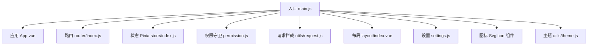
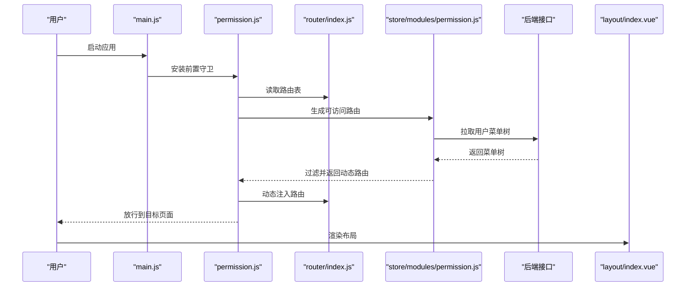
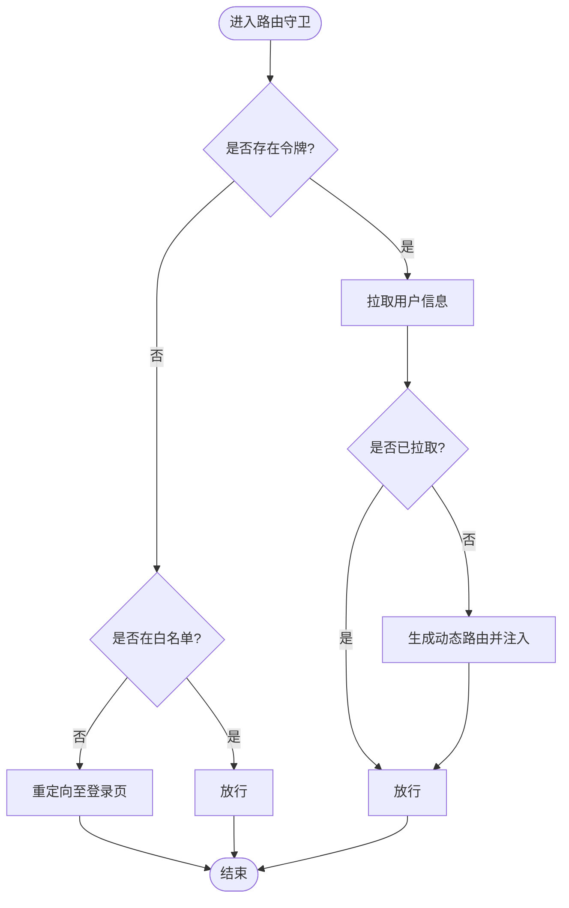
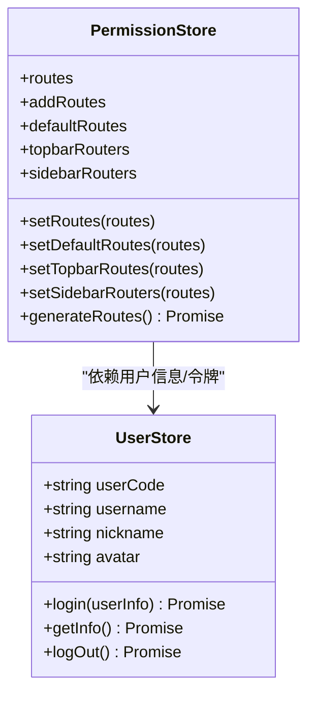
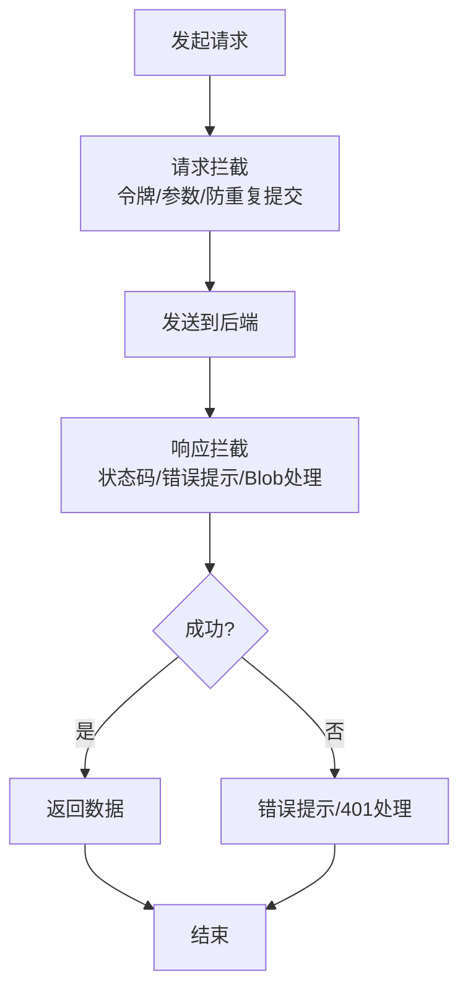
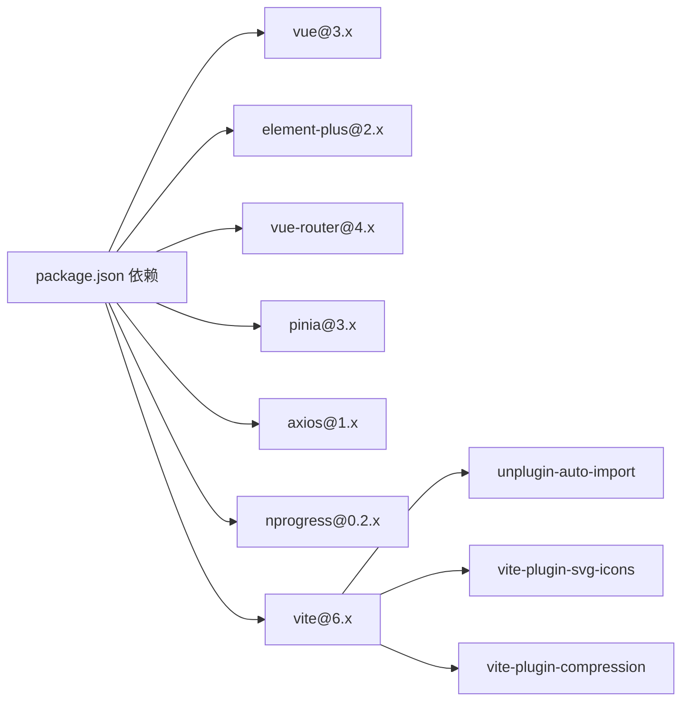

# 管理后台前端 (iam-admin-ui)

<cite>
**本文引用的文件**
- [package.json](file://iam-admin-ui/package.json)
- [main.js](file://iam-admin-ui/src/main.js)
- [vite.config.js](file://iam-admin-ui/vite.config.js)
- [settings.js](file://iam-admin-ui/src/settings.js)
- [App.vue](file://iam-admin-ui/src/App.vue)
- [store/index.js](file://iam-admin-ui/src/store/index.js)
- [router/index.js](file://iam-admin-ui/src/router/index.js)
- [layout/index.vue](file://iam-admin-ui/src/layout/index.vue)
- [permission.js](file://iam-admin-ui/src/permission.js)
- [utils/request.js](file://iam-admin-ui/src/utils/request.js)
- [store/modules/user.js](file://iam-admin-ui/src/store/modules/user.js)
- [store/modules/permission.js](file://iam-admin-ui/src/store/modules/permission.js)
- [components/SvgIcon/index.vue](file://iam-admin-ui/src/components/SvgIcon/index.vue)
- [utils/theme.js](file://iam-admin-ui/src/utils/theme.js)
</cite>

## 目录
1. [简介](#简介)
2. [项目结构](#项目结构)
3. [核心组件](#核心组件)
4. [架构总览](#架构总览)
5. [详细组件分析](#详细组件分析)
6. [依赖关系分析](#依赖关系分析)
7. [性能考虑](#性能考虑)
8. [故障排查指南](#故障排查指南)
9. [结论](#结论)
10. [附录](#附录)

## 简介
本文件面向 SH-IAM 管理后台前端应用（iam-admin-ui），围绕基于 Vue 3 + Element Plus 的管理界面，系统性梳理应用初始化配置、路由体系、状态管理（Pinia）、组件体系与布局设计；详解权限控制机制、表单与数据展示组件、系统管理功能（用户、角色、菜单、权限）实现要点；并覆盖 SVG 图标系统、国际化配置、主题定制方案、性能优化策略、错误处理与开发调试技巧。

## 项目结构
- 技术栈：Vue 3、Element Plus、Pinia、Vue Router、Axios、Monaco Editor、ECharts 等
- 构建工具：Vite（插件化扩展）
- 样式：SCSS 模块化与变量、混入（mixin）组织
- 目录组织：按功能域划分（api、components、layout、router、store、utils、views）

图示来源
- [main.js:1-107](file://iam-admin-ui/src/main.js#L1-L107)
- [App.vue:1-16](file://iam-admin-ui/src/App.vue#L1-L16)
- [router/index.js:1-86](file://iam-admin-ui/src/router/index.js#L1-L86)
- [store/index.js:1-3](file://iam-admin-ui/src/store/index.js#L1-L3)
- [permission.js:1-74](file://iam-admin-ui/src/permission.js#L1-L74)
- [utils/request.js:1-182](file://iam-admin-ui/src/utils/request.js#L1-L182)
- [layout/index.vue:1-117](file://iam-admin-ui/src/layout/index.vue#L1-L117)
- [settings.js:1-60](file://iam-admin-ui/src/settings.js#L1-L60)
- [components/SvgIcon/index.vue:1-54](file://iam-admin-ui/src/components/SvgIcon/index.vue#L1-L54)
- [utils/theme.js:1-50](file://iam-admin-ui/src/utils/theme.js#L1-L50)

章节来源
- [package.json:1-53](file://iam-admin-ui/package.json#L1-L53)
- [vite.config.js:1-72](file://iam-admin-ui/vite.config.js#L1-L72)

## 核心组件
- 应用初始化与全局注册
  - 元素化组件库、国际化语言包、全局样式、SVG 图标注册、指令与插件、全局组件与方法挂载、路由与状态管理安装、权限守卫引入
- 路由系统
  - 常量路由（登录、404、重定向等）与动态路由（基于权限生成）
- 状态管理（Pinia）
  - 用户信息、权限路由、应用状态、设置、标签页等模块
- 权限控制
  - 前置守卫：令牌校验、白名单放行、用户信息拉取、动态路由注入
  - 后端菜单树驱动前端路由生成与过滤
- 请求与错误处理
  - Axios 拦截器：统一头、防重复提交、响应状态码映射、401 重登录弹窗
- 布局与主题
  - 响应式布局、侧边栏、顶部导航、标签页、设置面板、CSS 变量主题切换

章节来源
- [main.js:1-107](file://iam-admin-ui/src/main.js#L1-L107)
- [router/index.js:1-86](file://iam-admin-ui/src/router/index.js#L1-L86)
- [store/index.js:1-3](file://iam-admin-ui/src/store/index.js#L1-L3)
- [permission.js:1-74](file://iam-admin-ui/src/permission.js#L1-L74)
- [utils/request.js:1-182](file://iam-admin-ui/src/utils/request.js#L1-L182)
- [layout/index.vue:1-117](file://iam-admin-ui/src/layout/index.vue#L1-L117)
- [settings.js:1-60](file://iam-admin-ui/src/settings.js#L1-L60)
- [utils/theme.js:1-50](file://iam-admin-ui/src/utils/theme.js#L1-L50)

## 架构总览
应用采用“入口初始化 → 路由守卫 → 状态管理 → 布局渲染”的主流程，结合 Axios 拦截器与权限模块完成鉴权与菜单驱动的动态路由装配。

图示来源
- [main.js:1-107](file://iam-admin-ui/src/main.js#L1-L107)
- [permission.js:1-74](file://iam-admin-ui/src/permission.js#L1-L74)
- [router/index.js:1-86](file://iam-admin-ui/src/router/index.js#L1-L86)
- [store/modules/permission.js:1-118](file://iam-admin-ui/src/store/modules/permission.js#L1-L118)

## 详细组件分析

### 应用初始化与全局配置
- 初始化步骤
  - 引入 Element Plus 国际化与暗色主题变量
  - 注册 SVG 图标、全局组件、指令与插件
  - 挂载全局方法（字典、日期范围、树形处理、富文本等）
  - 安装路由、状态、权限守卫
- 全局默认属性
  - 表格、对话框、抽屉、日期选择器等组件的默认行为统一
- 主题初始化
  - App.vue 首帧设置主题 CSS 变量

章节来源
- [main.js:1-107](file://iam-admin-ui/src/main.js#L1-L107)
- [App.vue:1-16](file://iam-admin-ui/src/App.vue#L1-L16)

### 路由系统与权限控制
- 路由结构
  - 常量路由：登录、404、重定向、个人资料等
  - 动态路由：空数组占位，运行时根据权限生成
- 权限守卫
  - 白名单放行、令牌存在与否分支、用户信息拉取、动态路由注入、替换当前路由确保导航完成
- 动态路由生成
  - 从后端拉取菜单树，递归解析组件路径，过滤具备权限的节点，注入路由表

图示来源
- [permission.js:1-74](file://iam-admin-ui/src/permission.js#L1-L74)
- [store/modules/permission.js:1-118](file://iam-admin-ui/src/store/modules/permission.js#L1-L118)

章节来源
- [router/index.js:1-86](file://iam-admin-ui/src/router/index.js#L1-L86)
- [permission.js:1-74](file://iam-admin-ui/src/permission.js#L1-L74)
- [store/modules/permission.js:1-118](file://iam-admin-ui/src/store/modules/permission.js#L1-L118)

### 状态管理（Pinia）
- 用户模块（user）
  - 登录（加密密码）、获取用户信息（解析 JWT）、登出
- 权限模块（permission）
  - 保存默认路由、侧边栏/顶部路由、动态生成路由、按权限过滤

图示来源
- [store/modules/user.js:1-93](file://iam-admin-ui/src/store/modules/user.js#L1-L93)
- [store/modules/permission.js:1-118](file://iam-admin-ui/src/store/modules/permission.js#L1-L118)

章节来源
- [store/modules/user.js:1-93](file://iam-admin-ui/src/store/modules/user.js#L1-L93)
- [store/modules/permission.js:1-118](file://iam-admin-ui/src/store/modules/permission.js#L1-L118)

### 布局组件与设置
- 布局容器
  - 响应式设备检测、侧边栏开关、标签页、固定头部、设置面板
- 设置项
  - 侧边栏主题、导航模式、标签页显隐、固定头部、Logo 显示、动态标题、版权等

章节来源
- [layout/index.vue:1-117](file://iam-admin-ui/src/layout/index.vue#L1-L117)
- [settings.js:1-60](file://iam-admin-ui/src/settings.js#L1-L60)

### 请求与错误处理
- Axios 实例
  - 基础 URL、超时、Content-Type、withCredentials
- 请求拦截
  - 令牌注入、GET 参数序列化、POST/PUT 防重复提交（会话缓存）
- 响应拦截
  - 二进制数据透传、状态码映射、错误消息提示、401 重登录确认
- 下载能力
  - GET/POST 通用下载封装，Blob 校验与文件保存

图示来源
- [utils/request.js:1-182](file://iam-admin-ui/src/utils/request.js#L1-L182)

章节来源
- [utils/request.js:1-182](file://iam-admin-ui/src/utils/request.js#L1-L182)

### SVG 图标系统
- 注册与使用
  - Vite 插件注册 SVG 资源，组件通过 x-link 引用图标 ID
- 组件特性
  - 支持类名、颜色、尺寸等属性

章节来源
- [components/SvgIcon/index.vue:1-54](file://iam-admin-ui/src/components/SvgIcon/index.vue#L1-L54)
- [main.js:19-22](file://iam-admin-ui/src/main.js#L19-L22)

### 主题定制与国际化
- 主题定制
  - 通过 CSS 变量动态设置 Element Plus 主色及明暗梯度
- 国际化
  - Element Plus 中文语言包引入

章节来源
- [utils/theme.js:1-50](file://iam-admin-ui/src/utils/theme.js#L1-L50)
- [main.js:5-6](file://iam-admin-ui/src/main.js#L5-L6)

### 系统管理功能实现要点
- 用户管理
  - 登录、个人信息、重置密码、登出
- 角色管理
  - 角色 CRUD、角色绑定菜单
- 菜单管理
  - 菜单树 CRUD、菜单与 API 关联
- 权限控制
  - 菜单树驱动动态路由、权限标识过滤

章节来源
- [store/modules/user.js:1-93](file://iam-admin-ui/src/store/modules/user.js#L1-L93)
- [store/modules/permission.js:1-118](file://iam-admin-ui/src/store/modules/permission.js#L1-L118)

## 依赖关系分析
- 外部依赖
  - Vue 3、Element Plus、Vue Router、Pinia、Axios、Monaco Editor、ECharts、NProgress、Fuse.js、Quill、SplitPanes、VueDraggable 等
- 构建与插件
  - Vite、自动导入、SVG 图标、压缩、PostCSS Charset 移除

图示来源
- [package.json:18-39](file://iam-admin-ui/package.json#L18-L39)
- [package.json:40-48](file://iam-admin-ui/package.json#L40-L48)
- [vite.config.js:1-72](file://iam-admin-ui/vite.config.js#L1-L72)

章节来源
- [package.json:1-53](file://iam-admin-ui/package.json#L1-L53)
- [vite.config.js:1-72](file://iam-admin-ui/vite.config.js#L1-L72)

## 性能考虑
- 构建优化
  - 按需打包、分包命名、Source Map 控制、静态资源输出目录规范
- 运行优化
  - 防重复提交（POST/PUT）、KeepAlive 缓存策略（路由 meta.noCache 控制）、懒加载组件
- 体积与加载
  - 大型依赖（Monaco Editor、ECharts）按需引入或异步加载
- 网络与缓存
  - Axios 默认超时、错误快速反馈、下载前加载提示

章节来源
- [vite.config.js:25-39](file://iam-admin-ui/vite.config.js#L25-L39)
- [utils/request.js:25-73](file://iam-admin-ui/src/utils/request.js#L25-L73)

## 故障排查指南
- 登录态失效
  - 401 弹窗提示、自动触发登出与跳转
- 接口异常
  - 状态码映射错误文案、网络错误/超时/异常状态码提示
- 重复提交
  - 防重复提交拦截、超大请求数据警告
- 路由无法访问
  - 检查权限模块是否正确生成动态路由、菜单树是否下发

章节来源
- [utils/request.js:98-125](file://iam-admin-ui/src/utils/request.js#L98-L125)
- [permission.js:46-54](file://iam-admin-ui/src/permission.js#L46-L54)
- [store/modules/permission.js:35-44](file://iam-admin-ui/src/store/modules/permission.js#L35-L44)

## 结论
本项目以 Vue 3 + Element Plus 为基础，结合 Pinia 与 Vue Router，构建了清晰的权限驱动路由体系与可配置布局。通过 Axios 拦截器与统一错误处理保障交互稳定性，借助 SVG 图标与主题变量实现良好的可维护性与可定制性。建议在后续迭代中进一步完善菜单树与权限模型的边界场景、增强路由与组件的懒加载策略，并持续优化首屏与交互性能。

## 附录
- 开发与构建命令
  - dev、build、build:stage、preview
- 环境代理
  - 本地开发代理到后端服务，路径重写
- 样式与主题
  - SCSS 变量与 mixin、CSS 变量主题切换

章节来源
- [package.json:8-12](file://iam-admin-ui/package.json#L8-L12)
- [vite.config.js:41-53](file://iam-admin-ui/vite.config.js#L41-L53)
- [utils/theme.js:1-10](file://iam-admin-ui/src/utils/theme.js#L1-L10)