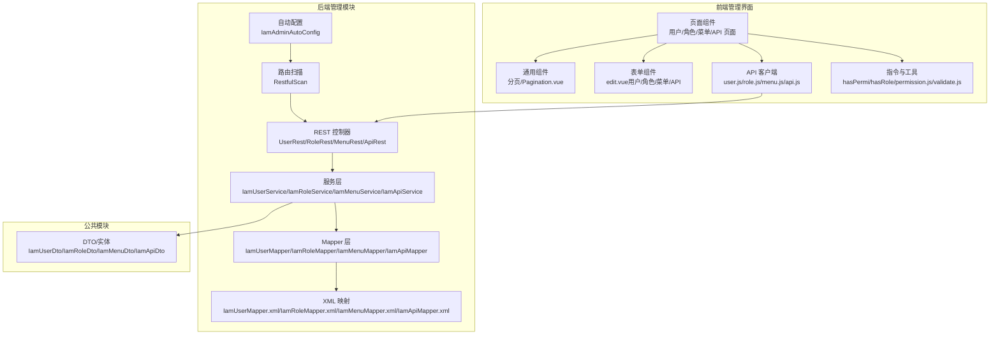
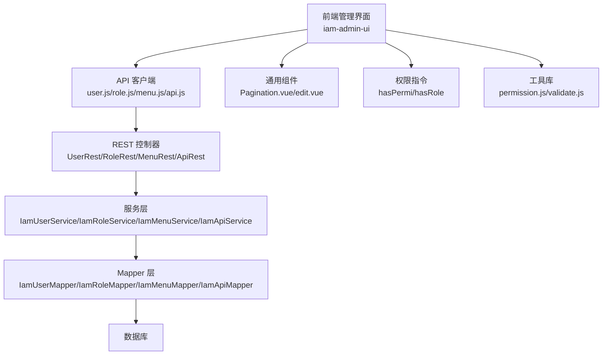
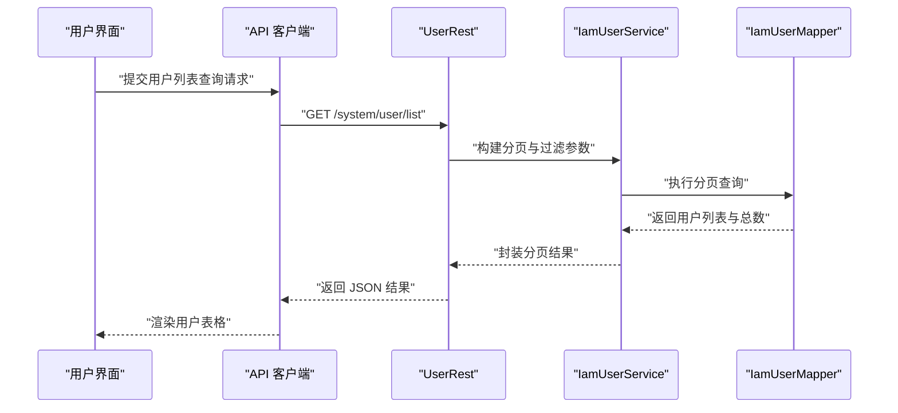
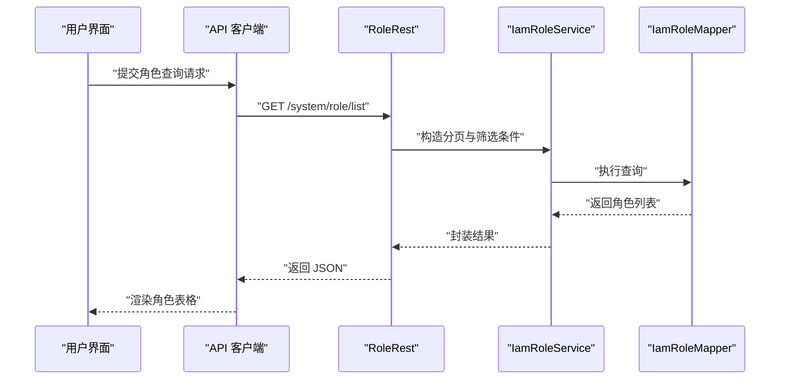
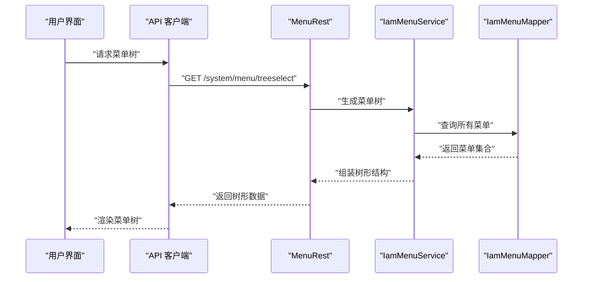
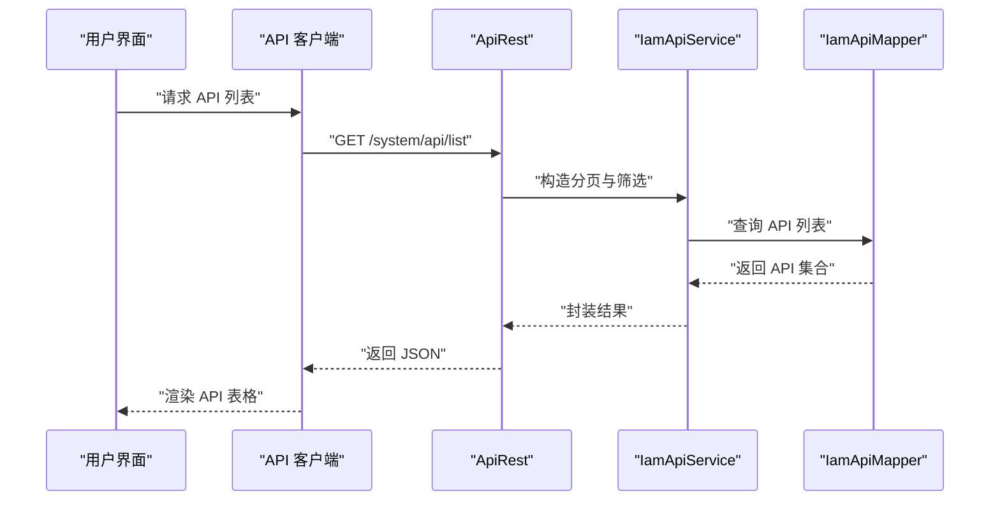
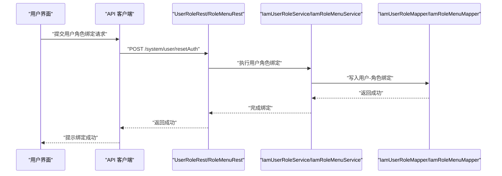
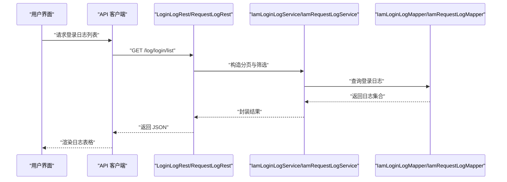
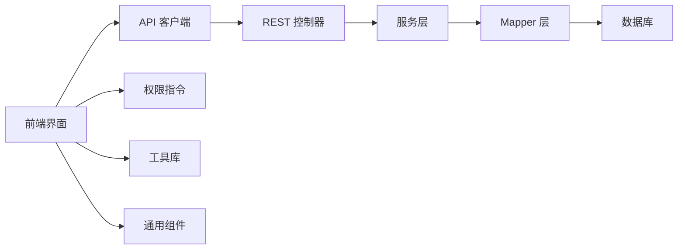

# 系统管理功能模块

<cite>
**本文档引用的文件**
- [IamAdminAutoConfig.java](file://iam-admin/src/main/java/com/wkclz/iam/admin/IamAdminAutoConfig.java)
- [Route.java](file://iam-admin/src/main/java/com/wkclz/iam/admin/Route.java)
- [RestfulScan.java](file://iam-admin/src/main/java/com/wkclz/iam/admin/init/RestfulScan.java)
- [IamAdminConfig.java](file://iam-admin/src/main/java/com/wkclz/iam/admin/config/IamAdminConfig.java)
- [UserRest.java](file://iam-admin/src/main/java/com/wkclz/iam/admin/rest/UserRest.java)
- [RoleRest.java](file://iam-admin/src/main/java/com/wkclz/iam/admin/rest/RoleRest.java)
- [MenuRest.java](file://iam-admin/src/main/java/com/wkclz/iam/admin/rest/MenuRest.java)
- [ApiRest.java](file://iam-admin/src/main/java/com/wkclz/iam/admin/rest/ApiRest.java)
- [UserRoleRest.java](file://iam-admin/src/main/java/com/wkclz/iam/admin/rest/UserRoleRest.java)
- [RoleMenuRest.java](file://iam-admin/src/main/java/com/wkclz/iam/admin/rest/RoleMenuRest.java)
- [MenuApiRest.java](file://iam-admin/src/main/java/com/wkclz/iam/admin/rest/MenuApiRest.java)
- [UserAuthRest.java](file://iam-admin/src/main/java/com/wkclz/iam/admin/rest/UserAuthRest.java)
- [IamUserService.java](file://iam-admin/src/main/java/com/wkclz/iam/admin/service/IamUserService.java)
- [IamUserAuthService.java](file://iam-admin/src/main/java/com/wkclz/iam/admin/service/IamUserAuthService.java)
- [IamUserRoleService.java](file://iam-admin/src/main/java/com/wkclz/iam/admin/service/IamUserRoleService.java)
- [IamRoleService.java](file://iam-admin/src/main/java/com/wkclz/iam/admin/service/IamRoleService.java)
- [IamRoleMenuService.java](file://iam-admin/src/main/java/com/wkclz/iam/admin/service/IamRoleMenuService.java)
- [IamMenuService.java](file://iam-admin/src/main/java/com/wkclz/iam/admin/service/IamMenuService.java)
- [IamApiService.java](file://iam-admin/src/main/java/com/wkclz/iam/admin/service/IamApiService.java)
- [IamMenuApiService.java](file://iam-admin/src/main/java/com/wkclz/iam/admin/service/IamMenuApiService.java)
- [IamUserMenuService.java](file://iam-admin/src/main/java/com/wkclz/iam/admin/service/IamUserMenuService.java)
- [IamLoginLogService.java](file://iam-admin/src/main/java/com/wkclz/iam/admin/service/IamLoginLogService.java)
- [IamRequestLogService.java](file://iam-admin/src/main/java/com/wkclz/iam/admin/service/IamRequestLogService.java)
- [IamUserMapper.java](file://iam-admin/src/main/java/com/wkclz/iam/admin/mapper/IamUserMapper.java)
- [IamUserAuthMapper.java](file://iam-admin/src/main/java/com/wkclz/iam/admin/mapper/IamUserAuthMapper.java)
- [IamUserRoleMapper.java](file://iam-admin/src/main/java/com/wkclz/iam/admin/mapper/IamUserRoleMapper.java)
- [IamRoleMapper.java](file://iam-admin/src/main/java/com/wkclz/iam/admin/mapper/IamRoleMapper.java)
- [IamRoleMenuMapper.java](file://iam-admin/src/main/java/com/wkclz/iam/admin/mapper/IamRoleMenuMapper.java)
- [IamMenuMapper.java](file://iam-admin/src/main/java/com/wkclz/iam/admin/mapper/IamMenuMapper.java)
- [IamApiMapper.java](file://iam-admin/src/main/java/com/wkclz/iam/admin/mapper/IamApiMapper.java)
- [IamMenuApiMapper.java](file://iam-admin/src/main/java/com/wkclz/iam/admin/mapper/IamMenuApiMapper.java)
- [IamLoginLogMapper.java](file://iam-admin/src/main/java/com/wkclz/iam/admin/mapper/IamLoginLogMapper.java)
- [IamRequestLogMapper.java](file://iam-admin/src/main/java/com/wkclz/iam/admin/mapper/IamRequestLogMapper.java)
- [IamUserDto.java](file://iam-common/src/main/java/com/wkclz/iam/common/dto/IamUserDto.java)
- [IamRoleDto.java](file://iam-common/src/main/java/com/wkclz/iam/common/dto/IamRoleDto.java)
- [IamMenuDto.java](file://iam-common/src/main/java/com/wkclz/iam/common/dto/IamMenuDto.java)
- [IamApiDto.java](file://iam-common/src/main/java/com/wkclz/iam/common/dto/IamApiDto.java)
- [IamUserAuthDto.java](file://iam-common/src/main/java/com/wkclz/iam/common/dto/IamUserAuthDto.java)
- [IamUserRoleDto.java](file://iam-common/src/main/java/com/wkclz/iam/common/dto/IamUserRoleDto.java)
- [IamRoleMenuDto.java](file://iam-common/src/main/java/com/wkclz/iam/common/dto/IamRoleMenuDto.java)
- [IamMenuApiDto.java](file://iam-common/src/main/java/com/wkclz/iam/common/dto/IamMenuApiDto.java)
- [Pagination.vue](file://iam-admin-ui/src/views/components/Pagination/index.vue)
- [edit.vue（用户）](file://iam-admin-ui/src/views/user/user/components/edit.vue)
- [edit.vue（角色）](file://iam-admin-ui/src/views/user/role/components/edit.vue)
- [edit.vue（菜单）](file://iam-admin-ui/src/views/system/menu/components/edit.vue)
- [edit.vue（API）](file://iam-admin-ui/src/views/system/api/components/edit.vue)
- [index.vue（用户）](file://iam-admin-ui/src/views/user/user/index.vue)
- [index.vue（角色）](file://iam-admin-ui/src/views/user/role/index.vue)
- [index.vue（菜单）](file://iam-admin-ui/src/views/system/menu/index.vue)
- [index.vue（API）](file://iam-admin-ui/src/views/system/api/index.vue)
- [loginlog.js](file://iam-admin-ui/src/api/log/loginlog.js)
- [requestlog.js](file://iam-admin-ui/src/api/log/requestlog.js)
- [user.js](file://iam-admin-ui/src/api/user/user.js)
- [role.js](file://iam-admin-ui/src/api/user/role.js)
- [menu.js](file://iam-admin-ui/src/api/system/menu.js)
- [api.js](file://iam-admin-ui/src/api/system/api.js)
- [ak.js](file://iam-admin-ui/src/api/system/ak.js)
- [ak-api.js](file://iam-admin-ui/src/api/system/ak-api.js)
- [common.js](file://iam-admin-ui/src/api/common.js)
- [generator/config.js](file://iam-admin-ui/src/utils/generator/config.js)
- [generator/js.js](file://iam-admin-ui/src/utils/generator/js.js)
- [generator/render.js](file://iam-admin-ui/src/utils/generator/render.js)
- [hasPermi.js](file://iam-admin-ui/src/directive/permission/hasPermi.js)
- [hasRole.js](file://iam-admin-ui/src/directive/permission/hasRole.js)
- [auth.js](file://iam-admin-ui/src/utils/auth.js)
- [permission.js](file://iam-admin-ui/src/utils/permission.js)
- [validate.js](file://iam-admin-ui/src/utils/validate.js)
- [index.js（store）](file://iam-admin-ui/src/store/modules/permission.js)
- [index.js（路由）](file://iam-admin-ui/src/router/index.js)
- [index.js（插件）](file://iam-admin-ui/src/plugins/index.js)
- [index.js（工具）](file://iam-admin-ui/src/utils/index.js)
- [index.scss](file://iam-admin-ui/src/assets/styles/index.scss)
- [element-ui.scss](file://iam-admin-ui/src/assets/styles/element-ui.scss)
- [ruoyi.scss](file://iam-admin-ui/src/assets/styles/ruoyi.scss)
</cite>

## 目录
1. [简介](#简介)
2. [项目结构](#项目结构)
3. [核心组件](#核心组件)
4. [架构总览](#架构总览)
5. [详细组件分析](#详细组件分析)
6. [依赖关系分析](#依赖关系分析)
7. [性能考虑](#性能考虑)
8. [故障排查指南](#故障排查指南)
9. [结论](#结论)
10. [附录](#附录)

## 简介
本技术文档聚焦于 SH-IAM 管理后台系统的“系统管理功能模块”，围绕用户管理、角色管理、菜单管理和 API 权限管理四大核心能力，系统阐述后端服务层与前端界面层的实现方式，覆盖 CRUD 数据绑定、表单验证、批量操作、分页搜索、导入导出、表单与弹窗组件复用、统一管理以及操作日志记录机制等关键主题。文档以实际源码为依据，提供可追溯的章节来源与图示化分析，帮助开发者快速理解与扩展系统。

## 项目结构
系统采用前后端分离架构：后端基于 Spring Boot 的 IAM 管理模块（iam-admin），提供 REST 接口；前端基于 Vue3（iam-admin-ui），通过统一 API 层对接后端服务。核心模块包括：
- 后端管理模块（iam-admin）：自动装配、路由扫描、REST 控制器、服务层、Mapper 层与 XML 映射
- 公共 DTO/实体（iam-common）：跨模块共享的数据传输对象与实体定义
- 前端管理界面（iam-admin-ui）：用户/角色/菜单/API 等页面、通用组件、指令与工具库

**图表来源**
- [IamAdminAutoConfig.java](file://iam-admin/src/main/java/com/wkclz/iam/admin/IamAdminAutoConfig.java)
- [RestfulScan.java](file://iam-admin/src/main/java/com/wkclz/iam/admin/init/RestfulScan.java)
- [UserRest.java](file://iam-admin/src/main/java/com/wkclz/iam/admin/rest/UserRest.java)
- [RoleRest.java](file://iam-admin/src/main/java/com/wkclz/iam/admin/rest/RoleRest.java)
- [MenuRest.java](file://iam-admin/src/main/java/com/wkclz/iam/admin/rest/MenuRest.java)
- [ApiRest.java](file://iam-admin/src/main/java/com/wkclz/iam/admin/rest/ApiRest.java)
- [IamUserService.java](file://iam-admin/src/main/java/com/wkclz/iam/admin/service/IamUserService.java)
- [IamRoleService.java](file://iam-admin/src/main/java/com/wkclz/iam/admin/service/IamRoleService.java)
- [IamMenuService.java](file://iam-admin/src/main/java/com/wkclz/iam/admin/service/IamMenuService.java)
- [IamApiService.java](file://iam-admin/src/main/java/com/wkclz/iam/admin/service/IamApiService.java)
- [IamUserMapper.java](file://iam-admin/src/main/java/com/wkclz/iam/admin/mapper/IamUserMapper.java)
- [IamRoleMapper.java](file://iam-admin/src/main/java/com/wkclz/iam/admin/mapper/IamRoleMapper.java)
- [IamMenuMapper.java](file://iam-admin/src/main/java/com/wkclz/iam/admin/mapper/IamMenuMapper.java)
- [IamApiMapper.java](file://iam-admin/src/main/java/com/wkclz/iam/admin/mapper/IamApiMapper.java)
- [Pagination.vue](file://iam-admin-ui/src/views/components/Pagination/index.vue)
- [edit.vue（用户）](file://iam-admin-ui/src/views/user/user/components/edit.vue)
- [edit.vue（角色）](file://iam-admin-ui/src/views/user/role/components/edit.vue)
- [edit.vue（菜单）](file://iam-admin-ui/src/views/system/menu/components/edit.vue)
- [edit.vue（API）](file://iam-admin-ui/src/views/system/api/components/edit.vue)
- [user.js](file://iam-admin-ui/src/api/user/user.js)
- [role.js](file://iam-admin-ui/src/api/user/role.js)
- [menu.js](file://iam-admin-ui/src/api/system/menu.js)
- [api.js](file://iam-admin-ui/src/api/system/api.js)

**章节来源**
- [IamAdminAutoConfig.java](file://iam-admin/src/main/java/com/wkclz/iam/admin/IamAdminAutoConfig.java)
- [RestfulScan.java](file://iam-admin/src/main/java/com/wkclz/iam/admin/init/RestfulScan.java)
- [Route.java](file://iam-admin/src/main/java/com/wkclz/iam/admin/Route.java)
- [IamAdminConfig.java](file://iam-admin/src/main/java/com/wkclz/iam/admin/config/IamAdminConfig.java)

## 核心组件
本节概述系统管理功能涉及的关键组件及其职责：
- 自动装配与路由：负责扫描 REST 控制器并注册到应用上下文
- REST 控制器：提供用户、角色、菜单、API 的增删改查与关联操作接口
- 服务层：封装业务逻辑，协调 Mapper 与 DTO
- Mapper/XML：映射数据库表，执行 SQL 查询与更新
- 前端页面与组件：用户列表、角色授权、菜单树、API 权限配置
- 日志服务：登录日志与请求日志持久化

**章节来源**
- [IamAdminAutoConfig.java](file://iam-admin/src/main/java/com/wkclz/iam/admin/IamAdminAutoConfig.java)
- [RestfulScan.java](file://iam-admin/src/main/java/com/wkclz/iam/admin/init/RestfulScan.java)
- [UserRest.java](file://iam-admin/src/main/java/com/wkclz/iam/admin/rest/UserRest.java)
- [RoleRest.java](file://iam-admin/src/main/java/com/wkclz/iam/admin/rest/RoleRest.java)
- [MenuRest.java](file://iam-admin/src/main/java/com/wkclz/iam/admin/rest/MenuRest.java)
- [ApiRest.java](file://iam-admin/src/main/java/com/wkclz/iam/admin/rest/ApiRest.java)
- [IamUserService.java](file://iam-admin/src/main/java/com/wkclz/iam/admin/service/IamUserService.java)
- [IamRoleService.java](file://iam-admin/src/main/java/com/wkclz/iam/admin/service/IamRoleService.java)
- [IamMenuService.java](file://iam-admin/src/main/java/com/wkclz/iam/admin/service/IamMenuService.java)
- [IamApiService.java](file://iam-admin/src/main/java/com/wkclz/iam/admin/service/IamApiService.java)
- [IamUserMapper.java](file://iam-admin/src/main/java/com/wkclz/iam/admin/mapper/IamUserMapper.java)
- [IamRoleMapper.java](file://iam-admin/src/main/java/com/wkclz/iam/admin/mapper/IamRoleMapper.java)
- [IamMenuMapper.java](file://iam-admin/src/main/java/com/wkclz/iam/admin/mapper/IamMenuMapper.java)
- [IamApiMapper.java](file://iam-admin/src/main/java/com/wkclz/iam/admin/mapper/IamApiMapper.java)
- [IamUserDto.java](file://iam-common/src/main/java/com/wkclz/iam/common/dto/IamUserDto.java)
- [IamRoleDto.java](file://iam-common/src/main/java/com/wkclz/iam/common/dto/IamRoleDto.java)
- [IamMenuDto.java](file://iam-common/src/main/java/com/wkclz/iam/common/dto/IamMenuDto.java)
- [IamApiDto.java](file://iam-common/src/main/java/com/wkclz/iam/common/dto/IamApiDto.java)

## 架构总览
系统采用“控制器-服务-数据访问”的分层架构，前端通过 API 客户端调用后端 REST 接口，服务层对 DTO 进行转换与校验，Mapper 负责与数据库交互。权限控制通过指令与工具在前端进行基础拦截，在后端通过过滤器与服务层进行强约束。

**图表来源**
- [user.js](file://iam-admin-ui/src/api/user/user.js)
- [role.js](file://iam-admin-ui/src/api/user/role.js)
- [menu.js](file://iam-admin-ui/src/api/system/menu.js)
- [api.js](file://iam-admin-ui/src/api/system/api.js)
- [UserRest.java](file://iam-admin/src/main/java/com/wkclz/iam/admin/rest/UserRest.java)
- [RoleRest.java](file://iam-admin/src/main/java/com/wkclz/iam/admin/rest/RoleRest.java)
- [MenuRest.java](file://iam-admin/src/main/java/com/wkclz/iam/admin/rest/MenuRest.java)
- [ApiRest.java](file://iam-admin/src/main/java/com/wkclz/iam/admin/rest/ApiRest.java)
- [IamUserService.java](file://iam-admin/src/main/java/com/wkclz/iam/admin/service/IamUserService.java)
- [IamRoleService.java](file://iam-admin/src/main/java/com/wkclz/iam/admin/service/IamRoleService.java)
- [IamMenuService.java](file://iam-admin/src/main/java/com/wkclz/iam/admin/service/IamMenuService.java)
- [IamApiService.java](file://iam-admin/src/main/java/com/wkclz/iam/admin/service/IamApiService.java)
- [IamUserMapper.java](file://iam-admin/src/main/java/com/wkclz/iam/admin/mapper/IamUserMapper.java)
- [IamRoleMapper.java](file://iam-admin/src/main/java/com/wkclz/iam/admin/mapper/IamRoleMapper.java)
- [IamMenuMapper.java](file://iam-admin/src/main/java/com/wkclz/iam/admin/mapper/IamMenuMapper.java)
- [IamApiMapper.java](file://iam-admin/src/main/java/com/wkclz/iam/admin/mapper/IamApiMapper.java)
- [Pagination.vue](file://iam-admin-ui/src/views/components/Pagination/index.vue)
- [edit.vue（用户）](file://iam-admin-ui/src/views/user/user/components/edit.vue)
- [edit.vue（角色）](file://iam-admin-ui/src/views/user/role/components/edit.vue)
- [edit.vue（菜单）](file://iam-admin-ui/src/views/system/menu/components/edit.vue)
- [edit.vue（API）](file://iam-admin-ui/src/views/system/api/components/edit.vue)
- [hasPermi.js](file://iam-admin-ui/src/directive/permission/hasPermi.js)
- [hasRole.js](file://iam-admin-ui/src/directive/permission/hasRole.js)
- [permission.js](file://iam-admin-ui/src/utils/permission.js)
- [validate.js](file://iam-admin-ui/src/utils/validate.js)

## 详细组件分析

### 用户管理模块
- 功能要点
  - 列表展示：支持分页、搜索过滤（用户名、状态、部门等）
  - 表单验证：必填项、格式校验、唯一性检查
  - 批量操作：批量删除、批量启用/停用
  - 导入导出：Excel 导入用户信息，导出用户列表
  - 复杂操作：重置密码、分配角色、菜单授权
- 前端实现
  - 页面组件：用户列表页与编辑弹窗
  - 组件复用：统一的分页组件与表单组件
  - API 客户端：封装用户 CRUD 与批量操作
  - 工具与指令：权限指令、表单校验工具
- 后端实现
  - 控制器：提供用户增删改查、重置密码、批量操作等接口
  - 服务层：处理用户数据转换、角色绑定、密码历史与安全策略
  - Mapper/XML：查询用户列表、详情、角色绑定、分页条件组装

**图表来源**
- [index.vue（用户）](file://iam-admin-ui/src/views/user/user/index.vue)
- [Pagination.vue](file://iam-admin-ui/src/views/components/Pagination/index.vue)
- [user.js](file://iam-admin-ui/src/api/user/user.js)
- [UserRest.java](file://iam-admin/src/main/java/com/wkclz/iam/admin/rest/UserRest.java)
- [IamUserService.java](file://iam-admin/src/main/java/com/wkclz/iam/admin/service/IamUserService.java)
- [IamUserMapper.java](file://iam-admin/src/main/java/com/wkclz/iam/admin/mapper/IamUserMapper.java)

**章节来源**
- [index.vue（用户）](file://iam-admin-ui/src/views/user/user/index.vue)
- [Pagination.vue](file://iam-admin-ui/src/views/components/Pagination/index.vue)
- [edit.vue（用户）](file://iam-admin-ui/src/views/user/user/components/edit.vue)
- [user.js](file://iam-admin-ui/src/api/user/user.js)
- [UserRest.java](file://iam-admin/src/main/java/com/wkclz/iam/admin/rest/UserRest.java)
- [IamUserService.java](file://iam-admin/src/main/java/com/wkclz/iam/admin/service/IamUserService.java)
- [IamUserMapper.java](file://iam-admin/src/main/java/com/wkclz/iam/admin/mapper/IamUserMapper.java)
- [IamUserDto.java](file://iam-common/src/main/java/com/wkclz/iam/common/dto/IamUserDto.java)

### 角色管理模块
- 功能要点
  - 角色列表与详情：支持状态切换、备注管理
  - 角色授权：为角色绑定菜单与 API 权限
  - 批量操作：批量删除、批量启用/停用
  - 数据维度：按数据维度控制数据范围
- 前端实现
  - 角色列表页与编辑弹窗
  - 权限树选择组件（菜单树与 API 树）
  - API 客户端：角色 CRUD、角色-菜单绑定、角色-数据维度绑定
- 后端实现
  - 控制器：角色 CRUD、角色-菜单绑定、角色-数据维度绑定
  - 服务层：角色权限绑定与解绑、数据维度校验
  - Mapper/XML：角色查询、角色-菜单绑定、角色-数据维度绑定

**图表来源**
- [index.vue（角色）](file://iam-admin-ui/src/views/user/role/index.vue)
- [edit.vue（角色）](file://iam-admin-ui/src/views/user/role/components/edit.vue)
- [role.js](file://iam-admin-ui/src/api/user/role.js)
- [RoleRest.java](file://iam-admin/src/main/java/com/wkclz/iam/admin/rest/RoleRest.java)
- [IamRoleService.java](file://iam-admin/src/main/java/com/wkclz/iam/admin/service/IamRoleService.java)
- [IamRoleMapper.java](file://iam-admin/src/main/java/com/wkclz/iam/admin/mapper/IamRoleMapper.java)

**章节来源**
- [index.vue（角色）](file://iam-admin-ui/src/views/user/role/index.vue)
- [edit.vue（角色）](file://iam-admin-ui/src/views/user/role/components/edit.vue)
- [role.js](file://iam-admin-ui/src/api/user/role.js)
- [RoleRest.java](file://iam-admin/src/main/java/com/wkclz/iam/admin/rest/RoleRest.java)
- [IamRoleService.java](file://iam-admin/src/main/java/com/wkclz/iam/admin/service/IamRoleService.java)
- [IamRoleMapper.java](file://iam-admin/src/main/java/com/wkclz/iam/admin/mapper/IamRoleMapper.java)
- [IamRoleDto.java](file://iam-common/src/main/java/com/wkclz/iam/common/dto/IamRoleDto.java)

### 菜单管理模块
- 功能要点
  - 菜单树形结构：支持层级展示、拖拽排序、展开/折叠
  - 菜单 CRUD：新增、修改、删除、状态切换
  - 菜单与 API 关联：为菜单绑定 API 权限
- 前端实现
  - 菜单树组件与编辑弹窗
  - API 客户端：菜单 CRUD、菜单-APi 绑定
- 后端实现
  - 控制器：菜单 CRUD、菜单-API 绑定
  - 服务层：菜单树生成、父子关系维护
  - Mapper/XML：菜单查询、树形结构组装

**图表来源**
- [index.vue（菜单）](file://iam-admin-ui/src/views/system/menu/index.vue)
- [edit.vue（菜单）](file://iam-admin-ui/src/views/system/menu/components/edit.vue)
- [menu.js](file://iam-admin-ui/src/api/system/menu.js)
- [MenuRest.java](file://iam-admin/src/main/java/com/wkclz/iam/admin/rest/MenuRest.java)
- [IamMenuService.java](file://iam-admin/src/main/java/com/wkclz/iam/admin/service/IamMenuService.java)
- [IamMenuMapper.java](file://iam-admin/src/main/java/com/wkclz/iam/admin/mapper/IamMenuMapper.java)

**章节来源**
- [index.vue（菜单）](file://iam-admin-ui/src/views/system/menu/index.vue)
- [edit.vue（菜单）](file://iam-admin-ui/src/views/system/menu/components/edit.vue)
- [menu.js](file://iam-admin-ui/src/api/system/menu.js)
- [MenuRest.java](file://iam-admin/src/main/java/com/wkclz/iam/admin/rest/MenuRest.java)
- [IamMenuService.java](file://iam-admin/src/main/java/com/wkclz/iam/admin/service/IamMenuService.java)
- [IamMenuMapper.java](file://iam-admin/src/main/java/com/wkclz/iam/admin/mapper/IamMenuMapper.java)
- [IamMenuDto.java](file://iam-common/src/main/java/com/wkclz/iam/common/dto/IamMenuDto.java)

### API 权限管理模块
- 功能要点
  - API 列表：展示接口名称、路径、方法、描述
  - API 自动扫描：识别后端接口并生成 API 列表
  - 菜单-APi 绑定：为菜单授予具体 API 访问权限
- 前端实现
  - API 列表页与编辑弹窗
  - API 客户端：API CRUD、菜单-APi 绑定
- 后端实现
  - 控制器：API CRUD、菜单-APi 绑定
  - 服务层：API 自动扫描与同步、菜单-APi 绑定
  - Mapper/XML：API 查询、菜单-APi 绑定

**图表来源**
- [index.vue（API）](file://iam-admin-ui/src/views/system/api/index.vue)
- [edit.vue（API）](file://iam-admin-ui/src/views/system/api/components/edit.vue)
- [api.js](file://iam-admin-ui/src/api/system/api.js)
- [ApiRest.java](file://iam-admin/src/main/java/com/wkclz/iam/admin/rest/ApiRest.java)
- [IamApiService.java](file://iam-admin/src/main/java/com/wkclz/iam/admin/service/IamApiService.java)
- [IamApiMapper.java](file://iam-admin/src/main/java/com/wkclz/iam/admin/mapper/IamApiMapper.java)

**章节来源**
- [index.vue（API）](file://iam-admin-ui/src/views/system/api/index.vue)
- [edit.vue（API）](file://iam-admin-ui/src/views/system/api/components/edit.vue)
- [api.js](file://iam-admin-ui/src/api/system/api.js)
- [ApiRest.java](file://iam-admin/src/main/java/com/wkclz/iam/admin/rest/ApiRest.java)
- [IamApiService.java](file://iam-admin/src/main/java/com/wkclz/iam/admin/service/IamApiService.java)
- [IamApiMapper.java](file://iam-admin/src/main/java/com/wkclz/iam/admin/mapper/IamApiMapper.java)
- [IamApiDto.java](file://iam-common/src/main/java/com/wkclz/iam/common/dto/IamApiDto.java)

### 用户-角色与角色-菜单关联
- 用户-角色：为用户分配一个或多个角色，影响其权限集合
- 角色-菜单：为角色授予菜单访问权限，形成菜单树可见性
- 角色-数据维度：限制角色可访问的数据范围
- 前端实现：在用户与角色页面中提供多选框与树形选择
- 后端实现：提供绑定/解绑接口，服务层进行一致性校验

**图表来源**
- [UserRoleRest.java](file://iam-admin/src/main/java/com/wkclz/iam/admin/rest/UserRoleRest.java)
- [RoleMenuRest.java](file://iam-admin/src/main/java/com/wkclz/iam/admin/rest/RoleMenuRest.java)
- [IamUserRoleService.java](file://iam-admin/src/main/java/com/wkclz/iam/admin/service/IamUserRoleService.java)
- [IamRoleMenuService.java](file://iam-admin/src/main/java/com/wkclz/iam/admin/service/IamRoleMenuService.java)
- [IamUserRoleMapper.java](file://iam-admin/src/main/java/com/wkclz/iam/admin/mapper/IamUserRoleMapper.java)
- [IamRoleMenuMapper.java](file://iam-admin/src/main/java/com/wkclz/iam/admin/mapper/IamRoleMenuMapper.java)

**章节来源**
- [UserRoleRest.java](file://iam-admin/src/main/java/com/wkclz/iam/admin/rest/UserRoleRest.java)
- [RoleMenuRest.java](file://iam-admin/src/main/java/com/wkclz/iam/admin/rest/RoleMenuRest.java)
- [IamUserRoleService.java](file://iam-admin/src/main/java/com/wkclz/iam/admin/service/IamUserRoleService.java)
- [IamRoleMenuService.java](file://iam-admin/src/main/java/com/wkclz/iam/admin/service/IamRoleMenuService.java)
- [IamUserRoleMapper.java](file://iam-admin/src/main/java/com/wkclz/iam/admin/mapper/IamUserRoleMapper.java)
- [IamRoleMenuMapper.java](file://iam-admin/src/main/java/com/wkclz/iam/admin/mapper/IamRoleMenuMapper.java)
- [IamUserRoleDto.java](file://iam-common/src/main/java/com/wkclz/iam/common/dto/IamUserRoleDto.java)
- [IamRoleMenuDto.java](file://iam-common/src/main/java/com/wkclz/iam/common/dto/IamRoleMenuDto.java)

### 操作日志与请求追踪
- 登录日志：记录登录时间、IP、设备、结果等
- 请求日志：记录请求路径、方法、耗时、响应状态等
- 前端实现：日志查询页面与详情弹窗
- 后端实现：服务层持久化日志，提供查询接口

**图表来源**
- [loginlog.js](file://iam-admin-ui/src/api/log/loginlog.js)
- [requestlog.js](file://iam-admin-ui/src/api/log/requestlog.js)
- [LoginLogRest.java](file://iam-admin/src/main/java/com/wkclz/iam/admin/rest/LoginLogRest.java)
- [RequestLogRest.java](file://iam-admin/src/main/java/com/wkclz/iam/admin/rest/RequestLogRest.java)
- [IamLoginLogService.java](file://iam-admin/src/main/java/com/wkclz/iam/admin/service/IamLoginLogService.java)
- [IamRequestLogService.java](file://iam-admin/src/main/java/com/wkclz/iam/admin/service/IamRequestLogService.java)
- [IamLoginLogMapper.java](file://iam-admin/src/main/java/com/wkclz/iam/admin/mapper/IamLoginLogMapper.java)
- [IamRequestLogMapper.java](file://iam-admin/src/main/java/com/wkclz/iam/admin/mapper/IamRequestLogMapper.java)

**章节来源**
- [loginlog.js](file://iam-admin-ui/src/api/log/loginlog.js)
- [requestlog.js](file://iam-admin-ui/src/api/log/requestlog.js)
- [LoginLogRest.java](file://iam-admin/src/main/java/com/wkclz/iam/admin/rest/LoginLogRest.java)
- [RequestLogRest.java](file://iam-admin/src/main/java/com/wkclz/iam/admin/rest/RequestLogRest.java)
- [IamLoginLogService.java](file://iam-admin/src/main/java/com/wkclz/iam/admin/service/IamLoginLogService.java)
- [IamRequestLogService.java](file://iam-admin/src/main/java/com/wkclz/iam/admin/service/IamRequestLogService.java)
- [IamLoginLogMapper.java](file://iam-admin/src/main/java/com/wkclz/iam/admin/mapper/IamLoginLogMapper.java)
- [IamRequestLogMapper.java](file://iam-admin/src/main/java/com/wkclz/iam/admin/mapper/IamRequestLogMapper.java)

## 依赖关系分析
系统管理模块的依赖关系清晰，遵循“控制器-服务-数据访问”分层原则，前端通过 API 客户端与后端解耦。权限控制在前端通过指令与工具进行基础拦截，在后端通过服务层与过滤器进行强约束。

**图表来源**
- [user.js](file://iam-admin-ui/src/api/user/user.js)
- [role.js](file://iam-admin-ui/src/api/user/role.js)
- [menu.js](file://iam-admin-ui/src/api/system/menu.js)
- [api.js](file://iam-admin-ui/src/api/system/api.js)
- [UserRest.java](file://iam-admin/src/main/java/com/wkclz/iam/admin/rest/UserRest.java)
- [RoleRest.java](file://iam-admin/src/main/java/com/wkclz/iam/admin/rest/RoleRest.java)
- [MenuRest.java](file://iam-admin/src/main/java/com/wkclz/iam/admin/rest/MenuRest.java)
- [ApiRest.java](file://iam-admin/src/main/java/com/wkclz/iam/admin/rest/ApiRest.java)
- [IamUserService.java](file://iam-admin/src/main/java/com/wkclz/iam/admin/service/IamUserService.java)
- [IamRoleService.java](file://iam-admin/src/main/java/com/wkclz/iam/admin/service/IamRoleService.java)
- [IamMenuService.java](file://iam-admin/src/main/java/com/wkclz/iam/admin/service/IamMenuService.java)
- [IamApiService.java](file://iam-admin/src/main/java/com/wkclz/iam/admin/service/IamApiService.java)
- [IamUserMapper.java](file://iam-admin/src/main/java/com/wkclz/iam/admin/mapper/IamUserMapper.java)
- [IamRoleMapper.java](file://iam-admin/src/main/java/com/wkclz/iam/admin/mapper/IamRoleMapper.java)
- [IamMenuMapper.java](file://iam-admin/src/main/java/com/wkclz/iam/admin/mapper/IamMenuMapper.java)
- [IamApiMapper.java](file://iam-admin/src/main/java/com/wkclz/iam/admin/mapper/IamApiMapper.java)
- [hasPermi.js](file://iam-admin-ui/src/directive/permission/hasPermi.js)
- [hasRole.js](file://iam-admin-ui/src/directive/permission/hasRole.js)
- [permission.js](file://iam-admin-ui/src/utils/permission.js)
- [validate.js](file://iam-admin-ui/src/utils/validate.js)
- [Pagination.vue](file://iam-admin-ui/src/views/components/Pagination/index.vue)

**章节来源**
- [hasPermi.js](file://iam-admin-ui/src/directive/permission/hasPermi.js)
- [hasRole.js](file://iam-admin-ui/src/directive/permission/hasRole.js)
- [permission.js](file://iam-admin-ui/src/utils/permission.js)
- [validate.js](file://iam-admin-ui/src/utils/validate.js)
- [Pagination.vue](file://iam-admin-ui/src/views/components/Pagination/index.vue)

## 性能考虑
- 分页与筛选：后端应使用数据库分页与索引优化，避免一次性加载全量数据
- 缓存策略：热点数据如字典、菜单树可引入缓存，降低数据库压力
- 并发控制：批量操作建议使用事务与幂等设计，防止重复提交
- 前端渲染：大数据量表格建议虚拟滚动与懒加载，提升交互体验
- 日志落库：日志写入建议异步批处理，避免阻塞主流程

## 故障排查指南
- 权限不足
  - 现象：页面按钮不可见或接口 403
  - 排查：确认前端权限指令是否生效、后端服务层权限校验是否通过
  - 参考：hasPermi/hasRole 指令与 permission.js 工具
- 数据不一致
  - 现象：用户角色/菜单绑定后权限未生效
  - 排查：检查绑定接口是否成功、缓存是否刷新、会话是否重建
  - 参考：UserRoleRest/RoleMenuRest 与对应服务层
- 查询无结果
  - 现象：列表为空或分页异常
  - 排查：核对筛选条件、分页参数、数据库索引
  - 参考：各 REST 控制器的查询接口与 Mapper XML
- 日志缺失
  - 现象：登录/请求日志未记录
  - 排查：确认日志服务是否启动、Mapper 是否正确映射、数据库连接正常
  - 参考：LoginLogRest/RequestLogRest 与对应 Mapper

**章节来源**
- [hasPermi.js](file://iam-admin-ui/src/directive/permission/hasPermi.js)
- [hasRole.js](file://iam-admin-ui/src/directive/permission/hasRole.js)
- [permission.js](file://iam-admin-ui/src/utils/permission.js)
- [LoginLogRest.java](file://iam-admin/src/main/java/com/wkclz/iam/admin/rest/LoginLogRest.java)
- [RequestLogRest.java](file://iam-admin/src/main/java/com/wkclz/iam/admin/rest/RequestLogRest.java)
- [IamLoginLogMapper.java](file://iam-admin/src/main/java/com/wkclz/iam/admin/mapper/IamLoginLogMapper.java)
- [IamRequestLogMapper.java](file://iam-admin/src/main/java/com/wkclz/iam/admin/mapper/IamRequestLogMapper.java)

## 结论
本模块通过清晰的分层架构与前后端协同，实现了用户、角色、菜单与 API 权限的全链路管理。借助统一的 API 客户端、通用组件与权限指令，系统具备良好的可维护性与扩展性。建议在后续迭代中进一步完善缓存策略、批量操作的事务与幂等设计，以及日志的异步落库与可视化分析能力。

## 附录
- 代码片段路径示例（不展示具体代码内容）
  - 用户列表查询接口：[UserRest.java](file://iam-admin/src/main/java/com/wkclz/iam/admin/rest/UserRest.java)
  - 角色列表查询接口：[RoleRest.java](file://iam-admin/src/main/java/com/wkclz/iam/admin/rest/RoleRest.java)
  - 菜单树查询接口：[MenuRest.java](file://iam-admin/src/main/java/com/wkclz/iam/admin/rest/MenuRest.java)
  - API 列表查询接口：[ApiRest.java](file://iam-admin/src/main/java/com/wkclz/iam/admin/rest/ApiRest.java)
  - 用户角色绑定接口：[UserRoleRest.java](file://iam-admin/src/main/java/com/wkclz/iam/admin/rest/UserRoleRest.java)
  - 角色菜单绑定接口：[RoleMenuRest.java](file://iam-admin/src/main/java/com/wkclz/iam/admin/rest/RoleMenuRest.java)
  - 菜单 API 绑定接口：[MenuApiRest.java](file://iam-admin/src/main/java/com/wkclz/iam/admin/rest/MenuApiRest.java)
  - 用户认证接口：[UserAuthRest.java](file://iam-admin/src/main/java/com/wkclz/iam/admin/rest/UserAuthRest.java)
  - 登录日志查询接口：[LoginLogRest.java](file://iam-admin/src/main/java/com/wkclz/iam/admin/rest/LoginLogRest.java)
  - 请求日志查询接口：[RequestLogRest.java](file://iam-admin/src/main/java/com/wkclz/iam/admin/rest/RequestLogRest.java)
  - 用户服务实现：[IamUserService.java](file://iam-admin/src/main/java/com/wkclz/iam/admin/service/IamUserService.java)
  - 角色服务实现：[IamRoleService.java](file://iam-admin/src/main/java/com/wkclz/iam/admin/service/IamRoleService.java)
  - 菜单服务实现：[IamMenuService.java](file://iam-admin/src/main/java/com/wkclz/iam/admin/service/IamMenuService.java)
  - API 服务实现：[IamApiService.java](file://iam-admin/src/main/java/com/wkclz/iam/admin/service/IamApiService.java)
  - 用户 Mapper 实现：[IamUserMapper.java](file://iam-admin/src/main/java/com/wkclz/iam/admin/mapper/IamUserMapper.java)
  - 角色 Mapper 实现：[IamRoleMapper.java](file://iam-admin/src/main/java/com/wkclz/iam/admin/mapper/IamRoleMapper.java)
  - 菜单 Mapper 实现：[IamMenuMapper.java](file://iam-admin/src/main/java/com/wkclz/iam/admin/mapper/IamMenuMapper.java)
  - API Mapper 实现：[IamApiMapper.java](file://iam-admin/src/main/java/com/wkclz/iam/admin/mapper/IamApiMapper.java)
  - 用户 DTO 定义：[IamUserDto.java](file://iam-common/src/main/java/com/wkclz/iam/common/dto/IamUserDto.java)
  - 角色 DTO 定义：[IamRoleDto.java](file://iam-common/src/main/java/com/wkclz/iam/common/dto/IamRoleDto.java)
  - 菜单 DTO 定义：[IamMenuDto.java](file://iam-common/src/main/java/com/wkclz/iam/common/dto/IamMenuDto.java)
  - API DTO 定义：[IamApiDto.java](file://iam-common/src/main/java/com/wkclz/iam/common/dto/IamApiDto.java)
  - 用户认证 DTO 定义：[IamUserAuthDto.java](file://iam-common/src/main/java/com/wkclz/iam/common/dto/IamUserAuthDto.java)
  - 用户角色 DTO 定义：[IamUserRoleDto.java](file://iam-common/src/main/java/com/wkclz/iam/common/dto/IamUserRoleDto.java)
  - 角色菜单 DTO 定义：[IamRoleMenuDto.java](file://iam-common/src/main/java/com/wkclz/iam/common/dto/IamRoleMenuDto.java)
  - 菜单 API DTO 定义：[IamMenuApiDto.java](file://iam-common/src/main/java/com/wkclz/iam/common/dto/IamMenuApiDto.java)
  - 分页组件：[Pagination.vue](file://iam-admin-ui/src/views/components/Pagination/index.vue)
  - 用户编辑弹窗：[edit.vue（用户）](file://iam-admin-ui/src/views/user/user/components/edit.vue)
  - 角色编辑弹窗：[edit.vue（角色）](file://iam-admin-ui/src/views/user/role/components/edit.vue)
  - 菜单编辑弹窗：[edit.vue（菜单）](file://iam-admin-ui/src/views/system/menu/components/edit.vue)
  - API 编辑弹窗：[edit.vue（API）](file://iam-admin-ui/src/views/system/api/components/edit.vue)
  - 用户 API 客户端：[user.js](file://iam-admin-ui/src/api/user/user.js)
  - 角色 API 客户端：[role.js](file://iam-admin-ui/src/api/user/role.js)
  - 菜单 API 客户端：[menu.js](file://iam-admin-ui/src/api/system/menu.js)
  - API API 客户端：[api.js](file://iam-admin-ui/src/api/system/api.js)
  - 通用 API 客户端：[common.js](file://iam-admin-ui/src/api/common.js)
  - 登录日志 API 客户端：[loginlog.js](file://iam-admin-ui/src/api/log/loginlog.js)
  - 请求日志 API 客户端：[requestlog.js](file://iam-admin-ui/src/api/log/requestlog.js)
  - 权限指令（权限）：[hasPermi.js](file://iam-admin-ui/src/directive/permission/hasPermi.js)
  - 权限指令（角色）：[hasRole.js](file://iam-admin-ui/src/directive/permission/hasRole.js)
  - 权限工具：[permission.js](file://iam-admin-ui/src/utils/permission.js)
  - 表单校验工具：[validate.js](file://iam-admin-ui/src/utils/validate.js)
  - 自动化表单生成配置：[generator/config.js](file://iam-admin-ui/src/utils/generator/config.js)
  - 自动化表单生成 JS：[generator/js.js](file://iam-admin-ui/src/utils/generator/js.js)
  - 自动化表单渲染：[generator/render.js](file://iam-admin-ui/src/utils/generator/render.js)
  - 主题样式入口：[index.scss](file://iam-admin-ui/src/assets/styles/index.scss)
  - Element UI 样式：[element-ui.scss](file://iam-admin-ui/src/assets/styles/element-ui.scss)
  - Ruoyi 样式：[ruoyi.scss](file://iam-admin-ui/src/assets/styles/ruoyi.scss)