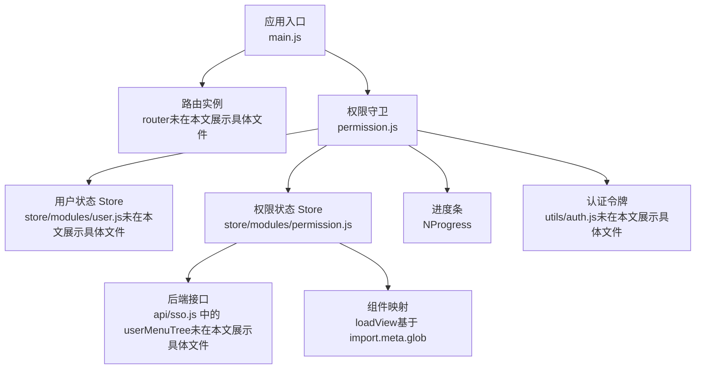
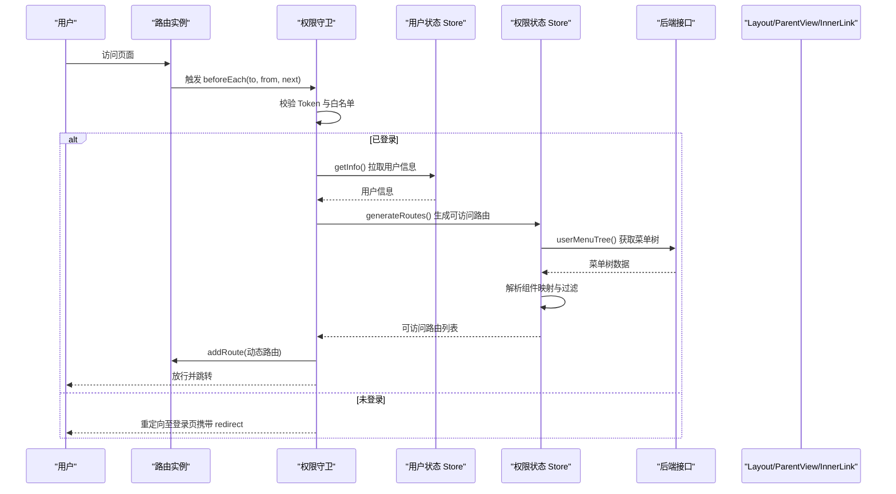
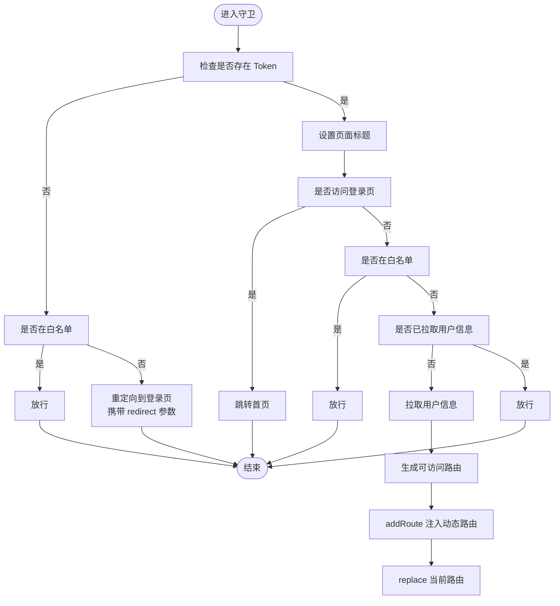
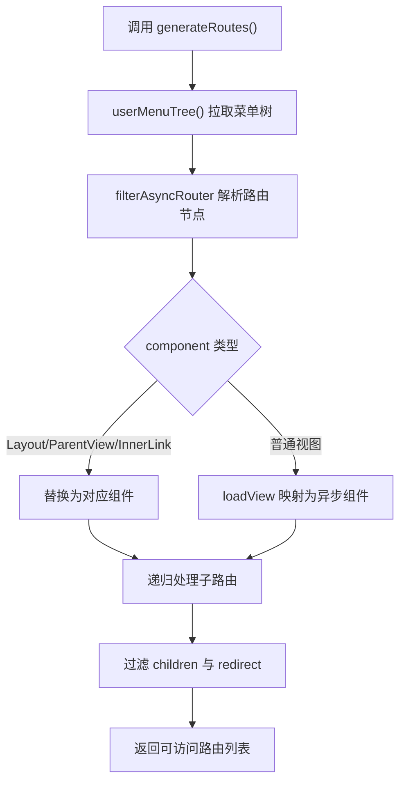
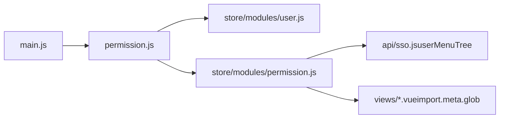

# 路由系统与权限路由

<cite>
**本文引用的文件**
- [main.js](file://iam-admin-ui/src/main.js)
- [permission.js](file://iam-admin-ui/src/permission.js)
- [permission.js（权限状态模块）](file://iam-admin-ui/src/store/modules/permission.js)
- [settings.js](file://iam-admin-ui/src/settings.js)
</cite>

## 目录
1. [引言](#引言)
2. [项目结构](#项目结构)
3. [核心组件](#核心组件)
4. [架构总览](#架构总览)
5. [详细组件分析](#详细组件分析)
6. [依赖关系分析](#依赖关系分析)
7. [性能考虑](#性能考虑)
8. [故障排查指南](#故障排查指南)
9. [结论](#结论)

## 引言
本文件面向 SH-IAM 管理后台的前端路由系统，聚焦于 Vue Router 的配置与使用，涵盖以下主题：
- 路由定义与导航守卫
- 权限路由加载机制：按用户权限动态生成菜单与路由
- 登录拦截、权限验证与页面跳转流程
- 路由懒加载、预加载策略与路由缓存
- 错误页面处理、路由参数传递与嵌套路由设计模式

## 项目结构
管理后台前端位于 iam-admin-ui，路由系统主要由三部分组成：
- 应用入口与插件注册：在应用入口中注册路由与权限守卫
- 权限守卫：统一处理登录态、白名单、动态路由注入与页面标题更新
- 权限状态模块：负责从后端拉取菜单树、解析组件映射、过滤可访问路由

图表来源
- [main.js:24](file://iam-admin-ui/src/main.js#L24)
- [permission.js:1-74](file://iam-admin-ui/src/permission.js#L1-L74)
- [permission.js（权限状态模块）:1-118](file://iam-admin-ui/src/store/modules/permission.js#L1-L118)

章节来源
- [main.js:1-107](file://iam-admin-ui/src/main.js#L1-L107)
- [permission.js:1-74](file://iam-admin-ui/src/permission.js#L1-L74)
- [permission.js（权限状态模块）:1-118](file://iam-admin-ui/src/store/modules/permission.js#L1-L118)

## 核心组件
- 应用入口与插件注册：在入口中注册路由、状态管理、指令与插件，并引入权限守卫
- 权限守卫：在 beforeEach 中完成登录拦截、白名单放行、用户信息拉取、动态路由注入与页面标题更新
- 权限状态模块：负责从后端获取菜单树、解析组件映射、过滤可访问路由并暴露 generateRoutes 方法供守卫调用

章节来源
- [main.js:24](file://iam-admin-ui/src/main.js#L24)
- [permission.js:20-69](file://iam-admin-ui/src/permission.js#L20-L69)
- [permission.js（权限状态模块）:35-44](file://iam-admin-ui/src/store/modules/permission.js#L35-L44)

## 架构总览
下图展示了从用户访问到动态路由注入的整体流程：

图表来源
- [permission.js:20-69](file://iam-admin-ui/src/permission.js#L20-L69)
- [permission.js（权限状态模块）:35-44](file://iam-admin-ui/src/store/modules/permission.js#L35-L44)

## 详细组件分析

### 权限守卫（navigation guards）
- 白名单：登录与注册页直接放行
- 登录拦截：无 Token 时将重定向至登录页并附带 redirect 参数
- 登录后处理：若用户信息缺失，先拉取用户信息；随后生成可访问路由并注入
- 动态路由注入：仅对非 http 开头的路由进行 addRoute 注入
- 页面标题：根据 meta.title 更新页面标题
- 进度条：在导航开始与结束时控制进度条显示

图表来源
- [permission.js:20-69](file://iam-admin-ui/src/permission.js#L20-L69)

章节来源
- [permission.js:14-18](file://iam-admin-ui/src/permission.js#L14-L18)
- [permission.js:20-69](file://iam-admin-ui/src/permission.js#L20-L69)

### 权限状态模块（动态路由与菜单生成）
- 数据来源：通过 userMenuTree 接口获取菜单树
- 组件映射：利用 import.meta.glob 扫描 views 下所有 .vue 文件，并通过 loadView 将字符串组件名映射为异步组件
- 路由过滤：支持按 permissions 或 roles 过滤，最终返回可访问路由集合
- 默认路由：将常量路由与动态路由合并，形成完整路由表

图表来源
- [permission.js（权限状态模块）:35-44](file://iam-admin-ui/src/store/modules/permission.js#L35-L44)
- [permission.js（权限状态模块）:49-74](file://iam-admin-ui/src/store/modules/permission.js#L49-L74)
- [permission.js（权限状态模块）:106-115](file://iam-admin-ui/src/store/modules/permission.js#L106-L115)

章节来源
- [permission.js（权限状态模块）:1-118](file://iam-admin-ui/src/store/modules/permission.js#L1-L118)

### 路由懒加载、预加载与缓存
- 懒加载：通过 loadView 返回函数式异步组件，实现按需加载
- 预加载：可通过路由级或组件级的预加载策略优化首屏体验（建议结合业务场景在守卫或路由配置中扩展）
- 缓存：keep-alive 结合路由元信息可实现页面级缓存；tagsView 用于多页签缓存与切换

章节来源
- [permission.js（权限状态模块）:9-9](file://iam-admin-ui/src/store/modules/permission.js#L9)
- [permission.js（权限状态模块）:106-115](file://iam-admin-ui/src/store/modules/permission.js#L106-L115)

### 错误页面处理与嵌套路由
- 错误页面：提供 401 与 404 页面，可在路由中作为 fallback 路由使用
- 嵌套路由：通过 ParentView 实现父子路由嵌套，配合菜单树的 children 字段构建复杂层级

章节来源
- [permission.js（权限状态模块）:4-5](file://iam-admin-ui/src/store/modules/permission.js#L4-L5)
- [permission.js（权限状态模块）:76-86](file://iam-admin-ui/src/store/modules/permission.js#L76-L86)

### 登录拦截、权限验证与页面跳转
- 登录拦截：无 Token 时重定向至登录页并携带 redirect
- 权限验证：通过权限状态模块的过滤逻辑校验角色或权限
- 页面跳转：成功后 replace 当前路由，确保动态路由生效

章节来源
- [permission.js:59-68](file://iam-admin-ui/src/permission.js#L59-L68)
- [permission.js:90-104](file://iam-admin-ui/src/store/modules/permission.js#L90-L104)

## 依赖关系分析
- main.js 引入并注册权限守卫，确保每次导航均受控
- permission.js 依赖用户状态与权限状态模块，以及认证工具与进度条库
- permission.js（权限状态模块）依赖后端接口与组件映射机制

图表来源
- [main.js:24](file://iam-admin-ui/src/main.js#L24)
- [permission.js:1-11](file://iam-admin-ui/src/permission.js#L1-L11)
- [permission.js（权限状态模块）:6](file://iam-admin-ui/src/store/modules/permission.js#L6)

章节来源
- [main.js:24](file://iam-admin-ui/src/main.js#L24)
- [permission.js:1-11](file://iam-admin-ui/src/permission.js#L1-L11)
- [permission.js（权限状态模块）:6](file://iam-admin-ui/src/store/modules/permission.js#L6)

## 性能考虑
- 路由懒加载：通过异步组件减少初始包体积
- 进度条：在守卫中开启/关闭进度条，提升用户体验
- 动态注入：仅在首次拉取用户信息后注入一次动态路由，避免重复注入
- 预加载：可结合业务场景在守卫或路由配置中增加预加载策略

## 故障排查指南
- 登录后无法进入目标页：检查是否正确执行 replace 跳转与动态路由注入
- 无权限页面白屏：确认权限过滤逻辑与组件映射是否正确
- 进度条不消失：检查 afterEach 是否被调用
- 标题未更新：确认 meta.title 是否存在且 settings 模块可更新标题

章节来源
- [permission.js:44-44](file://iam-admin-ui/src/permission.js#L44)
- [permission.js:71-73](file://iam-admin-ui/src/permission.js#L71-L73)
- [settings.js:1-60](file://iam-admin-ui/src/settings.js#L1-L60)

## 结论
本路由系统通过统一的权限守卫与权限状态模块实现了“登录拦截 + 动态路由 + 权限过滤”的闭环。配合懒加载与进度条等手段，在保证安全性的前提下兼顾了性能与体验。后续可在预加载与缓存策略上进一步细化，以适配更复杂的业务场景。