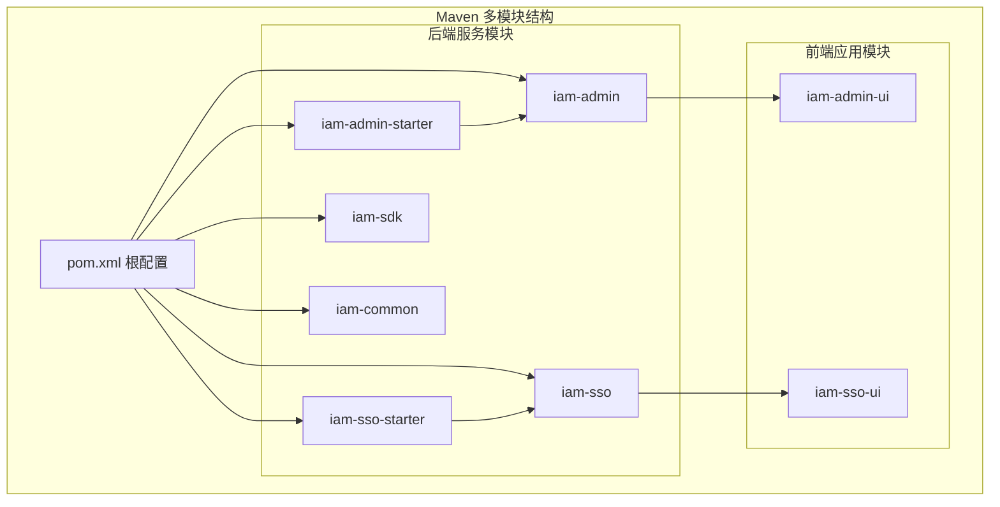
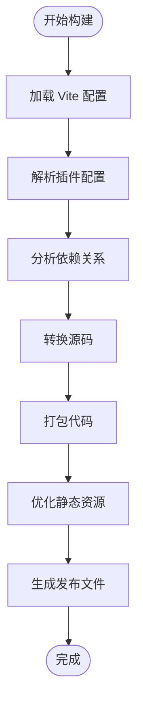
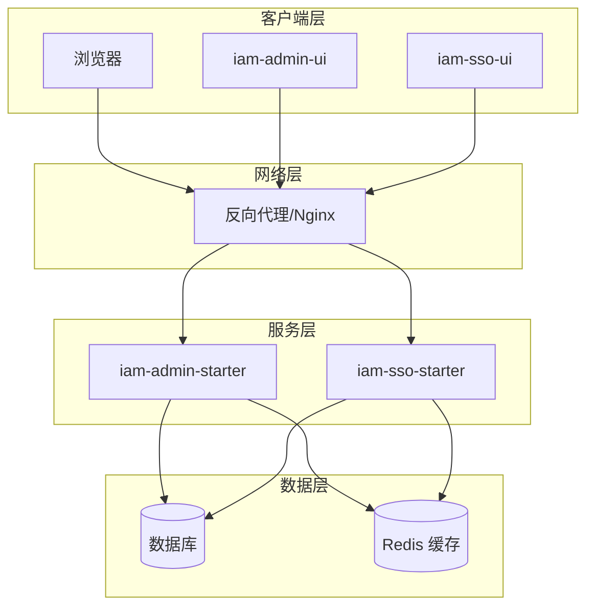
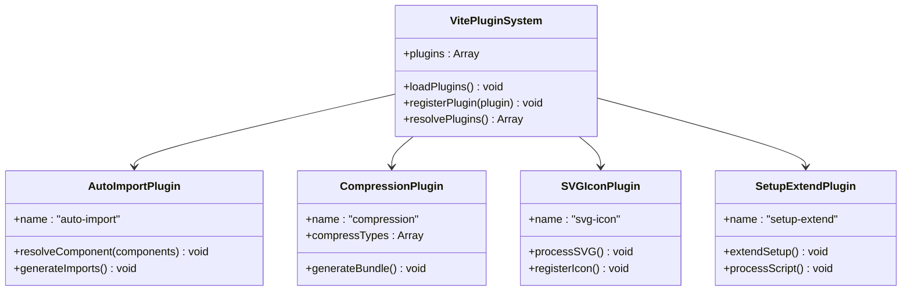
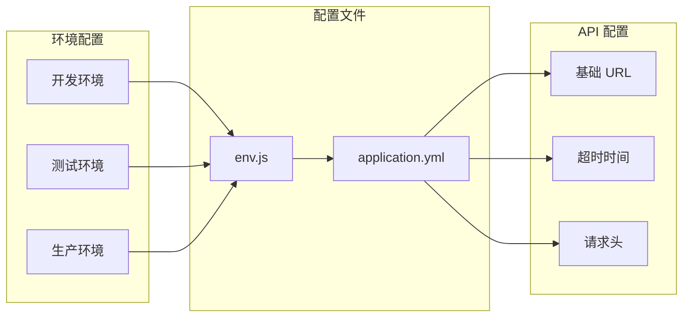
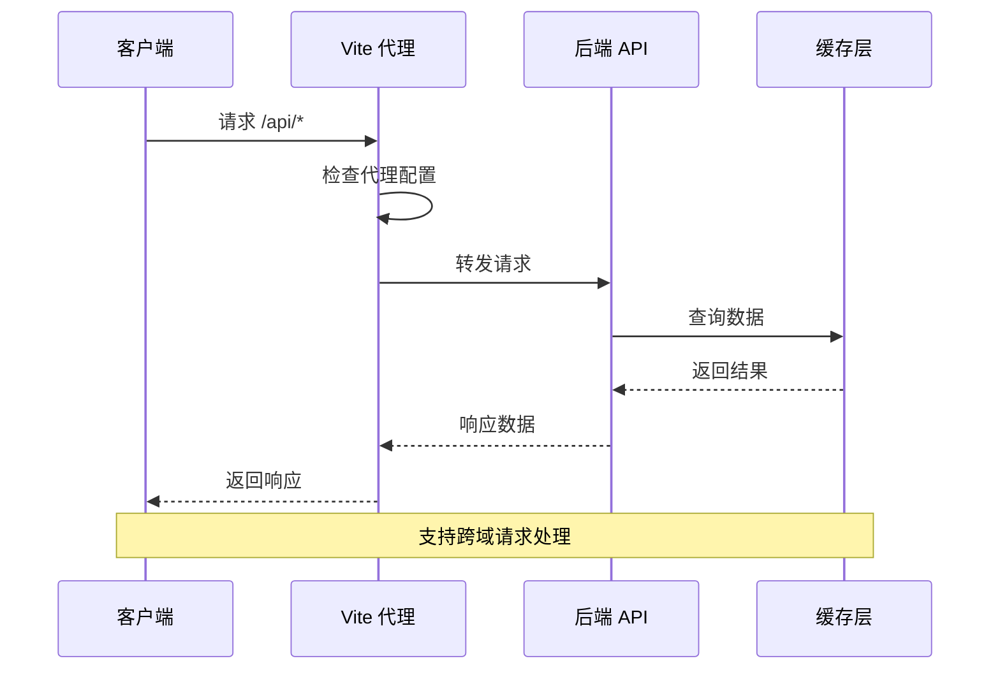
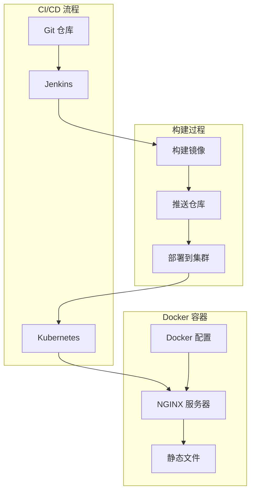
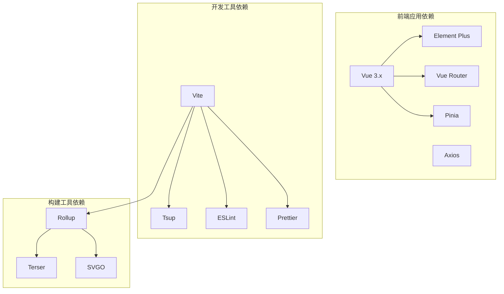

# 项目配置与环境搭建

<cite>
**本文档引用的文件**
- [iam-admin-ui/package.json](file://iam-admin-ui/package.json)
- [iam-admin-ui/vite.config.js](file://iam-admin-ui/vite.config.js)
- [iam-admin-ui/env.js](file://iam-admin-ui/env.js)
- [iam-admin-ui/nginx.conf](file://iam-admin-ui/nginx.conf)
- [iam-admin-ui/Dockerfile](file://iam-admin-ui/Dockerfile)
- [iam-admin-ui/deploy-uat.yaml](file://iam-admin-ui/deploy-uat.yaml)
- [iam-admin-ui/.editorconfig](file://iam-admin-ui/.editorconfig)
- [iam-admin-ui/vite/plugins/index.js](file://iam-admin-ui/vite/plugins/index.js)
- [iam-admin-ui/vite/plugins/auto-import.js](file://iam-admin-ui/vite/plugins/auto-import.js)
- [iam-admin-ui/vite/plugins/compression.js](file://iam-admin-ui/vite/plugins/compression.js)
- [iam-admin-ui/vite/plugins/svg-icon.js](file://iam-admin-ui/vite/plugins/svg-icon.js)
- [iam-admin-ui/vite/plugins/setup-extend.js](file://iam-admin-ui/vite/plugins/setup-extend.js)
- [iam-sso-ui/package.json](file://iam-sso-ui/package.json)
- [iam-sso-ui/vite.config.js](file://iam-sso-ui/vite.config.js)
- [iam-sso-ui/env.js](file://iam-sso-ui/env.js)
- [iam-sso-ui/nginx.conf](file://iam-sso-ui/nginx.conf)
- [iam-sso-ui/Dockerfile](file://iam-sso-ui/Dockerfile)
- [iam-sso-ui/deploy-uat.yaml](file://iam-sso-ui/deploy-uat.yaml)
- [iam-sso-ui/.gitignore](file://iam-sso-ui/.gitignore)
- [iam-admin-starter/Dockerfile](file://iam-admin-starter/Dockerfile)
- [iam-admin-starter/deploy-uat.yaml](file://iam-admin-starter/deploy-uat.yaml)
- [iam-admin-starter/src/main/resources/config/application.yml](file://iam-admin-starter/src/main/resources/config/application.yml)
- [iam-sso-starter/Dockerfile](file://iam-sso-starter/Dockerfile)
- [iam-sso-starter/deploy-uat.yaml](file://iam-sso-starter/deploy-uat.yaml)
- [iam-sso-starter/src/main/resources/config/application.yml](file://iam-sso-starter/src/main/resources/config/application.yml)
</cite>

## 目录
1. [简介](#简介)
2. [项目结构](#项目结构)
3. [核心组件](#核心组件)
4. [架构概览](#架构概览)
5. [详细组件分析](#详细组件分析)
6. [依赖分析](#依赖分析)
7. [性能考虑](#性能考虑)
8. [故障排除指南](#故障排除指南)
9. [结论](#结论)
10. [附录](#附录)

## 简介
本文件为 SH-IAM 管理后台前端项目的配置与环境搭建指南。内容涵盖 Vite 构建工具配置、package.json 依赖管理、开发服务器设置与生产构建优化；详细说明项目目录结构、环境变量配置、代理设置与静态资源处理；提供开发环境搭建步骤、依赖安装命令与常见配置问题的解决方案；包含 ESLint 规则配置、Prettier 格式化设置与 Git 钩子配置；解释 Docker 容器化部署配置与 Nginx 反向代理设置。

## 项目结构
本项目采用多模块 Maven 结构，前端部分包含两个独立的 UI 应用：iam-admin-ui（管理后台）与 iam-sso-ui（单点登录）。每个 UI 模块均包含完整的前端工程，包括 Vite 配置、插件系统、环境变量与部署配置。



**图表来源**
- [pom.xml](file://pom.xml)
- [iam-admin-ui/package.json](file://iam-admin-ui/package.json)
- [iam-sso-ui/package.json](file://iam-sso-ui/package.json)

**章节来源**
- [pom.xml](file://pom.xml)
- [iam-admin-ui/package.json](file://iam-admin-ui/package.json)
- [iam-sso-ui/package.json](file://iam-sso-ui/package.json)

## 核心组件
本节详细介绍前端项目的四大核心组件：Vite 构建配置、依赖管理、开发服务器与生产优化。

### Vite 构建配置
Vite 作为现代前端构建工具，提供了快速的开发体验和高效的生产构建能力。项目中的 Vite 配置位于 `vite.config.js` 文件中，支持多种构建模式和插件扩展。

#### 主要配置特性
- **开发服务器配置**：支持热更新、代理转发、HTTPS 开发
- **构建优化**：代码分割、Tree Shaking、压缩优化
- **插件系统**：可扩展的插件机制，支持自动导入、SVG 图标等
- **环境变量处理**：区分开发、测试、生产环境变量

#### 构建流程


**图表来源**
- [iam-admin-ui/vite.config.js](file://iam-admin-ui/vite.config.js)
- [iam-sso-ui/vite.config.js](file://iam-sso-ui/vite.config.js)

### 依赖管理
项目使用 npm 进行包管理，通过 `package.json` 统一管理所有依赖项。依赖分为开发依赖和生产依赖两类，确保开发环境与生产环境的精确控制。

#### 依赖分类
- **开发依赖**：构建工具、类型定义、开发辅助工具
- **生产依赖**：运行时必需的库和框架
- **脚本命令**：统一的构建、开发、测试命令

**章节来源**
- [iam-admin-ui/package.json](file://iam-admin-ui/package.json)
- [iam-sso-ui/package.json](file://iam-sso-ui/package.json)

### 开发服务器设置
开发服务器提供实时热更新、错误边界、代理转发等功能，提升开发效率和调试体验。

#### 开发特性
- **热模块替换（HMR）**：快速更新修改的模块
- **错误处理**：友好的编译错误和运行时错误提示
- **代理配置**：本地 API 调试代理
- **多端口支持**：支持 HTTPS 和自定义端口

### 生产构建优化
生产构建阶段进行深度优化，包括代码压缩、资源内联、缓存策略等，确保最佳的用户体验。

#### 优化策略
- **代码分割**：按需加载和懒加载
- **Tree Shaking**：移除未使用的代码
- **资源压缩**：CSS、JavaScript、图片压缩
- **缓存优化**：长效缓存策略

**章节来源**
- [iam-admin-ui/vite.config.js](file://iam-admin-ui/vite.config.js)
- [iam-sso-ui/vite.config.js](file://iam-sso-ui/vite.config.js)

## 架构概览
本项目采用前后端分离架构，前端通过 Vite 构建，后端通过 Spring Boot 提供 RESTful API。前端应用通过环境变量配置与后端服务通信。



**图表来源**
- [iam-admin-ui/nginx.conf](file://iam-admin-ui/nginx.conf)
- [iam-sso-ui/nginx.conf](file://iam-sso-ui/nginx.conf)
- [iam-admin-starter/src/main/resources/config/application.yml](file://iam-admin-starter/src/main/resources/config/application.yml)
- [iam-sso-starter/src/main/resources/config/application.yml](file://iam-sso-starter/src/main/resources/config/application.yml)

## 详细组件分析

### Vite 插件系统
项目实现了完整的 Vite 插件生态系统，包含自动导入、压缩、SVG 图标处理等功能。

#### 插件架构


**图表来源**
- [iam-admin-ui/vite/plugins/index.js](file://iam-admin-ui/vite/plugins/index.js)
- [iam-admin-ui/vite/plugins/auto-import.js](file://iam-admin-ui/vite/plugins/auto-import.js)
- [iam-admin-ui/vite/plugins/compression.js](file://iam-admin-ui/vite/plugins/compression.js)
- [iam-admin-ui/vite/plugins/svg-icon.js](file://iam-admin-ui/vite/plugins/svg-icon.js)
- [iam-admin-ui/vite/plugins/setup-extend.js](file://iam-admin-ui/vite/plugins/setup-extend.js)

#### 插件功能详解
- **自动导入插件**：自动处理组件和工具函数的导入，减少重复代码
- **压缩插件**：支持 Gzip 和 Brotli 压缩，优化传输性能
- **SVG 图标插件**：统一处理 SVG 图标，支持动态加载和样式定制
- **Setup 扩展插件**：增强 Vue 3 Composition API 的使用体验

**章节来源**
- [iam-admin-ui/vite/plugins/index.js](file://iam-admin-ui/vite/plugins/index.js)
- [iam-admin-ui/vite/plugins/auto-import.js](file://iam-admin-ui/vite/plugins/auto-import.js)
- [iam-admin-ui/vite/plugins/compression.js](file://iam-admin-ui/vite/plugins/compression.js)
- [iam-admin-ui/vite/plugins/svg-icon.js](file://iam-admin-ui/vite/plugins/svg-icon.js)
- [iam-admin-ui/vite/plugins/setup-extend.js](file://iam-admin-ui/vite/plugins/setup-extend.js)

### 环境变量配置
项目通过 `env.js` 文件集中管理环境变量，支持开发、测试、生产三种环境。

#### 环境变量结构


**图表来源**
- [iam-admin-ui/env.js](file://iam-admin-ui/env.js)
- [iam-sso-ui/env.js](file://iam-sso-ui/env.js)
- [iam-admin-starter/src/main/resources/config/application.yml](file://iam-admin-starter/src/main/resources/config/application.yml)
- [iam-sso-starter/src/main/resources/config/application.yml](file://iam-sso-starter/src/main/resources/config/application.yml)

#### 环境变量管理策略
- **分环境配置**：不同环境使用不同的配置值
- **安全存储**：敏感信息通过环境变量传递
- **默认值设置**：为每个变量提供合理的默认值
- **类型验证**：确保配置值的数据类型正确

**章节来源**
- [iam-admin-ui/env.js](file://iam-admin-ui/env.js)
- [iam-sso-ui/env.js](file://iam-sso-ui/env.js)

### 代理设置与静态资源处理
项目配置了完善的代理机制和静态资源处理策略，确保开发和生产环境的一致性。

#### 代理配置流程


**图表来源**
- [iam-admin-ui/vite.config.js](file://iam-admin-ui/vite.config.js)
- [iam-sso-ui/vite.config.js](file://iam-sso-ui/vite.config.js)

#### 静态资源处理策略
- **图片优化**：自动压缩和格式转换
- **字体处理**：Web 字体的预加载和缓存
- **CSS 处理**：Sass/SCSS 预处理器支持
- **JavaScript 优化**：ES6+ 语法转换和 polyfill

**章节来源**
- [iam-admin-ui/vite.config.js](file://iam-admin-ui/vite.config.js)
- [iam-sso-ui/vite.config.js](file://iam-sso-ui/vite.config.js)

### Docker 容器化部署
项目提供了完整的 Docker 容器化部署配置，支持本地开发和生产环境部署。

#### Docker 部署架构


**图表来源**
- [iam-admin-ui/Dockerfile](file://iam-admin-ui/Dockerfile)
- [iam-sso-ui/Dockerfile](file://iam-sso-ui/Dockerfile)
- [iam-admin-starter/Dockerfile](file://iam-admin-starter/Dockerfile)
- [iam-sso-starter/Dockerfile](file://iam-sso-starter/Dockerfile)

#### 容器化配置要点
- **多阶段构建**：优化镜像大小和构建速度
- **环境隔离**：不同环境使用不同的配置文件
- **健康检查**：容器健康状态监控
- **资源限制**：CPU 和内存使用限制

**章节来源**
- [iam-admin-ui/Dockerfile](file://iam-admin-ui/Dockerfile)
- [iam-sso-ui/Dockerfile](file://iam-sso-ui/Dockerfile)
- [iam-admin-starter/Dockerfile](file://iam-admin-starter/Dockerfile)
- [iam-sso-starter/Dockerfile](file://iam-sso-starter/Dockerfile)

## 依赖分析
本节分析项目的依赖关系，包括直接依赖、间接依赖和潜在的循环依赖风险。

### 依赖关系图


**图表来源**
- [iam-admin-ui/package.json](file://iam-admin-ui/package.json)
- [iam-sso-ui/package.json](file://iam-sso-ui/package.json)

### 依赖管理策略
- **版本锁定**：使用 package-lock.json 锁定依赖版本
- **安全审计**：定期进行依赖安全扫描
- **性能优化**：选择轻量级和高性能的依赖库
- **兼容性保证**：确保依赖库的版本兼容性

**章节来源**
- [iam-admin-ui/package.json](file://iam-admin-ui/package.json)
- [iam-sso-ui/package.json](file://iam-sso-ui/package.json)

## 性能考虑
本节讨论前端项目的性能优化策略，包括加载性能、运行时性能和缓存策略。

### 性能优化策略
- **代码分割**：按路由和组件进行代码分割
- **懒加载**：图片和组件的懒加载实现
- **缓存策略**：HTTP 缓存和浏览器缓存配置
- **资源压缩**：Gzip 和 Brotli 压缩启用
- **CDN 优化**：静态资源 CDN 加速

### 性能监控指标
- **首屏加载时间**：目标 < 3 秒
- **交互时间**：目标 < 100ms
- **包体积**：目标 < 500KB（压缩后）
- **TTFB**：目标 < 200ms

## 故障排除指南
本节提供常见配置问题的诊断和解决方法。

### 开发环境问题
- **端口冲突**：修改 Vite 配置中的端口号
- **代理失败**：检查后端 API 地址和 CORS 配置
- **热更新失效**：重启开发服务器或清理缓存
- **依赖安装失败**：使用 npm ci 或清理 node_modules

### 构建问题
- **构建失败**：检查 TypeScript 类型错误和语法问题
- **包体积过大**：分析 bundle 分析报告，移除不必要的依赖
- **资源加载失败**：检查静态资源路径和 CDN 配置
- **缓存问题**：清理浏览器缓存和构建缓存

### 部署问题
- **容器启动失败**：检查 Dockerfile 和环境变量配置
- **Nginx 配置错误**：验证 nginx.conf 配置语法
- **证书问题**：检查 SSL 证书和域名配置
- **权限问题**：验证文件权限和用户权限

**章节来源**
- [iam-admin-ui/vite.config.js](file://iam-admin-ui/vite.config.js)
- [iam-sso-ui/vite.config.js](file://iam-sso-ui/vite.config.js)
- [iam-admin-ui/nginx.conf](file://iam-admin-ui/nginx.conf)
- [iam-sso-ui/nginx.conf](file://iam-sso-ui/nginx.conf)

## 结论
SH-IAM 管理后台前端项目采用了现代化的前端技术栈和工程化实践。通过 Vite 构建工具、完善的插件系统、容器化部署和 Nginx 反向代理配置，项目实现了高效开发、稳定部署和良好性能。建议团队在后续开发中继续优化构建性能、加强代码质量管理和完善自动化测试体系。

## 附录

### 开发环境搭建步骤
1. **环境要求**
   - Node.js 16+
   - npm 8+
   - Git

2. **克隆项目**
   ```bash
   git clone https://github.com/wkclz/sh-iam.git
   cd sh-iam
   ```

3. **安装依赖**
   ```bash
   # 进入前端目录
   cd iam-admin-ui
   
   # 安装依赖
   npm install
   
   # 启动开发服务器
   npm run dev
   ```

4. **配置环境变量**
   - 复制 `.env.example` 为 `.env`
   - 修改环境变量值
   - 配置 API 基础地址

### 常用命令参考
```bash
# 开发模式
npm run dev

# 生产构建
npm run build

# 代码检查
npm run lint

# 格式化代码
npm run format

# 清理缓存
npm run clean

# 生成依赖图
npm run dep-graph
```

### 配置文件说明
- **vite.config.js**：Vite 构建配置文件
- **env.js**：环境变量配置文件
- **nginx.conf**：Nginx 反向代理配置
- **Dockerfile**：Docker 容器化配置
- **deploy-uat.yaml**：UAT 环境部署配置
- **.editorconfig**：代码格式化配置