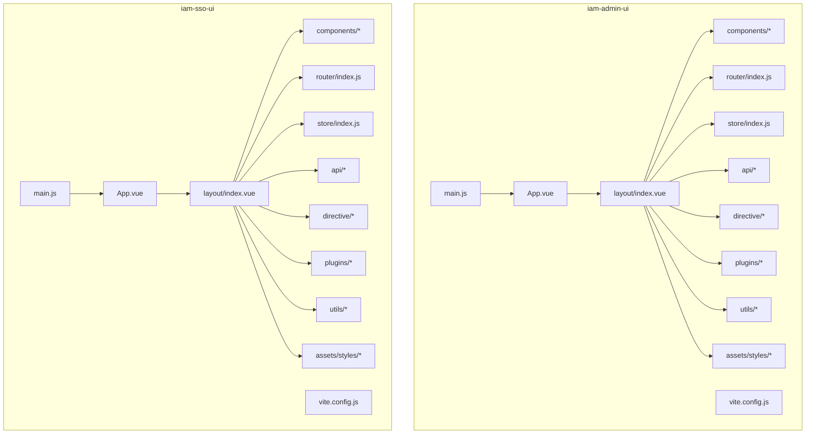
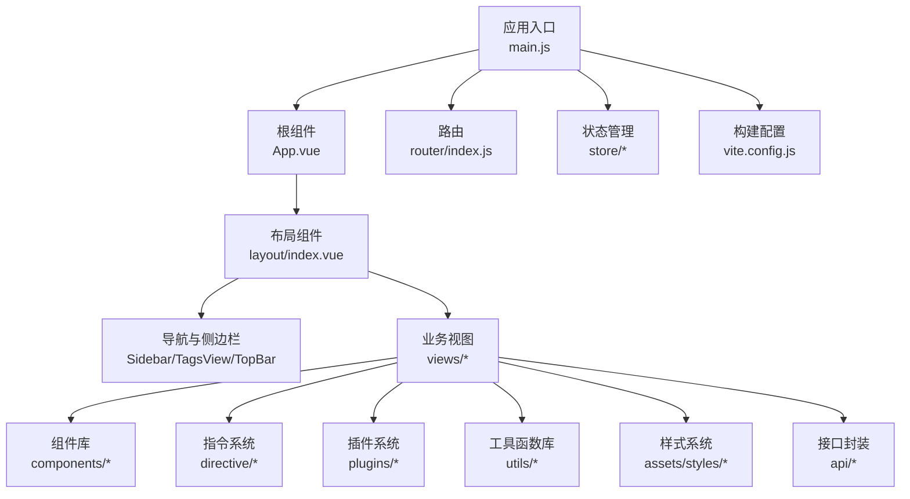
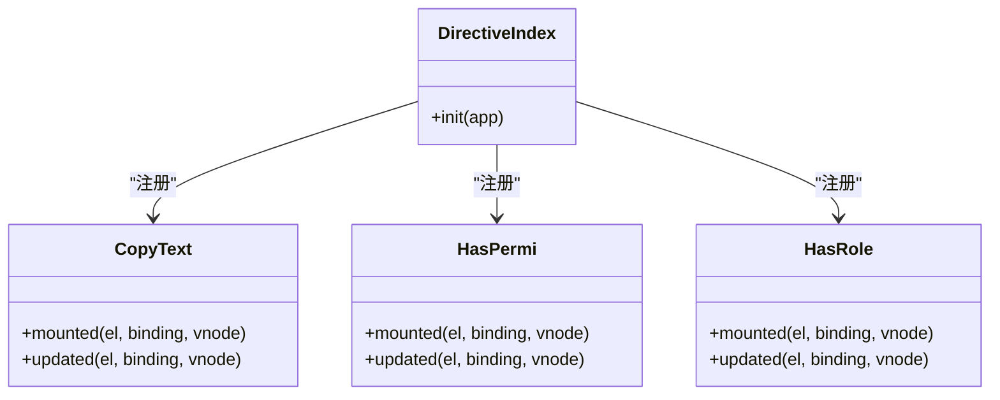
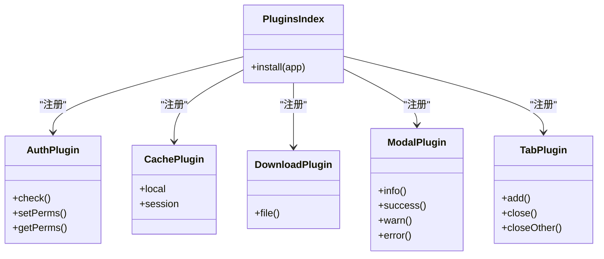
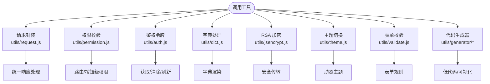
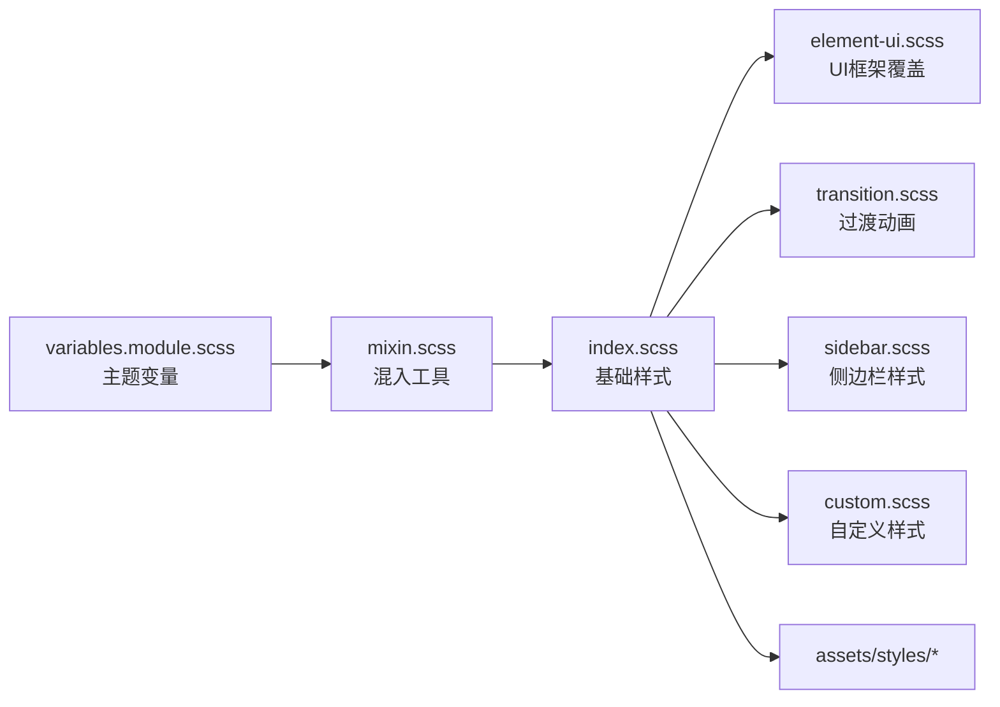
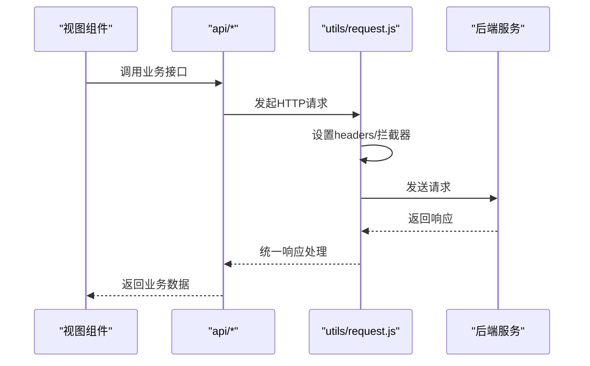
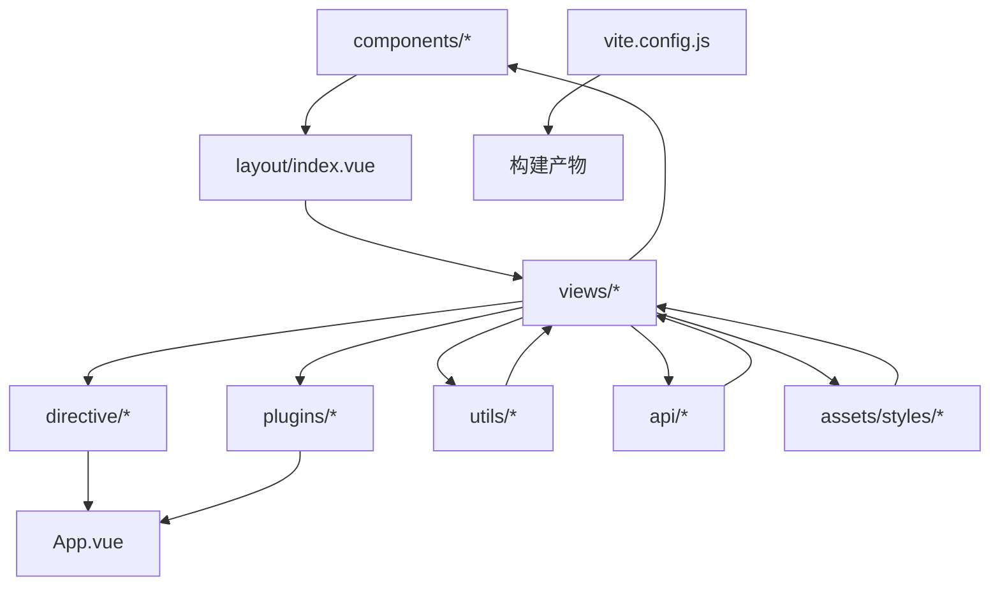

# 组件库与工具

<cite>
**本文引用的文件**
- [iam-admin-ui/package.json](file://iam-admin-ui/package.json)
- [iam-admin-ui/vite.config.js](file://iam-admin-ui/vite.config.js)
- [iam-admin-ui/src/main.js](file://iam-admin-ui/src/main.js)
- [iam-admin-ui/src/App.vue](file://iam-admin-ui/src/App.vue)
- [iam-admin-ui/src/settings.js](file://iam-admin-ui/src/settings.js)
- [iam-admin-ui/src/permission.js](file://iam-admin-ui/src/permission.js)
- [iam-admin-ui/src/components/Breadcrumb/index.vue](file://iam-admin-ui/src/components/Breadcrumb/index.vue)
- [iam-admin-ui/src/components/Crontab/index.vue](file://iam-admin-ui/src/components/Crontab/index.vue)
- [iam-admin-ui/src/components/DictTag/index.vue](file://iam-admin-ui/src/components/DictTag/index.vue)
- [iam-admin-ui/src/components/Editor/index.vue](file://iam-admin-ui/src/components/Editor/index.vue)
- [iam-admin-ui/src/components/FileUpload/index.vue](file://iam-admin-ui/src/components/FileUpload/index.vue)
- [iam-admin-ui/src/components/FormTip/index.vue](file://iam-admin-ui/src/components/FormTip/index.vue)
- [iam-admin-ui/src/components/Hamburger/index.vue](file://iam-admin-ui/src/components/Hamburger/index.vue)
- [iam-admin-ui/src/components/HeaderSearch/index.vue](file://iam-admin-ui/src/components/HeaderSearch/index.vue)
- [iam-admin-ui/src/components/IconSelect/index.vue](file://iam-admin-ui/src/components/IconSelect/index.vue)
- [iam-admin-ui/src/components/ImagePreview/index.vue](file://iam-admin-ui/src/components/ImagePreview/index.vue)
- [iam-admin-ui/src/components/ImageUpload/index.vue](file://iam-admin-ui/src/components/ImageUpload/index.vue)
- [iam-admin-ui/src/components/LabelTip/index.vue](file://iam-admin-ui/src/components/LabelTip/index.vue)
- [iam-admin-ui/src/components/LayoutSplit/index.vue](file://iam-admin-ui/src/components/LayoutSplit/index.vue)
- [iam-admin-ui/src/components/MonacoEditor/index.vue](file://iam-admin-ui/src/components/MonacoEditor/index.vue)
- [iam-admin-ui/src/components/Pagination/index.vue](file://iam-admin-ui/src/components/Pagination/index.vue)
- [iam-admin-ui/src/components/ParentView/index.vue](file://iam-admin-ui/src/components/ParentView/index.vue)
- [iam-admin-ui/src/components/RightToolbar/index.vue](file://iam-admin-ui/src/components/RightToolbar/index.vue)
- [iam-admin-ui/src/components/RuoYi/Doc/index.vue](file://iam-admin-ui/src/components/RuoYi/Doc/index.vue)
- [iam-admin-ui/src/components/RuoYi/Git/index.vue](file://iam-admin-ui/src/components/RuoYi/Git/index.vue)
- [iam-admin-ui/src/components/Screenfull/index.vue](file://iam-admin-ui/src/components/Screenfull/index.vue)
- [iam-admin-ui/src/components/SizeSelect/index.vue](file://iam-admin-ui/src/components/SizeSelect/index.vue)
- [iam-admin-ui/src/components/SvgIcon/index.vue](file://iam-admin-ui/src/components/SvgIcon/index.vue)
- [iam-admin-ui/src/components/TableSetting/index.vue](file://iam-admin-ui/src/components/TableSetting/index.vue)
- [iam-admin-ui/src/components/TopNav/index.vue](file://iam-admin-ui/src/components/TopNav/index.vue)
- [iam-admin-ui/src/components/iFrame/index.vue](file://iam-admin-ui/src/components/iFrame/index.vue)
- [iam-admin-ui/src/directive/index.js](file://iam-admin-ui/src/directive/index.js)
- [iam-admin-ui/src/directive/common/copyText.js](file://iam-admin-ui/src/directive/common/copyText.js)
- [iam-admin-ui/src/directive/permission/hasPermi.js](file://iam-admin-ui/src/directive/permission/hasPermi.js)
- [iam-admin-ui/src/directive/permission/hasRole.js](file://iam-admin-ui/src/directive/permission/hasRole.js)
- [iam-admin-ui/src/plugins/index.js](file://iam-admin-ui/src/plugins/index.js)
- [iam-admin-ui/src/plugins/auth.js](file://iam-admin-ui/src/plugins/auth.js)
- [iam-admin-ui/src/plugins/cache.js](file://iam-admin-ui/src/plugins/cache.js)
- [iam-admin-ui/src/plugins/download.js](file://iam-admin-ui/src/plugins/download.js)
- [iam-admin-ui/src/plugins/modal.js](file://iam-admin-ui/src/plugins/modal.js)
- [iam-admin-ui/src/plugins/tab.js](file://iam-admin-ui/src/plugins/tab.js)
- [iam-admin-ui/src/utils/index.js](file://iam-admin-ui/src/utils/index.js)
- [iam-admin-ui/src/utils/auth.js](file://iam-admin-ui/src/utils/auth.js)
- [iam-admin-ui/src/utils/dict.js](file://iam-admin-ui/src/utils/dict.js)
- [iam-admin-ui/src/utils/dynamicTitle.js](file://iam-admin-ui/src/utils/dynamicTitle.js)
- [iam-admin-ui/src/utils/errorCode.js](file://iam-admin-ui/src/utils/errorCode.js)
- [iam-admin-ui/src/utils/jsencrypt.js](file://iam-admin-ui/src/utils/jsencrypt.js)
- [iam-admin-ui/src/utils/permission.js](file://iam-admin-ui/src/utils/permission.js)
- [iam-admin-ui/src/utils/request.js](file://iam-admin-ui/src/utils/request.js)
- [iam-admin-ui/src/utils/ruoyi.js](file://iam-admin-ui/src/utils/ruoyi.js)
- [iam-admin-ui/src/utils/scroll-to.js](file://iam-admin-ui/src/utils/scroll-to.js)
- [iam-admin-ui/src/utils/shrimp.js](file://iam-admin-ui/src/utils/shrimp.js)
- [iam-admin-ui/src/utils/theme.js](file://iam-admin-ui/src/utils/theme.js)
- [iam-admin-ui/src/utils/validate.js](file://iam-admin-ui/src/utils/validate.js)
- [iam-admin-ui/src/utils/generator/config.js](file://iam-admin-ui/src/utils/generator/config.js)
- [iam-admin-ui/src/utils/generator/css.js](file://iam-admin-ui/src/utils/generator/css.js)
- [iam-admin-ui/src/utils/generator/drawingDefault.js](file://iam-admin-ui/src/utils/generator/drawingDefault.js)
- [iam-admin-ui/src/utils/generator/html.js](file://iam-admin-ui/src/utils/generator/html.js)
- [iam-admin-ui/src/utils/generator/js.js](file://iam-admin-ui/src/utils/generator/js.js)
- [iam-admin-ui/src/utils/generator/render.js](file://iam-admin-ui/src/utils/generator/render.js)
- [iam-admin-ui/src/assets/styles/variables.module.scss](file://iam-admin-ui/src/assets/styles/variables.module.scss)
- [iam-admin-ui/src/assets/styles/mixin.scss](file://iam-admin-ui/src/assets/styles/mixin.scss)
- [iam-admin-ui/src/assets/styles/custom.scss](file://iam-admin-ui/src/assets/styles/custom.scss)
- [iam-admin-ui/src/assets/styles/transition.scss](file://iam-admin-ui/src/assets/styles/transition.scss)
- [iam-admin-ui/src/assets/styles/sidebar.scss](file://iam-admin-ui/src/assets/styles/sidebar.scss)
- [iam-admin-ui/src/assets/styles/element-ui.scss](file://iam-admin-ui/src/assets/styles/element-ui.scss)
- [iam-admin-ui/src/assets/styles/index.scss](file://iam-admin-ui/src/assets/styles/index.scss)
- [iam-admin-ui/src/layout/index.vue](file://iam-admin-ui/src/layout/index.vue)
- [iam-admin-ui/src/layout/components/Sidebar/index.vue](file://iam-admin-ui/src/layout/components/Sidebar/index.vue)
- [iam-admin-ui/src/layout/components/Sidebar/SidebarItem.vue](file://iam-admin-ui/src/layout/components/Sidebar/SidebarItem.vue)
- [iam-admin-ui/src/layout/components/TagsView/index.vue](file://iam-admin-ui/src/layout/components/TagsView/index.vue)
- [iam-admin-ui/src/layout/components/TagsView/ScrollPane.vue](file://iam-admin-ui/src/layout/components/TagsView/ScrollPane.vue)
- [iam-admin-ui/src/layout/components/Settings/index.vue](file://iam-admin-ui/src/layout/components/Settings/index.vue)
- [iam-admin-ui/src/router/index.js](file://iam-admin-ui/src/router/index.js)
- [iam-admin-ui/src/store/index.js](file://iam-admin-ui/src/store/index.js)
- [iam-admin-ui/src/store/modules/app.js](file://iam-admin-ui/src/store/modules/app.js)
- [iam-admin-ui/src/store/modules/dict.js](file://iam-admin-ui/src/store/modules/dict.js)
- [iam-admin-ui/src/store/modules/permission.js](file://iam-admin-ui/src/store/modules/permission.js)
- [iam-admin-ui/src/store/modules/settings.js](file://iam-admin-ui/src/store/modules/settings.js)
- [iam-admin-ui/src/store/modules/tagsView.js](file://iam-admin-ui/src/store/modules/tagsView.js)
- [iam-admin-ui/src/store/modules/user.js](file://iam-admin-ui/src/store/modules/user.js)
- [iam-admin-ui/src/views/system/user/user/index.vue](file://iam-admin-ui/src/views/system/user/user/index.vue)
- [iam-admin-ui/src/views/system/user/user/components/edit.vue](file://iam-admin-ui/src/views/system/user/user/components/edit.vue)
- [iam-admin-ui/src/views/system/user/user/components/reset-password.vue](file://iam-admin-ui/src/views/system/user/user/components/reset-password.vue)
- [iam-admin-ui/src/views/system/role/role/index.vue](file://iam-admin-ui/src/views/system/role/role/index.vue)
- [iam-admin-ui/src/views/system/role/role/components/edit.vue](file://iam-admin-ui/src/views/system/role/role/components/edit.vue)
- [iam-admin-ui/src/views/system/menu/menu/index.vue](file://iam-admin-ui/src/views/system/menu/menu/index.vue)
- [iam-admin-ui/src/views/system/menu/menu/components/edit.vue](file://iam-admin-ui/src/views/system/menu/menu/components/edit.vue)
- [iam-admin-ui/src/views/system/api/api/index.vue](file://iam-admin-ui/src/views/system/api/api/index.vue)
- [iam-admin-ui/src/views/system/api/api/components/edit.vue](file://iam-admin-ui/src/views/system/api/api/components/edit.vue)
- [iam-admin-ui/src/views/system/ak/ak/index.vue](file://iam-admin-ui/src/views/system/ak/ak/index.vue)
- [iam-admin-ui/src/views/system/ak/ak/components/edit.vue](file://iam-admin-ui/src/views/system/ak/ak/components/edit.vue)
- [iam-admin-ui/src/views/system/dimension/dimension/index.vue](file://iam-admin-ui/src/views/system/dimension/dimension/index.vue)
- [iam-admin-ui/src/views/system/dimension/dimension/components/edit.vue](file://iam-admin-ui/src/views/system/dimension/dimension/components/edit.vue)
- [iam-admin-ui/src/views/log/login/login/index.vue](file://iam-admin-ui/src/views/log/login/login/index.vue)
- [iam-admin-ui/src/views/log/request/request/index.vue](file://iam-admin-ui/src/views/log/request/request/index.vue)
- [iam-admin-ui/src/views/log/request/request/components/detail.vue](file://iam-admin-ui/src/views/log/request/request/components/detail.vue)
- [iam-admin-ui/src/views/dashboard/index.vue](file://iam-admin-ui/src/views/dashboard/index.vue)
- [iam-admin-ui/src/views/error/401.vue](file://iam-admin-ui/src/views/error/401.vue)
- [iam-admin-ui/src/views/error/404.vue](file://iam-admin-ui/src/views/error/404.vue)
- [iam-admin-ui/src/views/login.vue](file://iam-admin-ui/src/views/login.vue)
- [iam-admin-ui/src/api/user/user.js](file://iam-admin-ui/src/api/user/user.js)
- [iam-admin-ui/src/api/user/role.js](file://iam-admin-ui/src/api/user/role.js)
- [iam-admin-ui/src/api/system/menu.js](file://iam-admin-ui/src/api/system/menu.js)
- [iam-admin-ui/src/api/system/api.js](file://iam-admin-ui/src/api/system/api.js)
- [iam-admin-ui/src/api/system/ak.js](file://iam-admin-ui/src/api/system/ak.js)
- [iam-admin-ui/src/api/system/ak-api.js](file://iam-admin-ui/src/api/system/ak-api.js)
- [iam-admin-ui/src/api/system/dim.js](file://iam-admin-ui/src/api/system/dim.js)
- [iam-admin-ui/src/api/log/loginlog.js](file://iam-admin-ui/src/api/log/loginlog.js)
- [iam-admin-ui/src/api/log/requestlog.js](file://iam-admin-ui/src/api/log/requestlog.js)
- [iam-admin-ui/src/api/common.js](file://iam-admin-ui/src/api/common.js)
- [iam-admin-ui/src/api/config.js](file://iam-admin-ui/src/api/config.js)
- [iam-admin-ui/src/api/data.js](file://iam-admin-ui/src/api/data.js)
- [iam-admin-ui/src/api/sso.js](file://iam-admin-ui/src/api/sso.js)
- [iam-admin-ui/vite/plugins/auto-import.js](file://iam-admin-ui/vite/plugins/auto-import.js)
- [iam-admin-ui/vite/plugins/compression.js](file://iam-admin-ui/vite/plugins/compression.js)
- [iam-admin-ui/vite/plugins/index.js](file://iam-admin-ui/vite/plugins/index.js)
- [iam-admin-ui/vite/plugins/setup-extend.js](file://iam-admin-ui/vite/plugins/setup-extend.js)
- [iam-admin-ui/vite/plugins/svg-icon.js](file://iam-admin-ui/vite/plugins/svg-icon.js)
- [iam-sso-ui/package.json](file://iam-sso-ui/package.json)
- [iam-sso-ui/vite.config.js](file://iam-sso-ui/vite.config.js)
- [iam-sso-ui/src/main.js](file://iam-sso-ui/src/main.js)
- [iam-sso-ui/src/App.vue](file://iam-sso-ui/src/App.vue)
- [iam-sso-ui/src/settings.js](file://iam-sso-ui/src/settings.js)
- [iam-sso-ui/src/permission.js](file://iam-sso-ui/src/permission.js)
- [iam-sso-ui/src/components/Breadcrumb/index.vue](file://iam-sso-ui/src/components/Breadcrumb/index.vue)
- [iam-sso-ui/src/components/Crontab/index.vue](file://iam-sso-ui/src/components/Crontab/index.vue)
- [iam-sso-ui/src/components/DictTag/index.vue](file://iam-sso-ui/src/components/DictTag/index.vue)
- [iam-sso-ui/src/components/Editor/index.vue](file://iam-sso-ui/src/components/Editor/index.vue)
- [iam-sso-ui/src/components/FileUpload/index.vue](file://iam-sso-ui/src/components/FileUpload/index.vue)
- [iam-sso-ui/src/components/FormTip/index.vue](file://iam-sso-ui/src/components/FormTip/index.vue)
- [iam-sso-ui/src/components/Hamburger/index.vue](file://iam-sso-ui/src/components/Hamburger/index.vue)
- [iam-sso-ui/src/components/HeaderSearch/index.vue](file://iam-sso-ui/src/components/HeaderSearch/index.vue)
- [iam-sso-ui/src/components/IconSelect/index.vue](file://iam-sso-ui/src/components/IconSelect/index.vue)
- [iam-sso-ui/src/components/ImagePreview/index.vue](file://iam-sso-ui/src/components/ImagePreview/index.vue)
- [iam-sso-ui/src/components/ImageUpload/index.vue](file://iam-sso-ui/src/components/ImageUpload/index.vue)
- [iam-sso-ui/src/components/LabelTip/index.vue](file://iam-sso-ui/src/components/LabelTip/index.vue)
- [iam-sso-ui/src/components/LayoutSplit/index.vue](file://iam-sso-ui/src/components/LayoutSplit/index.vue)
- [iam-sso-ui/src/components/MonacoEditor/index.vue](file://iam-sso-ui/src/components/MonacoEditor/index.vue)
- [iam-sso-ui/src/components/Pagination/index.vue](file://iam-sso-ui/src/components/Pagination/index.vue)
- [iam-sso-ui/src/components/ParentView/index.vue](file://iam-sso-ui/src/components/ParentView/index.vue)
- [iam-sso-ui/src/components/RightToolbar/index.vue](file://iam-sso-ui/src/components/RightToolbar/index.vue)
- [iam-sso-ui/src/components/RuoYi/Doc/index.vue](file://iam-sso-ui/src/components/RuoYi/Doc/index.vue)
- [iam-sso-ui/src/components/RuoYi/Git/index.vue](file://iam-sso-ui/src/components/RuoYi/Git/index.vue)
- [iam-sso-ui/src/components/Screenfull/index.vue](file://iam-sso-ui/src/components/Screenfull/index.vue)
- [iam-sso-ui/src/components/SizeSelect/index.vue](file://iam-sso-ui/src/components/SizeSelect/index.vue)
- [iam-sso-ui/src/components/SvgIcon/index.vue](file://iam-sso-ui/src/components/SvgIcon/index.vue)
- [iam-sso-ui/src/components/TableSetting/index.vue](file://iam-sso-ui/src/components/TableSetting/index.vue)
- [iam-sso-ui/src/components/TopNav/index.vue](file://iam-sso-ui/src/components/TopNav/index.vue)
- [iam-sso-ui/src/components/iFrame/index.vue](file://iam-sso-ui/src/components/iFrame/index.vue)
- [iam-sso-ui/src/directive/index.js](file://iam-sso-ui/src/directive/index.js)
- [iam-sso-ui/src/directive/common/copyText.js](file://iam-sso-ui/src/directive/common/copyText.js)
- [iam-sso-ui/src/directive/permission/hasPermi.js](file://iam-sso-ui/src/directive/permission/hasPermi.js)
- [iam-sso-ui/src/directive/permission/hasRole.js](file://iam-sso-ui/src/directive/permission/hasRole.js)
- [iam-sso-ui/src/plugins/index.js](file://iam-sso-ui/src/plugins/index.js)
- [iam-sso-ui/src/plugins/auth.js](file://iam-sso-ui/src/plugins/auth.js)
- [iam-sso-ui/src/plugins/cache.js](file://iam-sso-ui/src/plugins/cache.js)
- [iam-sso-ui/src/plugins/download.js](file://iam-sso-ui/src/plugins/download.js)
- [iam-sso-ui/src/plugins/modal.js](file://iam-sso-ui/src/plugins/modal.js)
- [iam-sso-ui/src/plugins/tab.js](file://iam-sso-ui/src/plugins/tab.js)
- [iam-sso-ui/src/utils/index.js](file://iam-sso-ui/src/utils/index.js)
- [iam-sso-ui/src/utils/auth.js](file://iam-sso-ui/src/utils/auth.js)
- [iam-sso-ui/src/utils/dict.js](file://iam-sso-ui/src/utils/dict.js)
- [iam-sso-ui/src/utils/dynamicTitle.js](file://iam-sso-ui/src/utils/dynamicTitle.js)
- [iam-sso-ui/src/utils/errorCode.js](file://iam-sso-ui/src/utils/errorCode.js)
- [iam-sso-ui/src/utils/jsencrypt.js](file://iam-sso-ui/src/utils/jsencrypt.js)
- [iam-sso-ui/src/utils/permission.js](file://iam-sso-ui/src/utils/permission.js)
- [iam-sso-ui/src/utils/request.js](file://iam-sso-ui/src/utils/request.js)
- [iam-sso-ui/src/utils/ruoyi.js](file://iam-sso-ui/src/utils/ruoyi.js)
- [iam-sso-ui/src/utils/scroll-to.js](file://iam-sso-ui/src/utils/scroll-to.js)
- [iam-sso-ui/src/utils/shrimp.js](file://iam-sso-ui/src/utils/shrimp.js)
- [iam-sso-ui/src/utils/theme.js](file://iam-sso-ui/src/utils/theme.js)
- [iam-sso-ui/src/utils/validate.js](file://iam-sso-ui/src/utils/validate.js)
- [iam-sso-ui/src/utils/generator/config.js](file://iam-sso-ui/src/utils/generator/config.js)
- [iam-sso-ui/src/utils/generator/css.js](file://iam-sso-ui/src/utils/generator/css.js)
- [iam-sso-ui/src/utils/generator/drawingDefault.js](file://iam-sso-ui/src/utils/generator/drawingDefault.js)
- [iam-sso-ui/src/utils/generator/html.js](file://iam-sso-ui/src/utils/generator/html.js)
- [iam-sso-ui/src/utils/generator/js.js](file://iam-sso-ui/src/utils/generator/js.js)
- [iam-sso-ui/src/utils/generator/render.js](file://iam-sso-ui/src/utils/generator/render.js)
- [iam-sso-ui/src/assets/styles/variables.module.scss](file://iam-sso-ui/src/assets/styles/variables.module.scss)
- [iam-sso-ui/src/assets/styles/mixin.scss](file://iam-sso-ui/src/assets/styles/mixin.scss)
- [iam-sso-ui/src/assets/styles/custom.scss](file://iam-sso-ui/src/assets/styles/custom.scss)
- [iam-sso-ui/src/assets/styles/transition.scss](file://iam-sso-ui/src/assets/styles/transition.scss)
- [iam-sso-ui/src/assets/styles/sidebar.scss](file://iam-sso-ui/src/assets/styles/sidebar.scss)
- [iam-sso-ui/src/assets/styles/element-ui.scss](file://iam-sso-ui/src/assets/styles/element-ui.scss)
- [iam-sso-ui/src/assets/styles/index.scss](file://iam-sso-ui/src/assets/styles/index.scss)
- [iam-sso-ui/src/layout/index.vue](file://iam-sso-ui/src/layout/index.vue)
- [iam-sso-ui/src/layout/components/Sidebar/index.vue](file://iam-sso-ui/src/layout/components/Sidebar/index.vue)
- [iam-sso-ui/src/layout/components/Sidebar/SidebarItem.vue](file://iam-sso-ui/src/layout/components/Sidebar/SidebarItem.vue)
- [iam-sso-ui/src/layout/components/TagsView/index.vue](file://iam-sso-ui/src/layout/components/TagsView/index.vue)
- [iam-sso-ui/src/layout/components/TagsView/ScrollPane.vue](file://iam-sso-ui/src/layout/components/TagsView/ScrollPane.vue)
- [iam-sso-ui/src/layout/components/Settings/index.vue](file://iam-sso-ui/src/layout/components/Settings/index.vue)
- [iam-sso-ui/src/router/index.js](file://iam-sso-ui/src/router/index.js)
- [iam-sso-ui/src/store/index.js](file://iam-sso-ui/src/store/index.js)
- [iam-sso-ui/src/store/modules/app.js](file://iam-sso-ui/src/store/modules/app.js)
- [iam-sso-ui/src/store/modules/dict.js](file://iam-sso-ui/src/store/modules/dict.js)
- [iam-sso-ui/src/store/modules/permission.js](file://iam-sso-ui/src/store/modules/permission.js)
- [iam-sso-ui/src/store/modules/settings.js](file://iam-sso-ui/src/store/modules/settings.js)
- [iam-sso-ui/src/store/modules/tagsView.js](file://iam-sso-ui/src/store/modules/tagsView.js)
- [iam-sso-ui/src/store/modules/user.js](file://iam-sso-ui/src/store/modules/user.js)
- [iam-sso-ui/src/views/portal/index.vue](file://iam-sso-ui/src/views/portal/index.vue)
- [iam-sso-ui/src/views/user/profile/index.vue](file://iam-sso-ui/src/views/user/profile/index.vue)
- [iam-sso-ui/src/views/user/profile/resetPwd.vue](file://iam-sso-ui/src/views/user/profile/resetPwd.vue)
- [iam-sso-ui/src/views/user/profile/userAvatar.vue](file://iam-sso-ui/src/views/user/profile/userAvatar.vue)
- [iam-sso-ui/src/views/user/profile/userInfo.vue](file://iam-sso-ui/src/views/user/profile/userInfo.vue)
- [iam-sso-ui/src/views/user/authRole.vue](file://iam-sso-ui/src/views/user/authRole.vue)
- [iam-sso-ui/src/views/user/change-password.vue](file://iam-sso-ui/src/views/user/change-password.vue)
- [iam-sso-ui/src/views/user/login-records/index.vue](file://iam-sso-ui/src/views/user/login-records/index.vue)
- [iam-sso-ui/src/views/user/operate-logs/index.vue](file://iam-sso-ui/src/views/user/operate-logs/index.vue)
- [iam-sso-ui/src/views/dashboard/index.vue](file://iam-sso-ui/src/views/dashboard/index.vue)
- [iam-sso-ui/src/views/error/401.vue](file://iam-sso-ui/src/views/error/401.vue)
- [iam-sso-ui/src/views/error/404.vue](file://iam-sso-ui/src/views/error/404.vue)
- [iam-sso-ui/src/views/login.vue](file://iam-sso-ui/src/views/login.vue)
- [iam-sso-ui/src/views/register.vue](file://iam-sso-ui/src/views/register.vue)
- [iam-sso-ui/src/api/user.js](file://iam-sso-ui/src/api/user.js)
- [iam-sso-ui/src/api/common.js](file://iam-sso-ui/src/api/common.js)
- [iam-sso-ui/src/api/config.js](file://iam-sso-ui/src/api/config.js)
- [iam-sso-ui/src/api/sso.js](file://iam-sso-ui/src/api/sso.js)
- [iam-sso-ui/vite/plugins/auto-import.js](file://iam-sso-ui/vite/plugins/auto-import.js)
- [iam-sso-ui/vite/plugins/compression.js](file://iam-sso-ui/vite/plugins/compression.js)
- [iam-sso-ui/vite/plugins/index.js](file://iam-sso-ui/vite/plugins/index.js)
- [iam-sso-ui/vite/plugins/setup-extend.js](file://iam-sso-ui/vite/plugins/setup-extend.js)
- [iam-sso-ui/vite/plugins/svg-icon.js](file://iam-sso-ui/vite/plugins/svg-icon.js)
</cite>

## 目录
1. [简介](#简介)
2. [项目结构](#项目结构)
3. [核心组件](#核心组件)
4. [架构总览](#架构总览)
5. [详细组件分析](#详细组件分析)
6. [依赖分析](#依赖分析)
7. [性能考虑](#性能考虑)
8. [故障排查指南](#故障排查指南)
9. [结论](#结论)
10. [附录](#附录)

## 简介
本文件面向 SH-IAM 前端组件库与工具集，系统化梳理组件体系（全局组件、业务组件、通用组件）、工具函数库（表单处理、数据转换、请求封装、权限验证等）、指令系统、样式系统、插件扩展机制以及开发与维护最佳实践。文档以 iam-admin-ui 与 iam-sso-ui 两个前端工程为依据，结合其组件、指令、工具、插件、样式与路由状态管理等模块，形成可操作、可复用、可演进的前端基础设施说明。

## 项目结构
SH-IAM 前端由两个独立的 UI 工程组成：iam-admin-ui（后台管理界面）与 iam-sso-ui（SSO 单点登录门户）。两者共享相似的目录组织方式：components（组件）、directive（指令）、plugins（插件）、utils（工具）、assets/styles（样式）、layout（布局）、router（路由）、store（状态管理）、api（接口封装）以及 Vite 插件体系。两套工程在功能定位上互补：admin 负责系统配置与用户/角色/菜单/接口/访问密钥/维度等管理；sso 负责用户认证、个人中心与门户展示。

图示来源
- [iam-admin-ui/src/main.js:1-50](file://iam-admin-ui/src/main.js#L1-L50)
- [iam-admin-ui/src/App.vue:1-50](file://iam-admin-ui/src/App.vue#L1-L50)
- [iam-admin-ui/src/layout/index.vue:1-100](file://iam-admin-ui/src/layout/index.vue#L1-L100)
- [iam-sso-ui/src/main.js:1-50](file://iam-sso-ui/src/main.js#L1-L50)
- [iam-sso-ui/src/App.vue:1-50](file://iam-sso-ui/src/App.vue#L1-L50)
- [iam-sso-ui/src/layout/index.vue:1-100](file://iam-sso-ui/src/layout/index.vue#L1-L100)

章节来源
- [iam-admin-ui/package.json:1-200](file://iam-admin-ui/package.json#L1-L200)
- [iam-admin-ui/vite.config.js:1-200](file://iam-admin-ui/vite.config.js#L1-L200)
- [iam-sso-ui/package.json:1-200](file://iam-sso-ui/package.json#L1-L200)
- [iam-sso-ui/vite.config.js:1-200](file://iam-sso-ui/vite.config.js#L1-L200)

## 核心组件
本节按“全局组件”“业务组件”“通用组件”三类梳理组件库，强调职责边界与使用场景。

- 全局组件（全局可用、贯穿布局）
  - 布局与导航：LayoutSplit、Sidebar、TagsView、Settings、TopBar、Navbar、AppMain、SidebarItem、ScrollPane
  - 导航辅助：Breadcrumb、TopNav
  - 视图容器：ParentView、iFrame
  - 响应式与全屏：Screenfull、SizeSelect
  - 搜索与菜单：HeaderSearch、Hamburger
  - 图标系统：SvgIcon、IconSelect
  - 编辑器与上传：MonacoEditor、Editor、ImageUpload、FileUpload、ImagePreview
  - 分页与表格设置：Pagination、TableSetting
  - 文档与仓库链接：RuoYi/Doc、RuoYi/Git
  - 错误页面：401、404
  - 登录与注册：login.vue、register.vue
  - 仪表盘与门户：dashboard、portal

- 业务组件（按业务域划分）
  - 用户域：user、role、reset-password
  - 系统域：menu、api、ak、ak-api、dim
  - 日志域：login、request（含详情 detail）
  - 个人中心：profile（含头像、信息、重置密码）

- 通用组件（跨业务复用）
  - DictTag（字典标签渲染）、FormTip（表单提示）、LabelTip（标签提示）、Crontab（定时表达式编辑）

使用方法
- 在视图中通过 import 引入组件并在模板中使用。
- 全局组件通常在 layout/index.vue 中装配，业务组件在对应 views 下的 index.vue 与 components 子目录中组合使用。
- 通用组件可在多处复用，建议统一导出并在需要的页面按需引入。

章节来源
- [iam-admin-ui/src/layout/index.vue:1-200](file://iam-admin-ui/src/layout/index.vue#L1-L200)
- [iam-admin-ui/src/components/Breadcrumb/index.vue:1-100](file://iam-admin-ui/src/components/Breadcrumb/index.vue#L1-L100)
- [iam-admin-ui/src/components/DictTag/index.vue:1-100](file://iam-admin-ui/src/components/DictTag/index.vue#L1-L100)
- [iam-admin-ui/src/components/MonacoEditor/index.vue:1-100](file://iam-admin-ui/src/components/MonacoEditor/index.vue#L1-L100)
- [iam-admin-ui/src/views/system/user/user/index.vue:1-150](file://iam-admin-ui/src/views/system/user/user/index.vue#L1-L150)
- [iam-admin-ui/src/views/system/user/user/components/edit.vue:1-150](file://iam-admin-ui/src/views/system/user/user/components/edit.vue#L1-L150)
- [iam-sso-ui/src/layout/index.vue:1-200](file://iam-sso-ui/src/layout/index.vue#L1-L200)
- [iam-sso-ui/src/components/SvgIcon/index.vue:1-100](file://iam-sso-ui/src/components/SvgIcon/index.vue#L1-L100)
- [iam-sso-ui/src/views/user/profile/index.vue:1-150](file://iam-sso-ui/src/views/user/profile/index.vue#L1-L150)

## 架构总览
前端采用“应用入口 -> 布局 -> 视图 -> 组件/指令/插件/工具”的分层架构。应用入口负责挂载根组件与全局配置；布局负责导航、侧边栏、标签页与设置面板；视图承载业务页面；组件提供 UI 与交互；指令提供 DOM 层面的行为扩展；插件提供全局能力（缓存、弹窗、下载、权限、标签页）；工具提供数据处理、加密、请求、校验等能力；样式系统提供主题、混入与响应式规范。

图示来源
- [iam-admin-ui/src/main.js:1-100](file://iam-admin-ui/src/main.js#L1-L100)
- [iam-admin-ui/src/App.vue:1-100](file://iam-admin-ui/src/App.vue#L1-L100)
- [iam-admin-ui/src/layout/index.vue:1-150](file://iam-admin-ui/src/layout/index.vue#L1-L150)
- [iam-admin-ui/src/router/index.js:1-100](file://iam-admin-ui/src/router/index.js#L1-L100)
- [iam-admin-ui/src/store/index.js:1-100](file://iam-admin-ui/src/store/index.js#L1-L100)
- [iam-admin-ui/src/utils/index.js:1-100](file://iam-admin-ui/src/utils/index.js#L1-L100)
- [iam-admin-ui/src/plugins/index.js:1-100](file://iam-admin-ui/src/plugins/index.js#L1-L100)
- [iam-admin-ui/src/directive/index.js:1-100](file://iam-admin-ui/src/directive/index.js#L1-L100)
- [iam-admin-ui/src/api/common.js:1-100](file://iam-admin-ui/src/api/common.js#L1-L100)
- [iam-admin-ui/src/assets/styles/index.scss:1-100](file://iam-admin-ui/src/assets/styles/index.scss#L1-L100)
- [iam-admin-ui/vite.config.js:1-100](file://iam-admin-ui/vite.config.js#L1-L100)

## 详细组件分析

### 指令系统
指令系统分为两类：通用指令与权限指令。通用指令用于 DOM 行为增强（如复制文本），权限指令用于按钮级权限控制（如 hasPermi、hasRole）。

图示来源
- [iam-admin-ui/src/directive/index.js:1-100](file://iam-admin-ui/src/directive/index.js#L1-L100)
- [iam-admin-ui/src/directive/common/copyText.js:1-100](file://iam-admin-ui/src/directive/common/copyText.js#L1-L100)
- [iam-admin-ui/src/directive/permission/hasPermi.js:1-100](file://iam-admin-ui/src/directive/permission/hasPermi.js#L1-L100)
- [iam-admin-ui/src/directive/permission/hasRole.js:1-100](file://iam-admin-ui/src/directive/permission/hasRole.js#L1-L100)

应用场景
- 复制文本：在需要一键复制内容的场景（如密钥、地址）使用 copyText 指令。
- 权限控制：在按钮或菜单项上使用 hasPermi 或 hasRole 控制显示与交互。

章节来源
- [iam-admin-ui/src/directive/index.js:1-100](file://iam-admin-ui/src/directive/index.js#L1-L100)
- [iam-admin-ui/src/directive/common/copyText.js:1-100](file://iam-admin-ui/src/directive/common/copyText.js#L1-L100)
- [iam-admin-ui/src/directive/permission/hasPermi.js:1-100](file://iam-admin-ui/src/directive/permission/hasPermi.js#L1-L100)
- [iam-admin-ui/src/directive/permission/hasRole.js:1-100](file://iam-admin-ui/src/directive/permission/hasRole.js#L1-L100)

### 插件系统
插件系统提供全局能力，包括权限校验、缓存、下载、模态框与标签页管理。插件在入口中统一注册，供全局使用。

图示来源
- [iam-admin-ui/src/plugins/index.js:1-100](file://iam-admin-ui/src/plugins/index.js#L1-L100)
- [iam-admin-ui/src/plugins/auth.js:1-100](file://iam-admin-ui/src/plugins/auth.js#L1-L100)
- [iam-admin-ui/src/plugins/cache.js:1-100](file://iam-admin-ui/src/plugins/cache.js#L1-L100)
- [iam-admin-ui/src/plugins/download.js:1-100](file://iam-admin-ui/src/plugins/download.js#L1-L100)
- [iam-admin-ui/src/plugins/modal.js:1-100](file://iam-admin-ui/src/plugins/modal.js#L1-L100)
- [iam-admin-ui/src/plugins/tab.js:1-100](file://iam-admin-ui/src/plugins/tab.js#L1-L100)

章节来源
- [iam-admin-ui/src/plugins/index.js:1-100](file://iam-admin-ui/src/plugins/index.js#L1-L100)
- [iam-admin-ui/src/plugins/auth.js:1-100](file://iam-admin-ui/src/plugins/auth.js#L1-L100)
- [iam-admin-ui/src/plugins/cache.js:1-100](file://iam-admin-ui/src/plugins/cache.js#L1-L100)
- [iam-admin-ui/src/plugins/download.js:1-100](file://iam-admin-ui/src/plugins/download.js#L1-L100)
- [iam-admin-ui/src/plugins/modal.js:1-100](file://iam-admin-ui/src/plugins/modal.js#L1-L100)
- [iam-admin-ui/src/plugins/tab.js:1-100](file://iam-admin-ui/src/plugins/tab.js#L1-L100)

### 工具函数库
工具函数库覆盖请求封装、权限校验、字典处理、动态标题、错误码映射、RSA 加密、滚动到指定位置、主题切换、校验规则、生成器等。

图示来源
- [iam-admin-ui/src/utils/request.js:1-200](file://iam-admin-ui/src/utils/request.js#L1-L200)
- [iam-admin-ui/src/utils/permission.js:1-100](file://iam-admin-ui/src/utils/permission.js#L1-L100)
- [iam-admin-ui/src/utils/auth.js:1-100](file://iam-admin-ui/src/utils/auth.js#L1-L100)
- [iam-admin-ui/src/utils/dict.js:1-100](file://iam-admin-ui/src/utils/dict.js#L1-L100)
- [iam-admin-ui/src/utils/jsencrypt.js:1-100](file://iam-admin-ui/src/utils/jsencrypt.js#L1-L100)
- [iam-admin-ui/src/utils/theme.js:1-100](file://iam-admin-ui/src/utils/theme.js#L1-L100)
- [iam-admin-ui/src/utils/validate.js:1-100](file://iam-admin-ui/src/utils/validate.js#L1-L100)
- [iam-admin-ui/src/utils/generator/config.js:1-100](file://iam-admin-ui/src/utils/generator/config.js#L1-L100)
- [iam-admin-ui/src/utils/generator/css.js:1-100](file://iam-admin-ui/src/utils/generator/css.js#L1-L100)
- [iam-admin-ui/src/utils/generator/html.js:1-100](file://iam-admin-ui/src/utils/generator/html.js#L1-L100)
- [iam-admin-ui/src/utils/generator/js.js:1-100](file://iam-admin-ui/src/utils/generator/js.js#L1-L100)
- [iam-admin-ui/src/utils/generator/render.js:1-100](file://iam-admin-ui/src/utils/generator/render.js#L1-L100)

章节来源
- [iam-admin-ui/src/utils/index.js:1-100](file://iam-admin-ui/src/utils/index.js#L1-L100)
- [iam-admin-ui/src/utils/request.js:1-200](file://iam-admin-ui/src/utils/request.js#L1-L200)
- [iam-admin-ui/src/utils/permission.js:1-100](file://iam-admin-ui/src/utils/permission.js#L1-L100)
- [iam-admin-ui/src/utils/auth.js:1-100](file://iam-admin-ui/src/utils/auth.js#L1-L100)
- [iam-admin-ui/src/utils/dict.js:1-100](file://iam-admin-ui/src/utils/dict.js#L1-L100)
- [iam-admin-ui/src/utils/jsencrypt.js:1-100](file://iam-admin-ui/src/utils/jsencrypt.js#L1-L100)
- [iam-admin-ui/src/utils/theme.js:1-100](file://iam-admin-ui/src/utils/theme.js#L1-L100)
- [iam-admin-ui/src/utils/validate.js:1-100](file://iam-admin-ui/src/utils/validate.js#L1-L100)
- [iam-admin-ui/src/utils/generator/config.js:1-100](file://iam-admin-ui/src/utils/generator/config.js#L1-L100)
- [iam-admin-ui/src/utils/generator/css.js:1-100](file://iam-admin-ui/src/utils/generator/css.js#L1-L100)
- [iam-admin-ui/src/utils/generator/html.js:1-100](file://iam-admin-ui/src/utils/generator/html.js#L1-L100)
- [iam-admin-ui/src/utils/generator/js.js:1-100](file://iam-admin-ui/src/utils/generator/js.js#L1-L100)
- [iam-admin-ui/src/utils/generator/render.js:1-100](file://iam-admin-ui/src/utils/generator/render.js#L1-L100)

### 样式系统与主题定制
样式系统采用 SCSS 模块化组织，提供变量、混入、基础样式与主题定制能力。支持 Element-UI 样式覆盖与过渡动画。

图示来源
- [iam-admin-ui/src/assets/styles/variables.module.scss:1-100](file://iam-admin-ui/src/assets/styles/variables.module.scss#L1-L100)
- [iam-admin-ui/src/assets/styles/mixin.scss:1-100](file://iam-admin-ui/src/assets/styles/mixin.scss#L1-L100)
- [iam-admin-ui/src/assets/styles/index.scss:1-100](file://iam-admin-ui/src/assets/styles/index.scss#L1-L100)
- [iam-admin-ui/src/assets/styles/element-ui.scss:1-100](file://iam-admin-ui/src/assets/styles/element-ui.scss#L1-L100)
- [iam-admin-ui/src/assets/styles/transition.scss:1-100](file://iam-admin-ui/src/assets/styles/transition.scss#L1-L100)
- [iam-admin-ui/src/assets/styles/sidebar.scss:1-100](file://iam-admin-ui/src/assets/styles/sidebar.scss#L1-L100)
- [iam-admin-ui/src/assets/styles/custom.scss:1-100](file://iam-admin-ui/src/assets/styles/custom.scss#L1-L100)

章节来源
- [iam-admin-ui/src/assets/styles/index.scss:1-150](file://iam-admin-ui/src/assets/styles/index.scss#L1-L150)
- [iam-admin-ui/src/assets/styles/variables.module.scss:1-100](file://iam-admin-ui/src/assets/styles/variables.module.scss#L1-L100)
- [iam-admin-ui/src/assets/styles/mixin.scss:1-100](file://iam-admin-ui/src/assets/styles/mixin.scss#L1-L100)

### 接口封装与数据流
接口封装位于 api 目录，按业务域拆分，统一通过 utils/request.js 进行网络请求与拦截处理，支持统一错误码映射与响应处理。

图示来源
- [iam-admin-ui/src/api/user/user.js:1-100](file://iam-admin-ui/src/api/user/user.js#L1-L100)
- [iam-admin-ui/src/api/system/menu.js:1-100](file://iam-admin-ui/src/api/system/menu.js#L1-L100)
- [iam-admin-ui/src/api/system/api.js:1-100](file://iam-admin-ui/src/api/system/api.js#L1-L100)
- [iam-admin-ui/src/api/system/ak.js:1-100](file://iam-admin-ui/src/api/system/ak.js#L1-L100)
- [iam-admin-ui/src/api/system/ak-api.js:1-100](file://iam-admin-ui/src/api/system/ak-api.js#L1-L100)
- [iam-admin-ui/src/api/system/dim.js:1-100](file://iam-admin-ui/src/api/system/dim.js#L1-L100)
- [iam-admin-ui/src/api/log/loginlog.js:1-100](file://iam-admin-ui/src/api/log/loginlog.js#L1-L100)
- [iam-admin-ui/src/api/log/requestlog.js:1-100](file://iam-admin-ui/src/api/log/requestlog.js#L1-L100)
- [iam-admin-ui/src/api/common.js:1-100](file://iam-admin-ui/src/api/common.js#L1-L100)
- [iam-admin-ui/src/utils/request.js:1-200](file://iam-admin-ui/src/utils/request.js#L1-L200)

章节来源
- [iam-admin-ui/src/api/common.js:1-100](file://iam-admin-ui/src/api/common.js#L1-L100)
- [iam-admin-ui/src/utils/request.js:1-200](file://iam-admin-ui/src/utils/request.js#L1-L200)

## 依赖分析
- 组件与布局：组件在 layout/index.vue 中装配，通过路由与状态管理驱动视图更新。
- 指令与插件：在入口中统一注册，全局生效；权限指令与插件共同实现按钮级权限控制。
- 工具与接口：工具函数被视图与组件复用；接口封装统一走 utils/request.js。
- 样式与主题：SCSS 模块化组织，variables.module.scss 提供主题变量，mixin.scss 提供混入，index.scss 作为入口。
- 构建与插件：Vite 插件体系提供自动导入、SVG 图标、压缩与扩展能力。

图示来源
- [iam-admin-ui/src/layout/index.vue:1-150](file://iam-admin-ui/src/layout/index.vue#L1-L150)
- [iam-admin-ui/src/directive/index.js:1-100](file://iam-admin-ui/src/directive/index.js#L1-L100)
- [iam-admin-ui/src/plugins/index.js:1-100](file://iam-admin-ui/src/plugins/index.js#L1-L100)
- [iam-admin-ui/src/utils/index.js:1-100](file://iam-admin-ui/src/utils/index.js#L1-L100)
- [iam-admin-ui/src/api/common.js:1-100](file://iam-admin-ui/src/api/common.js#L1-L100)
- [iam-admin-ui/src/assets/styles/index.scss:1-100](file://iam-admin-ui/src/assets/styles/index.scss#L1-L100)
- [iam-admin-ui/vite.config.js:1-100](file://iam-admin-ui/vite.config.js#L1-L100)

章节来源
- [iam-admin-ui/src/layout/index.vue:1-150](file://iam-admin-ui/src/layout/index.vue#L1-L150)
- [iam-admin-ui/src/directive/index.js:1-100](file://iam-admin-ui/src/directive/index.js#L1-L100)
- [iam-admin-ui/src/plugins/index.js:1-100](file://iam-admin-ui/src/plugins/index.js#L1-L100)
- [iam-admin-ui/src/utils/index.js:1-100](file://iam-admin-ui/src/utils/index.js#L1-L100)
- [iam-admin-ui/src/api/common.js:1-100](file://iam-admin-ui/src/api/common.js#L1-L100)
- [iam-admin-ui/src/assets/styles/index.scss:1-100](file://iam-admin-ui/src/assets/styles/index.scss#L1-L100)
- [iam-admin-ui/vite.config.js:1-100](file://iam-admin-ui/vite.config.js#L1-L100)

## 性能考虑
- 代码分割与懒加载：通过路由懒加载减少首屏体积。
- 图标与静态资源：使用 SVG 图标与按需加载，避免大体积资源常驻。
- 请求优化：统一拦截器设置超时、重试与错误处理，避免重复请求。
- 主题与样式：通过 SCSS 变量与混入减少重复计算，避免样式抖动。
- 构建优化：启用压缩与自动导入，减少手动引入成本。

## 故障排查指南
- 权限相关
  - 现象：按钮不可见或无法点击
  - 排查：确认 hasPermi/hasRole 的权限值是否正确，检查 plugins/auth.js 的权限缓存与 utils/permission.js 的权限判断逻辑
- 请求失败
  - 现象：接口报错或无响应
  - 排查：检查 utils/request.js 的拦截器与错误码映射，核对后端返回格式与状态码
- 样式异常
  - 现象：主题不生效或样式冲突
  - 排查：检查 variables.module.scss 的变量覆盖顺序，确认 element-ui.scss 的覆盖优先级
- 指令失效
  - 现象：copyText 不生效
  - 排查：确认 directive/index.js 是否正确注册，copyText 的 mounted/updated 生命周期钩子是否执行

章节来源
- [iam-admin-ui/src/plugins/auth.js:1-100](file://iam-admin-ui/src/plugins/auth.js#L1-L100)
- [iam-admin-ui/src/utils/permission.js:1-100](file://iam-admin-ui/src/utils/permission.js#L1-L100)
- [iam-admin-ui/src/utils/request.js:1-200](file://iam-admin-ui/src/utils/request.js#L1-L200)
- [iam-admin-ui/src/assets/styles/element-ui.scss:1-100](file://iam-admin-ui/src/assets/styles/element-ui.scss#L1-L100)
- [iam-admin-ui/src/directive/index.js:1-100](file://iam-admin-ui/src/directive/index.js#L1-L100)
- [iam-admin-ui/src/directive/common/copyText.js:1-100](file://iam-admin-ui/src/directive/common/copyText.js#L1-L100)

## 结论
SH-IAM 前端组件库与工具集以清晰的分层与模块化设计为基础，通过全局组件、业务组件与通用组件的协同，配合指令、插件与工具函数，形成可扩展、可维护、可演进的前端基础设施。样式系统与主题定制保证了视觉一致性与灵活性；接口封装与权限体系确保了数据安全与交互可控。建议在后续迭代中持续完善测试策略与文档，保持组件与工具的版本一致性与向后兼容性。

## 附录
- 开发最佳实践
  - 组件命名与目录结构遵循“语义化 + 功能域”原则
  - 使用插件与指令前先评估是否可复用，避免重复造轮子
  - 工具函数尽量纯函数化，便于测试与维护
  - 样式变量集中管理，避免内联样式的滥用
  - 接口封装统一错误处理，提供明确的错误提示
- 测试策略建议
  - 单元测试：针对工具函数与指令进行断言
  - 集成测试：针对接口封装与权限控制流程
  - 端到端测试：针对关键业务流程（登录、用户管理、权限分配）
- 维护指南
  - 版本升级：关注 Element Plus、Vue 与 Vite 的变更日志
  - 安全加固：定期审查权限指令与请求拦截器
  - 性能监控：关注首屏加载与交互延迟指标