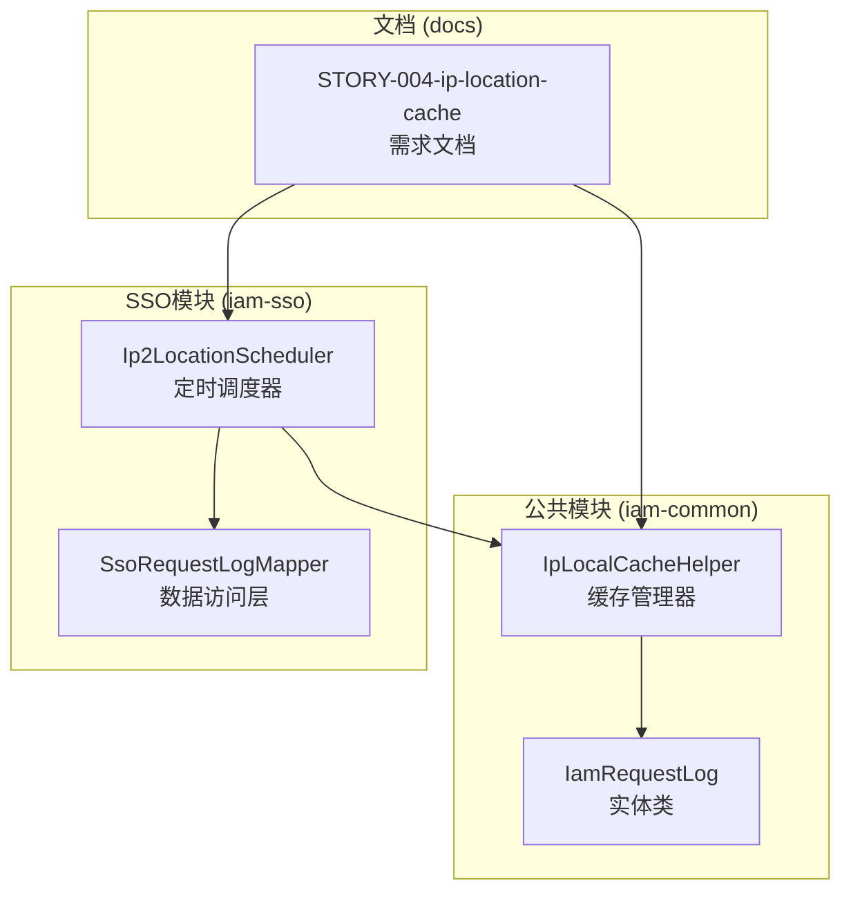
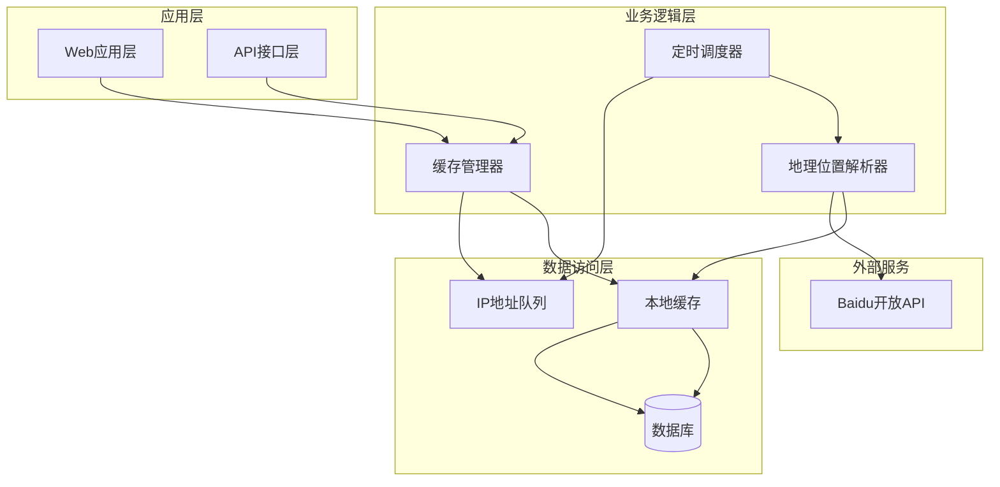
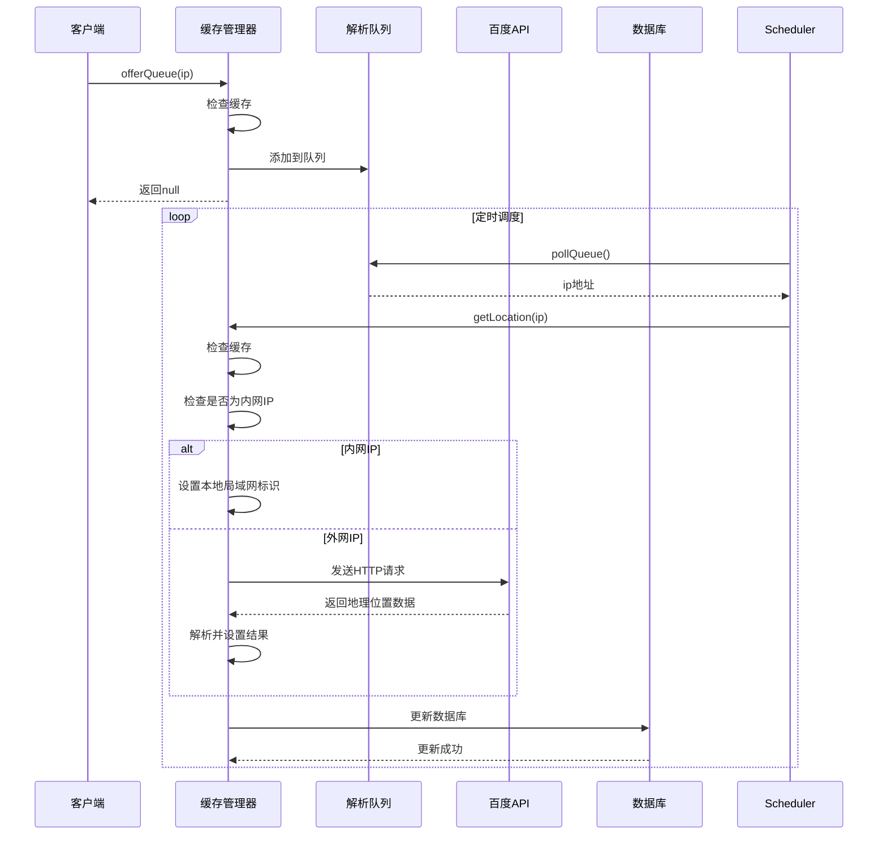
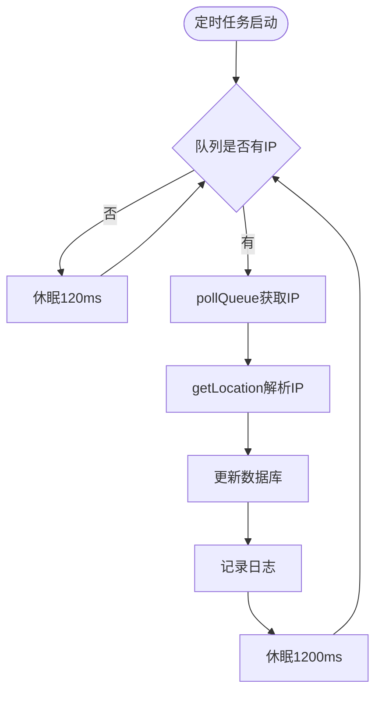
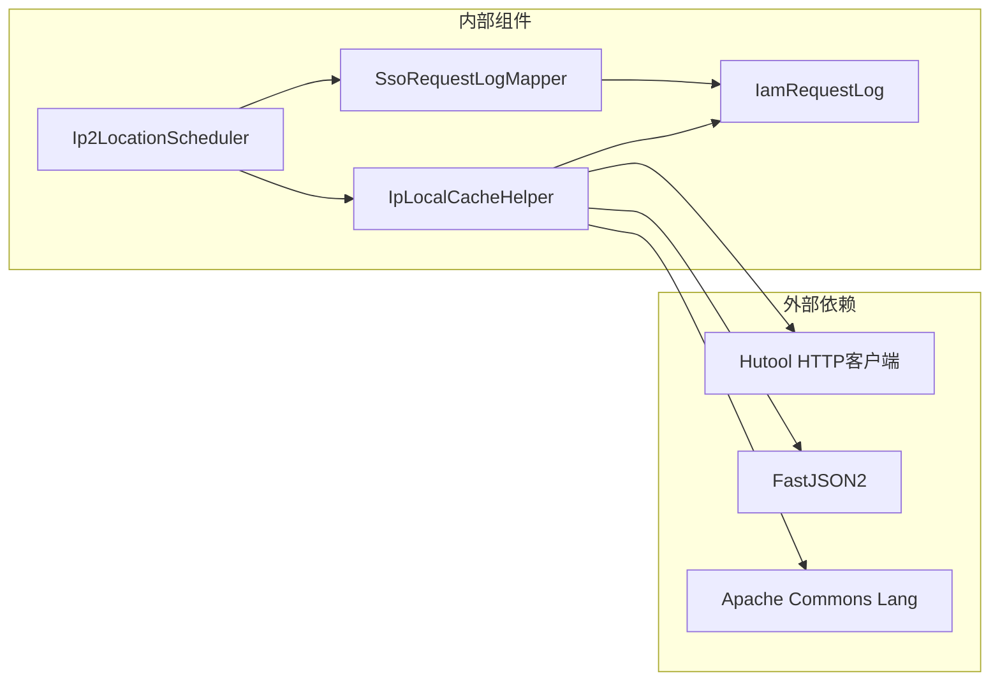
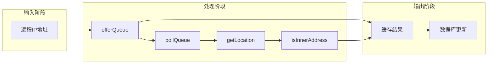

# IP地理位置缓存

<cite>
**本文档引用的文件**
- [IpLocalCacheHelper.java](file://iam-common/src/main/java/com/wkclz/iam/common/helper/IpLocalCacheHelper.java)
- [Ip2LocationScheduler.java](file://iam-sso/src/main/java/com/wkclz/iam/sso/schedule/Ip2LocationScheduler.java)
- [IamRequestLog.java](file://iam-common/src/main/java/com/wkclz/iam/common/entity/IamRequestLog.java)
- [SsoRequestLogMapper.xml](file://iam-sso/src/main/resources/mapper/SsoRequestLogMapper.xml)
- [STORY-004-ip-location-cache.md](file://docs/stories/STORY-004-ip-location-cache.md)
</cite>

## 目录
1. [简介](#简介)
2. [项目结构](#项目结构)
3. [核心组件](#核心组件)
4. [架构概览](#架构概览)
5. [详细组件分析](#详细组件分析)
6. [依赖关系分析](#依赖关系分析)
7. [性能考虑](#性能考虑)
8. [故障排除指南](#故障排除指南)
9. [结论](#结论)
10. [附录](#附录)

## 简介

SH-IAM的IP地理位置缓存系统是一个分布式缓存解决方案，用于高效解析和缓存IP地址的地理位置信息。该系统通过异步队列处理IP地址解析，避免阻塞主线程，同时提供高性能的缓存访问能力。

系统的核心目标是：
- 自动解析用户登录IP的地理位置和运营商信息
- 提供线程安全的缓存机制
- 支持局域网IP的快速识别
- 通过百度开放API获取准确的地理位置数据
- 实现高效的缓存命中率和低延迟响应

## 项目结构

IP地理位置缓存系统主要分布在以下模块中：

**图表来源**
- [IpLocalCacheHelper.java:1-112](file://iam-common/src/main/java/com/wkclz/iam/common/helper/IpLocalCacheHelper.java#L1-L112)
- [Ip2LocationScheduler.java:1-61](file://iam-sso/src/main/java/com/wkclz/iam/sso/schedule/Ip2LocationScheduler.java#L1-L61)

**章节来源**
- [IpLocalCacheHelper.java:1-112](file://iam-common/src/main/java/com/wkclz/iam/common/helper/IpLocalCacheHelper.java#L1-L112)
- [Ip2LocationScheduler.java:1-61](file://iam-sso/src/main/java/com/wkclz/iam/sso/schedule/Ip2LocationScheduler.java#L1-L61)

## 核心组件

### IpLocalCacheHelper 缓存管理器

IpLocalCacheHelper是整个IP地理位置缓存系统的核心组件，负责IP地址的缓存管理和地理位置解析。

#### 主要特性
- **线程安全**: 使用ConcurrentHashMap和ConcurrentLinkedQueue确保多线程环境下的数据一致性
- **异步处理**: 通过队列机制实现IP地址解析的异步处理
- **智能缓存**: 支持缓存命中检测，避免重复的外部API调用
- **局域网优化**: 对内网IP进行特殊处理，直接标记为"本地局域网"

#### 关键数据结构
- **IP_ADDR_CACHE**: ConcurrentHashMap<String, IamRequestLog> - 主要缓存存储
- **IP_QUEUE**: ConcurrentLinkedQueue<String> - 待解析IP地址队列

**章节来源**
- [IpLocalCacheHelper.java:25-26](file://iam-common/src/main/java/com/wkclz/iam/common/helper/IpLocalCacheHelper.java#L25-L26)
- [IpLocalCacheHelper.java:29-51](file://iam-common/src/main/java/com/wkclz/iam/common/helper/IpLocalCacheHelper.java#L29-L51)

### Ip2LocationScheduler 定时调度器

Ip2LocationScheduler是一个基于Spring Boot的ApplicationRunner实现，负责持续监控和处理IP地址解析队列。

#### 调度机制
- **后台线程**: 启动独立线程专门处理IP地址解析
- **轮询机制**: 每120毫秒检查一次IP队列
- **批量处理**: 每次处理后等待1200毫秒，控制API调用频率
- **无限循环**: 使用volatile标志位控制运行状态

#### 数据同步策略
- **增量更新**: 只更新location字段为空的记录
- **时间窗口**: 仅更新最近一个月内的记录
- **版本控制**: 使用version字段进行乐观锁控制

**章节来源**
- [Ip2LocationScheduler.java:20-56](file://iam-sso/src/main/java/com/wkclz/iam/sso/schedule/Ip2LocationScheduler.java#L20-L56)

### IamRequestLog 实体类

IamRequestLog是系统中的核心数据模型，用于存储请求日志信息，包括IP地址解析结果。

#### 字段结构
- **remoteAddr**: 请求IP地址
- **location**: 地理位置信息
- **isp**: 运营商信息
- **createTime**: 创建时间
- **version**: 版本号（用于并发控制）

**章节来源**
- [IamRequestLog.java:188-233](file://iam-common/src/main/java/com/wkclz/iam/common/entity/IamRequestLog.java#L188-L233)

## 架构概览

IP地理位置缓存系统采用分层架构设计，实现了清晰的关注点分离：

**图表来源**
- [IpLocalCacheHelper.java:20-112](file://iam-common/src/main/java/com/wkclz/iam/common/helper/IpLocalCacheHelper.java#L20-L112)
- [Ip2LocationScheduler.java:20-56](file://iam-sso/src/main/java/com/wkclz/iam/sso/schedule/Ip2LocationScheduler.java#L20-L56)

## 详细组件分析

### 缓存实现分析

#### 缓存键设计
系统采用简单的IP地址作为缓存键，具有以下特点：
- **唯一性**: IP地址在特定时间段内唯一标识一个地理位置
- **简洁性**: 字符串键便于存储和检索
- **可预测性**: 键的生成和解析逻辑简单明确

#### 缓存策略

```mermaid
flowchart TD
Start([开始缓存查询]) --> CheckEmpty{"IP地址是否为空"}
CheckEmpty --> |是| ReturnNull[返回null]
CheckEmpty --> |否| CheckCache{"缓存中是否存在"}
CheckCache --> |是| ReturnCache[返回缓存结果]
CheckCache --> |否| CheckQueue{"队列中是否包含"}
CheckQueue --> |是| ReturnNull2[返回null]
CheckQueue --> |否| AddQueue[添加到队列]
AddQueue --> ReturnNull3[返回null]
ReturnNull --> End([结束])
ReturnNull2 --> End
ReturnNull3 --> End
ReturnCache --> End
```

**图表来源**
- [IpLocalCacheHelper.java:29-51](file://iam-common/src/main/java/com/wkclz/iam/common/helper/IpLocalCacheHelper.java#L29-L51)

#### 过期时间和失效策略
当前实现采用**无过期时间**的缓存策略：
- **永久缓存**: 一旦IP地址解析结果被缓存，除非重启应用否则不会过期
- **内存限制**: 受限于JVM内存大小，大量IP地址可能导致内存溢出
- **简单可靠**: 无需复杂的过期机制，减少系统复杂度

### 地理位置解析流程

#### 解析算法流程

**图表来源**
- [IpLocalCacheHelper.java:64-110](file://iam-common/src/main/java/com/wkclz/iam/common/helper/IpLocalCacheHelper.java#L64-L110)
- [Ip2LocationScheduler.java:28-56](file://iam-sso/src/main/java/com/wkclz/iam/sso/schedule/Ip2LocationScheduler.java#L28-L56)

#### 外部API集成
系统通过百度开放API获取地理位置信息：
- **API地址**: `http://opendata.baidu.com/api.php?resource_id=6006&query=`
- **请求参数**: IP地址和时间戳
- **响应格式**: JSON格式，包含状态码和地理位置信息
- **数据解析**: 使用JSONPath提取location字段，按空格分割省市区和运营商

**章节来源**
- [IpLocalCacheHelper.java:22](file://iam-common/src/main/java/com/wkclz/iam/common/helper/IpLocalCacheHelper.java#L22)
- [IpLocalCacheHelper.java:83-107](file://iam-common/src/main/java/com/wkclz/iam/common/helper/IpLocalCacheHelper.java#L83-L107)

### 定时任务调度机制

#### 调度参数配置
- **队列检查间隔**: 120毫秒
- **数据库更新间隔**: 1200毫秒
- **线程名称**: "ip2addr"
- **运行状态**: 使用volatile boolean控制

#### 批量更新策略

**图表来源**
- [Ip2LocationScheduler.java:28-56](file://iam-sso/src/main/java/com/wkclz/iam/sso/schedule/Ip2LocationScheduler.java#L28-L56)

**章节来源**
- [Ip2LocationScheduler.java:28-56](file://iam-sso/src/main/java/com/wkclz/iam/sso/schedule/Ip2LocationScheduler.java#L28-L56)

## 依赖关系分析

### 组件间依赖关系

**图表来源**
- [IpLocalCacheHelper.java:3-9](file://iam-common/src/main/java/com/wkclz/iam/common/helper/IpLocalCacheHelper.java#L3-L9)
- [Ip2LocationScheduler.java:4-6](file://iam-sso/src/main/java/com/wkclz/iam/sso/schedule/Ip2LocationScheduler.java#L4-L6)

### 数据流分析

#### IP地址处理数据流

**图表来源**
- [IpLocalCacheHelper.java:29-110](file://iam-common/src/main/java/com/wkclz/iam/common/helper/IpLocalCacheHelper.java#L29-L110)

**章节来源**
- [IpLocalCacheHelper.java:29-110](file://iam-common/src/main/java/com/wkclz/iam/common/helper/IpLocalCacheHelper.java#L29-L110)

## 性能考虑

### 缓存性能优化

#### 线程安全设计
- **ConcurrentHashMap**: 提供高并发的读写性能
- **ConcurrentLinkedQueue**: 支持无锁的队列操作
- **synchronized关键字**: 确保关键操作的原子性

#### 内存使用优化
- **对象复用**: 缓存中存储IamRequestLog对象，避免频繁创建
- **字符串池化**: IP地址作为键使用JVM字符串池
- **及时清理**: 应用重启时清理所有缓存数据

### 网络性能优化

#### API调用优化
- **批量处理**: 通过定时任务批量处理队列中的IP地址
- **去重机制**: 队列中自动去重，避免重复请求
- **超时控制**: HTTP请求设置合理的超时时间

#### 延迟优化策略
- **预热机制**: 应用启动时预加载常用IP地址
- **渐进式更新**: 分批更新数据库，避免数据库压力峰值

## 故障排除指南

### 常见问题诊断

#### 缓存未命中问题
1. **检查IP地址格式**: 确保传入的IP地址格式正确
2. **验证缓存状态**: 检查IP_ADDR_CACHE是否正常工作
3. **查看队列状态**: 确认IP_QUEUE中是否有待处理的IP地址

#### API调用失败问题
1. **网络连接检查**: 验证与百度API的网络连接
2. **API可用性确认**: 检查百度API服务状态
3. **请求参数验证**: 确认IP地址参数的有效性

#### 数据库更新问题
1. **SQL语句检查**: 验证updateMostLocation SQL的正确性
2. **权限验证**: 确认数据库用户具有更新权限
3. **事务处理**: 检查数据库事务的提交状态

**章节来源**
- [Ip2LocationScheduler.java:44-46](file://iam-sso/src/main/java/com/wkclz/iam/sso/schedule/Ip2LocationScheduler.java#L44-L46)

### 监控和调试

#### 日志监控
- **队列操作日志**: 记录offerQueue和pollQueue的操作
- **API调用日志**: 记录HTTP请求和响应信息
- **数据库更新日志**: 记录每次成功的数据库更新

#### 性能指标
- **缓存命中率**: 计算缓存命中次数与总查询次数的比例
- **队列长度**: 监控IP_QUEUE的长度变化
- **API响应时间**: 统计HTTP请求的响应时间

## 结论

SH-IAM的IP地理位置缓存系统通过精心设计的架构和实现，提供了高效、可靠的IP地址解析服务。系统的主要优势包括：

1. **高性能**: 通过异步队列和本地缓存实现低延迟响应
2. **可靠性**: 采用线程安全的数据结构和完善的异常处理机制
3. **可扩展性**: 模块化设计支持功能扩展和性能优化
4. **易维护性**: 清晰的代码结构和完整的文档支持

未来可以考虑的改进方向：
- 实现缓存过期机制以控制内存使用
- 添加缓存统计和监控功能
- 支持多种地理位置API提供商
- 实现缓存预热和批量更新功能

## 附录

### 配置选项

#### 系统配置参数
- **队列检查间隔**: 120毫秒
- **数据库更新间隔**: 1200毫秒
- **API超时时间**: 默认HTTP客户端超时设置
- **缓存容量**: 受限于JVM内存大小

#### 开发和测试配置
- **测试模式**: 可通过配置启用测试模式
- **日志级别**: 支持DEBUG、INFO、WARN、ERROR级别
- **监控开关**: 可启用或禁用性能监控功能

### 最佳实践

#### 使用建议
1. **合理使用缓存**: 对于频繁访问的IP地址，利用缓存提高性能
2. **监控系统状态**: 定期检查缓存命中率和队列长度
3. **异常处理**: 确保API调用异常时的降级处理
4. **性能调优**: 根据实际负载调整定时任务的执行频率

#### 故障恢复
1. **缓存重建**: 应用重启后重新构建缓存
2. **队列清理**: 确保队列中的IP地址得到正确处理
3. **数据库同步**: 验证数据库中的地理位置信息完整性