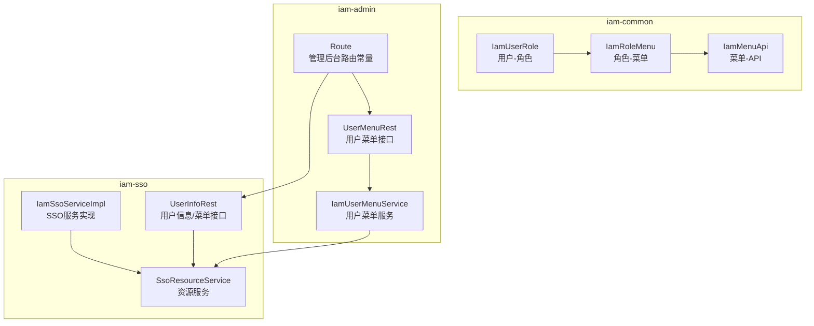
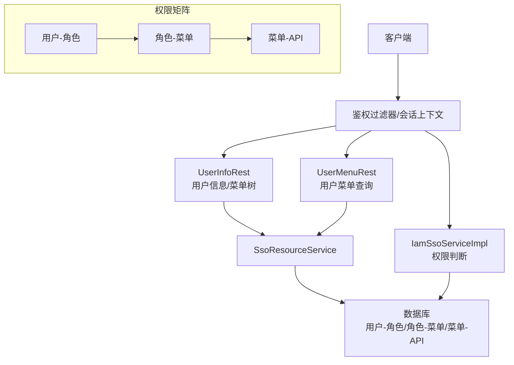
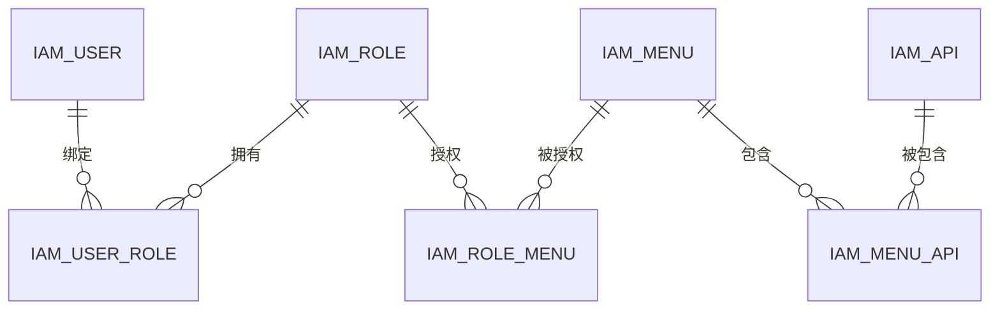
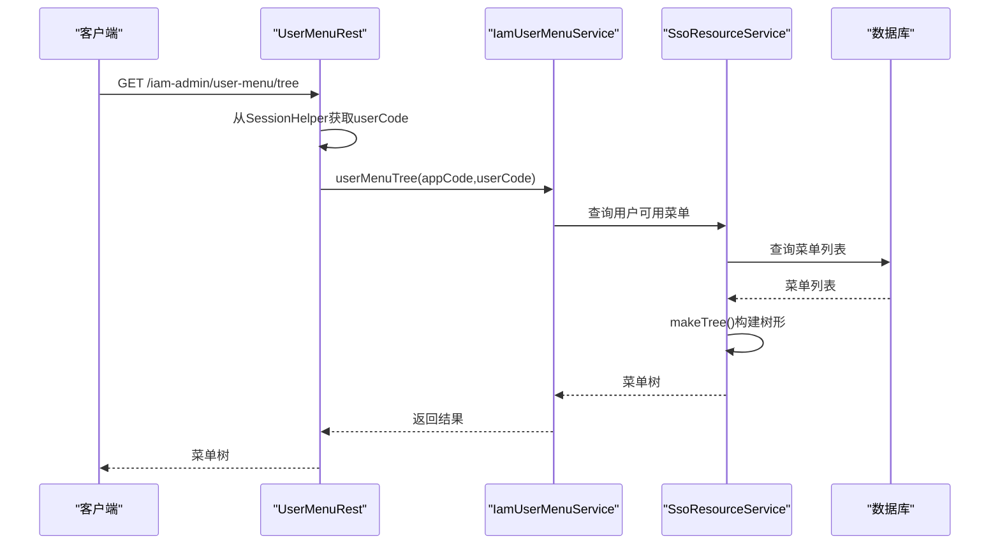
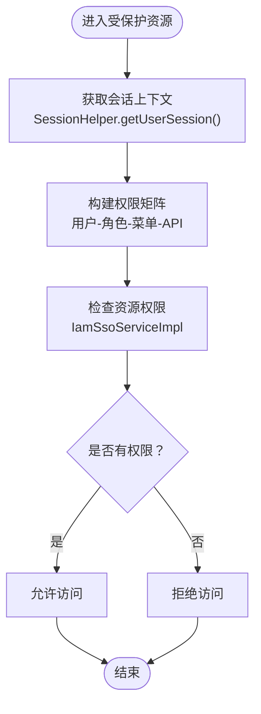
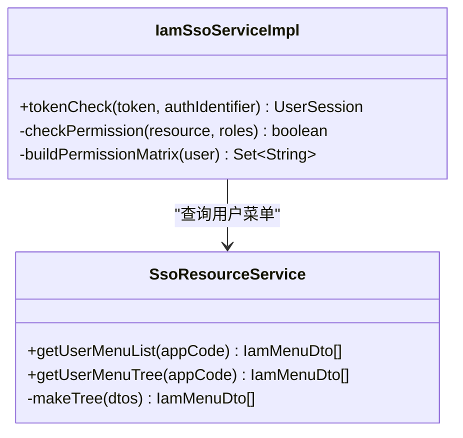
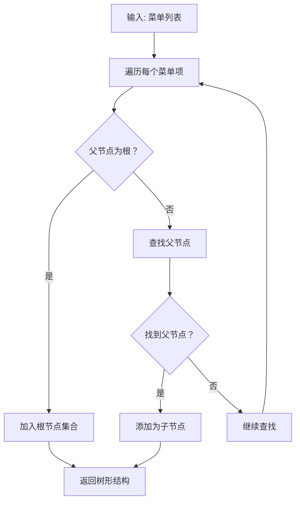
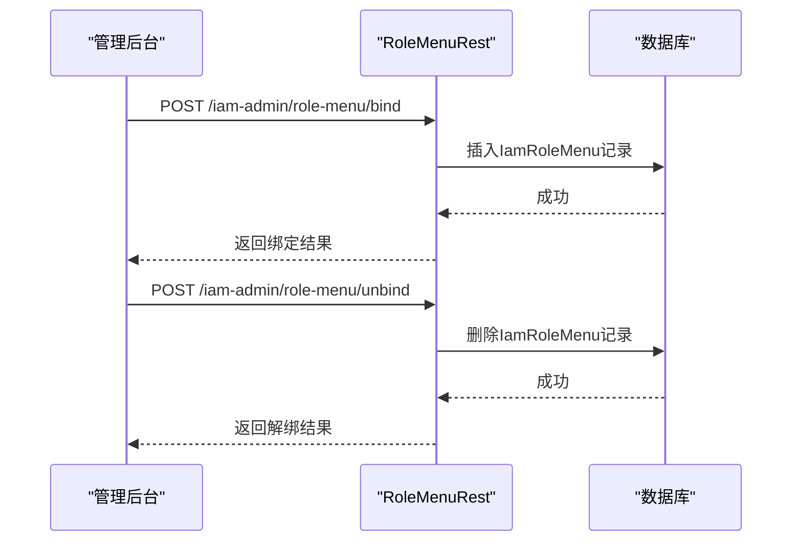
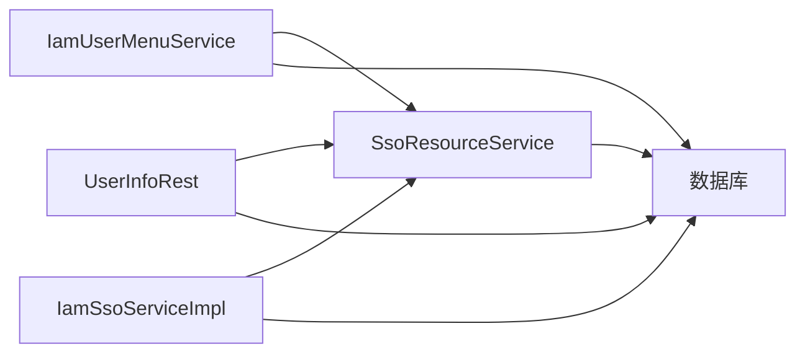

# RBAC权限控制

<cite>
**本文档引用的文件**
- [IamSsoServiceImpl.java](file://iam-sso/src/main/java/com/wkclz/iam/sso/service/IamSsoServiceImpl.java)
- [SsoResourceService.java](file://iam-sso/src/main/java/com/wkclz/iam/sso/service/SsoResourceService.java)
- [UserInfoRest.java](file://iam-sso/src/main/java/com/wkclz/iam/sso/rest/UserInfoRest.java)
- [UserMenuRest.java](file://iam-admin/src/main/java/com/wkclz/iam/admin/rest/UserMenuRest.java)
- [IamUserMenuService.java](file://iam-admin/src/main/java/com/wkclz/iam/admin/service/IamUserMenuService.java)
- [IamUserRole.java](file://iam-common/src/main/java/com/wkclz/iam/common/entity/IamUserRole.java)
- [IamRoleMenu.java](file://iam-common/src/main/java/com/wkclz/iam/common/entity/IamRoleMenu.java)
- [IamMenuApi.java](file://iam-common/src/main/java/com/wkclz/iam/common/entity/IamMenuApi.java)
- [Route.java](file://iam-admin/src/main/java/com/wkclz/iam/admin/Route.java)
- [STORY-019-user-info-menu-resource.md](file://docs/stories/STORY-019-user-info-menu-resource.md)
- [STORY-041-user-menu-query.md](file://docs/stories/STORY-041-user-menu-query.md)
- [STORY-034-role-menu-binding.md](file://docs/stories/STORY-034-role-menu-binding.md)
- [STORY-002-iam-relation-entities.md](file://docs/stories/STORY-002-iam-relation-entities.md)
</cite>

## 目录
1. [简介](#简介)
2. [项目结构](#项目结构)
3. [核心组件](#核心组件)
4. [架构总览](#架构总览)
5. [详细组件分析](#详细组件分析)
6. [依赖关系分析](#依赖关系分析)
7. [性能考虑](#性能考虑)
8. [故障排除指南](#故障排除指南)
9. [结论](#结论)
10. [附录](#附录)

## 简介
本文件面向SH-IAM的RBAC权限控制系统，系统采用“用户-角色-菜单-接口”四层关联模型，结合会话上下文与资源服务，实现菜单权限检查、API权限验证与资源访问控制。重点覆盖以下方面：
- RBAC模型与实体关系：用户-角色、角色-菜单、菜单-API 的多对多关联
- 权限验证流程：菜单权限检查、API权限验证、资源访问控制
- 关键实现：IamSsoServiceImpl中的权限判断逻辑、SsoResourceService的资源服务实现
- 权限配置示例、权限继承规则与权限审计功能说明

## 项目结构
RBAC相关代码主要分布在三个模块：
- iam-common：公共实体与DTO，定义用户-角色、角色-菜单、菜单-API等关联关系
- iam-sso：SSO登录与资源服务，提供菜单树与用户信息查询
- iam-admin：管理后台，提供用户菜单查询、角色-菜单绑定等管理接口

**图表来源**
- [IamUserRole.java](file://iam-common/src/main/java/com/wkclz/iam/common/entity/IamUserRole.java)
- [IamRoleMenu.java](file://iam-common/src/main/java/com/wkclz/iam/common/entity/IamRoleMenu.java)
- [IamMenuApi.java](file://iam-common/src/main/java/com/wkclz/iam/common/entity/IamMenuApi.java)
- [IamSsoServiceImpl.java](file://iam-sso/src/main/java/com/wkclz/iam/sso/service/IamSsoServiceImpl.java)
- [SsoResourceService.java](file://iam-sso/src/main/java/com/wkclz/iam/sso/service/SsoResourceService.java)
- [UserInfoRest.java](file://iam-sso/src/main/java/com/wkclz/iam/sso/rest/UserInfoRest.java)
- [UserMenuRest.java](file://iam-admin/src/main/java/com/wkclz/iam/admin/rest/UserMenuRest.java)
- [IamUserMenuService.java](file://iam-admin/src/main/java/com/wkclz/iam/admin/service/IamUserMenuService.java)
- [Route.java](file://iam-admin/src/main/java/com/wkclz/iam/admin/Route.java)

**章节来源**
- [Route.java:70-144](file://iam-admin/src/main/java/com/wkclz/iam/admin/Route.java#L70-L144)
- [STORY-019-user-info-menu-resource.md:1-43](file://docs/stories/STORY-019-user-info-menu-resource.md#L1-L43)
- [STORY-041-user-menu-query.md:1-40](file://docs/stories/STORY-041-user-menu-query.md#L1-L40)
- [STORY-034-role-menu-binding.md:1-40](file://docs/stories/STORY-034-role-menu-binding.md#L1-L40)
- [STORY-002-iam-relation-entities.md:1-26](file://docs/stories/STORY-002-iam-relation-entities.md#L1-L26)

## 核心组件
- 用户-角色关联：IamUserRole，建立用户与角色的多对多关系
- 角色-菜单关联：IamRoleMenu，建立角色与菜单的多对多关系
- 菜单-API关联：IamMenuApi，建立菜单与后端API的多对多关系
- SSO资源服务：SsoResourceService，提供菜单列表与树形结构查询
- 用户菜单接口：UserMenuRest与IamUserMenuService，提供当前用户菜单查询
- 用户信息与菜单接口：UserInfoRest，提供用户信息与菜单树查询
- SSO服务实现：IamSsoServiceImpl，负责权限判断与会话处理

**章节来源**
- [IamUserRole.java](file://iam-common/src/main/java/com/wkclz/iam/common/entity/IamUserRole.java)
- [IamRoleMenu.java](file://iam-common/src/main/java/com/wkclz/iam/common/entity/IamRoleMenu.java)
- [IamMenuApi.java](file://iam-common/src/main/java/com/wkclz/iam/common/entity/IamMenuApi.java)
- [SsoResourceService.java:1-49](file://iam-sso/src/main/java/com/wkclz/iam/sso/service/SsoResourceService.java#L1-L49)
- [UserMenuRest.java:1-40](file://iam-admin/src/main/java/com/wkclz/iam/admin/rest/UserMenuRest.java#L1-L40)
- [IamUserMenuService.java](file://iam-admin/src/main/java/com/wkclz/iam/admin/service/IamUserMenuService.java)
- [UserInfoRest.java:1-41](file://iam-sso/src/main/java/com/wkclz/iam/sso/rest/UserInfoRest.java#L1-L41)
- [IamSsoServiceImpl.java](file://iam-sso/src/main/java/com/wkclz/iam/sso/service/IamSsoServiceImpl.java)

## 架构总览
RBAC权限控制的整体架构围绕“会话上下文 + 资源服务 + 关联关系”展开：
- 会话上下文：通过SessionHelper获取当前用户身份
- 资源服务：SsoResourceService提供菜单查询与树形构建
- 关联关系：用户-角色、角色-菜单、菜单-API三类多对多关系构成权限矩阵
- 接口层：管理后台与SSO模块分别提供菜单查询与用户信息接口

**图表来源**
- [UserInfoRest.java:26-41](file://iam-sso/src/main/java/com/wkclz/iam/sso/rest/UserInfoRest.java#L26-L41)
- [UserMenuRest.java:17-40](file://iam-admin/src/main/java/com/wkclz/iam/admin/rest/UserMenuRest.java#L17-L40)
- [SsoResourceService.java:1-49](file://iam-sso/src/main/java/com/wkclz/iam/sso/service/SsoResourceService.java#L1-L49)
- [IamSsoServiceImpl.java](file://iam-sso/src/main/java/com/wkclz/iam/sso/service/IamSsoServiceImpl.java)
- [IamUserRole.java](file://iam-common/src/main/java/com/wkclz/iam/common/entity/IamUserRole.java)
- [IamRoleMenu.java](file://iam-common/src/main/java/com/wkclz/iam/common/entity/IamRoleMenu.java)
- [IamMenuApi.java](file://iam-common/src/main/java/com/wkclz/iam/common/entity/IamMenuApi.java)

## 详细组件分析

### 用户-角色-菜单-接口关联关系
RBAC模型通过三类实体实现：
- 用户-角色：IamUserRole，记录用户与角色的绑定
- 角色-菜单：IamRoleMenu，记录角色可访问的菜单集合
- 菜单-API：IamMenuApi，记录菜单对应的后端API集合

**图表来源**
- [IamUserRole.java](file://iam-common/src/main/java/com/wkclz/iam/common/entity/IamUserRole.java)
- [IamRoleMenu.java](file://iam-common/src/main/java/com/wkclz/iam/common/entity/IamRoleMenu.java)
- [IamMenuApi.java](file://iam-common/src/main/java/com/wkclz/iam/common/entity/IamMenuApi.java)

**章节来源**
- [STORY-002-iam-relation-entities.md:1-26](file://docs/stories/STORY-002-iam-relation-entities.md#L1-L26)

### 菜单权限检查流程
- 管理后台查询当前用户菜单：UserMenuRest通过SessionHelper获取userCode，调用IamUserMenuService.userMenuList或userMenuTree
- SSO模块查询用户信息与菜单树：UserInfoRest从Header获取appCode，调用SsoResourceService.getUserMenuTree
- 菜单树构建：SsoResourceService内部通过makeTree方法将扁平菜单转换为树形结构

**图表来源**
- [UserMenuRest.java:24-38](file://iam-admin/src/main/java/com/wkclz/iam/admin/rest/UserMenuRest.java#L24-L38)
- [IamUserMenuService.java](file://iam-admin/src/main/java/com/wkclz/iam/admin/service/IamUserMenuService.java)
- [SsoResourceService.java:18-25](file://iam-sso/src/main/java/com/wkclz/iam/sso/service/SsoResourceService.java#L18-L25)

**章节来源**
- [UserMenuRest.java:1-40](file://iam-admin/src/main/java/com/wkclz/iam/admin/rest/UserMenuRest.java#L1-L40)
- [IamUserMenuService.java](file://iam-admin/src/main/java/com/wkclz/iam/admin/service/IamUserMenuService.java)
- [SsoResourceService.java:28-47](file://iam-sso/src/main/java/com/wkclz/iam/sso/service/SsoResourceService.java#L28-L47)
- [STORY-041-user-menu-query.md:17-27](file://docs/stories/STORY-041-user-menu-query.md#L17-L27)

### API权限验证与资源访问控制
- API权限验证：菜单-API关联IamMenuApi，通过角色-菜单授权间接控制API访问
- 资源访问控制：IamSsoServiceImpl负责权限判断逻辑，结合会话上下文与资源服务实现访问控制
- 访问路径：管理后台与SSO模块均通过会话上下文与资源服务完成权限校验

**图表来源**
- [UserInfoRest.java:35-41](file://iam-sso/src/main/java/com/wkclz/iam/sso/rest/UserInfoRest.java#L35-L41)
- [IamSsoServiceImpl.java](file://iam-sso/src/main/java/com/wkclz/iam/sso/service/IamSsoServiceImpl.java)
- [IamMenuApi.java](file://iam-common/src/main/java/com/wkclz/iam/common/entity/IamMenuApi.java)

**章节来源**
- [UserInfoRest.java:1-41](file://iam-sso/src/main/java/com/wkclz/iam/sso/rest/UserInfoRest.java#L1-L41)
- [IamSsoServiceImpl.java](file://iam-sso/src/main/java/com/wkclz/iam/sso/service/IamSsoServiceImpl.java)
- [STORY-019-user-info-menu-resource.md:17-29](file://docs/stories/STORY-019-user-info-menu-resource.md#L17-L29)

### IamSsoServiceImpl权限判断逻辑
- 功能职责：负责权限判断与会话处理，结合用户角色与菜单-API关联进行访问控制
- 输入输出：接收token与authIdentifier，返回UserSession或执行权限判定
- 与资源服务协作：通过SsoResourceService获取用户可用菜单，用于权限矩阵构建

**图表来源**
- [IamSsoServiceImpl.java](file://iam-sso/src/main/java/com/wkclz/iam/sso/service/IamSsoServiceImpl.java)
- [SsoResourceService.java:1-49](file://iam-sso/src/main/java/com/wkclz/iam/sso/service/SsoResourceService.java#L1-L49)

**章节来源**
- [IamSsoServiceImpl.java](file://iam-sso/src/main/java/com/wkclz/iam/sso/service/IamSsoServiceImpl.java)
- [SsoResourceService.java:1-49](file://iam-sso/src/main/java/com/wkclz/iam/sso/service/SsoResourceService.java#L1-L49)

### SsoResourceService资源服务实现
- 职责：提供用户菜单列表与树形结构查询，内部实现树形构建算法
- 数据来源：通过SsoResourceMapper查询数据库中的菜单数据
- 复杂度：makeTree采用双层循环，时间复杂度O(n²)，适用于菜单规模较小的场景

**图表来源**
- [SsoResourceService.java:28-47](file://iam-sso/src/main/java/com/wkclz/iam/sso/service/SsoResourceService.java#L28-L47)

**章节来源**
- [SsoResourceService.java:1-49](file://iam-sso/src/main/java/com/wkclz/iam/sso/service/SsoResourceService.java#L1-L49)

### 角色-菜单绑定与权限继承
- 角色-菜单绑定：通过Route中ROLE_MENU_*接口实现，支持列表查询、绑定与解绑
- 权限继承：角色通过菜单间接继承API权限，形成“角色-菜单-接口”的继承链
- 管理后台接口：RoleMenuRest提供角色-菜单关联的CRUD能力

**图表来源**
- [Route.java:107-113](file://iam-admin/src/main/java/com/wkclz/iam/admin/Route.java#L107-L113)
- [STORY-034-role-menu-binding.md:17-26](file://docs/stories/STORY-034-role-menu-binding.md#L17-L26)

**章节来源**
- [Route.java:107-113](file://iam-admin/src/main/java/com/wkclz/iam/admin/Route.java#L107-L113)
- [STORY-034-role-menu-binding.md:1-40](file://docs/stories/STORY-034-role-menu-binding.md#L1-L40)

## 依赖关系分析
- 组件耦合：IamUserMenuService依赖SsoResourceService进行菜单查询；UserInfoRest直接依赖SsoResourceService；IamSsoServiceImpl与SsoResourceService存在协作关系
- 关联关系：用户-角色、角色-菜单、菜单-API三类实体构成权限矩阵，支撑菜单与API权限验证
- 外部依赖：会话上下文SessionHelper提供用户身份信息，数据库存储权限关联数据

**图表来源**
- [IamUserMenuService.java](file://iam-admin/src/main/java/com/wkclz/iam/admin/service/IamUserMenuService.java)
- [SsoResourceService.java:1-49](file://iam-sso/src/main/java/com/wkclz/iam/sso/service/SsoResourceService.java#L1-L49)
- [UserInfoRest.java:1-41](file://iam-sso/src/main/java/com/wkclz/iam/sso/rest/UserInfoRest.java#L1-L41)
- [IamSsoServiceImpl.java](file://iam-sso/src/main/java/com/wkclz/iam/sso/service/IamSsoServiceImpl.java)

**章节来源**
- [IamUserMenuService.java](file://iam-admin/src/main/java/com/wkclz/iam/admin/service/IamUserMenuService.java)
- [SsoResourceService.java:1-49](file://iam-sso/src/main/java/com/wkclz/iam/sso/service/SsoResourceService.java#L1-L49)
- [UserInfoRest.java:1-41](file://iam-sso/src/main/java/com/wkclz/iam/sso/rest/UserInfoRest.java#L1-L41)
- [IamSsoServiceImpl.java](file://iam-sso/src/main/java/com/wkclz/iam/sso/service/IamSsoServiceImpl.java)

## 性能考虑
- 菜单树构建：SsoResourceService.makeTree采用O(n²)双层循环，适用于菜单数量较小的场景；若菜单规模扩大，建议优化为一次遍历+哈希索引
- 查询路径：用户菜单查询涉及多次数据库访问，可通过缓存策略（如Redis）缓存用户可用菜单，减少重复查询
- 权限判断：IamSsoServiceImpl在权限判断时应避免重复构建权限矩阵，建议在会话中缓存用户权限集合

## 故障排除指南
- 会话缺失：确认SessionHelper是否正确注入当前用户身份，检查会话上下文初始化
- appCode缺失：用户菜单查询需提供appCode，确保请求参数或Header正确传递
- 权限不足：检查用户-角色、角色-菜单、菜单-API关联是否完整配置，确认IamSsoServiceImpl的权限判断逻辑是否正确执行
- 菜单树异常：核对SsoResourceService.makeTree的父子关系字段，确保parentCode与menuCode一致

**章节来源**
- [UserMenuRest.java:24-38](file://iam-admin/src/main/java/com/wkclz/iam/admin/rest/UserMenuRest.java#L24-L38)
- [SsoResourceService.java:28-47](file://iam-sso/src/main/java/com/wkclz/iam/sso/service/SsoResourceService.java#L28-L47)
- [IamSsoServiceImpl.java](file://iam-sso/src/main/java/com/wkclz/iam/sso/service/IamSsoServiceImpl.java)

## 结论
SH-IAM的RBAC权限控制系统通过用户-角色-菜单-接口的多对多关联，结合会话上下文与资源服务，实现了菜单权限检查、API权限验证与资源访问控制。IamSsoServiceImpl承担权限判断核心逻辑，SsoResourceService提供菜单查询与树形构建能力，管理后台通过UserMenuRest与RoleMenuRest完善权限配置与查询。建议在实际部署中关注菜单规模与缓存策略，确保权限验证的高效与稳定。

## 附录

### 权限配置示例
- 用户-角色绑定：通过管理后台接口将用户与角色绑定
- 角色-菜单绑定：通过管理后台接口将角色与菜单绑定，实现菜单与按钮权限
- 菜单-API关联：通过菜单-API接口将菜单与后端API绑定，实现前后端权限统一

**章节来源**
- [Route.java:77-113](file://iam-admin/src/main/java/com/wkclz/iam/admin/Route.java#L77-L113)
- [STORY-034-role-menu-binding.md:17-26](file://docs/stories/STORY-034-role-menu-binding.md#L17-L26)

### 权限继承规则
- 角色继承：角色通过IamRoleMenu继承菜单权限
- 菜单继承：菜单通过IamMenuApi继承API权限
- 最终权限：用户最终权限为其所拥有的所有角色权限的并集

**章节来源**
- [IamRoleMenu.java](file://iam-common/src/main/java/com/wkclz/iam/common/entity/IamRoleMenu.java)
- [IamMenuApi.java](file://iam-common/src/main/java/com/wkclz/iam/common/entity/IamMenuApi.java)

### 权限审计功能说明
- 登录日志：IamLoginLog记录登录状态、IP、UA等信息，便于审计
- 请求日志：IamRequestLog记录请求URI、方法、耗时、响应体等，支持权限访问审计
- 建议：在IamSsoServiceImpl中增加权限决策日志，记录每次权限判断的结果与依据

**章节来源**
- [STORY-002-iam-relation-entities.md:21-26](file://docs/stories/STORY-002-iam-relation-entities.md#L21-L26)