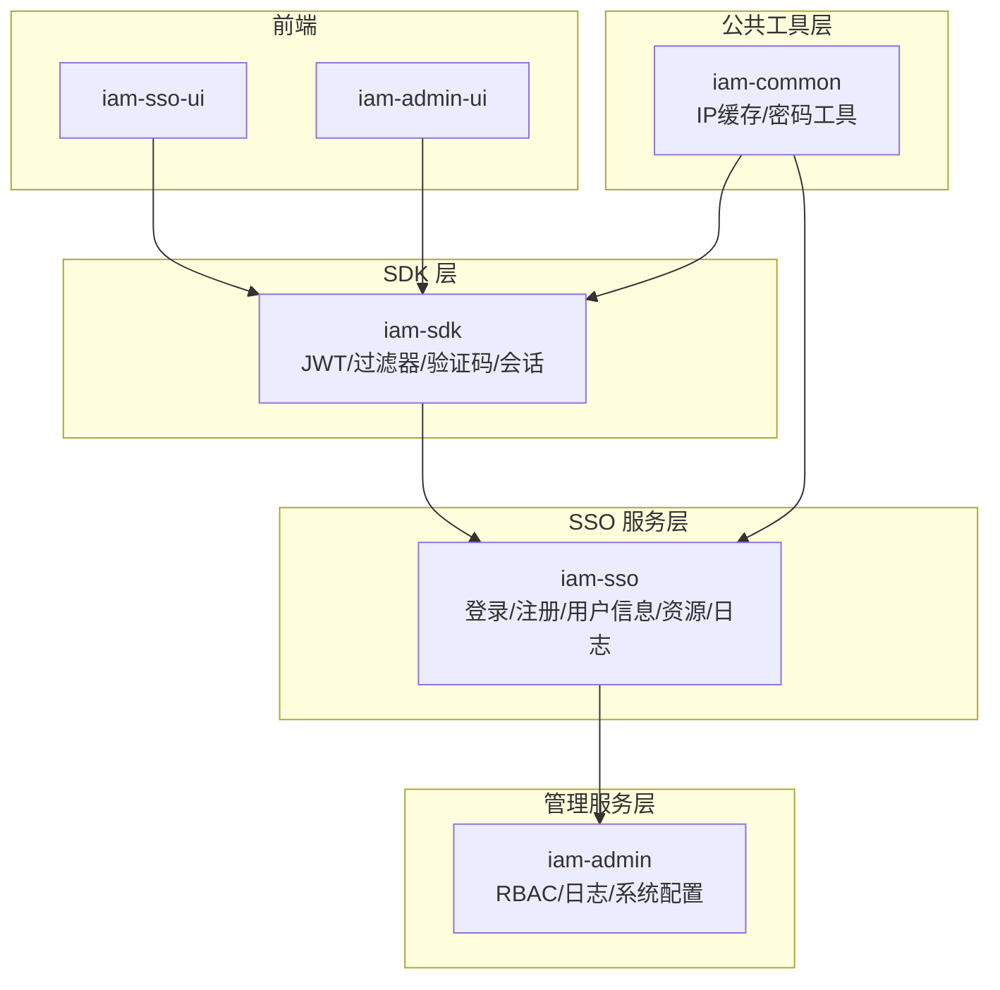
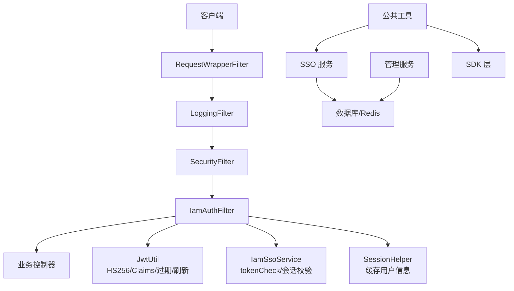
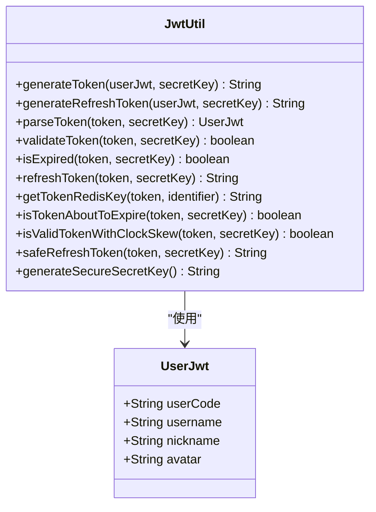
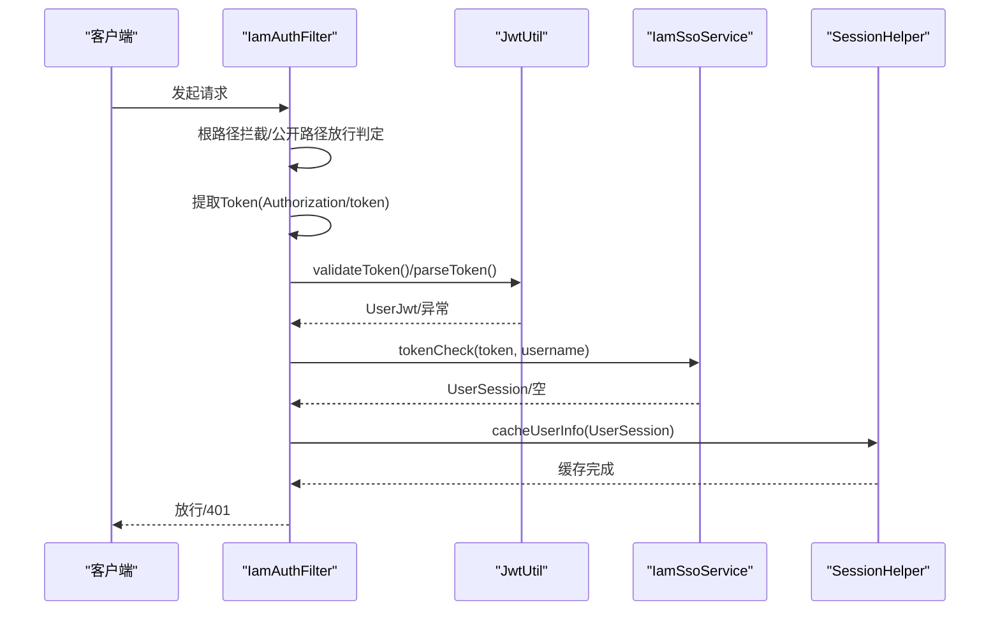
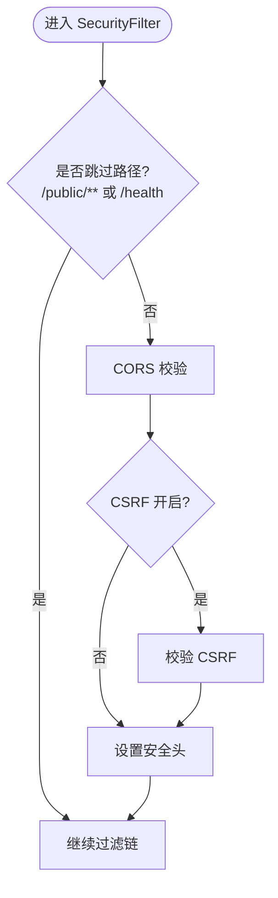
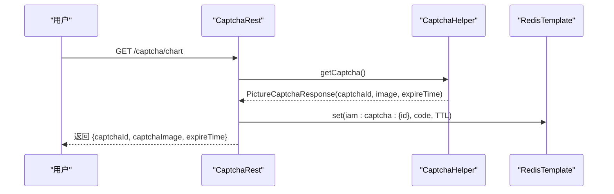
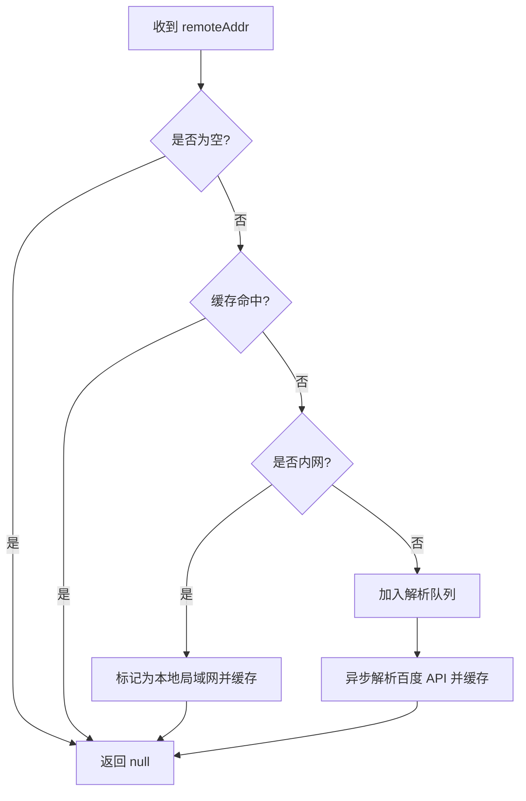
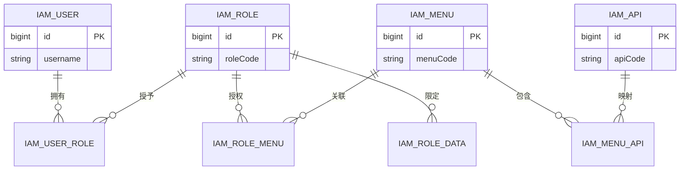
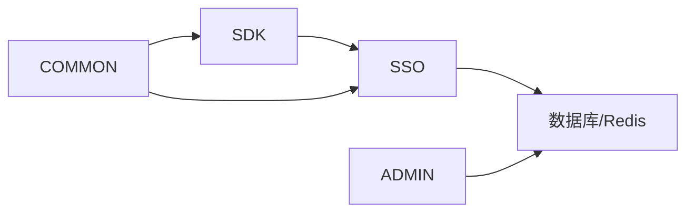

# 安全认证

<cite>
**本文引用的文件**
- [JwtUtil.java](file://iam-sdk/src/main/java/com/wkclz/iam/sdk/util/JwtUtil.java)
- [UserJwt.java](file://iam-sdk/src/main/java/com/wkclz/iam/sdk/model/UserJwt.java)
- [IamAuthFilter.java](file://iam-sdk/src/main/java/com/wkclz/iam/sdk/filter/IamAuthFilter.java)
- [SecurityFilter.java](file://iam-sdk/src/main/java/com/wkclz/iam/sdk/filter/SecurityFilter.java)
- [SecurityConfig.java](file://iam-sdk/src/main/java/com/wkclz/iam/sdk/config/SecurityConfig.java)
- [CaptchaHelper.java](file://iam-sdk/src/main/java/com/wkclz/iam/sdk/helper/CaptchaHelper.java)
- [PictureCaptchaResponse.java](file://iam-sdk/src/main/java/com/wkclz/iam/sdk/model/PictureCaptchaResponse.java)
- [CaptchaRest.java](file://iam-sso/src/main/java/com/wkclz/iam/sso/rest/CaptchaRest.java)
- [IpLocalCacheHelper.java](file://iam-common/src/main/java/com/wkclz/iam/common/helper/IpLocalCacheHelper.java)
- [IamSsoServiceImpl.java](file://iam-sso/src/main/java/com/wkclz/iam/sso/service/IamSsoServiceImpl.java)
- [SessionHelper.java](file://iam-sdk/src/main/java/com/wkclz/iam/sdk/helper/SessionHelper.java)
- [ResponseHelper.java](file://iam-sdk/src/main/java/com/wkclz/iam/sdk/helper/ResponseHelper.java)
- [IamSsoService.java](file://iam-sdk/src/main/java/com/wkclz/iam/sdk/service/IamSsoService.java)
- [IamSdkConfig.java](file://iam-sdk/src/main/java/com/wkclz/iam/sdk/config/IamSdkConfig.java)
- [Route.java](file://iam-sso/src/main/java/com/wkclz/iam/sso/Route.java)
- [Ip2LocationScheduler.java](file://iam-sso/src/main/java/com/wkclz/iam/sso/schedule/Ip2LocationScheduler.java)
- [LoginRest.java](file://iam-sso/src/main/java/com/wkclz/iam/sso/rest/LoginRest.java)
- [RegisterRest.java](file://iam-sso/src/main/java/com/wkclz/iam/sso/rest/RegisterRest.java)
- [UserInfoRest.java](file://iam-sso/src/main/java/com/wkclz/iam/sso/rest/UserInfoRest.java)
- [LoginRequest.java](file://iam-sdk/src/main/java/com/wkclz/iam/sdk/model/LoginRequest.java)
- [LoginResponse.java](file://iam-sdk/src/main/java/com/wkclz/iam/sdk/model/LoginResponse.java)
- [UserSession.java](file://iam-sdk/src/main/java/com/wkclz/iam/sdk/model/UserSession.java)
- [PasswordHelper.java](file://iam-common/src/main/java/com/wkclz/iam/common/helper/PasswordHelper.java)
- [LoginLogRest.java](file://iam-admin/src/main/java/com/wkclz/iam/admin/rest/LoginLogRest.java)
- [RequestLogRest.java](file://iam-admin/src/main/java/com/wkclz/iam/admin/rest/RequestLogRest.java)
- [SsoResourceService.java](file://iam-sso/src/main/java/com/wkclz/iam/sso/service/SsoResourceService.java)
- [SsoResourceMapper.java](file://iam-sso/src/main/java/com/wkclz/iam/sso/mapper/SsoResourceMapper.java)
- [SsoLoginLogMapper.java](file://iam-sso/src/main/java/com/wkclz/iam/sso/mapper/SsoLoginLogMapper.java)
- [SsoRequestLogMapper.java](file://iam-sso/src/main/java/com/wkclz/iam/sso/mapper/SsoRequestLogMapper.java)
- [IamMenuMapper.java](file://iam-admin/src/main/java/com/wkclz/iam/admin/mapper/IamMenuMapper.java)
- [IamRoleMenuMapper.java](file://iam-admin/src/main/java/com/wkclz/iam/admin/mapper/IamRoleMenuMapper.java)
- [IamApiMapper.java](file://iam-admin/src/main/java/com/wkclz/iam/admin/mapper/IamApiMapper.java)
- [IamMenuApiMapper.java](file://iam-admin/src/main/java/com/wkclz/iam/admin/mapper/IamMenuApiMapper.java)
- [IamRoleMapper.java](file://iam-admin/src/main/java/com/wkclz/iam/admin/mapper/IamRoleMapper.java)
- [IamRoleDataMapper.java](file://iam-admin/src/main/java/com/wkclz/iam/admin/mapper/IamRoleDataMapper.java)
- [IamUserMapper.java](file://iam-admin/src/main/java/com/wkclz/iam/admin/mapper/IamUserMapper.java)
- [IamUserRoleMapper.java](file://iam-admin/src/main/java/com/wkclz/iam/admin/mapper/IamUserRoleMapper.java)
- [IamUserAuthMapper.java](file://iam-admin/src/main/java/com/wkclz/iam/admin/mapper/IamUserAuthMapper.java)
- [IamUserAuthPasswordMapper.java](file://iam-admin/src/main/java/com/wkclz/iam/admin/mapper/IamUserAuthPasswordMapper.java)
- [IamUserPasswordHisMapper.java](file://iam-admin/src/main/java/com/wkclz/iam/admin/mapper/IamUserPasswordHisMapper.java)
- [IamAccessKeyMapper.java](file://iam-admin/src/main/java/com/wkclz/iam/admin/mapper/IamAccessKeyMapper.java)
- [IamAccessKeyApiMapper.java](file://iam-admin/src/main/java/com/wkclz/iam/admin/mapper/IamAccessKeyApiMapper.java)
- [IamDataDimensionMapper.java](file://iam-admin/src/main/java/com/wkclz/iam/admin/mapper/IamDataDimensionMapper.java)
- [IamTenantMapper.java](file://iam-admin/src/main/java/com/wkclz/iam/admin/mapper/IamTenantMapper.java)
- [IamAppMapper.java](file://iam-admin/src/main/java/com/wkclz/iam/admin/mapper/IamAppMapper.java)
- [IamLoginLogMapper.java](file://iam-admin/src/main/java/com/wkclz/iam/admin/mapper/IamLoginLogMapper.java)
- [IamRequestLogMapper.java](file://iam-admin/src/main/java/com/wkclz/iam/admin/mapper/IamRequestLogMapper.java)
- [IamMenuApiMapper.xml](file://iam-admin/src/main/resources/mapper/IamMenuApiMapper.xml)
- [IamMenuMapper.xml](file://iam-admin/src/main/resources/mapper/IamMenuMapper.xml)
- [IamApiMapper.xml](file://iam-admin/src/main/resources/mapper/IamApiMapper.xml)
- [IamRoleMenuMapper.xml](file://iam-admin/src/main/resources/mapper/IamRoleMenuMapper.xml)
- [IamRoleMapper.xml](file://iam-admin/src/main/resources/mapper/IamRoleMapper.xml)
- [IamRoleDataMapper.xml](file://iam-admin/src/main/resources/mapper/IamRoleDataMapper.xml)
- [IamUserMapper.xml](file://iam-admin/src/main/resources/mapper/IamUserMapper.xml)
- [IamUserRoleMapper.xml](file://iam-admin/src/main/resources/mapper/IamUserRoleMapper.xml)
- [IamUserAuthMapper.xml](file://iam-admin/src/main/resources/mapper/IamUserAuthMapper.xml)
- [IamUserAuthPasswordMapper.xml](file://iam-admin/src/main/resources/mapper/IamUserAuthPasswordMapper.xml)
- [IamUserPasswordHisMapper.xml](file://iam-admin/src/main/resources/mapper/IamUserPasswordHisMapper.xml)
- [IamAccessKeyMapper.xml](file://iam-admin/src/main/resources/mapper/IamAccessKeyMapper.xml)
- [IamAccessKeyApiMapper.xml](file://iam-admin/src/main/resources/mapper/IamAccessKeyApiMapper.xml)
- [IamDataDimensionMapper.xml](file://iam-admin/src/main/resources/mapper/IamDataDimensionMapper.xml)
- [IamTenantMapper.xml](file://iam-admin/src/main/resources/mapper/IamTenantMapper.xml)
- [IamAppMapper.xml](file://iam-admin/src/main/resources/mapper/IamAppMapper.xml)
- [IamLoginLogMapper.xml](file://iam-admin/src/main/resources/mapper/IamLoginLogMapper.xml)
- [IamRequestLogMapper.xml](file://iam-admin/src/main/resources/mapper/IamRequestLogMapper.xml)
- [SsoLoginMapper.java](file://iam-sso/src/main/java/com/wkclz/iam/sso/mapper/SsoLoginMapper.java)
- [SsoLoginMapper.xml](file://iam-sso/src/main/resources/mapper/SsoLoginMapper.xml)
- [SsoRequestLogMapper.xml](file://iam-sso/src/main/resources/mapper/SsoRequestLogMapper.xml)
- [SsoLoginLogMapper.xml](file://iam-sso/src/main/resources/mapper/SsoLoginLogMapper.xml)
- [SsoResourceMapper.xml](file://iam-sso/src/main/resources/mapper/SsoResourceMapper.xml)
- [IamAdminConfig.java](file://iam-admin/src/main/java/com/wkclz/iam/admin/config/IamAdminConfig.java)
- [IamSsoConfig.java](file://iam-sso/src/main/java/com/wkclz/iam/sso/config/IamSsoConfig.java)
- [IamSdkAutoConfig.java](file://iam-sdk/src/main/java/com/wkclz/iam/sdk/IamSdkAutoConfig.java)
- [IamSsoAutoConfig.java](file://iam-sso/src/main/java/com/wkclz/iam/sso/IamSsoAutoConfig.java)
- [IamAdminAutoConfig.java](file://iam-admin/src/main/java/com/wkclz/iam/admin/IamAdminAutoConfig.java)
- [IamSsoApplication.java](file://iam-sso-starter/src/main/java/com/wkclz/iam/sso/starter/IamSsoApplication.java)
- [IamAdminApplication.java](file://iam-admin-starter/src/main/java/com/wkclz/iam/admin/starter/IamAdminApplication.java)
- [application.yml](file://iam-sso-starter/src/main/resources/config/application.yml)
- [application.yml](file://iam-admin-starter/src/main/resources/config/application.yml)
- [db-base.ddl.sql](file://iam-sso/src/main/resources/db-script/db-base.ddl.sql)
- [STORY-005-jwt-token.md](file://docs/stories/STORY-005-jwt-token.md)
- [STORY-007-iam-auth-filter.md](file://docs/stories/STORY-007-iam-auth-filter.md)
- [STORY-004-ip-location-cache.md](file://docs/stories/STORY-004-ip-location-cache.md)
- [STORY-010-security-filter.md](file://docs/stories/STORY-010-security-filter.md)
- [STORY-012-captcha-helper.md](file://docs/stories/STORY-012-captcha-helper.md)
- [STORY-015-username-password-login.md](file://docs/stories/STORY-015-username-password-login.md)
- [STORY-016-captcha-rest.md](file://docs/stories/STORY-016-captcha-rest.md)
- [STORY-018-user-logout.md](file://docs/stories/STORY-018-user-logout.md)
- [STORY-019-user-info-menu-resource.md](file://docs/stories/STORY-019-user-info-menu-resource.md)
- [STORY-021-token-check-service.md](file://docs/stories/STORY-021-token-check-service.md)
- [STORY-022-request-log-persistence.md](file://docs/stories/STORY-022-request-log-persistence.md)
- [STORY-025-user-crud.md](file://docs/stories/STORY-025-user-crud.md)
- [STORY-026-user-auth-management.md](file://docs/stories/STORY-026-user-auth-management.md)
- [STORY-027-role-crud.md](file://docs/stories/STORY-027-role-crud.md)
- [STORY-030-api-crud.md](file://docs/stories/STORY-030-api-crud.md)
- [STORY-031-api-auto-scan.md](file://docs/stories/STORY-031-api-auto-scan.md)
- [STORY-032-access-key-crud.md](file://docs/stories/STORY-032-access-key-crud.md)
- [STORY-034-role-menu-binding.md](file://docs/stories/STORY-034-role-menu-binding.md)
- [STORY-037-data-dimension-crud.md](file://docs/stories/STORY-037-data-dimension-crud.md)
- [STORY-039-login-log-query.md](file://docs/stories/STORY-039-login-log-query.md)
- [STORY-041-user-menu-query.md](file://docs/stories/STORY-041-user-menu-query.md)
</cite>

## 目录
1. [简介](#简介)
2. [项目结构](#项目结构)
3. [核心组件](#核心组件)
4. [架构总览](#架构总览)
5. [详细组件分析](#详细组件分析)
6. [依赖关系分析](#依赖关系分析)
7. [性能考虑](#性能考虑)
8. [故障排查指南](#故障排查指南)
9. [结论](#结论)
10. [附录](#附录)

## 简介
本技术文档面向 SH-IAM 安全认证系统，围绕以下目标展开：JWT 令牌生成与校验、会话状态管理、认证过滤器实现、RBAC 权限模型与菜单/API 权限控制、密码加密策略、IP 地理位置缓存、验证码系统、安全配置与最佳实践、认证流程与权限检查机制以及安全审计功能。文档以代码为依据，结合架构图与流程图，帮助开发者与运维人员快速理解并正确部署与维护系统。

## 项目结构
系统采用多模块分层设计，主要模块包括：
- iam-sdk：SDK 安全能力封装（JWT、过滤器、验证码、会话等）
- iam-sso：SSO 单点登录服务端（登录、注册、用户信息、资源与日志持久化）
- iam-admin：后台管理服务（RBAC 数据 CRUD、日志查询、系统配置）
- iam-common：公共工具与实体（IP 地理位置缓存、密码工具等）
- iam-sso-ui、iam-admin-ui：前端界面（SSO 门户与后台管理界面）

**图表来源**
- [IamSdkAutoConfig.java](file://iam-sdk/src/main/java/com/wkclz/iam/sdk/IamSdkAutoConfig.java)
- [IamSsoAutoConfig.java](file://iam-sso/src/main/java/com/wkclz/iam/sso/IamSsoAutoConfig.java)
- [IamAdminAutoConfig.java](file://iam-admin/src/main/java/com/wkclz/iam/admin/IamAdminAutoConfig.java)

**章节来源**
- [IamSdkAutoConfig.java](file://iam-sdk/src/main/java/com/wkclz/iam/sdk/IamSdkAutoConfig.java)
- [IamSsoAutoConfig.java](file://iam-sso/src/main/java/com/wkclz/iam/sso/IamSsoAutoConfig.java)
- [IamAdminAutoConfig.java](file://iam-admin/src/main/java/com/wkclz/iam/admin/IamAdminAutoConfig.java)

## 核心组件
- JWT 令牌工具：负责 HS256 签名、Claims 结构、过期与刷新、Redis 会话键生成与异常统一处理
- 认证过滤器链：RequestWrapperFilter → LoggingFilter → SecurityFilter → IamAuthFilter → Controller
- 会话与上下文：SessionHelper 缓存用户信息到请求上下文与线程本地变量
- 验证码系统：CaptchaHelper 生成图形验证码，CaptchaRest 提供接口并落盘 Redis
- IP 地理位置缓存：IpLocalCacheHelper 本地缓存 + 队列异步解析公网 IP
- RBAC 权限模型：基于角色、菜单、API 的权限绑定与查询
- 安全配置：CORS、CSRF、安全头等全局安全策略

**章节来源**
- [JwtUtil.java](file://iam-sdk/src/main/java/com/wkclz/iam/sdk/util/JwtUtil.java)
- [IamAuthFilter.java](file://iam-sdk/src/main/java/com/wkclz/iam/sdk/filter/IamAuthFilter.java)
- [SecurityFilter.java](file://iam-sdk/src/main/java/com/wkclz/iam/sdk/filter/SecurityFilter.java)
- [SessionHelper.java](file://iam-sdk/src/main/java/com/wkclz/iam/sdk/helper/SessionHelper.java)
- [CaptchaHelper.java](file://iam-sdk/src/main/java/com/wkclz/iam/sdk/helper/CaptchaHelper.java)
- [CaptchaRest.java](file://iam-sso/src/main/java/com/wkclz/iam/sso/rest/CaptchaRest.java)
- [IpLocalCacheHelper.java](file://iam-common/src/main/java/com/wkclz/iam/common/helper/IpLocalCacheHelper.java)
- [SecurityConfig.java](file://iam-sdk/src/main/java/com/wkclz/iam/sdk/config/SecurityConfig.java)

## 架构总览
整体认证与权限控制由 SDK 层的过滤器链完成，SSO 层提供登录、注册、用户信息与资源数据，ADMIN 层提供 RBAC 数据管理与日志查询，COMMON 层提供公共工具支持。

**图表来源**
- [IamAuthFilter.java](file://iam-sdk/src/main/java/com/wkclz/iam/sdk/filter/IamAuthFilter.java)
- [JwtUtil.java](file://iam-sdk/src/main/java/com/wkclz/iam/sdk/util/JwtUtil.java)
- [IamSsoServiceImpl.java](file://iam-sso/src/main/java/com/wkclz/iam/sso/service/IamSsoServiceImpl.java)
- [SessionHelper.java](file://iam-sdk/src/main/java/com/wkclz/iam/sdk/helper/SessionHelper.java)
- [SecurityFilter.java](file://iam-sdk/src/main/java/com/wkclz/iam/sdk/filter/SecurityFilter.java)

## 详细组件分析

### JWT 令牌生成与校验
- 签名算法：HS256，密钥通过 UTF-8 字节生成，具备时钟偏差容忍（1 分钟）
- 令牌类型：访问令牌默认 4 小时过期，刷新令牌默认 7 天过期
- Claims：包含 userCode、username、nickname、avatar 等字段
- Redis 会话键：iam:session:{identifier}:{md5(token)}
- 异常处理：对多种 JWT 异常进行统一中文包装

**图表来源**
- [JwtUtil.java](file://iam-sdk/src/main/java/com/wkclz/iam/sdk/util/JwtUtil.java)
- [UserJwt.java](file://iam-sdk/src/main/java/com/wkclz/iam/sdk/model/UserJwt.java)

**章节来源**
- [JwtUtil.java](file://iam-sdk/src/main/java/com/wkclz/iam/sdk/util/JwtUtil.java)
- [UserJwt.java](file://iam-sdk/src/main/java/com/wkclz/iam/sdk/model/UserJwt.java)
- [STORY-005-jwt-token.md](file://docs/stories/STORY-005-jwt-token.md)

### 会话状态管理与认证过滤器
- 过滤器链顺序：RequestWrapperFilter → LoggingFilter → SecurityFilter → IamAuthFilter → Controller
- IamAuthFilter 行为：
  - 根路径 "/" 拦截返回 403
  - 公开路径 /*/public/** 放行
  - 从 Authorization 或 token 头提取 Token
  - JWT 校验失败返回 401
  - 成功后调用 IamSsoService.tokenCheck 进行 Redis 会话校验
  - 通过后缓存用户信息到请求上下文与线程本地变量

**图表来源**
- [IamAuthFilter.java](file://iam-sdk/src/main/java/com/wkclz/iam/sdk/filter/IamAuthFilter.java)
- [JwtUtil.java](file://iam-sdk/src/main/java/com/wkclz/iam/sdk/util/JwtUtil.java)
- [IamSsoService.java](file://iam-sdk/src/main/java/com/wkclz/iam/sdk/service/IamSsoService.java)
- [SessionHelper.java](file://iam-sdk/src/main/java/com/wkclz/iam/sdk/helper/SessionHelper.java)

**章节来源**
- [IamAuthFilter.java](file://iam-sdk/src/main/java/com/wkclz/iam/sdk/filter/IamAuthFilter.java)
- [STORY-007-iam-auth-filter.md](file://docs/stories/STORY-007-iam-auth-filter.md)

### 安全过滤器与全局安全配置
- SecurityFilter 执行顺序在 IamAuthFilter 之前，负责 CORS 校验、CSRF 开关、安全头等
- 配置项：
  - 允许的跨域来源、方法、头、凭证
  - 预检请求缓存时间
  - CSRF 开关
  - 安全头开关

**图表来源**
- [SecurityFilter.java](file://iam-sdk/src/main/java/com/wkclz/iam/sdk/filter/SecurityFilter.java)
- [SecurityConfig.java](file://iam-sdk/src/main/java/com/wkclz/iam/sdk/config/SecurityConfig.java)
- [STORY-010-security-filter.md](file://docs/stories/STORY-010-security-filter.md)

**章节来源**
- [SecurityFilter.java](file://iam-sdk/src/main/java/com/wkclz/iam/sdk/filter/SecurityFilter.java)
- [SecurityConfig.java](file://iam-sdk/src/main/java/com/wkclz/iam/sdk/config/SecurityConfig.java)
- [STORY-010-security-filter.md](file://docs/stories/STORY-010-security-filter.md)

### 验证码系统
- CaptchaHelper 生成 4 位字母数字验证码（避歧义字符）、UUID 标识、Base64 图片与过期时间
- CaptchaRest 提供 /captcha/chart 接口，生成验证码并写入 Redis，设置 TTL
- 响应中隐藏真实验证码，仅用于前端展示与校验

**图表来源**
- [CaptchaRest.java](file://iam-sso/src/main/java/com/wkclz/iam/sso/rest/CaptchaRest.java)
- [CaptchaHelper.java](file://iam-sdk/src/main/java/com/wkclz/iam/sdk/helper/CaptchaHelper.java)
- [PictureCaptchaResponse.java](file://iam-sdk/src/main/java/com/wkclz/iam/sdk/model/PictureCaptchaResponse.java)

**章节来源**
- [CaptchaHelper.java](file://iam-sdk/src/main/java/com/wkclz/iam/sdk/helper/CaptchaHelper.java)
- [CaptchaRest.java](file://iam-sso/src/main/java/com/wkclz/iam/sso/rest/CaptchaRest.java)
- [PictureCaptchaResponse.java](file://iam-sdk/src/main/java/com/wkclz/iam/sdk/model/PictureCaptchaResponse.java)
- [STORY-012-captcha-helper.md](file://docs/stories/STORY-012-captcha-helper.md)
- [STORY-016-captcha-rest.md](file://docs/stories/STORY-016-captcha-rest.md)

### IP 地理位置缓存
- IpLocalCacheHelper 使用本地缓存与队列实现 IP 归属地解析：
  - offerQueue 将公网 IP 加入待解析队列，避免重复请求
  - pollQueue 出队进行异步解析
  - getLocation 命中缓存直接返回，未命中则调用百度 API 解析
  - 局域网 IP 标记为“本地局域网”，并发安全使用 ConcurrentHashMap + ConcurrentLinkedQueue

**图表来源**
- [IpLocalCacheHelper.java](file://iam-common/src/main/java/com/wkclz/iam/common/helper/IpLocalCacheHelper.java)
- [Ip2LocationScheduler.java](file://iam-sso/src/main/java/com/wkclz/iam/sso/schedule/Ip2LocationScheduler.java)

**章节来源**
- [IpLocalCacheHelper.java](file://iam-common/src/main/java/com/wkclz/iam/common/helper/IpLocalCacheHelper.java)
- [STORY-004-ip-location-cache.md](file://docs/stories/STORY-004-ip-location-cache.md)

### RBAC 权限模型、菜单权限控制与 API 权限验证
- 角色-用户-菜单-接口四维绑定：
  - 角色与用户：IamUserRoleMapper
  - 角色与菜单：IamRoleMenuMapper
  - 菜单与 API：IamMenuApiMapper
  - 用户与菜单：IamMenuMapper
  - 角色与数据维度：IamRoleDataMapper
- 资源服务 SsoResourceService 提供菜单树与 API 资源查询，配合前端路由与按钮级权限指令
- 登录日志与请求日志持久化，支持审计与追踪

**图表来源**
- [IamUserMapper.java](file://iam-admin/src/main/java/com/wkclz/iam/admin/mapper/IamUserMapper.java)
- [IamUserRoleMapper.java](file://iam-admin/src/main/java/com/wkclz/iam/admin/mapper/IamUserRoleMapper.java)
- [IamRoleMapper.java](file://iam-admin/src/main/java/com/wkclz/iam/admin/mapper/IamRoleMapper.java)
- [IamRoleMenuMapper.java](file://iam-admin/src/main/java/com/wkclz/iam/admin/mapper/IamRoleMenuMapper.java)
- [IamMenuMapper.java](file://iam-admin/src/main/java/com/wkclz/iam/admin/mapper/IamMenuMapper.java)
- [IamMenuApiMapper.java](file://iam-admin/src/main/java/com/wkclz/iam/admin/mapper/IamMenuApiMapper.java)
- [IamRoleDataMapper.java](file://iam-admin/src/main/java/com/wkclz/iam/admin/mapper/IamRoleDataMapper.java)

**章节来源**
- [SsoResourceService.java](file://iam-sso/src/main/java/com/wkclz/iam/sso/service/SsoResourceService.java)
- [IamMenuApiMapper.java](file://iam-admin/src/main/java/com/wkclz/iam/admin/mapper/IamMenuApiMapper.java)
- [IamMenuMapper.java](file://iam-admin/src/main/java/com/wkclz/iam/admin/mapper/IamMenuMapper.java)
- [IamApiMapper.java](file://iam-admin/src/main/java/com/wkclz/iam/admin/mapper/IamApiMapper.java)
- [IamRoleMenuMapper.java](file://iam-admin/src/main/java/com/wkclz/iam/admin/mapper/IamRoleMenuMapper.java)
- [IamRoleDataMapper.java](file://iam-admin/src/main/java/com/wkclz/iam/admin/mapper/IamRoleDataMapper.java)

### 密码加密与历史记录
- PasswordHelper 提供密码加密与校验能力，建议与用户密码历史表配合，防止密码复用
- 用户密码历史与当前密码分离存储，便于审计与合规

**章节来源**
- [PasswordHelper.java](file://iam-common/src/main/java/com/wkclz/iam/common/helper/PasswordHelper.java)
- [IamUserPasswordHisMapper.java](file://iam-admin/src/main/java/com/wkclz/iam/admin/mapper/IamUserPasswordHisMapper.java)
- [IamUserAuthPasswordMapper.java](file://iam-admin/src/main/java/com/wkclz/iam/admin/mapper/IamUserAuthPasswordMapper.java)

### 登录、注册与用户信息
- 登录/注册/用户信息接口位于 iam-sso 模块，使用 LoginRest/RegisterRest/UserInfoRest
- 登录流程包含用户名密码校验、验证码校验（如启用）、IP 地理位置解析与登录日志记录
- 用户信息接口返回菜单树与 API 资源，供前端动态渲染与权限控制

**章节来源**
- [LoginRest.java](file://iam-sso/src/main/java/com/wkclz/iam/sso/rest/LoginRest.java)
- [RegisterRest.java](file://iam-sso/src/main/java/com/wkclz/iam/sso/rest/RegisterRest.java)
- [UserInfoRest.java](file://iam-sso/src/main/java/com/wkclz/iam/sso/rest/UserInfoRest.java)
- [Route.java](file://iam-sso/src/main/java/com/wkclz/iam/sso/Route.java)

### 安全审计与日志
- 登录日志与请求日志持久化，支持查询与导出
- 登录日志包含 IP 归属地、浏览器、操作系统等信息
- 请求日志记录接口调用详情，便于审计与追踪

**章节来源**
- [LoginLogRest.java](file://iam-admin/src/main/java/com/wkclz/iam/admin/rest/LoginLogRest.java)
- [RequestLogRest.java](file://iam-admin/src/main/java/com/wkclz/iam/admin/rest/RequestLogRest.java)
- [IamLoginLogMapper.java](file://iam-admin/src/main/java/com/wkclz/iam/admin/mapper/IamLoginLogMapper.java)
- [IamRequestLogMapper.java](file://iam-admin/src/main/java/com/wkclz/iam/admin/mapper/IamRequestLogMapper.java)
- [SsoLoginLogMapper.java](file://iam-sso/src/main/java/com/wkclz/iam/sso/mapper/SsoLoginLogMapper.java)
- [SsoRequestLogMapper.java](file://iam-sso/src/main/java/com/wkclz/iam/sso/mapper/SsoRequestLogMapper.java)

## 依赖关系分析
- SDK 层依赖 SSO 层提供的 tokenCheck 与用户会话服务
- SSO 层依赖数据库与 Redis 存储
- ADMIN 层提供 RBAC 数据与日志查询
- COMMON 层为 SSO 与 SDK 提供公共工具

**图表来源**
- [IamSsoServiceImpl.java](file://iam-sso/src/main/java/com/wkclz/iam/sso/service/IamSsoServiceImpl.java)
- [IamSsoService.java](file://iam-sdk/src/main/java/com/wkclz/iam/sdk/service/IamSsoService.java)

**章节来源**
- [IamSsoServiceImpl.java](file://iam-sso/src/main/java/com/wkclz/iam/sso/service/IamSsoServiceImpl.java)
- [IamSsoService.java](file://iam-sdk/src/main/java/com/wkclz/iam/sdk/service/IamSsoService.java)

## 性能考虑
- JWT 令牌解析与 Redis 会话校验均具备缓存与键命名规范，降低数据库压力
- IP 地理位置解析采用本地缓存与队列异步处理，避免阻塞主流程
- 验证码生成与存储采用 Redis TTL 控制，减少内存占用
- 过滤器链顺序合理，前置处理（CORS/CSRF）与安全头设置在认证之前，提升安全性

## 故障排查指南
- 401 令牌缺失或无效：检查请求头 Authorization 或 token 是否正确传递，确认 JWT 签名与过期时间
- 401 会话不存在：确认 Redis 中是否存在 iam:session:* 键，检查 tokenCheck 返回值
- 403 根路径访问：根路径 "/" 默认拦截，需调整路由或权限
- 验证码失效：确认 iam:captcha:* 键是否存在且未过期
- IP 解析异常：检查百度 API 可达性与本地缓存一致性
- 登录/请求日志缺失：确认持久化 Mapper 与 SQL 映射是否正确

**章节来源**
- [IamAuthFilter.java](file://iam-sdk/src/main/java/com/wkclz/iam/sdk/filter/IamAuthFilter.java)
- [ResponseHelper.java](file://iam-sdk/src/main/java/com/wkclz/iam/sdk/helper/ResponseHelper.java)
- [CaptchaRest.java](file://iam-sso/src/main/java/com/wkclz/iam/sso/rest/CaptchaRest.java)
- [IpLocalCacheHelper.java](file://iam-common/src/main/java/com/wkclz/iam/common/helper/IpLocalCacheHelper.java)

## 结论
SH-IAM 安全认证体系以 SDK 层过滤器链为核心，结合 SSO 与 ADMIN 的权限与日志能力，形成完整的认证、授权与审计闭环。通过 JWT 无状态认证、Redis 会话校验、RBAC 四维权限模型、验证码与 IP 地理位置缓存等手段，满足企业级安全需求。建议在生产环境中严格配置 CORS、CSRF、安全头，并定期轮换密钥与审计日志。

## 附录
- 安全配置示例与参数说明可参考各模块的配置类与启动配置文件
- 最佳实践：启用 HTTPS、限制 CORS 来源、开启 CSRF、定期清理过期验证码与会话、监控异常日志