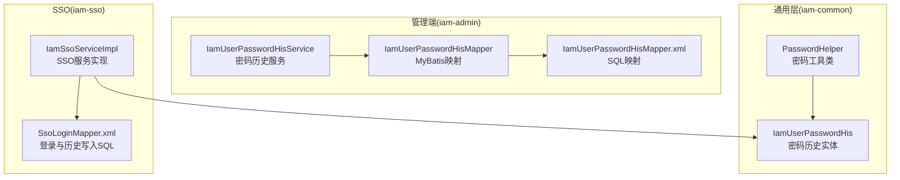
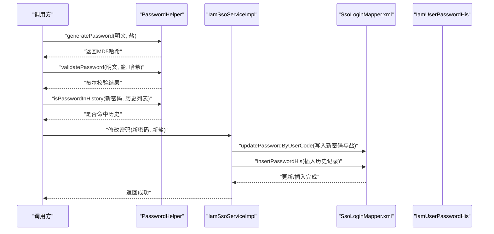
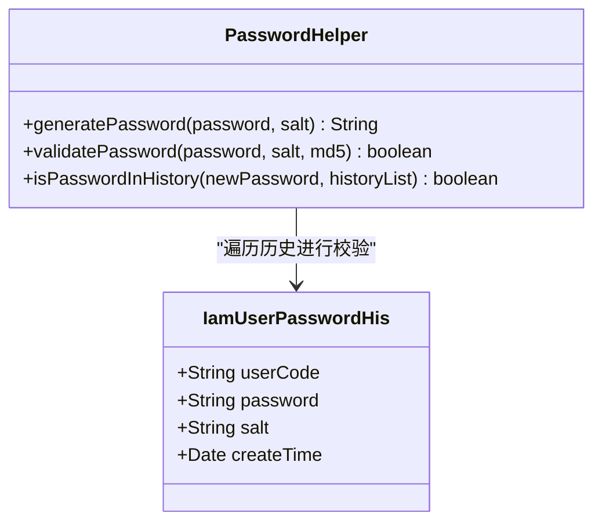
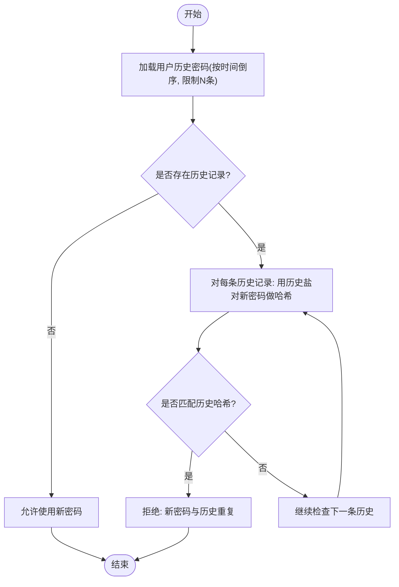
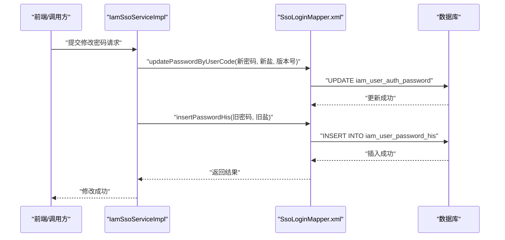
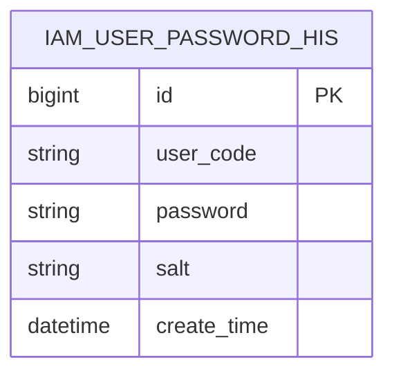
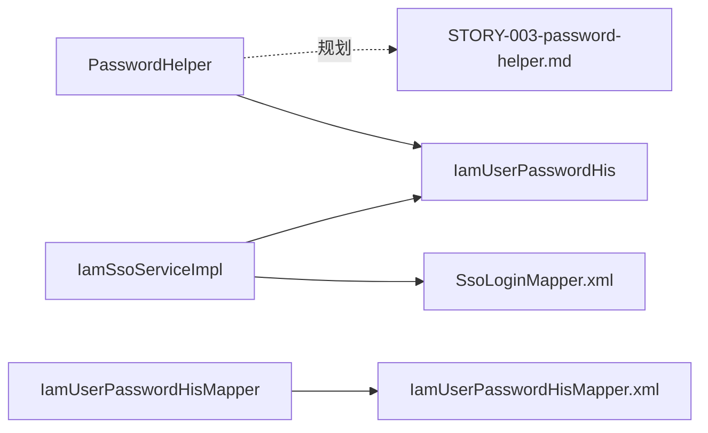

# 密码安全

<cite>
**本文引用的文件**
- [PasswordHelper.java](file://iam-common/src/main/java/com/wkclz/iam/common/helper/PasswordHelper.java)
- [IamUserPasswordHis.java](file://iam-common/src/main/java/com/wkclz/iam/common/entity/IamUserPasswordHis.java)
- [IamUserPasswordHisMapper.java](file://iam-admin/src/main/java/com/wkclz/iam/admin/mapper/IamUserPasswordHisMapper.java)
- [IamUserPasswordHisMapper.xml](file://iam-admin/src/main/resources/mapper/IamUserPasswordHisMapper.xml)
- [SsoLoginMapper.xml](file://iam-sso/src/main/resources/mapper/SsoLoginMapper.xml)
- [IamUserPasswordHisService.java](file://iam-admin/src/main/java/com/wkclz/iam/admin/service/IamUserPasswordHisService.java)
- [IamSsoServiceImpl.java](file://iam-sso/src/main/java/com/wkclz/iam/sso/service/IamSsoServiceImpl.java)
- [STORY-003-password-helper.md](file://docs/stories/STORY-003-password-helper.md)
</cite>

## 目录
1. [简介](#简介)
2. [项目结构](#项目结构)
3. [核心组件](#核心组件)
4. [架构总览](#架构总览)
5. [详细组件分析](#详细组件分析)
6. [依赖关系分析](#依赖关系分析)
7. [性能考虑](#性能考虑)
8. [故障排除指南](#故障排除指南)
9. [结论](#结论)
10. [附录](#附录)

## 简介
本文件面向SH-IAM系统的密码安全子系统，围绕密码加密算法选择与实现、盐值生成、哈希计算、密码强度验证、PasswordHelper的密码处理机制（加密、校验与历史校验）、密码历史记录与重复使用限制、密码过期策略等主题，提供系统化技术文档。同时给出配置指南、最佳实践与常见问题排查方法，帮助开发者与运维人员正确部署与维护密码安全体系。

## 项目结构
密码安全相关代码主要分布在以下模块与包中：
- iam-common：通用实体与工具类，包含密码历史实体与密码工具类
- iam-admin：管理端服务与持久层，负责密码历史查询与维护
- iam-sso：单点登录服务，负责登录流程中的密码更新与历史记录插入
- docs：需求与设计文档，包含PasswordHelper的演进规划与双算法兼容策略

**图表来源**
- [PasswordHelper.java:10-49](file://iam-common/src/main/java/com/wkclz/iam/common/helper/PasswordHelper.java#L10-L49)
- [IamUserPasswordHis.java](file://iam-common/src/main/java/com/wkclz/iam/common/entity/IamUserPasswordHis.java)
- [IamUserPasswordHisMapper.java:10-21](file://iam-admin/src/main/java/com/wkclz/iam/admin/mapper/IamUserPasswordHisMapper.java#L10-L21)
- [IamUserPasswordHisMapper.xml:12-23](file://iam-admin/src/main/resources/mapper/IamUserPasswordHisMapper.xml#L12-L23)
- [SsoLoginMapper.xml:79-102](file://iam-sso/src/main/resources/mapper/SsoLoginMapper.xml#L79-L102)
- [IamUserPasswordHisService.java](file://iam-admin/src/main/java/com/wkclz/iam/admin/service/IamUserPasswordHisService.java)

**章节来源**
- [PasswordHelper.java:10-49](file://iam-common/src/main/java/com/wkclz/iam/common/helper/PasswordHelper.java#L10-L49)
- [IamUserPasswordHis.java](file://iam-common/src/main/java/com/wkclz/iam/common/entity/IamUserPasswordHis.java)
- [IamUserPasswordHisMapper.java:10-21](file://iam-admin/src/main/java/com/wkclz/iam/admin/mapper/IamUserPasswordHisMapper.java#L10-L21)
- [IamUserPasswordHisMapper.xml:12-23](file://iam-admin/src/main/resources/mapper/IamUserPasswordHisMapper.xml#L12-L23)
- [SsoLoginMapper.xml:79-102](file://iam-sso/src/main/resources/mapper/SsoLoginMapper.xml#L79-L102)

## 核心组件
- PasswordHelper：提供基于MD5+salt的密码加密与校验能力；支持密码历史重复校验；当前未包含BCrypt实现，但需求文档中规划了双算法兼容与平滑升级路径。
- IamUserPasswordHis：密码历史实体，记录用户历史密码与对应盐值，用于防止重复使用。
- IamUserPasswordHisMapper/Xml：提供按用户编码查询历史密码列表的能力，支持限制返回条数。
- IamSsoServiceImpl + SsoLoginMapper.xml：在用户修改密码时，执行密码更新与历史记录插入，确保历史表同步。

**章节来源**
- [PasswordHelper.java:10-49](file://iam-common/src/main/java/com/wkclz/iam/common/helper/PasswordHelper.java#L10-L49)
- [IamUserPasswordHis.java](file://iam-common/src/main/java/com/wkclz/iam/common/entity/IamUserPasswordHis.java)
- [IamUserPasswordHisMapper.java:10-21](file://iam-admin/src/main/java/com/wkclz/iam/admin/mapper/IamUserPasswordHisMapper.java#L10-L21)
- [IamUserPasswordHisMapper.xml:12-23](file://iam-admin/src/main/resources/mapper/IamUserPasswordHisMapper.xml#L12-L23)
- [SsoLoginMapper.xml:79-102](file://iam-sso/src/main/resources/mapper/SsoLoginMapper.xml#L79-L102)

## 架构总览
密码安全流程涉及“密码生成/校验”、“历史重复校验”、“历史记录写入”三个关键环节。下图展示了从调用到数据库落库的整体交互：

**图表来源**
- [PasswordHelper.java:13-46](file://iam-common/src/main/java/com/wkclz/iam/common/helper/PasswordHelper.java#L13-L46)
- [SsoLoginMapper.xml:79-102](file://iam-sso/src/main/resources/mapper/SsoLoginMapper.xml#L79-L102)

## 详细组件分析

### PasswordHelper 组件分析
PasswordHelper当前实现采用“明文+盐”的MD5哈希方案，提供三类核心能力：
- 密码加密：generatePassword(明文, 盐) → 返回MD5哈希
- 密码校验：validatePassword(明文, 盐, 哈希) → 布尔匹配
- 历史重复校验：isPasswordInHistory(新密码, 历史列表) → 若历史中存在相同(明文+盐)哈希则拒绝

**图表来源**
- [PasswordHelper.java:10-49](file://iam-common/src/main/java/com/wkclz/iam/common/helper/PasswordHelper.java#L10-L49)
- [IamUserPasswordHis.java](file://iam-common/src/main/java/com/wkclz/iam/common/entity/IamUserPasswordHis.java)

实现要点与复杂度：
- generatePassword/validatePassword均为O(1)，哈希计算常数时间
- isPasswordInHistory遍历历史列表，时间复杂度O(n)，n为历史条数上限
- 参数校验严格，空值抛出业务异常，避免无效输入

安全性现状与改进建议：
- 当前使用MD5+salt，满足基本不可逆与防彩虹表需求
- 文档规划引入BCrypt并提供自动识别与平滑升级路径，建议尽快落地以提升抗暴力破解能力

**章节来源**
- [PasswordHelper.java:13-46](file://iam-common/src/main/java/com/wkclz/iam/common/helper/PasswordHelper.java#L13-L46)
- [STORY-003-password-helper.md:15-34](file://docs/stories/STORY-003-password-helper.md#L15-L34)

### 密码历史记录与重复使用限制
密码历史记录用于防止用户重复使用近期历史密码，核心流程如下：
- 查询历史：按用户编码倒序查询最近N条历史记录
- 重复校验：对新密码使用历史盐值进行哈希对比，若命中则拒绝
- 写入历史：每次成功修改密码后，将旧密码与盐值写入历史表

**图表来源**
- [IamUserPasswordHisMapper.xml:12-23](file://iam-admin/src/main/resources/mapper/IamUserPasswordHisMapper.xml#L12-L23)
- [PasswordHelper.java:36-46](file://iam-common/src/main/java/com/wkclz/iam/common/helper/PasswordHelper.java#L36-L46)

**章节来源**
- [IamUserPasswordHisMapper.java:15-18](file://iam-admin/src/main/java/com/wkclz/iam/admin/mapper/IamUserPasswordHisMapper.java#L15-L18)
- [IamUserPasswordHisMapper.xml:12-23](file://iam-admin/src/main/resources/mapper/IamUserPasswordHisMapper.xml#L12-L23)
- [PasswordHelper.java:36-46](file://iam-common/src/main/java/com/wkclz/iam/common/helper/PasswordHelper.java#L36-L46)

### 密码修改与历史写入流程
当用户修改密码时，SSO服务会执行两步操作：
- 更新用户认证密码字段（新密码与新盐），并递增版本号
- 插入历史记录（旧密码与旧盐）

**图表来源**
- [SsoLoginMapper.xml:79-102](file://iam-sso/src/main/resources/mapper/SsoLoginMapper.xml#L79-L102)
- [IamSsoServiceImpl.java](file://iam-sso/src/main/java/com/wkclz/iam/sso/service/IamSsoServiceImpl.java)

**章节来源**
- [SsoLoginMapper.xml:79-102](file://iam-sso/src/main/resources/mapper/SsoLoginMapper.xml#L79-L102)

### 数据模型
密码历史表结构要点：
- 字段：用户标识、密码哈希、盐值、创建时间等
- 查询：按用户编码过滤，按主键倒序，限制返回数量

**图表来源**
- [IamUserPasswordHisMapper.xml:12-23](file://iam-admin/src/main/resources/mapper/IamUserPasswordHisMapper.xml#L12-L23)

**章节来源**
- [IamUserPasswordHis.java](file://iam-common/src/main/java/com/wkclz/iam/common/entity/IamUserPasswordHis.java)
- [IamUserPasswordHisMapper.xml:12-23](file://iam-admin/src/main/resources/mapper/IamUserPasswordHisMapper.xml#L12-L23)

## 依赖关系分析
- PasswordHelper依赖IamUserPasswordHis实体进行历史密码校验
- IamUserPasswordHisMapper提供历史查询能力，受限于SQL中的LIMIT参数
- IamSsoServiceImpl在密码修改流程中调用SsoLoginMapper.xml执行更新与插入
- 文档层面规划PasswordHelper引入BCrypt并提供自动识别与升级逻辑

**图表来源**
- [PasswordHelper.java:10-49](file://iam-common/src/main/java/com/wkclz/iam/common/helper/PasswordHelper.java#L10-L49)
- [IamUserPasswordHis.java](file://iam-common/src/main/java/com/wkclz/iam/common/entity/IamUserPasswordHis.java)
- [IamUserPasswordHisMapper.java:10-21](file://iam-admin/src/main/java/com/wkclz/iam/admin/mapper/IamUserPasswordHisMapper.java#L10-L21)
- [IamUserPasswordHisMapper.xml:12-23](file://iam-admin/src/main/resources/mapper/IamUserPasswordHisMapper.xml#L12-L23)
- [SsoLoginMapper.xml:79-102](file://iam-sso/src/main/resources/mapper/SsoLoginMapper.xml#L79-L102)
- [STORY-003-password-helper.md:15-34](file://docs/stories/STORY-003-password-helper.md#L15-L34)

**章节来源**
- [STORY-003-password-helper.md:15-34](file://docs/stories/STORY-003-password-helper.md#L15-L34)

## 性能考虑
- 历史查询限制：通过LIMIT控制历史记录数量，避免全表扫描与高延迟
- 哈希计算：MD5为常数时间复杂度；如迁移到BCrypt，需关注计算成本与并发场景下的CPU占用
- 并发更新：密码修改采用乐观锁（版本号递增）减少冲突概率
- 缓存策略：可对热点用户的最近历史记录进行缓存，降低数据库压力

## 故障排除指南
常见问题与定位步骤：
- 密码校验失败
  - 检查传入参数是否为空（明文、盐、哈希）
  - 确认历史盐值与当前存储一致
  - 参考：[PasswordHelper.java:23-34](file://iam-common/src/main/java/com/wkclz/iam/common/helper/PasswordHelper.java#L23-L34)
- 无法查询历史记录
  - 检查用户编码是否正确
  - 确认LIMIT参数是否过大导致性能问题
  - 参考：[IamUserPasswordHisMapper.xml:12-23](file://iam-admin/src/main/resources/mapper/IamUserPasswordHisMapper.xml#L12-L23)
- 修改密码后历史未写入
  - 确认更新与插入顺序与事务一致性
  - 检查版本号是否正确传递
  - 参考：[SsoLoginMapper.xml:79-102](file://iam-sso/src/main/resources/mapper/SsoLoginMapper.xml#L79-L102)
- 重复使用历史密码被拒绝
  - 检查历史记录是否正确入库
  - 确认校验逻辑使用的是最新历史条目
  - 参考：[PasswordHelper.java:36-46](file://iam-common/src/main/java/com/wkclz/iam/common/helper/PasswordHelper.java#L36-L46)

**章节来源**
- [PasswordHelper.java:13-46](file://iam-common/src/main/java/com/wkclz/iam/common/helper/PasswordHelper.java#L13-L46)
- [IamUserPasswordHisMapper.xml:12-23](file://iam-admin/src/main/resources/mapper/IamUserPasswordHisMapper.xml#L12-L23)
- [SsoLoginMapper.xml:79-102](file://iam-sso/src/main/resources/mapper/SsoLoginMapper.xml#L79-L102)

## 结论
当前SH-IAM密码安全体系以MD5+salt为核心，结合密码历史记录实现了重复使用限制与基本的安全保障。建议尽快按需求文档规划落地BCrypt方案，完善自动识别与平滑升级机制，进一步提升抗攻击能力。同时优化历史查询与并发更新策略，确保在高并发场景下的稳定性与性能。

## 附录

### 密码安全配置指南
- 历史记录保留数量：根据合规要求设置LIMIT上限，平衡安全与性能
- 盐值生成：使用强随机源生成，长度不小于16字节，保证唯一性
- 密码强度：建议引入最小长度、字符类型多样性等规则（当前实现未包含，可在上层校验流程补充）
- 过期策略：建议在用户实体或配置中心增加密码有效期字段，结合登录流程进行到期提醒与强制重置

### 最佳实践建议
- 优先采用BCrypt替代MD5+salt，必要时提供自动升级通道
- 对历史记录查询加缓存，减少数据库压力
- 在密码修改接口中统一调用PasswordHelper与历史写入流程
- 记录密码变更审计日志，便于追踪与溯源