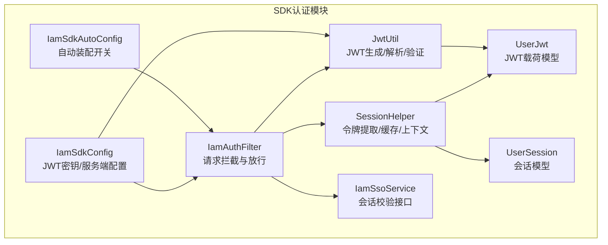
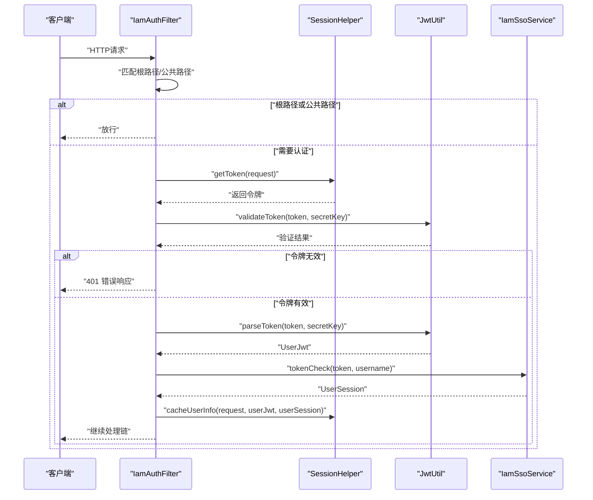
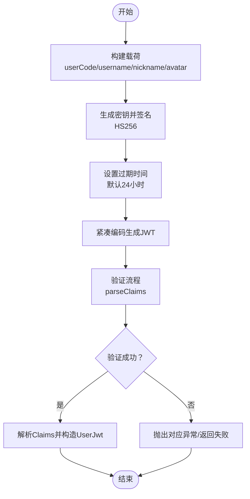
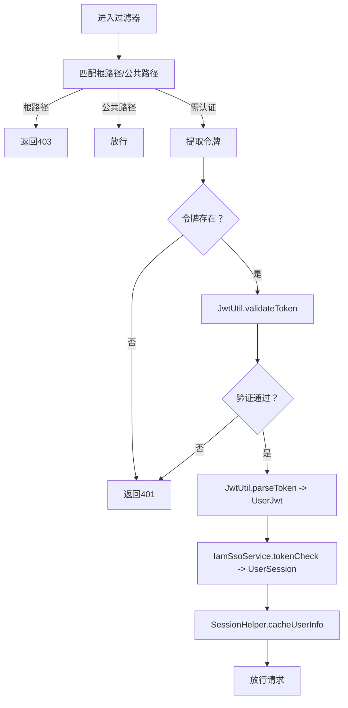
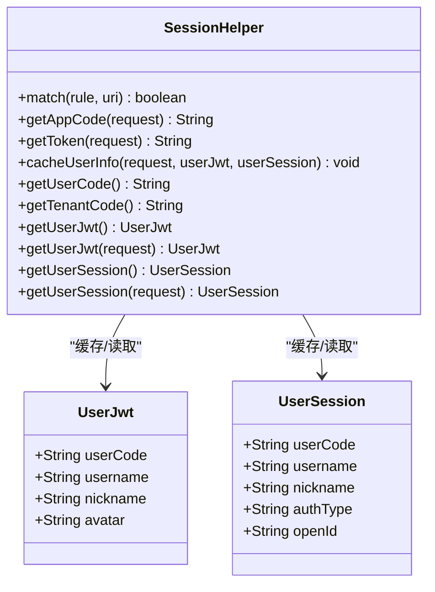
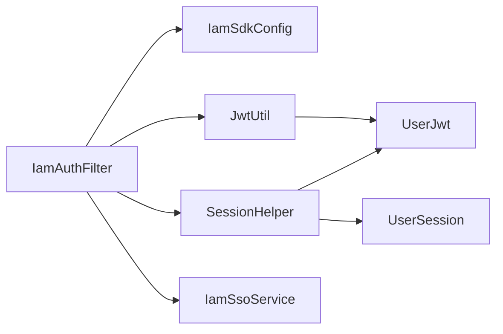

# 认证机制

<cite>
**本文引用的文件**
- [IamAuthFilter.java](file://iam-sdk/src/main/java/com/wkclz/iam/sdk/filter/IamAuthFilter.java)
- [SessionHelper.java](file://iam-sdk/src/main/java/com/wkclz/iam/sdk/helper/SessionHelper.java)
- [JwtUtil.java](file://iam-sdk/src/main/java/com/wkclz/iam/sdk/util/JwtUtil.java)
- [UserJwt.java](file://iam-sdk/src/main/java/com/wkclz/iam/sdk/model/UserJwt.java)
- [UserSession.java](file://iam-sdk/src/main/java/com/wkclz/iam/sdk/model/UserSession.java)
- [IamSdkConfig.java](file://iam-sdk/src/main/java/com/wkclz/iam/sdk/config/IamSdkConfig.java)
- [IamSsoService.java](file://iam-sdk/src/main/java/com/wkclz/iam/sdk/service/IamSsoService.java)
- [IamSdkAutoConfig.java](file://iam-sdk/src/main/java/com/wkclz/iam/sdk/IamSdkAutoConfig.java)
- [application.yml（SSO启动器）](file://iam-sso-starter/src/main/resources/config/application.yml)
</cite>

## 目录
1. [引言](#引言)
2. [项目结构](#项目结构)
3. [核心组件](#核心组件)
4. [架构总览](#架构总览)
5. [组件详解](#组件详解)
6. [依赖关系分析](#依赖关系分析)
7. [性能与安全考量](#性能与安全考量)
8. [故障排查指南](#故障排查指南)
9. [结论](#结论)
10. [附录：配置参数说明](#附录配置参数说明)

## 引言
本文件面向SH-IAM的认证机制，系统性阐述JWT令牌的生成、验证与解析流程；深入说明IamAuthFilter认证过滤器的请求拦截、令牌提取、JWT校验与会话检查工作原理；解释SessionHelper的会话管理机制，包括用户信息缓存与上下文传递；并提供认证流程图、配置参数说明及常见问题排查方法，帮助开发者快速理解与维护认证体系。

## 项目结构
围绕认证相关的关键模块位于iam-sdk子工程，主要包含：
- 过滤器层：IamAuthFilter负责拦截HTTP请求并进行认证
- 工具层：JwtUtil封装JWT生成、解析、验证与刷新
- 辅助层：SessionHelper负责令牌提取、用户信息缓存与上下文传递
- 模型层：UserJwt与UserSession承载JWT载荷与会话信息
- 配置层：IamSdkConfig提供JWT密钥、服务端地址等配置项
- 自动装配：IamSdkAutoConfig启用SDK自动装配
- 服务接口：IamSsoService定义会话校验能力（由SSO侧实现）

图表来源
- [IamAuthFilter.java:30-71](file://iam-sdk/src/main/java/com/wkclz/iam/sdk/filter/IamAuthFilter.java#L30-L71)
- [JwtUtil.java:39-64](file://iam-sdk/src/main/java/com/wkclz/iam/sdk/util/JwtUtil.java#L39-L64)
- [SessionHelper.java:29-53](file://iam-sdk/src/main/java/com/wkclz/iam/sdk/helper/SessionHelper.java#L29-L53)
- [UserJwt.java:12-22](file://iam-sdk/src/main/java/com/wkclz/iam/sdk/model/UserJwt.java#L12-L22)
- [UserSession.java:11-21](file://iam-sdk/src/main/java/com/wkclz/iam/sdk/model/UserSession.java#L11-L21)
- [IamSdkConfig.java:16-58](file://iam-sdk/src/main/java/com/wkclz/iam/sdk/config/IamSdkConfig.java#L16-L58)
- [IamSdkAutoConfig.java:7-11](file://iam-sdk/src/main/java/com/wkclz/iam/sdk/IamSdkAutoConfig.java#L7-L11)

章节来源
- [IamAuthFilter.java:1-73](file://iam-sdk/src/main/java/com/wkclz/iam/sdk/filter/IamAuthFilter.java#L1-73)
- [JwtUtil.java:1-238](file://iam-sdk/src/main/java/com/wkclz/iam/sdk/util/JwtUtil.java#L1-238)
- [SessionHelper.java:1-82](file://iam-sdk/src/main/java/com/wkclz/iam/sdk/helper/SessionHelper.java#L1-82)
- [UserJwt.java:1-24](file://iam-sdk/src/main/java/com/wkclz/iam/sdk/model/UserJwt.java#L1-24)
- [UserSession.java:1-22](file://iam-sdk/src/main/java/com/wkclz/iam/sdk/model/UserSession.java#L1-22)
- [IamSdkConfig.java:1-62](file://iam-sdk/src/main/java/com/wkclz/iam/sdk/config/IamSdkConfig.java#L1-62)
- [IamSdkAutoConfig.java:1-14](file://iam-sdk/src/main/java/com/wkclz/iam/sdk/IamSdkAutoConfig.java#L1-14)

## 核心组件
- IamAuthFilter：基于Spring OncePerRequestFilter实现的认证过滤器，负责拦截请求、提取令牌、验证JWT、调用会话校验并将用户信息注入请求上下文。
- JwtUtil：基于JJWT实现的JWT工具类，提供生成、解析、验证、过期判断、刷新等能力，并内置HS256签名算法与固定有效期策略。
- SessionHelper：提供令牌提取、路径匹配、用户信息缓存到请求属性与全局上下文、以及从上下文读取用户信息的能力。
- UserJwt：JWT载荷载体，包含用户编码、用户名、昵称、头像等字段。
- UserSession：会话级信息载体，包含用户标识、认证类型、小程序openId等。
- IamSdkConfig：SDK配置类，提供JWT密钥、服务端URL、应用ID/Secret、静态资源开关等配置项。
- IamSsoService：会话校验接口，供过滤器调用以确认令牌在SSO侧仍有效。
- IamSdkAutoConfig：自动装配入口，通过条件注解启用SDK组件扫描与加载。

章节来源
- [IamAuthFilter.java:22-71](file://iam-sdk/src/main/java/com/wkclz/iam/sdk/filter/IamAuthFilter.java#L22-L71)
- [JwtUtil.java:15-237](file://iam-sdk/src/main/java/com/wkclz/iam/sdk/util/JwtUtil.java#L15-L237)
- [SessionHelper.java:13-81](file://iam-sdk/src/main/java/com/wkclz/iam/sdk/helper/SessionHelper.java#L13-L81)
- [UserJwt.java:11-23](file://iam-sdk/src/main/java/com/wkclz/iam/sdk/model/UserJwt.java#L11-L23)
- [UserSession.java:10-21](file://iam-sdk/src/main/java/com/wkclz/iam/sdk/model/UserSession.java#L10-L21)
- [IamSdkConfig.java:14-61](file://iam-sdk/src/main/java/com/wkclz/iam/sdk/config/IamSdkConfig.java#L14-L61)
- [IamSsoService.java:5-9](file://iam-sdk/src/main/java/com/wkclz/iam/sdk/service/IamSsoService.java#L5-L9)
- [IamSdkAutoConfig.java:7-11](file://iam-sdk/src/main/java/com/wkclz/iam/sdk/IamSdkAutoConfig.java#L7-L11)

## 架构总览
下图展示了认证过滤器在请求生命周期中的作用，以及与JWT工具、会话辅助类、SSO服务接口的交互关系。

图表来源
- [IamAuthFilter.java:30-71](file://iam-sdk/src/main/java/com/wkclz/iam/sdk/filter/IamAuthFilter.java#L30-L71)
- [SessionHelper.java:29-53](file://iam-sdk/src/main/java/com/wkclz/iam/sdk/helper/SessionHelper.java#L29-L53)
- [JwtUtil.java:114-121](file://iam-sdk/src/main/java/com/wkclz/iam/sdk/util/JwtUtil.java#L114-L121)
- [IamSsoService.java:7-7](file://iam-sdk/src/main/java/com/wkclz/iam/sdk/service/IamSsoService.java#L7-L7)

## 组件详解

### JWT令牌生成、验证与解析
- 生成流程
  - 使用UserJwt作为载荷，填充用户编码、用户名、昵称、头像等字段
  - 采用HS256签名算法，基于UTF-8字节的密钥生成SecretKey
  - 默认有效期为24小时（可通过重载方法传入自定义过期时间）
  - 签发时间略早于当前时间以规避边界误差
- 验证流程
  - 通过parseClaims对签名进行验证与解析
  - 捕获过期、格式错误、不支持、签名错误、参数错误等异常并转换为布尔结果
- 解析流程
  - 从Claims中提取用户字段构造UserJwt对象
- 过期与刷新
  - 提供isExpired判断与refreshToken刷新能力，支持按默认或自定义过期时间刷新

图表来源
- [JwtUtil.java:39-64](file://iam-sdk/src/main/java/com/wkclz/iam/sdk/util/JwtUtil.java#L39-L64)
- [JwtUtil.java:88-107](file://iam-sdk/src/main/java/com/wkclz/iam/sdk/util/JwtUtil.java#L88-L107)
- [JwtUtil.java:114-137](file://iam-sdk/src/main/java/com/wkclz/iam/sdk/util/JwtUtil.java#L114-L137)

章节来源
- [JwtUtil.java:15-237](file://iam-sdk/src/main/java/com/wkclz/iam/sdk/util/JwtUtil.java#L15-L237)
- [UserJwt.java:11-23](file://iam-sdk/src/main/java/com/wkclz/iam/sdk/model/UserJwt.java#L11-L23)

### IamAuthFilter认证过滤器
- 请求拦截与放行
  - 对根路径直接拒绝访问
  - 匹配公共路径规则后直接放行
- 令牌提取
  - 优先从Authorization头读取，若为空则尝试token头
  - 支持Bearer前缀自动剥离
- JWT验证
  - 使用配置的密钥调用JwtUtil.validateToken进行验证
- 会话检查与上下文注入
  - 解析UserJwt后，调用IamSsoService.tokenCheck进行会话校验
  - 通过SessionHelper将UserJwt与UserSession写入请求属性，并同步到全局UserContext

图表来源
- [IamAuthFilter.java:30-71](file://iam-sdk/src/main/java/com/wkclz/iam/sdk/filter/IamAuthFilter.java#L30-L71)
- [SessionHelper.java:29-53](file://iam-sdk/src/main/java/com/wkclz/iam/sdk/helper/SessionHelper.java#L29-L53)
- [JwtUtil.java:114-121](file://iam-sdk/src/main/java/com/wkclz/iam/sdk/util/JwtUtil.java#L114-L121)
- [IamSsoService.java:7-7](file://iam-sdk/src/main/java/com/wkclz/iam/sdk/service/IamSsoService.java#L7-L7)

章节来源
- [IamAuthFilter.java:22-71](file://iam-sdk/src/main/java/com/wkclz/iam/sdk/filter/IamAuthFilter.java#L22-L71)
- [SessionHelper.java:13-81](file://iam-sdk/src/main/java/com/wkclz/iam/sdk/helper/SessionHelper.java#L13-L81)
- [IamSsoService.java:5-9](file://iam-sdk/src/main/java/com/wkclz/iam/sdk/service/IamSsoService.java#L5-L9)

### SessionHelper会话管理机制
- 令牌提取
  - 从请求头Authorization或token中读取，并去除Bearer前缀
- 路径匹配
  - 基于Ant风格规则匹配公共路径
- 用户信息缓存与上下文传递
  - 将UserJwt与UserSession写入请求属性
  - 构造UserInfo并写入全局UserContext，便于业务层统一读取
- 上下文读取
  - 提供便捷方法从当前请求上下文中读取UserJwt与UserSession

图表来源
- [SessionHelper.java:13-81](file://iam-sdk/src/main/java/com/wkclz/iam/sdk/helper/SessionHelper.java#L13-L81)
- [UserJwt.java:11-23](file://iam-sdk/src/main/java/com/wkclz/iam/sdk/model/UserJwt.java#L11-L23)
- [UserSession.java:10-21](file://iam-sdk/src/main/java/com/wkclz/iam/sdk/model/UserSession.java#L10-L21)

章节来源
- [SessionHelper.java:13-81](file://iam-sdk/src/main/java/com/wkclz/iam/sdk/helper/SessionHelper.java#L13-L81)
- [UserJwt.java:11-23](file://iam-sdk/src/main/java/com/wkclz/iam/sdk/model/UserJwt.java#L11-L23)
- [UserSession.java:10-21](file://iam-sdk/src/main/java/com/wkclz/iam/sdk/model/UserSession.java#L10-L21)

### 配置与自动装配
- IamSdkAutoConfig
  - 通过条件注解启用组件扫描，默认开启
- IamSdkConfig
  - 提供JWT密钥、服务端URL、应用ID/Secret、静态资源开关等配置
  - 建议在生产环境覆盖默认密钥，避免硬编码

章节来源
- [IamSdkAutoConfig.java:7-11](file://iam-sdk/src/main/java/com/wkclz/iam/sdk/IamSdkAutoConfig.java#L7-L11)
- [IamSdkConfig.java:14-61](file://iam-sdk/src/main/java/com/wkclz/iam/sdk/config/IamSdkConfig.java#L14-L61)

## 依赖关系分析
- 组件耦合
  - IamAuthFilter依赖IamSdkConfig（密钥）、JwtUtil（生成/验证）、SessionHelper（令牌提取/缓存）、IamSsoService（会话校验）
  - SessionHelper依赖UserJwt、UserSession与Web上下文
  - JwtUtil依赖JJWT库与UserJwt
- 外部集成点
  - IamSsoService为接口，具体实现由SSO侧提供
  - 应用通过IamSdkConfig配置服务端URL与鉴权参数

图表来源
- [IamAuthFilter.java:25-28](file://iam-sdk/src/main/java/com/wkclz/iam/sdk/filter/IamAuthFilter.java#L25-L28)
- [IamSdkConfig.java:22-47](file://iam-sdk/src/main/java/com/wkclz/iam/sdk/config/IamSdkConfig.java#L22-L47)
- [JwtUtil.java:39-64](file://iam-sdk/src/main/java/com/wkclz/iam/sdk/util/JwtUtil.java#L39-L64)
- [SessionHelper.java:42-53](file://iam-sdk/src/main/java/com/wkclz/iam/sdk/helper/SessionHelper.java#L42-L53)
- [IamSsoService.java:5-9](file://iam-sdk/src/main/java/com/wkclz/iam/sdk/service/IamSsoService.java#L5-L9)

章节来源
- [IamAuthFilter.java:22-71](file://iam-sdk/src/main/java/com/wkclz/iam/sdk/filter/IamAuthFilter.java#L22-L71)
- [IamSdkConfig.java:14-61](file://iam-sdk/src/main/java/com/wkclz/iam/sdk/config/IamSdkConfig.java#L14-L61)
- [JwtUtil.java:15-237](file://iam-sdk/src/main/java/com/wkclz/iam/sdk/util/JwtUtil.java#L15-L237)
- [SessionHelper.java:13-81](file://iam-sdk/src/main/java/com/wkclz/iam/sdk/helper/SessionHelper.java#L13-L81)
- [IamSsoService.java:5-9](file://iam-sdk/src/main/java/com/wkclz/iam/sdk/service/IamSsoService.java#L5-L9)

## 性能与安全考量
- 性能
  - 过滤器每请求仅执行一次，开销主要来自JWT解析与一次远程会话校验
  - 建议在网关层或上游服务复用会话校验结果，减少重复调用
- 安全
  - JWT密钥必须在生产环境覆盖默认值，建议通过环境变量或密钥管理服务注入
  - 令牌有效期默认24小时，应结合业务场景评估是否缩短或支持动态刷新
  - 建议在传输层启用TLS，防止令牌被窃听
- 可靠性
  - 会话校验失败时立即返回401，避免继续处理
  - 对异常情况进行明确分类与日志记录，便于定位问题

[本节为通用指导，无需列出章节来源]

## 故障排查指南
- 常见错误与定位
  - 403 根路径被拒绝：检查请求URI是否为“/”
  - 401 令牌不存在：确认请求头Authorization或token是否正确携带，Bearer前缀是否正确
  - 401 无效令牌：核对JWT密钥是否与签发一致，检查签名算法与过期时间
  - 401 令牌验证失败：查看会话校验接口返回，确认SSO侧会话状态
- 排查步骤
  - 检查IamSdkConfig中的jwtSecretKey是否覆盖默认值
  - 在IamAuthFilter处打印token与验证结果，确认parseToken与validateToken行为
  - 校验IamSsoService.tokenCheck是否正常返回UserSession
  - 关注JwtUtil的异常分支，区分过期、格式错误、签名错误等场景
- 日志与监控
  - 结合SSO启动器的application.yml中暴露的健康与指标端点，观察服务可用性
  - 在过滤器与会话校验处增加结构化日志，便于追踪用户维度的认证轨迹

章节来源
- [IamAuthFilter.java:30-71](file://iam-sdk/src/main/java/com/wkclz/iam/sdk/filter/IamAuthFilter.java#L30-L71)
- [IamSdkConfig.java:22-29](file://iam-sdk/src/main/java/com/wkclz/iam/sdk/config/IamSdkConfig.java#L22-L29)
- [application.yml（SSO启动器）:28-52](file://iam-sso-starter/src/main/resources/config/application.yml#L28-L52)

## 结论
SH-IAM的认证机制以JWT为核心，结合IamAuthFilter的请求拦截、SessionHelper的上下文传递与IamSsoService的会话校验，形成一套清晰、可扩展的认证链路。通过合理配置JWT密钥与有效期、完善异常处理与日志记录，可在保证安全性的同时提升系统的可观测性与可维护性。

[本节为总结性内容，无需列出章节来源]

## 附录：配置参数说明
- sdk启用开关
  - sh.iam.sdk.enabled=true（默认启用）
- SDK基础配置
  - iam.sdk.enabled=true（SDK启用）
  - iam.sdk.app-code=（应用标识）
  - iam.sdk.jwt.secret-key=（JWT密钥，生产必须覆盖）
  - iam.sdk.static.enabled=false（静态资源开关）
  - iam.sdk.static.subfix=（静态资源后缀列表）
  - iam.sdk.server-url=（SSO服务端地址）
  - iam.sdk.app-id=default（应用ID）
  - iam.sdk.app-secret=default（应用密钥）

章节来源
- [IamSdkAutoConfig.java:7-11](file://iam-sdk/src/main/java/com/wkclz/iam/sdk/IamSdkAutoConfig.java#L7-L11)
- [IamSdkConfig.java:18-47](file://iam-sdk/src/main/java/com/wkclz/iam/sdk/config/IamSdkConfig.java#L18-L47)