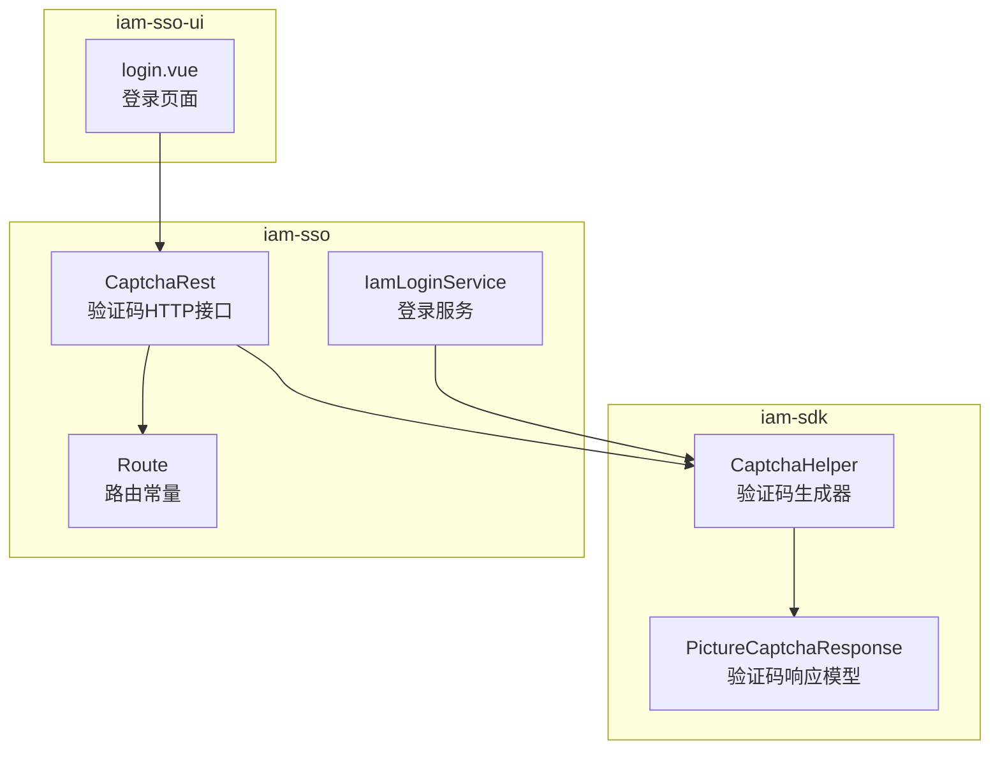
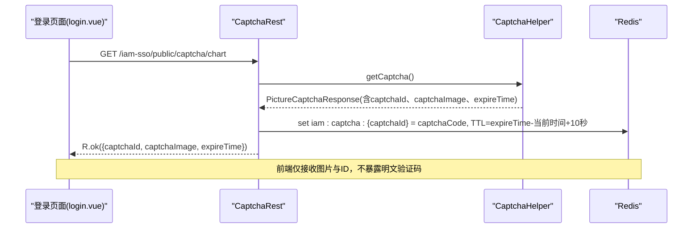
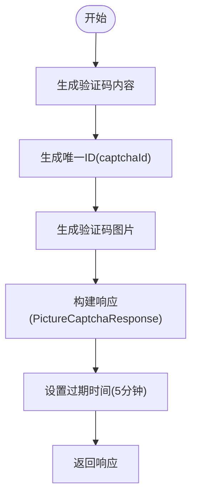
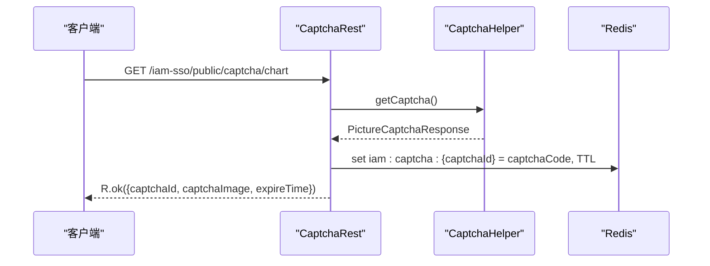
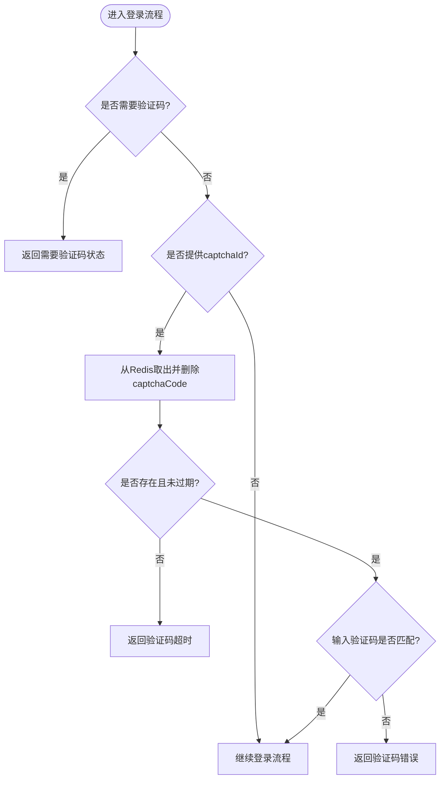
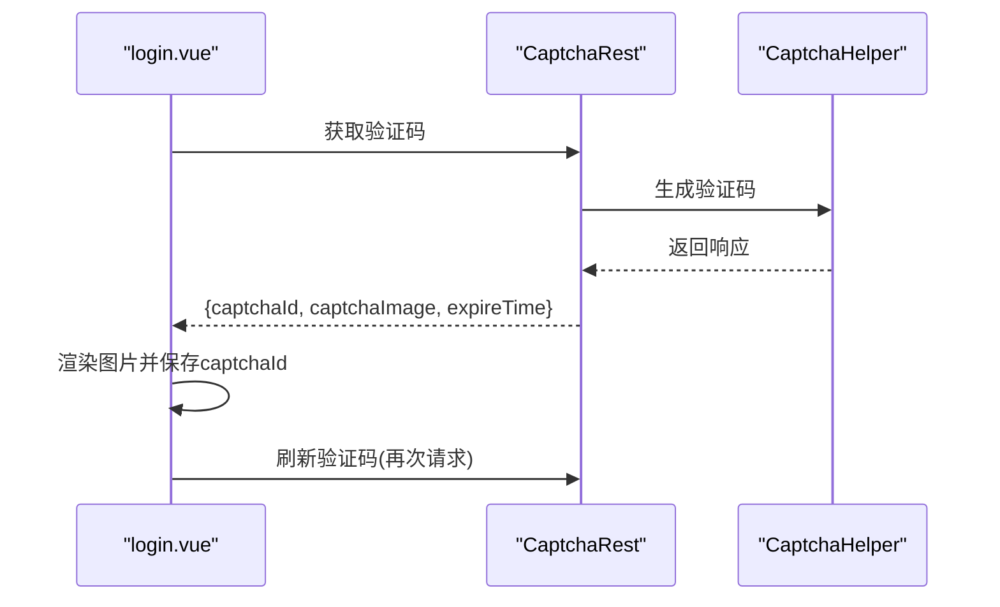
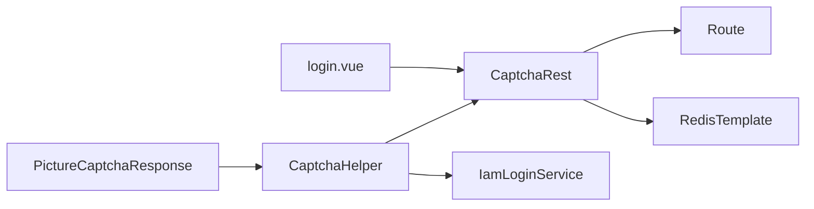

# 验证码系统

<cite>
**本文档引用的文件**
- [CaptchaHelper.java](file://iam-sdk/src/main/java/com/wkclz/iam/sdk/helper/CaptchaHelper.java)
- [PictureCaptchaResponse.java](file://iam-sdk/src/main/java/com/wkclz/iam/sdk/model/PictureCaptchaResponse.java)
- [CaptchaRest.java](file://iam-sso/src/main/java/com/wkclz/iam/sso/rest/CaptchaRest.java)
- [Route.java](file://iam-sso/src/main/java/com/wkclz/iam/sso/Route.java)
- [IamLoginService.java](file://iam-sso/src/main/java/com/wkclz/iam/sso/service/IamLoginService.java)
- [login.vue](file://iam-sso-ui/src/views/login.vue)
- [STORY-012-captcha-helper.md](file://docs/stories/STORY-012-captcha-helper.md)
- [STORY-016-captcha-rest.md](file://docs/stories/STORY-016-captcha-rest.md)
</cite>

## 目录
1. [简介](#简介)
2. [项目结构](#项目结构)
3. [核心组件](#核心组件)
4. [架构概览](#架构概览)
5. [详细组件分析](#详细组件分析)
6. [依赖关系分析](#依赖关系分析)
7. [性能考虑](#性能考虑)
8. [故障排查指南](#故障排查指南)
9. [结论](#结论)
10. [附录](#附录)

## 简介
本文件面向SH-IAM系统的验证码子系统，提供从底层生成机制到上层API接口的完整技术文档。重点覆盖以下方面：
- 图片验证码的生成机制：验证码内容生成、图形绘制与干扰元素添加
- CaptchaHelper的验证码处理流程：验证码存储、验证逻辑与过期控制
- CaptchaRest的API接口设计：验证码获取、验证与刷新机制
- 配置参数、安全策略与用户体验优化建议

## 项目结构
验证码系统涉及三个主要模块：
- iam-sdk：提供验证码生成工具类与数据模型
- iam-sso：提供验证码HTTP接口与登录服务集成
- iam-sso-ui：前端登录页面调用验证码接口并展示

**图表来源**
- [CaptchaHelper.java:15-167](file://iam-sdk/src/main/java/com/wkclz/iam/sdk/helper/CaptchaHelper.java#L15-L167)
- [PictureCaptchaResponse.java:11-19](file://iam-sdk/src/main/java/com/wkclz/iam/sdk/model/PictureCaptchaResponse.java#L11-L19)
- [CaptchaRest.java:15-38](file://iam-sso/src/main/java/com/wkclz/iam/sso/rest/CaptchaRest.java#L15-L38)
- [Route.java:6-63](file://iam-sso/src/main/java/com/wkclz/iam/sso/Route.java#L6-L63)
- [IamLoginService.java:97-122](file://iam-sso/src/main/java/com/wkclz/iam/sso/service/IamLoginService.java#L97-L122)
- [login.vue:101-114](file://iam-sso-ui/src/views/login.vue#L101-L114)

**章节来源**
- [CaptchaHelper.java:15-167](file://iam-sdk/src/main/java/com/wkclz/iam/sdk/helper/CaptchaHelper.java#L15-L167)
- [CaptchaRest.java:15-38](file://iam-sso/src/main/java/com/wkclz/iam/sso/rest/CaptchaRest.java#L15-L38)
- [Route.java:6-63](file://iam-sso/src/main/java/com/wkclz/iam/sso/Route.java#L6-L63)
- [login.vue:101-114](file://iam-sso-ui/src/views/login.vue#L101-L114)

## 核心组件
- CaptchaHelper：负责验证码内容生成、图片绘制与返回封装
- PictureCaptchaResponse：验证码响应数据模型
- CaptchaRest：提供验证码获取的HTTP接口
- Route：定义API路由前缀与端点
- IamLoginService：在登录流程中集成验证码验证
- login.vue：前端调用验证码接口并渲染图片

**章节来源**
- [CaptchaHelper.java:15-167](file://iam-sdk/src/main/java/com/wkclz/iam/sdk/helper/CaptchaHelper.java#L15-L167)
- [PictureCaptchaResponse.java:11-19](file://iam-sdk/src/main/java/com/wkclz/iam/sdk/model/PictureCaptchaResponse.java#L11-L19)
- [CaptchaRest.java:15-38](file://iam-sso/src/main/java/com/wkclz/iam/sso/rest/CaptchaRest.java#L15-L38)
- [Route.java:6-63](file://iam-sso/src/main/java/com/wkclz/iam/sso/Route.java#L6-L63)
- [IamLoginService.java:97-122](file://iam-sso/src/main/java/com/wkclz/iam/sso/service/IamLoginService.java#L97-L122)
- [login.vue:101-114](file://iam-sso-ui/src/views/login.vue#L101-L114)

## 架构概览
验证码系统采用“工具类生成 + HTTP接口暴露 + 登录服务集成”的分层架构：
- 工具层：CaptchaHelper独立生成验证码并返回带过期时间的响应
- 接口层：CaptchaRest将验证码存入Redis并返回不含明文的响应
- 业务层：IamLoginService在登录时校验验证码并在过期或错误时返回相应状态
- 表现层：login.vue调用接口获取验证码并展示

**图表来源**
- [CaptchaRest.java:22-37](file://iam-sso/src/main/java/com/wkclz/iam/sso/rest/CaptchaRest.java#L22-L37)
- [CaptchaHelper.java:31-47](file://iam-sdk/src/main/java/com/wkclz/iam/sdk/helper/CaptchaHelper.java#L31-L47)
- [Route.java:9-13](file://iam-sso/src/main/java/com/wkclz/iam/sso/Route.java#L9-L13)

## 详细组件分析

### CaptchaHelper：验证码生成与图形绘制
CaptchaHelper是验证码系统的核心工具类，负责：
- 验证码内容生成：固定长度、排除易混淆字符的字符集
- 图片生成：AWT绘制背景、干扰线、噪点与字符，最终Base64编码
- 过期时间计算：默认5分钟有效期
- Redis键命名：统一格式“iam:captcha:{captchaId}”

关键实现要点：
- 内容生成：固定长度与字符集确保可读性与安全性
- 图形绘制：包含干扰线与噪点，字符随机颜色与轻微旋转提升抗识别性
- 错误处理：图片写入异常统一抛出系统异常

**图表来源**
- [CaptchaHelper.java:31-47](file://iam-sdk/src/main/java/com/wkclz/iam/sdk/helper/CaptchaHelper.java#L31-L47)

**章节来源**
- [CaptchaHelper.java:17-28](file://iam-sdk/src/main/java/com/wkclz/iam/sdk/helper/CaptchaHelper.java#L17-L28)
- [CaptchaHelper.java:59-67](file://iam-sdk/src/main/java/com/wkclz/iam/sdk/helper/CaptchaHelper.java#L59-L67)
- [CaptchaHelper.java:74-97](file://iam-sdk/src/main/java/com/wkclz/iam/sdk/helper/CaptchaHelper.java#L74-L97)
- [CaptchaHelper.java:103-113](file://iam-sdk/src/main/java/com/wkclz/iam/sdk/helper/CaptchaHelper.java#L103-L113)
- [CaptchaHelper.java:119-128](file://iam-sdk/src/main/java/com/wkclz/iam/sdk/helper/CaptchaHelper.java#L119-L128)
- [CaptchaHelper.java:135-149](file://iam-sdk/src/main/java/com/wkclz/iam/sdk/helper/CaptchaHelper.java#L135-L149)
- [CaptchaHelper.java:156-164](file://iam-sdk/src/main/java/com/wkclz/iam/sdk/helper/CaptchaHelper.java#L156-L164)

### CaptchaRest：验证码HTTP接口
CaptchaRest提供验证码获取接口，职责包括：
- 调用CaptchaHelper生成验证码
- 将captchaId与captchaCode存入Redis，TTL基于expireTime计算
- 返回不含明文验证码的响应给前端

接口规范：
- 方法：GET
- 路由：/iam-sso/public/captcha/chart
- 响应：R.ok(data)，其中data包含captchaId、captchaImage、expireTime

**图表来源**
- [CaptchaRest.java:22-37](file://iam-sso/src/main/java/com/wkclz/iam/sso/rest/CaptchaRest.java#L22-L37)
- [Route.java](file://iam-sso/src/main/java/com/wkclz/iam/sso/Route.java#L13)

**章节来源**
- [CaptchaRest.java:15-38](file://iam-sso/src/main/java/com/wkclz/iam/sso/rest/CaptchaRest.java#L15-L38)
- [Route.java:6-13](file://iam-sso/src/main/java/com/wkclz/iam/sso/Route.java#L6-L13)

### 登录服务中的验证码验证流程
IamLoginService在登录过程中集成验证码验证：
- 当需要验证码时，返回“需要验证码”状态
- 若提交了captchaId与captchaCode，则从Redis取出并删除对应键
- 验证码不存在或已过期：返回“验证码超时”
- 验证码错误：返回“验证码错误”
- 验证通过后继续后续登录流程

**图表来源**
- [IamLoginService.java:97-122](file://iam-sso/src/main/java/com/wkclz/iam/sso/service/IamLoginService.java#L97-L122)

**章节来源**
- [IamLoginService.java:97-122](file://iam-sso/src/main/java/com/wkclz/iam/sso/service/IamLoginService.java#L97-L122)

### 前端调用与展示
前端登录页面通过调用验证码接口获取图片与ID，并在点击验证码图片时刷新。

**图表来源**
- [login.vue:109-114](file://iam-sso-ui/src/views/login.vue#L109-L114)
- [CaptchaRest.java:22-37](file://iam-sso/src/main/java/com/wkclz/iam/sso/rest/CaptchaRest.java#L22-L37)

**章节来源**
- [login.vue:101-114](file://iam-sso-ui/src/views/login.vue#L101-L114)

## 依赖关系分析
- CaptchaHelper依赖PictureCaptchaResponse进行数据封装
- CaptchaRest依赖CaptchaHelper生成验证码，并依赖RedisTemplate进行存储
- IamLoginService依赖CaptchaHelper的Redis键命名方法与验证码验证逻辑
- login.vue依赖CaptchaRest提供的接口

**图表来源**
- [PictureCaptchaResponse.java:11-19](file://iam-sdk/src/main/java/com/wkclz/iam/sdk/model/PictureCaptchaResponse.java#L11-L19)
- [CaptchaHelper.java:15-167](file://iam-sdk/src/main/java/com/wkclz/iam/sdk/helper/CaptchaHelper.java#L15-L167)
- [CaptchaRest.java:15-38](file://iam-sso/src/main/java/com/wkclz/iam/sso/rest/CaptchaRest.java#L15-L38)
- [Route.java:6-13](file://iam-sso/src/main/java/com/wkclz/iam/sso/Route.java#L6-L13)
- [IamLoginService.java:97-122](file://iam-sso/src/main/java/com/wkclz/iam/sso/service/IamLoginService.java#L97-L122)
- [login.vue:101-114](file://iam-sso-ui/src/views/login.vue#L101-L114)

**章节来源**
- [CaptchaHelper.java:15-167](file://iam-sdk/src/main/java/com/wkclz/iam/sdk/helper/CaptchaHelper.java#L15-L167)
- [CaptchaRest.java:15-38](file://iam-sso/src/main/java/com/wkclz/iam/sso/rest/CaptchaRest.java#L15-L38)
- [IamLoginService.java:97-122](file://iam-sso/src/main/java/com/wkclz/iam/sso/service/IamLoginService.java#L97-L122)

## 性能考虑
- 图片生成：使用AWT在内存中生成图片，适合高并发场景；建议在Redis中缓存验证码明文以减少重复生成
- Redis存储：验证码键设置TTL，避免长期占用内存；增加10秒缓冲时间以应对网络抖动
- 前端刷新：支持点击验证码图片刷新，降低用户等待时间
- 字符集与图形：字符集排除易混淆字符，提高识别率；干扰线与噪点提升抗机器识别能力

## 故障排查指南
常见问题与定位：
- 验证码无法显示：检查CaptchaRest接口是否正常返回，确认前端调用路径与路由一致
- 验证码过期：检查Redis中是否存在对应键，确认TTL计算逻辑与系统时间同步
- 验证码错误：确认输入大小写敏感性与去噪处理，检查Redis中验证码是否被提前消费
- 图片加载缓慢：检查Base64编码与前端渲染性能，必要时启用CDN或压缩

**章节来源**
- [CaptchaRest.java:22-37](file://iam-sso/src/main/java/com/wkclz/iam/sso/rest/CaptchaRest.java#L22-L37)
- [IamLoginService.java:97-122](file://iam-sso/src/main/java/com/wkclz/iam/sso/service/IamLoginService.java#L97-L122)

## 结论
SH-IAM验证码系统通过清晰的分层设计实现了高效、安全的图形验证码能力。CaptchaHelper专注于生成与封装，CaptchaRest负责接口暴露与Redis存储，IamLoginService在登录流程中无缝集成验证码验证。配合前端的便捷刷新与展示，整体用户体验与安全性得到保障。

## 附录

### 配置参数与默认值
- 验证码长度：4位
- 图片尺寸：120×40像素
- 字体大小：20
- 有效时间：5分钟
- 字符集：排除0/O/1/I/l
- 干扰线数量：5条
- 噪点数量：50个
- Redis键格式：iam:captcha:{captchaId}

**章节来源**
- [CaptchaHelper.java:17-28](file://iam-sdk/src/main/java/com/wkclz/iam/sdk/helper/CaptchaHelper.java#L17-L28)
- [CaptchaHelper.java:103-113](file://iam-sdk/src/main/java/com/wkclz/iam/sdk/helper/CaptchaHelper.java#L103-L113)
- [CaptchaHelper.java:119-128](file://iam-sdk/src/main/java/com/wkclz/iam/sdk/helper/CaptchaHelper.java#L119-L128)
- [CaptchaHelper.java:135-149](file://iam-sdk/src/main/java/com/wkclz/iam/sdk/helper/CaptchaHelper.java#L135-L149)
- [STORY-012-captcha-helper.md:15-27](file://docs/stories/STORY-012-captcha-helper.md#L15-L27)

### 安全策略
- 明文验证码仅存储于Redis，不随响应返回前端
- TTL计算包含10秒缓冲，降低网络延迟导致的误判
- 字符集与图形增强抗识别能力
- 登录失败触发“需要验证码”状态，限制暴力破解

**章节来源**
- [CaptchaRest.java:29-36](file://iam-sso/src/main/java/com/wkclz/iam/sso/rest/CaptchaRest.java#L29-L36)
- [IamLoginService.java:97-122](file://iam-sso/src/main/java/com/wkclz/iam/sso/service/IamLoginService.java#L97-L122)
- [STORY-016-captcha-rest.md:15-22](file://docs/stories/STORY-016-captcha-rest.md#L15-L22)

### 用户体验优化建议
- 前端支持验证码点击刷新，减少重复请求
- 图片清晰度与对比度适配不同设备
- 登录失败时自动弹出验证码，提升交互效率
- 提供验证码失效提示与重新获取引导

**章节来源**
- [login.vue:109-114](file://iam-sso-ui/src/views/login.vue#L109-L114)
- [STORY-016-captcha-rest.md:11-13](file://docs/stories/STORY-016-captcha-rest.md#L11-L13)