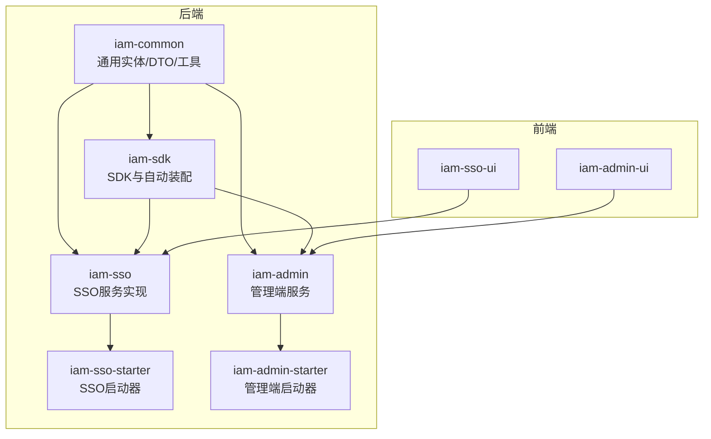
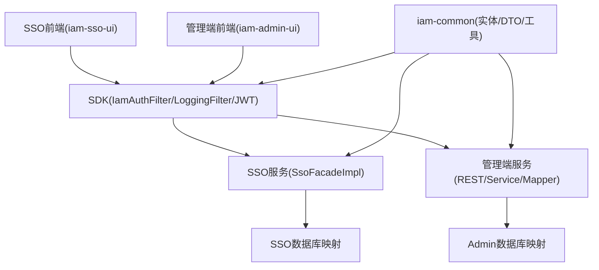
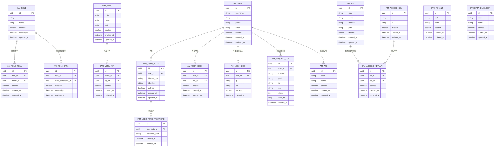
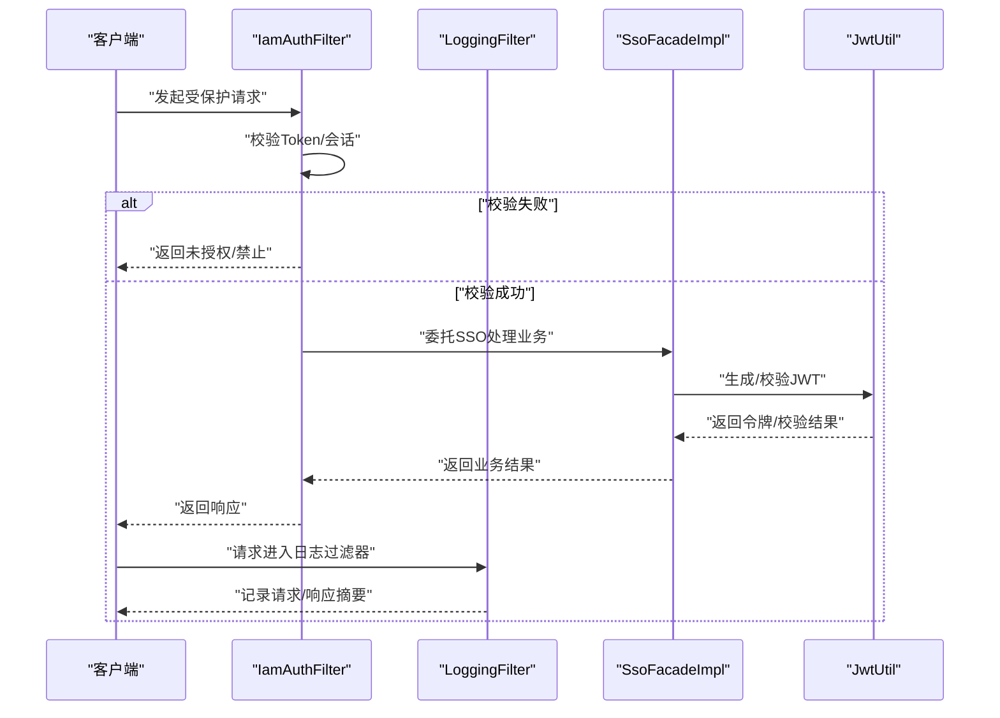
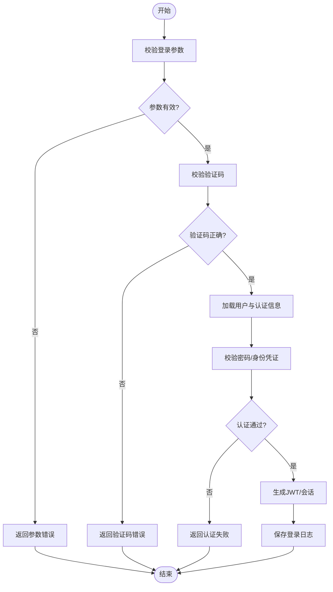
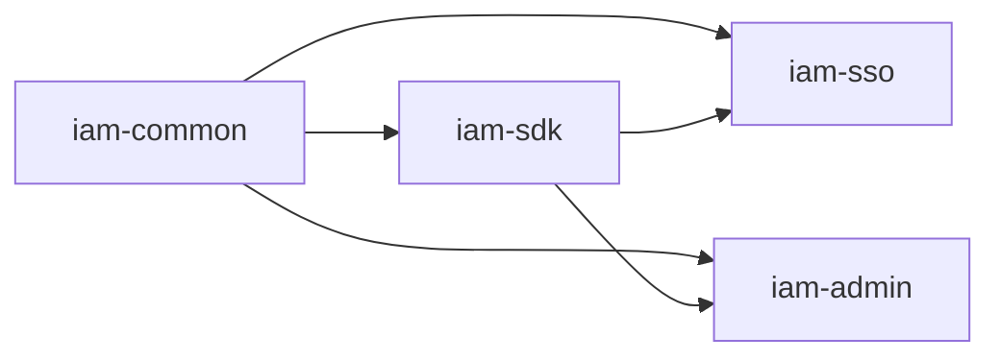

# 开发指南

<cite>
**本文引用的文件**
- [README.md](file://README.md)
- [coding-standard.md](file://docs/standards/coding-standard.md)
- [database-design.md](file://docs/architecture/database-design.md)
- [IamAdminApplication.java](file://iam-admin-starter/src/main/java/com/wkclz/iam/admin/starter/IamAdminApplication.java)
- [application.yml（管理端）](file://iam-admin-starter/src/main/resources/config/application.yml)
- [IamSsoApplication.java](file://iam-sso-starter/src/main/java/com/wkclz/iam/sso/starter/IamSsoApplication.java)
- [application.yml（SSO端）](file://iam-sso-starter/src/main/resources/config/application.yml)
- [IamAdminAutoConfig.java](file://iam-admin/src/main/java/com/wkclz/iam/admin/IamAdminAutoConfig.java)
- [IamSsoAutoConfig.java](file://iam-sso/src/main/java/com/wkclz/iam/sso/IamSsoAutoConfig.java)
- [IamSdkAutoConfig.java](file://iam-sdk/src/main/java/com/wkclz/iam/sdk/IamSdkAutoConfig.java)
- [IamSsoService.java](file://iam-sdk/src/main/java/com/wkclz/iam/sdk/service/IamSsoService.java)
- [SsoFacade.java](file://iam-sdk/src/main/java/com/wkclz/iam/sdk/facade/SsoFacade.java)
- [SsoFacadeImpl.java](file://iam-sso/src/main/java/com/wkclz/iam/sso/service/SsoFacadeImpl.java)
- [UserNameProviderImpl.java](file://iam-sso/src/main/java/com/wkclz/iam/sso/spiimpl/UserNameProviderImpl.java)
- [IamAuthFilter.java](file://iam-sdk/src/main/java/com/wkclz/iam/sdk/filter/IamAuthFilter.java)
- [LoggingFilter.java](file://iam-sdk/src/main/java/com/wkclz/iam/sdk/filter/LoggingFilter.java)
- [JwtUtil.java](file://iam-sdk/src/main/java/com/wkclz/iam/sdk/util/JwtUtil.java)
- [PasswordHelper.java](file://iam-common/src/main/java/com/wkclz/iam/common/helper/PasswordHelper.java)
- [IpLocalCacheHelper.java](file://iam-common/src/main/java/com/wkclz/iam/common/helper/IpLocalCacheHelper.java)
- [IamUserDto.java](file://iam-common/src/main/java/com/wkclz/iam/common/dto/IamUserDto.java)
- [IamUser.java](file://iam-common/src/main/java/com/wkclz/iam/common/entity/IamUser.java)
- [IamAccessKeyDto.java](file://iam-common/src/main/java/com/wkclz/iam/common/dto/IamAccessKeyDto.java)
- [IamAccessKey.java](file://iam-common/src/main/java/com/wkclz/iam/common/entity/IamAccessKey.java)
- [IamRoleDto.java](file://iam-common/src/main/java/com/wkclz/iam/common/dto/IamRoleDto.java)
- [IamRole.java](file://iam-common/src/main/java/com/wkclz/iam/common/entity/IamRole.java)
- [IamMenuDto.java](file://iam-common/src/main/java/com/wkclz/iam/common/dto/IamMenuDto.java)
- [IamMenu.java](file://iam-common/src/main/java/com/wkclz/iam/common/entity/IamMenu.java)
- [IamApiDto.java](file://iam-common/src/main/java/com/wkclz/iam/common/dto/IamApiDto.java)
- [IamApi.java](file://iam-common/src/main/java/com/wkclz/iam/common/entity/IamApi.java)
- [IamTenantDto.java](file://iam-common/src/main/java/com/wkclz/iam/common/dto/IamTenantDto.java)
- [IamTenant.java](file://iam-common/src/main/java/com/wkclz/iam/common/entity/IamTenant.java)
- [IamDataDimensionDto.java](file://iam-common/src/main/java/com/wkclz/iam/common/dto/IamDataDimensionDto.java)
- [IamDataDimension.java](file://iam-common/src/main/java/com/wkclz/iam/common/entity/IamDataDimension.java)
- [IamLoginLogDto.java](file://iam-common/src/main/java/com/wkclz/iam/common/dto/IamLoginLogDto.java)
- [IamLoginLog.java](file://iam-common/src/main/java/com/wkclz/iam/common/entity/IamLoginLog.java)
- [IamRequestLogDto.java](file://iam-common/src/main/java/com/wkclz/iam/common/dto/IamRequestLogDto.java)
- [IamRequestLog.java](file://iam-common/src/main/java/com/wkclz/iam/common/entity/IamRequestLog.java)
- [IamUserAuthDto.java](file://iam-common/src/main/java/com/wkclz/iam/common/dto/IamUserAuthDto.java)
- [IamUserAuth.java](file://iam-common/src/main/java/com/wkclz/iam/common/entity/IamUserAuth.java)
- [IamUserAuthPasswordDto.java](file://iam-common/src/main/java/com/wkclz/iam/common/dto/IamUserAuthPasswordDto.java)
- [IamUserAuthPassword.java](file://iam-common/src/main/java/com/wkclz/iam/common/entity/IamUserAuthPassword.java)
- [IamUserRoleDto.java](file://iam-common/src/main/java/com/wkclz/iam/common/dto/IamUserRoleDto.java)
- [IamUserRole.java](file://iam-common/src/main/java/com/wkclz/iam/common/entity/IamUserRole.java)
- [IamRoleMenuDto.java](file://iam-common/src/main/java/com/wkclz/iam/common/dto/IamRoleMenuDto.java)
- [IamRoleMenu.java](file://iam-common/src/main/java/com/wkclz/iam/common/entity/IamRoleMenu.java)
- [IamRoleDataDto.java](file://iam-common/src/main/java/com/wkclz/iam/common/dto/IamRoleDataDto.java)
- [IamRoleData.java](file://iam-common/src/main/java/com/wkclz/iam/common/entity/IamRoleData.java)
- [IamMenuApiDto.java](file://iam-common/src/main/java/com/wkclz/iam/common/dto/IamMenuApiDto.java)
- [IamMenuApi.java](file://iam-common/src/main/java/com/wkclz/iam/common/entity/IamMenuApi.java)
- [IamAccessKeyApiDto.java](file://iam-common/src/main/java/com/wkclz/iam/common/dto/IamAccessKeyApiDto.java)
- [IamAccessKeyApi.java](file://iam-common/src/main/java/com/wkclz/iam/common/entity/IamAccessKeyApi.java)
- [IamUserPasswordHisDto.java](file://iam-common/src/main/java/com/wkclz/iam/common/dto/IamUserPasswordHisDto.java)
- [IamUserPasswordHis.java](file://iam-common/src/main/java/com/wkclz/iam/common/entity/IamUserPasswordHis.java)
- [IamAppDto.java](file://iam-common/src/main/java/com/wkclz/iam/common/dto/IamAppDto.java)
- [IamApp.java](file://iam-common/src/main/java/com/wkclz/iam/common/entity/IamApp.java)
- [IamUserPasswordHisService.java](file://iam-admin/src/main/java/com/wkclz/iam/admin/service/IamUserPasswordHisService.java)
- [IamUserPasswordHisMapper.java](file://iam-admin/src/main/java/com/wkclz/iam/admin/mapper/IamUserPasswordHisMapper.java)
- [IamUserPasswordHisMapper.xml](file://iam-admin/src/main/resources/mapper/IamUserPasswordHisMapper.xml)
- [IamUserMenuService.java](file://iam-admin/src/main/java/com/wkclz/iam/admin/service/IamUserMenuService.java)
- [IamUserMenuRest.java](file://iam-admin/src/main/java/com/wkclz/iam/admin/rest/UserMenuRest.java)
- [IamUserMenuMapper.java](file://iam-admin/src/main/java/com/wkclz/iam/admin/mapper/IamUserMenuMapper.java)
- [IamUserMenuMapper.xml](file://iam-admin/src/main/resources/mapper/IamUserMenuMapper.xml)
- [IamRoleMenuService.java](file://iam-admin/src/main/java/com/wkclz/iam/admin/service/IamRoleMenuService.java)
- [IamRoleMenuRest.java](file://iam-admin/src/main/java/com/wkclz/iam/admin/rest/RoleMenuRest.java)
- [IamRoleMenuMapper.java](file://iam-admin/src/main/java/com/wkclz/iam/admin/mapper/IamRoleMenuMapper.java)
- [IamRoleMenuMapper.xml](file://iam-admin/src/main/resources/mapper/IamRoleMenuMapper.xml)
- [IamRoleDataService.java](file://iam-admin/src/main/java/com/wkclz/iam/admin/service/IamRoleDataService.java)
- [IamRoleDataRest.java](file://iam-admin/src/main/java/com/wkclz/iam/admin/rest/RoleDataRest.java)
- [IamRoleDataMapper.java](file://iam-admin/src/main/java/com/wkclz/iam/admin/mapper/IamRoleDataMapper.java)
- [IamRoleDataMapper.xml](file://iam-admin/src/main/resources/mapper/IamRoleDataMapper.xml)
- [IamUserAuthService.java](file://iam-admin/src/main/java/com/wkclz/iam/admin/service/IamUserAuthService.java)
- [IamUserAuthRest.java](file://iam-admin/src/main/java/com/wkclz/iam/admin/rest/UserAuthRest.java)
- [IamUserAuthMapper.java](file://iam-admin/src/main/java/com/wkclz/iam/admin/mapper/IamUserAuthMapper.java)
- [IamUserAuthMapper.xml](file://iam-admin/src/main/resources/mapper/IamUserAuthMapper.xml)
- [IamUserAuthPasswordService.java](file://iam-admin/src/main/java/com/wkclz/iam/admin/service/IamUserAuthPasswordService.java)
- [IamUserAuthPasswordMapper.java](file://iam-admin/src/main/java/com/wkclz/iam/admin/mapper/IamUserAuthPasswordMapper.java)
- [IamUserAuthPasswordMapper.xml](file://iam-admin/src/main/resources/mapper/IamUserAuthPasswordMapper.xml)
- [IamUserService.java](file://iam-admin/src/main/java/com/wkclz/iam/admin/service/IamUserService.java)
- [IamUserRest.java](file://iam-admin/src/main/java/com/wkclz/iam/admin/rest/UserRest.java)
- [IamUserMapper.java](file://iam-admin/src/main/java/com/wkclz/iam/admin/mapper/IamUserMapper.java)
- [IamUserMapper.xml](file://iam-admin/src/main/resources/mapper/IamUserMapper.xml)
- [IamRoleService.java](file://iam-admin/src/main/java/com/wkclz/iam/admin/service/IamRoleService.java)
- [IamRoleRest.java](file://iam-admin/src/main/java/com/wkclz/iam/admin/rest/RoleRest.java)
- [IamRoleMapper.java](file://iam-admin/src/main/java/com/wkclz/iam/admin/mapper/IamRoleMapper.java)
- [IamRoleMapper.xml](file://iam-admin/src/main/resources/mapper/IamRoleMapper.xml)
- [IamMenuService.java](file://iam-admin/src/main/java/com/wkclz/iam/admin/service/IamMenuService.java)
- [IamMenuRest.java](file://iam-admin/src/main/java/com/wkclz/iam/admin/rest/MenuRest.java)
- [IamMenuMapper.java](file://iam-admin/src/main/java/com/wkclz/iam/admin/mapper/IamMenuMapper.java)
- [IamMenuMapper.xml](file://iam-admin/src/main/resources/mapper/IamMenuMapper.xml)
- [IamApiService.java](file://iam-admin/src/main/java/com/wkclz/iam/admin/service/IamApiService.java)
- [IamApiRest.java](file://iam-admin/src/main/java/com/wkclz/iam/admin/rest/ApiRest.java)
- [IamApiMapper.java](file://iam-admin/src/main/java/com/wkclz/iam/admin/mapper/IamApiMapper.java)
- [IamApiMapper.xml](file://iam-admin/src/main/resources/mapper/IamApiMapper.xml)
- [IamAccessKeyService.java](file://iam-admin/src/main/java/com/wkclz/iam/admin/service/IamAccessKeyService.java)
- [IamAccessKeyRest.java](file://iam-admin/src/main/java/com/wkclz/iam/admin/rest/AccessKeyRest.java)
- [IamAccessKeyMapper.java](file://iam-admin/src/main/java/com/wkclz/iam/admin/mapper/IamAccessKeyMapper.java)
- [IamAccessKeyMapper.xml](file://iam-admin/src/main/resources/mapper/IamAccessKeyMapper.xml)
- [IamAccessKeyApiService.java](file://iam-admin/src/main/java/com/wkclz/iam/admin/service/IamAccessKeyApiService.java)
- [IamAccessKeyApiRest.java](file://iam-admin/src/main/java/com/wkclz/iam/admin/rest/AccessKeyApiRest.java)
- [IamAccessKeyApiMapper.java](file://iam-admin/src/main/java/com/wkclz/iam/admin/mapper/IamAccessKeyApiMapper.java)
- [IamAccessKeyApiMapper.xml](file://iam-admin/src/main/resources/mapper/IamAccessKeyApiMapper.xml)
- [IamDataDimensionService.java](file://iam-admin/src/main/java/com/wkclz/iam/admin/service/IamDataDimensionService.java)
- [IamDataDimensionRest.java](file://iam-admin/src/main/java/com/wkclz/iam/admin/rest/DataDimensionRest.java)
- [IamDataDimensionMapper.java](file://iam-admin/src/main/java/com/wkclz/iam/admin/mapper/IamDataDimensionMapper.java)
- [IamDataDimensionMapper.xml](file://iam-admin/src/main/resources/mapper/IamDataDimensionMapper.xml)
- [IamTenantService.java](file://iam-admin/src/main/java/com/wkclz/iam/admin/service/IamTenantService.java)
- [IamTenantRest.java](file://iam-admin/src/main/java/com/wkclz/iam/admin/rest/TenantRest.java)
- [IamTenantMapper.java](file://iam-admin/src/main/java/com/wkclz/iam/admin/mapper/IamTenantMapper.java)
- [IamTenantMapper.xml](file://iam-admin/src/main/resources/mapper/IamTenantMapper.xml)
- [IamLoginLogService.java](file://iam-admin/src/main/java/com/wkclz/iam/admin/service/IamLoginLogService.java)
- [IamLoginLogRest.java](file://iam-admin/src/main/java/com/wkclz/iam/admin/rest/LoginLogRest.java)
- [IamLoginLogMapper.java](file://iam-admin/src/main/java/com/wkclz/iam/admin/mapper/IamLoginLogMapper.java)
- [IamLoginLogMapper.xml](file://iam-admin/src/main/resources/mapper/IamLoginLogMapper.xml)
- [IamRequestLogService.java](file://iam-admin/src/main/java/com/wkclz/iam/admin/service/IamRequestLogService.java)
- [IamRequestLogRest.java](file://iam-admin/src/main/java/com/wkclz/iam/admin/rest/RequestLogRest.java)
- [IamRequestLogMapper.java](file://iam-admin/src/main/java/com/wkclz/iam/admin/mapper/IamRequestLogMapper.java)
- [IamRequestLogMapper.xml](file://iam-admin/src/main/resources/mapper/IamRequestLogMapper.xml)
- [IamAppService.java](file://iam-admin/src/main/java/com/wkclz/iam/admin/service/IamAppService.java)
- [IamAppRest.java](file://iam-admin/src/main/java/com/wkclz/iam/admin/rest/AppRest.java)
- [IamAppMapper.java](file://iam-admin/src/main/java/com/wkclz/iam/admin/mapper/IamAppMapper.java)
- [IamAppMapper.xml](file://iam-admin/src/main/resources/mapper/IamAppMapper.xml)
- [IamMenuApiService.java](file://iam-admin/src/main/java/com/wkclz/iam/admin/service/IamMenuApiService.java)
- [IamMenuApiRest.java](file://iam-admin/src/main/java/com/wkclz/iam/admin/rest/MenuApiRest.java)
- [IamMenuApiMapper.java](file://iam-admin/src/main/java/com/wkclz/iam/admin/mapper/IamMenuApiMapper.java)
- [IamMenuApiMapper.xml](file://iam-admin/src/main/resources/mapper/IamMenuApiMapper.xml)
- [IamUserRoleService.java](file://iam-admin/src/main/java/com/wkclz/iam/admin/service/IamUserRoleService.java)
- [IamUserRoleRest.java](file://iam-admin/src/main/java/com/wkclz/iam/admin/rest/UserRoleRest.java)
- [IamUserRoleMapper.java](file://iam-admin/src/main/java/com/wkclz/iam/admin/mapper/IamUserRoleMapper.java)
- [IamUserRoleMapper.xml](file://iam-admin/src/main/resources/mapper/IamUserRoleMapper.xml)
- [IamUserRest.java](file://iam-admin/src/main/java/com/wkclz/iam/admin/rest/UserRest.java)
- [IamRoleRest.java](file://iam-admin/src/main/java/com/wkclz/iam/admin/rest/RoleRest.java)
- [IamMenuRest.java](file://iam-admin/src/main/java/com/wkclz/iam/admin/rest/MenuRest.java)
- [IamApiRest.java](file://iam-admin/src/main/java/com/wkclz/iam/admin/rest/ApiRest.java)
- [IamAccessKeyRest.java](file://iam-admin/src/main/java/com/wkclz/iam/admin/rest/AccessKeyRest.java)
- [IamAccessKeyApiRest.java](file://iam-admin/src/main/java/com/wkclz/iam/admin/rest/AccessKeyApiRest.java)
- [IamDataDimensionRest.java](file://iam-admin/src/main/java/com/wkclz/iam/admin/rest/DataDimensionRest.java)
- [IamTenantRest.java](file://iam-admin/src/main/java/com/wkclz/iam/admin/rest/TenantRest.java)
- [IamLoginLogRest.java](file://iam-admin/src/main/java/com/wkclz/iam/admin/rest/LoginLogRest.java)
- [IamRequestLogRest.java](file://iam-admin/src/main/java/com/wkclz/iam/admin/rest/RequestLogRest.java)
- [IamAppRest.java](file://iam-admin/src/main/java/com/wkclz/iam/admin/rest/AppRest.java)
- [IamUserMenuRest.java](file://iam-admin/src/main/java/com/wkclz/iam/admin/rest/UserMenuRest.java)
- [IamRoleMenuRest.java](file://iam-admin/src/main/java/com/wkclz/iam/admin/rest/RoleMenuRest.java)
- [IamRoleDataRest.java](file://iam-admin/src/main/java/com/wkclz/iam/admin/rest/RoleDataRest.java)
- [IamUserAuthRest.java](file://iam-admin/src/main/java/com/wkclz/iam/admin/rest/UserAuthRest.java)
- [IamUserPasswordHisRest.java](file://iam-admin/src/main/java/com/wkclz/iam/admin/rest/UserPasswordHisRest.java)
- [IamUserPasswordHisRest.java](file://iam-admin/src/main/java/com/wkclz/iam/admin/rest/UserPasswordHisRest.java)
- [IamUserPasswordHisRest.java](file://iam-admin/src/main/java/com/wkclz/iam/admin/rest/UserPasswordHisRest.java)
- [IamUserPasswordHisRest.java](file://iam-admin/src/main/java/com/wkclz/iam/admin/rest/UserPasswordHisRest.java)
- [IamUserPasswordHisRest.java](file://iam-admin/src/main/java/com/wkclz/iam/admin/rest/UserPasswordHisRest.java)
- [IamUserPasswordHisRest.java](file://iam-admin/src/main/java/com/wkclz/iam/admin/rest/UserPasswordHisRest.java)
- [IamUserPasswordHisRest.java](file://iam-admin/src/main/java/com/wkclz/iam/admin/rest/UserPasswordHisRest.java)
- [IamUserPasswordHisRest.java](file://iam-admin/src/main/java/com/wkclz/iam/admin/rest/UserPasswordHisRest.java)
- [IamUserPasswordHisRest.java](file://iam-admin/src/main/java/com/wkclz/iam/admin/rest/UserPasswordHisRest.java)
- [IamUserPasswordHisRest.java](file://iam-admin/src/main/java/com/wkclz/iam/admin/rest/UserPasswordHisRest.java)
- [IamUserPasswordHisRest.java](file://iam-admin/src/main/java/com/wkclz/iam/admin/rest/UserPasswordHisRest.java)
- [IamUserPasswordHisRest.java](file://iam-admin/src/main/java/com/wkclz/iam/admin/rest/UserPasswordHisRest.java)
- [IamUserPasswordHisRest.java](file://iam-admin/src/main/java/com/wkclz/iam/admin/rest/UserPasswordHisRest.java)
- [IamUserPasswordHisRest.java](file://iam-admin/src/main/java/com/wkclz/iam/admin/rest/UserPasswordHisRest.java)
- [IamUserPasswordHisRest.java](file://iam-admin/src/main/java/com/wkclz/iam/admin/rest/UserPasswordHisRest.java)
- [IamUserPasswordHisRest.java](file://iam-admin/src/main/java/com/wkclz/iam/admin/rest/UserPasswordHisRest.java)
- [IamUserPasswordHisRest.java](file://iam-admin/src......
</cite>

## 目录
1. 引言
2. 项目结构
3. 核心组件
4. 架构总览
5. 详细组件分析
6. 依赖分析
7. 性能考虑
8. 故障排查指南
9. 结论
10. 附录

## 引言
本开发指南面向SH-IAM项目的开发者与新成员，目标是提供从代码风格、命名约定、注释规范到开发环境搭建、IDE配置、调试技巧、单元与集成测试策略、插件与SPI扩展、第三方集成、开发流程、代码评审标准以及持续集成实践的完整指引。文档以仓库现有文件为基础，结合模块化架构与分层设计，帮助团队统一开发标准、提升协作效率与系统质量。

## 项目结构
SH-IAM采用多模块Maven工程组织，分为后端核心模块与前端UI模块，覆盖认证授权、用户/角色/菜单/权限/访问密钥等能力，并提供SDK与自动装配机制，便于在其他应用中快速接入。

- 后端模块
  - iam-common：通用实体、DTO、辅助工具（密码、IP本地缓存）
  - iam-sdk：对外SDK（自动装配、过滤器、鉴权、会话、JWT、验证码、响应封装）
  - iam-sso：SSO服务端实现（登录、请求日志、资源、定时任务、SPI扩展点）
  - iam-admin：管理端服务（REST、Service、Mapper、XML映射）
  - iam-sso-starter：SSO应用入口
  - iam-admin-starter：管理端应用入口
- 前端模块
  - iam-sso-ui：SSO前端界面
  - iam-admin-ui：管理端前端界面

图示来源
- [IamAdminAutoConfig.java](file://iam-admin/src/main/java/com/wkclz/iam/admin/IamAdminAutoConfig.java)
- [IamSsoAutoConfig.java](file://iam-sso/src/main/java/com/wkclz/iam/sso/IamSsoAutoConfig.java)
- [IamSdkAutoConfig.java](file://iam-sdk/src/main/java/com/wkclz/iam/sdk/IamSdkAutoConfig.java)
- [IamAdminApplication.java](file://iam-admin-starter/src/main/java/com/wkclz/iam/admin/starter/IamAdminApplication.java)
- [IamSsoApplication.java](file://iam-sso-starter/src/main/java/com/wkclz/iam/sso/starter/IamSsoApplication.java)

章节来源
- [README.md](file://README.md)
- [application.yml（管理端）](file://iam-admin-starter/src/main/resources/config/application.yml)
- [application.yml（SSO端）](file://iam-sso-starter/src/main/resources/config/application.yml)

## 核心组件
- 自动装配与启动
  - 管理端与SSO端均通过各自Starter模块启动，内部通过AutoConfiguration导入自动装配定义，确保SDK、SSO、Admin相关组件按需加载。
- SDK与鉴权
  - SDK提供自动装配、鉴权过滤器、日志过滤器、JWT工具、验证码与会话辅助类、SSO门面接口及实现，支撑统一的认证与会话管理。
- SSO服务
  - 提供登录、请求日志、资源查询、定时任务（如IP地址库更新）、SPI扩展点（用户名提供者），以及SSO门面实现。
- 管理端服务
  - 覆盖用户、角色、菜单、API、访问密钥、数据维度、租户、登录/请求日志等CRUD与业务逻辑，配套REST、Service、Mapper三层。
- 通用模型
  - iam-common提供统一的实体与DTO，涵盖用户、角色、菜单、API、访问密钥、租户、数据维度、登录/请求日志、用户认证/密码历史、用户角色/菜单/API绑定等。

章节来源
- [IamAdminAutoConfig.java](file://iam-admin/src/main/java/com/wkclz/iam/admin/IamAdminAutoConfig.java)
- [IamSsoAutoConfig.java](file://iam-sso/src/main/java/com/wkclz/iam/sso/IamSsoAutoConfig.java)
- [IamSdkAutoConfig.java](file://iam-sdk/src/main/java/com/wkclz/iam/sdk/IamSdkAutoConfig.java)
- [IamAuthFilter.java](file://iam-sdk/src/main/java/com/wkclz/iam/sdk/filter/IamAuthFilter.java)
- [LoggingFilter.java](file://iam-sdk/src/main/java/com/wkclz/iam/sdk/filter/LoggingFilter.java)
- [JwtUtil.java](file://iam-sdk/src/main/java/com/wkclz/iam/sdk/util/JwtUtil.java)
- [SsoFacadeImpl.java](file://iam-sso/src/main/java/com/wkclz/iam/sso/service/SsoFacadeImpl.java)
- [UserNameProviderImpl.java](file://iam-sso/src/main/java/com/wkclz/iam/sso/spiimpl/UserNameProviderImpl.java)

## 架构总览
下图展示SH-IAM整体架构：前端通过SDK进行认证与会话交互，后端由SSO负责认证与会话，Admin负责后台管理与数据持久化，公共模块提供统一的数据模型与工具。

图示来源
- [IamAuthFilter.java](file://iam-sdk/src/main/java/com/wkclz/iam/sdk/filter/IamAuthFilter.java)
- [LoggingFilter.java](file://iam-sdk/src/main/java/com/wkclz/iam/sdk/filter/LoggingFilter.java)
- [JwtUtil.java](file://iam-sdk/src/main/java/com/wkclz/iam/sdk/util/JwtUtil.java)
- [SsoFacadeImpl.java](file://iam-sso/src/main/java/com/wkclz/iam/sso/service/SsoFacadeImpl.java)
- [IamAdminAutoConfig.java](file://iam-admin/src/main/java/com/wkclz/iam/admin/IamAdminAutoConfig.java)
- [IamSsoAutoConfig.java](file://iam-sso/src/main/java/com/wkclz/iam/sso/IamSsoAutoConfig.java)
- [IamUserMapper.xml](file://iam-admin/src/main/resources/mapper/IamUserMapper.xml)
- [IamUserMapper.java](file://iam-admin/src/main/java/com/wkclz/iam/admin/mapper/IamUserMapper.java)

## 详细组件分析

### 代码风格与命名规范
- 统一遵循项目既定的编码规范，包括包名、类名、方法名、常量、变量、枚举、异常、注释等命名与格式要求。
- 类型与接口命名采用清晰语义，避免缩写；常量使用全大写+下划线；方法名体现动作与结果；字段与参数明确职责。
- 注释规范：类与接口提供总体说明；复杂方法提供入参与返回说明、异常分支说明；关键业务流程提供步骤注释。

章节来源
- [coding-standard.md](file://docs/standards/coding-standard.md)

### 开发环境搭建与IDE配置
- JDK版本与Maven要求：根据项目pom与模块配置确认JDK与Maven版本。
- IDE建议：IntelliJ IDEA或Eclipse，启用Lombok支持（如使用），开启代码格式化与检查规则，导入项目根目录pom以解析多模块。
- 前端依赖：安装Node.js与npm/yarn，进入iam-sso-ui与iam-admin-ui执行依赖安装与运行脚本。
- 数据库：根据各模块application.yml中的连接信息准备MySQL或其他数据库，初始化表结构（参考数据库设计文档与Mapper XML）。
- 运行方式：通过Starter模块的主类启动SSO或管理端；或使用Docker部署（如存在Dockerfile与部署YAML）。

章节来源
- [README.md](file://README.md)
- [application.yml（管理端）](file://iam-admin-starter/src/main/resources/config/application.yml)
- [application.yml（SSO端）](file://iam-sso-starter/src/main/resources/config/application.yml)
- [database-design.md](file://docs/architecture/database-design.md)

### 调试技巧
- 启动参数：通过application.yml设置日志级别、端口、数据库连接等；必要时添加JVM参数用于远程调试。
- 断点调试：在SDK过滤器、SSO服务、Admin REST层设置断点，观察请求链路与数据流转。
- 日志定位：利用LoggingFilter输出请求/响应摘要，结合Admin与SSO的日志记录服务定位问题。
- 前端联调：通过代理或跨域配置使前端与后端服务互通，关注网络面板与控制台错误。

章节来源
- [LoggingFilter.java](file://iam-sdk/src/main/java/com/wkclz/iam/sdk/filter/LoggingFilter.java)
- [IamLoginLogService.java](file://iam-admin/src/main/java/com/wkclz/iam/admin/service/IamLoginLogService.java)
- [IamRequestLogService.java](file://iam-admin/src/main/java/com/wkclz/iam/admin/service/IamRequestLogService.java)

### 单元测试与集成测试
- 单元测试
  - 针对Service层与工具类（如PasswordHelper、JwtUtil、IpLocalCacheHelper）编写单元测试，覆盖正常路径、边界条件与异常分支。
  - 使用Mock框架模拟外部依赖（如Mapper、HTTP客户端），确保测试可重复且稳定。
- 集成测试
  - 基于Spring Boot Test与Testcontainers或H2内存数据库进行集成测试，验证REST接口与数据库交互。
  - 关注鉴权过滤器链路、会话状态、JWT签发与校验、验证码生成与校验等关键流程。
- 测试数据准备
  - 使用Mapper XML中的SQL脚本初始化基础数据；通过Service层提供的CRUD接口准备测试用例所需数据。
  - 对于敏感数据（如密码）使用PasswordHelper进行安全处理；对会话与令牌使用SDK工具生成。

章节来源
- [PasswordHelper.java](file://iam-common/src/main/java/com/wkclz/iam/common/helper/PasswordHelper.java)
- [JwtUtil.java](file://iam-sdk/src/main/java/com/wkclz/iam/sdk/util/JwtUtil.java)
- [IpLocalCacheHelper.java](file://iam-common/src/main/java/com/wkclz/iam/common/helper/IpLocalCacheHelper.java)
- [IamUserMapper.xml](file://iam-admin/src/main/resources/mapper/IamUserMapper.xml)
- [IamUserAuthMapper.xml](file://iam-admin/src/main/resources/mapper/IamUserAuthMapper.xml)

### 插件开发与SPI扩展
- SPI扩展点
  - SSO模块提供SPI实现示例（如UserNameProviderImpl），可通过SPI机制扩展用户名解析策略。
- 扩展方式
  - 在META-INF/services目录下注册实现类，或通过AutoConfiguration扫描注册；确保实现类具备稳定的接口契约。
- 注意事项
  - 扩展实现需保证线程安全与幂等性；提供完善的异常处理与降级策略；通过单元测试验证行为。

章节来源
- [UserNameProviderImpl.java](file://iam-sso/src/main/java/com/wkclz/iam/sso/spiimpl/UserNameProviderImpl.java)

### 第三方集成方法
- SDK集成
  - 在目标应用引入SDK依赖，启用自动装配；在Web层配置IamAuthFilter与LoggingFilter，确保鉴权与日志生效。
- 外部服务
  - 对接验证码、会话存储、日志中心等外部组件时，优先通过配置项与工厂类注入，保持低耦合。
- 安全与合规
  - 密码处理遵循PasswordHelper规范；JWT令牌生成与校验遵循JwtUtil；严格限制敏感信息的传输与存储。

章节来源
- [IamSdkAutoConfig.java](file://iam-sdk/src/main/java/com/wkclz/iam/sdk/IamSdkAutoConfig.java)
- [IamAuthFilter.java](file://iam-sdk/src/main/java/com/wkclz/iam/sdk/filter/IamAuthFilter.java)
- [LoggingFilter.java](file://iam-sdk/src/main/java/com/wkclz/iam/sdk/filter/LoggingFilter.java)
- [PasswordHelper.java](file://iam-common/src/main/java/com/wkclz/iam/common/helper/PasswordHelper.java)
- [JwtUtil.java](file://iam-sdk/src/main/java/com/wkclz/iam/sdk/util/JwtUtil.java)

### 开发流程与代码评审
- 分支策略：采用功能分支开发，合并前进行代码评审与自动化检查。
- 提交规范：遵循约定式提交（如feat/fix/docs/chore），配合变更日志生成。
- 评审标准：关注代码可读性、健壮性、性能与安全性；确保新增功能有配套测试与文档。
- 持续集成：在CI流水线中执行编译、测试、静态检查与打包，失败时阻断合并。

章节来源
- [coding-standard.md](file://docs/standards/coding-standard.md)

### 数据模型与关系
下图展示核心实体与DTO之间的关系，体现用户、角色、菜单、API、访问密钥、租户、数据维度等的关联。

图示来源
- [IamUser.java](file://iam-common/src/main/java/com/wkclz/iam/common/entity/IamUser.java)
- [IamRole.java](file://iam-common/src/main/java/com/wkclz/iam/common/entity/IamRole.java)
- [IamMenu.java](file://iam-common/src/main/java/com/wkclz/iam/common/entity/IamMenu.java)
- [IamApi.java](file://iam-common/src/main/java/com/wkclz/iam/common/entity/IamApi.java)
- [IamAccessKey.java](file://iam-common/src/main/java/com/wkclz/iam/common/entity/IamAccessKey.java)
- [IamTenant.java](file://iam-common/src/main/java/com/wkclz/iam/common/entity/IamTenant.java)
- [IamDataDimension.java](file://iam-common/src/main/java/com/wkclz/iam/common/entity/IamDataDimension.java)
- [IamUserAuth.java](file://iam-common/src/main/java/com/wkclz/iam/common/entity/IamUserAuth.java)
- [IamUserAuthPassword.java](file://iam-common/src/main/java/com/wkclz/iam/common/entity/IamUserAuthPassword.java)
- [IamUserRole.java](file://iam-common/src/main/java/com/wkclz/iam/common/entity/IamUserRole.java)
- [IamRoleMenu.java](file://iam-common/src/main/java/com/wkclz/iam/common/entity/IamRoleMenu.java)
- [IamRoleData.java](file://iam-common/src/main/java/com/wkclz/iam/common/entity/IamRoleData.java)
- [IamMenuApi.java](file://iam-common/src/main/java/com/wkclz/iam/common/entity/IamMenuApi.java)
- [IamAccessKeyApi.java](file://iam-common/src/main/java/com/wkclz/iam/common/entity/IamAccessKeyApi.java)
- [IamLoginLog.java](file://iam-common/src/main/java/com/wkclz/iam/common/entity/IamLoginLog.java)
- [IamRequestLog.java](file://iam-common/src/main/java/com/wkclz/iam/common/entity/IamRequestLog.java)
- [IamApp.java](file://iam-common/src/main/java/com/wkclz/iam/common/entity/IamApp.java)

### 认证与会话流程（SDK侧）
以下序列图展示SDK在Web层的认证与日志过滤器如何协同工作，以及JWT的生成与校验流程。

图示来源
- [IamAuthFilter.java](file://iam-sdk/src/main/java/com/wkclz/iam/sdk/filter/IamAuthFilter.java)
- [LoggingFilter.java](file://iam-sdk/src/main/java/com/wkclz/iam/sdk/filter/LoggingFilter.java)
- [SsoFacadeImpl.java](file://iam-sso/src/main/java/com/wkclz/iam/sso/service/SsoFacadeImpl.java)
- [JwtUtil.java](file://iam-sdk/src/main/java/com/wkclz/iam/sdk/util/JwtUtil.java)

### 登录与权限流程（Admin侧）
以下流程图展示用户登录与权限分配的关键节点与数据流转。

图示来源
- [IamUserAuthRest.java](file://iam-admin/src/main/java/com/wkclz/iam/admin/rest/UserAuthRest.java)
- [IamUserAuthMapper.java](file://iam-admin/src/main/java/com/wkclz/iam/admin/mapper/IamUserAuthMapper.java)
- [IamUserAuthMapper.xml](file://iam-admin/src/main/resources/mapper/IamUserAuthMapper.xml)
- [IamLoginLogService.java](file://iam-admin/src/main/java/com/wkclz/iam/admin/service/IamLoginLogService.java)
- [IamLoginLogMapper.java](file://iam-admin/src/main/java/com/wkclz/iam/admin/mapper/IamLoginLogMapper.java)
- [IamLoginLogMapper.xml](file://iam-admin/src/main/resources/mapper/IamLoginLogMapper.xml)

## 依赖分析
- 模块内聚与耦合
  - iam-common作为共享层，被SDK、SSO、Admin共同依赖，降低重复与耦合。
  - SDK作为适配层，向上提供统一接口，向下对接SSO与Admin。
  - Admin与SSO分别承担管理与认证职责，通过公共模型与工具协同。
- 外部依赖
  - Spring Boot、MyBatis、MySQL驱动、日志框架等；版本与兼容性以各模块pom为准。
- 循环依赖
  - 当前结构避免了循环依赖：Common -> SDK -> SSO/Admin；Admin/SSO之间通过SDK间接通信。

图示来源
- [IamAdminAutoConfig.java](file://iam-admin/src/main/java/com/wkclz/iam/admin/IamAdminAutoConfig.java)
- [IamSsoAutoConfig.java](file://iam-sso/src/main/java/com/wkclz/iam/sso/IamSsoAutoConfig.java)
- [IamSdkAutoConfig.java](file://iam-sdk/src/main/java/com/wkclz/iam/sdk/IamSdkAutoConfig.java)

## 性能考虑
- 过滤器链路
  - 尽量减少鉴权与日志过滤器中的阻塞操作；对耗时逻辑异步化或缓存化。
- 数据访问
  - 合理使用Mapper XML中的SQL与索引；对高频查询建立复合索引；避免N+1查询。
- 缓存策略
  - 对热点数据（如验证码、用户会话、菜单树）使用本地缓存（参考IpLocalCacheHelper思路）。
- JWT与会话
  - 控制令牌有效期与刷新策略；避免过长会话导致资源占用；定期清理过期会话。

## 故障排查指南
- 常见问题
  - 认证失败：检查IamAuthFilter配置、JWT签名与过期时间、用户是否存在与状态是否正常。
  - 数据不一致：核对Mapper XML与实体字段映射，确认事务边界与回滚策略。
  - 日志缺失：确认LoggingFilter已生效，日志级别与输出位置配置正确。
- 排查步骤
  - 启用DEBUG日志，复现问题并截取关键日志片段。
  - 使用单元测试隔离问题模块，逐步缩小范围。
  - 对比数据库脚本与当前表结构，确保DDL一致。

章节来源
- [IamAuthFilter.java](file://iam-sdk/src/main/java/com/wkclz/iam/sdk/filter/IamAuthFilter.java)
- [LoggingFilter.java](file://iam-sdk/src/main/java/com/wkclz/iam/sdk/filter/LoggingFilter.java)
- [IamLoginLogService.java](file://iam-admin/src/main/java/com/wkclz/iam/admin/service/IamLoginLogService.java)
- [IamRequestLogService.java](file://iam-admin/src/main/java/com/wkclz/iam/admin/service/IamRequestLogService.java)

## 结论
本指南基于仓库现有文件梳理了SH-IAM的开发规范、架构与关键组件，提供了从环境搭建到测试、扩展与运维的全流程实践建议。建议团队在日常开发中严格执行编码规范与评审流程，持续完善测试与文档，保障系统的稳定性与可维护性。

## 附录
- 快速启动
  - 后端：使用Starter模块主类启动SSO或管理端；或通过Docker部署。
  - 前端：在iam-sso-ui与iam-admin-ui分别安装依赖并运行开发服务器。
- 参考文档
  - 数据库设计文档与编码规范文档位于docs目录，可作为开发与评审的重要依据。