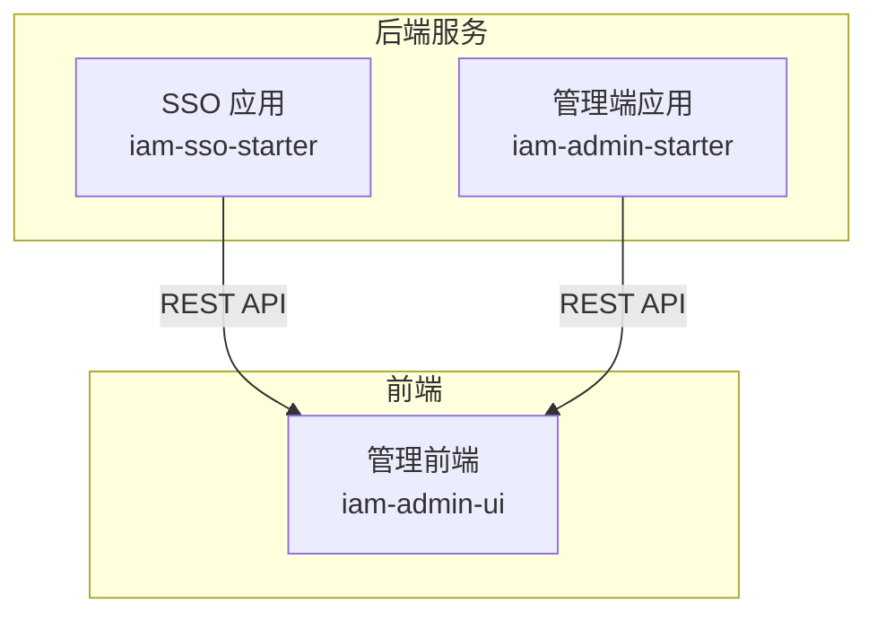
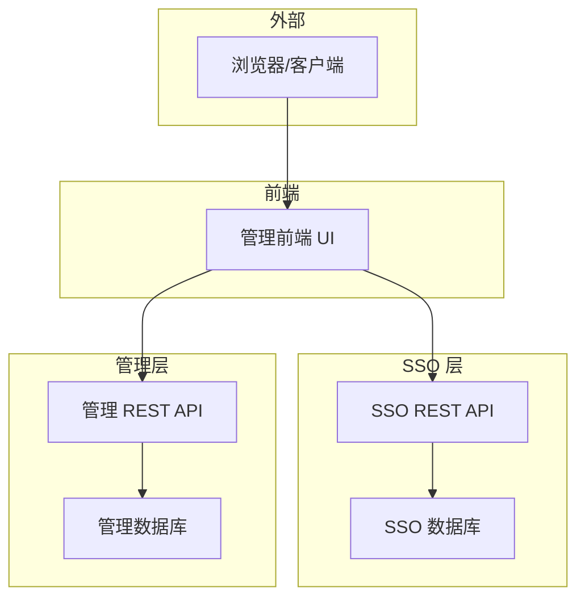
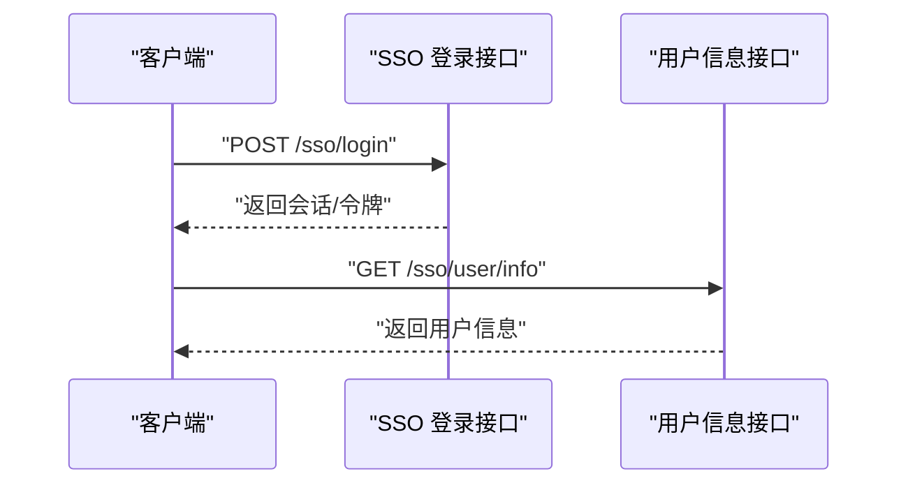
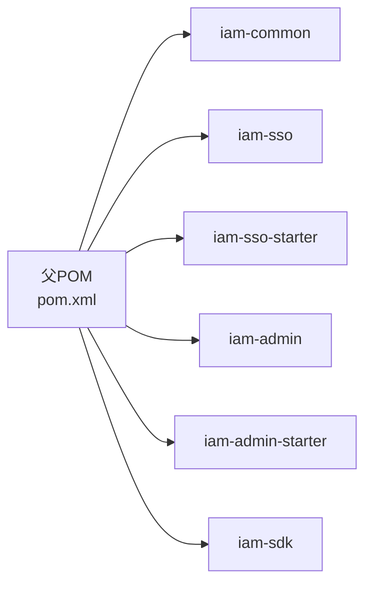

# 快速开始

<cite>
**本文引用的文件**
- [README.md](file://README.md)
- [pom.xml](file://pom.xml)
- [IamAdminApplication.java](file://iam-admin-starter/src/main/java/com/wkclz/iam/admin/starter/IamAdminApplication.java)
- [IamSsoApplication.java](file://iam-sso-starter/src/main/java/com/wkclz/iam/sso/starter/IamSsoApplication.java)
- [application.yml（管理端）](file://iam-admin-starter/src/main/resources/config/application.yml)
- [application.yml（SSO端）](file://iam-sso-starter/src/main/resources/config/application.yml)
- [Dockerfile（管理端）](file://iam-admin-starter/Dockerfile)
- [Dockerfile（管理端UI）](file://iam-admin-ui/Dockerfile)
- [deploy-uat.yaml（管理端）](file://iam-admin-starter/deploy-uat.yaml)
- [deploy-uat.yaml（管理端UI）](file://iam-admin-ui/deploy-uat.yaml)
- [db-base.ddl.sql](file://iam-sso/src/main/resources/db-script/db-base.ddl.sql)
- [package.json（管理端UI）](file://iam-admin-ui/package.json)
</cite>

## 目录
1. [简介](#简介)
2. [项目结构](#项目结构)
3. [核心组件](#核心组件)
4. [架构总览](#架构总览)
5. [详细组件分析](#详细组件分析)
6. [依赖分析](#依赖分析)
7. [性能考虑](#性能考虑)
8. [故障排除指南](#故障排除指南)
9. [结论](#结论)
10. [附录](#附录)

## 简介
本指南面向首次接触 SH-IAM 的开发者，帮助你在最短时间内完成本地开发环境准备、数据库初始化、应用启动与基础验证。SH-IAM 是一套基于 Spring Boot 的身份认证与权限管理系统，包含 SSO 单点登录服务与后台管理服务两部分，配套前端管理界面。

## 项目结构
仓库采用多模块聚合工程组织，核心模块如下：
- iam-common：通用实体、DTO、工具类
- iam-sso：单点登录服务（后端）
- iam-sso-starter：SSO 应用启动器
- iam-admin：后台管理服务（后端）
- iam-admin-starter：管理端应用启动器
- iam-sdk：客户端 SDK（可选集成）
- iam-admin-ui：Vue3 管理前端
- iam-sso-ui：Vue3 登录/用户中心前端

图表来源
- [pom.xml:20-27](file://pom.xml#L20-L27)
- [IamAdminApplication.java:1-16](file://iam-admin-starter/src/main/java/com/wkclz/iam/admin/starter/IamAdminApplication.java#L1-L16)
- [IamSsoApplication.java:1-16](file://iam-sso-starter/src/main/java/com/wkclz/iam/sso/starter/IamSsoApplication.java#L1-L16)

章节来源
- [pom.xml:1-37](file://pom.xml#L1-L37)

## 核心组件
- 应用入口
  - 管理端启动类：[IamAdminApplication.java:1-16](file://iam-admin-starter/src/main/java/com/wkclz/iam/admin/starter/IamAdminApplication.java#L1-L16)
  - SSO 启动类：[IamSsoApplication.java:1-16](file://iam-sso-starter/src/main/java/com/wkclz/iam/sso/starter/IamSsoApplication.java#L1-L16)
- 配置文件
  - 管理端配置：[application.yml（管理端）:1-52](file://iam-admin-starter/src/main/resources/config/application.yml#L1-L52)
  - SSO 配置：[application.yml（SSO端）:1-52](file://iam-sso-starter/src/main/resources/config/application.yml#L1-L52)
- 容器化与部署
  - 管理端 Dockerfile：[Dockerfile（管理端）:1-28](file://iam-admin-starter/Dockerfile#L1-L28)
  - 管理端 UI Dockerfile：[Dockerfile（管理端UI）:1-15](file://iam-admin-ui/Dockerfile#L1-L15)
  - 管理端 K8s 部署示例：[deploy-uat.yaml（管理端）:1-129](file://iam-admin-starter/deploy-uat.yaml#L1-L129)
  - 管理端 UI K8s 部署示例：[deploy-uat.yaml（管理端UI）:1-77](file://iam-admin-ui/deploy-uat.yaml#L1-L77)

章节来源
- [IamAdminApplication.java:1-16](file://iam-admin-starter/src/main/java/com/wkclz/iam/admin/starter/IamAdminApplication.java#L1-L16)
- [IamSsoApplication.java:1-16](file://iam-sso-starter/src/main/java/com/wkclz/iam/sso/starter/IamSsoApplication.java#L1-L16)
- [application.yml（管理端）:1-52](file://iam-admin-starter/src/main/resources/config/application.yml#L1-L52)
- [application.yml（SSO端）:1-52](file://iam-sso-starter/src/main/resources/config/application.yml#L1-L52)
- [Dockerfile（管理端）:1-28](file://iam-admin-starter/Dockerfile#L1-L28)
- [Dockerfile（管理端UI）:1-15](file://iam-admin-ui/Dockerfile#L1-L15)
- [deploy-uat.yaml（管理端）:1-129](file://iam-admin-starter/deploy-uat.yaml#L1-L129)
- [deploy-uat.yaml（管理端UI）:1-77](file://iam-admin-ui/deploy-uat.yaml#L1-L77)

## 架构总览
系统由“SSO 服务 + 管理服务 + 前端 UI”组成，SSO 提供认证、会话、资源与菜单等能力；管理服务提供后台数据治理与运维；前端通过 REST API 与后端交互。

## 详细组件分析

### 环境要求
- Java 版本
  - 构建与运行均需 JDK 25（源码编译目标也为 25）
- Maven
  - 使用 Maven 构建多模块工程
- MySQL
  - 默认使用 MySQL 8+，驱动类名已在配置中声明
- Redis
  - 未在当前仓库中发现显式 Redis 配置或使用，如需缓存可按需引入
- Node.js（仅前端构建）
  - 前端使用 Vite + Vue3，需安装 Node.js 以执行构建脚本

章节来源
- [pom.xml:32-35](file://pom.xml#L32-L35)
- [application.yml（管理端）:10](file://iam-admin-starter/src/main/resources/config/application.yml#L10)
- [application.yml（SSO端）:10](file://iam-sso-starter/src/main/resources/config/application.yml#L10)
- [package.json:1-53](file://iam-admin-ui/package.json#L1-L53)

### 安装与基本配置

#### 步骤一：克隆与构建
- 在本地准备好 JDK 25、Maven、MySQL
- 克隆仓库后，使用 Maven 清理并打包指定模块（示例：管理端启动器）
  - 命令参考：mvn -s settings.xml clean -Dmaven.test.skip=true -pl iam-admin-starter -am package
- 打包产物位于 iam-admin-starter/target 下

章节来源
- [Dockerfile（管理端）:6](file://iam-admin-starter/Dockerfile#L6)

#### 步骤二：数据库初始化
- 创建数据库（字符集建议 utf8mb4）
- 执行基础 DDL 脚本（示例表结构）
  - 路径：[db-base.ddl.sql:1-21](file://iam-sso/src/main/resources/db-script/db-base.ddl.sql#L1-L21)
- 如需其他模块表结构，请在对应模块资源中查找

章节来源
- [db-base.ddl.sql:1-21](file://iam-sso/src/main/resources/db-script/db-base.ddl.sql#L1-L21)

#### 步骤三：配置文件与环境变量
- 管理端与 SSO 端均使用 application.yml 进行基础配置（端口、数据源、MyBatis、分页插件、Actuator 等）
  - 管理端配置：[application.yml（管理端）:1-52](file://iam-admin-starter/src/main/resources/config/application.yml#L1-L52)
  - SSO 配置：[application.yml（SSO端）:1-52](file://iam-sso-starter/src/main/resources/config/application.yml#L1-L52)
- 若需要本地开发配置文件（例如 application-local.yml），可在相应模块 resources/config 下新增并激活
- Actuator 独立端口默认开启，便于健康检查与监控

章节来源
- [application.yml（管理端）:1-52](file://iam-admin-starter/src/main/resources/config/application.yml#L1-L52)
- [application.yml（SSO端）:1-52](file://iam-sso-starter/src/main/resources/config/application.yml#L1-L52)

#### 步骤四：启动应用
- 方式一：IDE 启动
  - 直接运行管理端启动类：[IamAdminApplication.java:1-16](file://iam-admin-starter/src/main/java/com/wkclz/iam/admin/starter/IamAdminApplication.java#L1-L16)
  - 直接运行 SSO 启动类：[IamSsoApplication.java:1-16](file://iam-sso-starter/src/main/java/com/wkclz/iam/sso/starter/IamSsoApplication.java#L1-L16)
- 方式二：命令行启动
  - 进入 iam-admin-starter/target，执行 java -jar xxx.jar 启动
- 方式三：容器化启动
  - 使用管理端 Dockerfile 构建镜像并运行
    - 构建：docker build -f iam-admin-starter/Dockerfile -t iam-admin-starter .
    - 运行：docker run -p 8080:8080 iam-admin-starter
  - 管理端 UI 使用 Nginx 镜像，构建后直接运行即可

章节来源
- [IamAdminApplication.java:1-16](file://iam-admin-starter/src/main/java/com/wkclz/iam/admin/starter/IamAdminApplication.java#L1-L16)
- [IamSsoApplication.java:1-16](file://iam-sso-starter/src/main/java/com/wkclz/iam/sso/starter/IamSsoApplication.java#L1-L16)
- [Dockerfile（管理端）:1-28](file://iam-admin-starter/Dockerfile#L1-L28)
- [Dockerfile（管理端UI）:1-15](file://iam-admin-ui/Dockerfile#L1-L15)

### 常见部署方式

#### 本地开发
- 使用 IDE 或命令行启动任一应用（SSO 或管理端）
- 通过 Actuator 健康检查端口进行探测（默认 50000）

#### Docker 容器化
- 管理端镜像构建与运行
  - 构建：docker build -f iam-admin-starter/Dockerfile -t iam-admin-starter .
  - 运行：docker run -d -p 8080:8080 iam-admin-starter
- 管理端 UI 镜像构建与运行
  - 构建：docker build -f iam-admin-ui/Dockerfile -t iam-admin-ui .
  - 运行：docker run -d -p 80:80 iam-admin-ui

#### Kubernetes（K8s）部署
- 管理端 K8s 示例
  - 包含 Deployment、Service、Ingress，探针指向独立的 50000 端口
  - 参考：[deploy-uat.yaml（管理端）:1-129](file://iam-admin-starter/deploy-uat.yaml#L1-L129)
- 管理端 UI K8s 示例
  - 包含 Deployment、Service、Ingress
  - 参考：[deploy-uat.yaml（管理端UI）:1-77](file://iam-admin-ui/deploy-uat.yaml#L1-L77)

章节来源
- [Dockerfile（管理端）:1-28](file://iam-admin-starter/Dockerfile#L1-L28)
- [Dockerfile（管理端UI）:1-15](file://iam-admin-ui/Dockerfile#L1-L15)
- [deploy-uat.yaml（管理端）:1-129](file://iam-admin-starter/deploy-uat.yaml#L1-L129)
- [deploy-uat.yaml（管理端UI）:1-77](file://iam-admin-ui/deploy-uat.yaml#L1-L77)

### 第一个 API 调用示例与基本使用场景

#### 场景一：登录与获取会话信息（SSO）
- 登录接口（示例路径）
  - 登录 REST：[LoginRest.java](file://iam-sso/src/main/java/com/wkclz/iam/sso/rest/LoginRest.java)
- 获取用户信息（示例路径）
  - 用户信息 REST：[UserInfoRest.java](file://iam-sso/src/main/java/com/wkclz/iam/sso/rest/UserInfoRest.java)

图表来源
- [LoginRest.java](file://iam-sso/src/main/java/com/wkclz/iam/sso/rest/LoginRest.java)
- [UserInfoRest.java](file://iam-sso/src/main/java/com/wkclz/iam/sso/rest/UserInfoRest.java)

#### 场景二：后台管理（管理端）
- 管理端启动类：[IamAdminApplication.java:1-16](file://iam-admin-starter/src/main/java/com/wkclz/iam/admin/starter/IamAdminApplication.java#L1-L16)
- 管理端 UI：通过浏览器访问前端地址（K8s Ingress 或本地 Nginx）
  - 参考：[deploy-uat.yaml（管理端UI）:62-77](file://iam-admin-ui/deploy-uat.yaml#L62-L77)

章节来源
- [IamAdminApplication.java:1-16](file://iam-admin-starter/src/main/java/com/wkclz/iam/admin/starter/IamAdminApplication.java#L1-L16)
- [deploy-uat.yaml（管理端UI）:62-77](file://iam-admin-ui/deploy-uat.yaml#L62-L77)

## 依赖分析
- 多模块聚合：父 POM 统一版本与属性，子模块按功能拆分
- 运行时依赖：Spring Boot 自动装配、MyBatis、PageHelper、Actuator
- 前端依赖：Vue3、Element Plus、Axios、Vite 等

图表来源
- [pom.xml:20-27](file://pom.xml#L20-L27)

章节来源
- [pom.xml:1-37](file://pom.xml#L1-L37)
- [package.json:18-52](file://iam-admin-ui/package.json#L18-L52)

## 性能考虑
- Actuator 独立端口暴露健康检查，便于容器编排与弹性伸缩
- 使用 ZGC 参数示例（K8s 部署 YAML 中已体现），可根据资源情况调整 JVM 参数
- 建议在生产环境启用 HTTPS、限流与日志归档

章节来源
- [deploy-uat.yaml（管理端）:45-46](file://iam-admin-starter/deploy-uat.yaml#L45-L46)

## 故障排除指南
- 端口冲突
  - 默认端口 8080，Actuator 独立端口 50000；可通过配置文件修改
  - 参考：[application.yml（管理端）:1-52](file://iam-admin-starter/src/main/resources/config/application.yml#L1-L52)
- 数据库连接失败
  - 确认 MySQL 已启动、账号密码正确、字符集设置为 utf8mb4
  - 参考：[application.yml（管理端）:9-12](file://iam-admin-starter/src/main/resources/config/application.yml#L9-L12)
- 健康检查失败
  - 检查 Actuator 端口 50000 是否可达，探针路径是否正确
  - 参考：[deploy-uat.yaml（管理端）:49-70](file://iam-admin-starter/deploy-uat.yaml#L49-L70)
- 前端无法访问
  - 确认 Nginx 镜像已构建并映射 80 端口
  - 参考：[Dockerfile（管理端UI）:1-15](file://iam-admin-ui/Dockerfile#L1-L15)
- 容器内时区问题
  - 前端镜像设置了 Asia/Shanghai 时区，如需调整请修改 ENV
  - 参考：[Dockerfile（管理端UI）:7-9](file://iam-admin-ui/Dockerfile#L7-L9)

章节来源
- [application.yml（管理端）:1-52](file://iam-admin-starter/src/main/resources/config/application.yml#L1-L52)
- [deploy-uat.yaml（管理端）:49-70](file://iam-admin-starter/deploy-uat.yaml#L49-L70)
- [Dockerfile（管理端UI）:7-9](file://iam-admin-ui/Dockerfile#L7-L9)

## 结论
按照本指南，你可以在本地快速完成环境准备、数据库初始化、应用启动与前端访问。若需进一步扩展，可参考 K8s 部署示例与 Actuator 健康检查机制，结合实际业务完善配置与监控。

## 附录

### 快速命令清单
- 构建管理端启动器：mvn -s settings.xml clean -Dmaven.test.skip=true -pl iam-admin-starter -am package
- 启动管理端：java -jar iam-admin-starter/target/*.jar
- 构建管理端镜像：docker build -f iam-admin-starter/Dockerfile -t iam-admin-starter .
- 运行管理端容器：docker run -d -p 8080:8080 iam-admin-starter
- 构建管理端 UI 镜像：docker build -f iam-admin-ui/Dockerfile -t iam-admin-ui .
- 运行管理端 UI 容器：docker run -d -p 80:80 iam-admin-ui

### 参考文件索引
- README：[README.md:1-11](file://README.md#L1-L11)
- 父 POM：[pom.xml:1-37](file://pom.xml#L1-L37)
- 管理端启动类：[IamAdminApplication.java:1-16](file://iam-admin-starter/src/main/java/com/wkclz/iam/admin/starter/IamAdminApplication.java#L1-L16)
- SSO 启动类：[IamSsoApplication.java:1-16](file://iam-sso-starter/src/main/java/com/wkclz/iam/sso/starter/IamSsoApplication.java#L1-L16)
- 管理端配置：[application.yml（管理端）:1-52](file://iam-admin-starter/src/main/resources/config/application.yml#L1-L52)
- SSO 配置：[application.yml（SSO端）:1-52](file://iam-sso-starter/src/main/resources/config/application.yml#L1-L52)
- 管理端 Dockerfile：[Dockerfile（管理端）:1-28](file://iam-admin-starter/Dockerfile#L1-L28)
- 管理端 UI Dockerfile：[Dockerfile（管理端UI）:1-15](file://iam-admin-ui/Dockerfile#L1-L15)
- 管理端 K8s 部署：[deploy-uat.yaml（管理端）:1-129](file://iam-admin-starter/deploy-uat.yaml#L1-L129)
- 管理端 UI K8s 部署：[deploy-uat.yaml（管理端UI）:1-77](file://iam-admin-ui/deploy-uat.yaml#L1-L77)
- 示例 DDL：[db-base.ddl.sql:1-21](file://iam-sso/src/main/resources/db-script/db-base.ddl.sql#L1-L21)
- 前端依赖：[package.json（管理端UI）:1-53](file://iam-admin-ui/package.json#L1-L53)