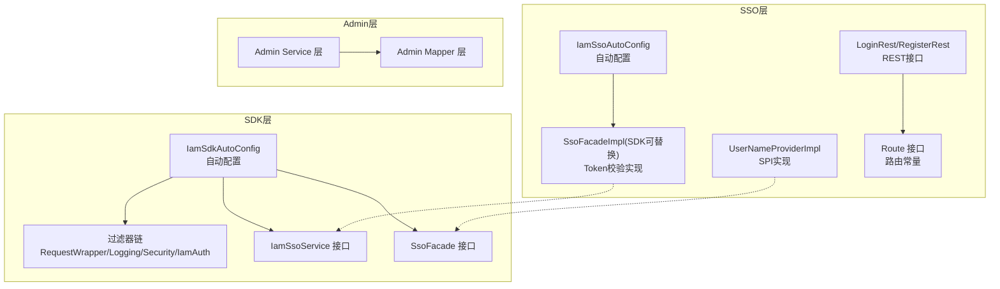
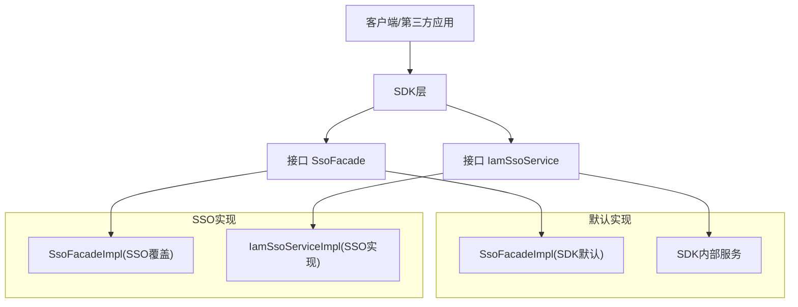
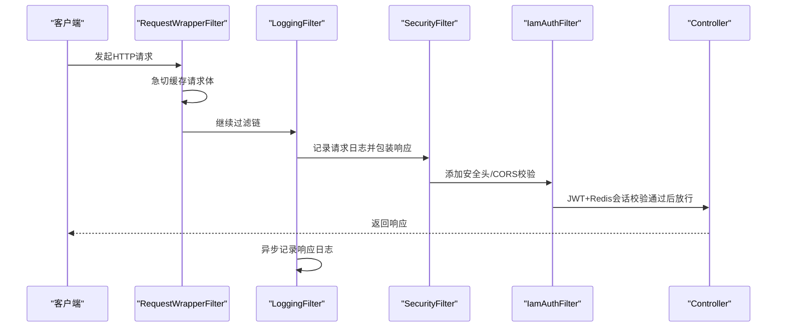
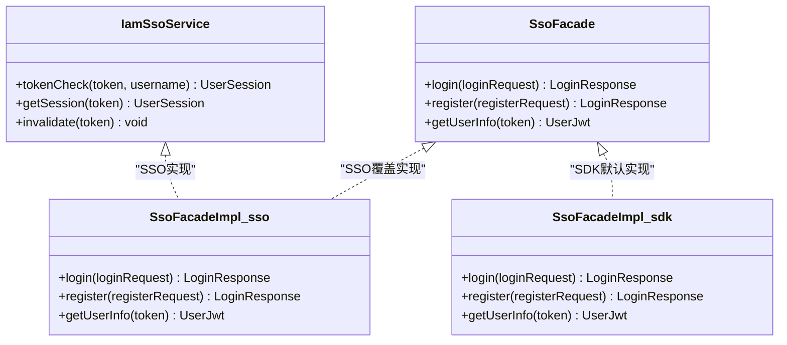
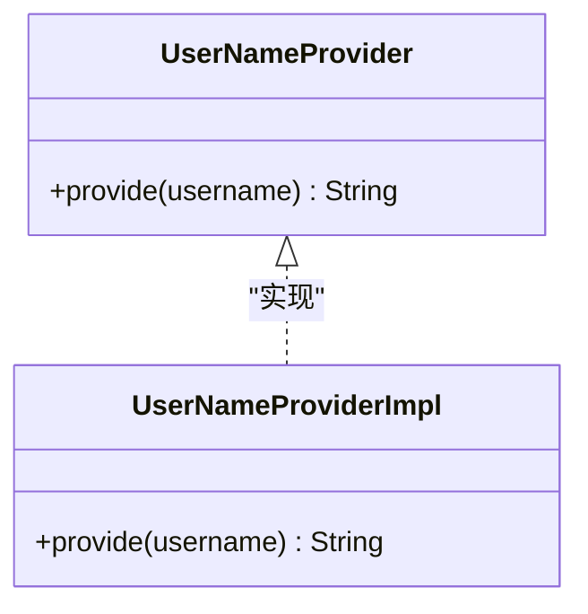
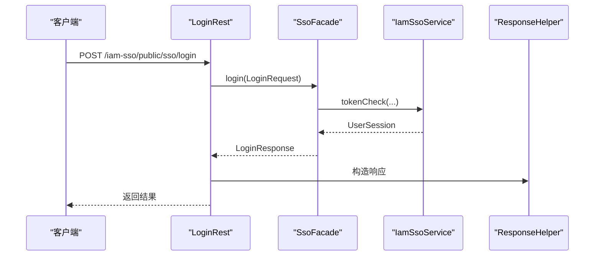
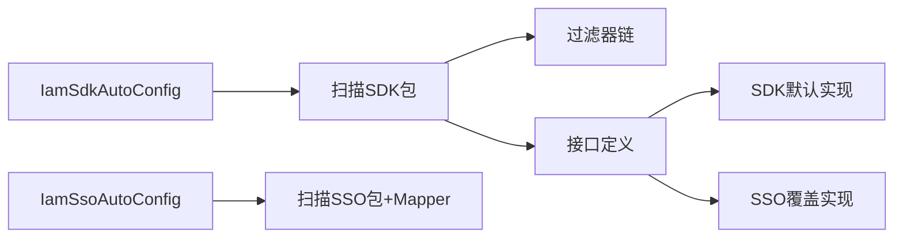

# 扩展开发

<cite>
**本文引用的文件**
- [IamSdkAutoConfig.java](file://iam-sdk/src/main/java/com/wkclz/iam/sdk/IamSdkAutoConfig.java)
- [IamSdkConfig.java](file://iam-sdk/src/main/java/com/wkclz/iam/sdk/config/IamSdkConfig.java)
- [IamAuthFilter.java](file://iam-sdk/src/main/java/com/wkclz/iam/sdk/filter/IamAuthFilter.java)
- [SecurityFilter.java](file://iam-sdk/src/main/java/com/wkclz/iam/sdk/filter/SecurityFilter.java)
- [SecurityConfig.java](file://iam-sdk/src/main/java/com/wkclz/iam/sdk/config/SecurityConfig.java)
- [IamSsoService.java](file://iam-sdk/src/main/java/com/wkclz/iam/sdk/service/IamSsoService.java)
- [SsoFacade.java](file://iam-sdk/src/main/java/com/wkclz/iam/sdk/facade/SsoFacade.java)
- [SsoFacadeImpl.java](file://iam-sdk/src/main/java/com/wkclz/iam/sdk/facade/impl/SsoFacadeImpl.java)
- [IamSsoAutoConfig.java](file://iam-sso/src/main/java/com/wkclz/iam/sso/IamSsoAutoConfig.java)
- [SsoFacadeImpl.java (sso)](file://iam-sso/src/main/java/com/wkclz/iam/sso/facade/SsoFacadeImpl.java)
- [UserNameProviderImpl.java](file://iam-sso/src/main/java/com/wkclz/iam/sso/spiimpl/UserNameProviderImpl.java)
- [Route.java (sso)](file://iam-sso/src/main/java/com/wkclz/iam/sso/Route.java)
- [LoginRest.java](file://iam-sso/src/main/java/com/wkclz/iam/sso/rest/LoginRest.java)
- [RegisterRest.java](file://iam-sso/src/main/java/com/wkclz/iam/sso/rest/RegisterRest.java)
- [LoginRequest.java](file://iam-sdk/src/main/java/com/wkclz/iam/sdk/model/LoginRequest.java)
- [RegisterRequest.java](file://iam-sdk/src/main/java/com/wkclz/iam/sdk/model/RegisterRequest.java)
- [LoginResponse.java](file://iam-sdk/src/main/java/com/wkclz/iam/sdk/model/LoginResponse.java)
- [UserSession.java](file://iam-sdk/src/main/java/com/wkclz/iam/sdk/model/UserSession.java)
- [UserJwt.java](file://iam-sdk/src/main/java/com/wkclz/iam/sdk/model/UserJwt.java)
- [JwtUtil.java](file://iam-sdk/src/main/java/com/wkclz/iam/sdk/util/JwtUtil.java)
- [SessionHelper.java](file://iam-sdk/src/main/java/com/wkclz/iam/sdk/helper/SessionHelper.java)
- [ResponseHelper.java](file://iam-sdk/src/main/java/com/wkclz/iam/sdk/helper/ResponseHelper.java)
- [ak-sign.md](file://docs/stories/STORY-013-sdk-auto-config.md)
- [security-filter.md](file://docs/stories/STORY-010-security-filter.md)
- [iam-auth-filter.md](file://docs/stories/STORY-007-iam-auth-filter.md)
- [sdk-skills.md](file://.trae/skills/iam-sdk/SKILL.md)
- [login-status.md](file://.trae/skills/iam-sdk/SKILL.md)
</cite>

## 目录
1. [简介](#简介)
2. [项目结构](#项目结构)
3. [核心组件](#核心组件)
4. [架构总览](#架构总览)
5. [详细组件分析](#详细组件分析)
6. [依赖关系分析](#依赖关系分析)
7. [性能考虑](#性能考虑)
8. [故障排查指南](#故障排查指南)
9. [结论](#结论)
10. [附录](#附录)

## 简介
本文件面向SH-IAM的扩展开发者，系统化阐述插件开发方法、自定义过滤器开发、SPI接口扩展以及第三方集成与自定义认证方式的实现路径。内容基于现有代码库中的自动配置、过滤器链、服务接口、SPI实现与路由定义，提供可操作的扩展点识别、接口设计与实现指南，并给出配置方法、测试策略与部署流程建议。

## 项目结构
SH-IAM采用多模块架构，围绕SDK、SSO、Admin三大模块协同工作：
- iam-sdk：提供自动配置、过滤器链、认证服务接口、辅助工具与模型定义
- iam-sso：提供SSO服务实现、路由、REST接口、SPI扩展点
- iam-admin：提供后台管理能力与MyBatis Mapper/Service
- iam-common：公共DTO/Entity/Helper

图表来源
- [IamSdkAutoConfig.java:1-13](file://iam-sdk/src/main/java/com/wkclz/iam/sdk/IamSdkAutoConfig.java#L1-L13)
- [IamSsoAutoConfig.java:1-13](file://iam-sso/src/main/java/com/wkclz/iam/sso/IamSsoAutoConfig.java#L1-L13)
- [IamSsoService.java](file://iam-sdk/src/main/java/com/wkclz/iam/sdk/service/IamSsoService.java)
- [SsoFacadeImpl.java](file://iam-sso/src/main/java/com/wkclz/iam/sso/facade/SsoFacadeImpl.java)
- [UserNameProviderImpl.java](file://iam-sso/src/main/java/com/wkclz/iam/sso/spiimpl/UserNameProviderImpl.java)
- [Route.java (sso)](file://iam-sso/src/main/java/com/wkclz/iam/sso/Route.java)

章节来源
- [IamSdkAutoConfig.java:1-13](file://iam-sdk/src/main/java/com/wkclz/iam/sdk/IamSdkAutoConfig.java#L1-L13)
- [IamSsoAutoConfig.java:1-13](file://iam-sso/src/main/java/com/wkclz/iam/sso/IamSsoAutoConfig.java#L1-L13)

## 核心组件
- 自动配置与扫描
  - SDK自动配置：基于条件注解启用，扫描SDK包并按需加载组件
  - SSO自动配置：扫描SSO包与Mapper扫描，提供服务实现
- 过滤器链
  - RequestWrapperFilter：急切缓存请求体，支持多次读取
  - LoggingFilter：请求/响应日志记录与异步持久化
  - SecurityFilter：安全响应头与CORS校验
  - IamAuthFilter：JWT与Redis会话双重校验
- 服务接口与SPI
  - IamSsoService：Token校验与会话查询
  - SsoFacade：可替换的SSO门面实现（SDK默认HTTP实现，SSO提供覆盖实现）
  - UserNameProviderImpl：用户名提供SPI实现
- 辅助工具与模型
  - JwtUtil、SessionHelper、ResponseHelper、UserJwt、UserSession等

章节来源
- [IamSdkAutoConfig.java:1-13](file://iam-sdk/src/main/java/com/wkclz/iam/sdk/IamSdkAutoConfig.java#L1-L13)
- [IamSsoAutoConfig.java:1-13](file://iam-sso/src/main/java/com/wkclz/iam/sso/IamSsoAutoConfig.java#L1-L13)
- [IamAuthFilter.java:1-36](file://iam-sdk/src/main/java/com/wkclz/iam/sdk/filter/IamAuthFilter.java#L1-L36)
- [IamSsoService.java](file://iam-sdk/src/main/java/com/wkclz/iam/sdk/service/IamSsoService.java)
- [SsoFacade.java](file://iam-sdk/src/main/java/com/wkclz/iam/sdk/facade/SsoFacade.java)
- [SsoFacadeImpl.java](file://iam-sdk/src/main/java/com/wkclz/iam/sdk/facade/impl/SsoFacadeImpl.java)
- [SsoFacadeImpl.java (sso)](file://iam-sso/src/main/java/com/wkclz/iam/sso/facade/SsoFacadeImpl.java)
- [UserNameProviderImpl.java](file://iam-sso/src/main/java/com/wkclz/iam/sso/spiimpl/UserNameProviderImpl.java)

## 架构总览
SDK与SSO通过接口契约解耦，支持在不同模块间替换实现，形成可插拔的扩展架构。

图表来源
- [IamSsoService.java](file://iam-sdk/src/main/java/com/wkclz/iam/sdk/service/IamSsoService.java)
- [SsoFacade.java](file://iam-sdk/src/main/java/com/wkclz/iam/sdk/facade/SsoFacade.java)
- [SsoFacadeImpl.java](file://iam-sdk/src/main/java/com/wkclz/iam/sdk/facade/impl/SsoFacadeImpl.java)
- [SsoFacadeImpl.java (sso)](file://iam-sso/src/main/java/com/wkclz/iam/sso/facade/SsoFacadeImpl.java)

## 详细组件分析

### 过滤器链与扩展点
过滤器链定义了请求处理的先后顺序与职责边界，是扩展自定义过滤器的最佳位置。

图表来源
- [sdk-skills.md:73-119](file://.trae/skills/iam-sdk/SKILL.md#L73-L119)
- [iam-auth-filter.md:1-47](file://docs/stories/STORY-007-iam-auth-filter.md#L1-L47)
- [security-filter.md:1-57](file://docs/stories/STORY-010-security-filter.md#L1-L57)

扩展开发指南
- 自定义过滤器开发
  - 选择合适顺序：若需在请求体读取前处理，参考RequestWrapperFilter的急切缓存模式；若需在鉴权后处理，参考IamAuthFilter之后的顺序
  - 保持OncePerRequestFilter语义，避免重复处理
  - 通过@Order精确控制执行顺序，遵循现有顺序：RequestWrapperFilter < LoggingFilter < SecurityFilter < IamAuthFilter
  - 对公开路径与健康检查路径进行跳过判断，避免影响性能与安全策略
- 配置方法
  - 通过配置项控制安全头与CORS行为，如allowed-origins、allowed-methods、allow-credentials等
  - 通过开关控制静态资源日志过滤与JWT密钥等敏感配置

章节来源
- [sdk-skills.md:73-119](file://.trae/skills/iam-sdk/SKILL.md#L73-L119)
- [iam-auth-filter.md:1-47](file://docs/stories/STORY-007-iam-auth-filter.md#L1-L47)
- [security-filter.md:1-57](file://docs/stories/STORY-010-security-filter.md#L1-L57)

### 认证与会话扩展（IamSsoService）
IamSsoService定义了Token校验与会话查询的核心接口，是实现自定义认证方式的关键扩展点。

图表来源
- [IamSsoService.java](file://iam-sdk/src/main/java/com/wkclz/iam/sdk/service/IamSsoService.java)
- [SsoFacade.java](file://iam-sdk/src/main/java/com/wkclz/iam/sdk/facade/SsoFacade.java)
- [SsoFacadeImpl.java](file://iam-sdk/src/main/java/com/wkclz/iam/sdk/facade/impl/SsoFacadeImpl.java)
- [SsoFacadeImpl.java (sso)](file://iam-sso/src/main/java/com/wkclz/iam/sso/facade/SsoFacadeImpl.java)

实现指南
- 替换默认实现：在SSO模块提供@Component实现，即可覆盖SDK默认的SsoFacadeImpl
- 自定义认证方式：通过扩展IamSsoService实现，结合JwtUtil与UserSession模型，实现LDAP/OIDC/自定义Token校验
- 会话管理：在实现中维护UserSession生命周期，包括创建、刷新与失效

章节来源
- [IamSsoService.java](file://iam-sdk/src/main/java/com/wkclz/iam/sdk/service/IamSsoService.java)
- [SsoFacadeImpl.java (sso)](file://iam-sso/src/main/java/com/wkclz/iam/sso/facade/SsoFacadeImpl.java)
- [login-status.md:303-342](file://.trae/skills/iam-sdk/SKILL.md#L303-L342)

### SPI接口扩展（用户名提供）
UserNameProviderImpl展示了SPI扩展的实现方式，可用于对接第三方身份源。

图表来源
- [UserNameProviderImpl.java](file://iam-sso/src/main/java/com/wkclz/iam/sso/spiimpl/UserNameProviderImpl.java)

实现指南
- 定义SPI接口并在模块中暴露实现
- 通过条件装配或自动配置扫描机制接入
- 注意与IamSsoService的协作，确保用户名解析与认证流程一致

章节来源
- [UserNameProviderImpl.java](file://iam-sso/src/main/java/com/wkclz/iam/sso/spiimpl/UserNameProviderImpl.java)

### 第三方集成与业务逻辑扩展
- REST接口扩展：通过新增REST控制器与路由常量，扩展登录、注册、用户信息等业务接口
- 数据访问扩展：在Admin模块中新增Mapper/Service，遵循BaseService模式，完成业务数据的增删改查
- 路由与常量：在Route接口中新增常量，统一管理REST路径

图表来源
- [LoginRest.java](file://iam-sso/src/main/java/com/wkclz/iam/sso/rest/LoginRest.java)
- [RegisterRest.java](file://iam-sso/src/main/java/com/wkclz/iam/sso/rest/RegisterRest.java)
- [Route.java (sso)](file://iam-sso/src/main/java/com/wkclz/iam/sso/Route.java)
- [SsoFacade.java](file://iam-sdk/src/main/java/com/wkclz/iam/sdk/facade/SsoFacade.java)
- [IamSsoService.java](file://iam-sdk/src/main/java/com/wkclz/iam/sdk/service/IamSsoService.java)
- [ResponseHelper.java](file://iam-sdk/src/main/java/com/wkclz/iam/sdk/helper/ResponseHelper.java)

章节来源
- [LoginRest.java](file://iam-sso/src/main/java/com/wkclz/iam/sso/rest/LoginRest.java)
- [RegisterRest.java](file://iam-sso/src/main/java/com/wkclz/iam/sso/rest/RegisterRest.java)
- [Route.java (sso)](file://iam-sso/src/main/java/com/wkclz/iam/sso/Route.java)

## 依赖关系分析
SDK与SSO通过接口契约解耦，自动配置负责组件扫描与条件启用，过滤器链提供横切安全与日志能力。

图表来源
- [IamSdkAutoConfig.java:1-13](file://iam-sdk/src/main/java/com/wkclz/iam/sdk/IamSdkAutoConfig.java#L1-L13)
- [IamSsoAutoConfig.java:1-13](file://iam-sso/src/main/java/com/wkclz/iam/sso/IamSsoAutoConfig.java#L1-L13)

章节来源
- [IamSdkAutoConfig.java:1-13](file://iam-sdk/src/main/java/com/wkclz/iam/sdk/IamSdkAutoConfig.java#L1-L13)
- [IamSsoAutoConfig.java:1-13](file://iam-sso/src/main/java/com/wkclz/iam/sso/IamSsoAutoConfig.java#L1-L13)

## 性能考虑
- 过滤器链顺序：确保日志与安全头在鉴权之前执行，减少不必要的鉴权开销
- 请求体缓存：RequestWrapperFilter采用急切缓存，避免后续读取失败导致的重试与异常
- 会话校验：IamAuthFilter对JWT与Redis会话进行双重校验，建议Redis连接池与超时配置合理化
- 静态资源：通过配置开关控制静态资源的日志过滤，降低IO压力

## 故障排查指南
- 鉴权失败
  - 检查Token提取逻辑与前缀处理，确认Authorization头与token头的优先级
  - 核对JWT签名与过期时间，使用JwtUtil进行验证
  - 确认Redis会话存在且未失效
- CORS与安全头
  - 校验allowed-origins配置，确保Origin在白名单内或包含通配符
  - 检查安全头开关与CSRF配置
- 日志与异常
  - 通过ResponseHelper构造标准化错误响应
  - 检查LoggingFilter的异步日志是否正常写入

章节来源
- [iam-auth-filter.md:1-47](file://docs/stories/STORY-007-iam-auth-filter.md#L1-L47)
- [security-filter.md:1-57](file://docs/stories/STORY-010-security-filter.md#L1-L57)
- [ResponseHelper.java](file://iam-sdk/src/main/java/com/wkclz/iam/sdk/helper/ResponseHelper.java)

## 结论
SH-IAM提供了清晰的扩展架构：通过自动配置、过滤器链、接口契约与SPI实现，开发者可以灵活地扩展认证方式、集成第三方系统并定制业务逻辑。建议在实现扩展时严格遵循现有顺序与配置约定，确保安全性与性能。

## 附录

### 扩展开发清单
- 插件开发
  - 定义自动配置与组件扫描范围
  - 通过条件注解启用/禁用扩展
- 自定义过滤器
  - 选择合适@Order，避免与现有过滤器冲突
  - 明确跳过规则（公开路径/健康检查）
- SPI接口扩展
  - 实现SPI接口并提供组件实现
  - 与IamSsoService协作，确保认证一致性
- 第三方集成
  - 新增REST接口与路由常量
  - 通过SsoFacade与IamSsoService对接
- 配置方法
  - 使用配置键前缀与开关控制
  - 生产环境强制校验敏感配置
- 测试策略
  - 单元测试：过滤器链顺序、JWT校验、CORS校验
  - 集成测试：IamSsoService实现替换、会话生命周期
- 部署流程
  - 通过Dockerfile与部署YAML进行容器化部署
  - 环境变量与配置文件分离，确保生产安全

章节来源
- [ak-sign.md:32-52](file://docs/stories/STORY-013-sdk-auto-config.md#L32-L52)
- [sdk-skills.md:47-119](file://.trae/skills/iam-sdk/SKILL.md#L47-L119)
- [login-status.md:303-342](file://.trae/skills/iam-sdk/SKILL.md#L303-L342)