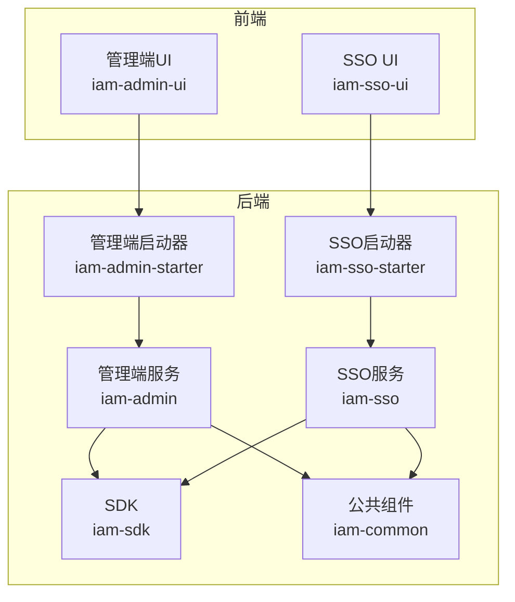
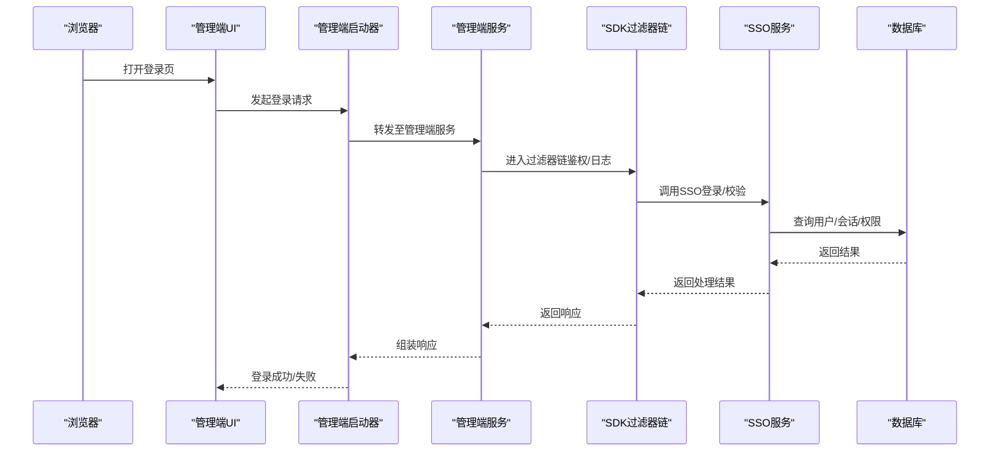
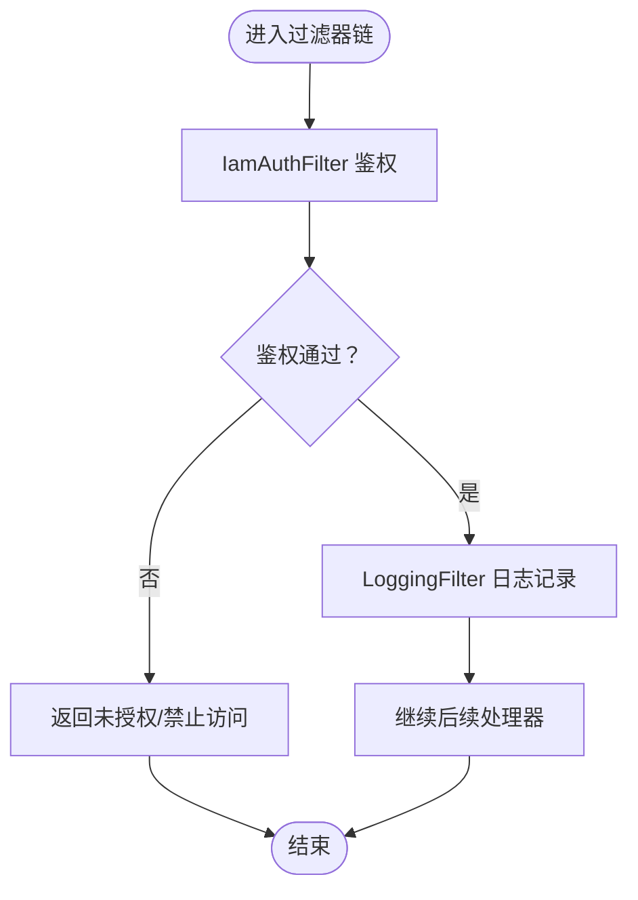
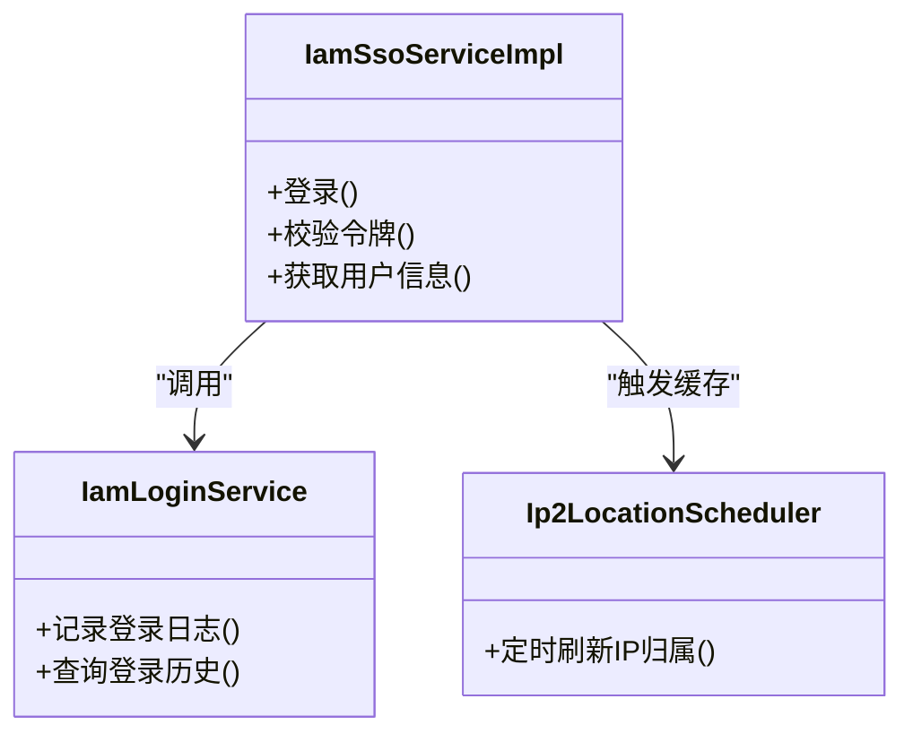
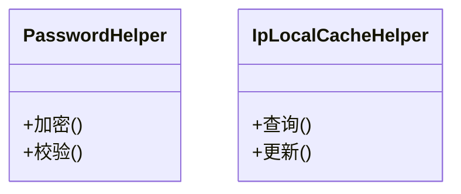
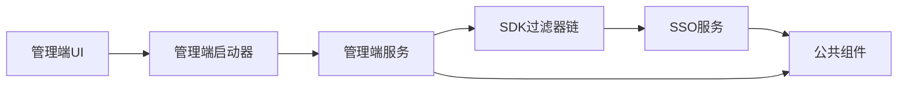

# 故障排除

<cite>
**本文引用的文件**
- [application.yml（管理端）](file://iam-admin-starter/src/main/resources/config/application.yml)
- [application.yml（SSO）](file://iam-sso-starter/src/main/resources/config/application.yml)
- [Dockerfile（管理端）](file://iam-admin-starter/Dockerfile)
- [Dockerfile（管理端UI）](file://iam-admin-ui/Dockerfile)
- [deploy-uat.yaml（管理端）](file://iam-admin-starter/deploy-uat.yaml)
- [deploy-uat.yaml（管理端UI）](file://iam-admin-ui/deploy-uat.yaml)
- [IamAdminApplication.java](file://iam-admin-starter/src/main/java/com/wkclz/iam/admin/starter/IamAdminApplication.java)
- [IamSsoApplication.java](file://iam-sso-starter/src/main/java/com/wkclz/iam/sso/starter/IamSsoApplication.java)
- [IamAuthFilter.java](file://iam-sdk/src/main/java/com/wkclz/iam/sdk/filter/IamAuthFilter.java)
- [LoggingFilter.java](file://iam-sdk/src/main/java/com/wkclz/iam/sdk/filter/LoggingFilter.java)
- [IamSsoServiceImpl.java](file://iam-sso/src/main/java/com/wkclz/iam/sso/service/IamSsoServiceImpl.java)
- [IamLoginService.java](file://iam-sso/src/main/java/com/wkclz/iam/sso/service/IamLoginService.java)
- [Ip2LocationScheduler.java](file://iam-sso/src/main/java/com/wkclz/iam/sso/schedule/Ip2LocationScheduler.java)
- [IpLocalCacheHelper.java](file://iam-common/src/main/java/com/wkclz/iam/common/helper/IpLocalCacheHelper.java)
- [PasswordHelper.java](file://iam-common/src/main/java/com/wkclz/iam/common/helper/PasswordHelper.java)
- [JwtUtil.java](file://iam-sdk/src/main/java/com/wkclz/iam/sdk/util/JwtUtil.java)
- [loginlog.js](file://iam-admin-ui/src/api/log/loginlog.js)
- [requestlog.js](file://iam-admin-ui/src/api/log/requestlog.js)
- [login.vue（管理端UI）](file://iam-admin-ui/src/views/login.vue)
- [login.vue（SSO UI）](file://iam-sso-ui/src/views/login.vue)
- [logback-spring.xml](file://iam-admin-starter/src/main/resources/logback-spring.xml)
- [README.md（项目总览）](file://README.md)
</cite>

## 目录
1. 引言
2. 项目结构
3. 核心组件
4. 架构总览
5. 详细组件分析
6. 依赖关系分析
7. 性能考虑
8. 故障排除指南
9. 结论
10. 附录

## 引言
本故障排除与FAQ文档面向系统管理员与开发者，聚焦SH-IAM项目的部署、认证与性能问题，提供可操作的诊断步骤、日志分析方法、调试技巧与紧急处理流程。文档基于仓库中的实际代码与配置文件进行梳理，确保每一条建议均可追溯到具体实现或配置位置。

## 项目结构
SH-IAM采用多模块分层设计：公共组件（iam-common）、SDK（iam-sdk）、SSO服务（iam-sso）、管理端服务（iam-admin）、以及对应的启动器与前端UI。各模块通过Spring Boot自动装配与配置文件协同工作；部署方面提供Dockerfile与Kubernetes YAML示例。

**章节来源**
- [README.md（项目总览）](file://README.md)

## 核心组件
- 管理端与SSO启动器：负责应用启动、配置加载与容器化部署。
- SDK过滤器链：统一鉴权、日志与请求包装。
- SSO服务层：登录、会话、资源与定时任务（IP归属缓存）。
- 公共组件：密码与IP本地缓存辅助类。
- 前端UI：登录页与日志查询接口对接。

**章节来源**
- [IamAdminApplication.java](file://iam-admin-starter/src/main/java/com/wkclz/iam/admin/starter/IamAdminApplication.java)
- [IamSsoApplication.java](file://iam-sso-starter/src/main/java/com/wkclz/iam/sso/starter/IamSsoApplication.java)
- [IamAuthFilter.java](file://iam-sdk/src/main/java/com/wkclz/iam/sdk/filter/IamAuthFilter.java)
- [LoggingFilter.java](file://iam-sdk/src/main/java/com/wkclz/iam/sdk/filter/LoggingFilter.java)
- [IamSsoServiceImpl.java](file://iam-sso/src/main/java/com/wkclz/iam/sso/service/IamSsoServiceImpl.java)
- [IamLoginService.java](file://iam-sso/src/main/java/com/wkclz/iam/sso/service/IamLoginService.java)
- [Ip2LocationScheduler.java](file://iam-sso/src/main/java/com/wkclz/iam/sso/schedule/Ip2LocationScheduler.java)
- [IpLocalCacheHelper.java](file://iam-common/src/main/java/com/wkclz/iam/common/helper/IpLocalCacheHelper.java)
- [PasswordHelper.java](file://iam-common/src/main/java/com/wkclz/iam/common/helper/PasswordHelper.java)
- [JwtUtil.java](file://iam-sdk/src/main/java/com/wkclz/iam/sdk/util/JwtUtil.java)

## 架构总览
下图展示从浏览器到后端服务的关键交互路径，包括认证过滤、日志记录与服务调用。

**图表来源**
- [IamAuthFilter.java](file://iam-sdk/src/main/java/com/wkclz/iam/sdk/filter/IamAuthFilter.java)
- [LoggingFilter.java](file://iam-sdk/src/main/java/com/wkclz/iam/sdk/filter/LoggingFilter.java)
- [IamSsoServiceImpl.java](file://iam-sso/src/main/java/com/wkclz/iam/sso/service/IamSsoServiceImpl.java)
- [IamLoginService.java](file://iam-sso/src/main/java/com/wkclz/iam/sso/service/IamLoginService.java)

## 详细组件分析

### 认证过滤链（IamAuthFilter 与 LoggingFilter）
- IamAuthFilter：负责统一鉴权拦截与上下文注入，是认证问题定位的核心入口。
- LoggingFilter：记录请求/响应日志，便于追踪请求链路与异常。

**图表来源**
- [IamAuthFilter.java](file://iam-sdk/src/main/java/com/wkclz/iam/sdk/filter/IamAuthFilter.java)
- [LoggingFilter.java](file://iam-sdk/src/main/java/com/wkclz/iam/sdk/filter/LoggingFilter.java)

**章节来源**
- [IamAuthFilter.java](file://iam-sdk/src/main/java/com/wkclz/iam/sdk/filter/IamAuthFilter.java)
- [LoggingFilter.java](file://iam-sdk/src/main/java/com/wkclz/iam/sdk/filter/LoggingFilter.java)

### SSO登录与会话服务
- IamSsoServiceImpl：封装SSO登录、令牌校验等核心逻辑。
- IamLoginService：登录流程与登录日志持久化。
- 定时任务：Ip2LocationScheduler 负责IP归属缓存更新。

**图表来源**
- [IamSsoServiceImpl.java](file://iam-sso/src/main/java/com/wkclz/iam/sso/service/IamSsoServiceImpl.java)
- [IamLoginService.java](file://iam-sso/src/main/java/com/wkclz/iam/sso/service/IamLoginService.java)
- [Ip2LocationScheduler.java](file://iam-sso/src/main/java/com/wkclz/iam/sso/schedule/Ip2LocationScheduler.java)

**章节来源**
- [IamSsoServiceImpl.java](file://iam-sso/src/main/java/com/wkclz/iam/sso/service/IamSsoServiceImpl.java)
- [IamLoginService.java](file://iam-sso/src/main/java/com/wkclz/iam/sso/service/IamLoginService.java)
- [Ip2LocationScheduler.java](file://iam-sso/src/main/java/com/wkclz/iam/sso/schedule/Ip2LocationScheduler.java)

### 密码与IP本地缓存
- PasswordHelper：密码加密/校验辅助。
- IpLocalCacheHelper：IP归属本地缓存辅助。

**图表来源**
- [PasswordHelper.java](file://iam-common/src/main/java/com/wkclz/iam/common/helper/PasswordHelper.java)
- [IpLocalCacheHelper.java](file://iam-common/src/main/java/com/wkclz/iam/common/helper/IpLocalCacheHelper.java)

**章节来源**
- [PasswordHelper.java](file://iam-common/src/main/java/com/wkclz/iam/common/helper/PasswordHelper.java)
- [IpLocalCacheHelper.java](file://iam-common/src/main/java/com/wkclz/iam/common/helper/IpLocalCacheHelper.java)

### JWT 工具
- JwtUtil：令牌生成与解析工具，用于登录态与跨域场景。

**章节来源**
- [JwtUtil.java](file://iam-sdk/src/main/java/com/wkclz/iam/sdk/util/JwtUtil.java)

### 前端登录与日志查询
- 管理端UI登录页与SSO UI登录页分别对接不同后端。
- 管理端UI通过 loginlog.js 与 requestlog.js 查询登录与请求日志。

**章节来源**
- [login.vue（管理端UI）](file://iam-admin-ui/src/views/login.vue)
- [login.vue（SSO UI）](file://iam-sso-ui/src/views/login.vue)
- [loginlog.js](file://iam-admin-ui/src/api/log/loginlog.js)
- [requestlog.js](file://iam-admin-ui/src/api/log/requestlog.js)

## 依赖关系分析
- 模块耦合：iam-admin 与 iam-sso 通过 SDK 过滤器链与服务接口交互；公共组件被两者复用。
- 外部依赖：数据库、缓存与定时任务由 SSO 层负责；前端通过REST接口访问后端。

**图表来源**
- [IamAdminApplication.java](file://iam-admin-starter/src/main/java/com/wkclz/iam/admin/starter/IamAdminApplication.java)
- [IamSsoApplication.java](file://iam-sso-starter/src/main/java/com/wkclz/iam/sso/starter/IamSsoApplication.java)
- [IamAuthFilter.java](file://iam-sdk/src/main/java/com/wkclz/iam/sdk/filter/IamAuthFilter.java)
- [IamSsoServiceImpl.java](file://iam-sso/src/main/java/com/wkclz/iam/sso/service/IamSsoServiceImpl.java)

## 性能考虑
- 过滤器链开销：IamAuthFilter 与 LoggingFilter 在高并发下应避免阻塞操作，建议将耗时逻辑异步化或缓存化。
- IP归属缓存：定时刷新策略需评估频率与批量更新策略，降低数据库压力。
- 密码校验：使用硬件加速或优化算法参数，减少CPU占用。
- 日志级别：生产环境建议调整日志级别，避免过多IO开销。

[本节为通用指导，无需列出章节来源]

## 故障排除指南

### 一、部署问题排查
- 症状：容器启动失败或端口冲突
  - 排查要点：
    - 检查容器镜像构建是否成功，确认Dockerfile中WORKDIR与COPY命令正确。
    - 查看部署YAML中的端口映射与服务暴露配置。
    - 核对application.yml中的端口与数据库连接配置。
  - 可能原因：
    - 端口被占用或未开放
    - 数据库连接串错误或网络不可达
    - 配置文件未生效（检查spring.profiles.active）
  - 修复建议：
    - 更换端口或释放占用端口
    - 使用ping/nc验证数据库连通性
    - 将配置文件打包进镜像或挂载卷

- 症状：Pod反复重启（K8s）
  - 排查要点：
    - 查看容器日志与事件，定位启动异常
    - 检查资源限制与健康检查探针
  - 可能原因：
    - 内存/CPU不足
    - 健康检查超时
  - 修复建议：
    - 提升资源配额或优化启动参数
    - 调整探针超时与重试次数

**章节来源**
- [Dockerfile（管理端）](file://iam-admin-starter/Dockerfile)
- [Dockerfile（管理端UI）](file://iam-admin-ui/Dockerfile)
- [deploy-uat.yaml（管理端）](file://iam-admin-starter/deploy-uat.yaml)
- [deploy-uat.yaml（管理端UI）](file://iam-admin-ui/deploy-uat.yaml)
- [application.yml（管理端）](file://iam-admin-starter/src/main/resources/config/application.yml)
- [application.yml（SSO）](file://iam-sso-starter/src/main/resources/config/application.yml)

### 二、认证问题排查
- 症状：登录失败或提示未授权
  - 排查要点：
    - 检查IamAuthFilter是否拦截到请求并执行鉴权
    - 核对JWT生成与解析逻辑（JwtUtil）
    - 确认登录接口调用链路与IamSsoServiceImpl
  - 可能原因：
    - 用户名/密码错误
    - 令牌过期或签名不匹配
    - 会话状态异常
  - 修复建议：
    - 核对凭据与账户状态
    - 重新签发令牌或延长有效期
    - 清理会话缓存后重试

- 症状：跨域或CORS报错
  - 排查要点：
    - 检查前端域名与后端CORS配置
    - 确认预检请求是否放行
  - 可能原因：
    - 域名未加入白名单
  - 修复建议：
    - 在后端增加允许的源列表

**章节来源**
- [IamAuthFilter.java](file://iam-sdk/src/main/java/com/wkclz/iam/sdk/filter/IamAuthFilter.java)
- [JwtUtil.java](file://iam-sdk/src/main/java/com/wkclz/iam/sdk/util/JwtUtil.java)
- [IamSsoServiceImpl.java](file://iam-sso/src/main/java/com/wkclz/iam/sso/service/IamSsoServiceImpl.java)
- [login.vue（管理端UI）](file://iam-admin-ui/src/views/login.vue)
- [login.vue（SSO UI）](file://iam-sso-ui/src/views/login.vue)

### 三、性能问题诊断
- 症状：登录/查询响应慢
  - 排查要点：
    - 分析过滤器链耗时（IamAuthFilter、LoggingFilter）
    - 检查数据库慢查询与索引缺失
    - 观察IP归属缓存刷新频率（Ip2LocationScheduler）
  - 可能原因：
    - 缓存未命中导致频繁DB查询
    - 过滤器内存在同步阻塞操作
  - 修复建议：
    - 增加缓存命中率与批量刷新
    - 将非关键逻辑异步化

**章节来源**
- [IamAuthFilter.java](file://iam-sdk/src/main/java/com/wkclz/iam/sdk/filter/IamAuthFilter.java)
- [LoggingFilter.java](file://iam-sdk/src/main/java/com/wkclz/iam/sdk/filter/LoggingFilter.java)
- [Ip2LocationScheduler.java](file://iam-sso/src/main/java/com/wkclz/iam/sso/schedule/Ip2LocationScheduler.java)

### 四、日志分析方法与调试技巧
- 日志位置与级别：
  - 管理端启动器使用logback-spring.xml配置日志输出，建议在问题定位阶段临时提升DEBUG级别。
- 关键日志点：
  - IamAuthFilter：记录请求进入与鉴权结果
  - LoggingFilter：记录请求头、URI与响应状态
  - IamLoginService：记录登录时间、IP与结果
- 调试技巧：
  - 使用前端日志查询接口（loginlog.js、requestlog.js）回溯请求链路
  - 在高并发场景下开启采样日志，避免日志风暴

**章节来源**
- [logback-spring.xml](file://iam-admin-starter/src/main/resources/logback-spring.xml)
- [IamAuthFilter.java](file://iam-sdk/src/main/java/com/wkclz/iam/sdk/filter/IamAuthFilter.java)
- [LoggingFilter.java](file://iam-sdk/src/main/java/com/wkclz/iam/sdk/filter/LoggingFilter.java)
- [IamLoginService.java](file://iam-sso/src/main/java/com/wkclz/iam/sso/service/IamLoginService.java)
- [loginlog.js](file://iam-admin-ui/src/api/log/loginlog.js)
- [requestlog.js](file://iam-admin-ui/src/api/log/requestlog.js)

### 五、紧急处理流程
- 步骤1：快速降级
  - 临时关闭非关键定时任务（如IP归属缓存刷新）
  - 降低日志级别以减少IO
- 步骤2：隔离问题
  - 将受影响实例摘除流量，观察其他实例是否稳定
- 步骤3：回滚与修复
  - 回滚到上一个稳定版本
  - 修复配置或代码缺陷后灰度发布
- 步骤4：恢复监控
  - 恢复全量日志与告警
  - 持续观察指标（QPS、P95、错误率）

**章节来源**
- [Ip2LocationScheduler.java](file://iam-sso/src/main/java/com/wkclz/iam/sso/schedule/Ip2LocationScheduler.java)
- [logback-spring.xml](file://iam-admin-starter/src/main/resources/logback-spring.xml)

### 六、常见错误与处理建议
- 错误类型：数据库连接失败
  - 可能原因：连接串错误、网络不通、账号密码错误
  - 处理建议：核对application.yml中的数据库配置，使用telnet/nc测试端口连通性
- 错误类型：鉴权失败
  - 可能原因：令牌过期、签名不一致、用户被禁用
  - 处理建议：重新登录获取新令牌，检查用户状态
- 错误类型：IP归属查询异常
  - 可能原因：缓存未初始化、定时任务未运行
  - 处理建议：手动触发一次缓存刷新，检查调度器状态

**章节来源**
- [application.yml（管理端）](file://iam-admin-starter/src/main/resources/config/application.yml)
- [application.yml（SSO）](file://iam-sso-starter/src/main/resources/config/application.yml)
- [IamAuthFilter.java](file://iam-sdk/src/main/java/com/wkclz/iam/sdk/filter/IamAuthFilter.java)
- [Ip2LocationScheduler.java](file://iam-sso/src/main/java/com/wkclz/iam/sso/schedule/Ip2LocationScheduler.java)

## 结论
本指南围绕部署、认证与性能三大维度提供了可落地的排障步骤与最佳实践。建议在日常运维中结合前端日志查询接口与后端过滤器链日志，形成“前端定位—后端过滤器—服务层核对”的闭环排查流程，并通过缓存与异步化手段持续优化系统性能。

## 附录
- 快速检查清单
  - 配置文件：application.yml、deploy-uat.yaml、Dockerfile
  - 过滤器链：IamAuthFilter、LoggingFilter
  - 服务层：IamSsoServiceImpl、IamLoginService、Ip2LocationScheduler
  - 公共组件：PasswordHelper、IpLocalCacheHelper
  - 前端：登录页与日志查询接口

[本节为通用附录，无需列出章节来源]