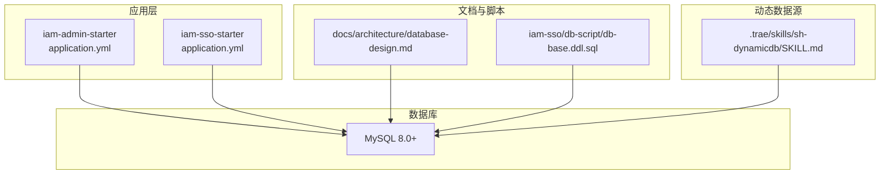
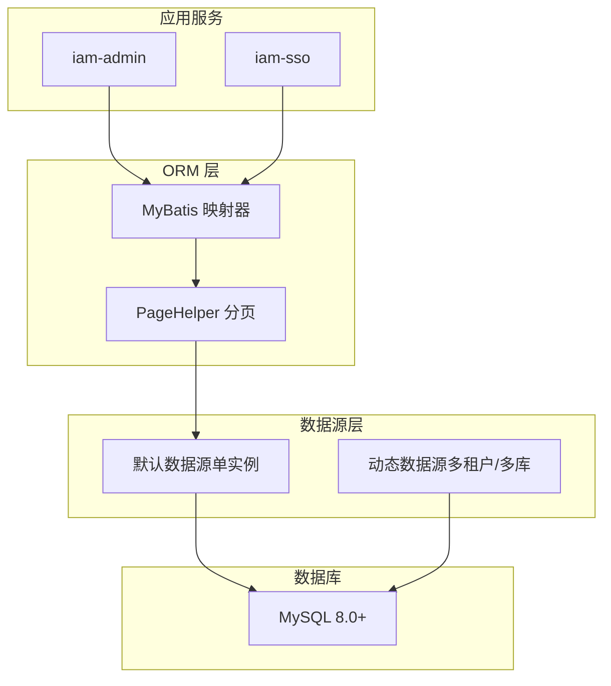
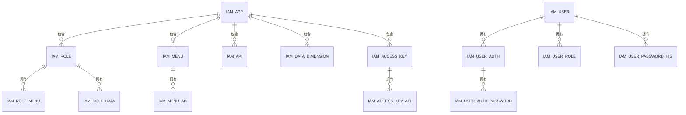
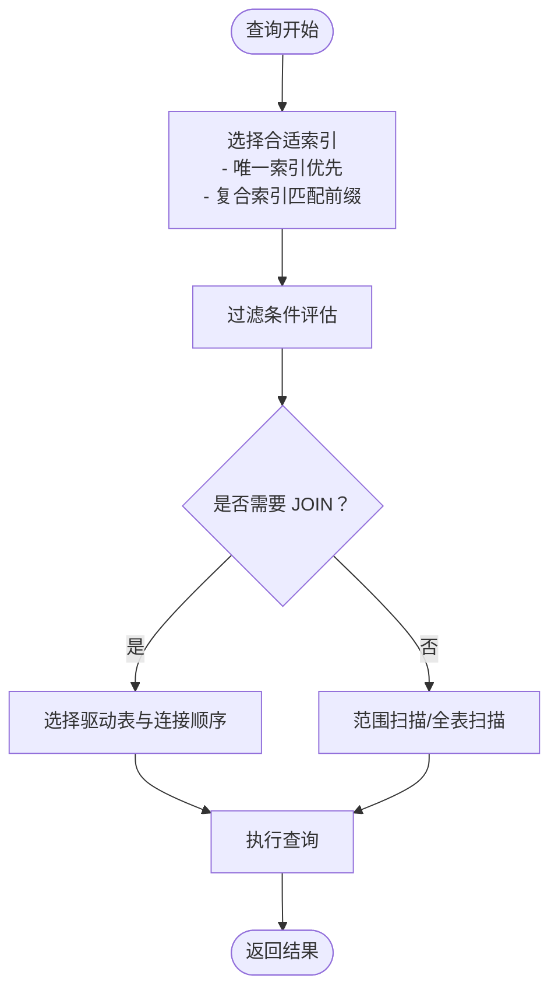
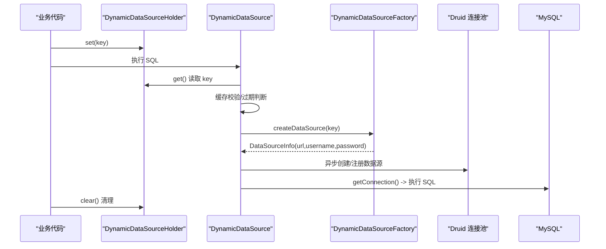
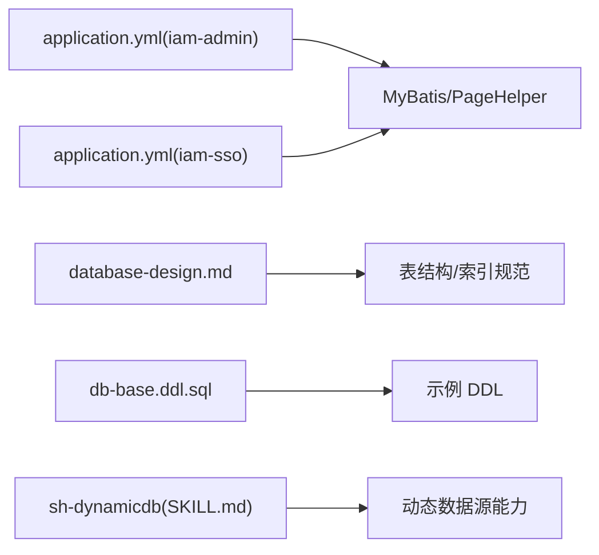

# 数据库架构设计

<cite>
**本文档引用的文件**
- [database-design.md](file://docs/architecture/database-design.md)
- [application.yml（iam-admin-starter）](file://iam-admin-starter/src/main/resources/config/application.yml)
- [application.yml（iam-sso-starter）](file://iam-sso-starter/src/main/resources/config/application.yml)
- [db-base.ddl.sql（iam-sso）](file://iam-sso/src/main/resources/db-script/db-base.ddl.sql)
- [SKILL.md（sh-dynamicdb）](file://.trae/skills/sh-dynamicdb/SKILL.md)
</cite>

## 目录
1. [简介](#简介)
2. [项目结构](#项目结构)
3. [核心组件](#核心组件)
4. [架构总览](#架构总览)
5. [详细组件分析](#详细组件分析)
6. [依赖分析](#依赖分析)
7. [性能考虑](#性能考虑)
8. [故障排查指南](#故障排查指南)
9. [结论](#结论)
10. [附录](#附录)

## 简介
本文件面向 SH-IAM 的数据库架构设计，系统性阐述整体数据库设计思路、表结构组织与存储策略；明确数据库选型（MySQL 8.0+）、版本要求与关键配置参数；解释动态数据源与租户隔离能力；给出索引设计原则与查询优化建议；并覆盖备份恢复、监控告警与容量规划要点，以及数据安全与访问控制策略。

## 项目结构
- 数据库相关文档集中在 docs/architecture/database-design.md，定义了表结构、ER 关系、字段约定与索引设计。
- 应用层配置位于各模块 starter 的 application.yml，统一声明 MySQL 驱动与分页插件方言。
- 示例 DDL 位于 iam-sso 模块的 db-script，展示系统字段与示例表结构。
- 动态数据源能力通过 .trae/skills/sh-dynamicdb/SKILL.md 描述，支撑多租户/多数据源场景。

**图表来源**
- [application.yml（iam-admin-starter）:1-52](file://iam-admin-starter/src/main/resources/config/application.yml#L1-L52)
- [application.yml（iam-sso-starter）:1-52](file://iam-sso-starter/src/main/resources/config/application.yml#L1-L52)
- [database-design.md:1-191](file://docs/architecture/database-design.md#L1-L191)
- [db-base.ddl.sql（iam-sso）:1-21](file://iam-sso/src/main/resources/db-script/db-base.ddl.sql#L1-L21)
- [SKILL.md（sh-dynamicdb）:1-175](file://.trae/skills/sh-dynamicdb/SKILL.md#L1-L175)

**章节来源**
- [database-design.md:1-191](file://docs/architecture/database-design.md#L1-L191)
- [application.yml（iam-admin-starter）:1-52](file://iam-admin-starter/src/main/resources/config/application.yml#L1-L52)
- [application.yml（iam-sso-starter）:1-52](file://iam-sso-starter/src/main/resources/config/application.yml#L1-L52)
- [db-base.ddl.sql（iam-sso）:1-21](file://iam-sso/src/main/resources/db-script/db-base.ddl.sql#L1-L21)
- [SKILL.md（sh-dynamicdb）:1-175](file://.trae/skills/sh-dynamicdb/SKILL.md#L1-L175)

## 核心组件
- 数据库选型与版本
  - 选型：MySQL 8.0+
  - 驱动：com.mysql.cj.jdbc.Driver
  - 分页方言：mysql
- 配置参数
  - MyBatis：开启下划线转驼峰映射
  - PageHelper：设置方言为 mysql，启用合理分页与参数传递
  - Actuator：独立端口暴露健康检查与指标
- 表结构与字段约定
  - 统一系统字段：id、sort、create_time、create_by、update_time、update_by、remark、version、deleted
  - 逻辑删除与乐观锁：deleted（TINYINT）、version（INT）
- ER 关系
  - 应用贯穿角色、菜单、API、数据维度与访问密钥
  - 用户通过认证方式与密码凭据关联，同时维护密码历史
  - 角色与菜单、API、数据维度建立多对多关系

**章节来源**
- [database-design.md:3-62](file://docs/architecture/database-design.md#L3-L62)
- [database-design.md:46-61](file://docs/architecture/database-design.md#L46-L61)
- [database-design.md:62-82](file://docs/architecture/database-design.md#L62-L82)
- [application.yml（iam-admin-starter）:9-25](file://iam-admin-starter/src/main/resources/config/application.yml#L9-L25)
- [application.yml（iam-sso-starter）:9-25](file://iam-sso-starter/src/main/resources/config/application.yml#L9-L25)

## 架构总览
SH-IAM 的数据库层采用“统一 MySQL + 动态数据源”的混合架构：
- 单实例部署：默认使用单一 MySQL 实例，MyBatis + PageHelper 提供 ORM 与分页能力。
- 多租户/多数据源：通过 sh-dynamicdb 动态数据源模块按需切换数据源，实现租户级隔离或跨库聚合。
- 安全与治理：统一系统字段与逻辑删除，结合 Actuator 指标与健康探针，便于运维监控。

**图表来源**
- [application.yml（iam-admin-starter）:14-25](file://iam-admin-starter/src/main/resources/config/application.yml#L14-L25)
- [application.yml（iam-sso-starter）:14-25](file://iam-sso-starter/src/main/resources/config/application.yml#L14-L25)
- [SKILL.md（sh-dynamicdb）:120-127](file://.trae/skills/sh-dynamicdb/SKILL.md#L120-L127)

## 详细组件分析

### 表结构与 ER 关系
- 基础实体表：用户、角色、菜单、API、应用、访问密钥、数据维度
- 关联关系表：用户-角色、角色-菜单、菜单-API、访问密钥-API、角色-数据维度
- 用户认证表：用户认证方式、密码凭据、密码历史
- 日志表：登录日志、请求日志

**图表来源**
- [database-design.md:62-82](file://docs/architecture/database-design.md#L62-L82)

**章节来源**
- [database-design.md:7-45](file://docs/architecture/database-design.md#L7-L45)
- [database-design.md:84-191](file://docs/architecture/database-design.md#L84-L191)

### 索引设计与查询优化
- 用户表：唯一索引（userCode、username），辅助索引（userStatus）
- 角色表：唯一索引（roleCode），辅助索引（appCode、parentCode）
- 菜单表：唯一索引（menuCode），辅助索引（appCode、parentCode、menuType）
- API 表：唯一索引（apiCode），复合索引（appCode、apiUri、apiMethod）
- 关联表：在多字段组合上建立单列或复合索引，确保 JOIN 与过滤效率

**图表来源**
- [database-design.md:134-165](file://docs/architecture/database-design.md#L134-L165)

**章节来源**
- [database-design.md:134-165](file://docs/architecture/database-design.md#L134-L165)

### 动态数据源与多租户隔离
- 工作原理
  - 基于 AbstractRoutingDataSource 扩展，运行时从 ThreadLocal 读取数据源 key
  - DCL 双重检查 + 异步创建，避免并发重复创建与死循环
  - AOP 切面在 Mapper 方法结束后自动清理 ThreadLocal，防止泄漏
  - 默认连接池参数复用主数据源配置，仅替换连接信息
- 使用流程
  - 实现 DynamicDataSourceFactory，按 key 查询数据源配置
  - 在业务方法中设置数据源 key，执行完成后清理

**图表来源**
- [SKILL.md（sh-dynamicdb）:28-55](file://.trae/skills/sh-dynamicdb/SKILL.md#L28-L55)
- [SKILL.md（sh-dynamicdb）:104-132](file://.trae/skills/sh-dynamicdb/SKILL.md#L104-L132)

**章节来源**
- [SKILL.md（sh-dynamicdb）:1-175](file://.trae/skills/sh-dynamicdb/SKILL.md#L1-L175)

### 示例 DDL 与系统字段
- 示例表 iam_demo 展示了标准字段与索引布局，便于新表快速对齐规范
- 系统字段包括排序、时间戳、版本号、逻辑删除等，统一治理

**章节来源**
- [db-base.ddl.sql（iam-sso）:1-21](file://iam-sso/src/main/resources/db-script/db-base.ddl.sql#L1-L21)
- [database-design.md:46-61](file://docs/architecture/database-design.md#L46-L61)

## 依赖分析
- 应用配置依赖
  - iam-admin-starter 与 iam-sso-starter 均声明 MySQL 驱动与 PageHelper 方言
  - MyBatis 开启下划线转驼峰映射，提升实体映射一致性
- 文档与脚本依赖
  - database-design.md 定义表结构与索引，db-base.ddl.sql 提供示例 DDL
- 动态数据源依赖
  - sh-dynamicdb 通过条件化自动装配，仅在存在工厂实现时生效

**图表来源**
- [application.yml（iam-admin-starter）:14-25](file://iam-admin-starter/src/main/resources/config/application.yml#L14-L25)
- [application.yml（iam-sso-starter）:14-25](file://iam-sso-starter/src/main/resources/config/application.yml#L14-L25)
- [database-design.md:1-191](file://docs/architecture/database-design.md#L1-L191)
- [db-base.ddl.sql（iam-sso）:1-21](file://iam-sso/src/main/resources/db-script/db-base.ddl.sql#L1-L21)
- [SKILL.md（sh-dynamicdb）:118-127](file://.trae/skills/sh-dynamicdb/SKILL.md#L118-L127)

**章节来源**
- [application.yml（iam-admin-starter）:14-25](file://iam-admin-starter/src/main/resources/config/application.yml#L14-L25)
- [application.yml（iam-sso-starter）:14-25](file://iam-sso-starter/src/main/resources/config/application.yml#L14-L25)
- [database-design.md:1-191](file://docs/architecture/database-design.md#L1-L191)
- [db-base.ddl.sql（iam-sso）:1-21](file://iam-sso/src/main/resources/db-script/db-base.ddl.sql#L1-L21)
- [SKILL.md（sh-dynamicdb）:118-127](file://.trae/skills/sh-dynamicdb/SKILL.md#L118-L127)

## 性能考虑
- 索引设计
  - 优先使用唯一索引定位记录，其次使用复合索引覆盖常见过滤与连接条件
  - 对高频查询字段建立单列或复合索引，避免全表扫描
- 分页与查询
  - PageHelper 方言为 mysql，确保分页 SQL 与数据库特性匹配
  - 避免 SELECT *，只取必要字段；对大结果集使用 LIMIT 与游标分页
- 连接池与并发
  - 动态数据源复用主数据源连接池参数，减少配置差异带来的性能波动
  - 控制并发连接数与超时时间，避免热点表争用
- 存储与归档
  - 日志类表可按周期归档或分区，降低在线表规模
  - 对历史数据进行冷热分离，保留热数据在主库

[本节为通用性能指导，不直接分析具体文件]

## 故障排查指南
- 连接与驱动
  - 确认驱动类名与数据库版本兼容（MySQL 8.0+）
  - 检查 PageHelper 方言与实际数据库匹配
- 动态数据源
  - 若出现数据源 key 泄漏，确认 AOP 切面是否正常清理 ThreadLocal
  - 若数据源频繁重建，检查缓存过期时间与工厂实现的稳定性
- 监控与健康
  - 通过 Actuator 独立端口查看健康状态与指标，定位慢查询与连接异常
- 日志与审计
  - 登录日志与请求日志用于回溯问题，注意敏感信息脱敏

**章节来源**
- [application.yml（iam-admin-starter）:28-52](file://iam-admin-starter/src/main/resources/config/application.yml#L28-L52)
- [application.yml（iam-sso-starter）:28-52](file://iam-sso-starter/src/main/resources/config/application.yml#L28-L52)
- [SKILL.md（sh-dynamicdb）:166-174](file://.trae/skills/sh-dynamicdb/SKILL.md#L166-L174)

## 结论
SH-IAM 的数据库架构以 MySQL 8.0+ 为基础，结合统一的表结构规范、系统字段与索引设计，满足多租户与动态数据源场景下的灵活扩展需求。通过 Actuator 监控与健康探针，配合合理的分页与查询优化策略，可在保证性能的同时提升可维护性与可观测性。

[本节为总结性内容，不直接分析具体文件]

## 附录
- 版本与配置摘要
  - 数据库：MySQL 8.0+
  - 驱动：com.mysql.cj.jdbc.Driver
  - 分页方言：mysql
  - MyBatis：下划线转驼峰映射
  - Actuator：独立端口暴露健康与指标
- 多租户/多数据源
  - 通过 sh-dynamicdb 动态数据源模块实现按租户隔离或跨库聚合
  - 默认连接池参数复用，仅替换连接信息，简化运维

**章节来源**
- [application.yml（iam-admin-starter）:9-25](file://iam-admin-starter/src/main/resources/config/application.yml#L9-L25)
- [application.yml（iam-sso-starter）:9-25](file://iam-sso-starter/src/main/resources/config/application.yml#L9-L25)
- [SKILL.md（sh-dynamicdb）:104-132](file://.trae/skills/sh-dynamicdb/SKILL.md#L104-L132)