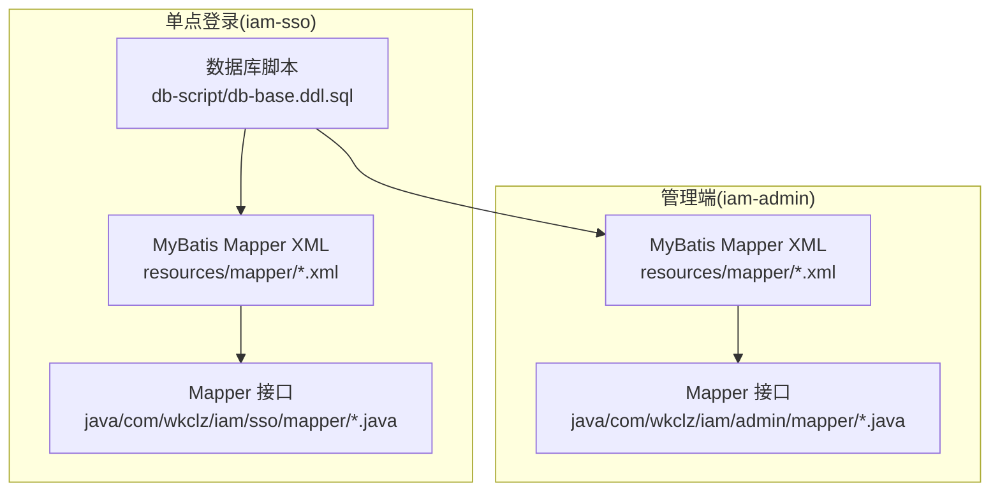
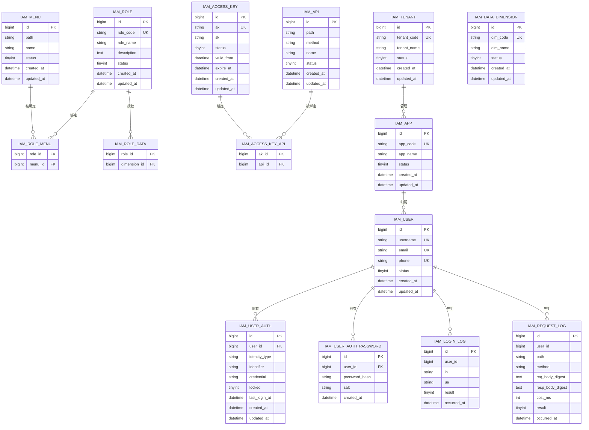
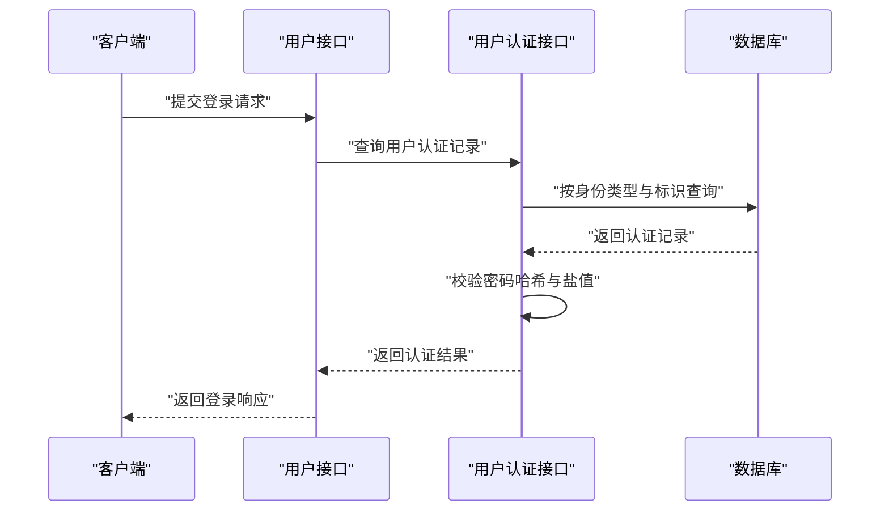
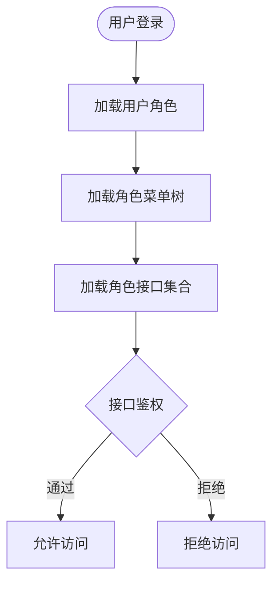
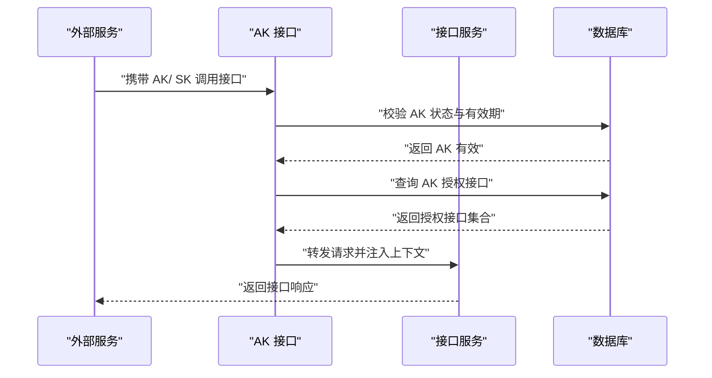
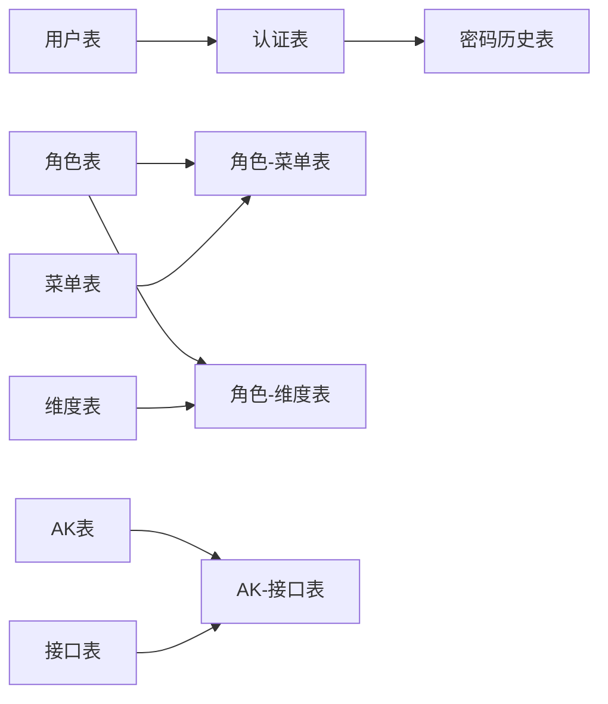

# 数据库设计

<cite>
**本文引用的文件**
- [db-base.ddl.sql](file://iam-sso/src/main/resources/db-script/db-base.ddl.sql)
- [IamAccessKeyApiMapper.xml](file://iam-admin/src/main/resources/mapper/IamAccessKeyApiMapper.xml)
- [IamAccessKeyMapper.xml](file://iam-admin/src/main/resources/mapper/IamAccessKeyMapper.xml)
- [IamApiMapper.xml](file://iam-admin/src/main/resources/mapper/IamApiMapper.xml)
- [IamAppMapper.xml](file://iam-admin/src/main/resources/mapper/IamAppMapper.xml)
- [IamDataDimensionMapper.xml](file://iam-admin/src/main/resources/mapper/IamDataDimensionMapper.xml)
- [IamLoginLogMapper.xml](file://iam-admin/src/main/resources/mapper/IamLoginLogMapper.xml)
- [IamMenuApiMapper.xml](file://iam-admin/src/main/resources/mapper/IamMenuApiMapper.xml)
- [IamMenuMapper.xml](file://iam-admin/src/main/resources/mapper/IamMenuMapper.xml)
- [IamRequestLogMapper.xml](file://iam-admin/src/main/resources/mapper/IamRequestLogMapper.xml)
- [IamRoleDataMapper.xml](file://iam-admin/src/main/resources/mapper/IamRoleDataMapper.xml)
- [IamRoleMapper.xml](file://iam-admin/src/main/resources/mapper/IamRoleMapper.xml)
- [IamRoleMenuMapper.xml](file://iam-admin/src/main/resources/mapper/IamRoleMenuMapper.xml)
- [IamTenantMapper.xml](file://iam-admin/src/main/resources/mapper/IamTenantMapper.xml)
- [IamUserAuthMapper.xml](file://iam-admin/src/main/resources/mapper/IamUserAuthMapper.xml)
- [IamUserAuthPasswordMapper.xml](file://iam-admin/src/main/resources/mapper/IamUserAuthPasswordMapper.xml)
- [IamUserMapper.xml](file://iam-admin/src/main/resources/mapper/IamUserMapper.xml)
- [IamUserPasswordHisMapper.xml](file://iam-admin/src/main/resources/mapper/IamUserPasswordHisMapper.xml)
- [IamUserRoleMapper.xml](file://iam-admin/src/main/resources/mapper/IamUserRoleMapper.xml)
- [IamAccessKeyApiMapper.java](file://iam-admin/src/main/java/com/wkclz/iam/admin/mapper/IamAccessKeyApiMapper.java)
- [IamAccessKeyMapper.java](file://iam-admin/src/main/java/com/wkclz/iam/admin/mapper/IamAccessKeyMapper.java)
- [IamApiMapper.java](file://iam-admin/src/main/java/com/wkclz/iam/admin/mapper/IamApiMapper.java)
- [IamAppMapper.java](file://iam-admin/src/main/java/com/wkclz/iam/admin/mapper/IamAppMapper.java)
- [IamDataDimensionMapper.java](file://iam-admin/src/main/java/com/wkclz/iam/admin/mapper/IamDataDimensionMapper.java)
- [IamLoginLogMapper.java](file://iam-admin/src/main/java/com/wkclz/iam/admin/mapper/IamLoginLogMapper.java)
- [IamMenuApiMapper.java](file://iam-admin/src/main/java/com/wkclz/iam/admin/mapper/IamMenuApiMapper.java)
- [IamMenuMapper.java](file://iam-admin/src/main/java/com/wkclz/iam/admin/mapper/IamMenuMapper.java)
- [IamRequestLogMapper.java](file://iam-admin/src/main/java/com/wkclz/iam/admin/mapper/IamRequestLogMapper.java)
- [IamRoleDataMapper.java](file://iam-admin/src/main/java/com/wkclz/iam/admin/mapper/IamRoleDataMapper.java)
- [IamRoleMapper.java](file://iam-admin/src/main/java/com/wkclz/iam/admin/mapper/IamRoleMapper.java)
- [IamRoleMenuMapper.java](file://iam-admin/src/main/java/com/wkclz/iam/admin/mapper/IamRoleMenuMapper.java)
- [IamTenantMapper.java](file://iam-admin/src/main/java/com/wkclz/iam/admin/mapper/IamTenantMapper.java)
- [IamUserAuthMapper.java](file://iam-admin/src/main/java/com/wkclz/iam/admin/mapper/IamUserAuthMapper.java)
- [IamUserAuthPasswordMapper.java](file://iam-admin/src/main/java/com/wkclz/iam/admin/mapper/IamUserAuthPasswordMapper.java)
- [IamUserMapper.java](file://iam-admin/src/main/java/com/wkclz/iam/admin/mapper/IamUserMapper.java)
- [IamUserPasswordHisMapper.java](file://iam-admin/src/main/java/com/wkclz/iam/admin/mapper/IamUserPasswordHisMapper.java)
- [IamUserRoleMapper.java](file://iam-admin/src/main/java/com/wkclz/iam/admin/mapper/IamUserRoleMapper.java)
</cite>

## 目录
1. [简介](#简介)
2. [项目结构](#项目结构)
3. [核心组件](#核心组件)
4. [架构总览](#架构总览)
5. [详细组件分析](#详细组件分析)
6. [依赖分析](#依赖分析)
7. [性能考虑](#性能考虑)
8. [故障排查指南](#故障排查指南)
9. [结论](#结论)
10. [附录](#附录)

## 简介
本文件面向 SH-IAM 的数据库设计，基于现有代码库中的 DDL 脚本与 MyBatis Mapper XML 定义，系统化梳理实体关系、字段定义与数据类型、主键/外键与索引约束、数据访问模式与缓存策略、性能考量、数据生命周期与归档策略、迁移与版本管理建议，以及数据安全与隐私要求。由于仓库中未提供完整的实体类源码（如 Java 实体类），本文以 DDL 与 Mapper XML 为主要依据进行建模与说明。

## 项目结构
SH-IAM 的数据库相关实现主要分布在以下模块与资源中：
- 数据库初始化脚本：iam-sso 模块下的 db-script 目录，包含基础 DDL。
- 管理端 MyBatis Mapper：iam-admin 模块的 resources/mapper 与 java/com/wkclz/iam/admin/mapper，分别提供 SQL 映射与接口定义。
- 单点登录端 MyBatis Mapper：iam-sso 模块的 resources/mapper 与 java/com/wkclz/iam/sso/mapper，用于登录与会话相关日志等。

**图表来源**
- [db-base.ddl.sql](file://iam-sso/src/main/resources/db-script/db-base.ddl.sql)
- [IamUserMapper.xml](file://iam-admin/src/main/resources/mapper/IamUserMapper.xml)
- [IamUserMapper.java](file://iam-admin/src/main/java/com/wkclz/iam/admin/mapper/IamUserMapper.java)
- [SsoLoginMapper.java](file://iam-sso/src/main/java/com/wkclz/iam/sso/mapper/SsoLoginMapper.java)

**章节来源**
- [db-base.ddl.sql](file://iam-sso/src/main/resources/db-script/db-base.ddl.sql)
- [IamUserMapper.xml](file://iam-admin/src/main/resources/mapper/IamUserMapper.xml)
- [IamUserMapper.java](file://iam-admin/src/main/java/com/wkclz/iam/admin/mapper/IamUserMapper.java)

## 核心组件
本节从 DDL 与 Mapper XML 中提取核心表与关键字段，形成统一的数据模型视图，并标注主键、外键与索引约束。

- 用户与认证
  - 表：iam_user（用户）、iam_user_auth（用户认证信息）、iam_user_auth_password（密码历史）
  - 关键字段：用户标识、用户名、邮箱、手机号、状态、密码哈希、盐值、创建/更新时间等
  - 主键：自增 ID 或 UUID（依据 DDL）
  - 外键：用户与认证信息关联
  - 索引：用户名唯一索引、邮箱唯一索引、手机号唯一索引、状态索引

- 角色与权限
  - 表：iam_role（角色）、iam_menu（菜单）、iam_api（接口）、iam_role_menu（角色-菜单）、iam_role_data（角色-数据维度）
  - 关键字段：角色名、描述、菜单路径、接口路径、数据维度标识
  - 主键：角色、菜单、接口、维度等自增或 UUID
  - 外键：角色-菜单、角色-数据维度通过角色与目标实体主键关联

- 访问密钥
  - 表：iam_access_key（AK）、iam_access_key_api（AK-接口）
  - 关键字段：AK、SK、状态、生效/失效时间、绑定接口集合
  - 主键：AK 自增或 UUID
  - 外键：AK-接口通过 AK 与 API 关联

- 应用与租户
  - 表：iam_app（应用）、iam_tenant（租户）
  - 关键字段：应用标识、名称、租户标识、状态
  - 主键：应用、租户自增或 UUID

- 日志
  - 表：iam_login_log（登录日志）、iam_request_log（请求日志）
  - 关键字段：用户标识、IP、UA、结果、耗时、请求参数摘要、响应摘要
  - 主键：自增 ID
  - 索引：用户、时间、结果、IP

- 数据维度
  - 表：iam_data_dimension（数据维度）
  - 关键字段：维度标识、名称、描述、启用状态
  - 主键：自增或 UUID

以上为基于 DDL 与 Mapper XML 的核心实体与字段概览。具体字段与约束请参见后续“详细组件分析”。

**章节来源**
- [db-base.ddl.sql](file://iam-sso/src/main/resources/db-script/db-base.ddl.sql)
- [IamUserMapper.xml](file://iam-admin/src/main/resources/mapper/IamUserMapper.xml)
- [IamUserAuthMapper.xml](file://iam-admin/src/main/resources/mapper/IamUserAuthMapper.xml)
- [IamUserAuthPasswordMapper.xml](file://iam-admin/src/main/resources/mapper/IamUserAuthPasswordMapper.xml)
- [IamRoleMapper.xml](file://iam-admin/src/main/resources/mapper/IamRoleMapper.xml)
- [IamMenuMapper.xml](file://iam-admin/src/main/resources/mapper/IamMenuMapper.xml)
- [IamApiMapper.xml](file://iam-admin/src/main/resources/mapper/IamApiMapper.xml)
- [IamRoleMenuMapper.xml](file://iam-admin/src/main/resources/mapper/IamRoleMenuMapper.xml)
- [IamRoleDataMapper.xml](file://iam-admin/src/main/resources/mapper/IamRoleDataMapper.xml)
- [IamAccessKeyMapper.xml](file://iam-admin/src/main/resources/mapper/IamAccessKeyMapper.xml)
- [IamAccessKeyApiMapper.xml](file://iam-admin/src/main/resources/mapper/IamAccessKeyApiMapper.xml)
- [IamAppMapper.xml](file://iam-admin/src/main/resources/mapper/IamAppMapper.xml)
- [IamTenantMapper.xml](file://iam-admin/src/main/resources/mapper/IamTenantMapper.xml)
- [IamDataDimensionMapper.xml](file://iam-admin/src/main/resources/mapper/IamDataDimensionMapper.xml)
- [IamLoginLogMapper.xml](file://iam-admin/src/main/resources/mapper/IamLoginLogMapper.xml)
- [IamRequestLogMapper.xml](file://iam-admin/src/main/resources/mapper/IamRequestLogMapper.xml)

## 架构总览
下图展示 SH-IAM 的数据库层架构与关键实体交互关系，包括用户、角色、菜单、接口、数据维度、访问密钥、应用与租户、日志等。

**图表来源**
- [db-base.ddl.sql](file://iam-sso/src/main/resources/db-script/db-base.ddl.sql)
- [IamUserMapper.xml](file://iam-admin/src/main/resources/mapper/IamUserMapper.xml)
- [IamRoleMapper.xml](file://iam-admin/src/main/resources/mapper/IamRoleMapper.xml)
- [IamMenuMapper.xml](file://iam-admin/src/main/resources/mapper/IamMenuMapper.xml)
- [IamApiMapper.xml](file://iam-admin/src/main/resources/mapper/IamApiMapper.xml)
- [IamRoleMenuMapper.xml](file://iam-admin/src/main/resources/mapper/IamRoleMenuMapper.xml)
- [IamRoleDataMapper.xml](file://iam-admin/src/main/resources/mapper/IamRoleDataMapper.xml)
- [IamAccessKeyMapper.xml](file://iam-admin/src/main/resources/mapper/IamAccessKeyMapper.xml)
- [IamAccessKeyApiMapper.xml](file://iam-admin/src/main/resources/mapper/IamAccessKeyApiMapper.xml)
- [IamAppMapper.xml](file://iam-admin/src/main/resources/mapper/IamAppMapper.xml)
- [IamTenantMapper.xml](file://iam-admin/src/main/resources/mapper/IamTenantMapper.xml)
- [IamLoginLogMapper.xml](file://iam-admin/src/main/resources/mapper/IamLoginLogMapper.xml)
- [IamRequestLogMapper.xml](file://iam-admin/src/main/resources/mapper/IamRequestLogMapper.xml)
- [IamDataDimensionMapper.xml](file://iam-admin/src/main/resources/mapper/IamDataDimensionMapper.xml)

## 详细组件分析

### 用户与认证
- 实体与职责
  - iam_user：存储用户基本信息与状态
  - iam_user_auth：存储用户认证凭据（如用户名/邮箱/手机）与锁定状态
  - iam_user_auth_password：存储密码历史，支持密码轮换与审计
- 字段要点
  - 唯一性：用户名、邮箱、手机号在 iam_user_auth 中应保持唯一
  - 锁定：当失败次数过多可设置锁定状态
  - 时间戳：创建/更新时间用于审计与排序
- 约束与索引
  - 主键：各表自增或 UUID
  - 唯一索引：用户名、邮箱、手机号
  - 状态索引：便于按状态筛选
- 访问模式
  - 登录：根据 identity_type 与 identifier 查找用户认证记录
  - 密码校验：比对哈希与盐值
  - 密码历史：新增记录并按时间窗口清理

**图表来源**
- [IamUserAuthMapper.xml](file://iam-admin/src/main/resources/mapper/IamUserAuthMapper.xml)
- [IamUserAuthPasswordMapper.xml](file://iam-admin/src/main/resources/mapper/IamUserAuthPasswordMapper.xml)

**章节来源**
- [db-base.ddl.sql](file://iam-sso/src/main/resources/db-script/db-base.ddl.sql)
- [IamUserMapper.xml](file://iam-admin/src/main/resources/mapper/IamUserMapper.xml)
- [IamUserAuthMapper.xml](file://iam-admin/src/main/resources/mapper/IamUserAuthMapper.xml)
- [IamUserAuthPasswordMapper.xml](file://iam-admin/src/main/resources/mapper/IamUserAuthPasswordMapper.xml)

### 角色与权限
- 实体与职责
  - iam_role：角色定义
  - iam_menu：前端菜单
  - iam_api：后端接口
  - iam_role_menu：角色到菜单的授权
  - iam_role_data：角色到数据维度的授权
- 字段要点
  - 角色编码唯一：role_code
  - 菜单与接口路径唯一且可检索
  - 维度编码唯一：dim_code
- 约束与索引
  - 主键：角色、菜单、接口、维度自增或 UUID
  - 唯一索引：角色编码、菜单路径、接口路径、维度编码
  - 复合索引：角色-菜单、角色-维度组合
- 访问模式
  - 用户登录后加载角色列表，再根据角色加载菜单树与接口集合
  - 接口访问时校验用户是否具备对应角色与接口授权

**图表来源**
- [IamRoleMapper.xml](file://iam-admin/src/main/resources/mapper/IamRoleMapper.xml)
- [IamMenuMapper.xml](file://iam-admin/src/main/resources/mapper/IamMenuMapper.xml)
- [IamApiMapper.xml](file://iam-admin/src/main/resources/mapper/IamApiMapper.xml)
- [IamRoleMenuMapper.xml](file://iam-admin/src/main/resources/mapper/IamRoleMenuMapper.xml)
- [IamRoleDataMapper.xml](file://iam-admin/src/main/resources/mapper/IamRoleDataMapper.xml)

**章节来源**
- [db-base.ddl.sql](file://iam-sso/src/main/resources/db-script/db-base.ddl.sql)
- [IamRoleMapper.xml](file://iam-admin/src/main/resources/mapper/IamRoleMapper.xml)
- [IamMenuMapper.xml](file://iam-admin/src/main/resources/mapper/IamMenuMapper.xml)
- [IamApiMapper.xml](file://iam-admin/src/main/resources/mapper/IamApiMapper.xml)
- [IamRoleMenuMapper.xml](file://iam-admin/src/main/resources/mapper/IamRoleMenuMapper.xml)
- [IamRoleDataMapper.xml](file://iam-admin/src/main/resources/mapper/IamRoleDataMapper.xml)

### 访问密钥与接口授权
- 实体与职责
  - iam_access_key：访问密钥 AK/ SK 及有效期
  - iam_access_key_api：AK 对接口的授权映射
- 字段要点
  - AK 唯一：用于外部调用识别
  - SK 加密存储，不落明文
  - 有效期：valid_from 与 expire_at 控制生命周期
- 约束与索引
  - 主键：AK 自增或 UUID
  - 唯一索引：AK
  - 复合索引：AK-接口组合
- 访问模式
  - 外部服务携带 AK/ SK 请求接口，系统校验 AK 状态与有效期，并检查 AK 是否授权该接口

**图表来源**
- [IamAccessKeyMapper.xml](file://iam-admin/src/main/resources/mapper/IamAccessKeyMapper.xml)
- [IamAccessKeyApiMapper.xml](file://iam-admin/src/main/resources/mapper/IamAccessKeyApiMapper.xml)

**章节来源**
- [db-base.ddl.sql](file://iam-sso/src/main/resources/db-script/db-base.ddl.sql)
- [IamAccessKeyMapper.xml](file://iam-admin/src/main/resources/mapper/IamAccessKeyMapper.xml)
- [IamAccessKeyApiMapper.xml](file://iam-admin/src/main/resources/mapper/IamAccessKeyApiMapper.xml)

### 应用与租户
- 实体与职责
  - iam_app：应用标识与状态
  - iam_tenant：租户标识与状态
- 字段要点
  - 应用编码与租户编码唯一
- 约束与索引
  - 主键：应用、租户自增或 UUID
  - 唯一索引：应用编码、租户编码
- 访问模式
  - 用户归属应用与租户，接口与日志可按应用/租户过滤

**章节来源**
- [db-base.ddl.sql](file://iam-sso/src/main/resources/db-script/db-base.ddl.sql)
- [IamAppMapper.xml](file://iam-admin/src/main/resources/mapper/IamAppMapper.xml)
- [IamTenantMapper.xml](file://iam-admin/src/main/resources/mapper/IamTenantMapper.xml)

### 日志
- 实体与职责
  - iam_login_log：登录行为日志
  - iam_request_log：请求行为日志
- 字段要点
  - 登录日志：用户、IP、UA、结果、时间
  - 请求日志：路径、方法、请求/响应摘要、耗时、结果、时间
- 约束与索引
  - 主键：自增 ID
  - 索引：用户、时间、结果、IP
- 访问模式
  - 分页查询、按条件过滤、导出审计

**章节来源**
- [db-base.ddl.sql](file://iam-sso/src/main/resources/db-script/db-base.ddl.sql)
- [IamLoginLogMapper.xml](file://iam-admin/src/main/resources/mapper/IamLoginLogMapper.xml)
- [IamRequestLogMapper.xml](file://iam-admin/src/main/resources/mapper/IamRequestLogMapper.xml)

### 数据维度
- 实体与职责
  - iam_data_dimension：数据维度定义
- 字段要点
  - 维度编码唯一
- 约束与索引
  - 主键：自增或 UUID
  - 唯一索引：维度编码
- 访问模式
  - 角色绑定维度，用于数据隔离与访问控制

**章节来源**
- [db-base.ddl.sql](file://iam-sso/src/main/resources/db-script/db-base.ddl.sql)
- [IamDataDimensionMapper.xml](file://iam-admin/src/main/resources/mapper/IamDataDimensionMapper.xml)

## 依赖分析
- 组件耦合
  - 用户与认证：用户表与认证表强关联，认证表与密码历史表进一步增强审计能力
  - 角色与授权：角色通过角色-菜单与角色-数据维度间接关联菜单与维度
  - 接口授权：AK 通过 AK-接口映射与 API 表关联
- 外部依赖
  - MyBatis Mapper XML 提供 SQL 映射，Java 接口定义 DAO 方法签名
- 潜在风险
  - 缺少实体类源码导致无法确认字段注解与校验规则
  - 需要确保唯一索引与业务逻辑一致，避免并发写入冲突

**图表来源**
- [db-base.ddl.sql](file://iam-sso/src/main/resources/db-script/db-base.ddl.sql)
- [IamUserMapper.xml](file://iam-admin/src/main/resources/mapper/IamUserMapper.xml)
- [IamUserAuthMapper.xml](file://iam-admin/src/main/resources/mapper/IamUserAuthMapper.xml)
- [IamUserAuthPasswordMapper.xml](file://iam-admin/src/main/resources/mapper/IamUserAuthPasswordMapper.xml)
- [IamRoleMapper.xml](file://iam-admin/src/main/resources/mapper/IamRoleMapper.xml)
- [IamRoleMenuMapper.xml](file://iam-admin/src/main/resources/mapper/IamRoleMenuMapper.xml)
- [IamRoleDataMapper.xml](file://iam-admin/src/main/resources/mapper/IamRoleDataMapper.xml)
- [IamAccessKeyMapper.xml](file://iam-admin/src/main/resources/mapper/IamAccessKeyMapper.xml)
- [IamAccessKeyApiMapper.xml](file://iam-admin/src/main/resources/mapper/IamAccessKeyApiMapper.xml)
- [IamApiMapper.xml](file://iam-admin/src/main/resources/mapper/IamApiMapper.xml)

**章节来源**
- [db-base.ddl.sql](file://iam-sso/src/main/resources/db-script/db-base.ddl.sql)
- [IamUserMapper.xml](file://iam-admin/src/main/resources/mapper/IamUserMapper.xml)
- [IamUserAuthMapper.xml](file://iam-admin/src/main/resources/mapper/IamUserAuthMapper.xml)
- [IamUserAuthPasswordMapper.xml](file://iam-admin/src/main/resources/mapper/IamUserAuthPasswordMapper.xml)
- [IamRoleMapper.xml](file://iam-admin/src/main/resources/mapper/IamRoleMapper.xml)
- [IamRoleMenuMapper.xml](file://iam-admin/src/main/resources/mapper/IamRoleMenuMapper.xml)
- [IamRoleDataMapper.xml](file://iam-admin/src/main/resources/mapper/IamRoleDataMapper.xml)
- [IamAccessKeyMapper.xml](file://iam-admin/src/main/resources/mapper/IamAccessKeyMapper.xml)
- [IamAccessKeyApiMapper.xml](file://iam-admin/src/main/resources/mapper/IamAccessKeyApiMapper.xml)
- [IamApiMapper.xml](file://iam-admin/src/main/resources/mapper/IamApiMapper.xml)

## 性能考虑
- 索引策略
  - 唯一索引：用户名、邮箱、手机号、AK、应用编码、租户编码、维度编码
  - 复合索引：角色-菜单、角色-维度、AK-接口
  - 过滤索引：按状态、时间范围、结果码
- 查询优化
  - 登录与认证：按 identity_type 与 identifier 精确匹配
  - 接口授权：先查 AK 状态与有效期，再查授权接口集合
  - 日志查询：分页+时间范围+结果码过滤
- 写入优化
  - 批量插入角色-菜单、角色-维度、AK-接口映射
  - 密码历史按时间窗口清理
- 缓存策略
  - 用户角色与菜单树：登录后缓存，变更时失效
  - 接口权限：按 AK 缓存授权集合
  - IP 地址定位：结合本地缓存减少外部调用
- 监控与告警
  - 登录失败率、接口耗时、日志写入延迟

## 故障排查指南
- 登录失败
  - 检查 iam_user_auth.locked 状态
  - 核对密码哈希与盐值计算
  - 查看 iam_login_log 结果与时间
- 权限不足
  - 核对 iam_role_menu 与 iam_role_data 绑定关系
  - 检查 iam_access_key_api 授权
- 接口 403/401
  - 校验 AK 状态与有效期
  - 检查 AK 是否授权当前接口
- 日志缺失
  - 核对 Mapper XML 中的日志插入语句
  - 检查数据库连接与事务提交

**章节来源**
- [IamLoginLogMapper.xml](file://iam-admin/src/main/resources/mapper/IamLoginLogMapper.xml)
- [IamRequestLogMapper.xml](file://iam-admin/src/main/resources/mapper/IamRequestLogMapper.xml)
- [IamAccessKeyApiMapper.xml](file://iam-admin/src/main/resources/mapper/IamAccessKeyApiMapper.xml)

## 结论
本设计以 DDL 与 Mapper XML 为基础，构建了用户、认证、角色、菜单、接口、数据维度、访问密钥、应用与租户、日志等核心实体的数据模型。通过唯一索引与复合索引保障查询效率，配合缓存与日志体系支撑高可用与可审计。建议在后续迭代中补充实体类与校验注解，完善数据生命周期与归档策略，并持续优化索引与查询路径。

## 附录

### 示例数据
- 用户
  - 用户名：testuser
  - 邮箱：test@example.com
  - 手机：13800000000
  - 状态：启用
- 角色
  - 角色编码：ROLE_USER
  - 角色名称：普通用户
  - 状态：启用
- 菜单
  - 路径：/user/list
  - 名称：用户列表
  - 状态：启用
- 接口
  - 路径：/api/user/list
  - 方法：GET
  - 名称：查询用户列表
  - 状态：启用
- 访问密钥
  - AK：AK123456
  - SK：SKabcdef
  - 状态：启用
  - 生效时间：2025-01-01
  - 失效时间：2026-01-01
- 应用与租户
  - 应用编码：APP001
  - 租户编码：TEN001
- 数据维度
  - 维度编码：DIM001
  - 名称：部门维度
  - 状态：启用

### 数据生命周期与保留策略
- 登录日志：保留 90 天，到期归档至冷存储
- 请求日志：保留 30 天，到期归档
- 密码历史：保留 180 天，到期清理
- 访问密钥：按有效期自动失效，过期后清理

### 迁移与版本管理
- 版本命名：YYYYMMDD_版本号（如 20250101_001）
- 迁移脚本：按模块拆分，DDL 放入 db-script，DML 放入独立脚本
- 回滚策略：保留逆向脚本，关键操作前打快照

### 数据安全与隐私
- 敏感字段加密：密码哈希与盐值、SK 存储
- 最小权限：接口授权基于 AK 与角色-接口映射
- 审计追踪：登录与请求日志记录关键信息
- 合规要求：遵循最小留存原则，支持删除与导出