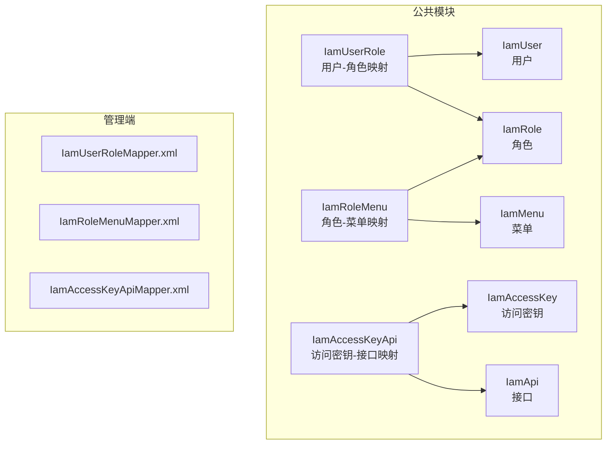
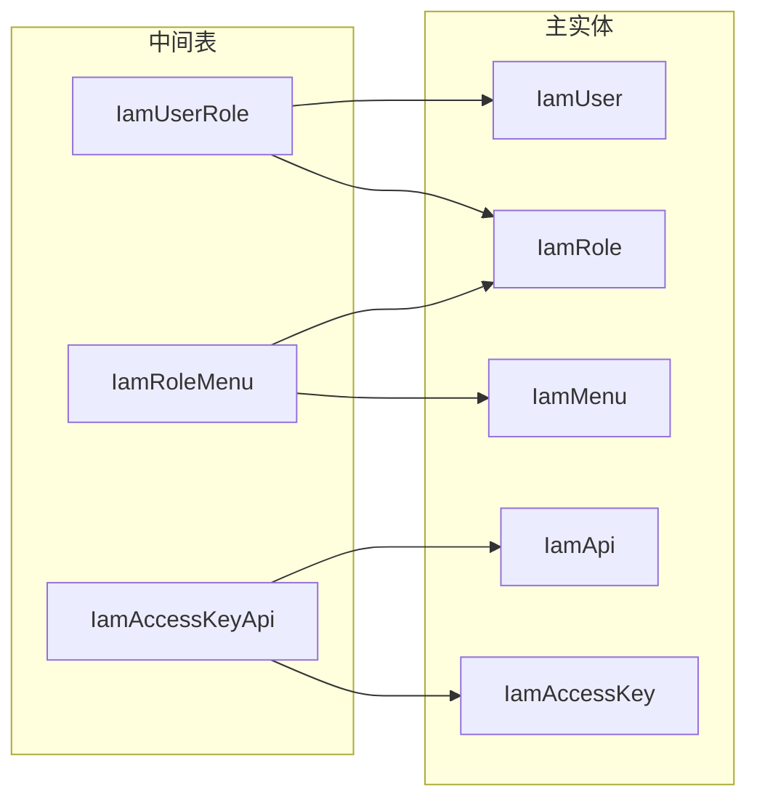
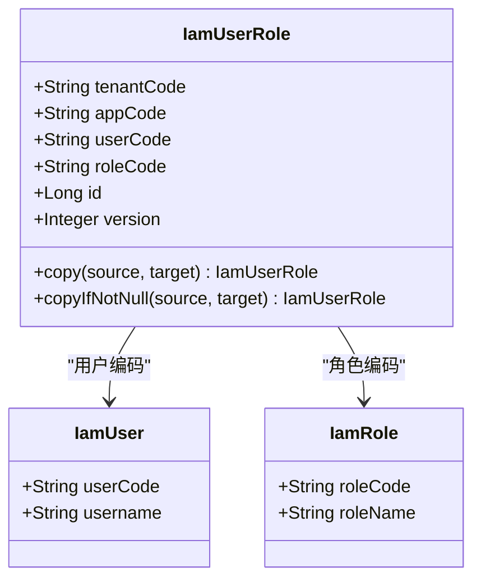
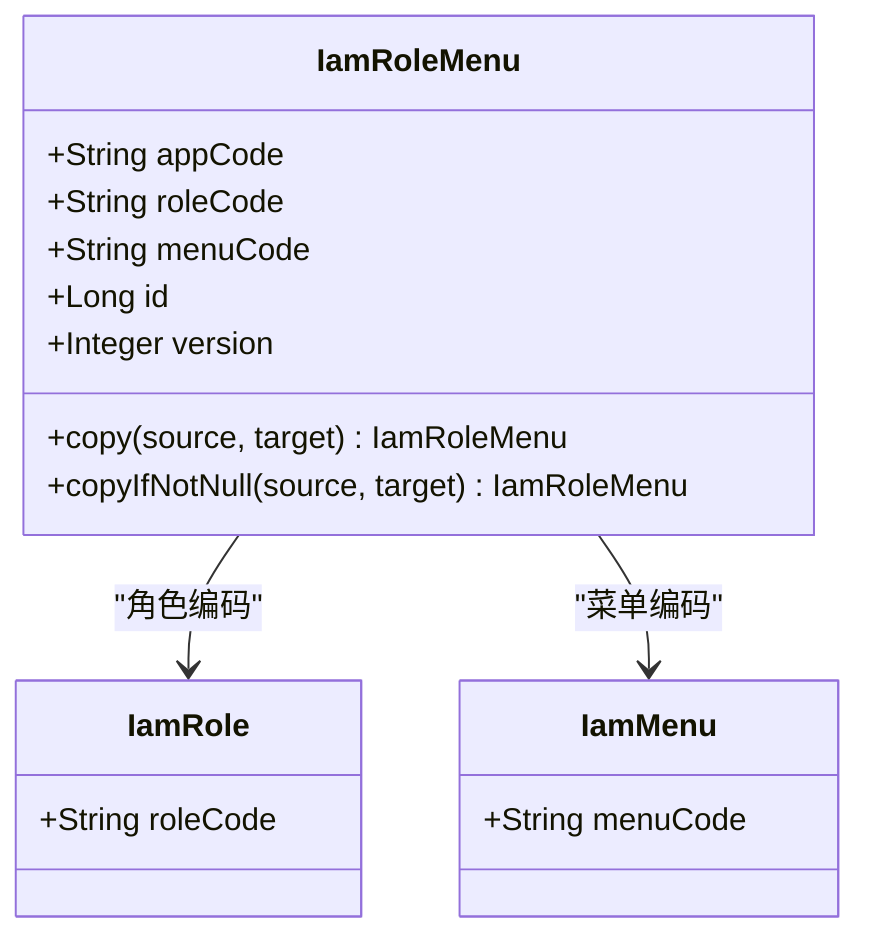
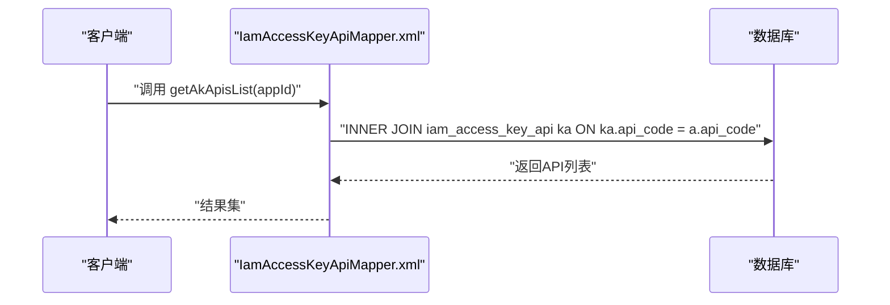
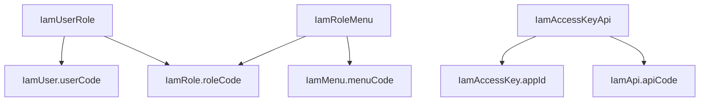

# 关联映射实体模型

<cite>
**本文档引用的文件**
- [IamUserRole.java](file://iam-common/src/main/java/com/wkclz/iam/common/entity/IamUserRole.java)
- [IamRoleMenu.java](file://iam-common/src/main/java/com/wkclz/iam/common/entity/IamRoleMenu.java)
- [IamAccessKeyApi.java](file://iam-common/src/main/java/com/wkclz/iam/common/entity/IamAccessKeyApi.java)
- [IamUserRoleDto.java](file://iam-common/src/main/java/com/wkclz/iam/common/dto/IamUserRoleDto.java)
- [IamUserRoleMapper.xml](file://iam-admin/src/main/resources/mapper/IamUserRoleMapper.xml)
- [IamRoleMenuMapper.xml](file://iam-admin/src/main/resources/mapper/IamRoleMenuMapper.xml)
- [IamAccessKeyApiMapper.xml](file://iam-admin/src/main/resources/mapper/IamAccessKeyApiMapper.xml)
- [IamUser.java](file://iam-common/src/main/java/com/wkclz/iam/common/entity/IamUser.java)
- [IamRole.java](file://iam-common/src/main/java/com/wkclz/iam/common/entity/IamRole.java)
- [IamMenu.java](file://iam-common/src/main/java/com/wkclz/iam/common/entity/IamMenu.java)
- [IamApi.java](file://iam-common/src/main/java/com/wkclz/iam/common/entity/IamApi.java)
- [IamAccessKey.java](file://iam-common/src/main/java/com/wkclz/iam/common/entity/IamAccessKey.java)
</cite>

## 目录
1. [引言](#引言)
2. [项目结构](#项目结构)
3. [核心组件](#核心组件)
4. [架构概览](#架构概览)
5. [详细组件分析](#详细组件分析)
6. [依赖分析](#依赖分析)
7. [性能考虑](#性能考虑)
8. [故障排除指南](#故障排除指南)
9. [结论](#结论)
10. [附录](#附录)

## 引言
本文件针对IAM系统中的关联映射实体模型进行深入技术文档化，重点覆盖三类多对多关系的中间表设计与实现：
- 用户-角色映射（用户角色关系）
- 角色-菜单映射（角色菜单关系）
- 访问密钥-接口映射（访问密钥API映射）

文档将从数据结构、复合主键设计、外键约束与级联规则、事务性维护策略、一致性校验与完整性验证等方面进行全面阐述，并提供CRUD操作示例与复杂查询的SQL实现路径。

## 项目结构
IAM系统采用分层架构，关联映射实体位于公共模块（iam-common），对应的MyBatis映射文件位于管理端（iam-admin）资源目录中。核心实体与DTO如下所示：

**图表来源**
- [IamUserRole.java:1-84](file://iam-common/src/main/java/com/wkclz/iam/common/entity/IamUserRole.java#L1-L84)
- [IamRoleMenu.java:1-76](file://iam-common/src/main/java/com/wkclz/iam/common/entity/IamRoleMenu.java#L1-L76)
- [IamAccessKeyApi.java:1-76](file://iam-common/src/main/java/com/wkclz/iam/common/entity/IamAccessKeyApi.java#L1-L76)
- [IamUserRoleMapper.xml:1-15](file://iam-admin/src/main/resources/mapper/IamUserRoleMapper.xml#L1-L15)
- [IamRoleMenuMapper.xml:1-15](file://iam-admin/src/main/resources/mapper/IamRoleMenuMapper.xml#L1-L15)
- [IamAccessKeyApiMapper.xml:1-27](file://iam-admin/src/main/resources/mapper/IamAccessKeyApiMapper.xml#L1-L27)

**章节来源**
- [IamUserRole.java:1-84](file://iam-common/src/main/java/com/wkclz/iam/common/entity/IamUserRole.java#L1-L84)
- [IamRoleMenu.java:1-76](file://iam-common/src/main/java/com/wkclz/iam/common/entity/IamRoleMenu.java#L1-L76)
- [IamAccessKeyApi.java:1-76](file://iam-common/src/main/java/com/wkclz/iam/common/entity/IamAccessKeyApi.java#L1-L76)
- [IamUserRoleMapper.xml:1-15](file://iam-admin/src/main/resources/mapper/IamUserRoleMapper.xml#L1-L15)
- [IamRoleMenuMapper.xml:1-15](file://iam-admin/src/main/resources/mapper/IamRoleMenuMapper.xml#L1-L15)
- [IamAccessKeyApiMapper.xml:1-27](file://iam-admin/src/main/resources/mapper/IamAccessKeyApiMapper.xml#L1-L27)

## 核心组件
本节聚焦三类中间表实体及其字段语义、主键设计与复制工具方法。

- 用户-角色映射（IamUserRole）
  - 字段要点：租户编码、应用编码、用户编码、角色编码
  - 主键设计：基于BaseEntity的自增ID；复合主键建议为（用户编码, 角色编码, 应用编码, 租户编码）
  - 复制工具：提供copy与copyIfNotNull静态方法，便于实体间转换与增量更新

- 角色-菜单映射（IamRoleMenu）
  - 字段要点：应用编码、角色编码、资源编码（菜单编码）
  - 主键设计：基于BaseEntity的自增ID；复合主键建议为（角色编码, 菜单编码, 应用编码）
  - 复制工具：同上，支持完整复制与按非空字段复制

- 访问密钥-接口映射（IamAccessKeyApi）
  - 字段要点：应用编码、应用ID、API编码
  - 主键设计：基于BaseEntity的自增ID；复合主键建议为（应用ID, API编码, 应用编码）
  - 复制工具：同上

- DTO扩展（IamUserRoleDto）
  - 继承IamUserRole，提供从实体到DTO的便捷转换方法

**章节来源**
- [IamUserRole.java:1-84](file://iam-common/src/main/java/com/wkclz/iam/common/entity/IamUserRole.java#L1-L84)
- [IamRoleMenu.java:1-76](file://iam-common/src/main/java/com/wkclz/iam/common/entity/IamRoleMenu.java#L1-L76)
- [IamAccessKeyApi.java:1-76](file://iam-common/src/main/java/com/wkclz/iam/common/entity/IamAccessKeyApi.java#L1-L76)
- [IamUserRoleDto.java:1-32](file://iam-common/src/main/java/com/wkclz/iam/common/dto/IamUserRoleDto.java#L1-L32)

## 架构概览
下图展示中间表与主实体之间的关系与依赖方向：

**图表来源**
- [IamUserRole.java:1-84](file://iam-common/src/main/java/com/wkclz/iam/common/entity/IamUserRole.java#L1-L84)
- [IamRoleMenu.java:1-76](file://iam-common/src/main/java/com/wkclz/iam/common/entity/IamRoleMenu.java#L1-L76)
- [IamAccessKeyApi.java:1-76](file://iam-common/src/main/java/com/wkclz/iam/common/entity/IamAccessKeyApi.java#L1-L76)
- [IamUser.java:1-108](file://iam-common/src/main/java/com/wkclz/iam/common/entity/IamUser.java#L1-L108)
- [IamRole.java:1-92](file://iam-common/src/main/java/com/wkclz/iam/common/entity/IamRole.java#L1-L92)
- [IamMenu.java:1-132](file://iam-common/src/main/java/com/wkclz/iam/common/entity/IamMenu.java#L1-L132)
- [IamApi.java:1-108](file://iam-common/src/main/java/com/wkclz/iam/common/entity/IamApi.java#L1-L108)
- [IamAccessKey.java:1-108](file://iam-common/src/main/java/com/wkclz/iam/common/entity/IamAccessKey.java#L1-L108)

## 详细组件分析

### 用户-角色映射（IamUserRole）
- 数据结构
  - 基于BaseEntity，包含通用审计字段与版本号
  - 关键业务字段：用户编码、角色编码、应用编码、租户编码
- 复合主键设计
  - 当前主键为自增ID；建议在数据库层面增加唯一索引或约束以保证（用户编码, 角色编码, 应用编码, 租户编码）的唯一性
- 外键约束与级联
  - 建议对用户编码、角色编码建立外键，参照IamUser.userCode与IamRole.roleCode
  - 级联策略：删除用户或角色时应级联删除对应映射；更新编码时需同步更新映射
- 复制工具
  - copy：完整复制所有字段
  - copyIfNotNull：仅复制非空字段，便于增量更新

**图表来源**
- [IamUserRole.java:1-84](file://iam-common/src/main/java/com/wkclz/iam/common/entity/IamUserRole.java#L1-L84)
- [IamUser.java:1-108](file://iam-common/src/main/java/com/wkclz/iam/common/entity/IamUser.java#L1-L108)
- [IamRole.java:1-92](file://iam-common/src/main/java/com/wkclz/iam/common/entity/IamRole.java#L1-L92)

**章节来源**
- [IamUserRole.java:1-84](file://iam-common/src/main/java/com/wkclz/iam/common/entity/IamUserRole.java#L1-L84)
- [IamUserRoleDto.java:1-32](file://iam-common/src/main/java/com/wkclz/iam/common/dto/IamUserRoleDto.java#L1-L32)

### 角色-菜单映射（IamRoleMenu）
- 数据结构
  - 包含应用编码、角色编码、菜单编码等
- 复合主键设计
  - 建议复合主键为（角色编码, 菜单编码, 应用编码），避免重复绑定
- 外键约束与级联
  - 对角色编码参照IamRole.roleCode，对菜单编码参照IamMenu.menuCode
  - 删除角色或菜单时应级联删除映射
- 复制工具
  - 提供copy与copyIfNotNull方法

**图表来源**
- [IamRoleMenu.java:1-76](file://iam-common/src/main/java/com/wkclz/iam/common/entity/IamRoleMenu.java#L1-L76)
- [IamRole.java:1-92](file://iam-common/src/main/java/com/wkclz/iam/common/entity/IamRole.java#L1-L92)
- [IamMenu.java:1-132](file://iam-common/src/main/java/com/wkclz/iam/common/entity/IamMenu.java#L1-L132)

**章节来源**
- [IamRoleMenu.java:1-76](file://iam-common/src/main/java/com/wkclz/iam/common/entity/IamRoleMenu.java#L1-L76)

### 访问密钥-接口映射（IamAccessKeyApi）
- 数据结构
  - 关键字段：应用编码、应用ID、API编码
- 复合主键设计
  - 建议复合主键为（应用ID, API编码, 应用编码），确保同一应用下的接口绑定唯一性
- 外键约束与级联
  - 对应用ID参照IamAccessKey.appId，对API编码参照IamApi.apiCode
  - 删除访问密钥或接口时应级联删除映射
- 查询能力
  - MyBatis映射文件提供复杂查询示例，通过INNER JOIN获取已启用且未删除的API列表

**图表来源**
- [IamAccessKeyApiMapper.xml:1-27](file://iam-admin/src/main/resources/mapper/IamAccessKeyApiMapper.xml#L1-L27)
- [IamAccessKeyApi.java:1-76](file://iam-common/src/main/java/com/wkclz/iam/common/entity/IamAccessKeyApi.java#L1-L76)
- [IamApi.java:1-108](file://iam-common/src/main/java/com/wkclz/iam/common/entity/IamApi.java#L1-L108)

**章节来源**
- [IamAccessKeyApi.java:1-76](file://iam-common/src/main/java/com/wkclz/iam/common/entity/IamAccessKeyApi.java#L1-L76)
- [IamAccessKeyApiMapper.xml:1-27](file://iam-admin/src/main/resources/mapper/IamAccessKeyApiMapper.xml#L1-L27)

### 复杂查询与SQL实现路径
以下为典型复杂查询的SQL实现思路（以路径形式标注，便于定位具体实现）：
- 获取某应用下访问密钥可访问的所有API列表
  - SQL实现路径参考：[IamAccessKeyApiMapper.xml:getAkApisList:5-23](file://iam-admin/src/main/resources/mapper/IamAccessKeyApiMapper.xml#L5-L23)
  - 关键点：INNER JOIN、deleted过滤、排序
- 用户-角色-菜单三层关联查询（示例思路）
  - 步骤：从IamUserRole筛选用户角色，再JOIN IamRoleMenu获取菜单，最后JOIN IamMenu获取菜单详情
  - 复合主键与去重：使用UNIQUE约束或GROUP BY避免重复
- 访问密钥-接口绑定统计（示例思路）
  - 步骤：按应用ID分组统计绑定数量，结合IamAccessKeyApi与IamApi表

**章节来源**
- [IamAccessKeyApiMapper.xml:5-23](file://iam-admin/src/main/resources/mapper/IamAccessKeyApiMapper.xml#L5-L23)

## 依赖分析
中间表与主实体之间的依赖关系如下：

**图表来源**
- [IamUserRole.java:1-84](file://iam-common/src/main/java/com/wkclz/iam/common/entity/IamUserRole.java#L1-L84)
- [IamRoleMenu.java:1-76](file://iam-common/src/main/java/com/wkclz/iam/common/entity/IamRoleMenu.java#L1-L76)
- [IamAccessKeyApi.java:1-76](file://iam-common/src/main/java/com/wkclz/iam/common/entity/IamAccessKeyApi.java#L1-L76)
- [IamUser.java:1-108](file://iam-common/src/main/java/com/wkclz/iam/common/entity/IamUser.java#L1-L108)
- [IamRole.java:1-92](file://iam-common/src/main/java/com/wkclz/iam/common/entity/IamRole.java#L1-L92)
- [IamMenu.java:1-132](file://iam-common/src/main/java/com/wkclz/iam/common/entity/IamMenu.java#L1-L132)
- [IamApi.java:1-108](file://iam-common/src/main/java/com/wkclz/iam/common/entity/IamApi.java#L1-L108)
- [IamAccessKey.java:1-108](file://iam-common/src/main/java/com/wkclz/iam/common/entity/IamAccessKey.java#L1-L108)

**章节来源**
- [IamUserRole.java:1-84](file://iam-common/src/main/java/com/wkclz/iam/common/entity/IamUserRole.java#L1-L84)
- [IamRoleMenu.java:1-76](file://iam-common/src/main/java/com/wkclz/iam/common/entity/IamRoleMenu.java#L1-L76)
- [IamAccessKeyApi.java:1-76](file://iam-common/src/main/java/com/wkclz/iam/common/entity/IamAccessKeyApi.java#L1-L76)

## 性能考虑
- 索引设计
  - 在中间表上为复合主键字段建立唯一索引，避免重复绑定与提升查询性能
  - 在频繁过滤字段（如appCode、userCode、roleCode、menuCode、apiCode）上建立普通索引
- 查询优化
  - 使用JOIN替代子查询，减少嵌套层级
  - 对大数据量场景，优先使用复合索引覆盖查询
- 写入优化
  - 批量插入时使用JDBC批处理或MyBatis批量执行器
  - 控制单次批量大小，避免事务过长持有锁

## 故障排除指南
- 重复绑定问题
  - 现象：同一用户绑定同一角色多次
  - 解决：在数据库层面增加唯一约束；在服务层进行幂等校验
- 外键失效
  - 现象：删除主实体后映射未清理
  - 解决：配置级联删除；或在删除前执行清理逻辑
- 查询结果异常
  - 现象：JOIN后出现重复行
  - 解决：使用DISTINCT或GROUP BY去重；检查复合主键设计

## 结论
本文档系统梳理了IAM系统中用户-角色、角色-菜单、访问密钥-接口三类多对多关系的中间表设计与实现。通过明确复合主键、外键约束与级联规则，配合事务性维护策略与一致性校验机制，可有效保障关联数据的完整性与性能。建议在生产环境中进一步完善索引与约束，并在服务层实现幂等与去重逻辑，确保高并发场景下的稳定性。

## 附录
- CRUD操作示例（以路径标注）
  - 用户-角色绑定新增：IamUserRoleMapper.xml（命名空间与SQL定义位置）
  - 角色-菜单批量绑定：IamRoleMenuMapper.xml（命名空间与SQL定义位置）
  - 访问密钥-接口批量授权：IamAccessKeyApiMapper.xml（命名空间与SQL定义位置）
- 复杂查询SQL实现路径
  - 访问密钥API列表查询：[IamAccessKeyApiMapper.xml:getAkApisList:5-23](file://iam-admin/src/main/resources/mapper/IamAccessKeyApiMapper.xml#L5-L23)