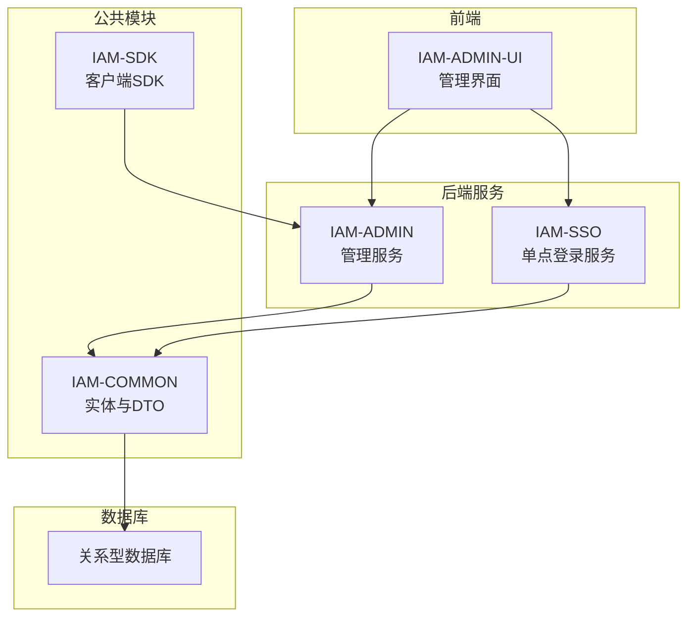
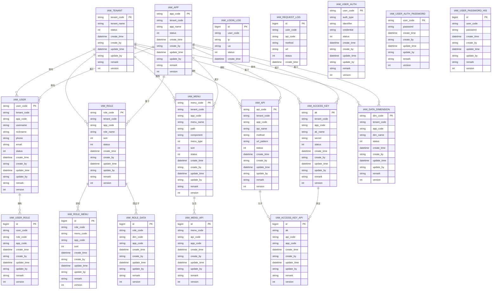
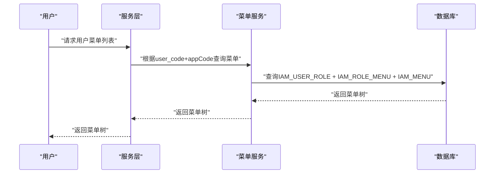
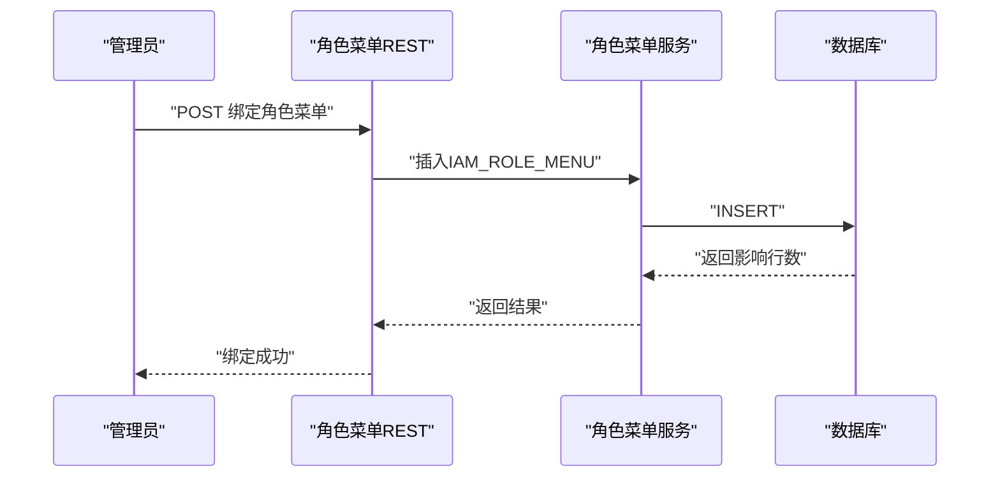
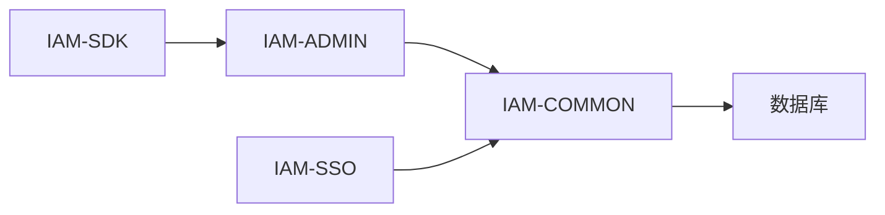

# 数据模型详解

<cite>
**本文引用的文件**
- [IamUser.java](file://iam-common/src/main/java/com/wkclz/iam/common/entity/IamUser.java)
- [IamRole.java](file://iam-common/src/main/java/com/wkclz/iam/common/entity/IamRole.java)
- [IamMenu.java](file://iam-common/src/main/java/com/wkclz/iam/common/entity/IamMenu.java)
- [IamRoleMenu.java](file://iam-common/src/main/java/com/wkclz/iam/common/entity/IamRoleMenu.java)
- [IamUserAuth.java](file://iam-common/src/main/java/com/wkclz/iam/common/entity/IamUserAuth.java)
- [IamUserAuthPassword.java](file://iam-common/src/main/java/com/wkclz/iam/common/entity/IamUserAuthPassword.java)
- [IamUserRole.java](file://iam-common/src/main/java/com/wkclz/iam/common/entity/IamUserRole.java)
- [IamApi.java](file://iam-common/src/main/java/com/wkclz/iam/common/entity/IamApi.java)
- [IamMenuApi.java](file://iam-common/src/main/java/com/wkclz/iam/common/entity/IamMenuApi.java)
- [IamAccessKey.java](file://iam-common/src/main/java/com/wkclz/iam/common/entity/IamAccessKey.java)
- [IamAccessKeyApi.java](file://iam-common/src/main/java/com/wkclz/iam/common/entity/IamAccessKeyApi.java)
- [IamDataDimension.java](file://iam-common/src/main/java/com/wkclz/iam/common/entity/IamDataDimension.java)
- [IamRoleData.java](file://iam-common/src/main/java/com/wkclz/iam/common/entity/IamRoleData.java)
- [IamTenant.java](file://iam-common/src/main/java/com/wkclz/iam/common/entity/IamTenant.java)
- [IamApp.java](file://iam-common/src/main/java/com/wkclz/iam/common/entity/IamApp.java)
- [IamLoginLog.java](file://iam-common/src/main/java/com/wkclz/iam/common/entity/IamLoginLog.java)
- [IamRequestLog.java](file://iam-common/src/main/java/com/wkclz/iam/common/entity/IamRequestLog.java)
- [IamUserPasswordHis.java](file://iam-common/src/main/java/com/wkclz/iam/common/entity/IamUserPasswordHis.java)
- [IamUserMenuService.java](file://iam-admin/src/main/java/com/wkclz/iam/admin/service/IamUserMenuService.java)
- [IamRoleMenuService.java](file://iam-admin/src/main/java/com/wkclz/iam/admin/service/IamRoleMenuService.java)
- [UserMenuRest.java](file://iam-admin/src/main/java/com/wkclz/iam/admin/rest/UserMenuRest.java)
- [RoleMenuRest.java](file://iam-admin/src/main/java/com/wkclz/iam/admin/rest/RoleMenuRest.java)
- [database-design.md](file://docs/architecture/database-design.md)
</cite>

## 目录
1. [引言](#引言)
2. [项目结构](#项目结构)
3. [核心组件](#核心组件)
4. [架构总览](#架构总览)
5. [详细组件分析](#详细组件分析)
6. [依赖分析](#依赖分析)
7. [性能考虑](#性能考虑)
8. [故障排除指南](#故障排除指南)
9. [结论](#结论)
10. [附录](#附录)

## 引言
本文件面向SH-IAM系统的核心数据模型，聚焦用户、角色、菜单、权限等关键实体，系统性阐述其设计理念、业务含义、字段定义、约束与默认值、实体间关联关系（一对一、一对多、多对多）、外键约束、实体完整性检查、业务规则验证与数据一致性保障，并提供实体关系图与ER模型图。同时，整理数据字典、枚举值定义与业务术语，帮助开发者与产品人员建立统一的数据认知。

## 项目结构
SH-IAM采用分层架构：前端UI、后端服务（IAM-ADMIN、IAM-SSO）、公共模块（IAM-COMMON）与SDK（IAM-SDK）。数据模型主要沉淀在公共模块的实体类中，服务层负责业务编排，REST层提供对外接口，XML Mapper负责SQL映射。

## 核心组件
本节从数据模型视角梳理核心实体及其职责边界：
- 用户实体：承载用户身份标识、基础信息与状态
- 角色实体：描述权限集合的抽象
- 菜单实体：页面导航与功能入口
- 权限实体：API访问控制的基本单元
- 访问密钥实体：第三方应用接入凭证
- 数据维度实体：租户/组织/区域等上下文维度
- 关联实体：用户-角色、角色-菜单、菜单-API、密钥-API、角色-数据维度等

**章节来源**
- [IamUser.java](file://iam-common/src/main/java/com/wkclz/iam/common/entity/IamUser.java)
- [IamRole.java](file://iam-common/src/main/java/com/wkclz/iam/common/entity/IamRole.java)
- [IamMenu.java](file://iam-common/src/main/java/com/wkclz/iam/common/entity/IamMenu.java)
- [IamApi.java](file://iam-common/src/main/java/com/wkclz/iam/common/entity/IamApi.java)
- [IamAccessKey.java](file://iam-common/src/main/java/com/wkclz/iam/common/entity/IamAccessKey.java)
- [IamDataDimension.java](file://iam-common/src/main/java/com/wkclz/iam/common/entity/IamDataDimension.java)

## 架构总览
下图展示核心实体之间的ER关系与典型交互流程：

**图表来源**
- [IamUser.java](file://iam-common/src/main/java/com/wkclz/iam/common/entity/IamUser.java)
- [IamRole.java](file://iam-common/src/main/java/com/wkclz/iam/common/entity/IamRole.java)
- [IamMenu.java](file://iam-common/src/main/java/com/wkclz/iam/common/entity/IamMenu.java)
- [IamApi.java](file://iam-common/src/main/java/com/wkclz/iam/common/entity/IamApi.java)
- [IamAccessKey.java](file://iam-common/src/main/java/com/wkclz/iam/common/entity/IamAccessKey.java)
- [IamDataDimension.java](file://iam-common/src/main/java/com/wkclz/iam/common/entity/IamDataDimension.java)
- [IamRoleMenu.java](file://iam-common/src/main/java/com/wkclz/iam/common/entity/IamRoleMenu.java)
- [IamUserRole.java](file://iam-common/src/main/java/com/wkclz/iam/common/entity/IamUserRole.java)
- [IamMenuApi.java](file://iam-common/src/main/java/com/wkclz/iam/common/entity/IamMenuApi.java)
- [IamAccessKeyApi.java](file://iam-common/src/main/java/com/wkclz/iam/common/entity/IamAccessKeyApi.java)
- [IamRoleData.java](file://iam-common/src/main/java/com/wkclz/iam/common/entity/IamRoleData.java)
- [IamTenant.java](file://iam-common/src/main/java/com/wkclz/iam/common/entity/IamTenant.java)
- [IamApp.java](file://iam-common/src/main/java/com/wkclz/iam/common/entity/IamApp.java)
- [IamLoginLog.java](file://iam-common/src/main/java/com/wkclz/iam/common/entity/IamLoginLog.java)
- [IamRequestLog.java](file://iam-common/src/main/java/com/wkclz/iam/common/entity/IamRequestLog.java)
- [IamUserAuth.java](file://iam-common/src/main/java/com/wkclz/iam/common/entity/IamUserAuth.java)
- [IamUserAuthPassword.java](file://iam-common/src/main/java/com/wkclz/iam/common/entity/IamUserAuthPassword.java)
- [IamUserPasswordHis.java](file://iam-common/src/main/java/com/wkclz/iam/common/entity/IamUserPasswordHis.java)

## 详细组件分析

### 用户实体（IAM_USER）
- 设计理念：以user_code作为主键，支持多租户与多应用隔离；区分基础信息与状态位，便于审计与合规
- 字段要点
  - 主键：user_code（字符串，唯一）
  - 外键：tenant_code、app_code（可空时代表全局/默认）
  - 基础信息：username、nickname、phone、email
  - 状态：status（整数，枚举化，如启用/禁用）
  - 审计：create_time/create_by、update_time/update_by、remark、version
- 约束与默认
  - 非空：tenant_code、app_code、username、status
  - 默认：status=启用，version=0
- 业务规则
  - user_code全局唯一
  - 同一租户+应用内用户名唯一
  - 状态变更需版本号一致（乐观锁）

**章节来源**
- [IamUser.java](file://iam-common/src/main/java/com/wkclz/iam/common/entity/IamUser.java)

### 角色实体（IAM_ROLE）
- 设计理念：角色作为权限集合的抽象，支持排序与状态管理
- 字段要点
  - 主键：role_code（字符串）
  - 外键：tenant_code、app_code
  - 属性：role_name、sort、status
  - 审计：create_time/create_by、update_time/update_by、remark、version
- 约束与默认
  - 非空：tenant_code、app_code、role_name、status
  - 默认：sort=0，status=启用，version=0
- 业务规则
  - role_code在同一租户+应用内唯一
  - 排序用于前端渲染与权限优先级

**章节来源**
- [IamRole.java](file://iam-common/src/main/java/com/wkclz/iam/common/entity/IamRole.java)

### 菜单实体（IAM_MENU）
- 设计理念：描述页面导航与功能入口，支持树形结构与类型区分（目录/菜单/按钮）
- 字段要点
  - 主键：menu_code（字符串）
  - 外键：tenant_code、app_code
  - 属性：menu_name、path、component、menu_type（目录/菜单/按钮）、sort、status
  - 审计：create_time/create_by、update_time/update_by、remark、version
- 约束与默认
  - 非空：tenant_code、app_code、menu_name、menu_type、status
  - 默认：sort=0，status=启用，version=0
- 业务规则
  - menu_code在同一租户+应用内唯一
  - menu_type决定前端渲染与权限粒度

**章节来源**
- [IamMenu.java](file://iam-common/src/main/java/com/wkclz/iam/common/entity/IamMenu.java)

### 权限实体（IAM_API）
- 设计理念：抽象API访问控制的基本单元，支持HTTP方法与URL模式匹配
- 字段要点
  - 主键：api_code（字符串）
  - 外键：tenant_code、app_code
  - 属性：api_name、method（GET/POST/...）、url_pattern（正则或通配符）
  - 审计：create_time/create_by、update_time/update_by、remark、version
- 约束与默认
  - 非空：tenant_code、app_code、api_name、method、url_pattern、status
  - 默认：status=启用，version=0
- 业务规则
  - api_code在同一租户+应用内唯一
  - method+url_pattern组合用于鉴权与审计

**章节来源**
- [IamApi.java](file://iam-common/src/main/java/com/wkclz/iam/common/entity/IamApi.java)

### 访问密钥实体（IAM_ACCESS_KEY）
- 设计理念：第三方应用接入凭证，支持密钥-接口绑定与状态管理
- 字段要点
  - 主键：ak（字符串）
  - 外键：tenant_code、app_code
  - 属性：ak_name、secret（敏感信息，仅存储摘要或加密）
  - 审计：create_time/create_by、update_time/update_by、remark、version
- 约束与默认
  - 非空：tenant_code、app_code、ak_name、secret、status
  - 默认：status=启用，version=0
- 业务规则
  - ak全局唯一
  - secret不落库明文，仅保留安全哈希或加密值

**章节来源**
- [IamAccessKey.java](file://iam-common/src/main/java/com/wkclz/iam/common/entity/IamAccessKey.java)

### 数据维度实体（IAM_DATA_DIMENSION）
- 设计理念：租户/组织/区域等上下文维度，用于数据隔离与权限域限定
- 字段要点
  - 主键：dim_code（字符串）
  - 外键：tenant_code、app_code
  - 属性：dim_name、status
  - 审计：create_time/create_by、update_time/update_by、remark、version
- 约束与默认
  - 非空：tenant_code、app_code、dim_name、status
  - 默认：status=启用，version=0
- 业务规则
  - dim_code在同一租户+应用内唯一

**章节来源**
- [IamDataDimension.java](file://iam-common/src/main/java/com/wkclz/iam/common/entity/IamDataDimension.java)

### 关联实体

#### 角色-菜单（IAM_ROLE_MENU）
- 关系：多对多中间表，支持角色对多个菜单的授权与排序
- 字段要点
  - 主键：id（自增）
  - 外键：role_code、menu_code、app_code
  - 属性：sort、remark、version
  - 审计：create_time/create_by、update_time/update_by
- 约束与默认
  - 非空：role_code、menu_code、app_code、status
  - 默认：sort=0，status=启用，version=0
- 业务规则
  - 组合唯一：role_code+menu_code（同一应用内唯一）
  - 支持批量解绑与重新绑定

**章节来源**
- [IamRoleMenu.java](file://iam-common/src/main/java/com/wkclz/iam/common/entity/IamRoleMenu.java)
- [IamRoleMenuService.java](file://iam-admin/src/main/java/com/wkclz/iam/admin/service/IamRoleMenuService.java)
- [RoleMenuRest.java](file://iam-admin/src/main/java/com/wkclz/iam/admin/rest/RoleMenuRest.java)

#### 用户-角色（IAM_USER_ROLE）
- 关系：多对多中间表，支持用户拥有多角色
- 字段要点
  - 主键：id（自增）
  - 外键：user_code、role_code、app_code
  - 审计：create_time/create_by、update_time/update_by
- 约束与默认
  - 非空：user_code、role_code、app_code
  - 默认：status=启用，version=0
- 业务规则
  - 组合唯一：user_code+role_code（同一应用内唯一）

**章节来源**
- [IamUserRole.java](file://iam-common/src/main/java/com/wkclz/iam/common/entity/IamUserRole.java)

#### 菜单-API（IAM_MENU_API）
- 关系：多对多中间表，描述菜单与API的包含关系
- 字段要点
  - 主键：id（自增）
  - 外键：menu_code、api_code、app_code
  - 审计：create_time/create_by、update_time/update_by
- 约束与默认
  - 非空：menu_code、api_code、app_code
  - 默认：status=启用，version=0
- 业务规则
  - 组合唯一：menu_code+api_code（同一应用内唯一）

**章节来源**
- [IamMenuApi.java](file://iam-common/src/main/java/com/wkclz/iam/common/entity/IamMenuApi.java)

#### 密钥-API（IAM_ACCESS_KEY_API）
- 关系：多对多中间表，描述密钥可访问的API集合
- 字段要点
  - 主键：id（自增）
  - 外键：ak、api_code、app_code
  - 审计：create_time/create_by、update_time/update_by
- 约束与默认
  - 非空：ak、api_code、app_code
  - 默认：status=启用，version=0
- 业务规则
  - 组合唯一：ak+api_code（同一应用内唯一）

**章节来源**
- [IamAccessKeyApi.java](file://iam-common/src/main/java/com/wkclz/iam/common/entity/IamAccessKeyApi.java)

#### 角色-数据维度（IAM_ROLE_DATA）
- 关系：角色可被限定在特定数据维度上，实现数据域隔离
- 字段要点
  - 主键：id（自增）
  - 外键：role_code、dim_code、app_code
  - 审计：create_time/create_by、update_time/update_by
- 约束与默认
  - 非空：role_code、dim_code、app_code
  - 默认：status=启用，version=0
- 业务规则
  - 组合唯一：role_code+dim_code（同一应用内唯一）

**章节来源**
- [IamRoleData.java](file://iam-common/src/main/java/com/wkclz/iam/common/entity/IamRoleData.java)

### 认证与会话相关实体

#### 用户认证（IAM_USER_AUTH）
- 关系：用户与多种认证方式（账号密码、手机、邮箱等）的映射
- 字段要点
  - 主键：user_code
  - 属性：auth_type（枚举：账号密码/手机/邮箱等）、identifier（如手机号/邮箱）、credential（凭据）
  - 状态：status、审计字段
- 约束与默认
  - 非空：user_code、auth_type、identifier、status
  - 默认：status=启用，version=0
- 业务规则
  - identifier在同种auth_type下唯一
  - credential按类型安全存储

**章节来源**
- [IamUserAuth.java](file://iam-common/src/main/java/com/wkclz/iam/common/entity/IamUserAuth.java)

#### 用户密码历史（IAM_USER_PASSWORD_HIS）
- 关系：记录用户密码变更历史，支持密码策略校验（如禁止复用）
- 字段要点
  - 主键：id（自增）
  - 外键：user_code
  - 属性：password（历史值，通常不存储明文）
  - 审计：create_time/create_by、update_time/update_by
- 约束与默认
  - 非空：user_code、password
  - 默认：status=启用，version=0
- 业务规则
  - 可配置保留N条历史，防止密码循环使用

**章节来源**
- [IamUserPasswordHis.java](file://iam-common/src/main/java/com/wkclz/iam/common/entity/IamUserPasswordHis.java)

#### 登录日志（IAM_LOGIN_LOG）
- 关系：记录用户登录行为，支持风控与审计
- 字段要点
  - 主键：id（自增）
  - 外键：user_code
  - 属性：ip、ua、status（成功/失败）
  - 时间：create_time
- 约束与默认
  - 非空：user_code、ip、ua、status
- 业务规则
  - 可结合IP地理位置缓存进行风险识别

**章节来源**
- [IamLoginLog.java](file://iam-common/src/main/java/com/wkclz/iam/common/entity/IamLoginLog.java)

#### 请求日志（IAM_REQUEST_LOG）
- 关系：记录API调用轨迹，支持审计与问题定位
- 字段要点
  - 主键：id（自增）
  - 外键：user_code、api_code
  - 属性：method、url、status
  - 时间：create_time
- 约束与默认
  - 非空：user_code、api_code、method、url、status
- 业务规则
  - 与IAM_API保持强关联，便于统计与分析

**章节来源**
- [IamRequestLog.java](file://iam-common/src/main/java/com/wkclz/iam/common/entity/IamRequestLog.java)

### 实体关系与业务流程

#### 用户-角色-菜单-权限流程

**图表来源**
- [UserMenuRest.java](file://iam-admin/src/main/java/com/wkclz/iam/admin/rest/UserMenuRest.java)
- [IamUserMenuService.java](file://iam-admin/src/main/java/com/wkclz/iam/admin/service/IamUserMenuService.java)

#### 角色-菜单绑定流程

**图表来源**
- [RoleMenuRest.java](file://iam-admin/src/main/java/com/wkclz/iam/admin/rest/RoleMenuRest.java)
- [IamRoleMenuService.java](file://iam-admin/src/main/java/com/wkclz/iam/admin/service/IamRoleMenuService.java)

## 依赖分析
- 模块耦合
  - IAM-ADMIN依赖IAM-COMMON的实体与DTO，通过服务层编排业务
  - IAM-SSO依赖IAM-COMMON进行认证与会话管理
  - SDK依赖IAM-ADMIN提供的REST接口
- 外部依赖
  - MyBatis XML Mapper负责SQL映射
  - Spring Boot自动装配与过滤器链（如鉴权过滤器）
- 循环依赖
  - 通过服务层解耦，避免实体间直接循环引用

## 性能考虑
- 索引建议
  - 所有主键与外键均应建立索引
  - 组合唯一键（如role_code+menu_code）建议建立复合索引
  - 查询高频字段（如user_code、app_code、tenant_code）建立覆盖索引
- 缓存策略
  - 菜单树与权限映射可缓存至Redis，降低数据库压力
  - IP地理位置可缓存，减少外部查询
- 分页与批量
  - 列表查询使用分页，避免全量加载
  - 批量操作使用批处理与事务控制

## 故障排除指南
- 常见异常与处理
  - 记录不存在：更新/删除前先查询，不存在抛出“记录不存在”异常
  - 记录重复：插入/更新前执行唯一性校验，重复抛出“记录重复”异常
  - 参数校验：REST层对必填参数进行断言，非法参数抛出“参数错误”
- 日志与追踪
  - 登录日志与请求日志用于问题定位与审计
  - 结合用户会话与Token追踪用户行为

**章节来源**
- [IamRoleMenuService.java](file://iam-admin/src/main/java/com/wkclz/iam/admin/service/IamRoleMenuService.java)
- [UserMenuRest.java](file://iam-admin/src/main/java/com/wkclz/iam/admin/rest/UserMenuRest.java)
- [RoleMenuRest.java](file://iam-admin/src/main/java/com/wkclz/iam/admin/rest/RoleMenuRest.java)

## 结论
本数据模型围绕“用户-角色-菜单-权限”主线，辅以“访问密钥-数据维度-认证历史-日志审计”，形成完整的权限管控闭环。通过清晰的主外键关系、严格的唯一性与状态管理、完善的审计字段与版本号机制，确保系统在多租户、多应用场景下的数据一致性与可追溯性。

## 附录

### 数据字典与枚举值
- 状态枚举（status）
  - 启用：1
  - 禁用：0
- 菜单类型（menu_type）
  - 目录：1
  - 菜单：2
  - 按钮：3
- 认证类型（auth_type）
  - 账号密码：PASSWORD
  - 手机：PHONE
  - 邮箱：EMAIL
- HTTP方法（method）
  - GET/POST/PUT/DELETE/HEAD/OPTIONS/PATCH等

### 业务术语
- 租户（Tenant）：多租户系统中的独立组织单位
- 应用（App）：租户内的业务系统或子域
- 菜单（Menu）：前端导航与功能入口
- API：受控的后端接口资源
- 角色（Role）：权限集合的抽象
- 访问密钥（AccessKey）：第三方应用的API凭证
- 数据维度（DataDimension）：数据隔离的上下文域

### 设计文档参考
- 数据库设计文档：[database-design.md](file://docs/architecture/database-design.md)