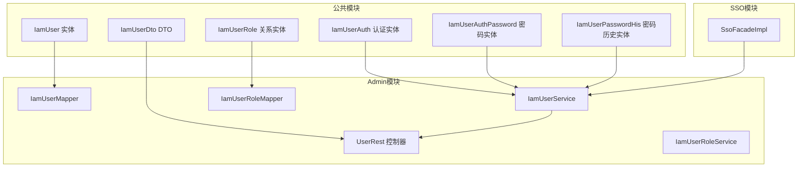
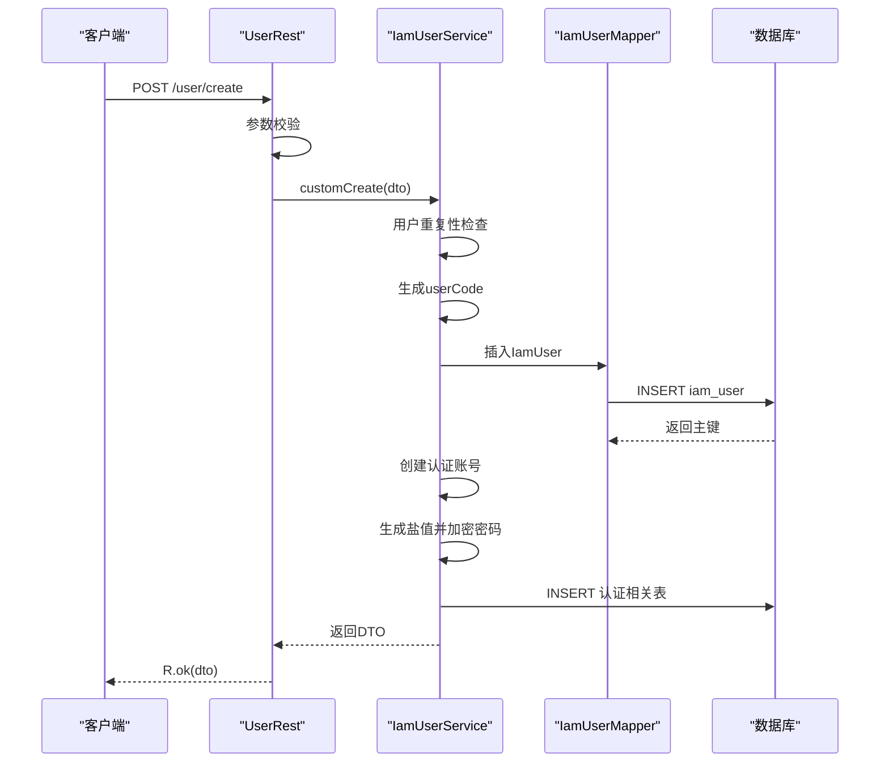
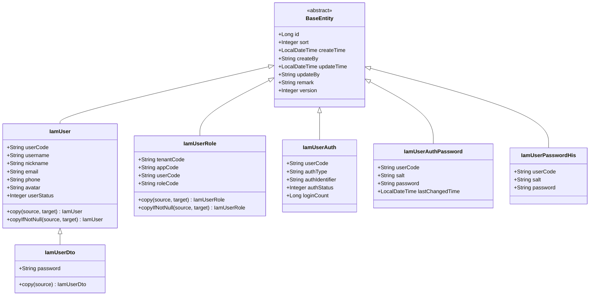
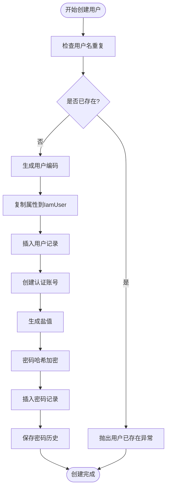
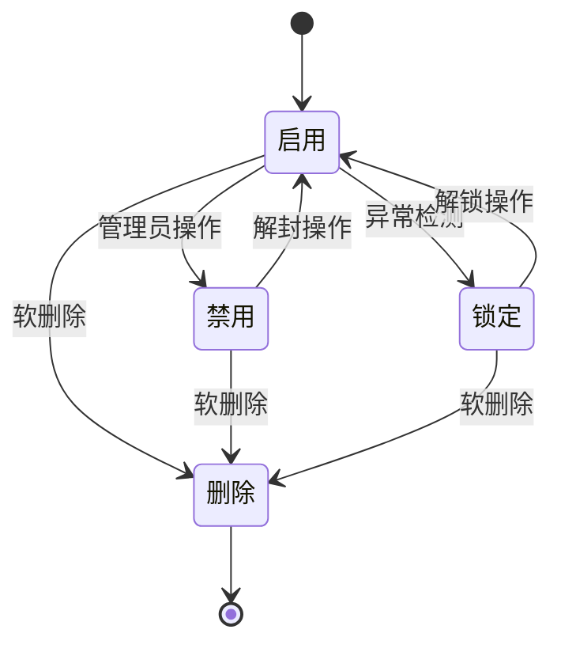
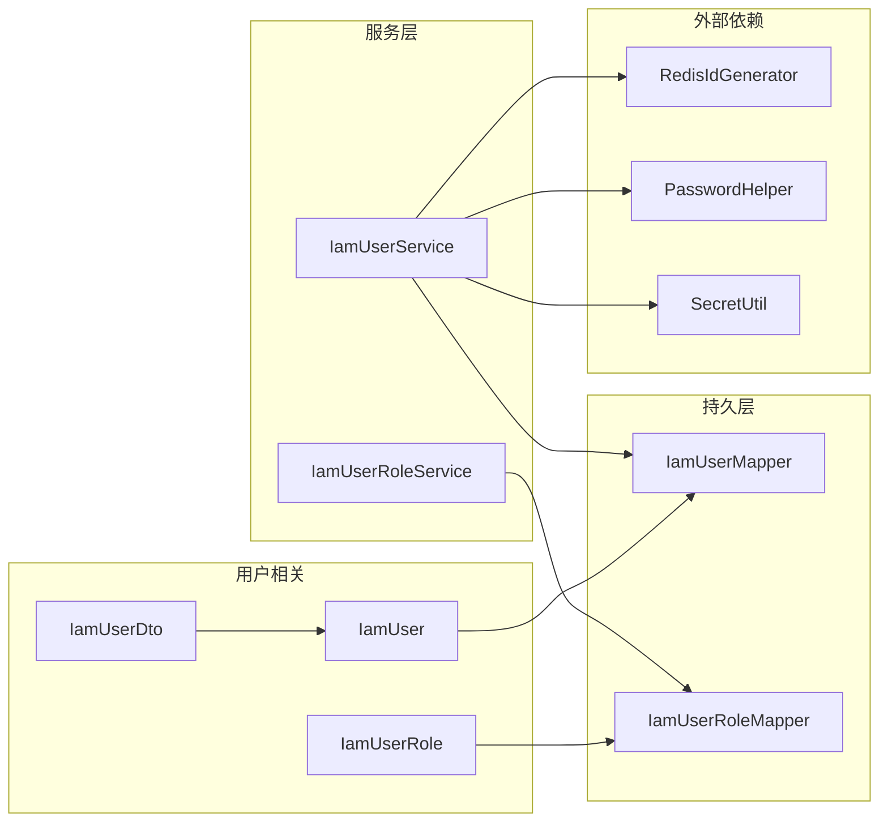

# 用户实体模型

<cite>
**本文档引用的文件**
- [IamUser.java](file://iam-common/src/main/java/com/wkclz/iam/common/entity/IamUser.java)
- [IamUserDto.java](file://iam-common/src/main/java/com/wkclz/iam/common/dto/IamUserDto.java)
- [IamUserMapper.java](file://iam-admin/src/main/java/com/wkclz/iam/admin/mapper/IamUserMapper.java)
- [IamUserService.java](file://iam-admin/src/main/java/com/wkclz/iam/admin/service/IamUserService.java)
- [UserRest.java](file://iam-admin/src/main/java/com/wkclz/iam/admin/rest/UserRest.java)
- [IamUserRole.java](file://iam-common/src/main/java/com/wkclz/iam/common/entity/IamUserRole.java)
- [IamUserRoleMapper.java](file://iam-admin/src/main/java/com/wkclz/iam/admin/mapper/IamUserRoleMapper.java)
- [IamUserRoleService.java](file://iam-admin/src/main/java/com/wkclz/iam/admin/service/IamUserRoleService.java)
- [IamUserAuth.java](file://iam-common/src/main/java/com/wkclz/iam/common/entity/IamUserAuth.java)
- [IamUserAuthPassword.java](file://iam-common/src/main/java/com/wkclz/iam/common/entity/IamUserAuthPassword.java)
- [IamUserPasswordHis.java](file://iam-common/src/main/java/com/wkclz/iam/common/entity/IamUserPasswordHis.java)
- [PasswordHelper.java](file://iam-common/src/main/java/com/wkclz/iam/common/helper/PasswordHelper.java)
- [SecretUtil.java](file://iam-core/src/main/java/com/wkclz/tool/utils/SecretUtil.java)
- [RedisIdGenerator.java](file://iam-core/src/main/java/com/wkclz/redis/helper/RedisIdGenerator.java)
</cite>

## 目录
1. [简介](#简介)
2. [项目结构](#项目结构)
3. [核心组件](#核心组件)
4. [架构概览](#架构概览)
5. [详细组件分析](#详细组件分析)
6. [依赖关系分析](#依赖关系分析)
7. [性能考虑](#性能考虑)
8. [故障排除指南](#故障排除指南)
9. [结论](#结论)

## 简介

本文件为IAM系统中的用户实体模型提供全面的技术文档。重点阐述IamUser实体的设计理念、字段定义与业务含义，以及与用户认证、角色管理等相关实体的复杂关系。文档涵盖数据验证规则、约束条件、业务规则、生命周期管理、软删除机制和数据安全考量，并提供CRUD操作的最佳实践指导。

## 项目结构

IAM系统采用分层架构设计，用户实体位于公共模块中，通过Admin模块进行管理，SSO模块提供认证能力。用户相关的核心文件分布如下：

**图表来源**
- [IamUser.java:19-106](file://iam-common/src/main/java/com/wkclz/iam/common/entity/IamUser.java#L19-L106)
- [IamUserDto.java:15-32](file://iam-common/src/main/java/com/wkclz/iam/common/dto/IamUserDto.java#L15-L32)
- [IamUserRole.java:19-82](file://iam-common/src/main/java/com/wkclz/iam/common/entity/IamUserRole.java#L19-L82)
- [IamUserMapper.java:15-21](file://iam-admin/src/main/java/com/wkclz/iam/admin/mapper/IamUserMapper.java#L15-L21)
- [IamUserService.java:38-124](file://iam-admin/src/main/java/com/wkclz/iam/admin/service/IamUserService.java#L38-L124)
- [UserRest.java:18-65](file://iam-admin/src/main/java/com/wkclz/iam/admin/rest/UserRest.java#L18-L65)

**章节来源**
- [IamUser.java:1-108](file://iam-common/src/main/java/com/wkclz/iam/common/entity/IamUser.java#L1-L108)
- [IamUserDto.java:1-34](file://iam-common/src/main/java/com/wkclz/iam/common/dto/IamUserDto.java#L1-L34)
- [IamUserRole.java:1-84](file://iam-common/src/main/java/com/wkclz/iam/common/entity/IamUserRole.java#L1-L84)

## 核心组件

### IamUser 实体设计

IamUser是用户信息的核心实体，继承自BaseEntity，包含以下关键字段：

#### 基本信息字段
- **userCode**: 用户编码，全局唯一标识符，必填
- **username**: 用户名，登录凭证，必填  
- **nickname**: 昵称，必填
- **email**: 邮箱地址
- **phone**: 手机号码
- **avatar**: 头像URL

#### 账户状态字段
- **userStatus**: 用户状态，采用枚举式设计
  - 1: 启用（Active）
  - 2: 禁用（Disabled）  
  - 3: 锁定（Locked）

#### 时间戳字段
- 继承自BaseEntity的时间戳字段用于审计追踪

#### 复制工具方法
- `copy()`: 完整复制所有字段
- `copyIfNotNull()`: 仅复制非空字段，支持部分更新

**章节来源**
- [IamUser.java:21-104](file://iam-common/src/main/java/com/wkclz/iam/common/entity/IamUser.java#L21-L104)

### IamUserDto 数据传输对象

IamUserDto继承IamUser，扩展了敏感信息字段：
- **password**: 明文密码（仅用于创建时传递）

提供静态工厂方法实现Entity与DTO的转换。

**章节来源**
- [IamUserDto.java:15-32](file://iam-common/src/main/java/com/wkclz/iam/common/dto/IamUserDto.java#L15-L32)

### IamUserRole 关系实体

用户-角色多对多关系的中间表：
- **tenantCode**: 租户编码
- **appCode**: 应用编码  
- **userCode**: 用户编码（外键约束）
- **roleCode**: 角色编码

该设计支持多租户和多应用环境下的权限隔离。

**章节来源**
- [IamUserRole.java:21-43](file://iam-common/src/main/java/com/wkclz/iam/common/entity/IamUserRole.java#L21-L43)

## 架构概览

用户管理采用经典的三层架构模式，结合领域驱动设计原则：

**图表来源**
- [UserRest.java:34-41](file://iam-admin/src/main/java/com/wkclz/iam/admin/rest/UserRest.java#L34-L41)
- [IamUserService.java:78-121](file://iam-admin/src/main/java/com/wkclz/iam/admin/service/IamUserService.java#L78-L121)

## 详细组件分析

### 用户实体类图

**图表来源**
- [IamUser.java:19-106](file://iam-common/src/main/java/com/wkclz/iam/common/entity/IamUser.java#L19-L106)
- [IamUserDto.java:15-32](file://iam-common/src/main/java/com/wkclz/iam/common/dto/IamUserDto.java#L15-L32)
- [IamUserRole.java:19-82](file://iam-common/src/main/java/com/wkclz/iam/common/entity/IamUserRole.java#L19-L82)

### 用户创建流程

**图表来源**
- [IamUserService.java:78-121](file://iam-admin/src/main/java/com/wkclz/iam/admin/service/IamUserService.java#L78-L121)

### 用户状态管理

用户状态采用三态设计，支持完整的生命周期管理：

**图表来源**
- [IamUser.java:58-61](file://iam-common/src/main/java/com/wkclz/iam/common/entity/IamUser.java#L58-L61)

### 数据验证与约束

系统在多个层面实施数据验证：

1. **控制器层验证**
   - 必填字段检查
   - 版本号验证（更新操作）
   - 参数格式校验

2. **服务层验证**
   - 用户重复性检查
   - 密码强度验证
   - 角色分配有效性

3. **数据库层约束**
   - 主键约束
   - 唯一性约束
   - 外键约束

**章节来源**
- [UserRest.java:57-63](file://iam-admin/src/main/java/com/wkclz/iam/admin/rest/UserRest.java#L57-L63)
- [IamUserService.java:78-86](file://iam-admin/src/main/java/com/wkclz/iam/admin/service/IamUserService.java#L78-L86)

## 依赖关系分析

用户实体与其他组件的依赖关系如下：

**图表来源**
- [IamUserService.java:42-48](file://iam-admin/src/main/java/com/wkclz/iam/admin/service/IamUserService.java#L42-L48)
- [IamUserRoleService.java:18-24](file://iam-admin/src/main/java/com/wkclz/iam/admin/service/IamUserRoleService.java#L18-L24)

**章节来源**
- [IamUserMapper.java:15-21](file://iam-admin/src/main/java/com/wkclz/iam/admin/mapper/IamUserMapper.java#L15-L21)
- [IamUserRoleMapper.java:13-19](file://iam-admin/src/main/java/com/wkclz/iam/admin/mapper/IamUserRoleMapper.java#L13-L19)

## 性能考虑

### 查询优化策略

1. **索引设计**
   - userCode: 唯一索引
   - username: 唯一索引
   - email: 普通索引
   - phone: 普通索引

2. **分页查询**
   - 使用PageQuery实现高效分页
   - 支持复合条件查询

3. **批量操作**
   - 提供批量插入和更新接口
   - 优化事务处理

### 缓存策略

- 用户基本信息缓存
- 角色权限缓存
- 认证信息缓存

## 故障排除指南

### 常见问题及解决方案

1. **用户重复创建异常**
   - 症状: 用户名已存在
   - 解决: 检查用户名唯一性，使用不同用户名

2. **密码加密失败**
   - 症状: 密码无法正确存储
   - 解决: 验证盐值生成和哈希算法

3. **版本冲突**
   - 症状: 更新失败
   - 解决: 获取最新版本号后重试

4. **角色分配异常**
   - 症状: 用户角色无法分配
   - 解决: 检查userCode和roleCode的有效性

**章节来源**
- [IamUserService.java:84-86](file://iam-admin/src/main/java/com/wkclz/iam/admin/service/IamUserService.java#L84-L86)
- [IamUserRoleService.java:75-77](file://iam-admin/src/main/java/com/wkclz/iam/admin/service/IamUserRoleService.java#L75-L77)

## 结论

IamUser实体模型设计遵循了清晰的分层架构和领域驱动设计原则。通过合理的字段设计、严格的验证机制和完善的生命周期管理，为用户管理提供了可靠的基础。多租户和多应用支持使得系统能够适应复杂的业务场景。建议在实际部署中重点关注性能优化和安全性保障，确保系统稳定运行。