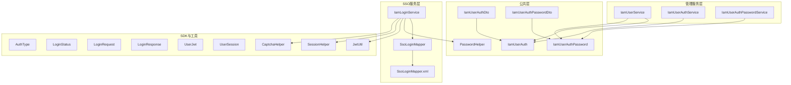
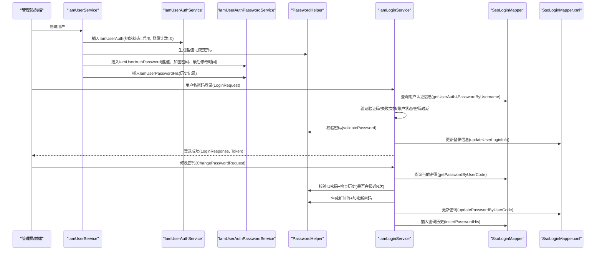
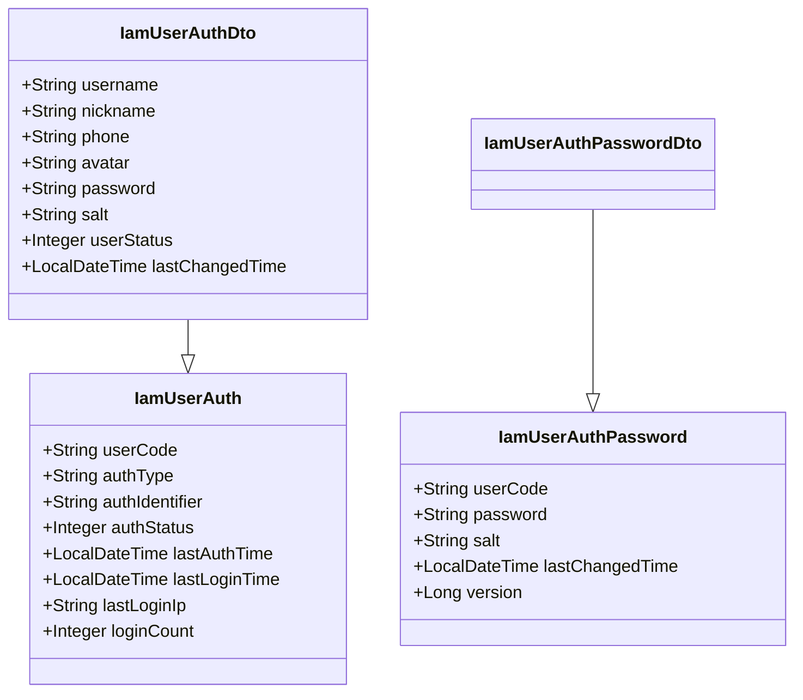
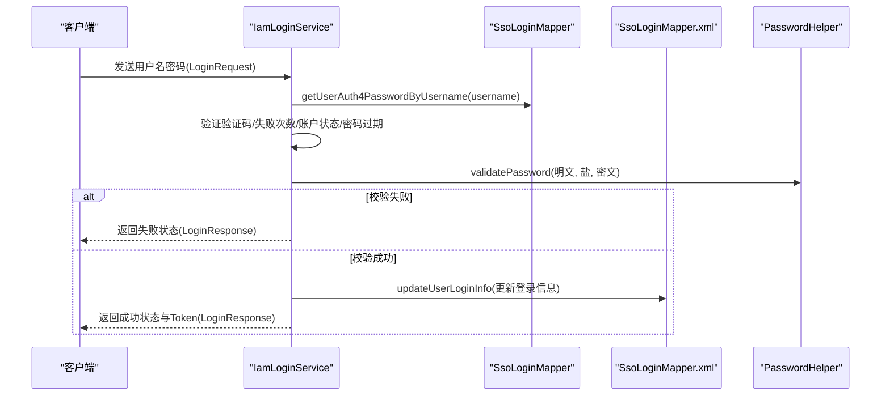
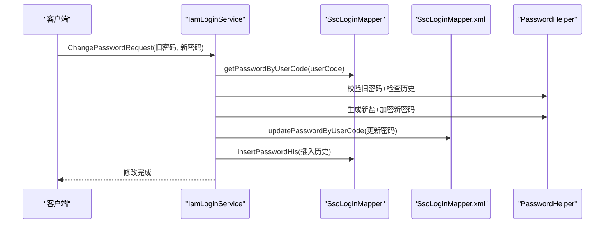
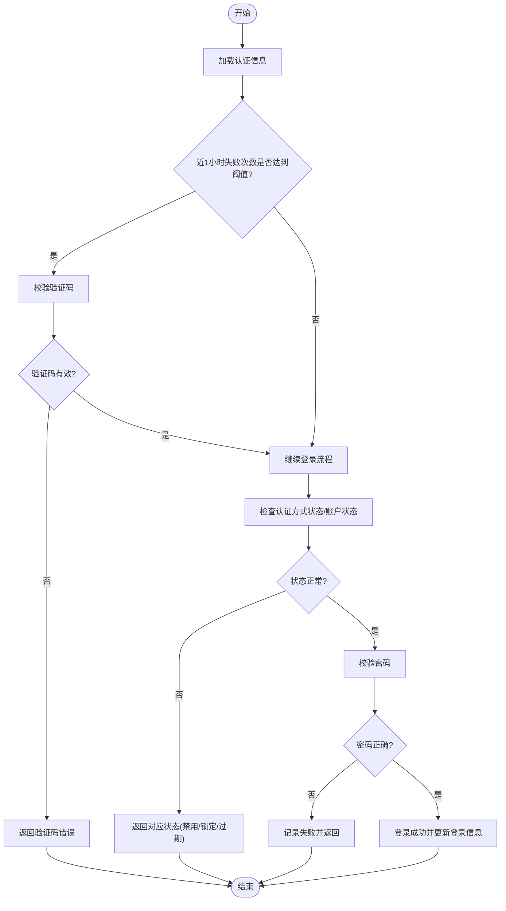
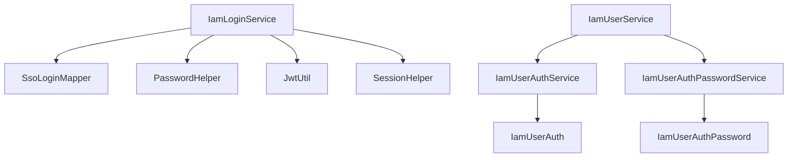

# 用户认证实体模型

<cite>
**本文引用的文件**
- [IamUserAuth.java](file://iam-common/src/main/java/com/wkclz/iam/common/entity/IamUserAuth.java)
- [IamUserAuthPassword.java](file://iam-common/src/main/java/com/wkclz/iam/common/entity/IamUserAuthPassword.java)
- [IamUserAuthDto.java](file://iam-common/src/main/java/com/wkclz/iam/common/dto/IamUserAuthDto.java)
- [IamUserAuthPasswordDto.java](file://iam-common/src/main/java/com/wkclz/iam/common/dto/IamUserAuthPasswordDto.java)
- [PasswordHelper.java](file://iam-common/src/main/java/com/wkclz/iam/common/helper/PasswordHelper.java)
- [IamUserService.java](file://iam-admin/src/main/java/com/wkclz/iam/admin/service/IamUserService.java)
- [IamUserAuthService.java](file://iam-admin/src/main/java/com/wkclz/iam/admin/service/IamUserAuthService.java)
- [IamUserAuthPasswordService.java](file://iam-admin/src/main/java/com/wkclz/iam/admin/service/IamUserAuthPasswordService.java)
- [IamLoginService.java](file://iam-sso/src/main/java/com/wkclz/iam/sso/service/IamLoginService.java)
- [SsoLoginMapper.java](file://iam-sso/src/main/java/com/wkclz/iam/sso/mapper/SsoLoginMapper.java)
- [SsoLoginMapper.xml](file://iam-sso/src/main/resources/mapper/SsoLoginMapper.xml)
- [IamUserAuthPasswordMapper.java](file://iam-admin/src/main/java/com/wkclz/iam/admin/mapper/IamUserAuthPasswordMapper.java)
- [IamUserAuthPasswordMapper.xml](file://iam-admin/src/main/resources/mapper/IamUserAuthPasswordMapper.xml)
- [AuthType.java](file://iam-sdk/src/main/java/com/wkclz/iam/sdk/enums/AuthType.java)
- [LoginStatus.java](file://iam-sdk/src/main/java/com/wkclz/iam/sdk/enums/LoginStatus.java)
- [LoginRequest.java](file://iam-sdk/src/main/java/com/wkclz/iam/sdk/model/LoginRequest.java)
- [LoginResponse.java](file://iam-sdk/src/main/java/com/wkclz/iam/sdk/model/LoginResponse.java)
- [UserJwt.java](file://iam-sdk/src/main/java/com/wkclz/iam/sdk/model/UserJwt.java)
- [UserSession.java](file://iam-sdk/src/main/java/com/wkclz/iam/sdk/model/UserSession.java)
- [CaptchaHelper.java](file://iam-sdk/src/main/java/com/wkclz/iam/sdk/helper/CaptchaHelper.java)
- [JwtUtil.java](file://iam-sdk/src/main/java/com/wkclz/iam/sdk/util/JwtUtil.java)
- [SessionHelper.java](file://iam-sdk/src/main/java/com/wkclz/iam/sdk/helper/SessionHelper.java)
- [IamLoginLog.java](file://iam-common/src/main/java/com/wkclz/iam/common/entity/IamLoginLog.java)
- [IamLoginLogMapper.java](file://iam-sso/src/main/java/com/wkclz/iam/sso/mapper/IamLoginLogMapper.java)
- [IamLoginLogMapper.xml](file://iam-sso/src/main/resources/mapper/IamLoginLogMapper.xml)
</cite>

## 目录
1. [简介](#简介)
2. [项目结构](#项目结构)
3. [核心组件](#核心组件)
4. [架构总览](#架构总览)
5. [详细组件分析](#详细组件分析)
6. [依赖分析](#依赖分析)
7. [性能考虑](#性能考虑)
8. [故障排查指南](#故障排查指南)
9. [结论](#结论)
10. [附录](#附录)

## 简介
本文件聚焦于IAM系统中的用户认证实体模型，系统性阐述IamUserAuth与IamUserAuthPassword两个核心实体的设计与实现，覆盖以下关键主题：
- 多种认证方式支持：用户名密码、第三方登录、手机短信等（通过认证类型扩展）
- 密码存储机制：加密算法、盐值生成、密码历史记录与密码强度策略
- 关系建模：用户实体与认证数据的一对一关系及隐私保护
- 安全控制：认证失败次数限制、账户锁定机制、并发会话控制与安全审计日志
- 实现示例与最佳实践：从注册、登录、改密到重置密码的全流程

## 项目结构
围绕认证实体模型的关键模块分布如下：
- 公共实体与DTO：iam-common 中的 IamUserAuth、IamUserAuthPassword 及其 DTO
- 辅助工具：PasswordHelper 提供密码生成与校验
- 管理服务：iam-admin 中的 IamUserService、IamUserAuthService、IamUserAuthPasswordService
- 单点登录与登录流程：iam-sso 中的 IamLoginService、SsoLoginMapper 及其 XML 映射
- SDK与枚举：AuthType、LoginStatus、LoginRequest、LoginResponse、UserJwt、UserSession 等
- 审计与验证码：IamLoginLog、IamLoginLogMapper、CaptchaHelper、JwtUtil、SessionHelper

图表来源
- [IamUserAuth.java:17-114](file://iam-common/src/main/java/com/wkclz/iam/common/entity/IamUserAuth.java#L17-L114)
- [IamUserAuthPassword.java:17-82](file://iam-common/src/main/java/com/wkclz/iam/common/entity/IamUserAuthPassword.java#L17-L82)
- [IamUserService.java:77-121](file://iam-admin/src/main/java/com/wkclz/iam/admin/service/IamUserService.java#L77-L121)
- [IamUserAuthService.java:26-77](file://iam-admin/src/main/java/com/wkclz/iam/admin/service/IamUserAuthService.java#L26-L77)
- [IamUserAuthPasswordService.java:33-118](file://iam-admin/src/main/java/com/wkclz/iam/admin/service/IamUserAuthPasswordService.java#L33-L118)
- [IamLoginService.java:74-313](file://iam-sso/src/main/java/com/wkclz/iam/sso/service/IamLoginService.java#L74-L313)
- [SsoLoginMapper.java:20-31](file://iam-sso/src/main/java/com/wkclz/iam/sso/mapper/SsoLoginMapper.java#L20-L31)
- [SsoLoginMapper.xml:34-90](file://iam-sso/src/main/resources/mapper/SsoLoginMapper.xml#L34-L90)
- [AuthType.java](file://iam-sdk/src/main/java/com/wkclz/iam/sdk/enums/AuthType.java)
- [LoginStatus.java](file://iam-sdk/src/main/java/com/wkclz/iam/sdk/enums/LoginStatus.java)
- [LoginRequest.java](file://iam-sdk/src/main/java/com/wkclz/iam/sdk/model/LoginRequest.java)
- [LoginResponse.java](file://iam-sdk/src/main/java/com/wkclz/iam/sdk/model/LoginResponse.java)
- [UserJwt.java](file://iam-sdk/src/main/java/com/wkclz/iam/sdk/model/UserJwt.java)
- [UserSession.java](file://iam-sdk/src/main/java/com/wkclz/iam/sdk/model/UserSession.java)
- [CaptchaHelper.java](file://iam-sdk/src/main/java/com/wkclz/iam/sdk/helper/CaptchaHelper.java)
- [JwtUtil.java](file://iam-sdk/src/main/java/com/wkclz/iam/sdk/util/JwtUtil.java)
- [SessionHelper.java](file://iam-sdk/src/main/java/com/wkclz/iam/sdk/helper/SessionHelper.java)

章节来源
- [IamUserAuth.java:17-114](file://iam-common/src/main/java/com/wkclz/iam/common/entity/IamUserAuth.java#L17-L114)
- [IamUserAuthPassword.java:17-82](file://iam-common/src/main/java/com/wkclz/iam/common/entity/IamUserAuthPassword.java#L17-L82)
- [IamUserService.java:77-121](file://iam-admin/src/main/java/com/wkclz/iam/admin/service/IamUserService.java#L77-L121)
- [IamLoginService.java:74-313](file://iam-sso/src/main/java/com/wkclz/iam/sso/service/IamLoginService.java#L74-L313)

## 核心组件
- IamUserAuth：用户认证主表，承载认证类型、认证标识、状态、登录统计与审计字段
- IamUserAuthPassword：用户认证密码表，承载加密密码、盐值、最后修改时间与版本号
- PasswordHelper：密码生成与校验的通用工具
- IamUserService：用户创建流程中初始化认证与密码记录
- IamUserAuthService / IamUserAuthPasswordService：认证与密码记录的CRUD与业务校验
- IamLoginService：用户名密码登录流程，含验证码、失败次数限制、账户状态检查、密码过期校验、并发会话控制与登录日志
- SsoLoginMapper / XML：登录信息更新、密码查询与历史插入
- SDK枚举与模型：AuthType、LoginStatus、LoginRequest、LoginResponse、UserJwt、UserSession

章节来源
- [IamUserAuth.java:17-114](file://iam-common/src/main/java/com/wkclz/iam/common/entity/IamUserAuth.java#L17-L114)
- [IamUserAuthPassword.java:17-82](file://iam-common/src/main/java/com/wkclz/iam/common/entity/IamUserAuthPassword.java#L17-L82)
- [PasswordHelper.java](file://iam-common/src/main/java/com/wkclz/iam/common/helper/PasswordHelper.java)
- [IamUserService.java:77-121](file://iam-admin/src/main/java/com/wkclz/iam/admin/service/IamUserService.java#L77-L121)
- [IamUserAuthService.java:26-77](file://iam-admin/src/main/java/com/wkclz/iam/admin/service/IamUserAuthService.java#L26-L77)
- [IamUserAuthPasswordService.java:33-118](file://iam-admin/src/main/java/com/wkclz/iam/admin/service/IamUserAuthPasswordService.java#L33-L118)
- [IamLoginService.java:74-313](file://iam-sso/src/main/java/com/wkclz/iam/sso/service/IamLoginService.java#L74-L313)
- [SsoLoginMapper.java:20-31](file://iam-sso/src/main/java/com/wkclz/iam/sso/mapper/SsoLoginMapper.java#L20-L31)
- [SsoLoginMapper.xml:34-90](file://iam-sso/src/main/resources/mapper/SsoLoginMapper.xml#L34-L90)

## 架构总览
下图展示“注册-登录-改密”三条主线的实体交互与调用链。

图表来源
- [IamUserService.java:77-121](file://iam-admin/src/main/java/com/wkclz/iam/admin/service/IamUserService.java#L77-L121)
- [IamUserAuthService.java:26-77](file://iam-admin/src/main/java/com/wkclz/iam/admin/service/IamUserAuthService.java#L26-L77)
- [IamUserAuthPasswordService.java:33-118](file://iam-admin/src/main/java/com/wkclz/iam/admin/service/IamUserAuthPasswordService.java#L33-L118)
- [IamLoginService.java:74-313](file://iam-sso/src/main/java/com/wkclz/iam/sso/service/IamLoginService.java#L74-L313)
- [SsoLoginMapper.java:20-31](file://iam-sso/src/main/java/com/wkclz/iam/sso/mapper/SsoLoginMapper.java#L20-L31)
- [SsoLoginMapper.xml:34-90](file://iam-sso/src/main/resources/mapper/SsoLoginMapper.xml#L34-L90)

## 详细组件分析

### IamUserAuth 实体设计
- 字段要点
  - userCode：用户编码，与用户实体一对一关联
  - authType：认证类型，如 PASSWORD、LDAP、第三方等
  - authIdentifier：认证标识，密码认证时为用户名，第三方认证时为第三方用户ID
  - authStatus：认证状态（启用/禁用），用于登录方式的开关
  - lastAuthTime/lastLoginTime/lastLoginIp：审计与追踪
  - loginCount：累计登录次数，配合失败次数限制策略
- 设计原则
  - 支持多认证方式：通过 authType 扩展，无需拆分多表
  - 与用户实体一对一：通过 userCode 关联，避免冗余字段
  - 审计友好：集中记录登录时间、IP与次数

章节来源
- [IamUserAuth.java:17-114](file://iam-common/src/main/java/com/wkclz/iam/common/entity/IamUserAuth.java#L17-L114)

### IamUserAuthPassword 实体设计
- 字段要点
  - userCode：与认证主表关联
  - password：加密后的密码
  - salt：随机盐值，确保相同明文产生不同密文
  - lastChangedTime：密码最后修改时间，用于密码过期策略
  - 版本号：乐观锁，保障并发更新一致性
- 设计原则
  - 明文密码绝不落库，仅保存加密结果与盐值
  - 历史记录独立表，便于密码历史校验与合规审计

章节来源
- [IamUserAuthPassword.java:17-82](file://iam-common/src/main/java/com/wkclz/iam/common/entity/IamUserAuthPassword.java#L17-L82)

### 密码存储机制
- 加密算法与盐值
  - 使用 PasswordHelper 进行密码生成与校验
  - 盐值由系统随机生成，每次变更均刷新
- 密码历史记录
  - 新密码写入历史表，支持“禁止使用最近N次使用过的密码”
  - 改密与重置密码均进行历史校验
- 密码过期策略
  - 基于 lastChangedTime 与配置的过期天数计算过期时间
  - 登录时若过期，返回过期状态并阻断登录

章节来源
- [PasswordHelper.java](file://iam-common/src/main/java/com/wkclz/iam/common/helper/PasswordHelper.java)
- [IamLoginService.java:165-176](file://iam-sso/src/main/java/com/wkclz/iam/sso/service/IamLoginService.java#L165-L176)
- [IamUserAuthPasswordService.java:87-118](file://iam-admin/src/main/java/com/wkclz/iam/admin/service/IamUserAuthPasswordService.java#L87-L118)

### 用户认证与用户实体的一对一关系
- 关系说明
  - IamUserAuth.userCode 与用户实体一对一
  - 用户创建时自动初始化认证记录与默认密码记录
- 隐私保护
  - 密码字段仅以加密形式存储，历史记录同样脱敏保存
  - 登录日志记录必要审计信息（如IP、时间），不记录明文密码

章节来源
- [IamUserService.java:96-121](file://iam-admin/src/main/java/com/wkclz/iam/admin/service/IamUserService.java#L96-L121)
- [IamUserAuth.java:24-25](file://iam-common/src/main/java/com/wkclz/iam/common/entity/IamUserAuth.java#L24-L25)

### 认证失败次数限制与账户锁定
- 失败次数限制
  - 登录前查询近1小时失败次数，超过阈值要求输入验证码
- 账户状态检查
  - 认证方式被禁用、用户被锁定、用户被禁用均阻断登录
- 登录成功后更新
  - 成功登录后更新 lastLoginTime、lastLoginIp、loginCount，并写入登录日志

章节来源
- [IamLoginService.java:90-155](file://iam-sso/src/main/java/com/wkclz/iam/sso/service/IamLoginService.java#L90-L155)
- [SsoLoginMapper.xml:34-43](file://iam-sso/src/main/resources/mapper/SsoLoginMapper.xml#L34-L43)

### 并发会话控制与安全审计
- 并发会话控制
  - 登录成功后将会话注册到有序集合，按创建时间排序
  - 当超过最大并发会话数时，自动踢出最早会话
- 安全审计日志
  - 登录全流程记录到登录日志表，包含状态、时间、IP、认证标识等
  - 改密成功后使该用户所有会话失效，降低会话劫持风险

章节来源
- [IamLoginService.java:198-221](file://iam-sso/src/main/java/com/wkclz/iam/sso/service/IamLoginService.java#L198-L221)
- [IamLoginService.java:309-313](file://iam-sso/src/main/java/com/wkclz/iam/sso/service/IamLoginService.java#L309-L313)

### 多种认证方式支持
- 认证类型扩展
  - 通过 AuthType 枚举扩展：PASSWORD、LDAP、第三方等
  - IamUserAuth.authType 决定后续处理分支
- 第三方登录与短信登录
  - 第三方登录：authIdentifier 存储第三方用户ID
  - 短信登录：可复用同一认证表，authIdentifier 存储手机号
- 登录流程适配
  - 不同认证方式在 IamLoginService 中按 authType 分支处理

章节来源
- [IamUserAuth.java:28-31](file://iam-common/src/main/java/com/wkclz/iam/common/entity/IamUserAuth.java#L28-L31)
- [AuthType.java](file://iam-sdk/src/main/java/com/wkclz/iam/sdk/enums/AuthType.java)

### 数据模型类图

图表来源
- [IamUserAuth.java:17-114](file://iam-common/src/main/java/com/wkclz/iam/common/entity/IamUserAuth.java#L17-L114)
- [IamUserAuthPassword.java:17-82](file://iam-common/src/main/java/com/wkclz/iam/common/entity/IamUserAuthPassword.java#L17-L82)
- [IamUserAuthDto.java:15-42](file://iam-common/src/main/java/com/wkclz/iam/common/dto/IamUserAuthDto.java#L15-L42)
- [IamUserAuthPasswordDto.java:13-30](file://iam-common/src/main/java/com/wkclz/iam/common/dto/IamUserAuthPasswordDto.java#L13-L30)

### 登录流程时序图

图表来源
- [IamLoginService.java:74-235](file://iam-sso/src/main/java/com/wkclz/iam/sso/service/IamLoginService.java#L74-L235)
- [SsoLoginMapper.java:20-50](file://iam-sso/src/main/java/com/wkclz/iam/sso/mapper/SsoLoginMapper.java#L20-L31)
- [SsoLoginMapper.xml:34-90](file://iam-sso/src/main/resources/mapper/SsoLoginMapper.xml#L34-L90)

### 密码变更流程时序图

图表来源
- [IamLoginService.java:259-313](file://iam-sso/src/main/java/com/wkclz/iam/sso/service/IamLoginService.java#L259-L313)
- [SsoLoginMapper.java:24-31](file://iam-sso/src/main/java/com/wkclz/iam/sso/mapper/SsoLoginMapper.java#L24-L31)
- [SsoLoginMapper.xml:79-90](file://iam-sso/src/main/resources/mapper/SsoLoginMapper.xml#L79-L90)

### 登录失败判定与流程图

图表来源
- [IamLoginService.java:90-163](file://iam-sso/src/main/java/com/wkclz/iam/sso/service/IamLoginService.java#L90-L163)
- [SsoLoginMapper.xml:34-43](file://iam-sso/src/main/resources/mapper/SsoLoginMapper.xml#L34-L43)

## 依赖分析
- 组件耦合
  - IamLoginService 依赖 SsoLoginMapper 与 PasswordHelper，体现登录流程的清晰职责分离
  - IamUserService 在创建用户时同时维护认证与密码两条记录，保证数据一致性
- 外部依赖
  - RSA 解密（私钥配置）、Redis 缓存（会话、验证码、登录会话列表）、数据库乐观锁（version）

图表来源
- [IamLoginService.java:74-313](file://iam-sso/src/main/java/com/wkclz/iam/sso/service/IamLoginService.java#L74-L313)
- [IamUserService.java:77-121](file://iam-admin/src/main/java/com/wkclz/iam/admin/service/IamUserService.java#L77-L121)
- [IamUserAuthService.java:26-77](file://iam-admin/src/main/java/com/wkclz/iam/admin/service/IamUserAuthService.java#L26-L77)
- [IamUserAuthPasswordService.java:33-118](file://iam-admin/src/main/java/com/wkclz/iam/admin/service/IamUserAuthPasswordService.java#L33-L118)

## 性能考虑
- 密码校验
  - 采用一次性盐值与固定迭代的哈希算法，避免过度消耗CPU；可通过配置调整复杂度
- 登录信息更新
  - 使用原子更新 last_login_time、last_login_ip、login_count，减少锁竞争
- 并发会话控制
  - 使用有序集合按时间排序，踢出会话时批量删除，降低Redis压力
- 缓存策略
  - Token与会话列表缓存设置合理TTL，避免内存泄漏

## 故障排查指南
- 登录失败但无验证码提示
  - 检查近1小时失败次数是否达到阈值，确认验证码Redis键是否存在且未过期
- 密码错误仍提示需要验证码
  - 排查验证码ID与验证码值是否匹配，确认Redis键值是否被消费
- 账户被锁定或禁用
  - 检查 IamUserAuth.authStatus 与用户状态字段，确认业务逻辑是否正确设置
- 密码过期导致登录失败
  - 检查 lastChangedTime 与配置的过期天数，确认登录流程是否触发改密引导
- 并发会话被踢出
  - 检查最大并发会话配置与会话列表有序集合，确认最早会话是否被正确移除

章节来源
- [IamLoginService.java:90-163](file://iam-sso/src/main/java/com/wkclz/iam/sso/service/IamLoginService.java#L90-L163)
- [SsoLoginMapper.xml:34-43](file://iam-sso/src/main/resources/mapper/SsoLoginMapper.xml#L34-L43)

## 结论
本认证实体模型通过 IamUserAuth 与 IamUserAuthPassword 的清晰分工，实现了多认证方式、强密码安全、严格审计与灵活扩展。结合失败次数限制、账户状态检查、密码过期与并发会话控制，形成完整的安全闭环。建议在生产环境中：
- 强制启用验证码阈值与失败次数限制
- 合理设置密码过期周期与历史长度
- 定期清理登录日志与会话缓存
- 对敏感操作增加二次校验与审计

## 附录
- 认证类型枚举：PASSWORD、LDAP、第三方等
- 登录状态枚举：成功、需要验证码、验证码错误、用户不存在、账户锁定、账户禁用、密码过期、凭证无效等
- 关键模型：LoginRequest、LoginResponse、UserJwt、UserSession

章节来源
- [AuthType.java](file://iam-sdk/src/main/java/com/wkclz/iam/sdk/enums/AuthType.java)
- [LoginStatus.java](file://iam-sdk/src/main/java/com/wkclz/iam/sdk/enums/LoginStatus.java)
- [LoginRequest.java](file://iam-sdk/src/main/java/com/wkclz/iam/sdk/model/LoginRequest.java)
- [LoginResponse.java](file://iam-sdk/src/main/java/com/wkclz/iam/sdk/model/LoginResponse.java)
- [UserJwt.java](file://iam-sdk/src/main/java/com/wkclz/iam/sdk/model/UserJwt.java)
- [UserSession.java](file://iam-sdk/src/main/java/com/wkclz/iam/sdk/model/UserSession.java)