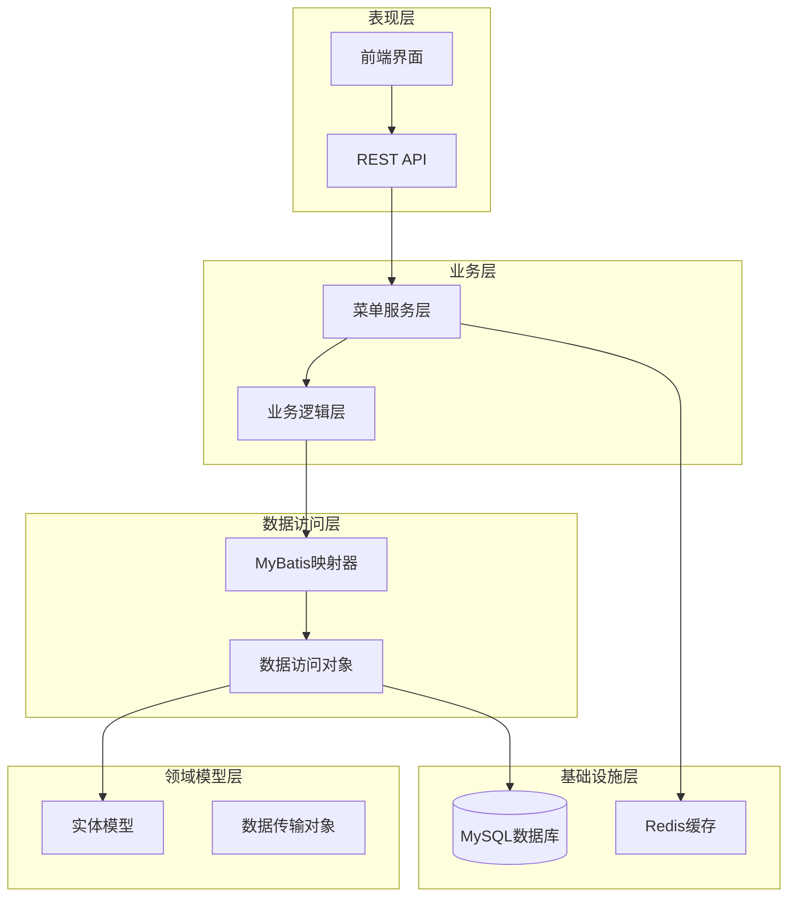
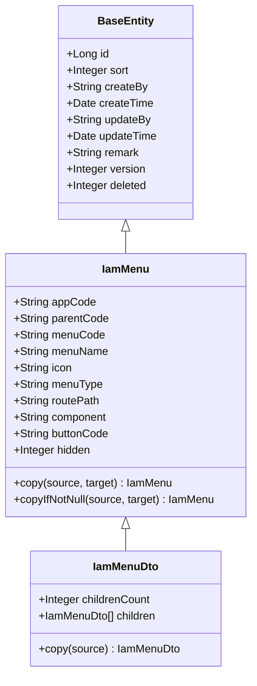
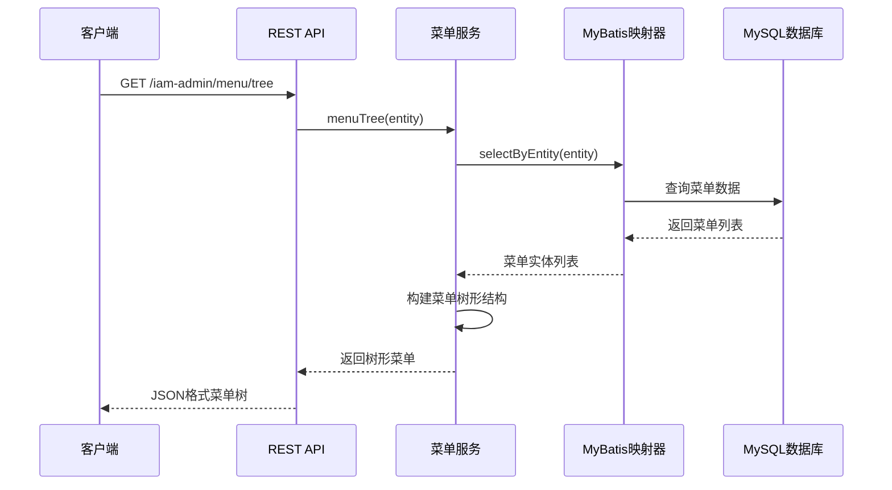
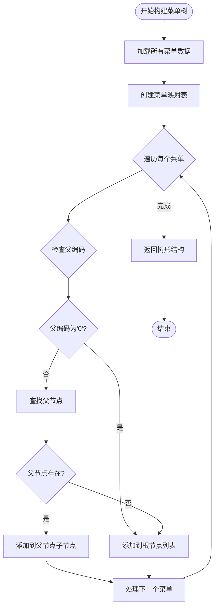
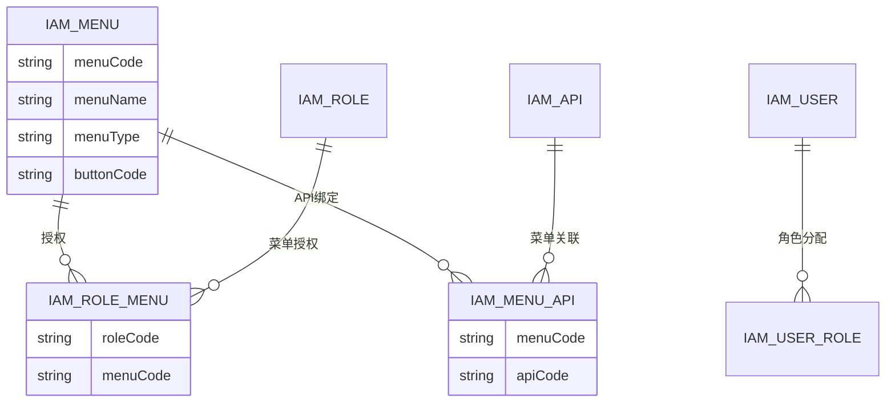
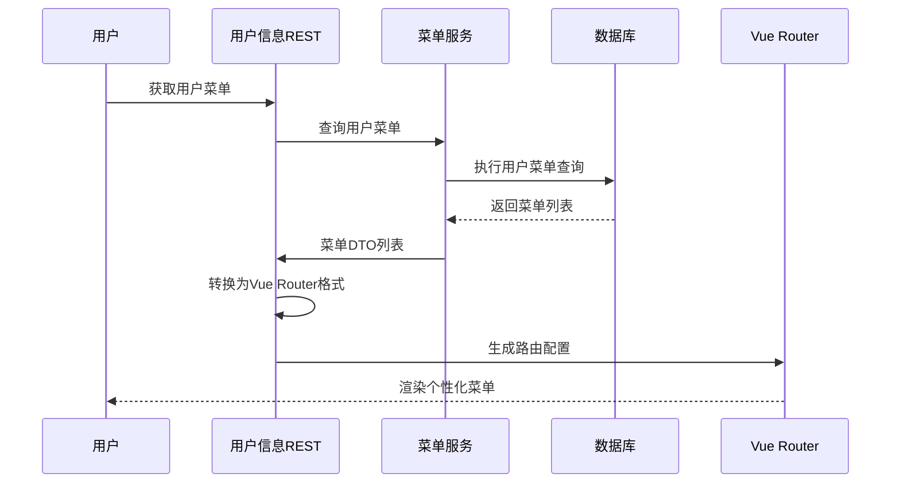
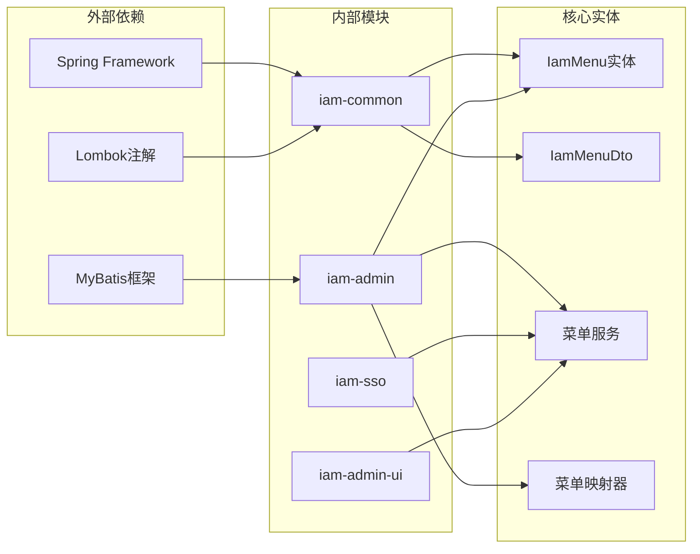

# 菜单实体模型

<cite>
**本文档引用的文件**
- [IamMenu.java](file://iam-common/src/main/java/com/wkclz/iam/common/entity/IamMenu.java)
- [IamMenuDto.java](file://iam-common/src/main/java/com/wkclz/iam/common/dto/IamMenuDto.java)
- [IamMenuMapper.java](file://iam-admin/src/main/java/com/wkclz/iam/admin/mapper/IamMenuMapper.java)
- [IamMenuMapper.xml](file://iam-admin/src/main/resources/mapper/IamMenuMapper.xml)
- [IamMenuService.java](file://iam-admin/src/main/java/com/wkclz/iam/admin/service/IamMenuService.java)
- [MenuRest.java](file://iam-admin/src/main/java/com/wkclz/iam/admin/rest/MenuRest.java)
- [database-design.md](file://docs/architecture/database-design.md)
- [UserInfoRest.java](file://iam-sso/src/main/java/com/wkclz/iam/sso/rest/UserInfoRest.java)
- [VueRouterMenu.java](file://iam-sso/src/main/java/com/wkclz/iam/sso/entity/VueRouterMenu.java)
- [Route.java](file://iam-admin/src/main/java/com/wkclz/iam/admin/Route.java)
- [menu.js](file://iam-admin-ui/src/api/system/menu.js)
- [index.vue](file://iam-admin-ui/src/views/system/menu/index.vue)
</cite>

## 目录
1. [简介](#简介)
2. [项目结构](#项目结构)
3. [核心组件](#核心组件)
4. [架构概览](#架构概览)
5. [详细组件分析](#详细组件分析)
6. [依赖关系分析](#依赖关系分析)
7. [性能考虑](#性能考虑)
8. [故障排除指南](#故障排除指南)
9. [结论](#结论)

## 简介

本文件详细阐述了IAM系统中的菜单实体模型设计与实现。IamMenu实体作为系统权限控制的核心数据结构，承担着菜单树形结构管理、权限标识控制以及与前端路由生成的重要职责。该模型支持菜单与按钮两种类型，通过父子关系构建树形结构，结合排序字段实现层次化的导航展示。

## 项目结构

IAM系统的菜单功能采用分层架构设计，主要涉及以下层次：

**图表来源**
- [IamMenu.java:19-132](file://iam-common/src/main/java/com/wkclz/iam/common/entity/IamMenu.java#L19-L132)
- [IamMenuService.java:27-127](file://iam-admin/src/main/java/com/wkclz/iam/admin/service/IamMenuService.java#L27-L127)

**章节来源**
- [IamMenu.java:1-132](file://iam-common/src/main/java/com/wkclz/iam/common/entity/IamMenu.java#L1-L132)
- [IamMenuDto.java:1-40](file://iam-common/src/main/java/com/wkclz/iam/common/dto/IamMenuDto.java#L1-L40)

## 核心组件

### IamMenu实体模型

IamMenu是菜单系统的核心实体，继承自BaseEntity，具备完整的生命周期管理和版本控制能力。

**图表来源**
- [IamMenu.java:19-132](file://iam-common/src/main/java/com/wkclz/iam/common/entity/IamMenu.java#L19-L132)
- [IamMenuDto.java:17-39](file://iam-common/src/main/java/com/wkclz/iam/common/dto/IamMenuDto.java#L17-L39)

### 核心字段定义

| 字段名称 | 数据类型 | 约束条件 | 描述 | 用途 |
|---------|---------|---------|------|-----|
| appCode | VARCHAR(64) | NOT NULL | 应用编码 | 标识菜单所属的应用域 |
| parentCode | VARCHAR(64) | | 父菜单编码 | 构建菜单树形结构的父子关系 |
| menuCode | VARCHAR(64) | UNIQUE NOT NULL | 菜单编码 | 唯一标识菜单实体 |
| menuName | VARCHAR(64) | NOT NULL | 菜单名称 | 菜单显示名称 |
| icon | VARCHAR(64) | | 图标 | 菜单图标标识 |
| menuType | VARCHAR(16) | NOT NULL | 菜单类型 | MENU(菜单)/BUTTON(按钮) |
| routePath | VARCHAR(256) | | 路由路径 | 前端路由地址 |
| component | VARCHAR(256) | | 组件路径 | 前端组件映射 |
| buttonCode | VARCHAR(64) | | 按钮编码 | 按钮级权限标识 |
| hidden | INTEGER | | 隐藏标志 | 控制菜单显示状态 |

**章节来源**
- [IamMenu.java:21-79](file://iam-common/src/main/java/com/wkclz/iam/common/entity/IamMenu.java#L21-L79)
- [database-design.md:108-121](file://docs/architecture/database-design.md#L108-L121)

## 架构概览

IAM菜单系统的整体架构采用分层设计，实现了从数据存储到前端展示的完整链路：

**图表来源**
- [MenuRest.java:31-36](file://iam-admin/src/main/java/com/wkclz/iam/admin/rest/MenuRest.java#L31-L36)
- [IamMenuService.java:36-41](file://iam-admin/src/main/java/com/wkclz/iam/admin/service/IamMenuService.java#L36-L41)
- [IamMenuMapper.xml:26-37](file://iam-admin/src/main/resources/mapper/IamMenuMapper.xml#L26-L37)

## 详细组件分析

### 菜单树形结构实现

菜单树形结构是IamMenu的核心特性，通过parentCode字段建立父子关系，支持多级嵌套结构。

**图表来源**
- [IamMenuService.java:102-123](file://iam-admin/src/main/java/com/wkclz/iam/admin/service/IamMenuService.java#L102-L123)

#### 树形结构构建算法

构建菜单树的关键步骤包括：

1. **数据加载**: 通过IamMenuMapper查询所有菜单记录
2. **映射创建**: 将菜单列表转换为以menuCode为键的映射表
3. **父子关系解析**: 遍历每个菜单，根据parentCode确定其父节点
4. **树形组装**: 顶级菜单(父编码为"0")直接加入根节点，其他菜单加入对应父节点的children列表

**章节来源**
- [IamMenuService.java:102-123](file://iam-admin/src/main/java/com/wkclz/iam/admin/service/IamMenuService.java#L102-L123)
- [IamMenuMapper.xml:26-37](file://iam-admin/src/main/resources/mapper/IamMenuMapper.xml#L26-L37)

### 权限系统集成

菜单实体与权限系统的集成体现在多个层面：

**图表来源**
- [database-design.md:21-29](file://docs/architecture/database-design.md#L21-L29)

#### 菜单按钮权限控制

按钮级权限通过buttonCode字段实现细粒度控制：

| 权限类型 | 字段 | 说明 | 使用场景 |
|---------|------|------|---------|
| 菜单权限 | menuType=MENU | 页面级权限 | 导航菜单显示控制 |
| 按钮权限 | menuType=BUTTON | 操作级权限 | 具体按钮操作控制 |
| 路由权限 | routePath | 路由访问权限 | 前端路由访问控制 |

**章节来源**
- [database-design.md:181-186](file://docs/architecture/database-design.md#L181-L186)
- [IamMenu.java:52-73](file://iam-common/src/main/java/com/wkclz/iam/common/entity/IamMenu.java#L52-L73)

### 动态加载与前端路由生成

菜单系统支持动态加载和前端路由生成，实现运行时的菜单配置：

**图表来源**
- [UserInfoRest.java:72-94](file://iam-sso/src/main/java/com/wkclz/iam/sso/rest/UserInfoRest.java#L72-L94)

#### 路由生成规则

前端路由生成遵循以下规则：

1. **路径拼接**: 一级路由必须以"/"开头，子路由基于父路由路径拼接
2. **组件映射**: component字段映射到Vue组件路径
3. **显示控制**: hidden字段控制菜单在导航栏中的显示状态
4. **按钮收集**: 自动收集BUTTON类型的菜单作为按钮权限标识

**章节来源**
- [UserInfoRest.java:72-139](file://iam-sso/src/main/java/com/wkclz/iam/sso/rest/UserInfoRest.java#L72-L139)
- [VueRouterMenu.java](file://iam-sso/src/main/java/com/wkclz/iam/sso/entity/VueRouterMenu.java)

### REST API接口设计

菜单管理提供完整的CRUD接口，支持树形结构查询和列表查询：

| 接口方法 | 路径 | 功能描述 | 参数要求 |
|---------|------|----------|----------|
| GET | /iam-admin/menu/list | 查询菜单列表 | appCode(必填) |
| GET | /iam-admin/menu/tree | 查询菜单树 | appCode(必填) |
| GET | /iam-admin/menu/info | 获取菜单详情 | id(必填) |
| POST | /iam-admin/menu/create | 创建菜单 | 菜单实体 |
| POST | /iam-admin/menu/update | 更新菜单 | 菜单实体 + version |
| POST | /iam-admin/menu/remove | 删除菜单 | id(必填) |

**章节来源**
- [MenuRest.java:24-78](file://iam-admin/src/main/java/com/wkclz/iam/admin/rest/MenuRest.java#L24-L78)
- [Route.java:105-106](file://iam-admin/src/main/java/com/wkclz/iam/admin/Route.java#L105-L106)

## 依赖关系分析

菜单实体模型的依赖关系体现了清晰的分层架构：

**图表来源**
- [IamMenu.java:1-132](file://iam-common/src/main/java/com/wkclz/iam/common/entity/IamMenu.java#L1-L132)
- [IamMenuService.java:1-127](file://iam-admin/src/main/java/com/wkclz/iam/admin/service/IamMenuService.java#L1-L127)

### 数据一致性保证

系统通过多种机制确保数据一致性：

1. **唯一性约束**: menuCode字段的唯一性确保菜单标识的唯一性
2. **版本控制**: 乐观锁机制防止并发更新冲突
3. **逻辑删除**: deleted字段实现软删除，保护历史数据
4. **参数校验**: 严格的参数验证确保数据完整性

**章节来源**
- [IamMenuService.java:81-100](file://iam-admin/src/main/java/com/wkclz/iam/admin/service/IamMenuService.java#L81-L100)
- [database-design.md:48-61](file://docs/architecture/database-design.md#L48-L61)

## 性能考虑

### 查询优化策略

1. **索引设计**: 菜单表建立了appCode、parentCode、menuType等关键字段索引
2. **批量查询**: 使用LEFT JOIN一次性获取子菜单数量，避免N+1查询问题
3. **排序优化**: 通过sort字段实现稳定的排序结果

### 缓存策略

1. **Redis集成**: 使用RedisIdGenerator生成菜单编码，提高性能
2. **前端缓存**: 前端界面缓存菜单数据，减少重复请求
3. **数据库连接池**: 合理配置连接池参数，优化数据库访问性能

## 故障排除指南

### 常见问题及解决方案

| 问题类型 | 症状 | 可能原因 | 解决方案 |
|---------|------|---------|---------|
| 菜单树构建失败 | 子菜单无法显示 | 父子编码不匹配 | 检查parentCode与menuCode对应关系 |
| 菜单权限失效 | 按钮无权限 | buttonCode未正确配置 | 确认BUTTON类型菜单的buttonCode设置 |
| 路由生成错误 | 页面无法访问 | routePath格式不正确 | 确保一级路由以"/"开头，子路由相对路径 |
| 并发更新冲突 | 版本号异常 | 多用户同时编辑 | 实施乐观锁机制，提示用户重新加载 |

### 调试建议

1. **日志监控**: 启用详细的SQL日志，跟踪菜单查询过程
2. **数据验证**: 在创建菜单时验证所有必填字段
3. **权限测试**: 使用不同角色用户测试菜单权限效果
4. **前端调试**: 检查Vue Router的路由配置生成情况

**章节来源**
- [MenuRest.java:66-78](file://iam-admin/src/main/java/com/wkclz/iam/admin/rest/MenuRest.java#L66-L78)
- [IamMenuService.java:65-79](file://iam-admin/src/main/java/com/wkclz/iam/admin/service/IamMenuService.java#L65-L79)

## 结论

IamMenu实体模型通过精心设计的数据结构和完善的权限控制机制，为IAM系统提供了强大的菜单管理能力。该模型不仅支持灵活的树形结构展示，还实现了与前端路由的无缝集成，为用户提供了个性化的菜单体验。

系统的关键优势包括：

1. **清晰的层次结构**: 通过parentCode字段实现直观的菜单层级管理
2. **完善的权限控制**: 支持菜单级和按钮级双重权限控制
3. **动态路由生成**: 实现运行时的菜单配置和路由生成
4. **良好的扩展性**: 模块化设计便于功能扩展和维护

未来可以考虑的改进方向包括：增加菜单模板功能、支持多语言国际化、增强菜单搜索和过滤能力等。