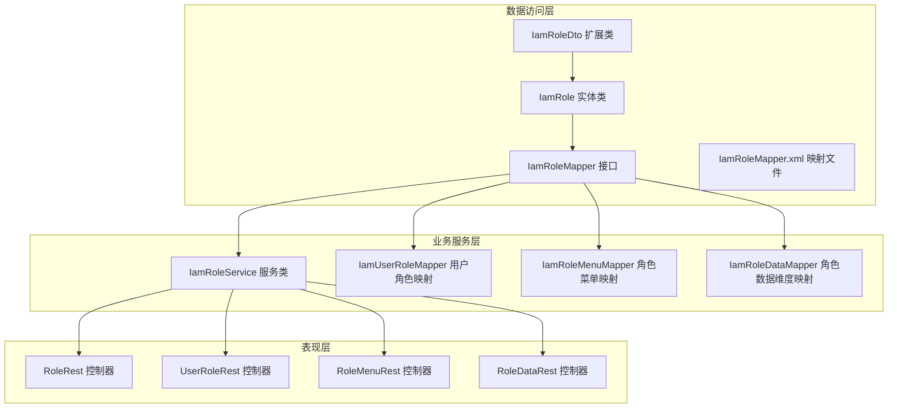
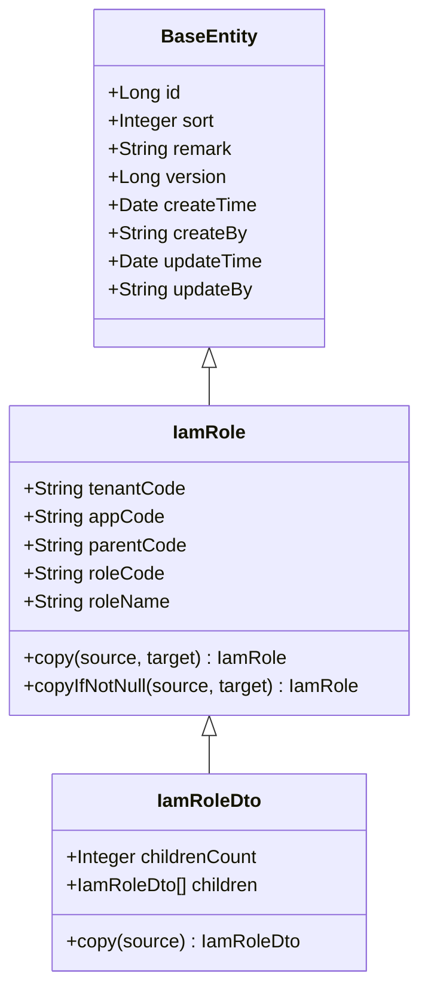
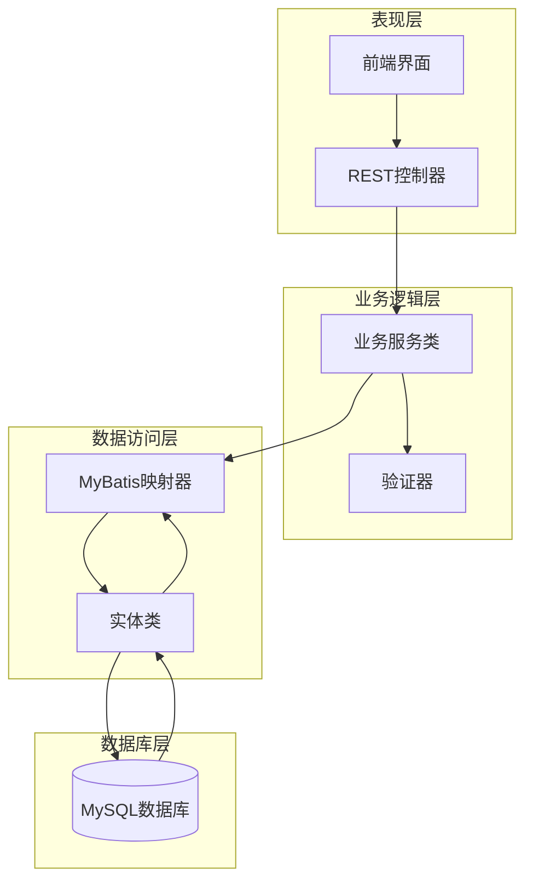
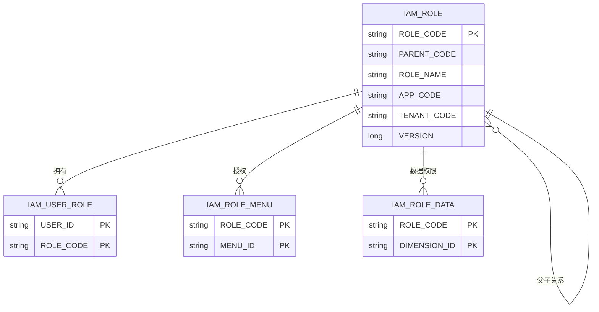
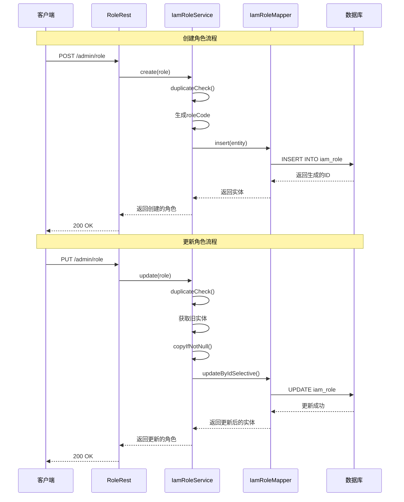
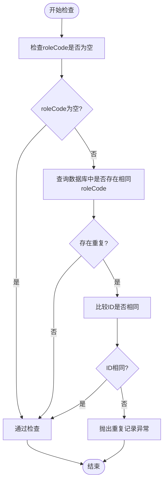
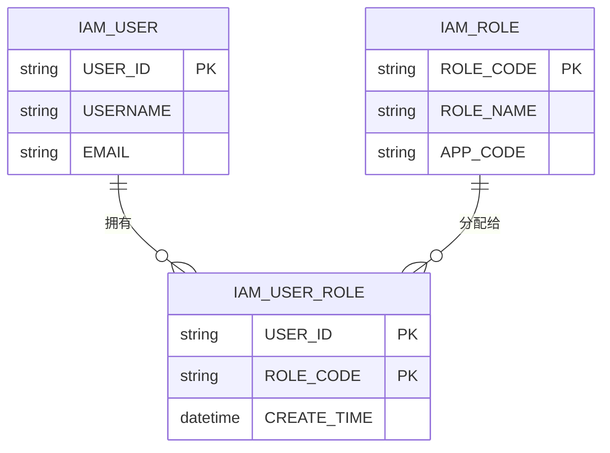
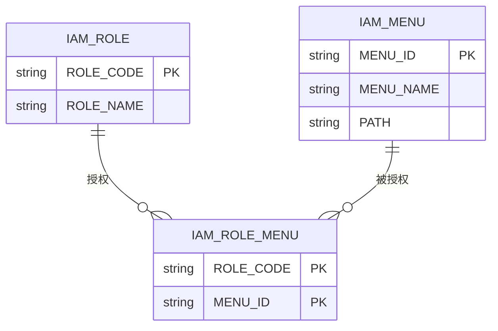
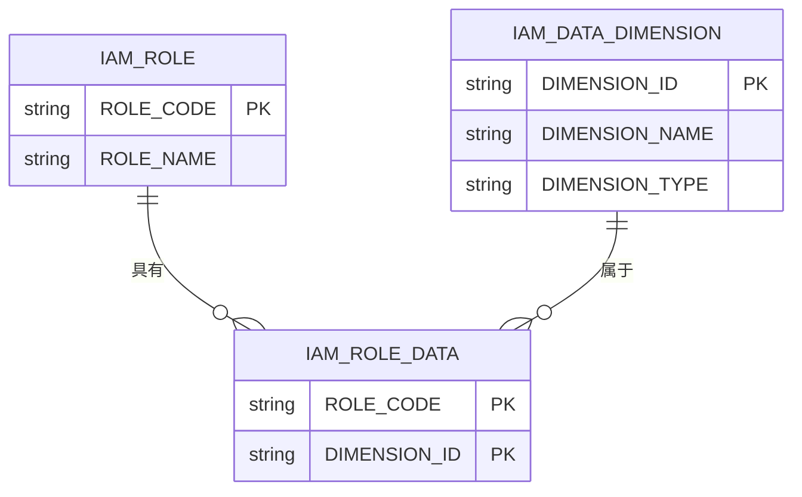
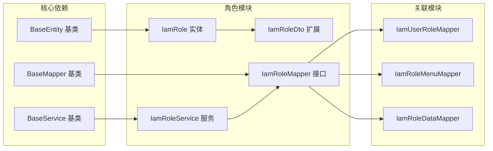

# 角色实体模型

<cite>
**本文档引用的文件**
- [IamRole.java](file://iam-common/src/main/java/com/wkclz/iam/common/entity/IamRole.java)
- [IamRoleDto.java](file://iam-common/src/main/java/com/wkclz/iam/common/dto/IamRoleDto.java)
- [IamRoleMapper.java](file://iam-admin/src/main/java/com/wkclz/iam/admin/mapper/IamRoleMapper.java)
- [IamRoleService.java](file://iam-admin/src/main/java/com/wkclz/iam/admin/service/IamRoleService.java)
- [IamRoleMapper.xml](file://iam-admin/src/main/resources/mapper/IamRoleMapper.xml)
- [IamUserRoleMapper.java](file://iam-admin/src/main/java/com/wkclz/iam/admin/mapper/IamUserRoleMapper.java)
- [IamRoleMenuMapper.java](file://iam-admin/src/main/java/com/wkclz/iam/admin/mapper/IamRoleMenuMapper.java)
- [IamRoleDataMapper.java](file://iam-admin/src/main/java/com/wkclz/iam/admin/mapper/IamRoleDataMapper.java)
- [RoleRest.java](file://iam-admin/src/main/java/com/wkclz/iam/admin/rest/RoleRest.java)
- [UserRoleRest.java](file://iam-admin/src/main/java/com/wkclz/iam/admin/rest/UserRoleRest.java)
- [RoleMenuRest.java](file://iam-admin/src/main/java/com/wkclz/iam/admin/rest/RoleMenuRest.java)
- [RoleDataRest.java](file://iam-admin/src/main/java/com/wkclz/iam/admin/rest/RoleDataRest.java)
- [STORY-027-role-crud.md](file://docs/stories/STORY-027-role-crud.md)
- [STORY-035-user-role-binding.md](file://docs/stories/STORY-035-user-role-binding.md)
- [STORY-034-role-menu-binding.md](file://docs/stories/STORY-034-role-menu-binding.md)
</cite>

## 目录
1. [简介](#简介)
2. [项目结构](#项目结构)
3. [核心组件](#核心组件)
4. [架构概览](#架构概览)
5. [详细组件分析](#详细组件分析)
6. [依赖关系分析](#依赖关系分析)
7. [性能考虑](#性能考虑)
8. [故障排除指南](#故障排除指南)
9. [结论](#结论)

## 简介

IAM系统中的角色实体模型是身份认证和授权管理的核心数据结构。本文档深入分析IamRole实体的设计，包括角色标识、角色名称、角色编码、角色描述等核心字段的定义和业务含义，详细记录角色实体的层级结构支持、角色继承关系和权限范围定义，说明角色实体与用户实体、菜单实体的关联关系，以及角色权限绑定机制。

## 项目结构

IAM系统采用分层架构设计，角色实体模型分布在以下模块中：

**图表来源**
- [IamRole.java:1-92](file://iam-common/src/main/java/com/wkclz/iam/common/entity/IamRole.java#L1-L92)
- [IamRoleMapper.java:1-24](file://iam-admin/src/main/java/com/wkclz/iam/admin/mapper/IamRoleMapper.java#L1-L24)
- [IamRoleService.java:1-90](file://iam-admin/src/main/java/com/wkclz/iam/admin/service/IamRoleService.java#L1-L90)

**章节来源**
- [IamRole.java:1-92](file://iam-common/src/main/java/com/wkclz/iam/common/entity/IamRole.java#L1-L92)
- [IamRoleDto.java:1-36](file://iam-common/src/main/java/com/wkclz/iam/common/dto/IamRoleDto.java#L1-L36)

## 核心组件

### IamRole 实体类

IamRole是角色实体的核心数据结构，继承自BaseEntity基类，提供了完整的CRUD操作支持。

**核心字段定义：**

| 字段名 | 类型 | 描述 | 业务含义 |
|--------|------|------|----------|
| tenantCode | String | 租户编码 | 多租户环境下角色所属的租户标识 |
| appCode | String | 应用编码 | 角色所属的应用程序标识 |
| parentCode | String | 父角色编码 | 支持角色层级结构的父级角色标识 |
| roleCode | String | 角色编码 | 角色的唯一标识符，用于业务逻辑识别 |
| roleName | String | 角色名称 | 角色的人类可读名称 |

**继承关系：**

**图表来源**
- [IamRole.java:19-90](file://iam-common/src/main/java/com/wkclz/iam/common/entity/IamRole.java#L19-L90)
- [IamRoleDto.java:17-34](file://iam-common/src/main/java/com/wkclz/iam/common/dto/IamRoleDto.java#L17-L34)

**章节来源**
- [IamRole.java:21-50](file://iam-common/src/main/java/com/wkclz/iam/common/entity/IamRole.java#L21-L50)
- [IamRole.java:52-88](file://iam-common/src/main/java/com/wkclz/iam/common/entity/IamRole.java#L52-L88)

### IamRoleDto 扩展类

IamRoleDto在IamRole基础上增加了树形结构支持，用于前端展示角色层级关系。

**扩展字段：**
- childrenCount: 子角色数量
- children: 子角色列表

**章节来源**
- [IamRoleDto.java:19-34](file://iam-common/src/main/java/com/wkclz/iam/common/dto/IamRoleDto.java#L19-L34)

## 架构概览

IAM角色管理系统采用经典的三层架构模式，实现了清晰的职责分离：

**图表来源**
- [IamRoleService.java:24-88](file://iam-admin/src/main/java/com/wkclz/iam/admin/service/IamRoleService.java#L24-L88)
- [IamRoleMapper.java:18-22](file://iam-admin/src/main/java/com/wkclz/iam/admin/mapper/IamRoleMapper.java#L18-L22)

## 详细组件分析

### 角色实体设计

#### 层级结构支持

角色实体天然支持层级结构，通过parentCode字段实现父子关系：

**图表来源**
- [IamRole.java:33-37](file://iam-common/src/main/java/com/wkclz/iam/common/entity/IamRole.java#L33-L37)
- [IamUserRoleMapper.java](file://iam-admin/src/main/java/com/wkclz/iam/admin/mapper/IamUserRoleMapper.java)
- [IamRoleMenuMapper.java](file://iam-admin/src/main/java/com/wkclz/iam/admin/mapper/IamRoleMenuMapper.java)
- [IamRoleDataMapper.java](file://iam-admin/src/main/java/com/wkclz/iam/admin/mapper/IamRoleDataMapper.java)

#### 权限范围定义

角色权限通过多对多关系实现灵活的权限控制：

1. **功能权限**：通过IAM_ROLE_MENU表关联菜单权限
2. **数据权限**：通过IAM_ROLE_DATA表关联数据维度
3. **用户权限**：通过IAM_USER_ROLE表关联用户

**章节来源**
- [IamRole.java:21-50](file://iam-common/src/main/java/com/wkclz/iam/common/entity/IamRole.java#L21-L50)

### 角色服务层实现

#### CRUD操作流程

**图表来源**
- [IamRoleService.java:36-56](file://iam-admin/src/main/java/com/wkclz/iam/admin/service/IamRoleService.java#L36-L56)
- [IamRoleMapper.xml](file://iam-admin/src/main/resources/mapper/IamRoleMapper.xml)

#### 唯一性约束检查

服务层实现了完善的唯一性约束检查机制：

**图表来源**
- [IamRoleService.java:67-86](file://iam-admin/src/main/java/com/wkclz/iam/admin/service/IamRoleService.java#L67-L86)

**章节来源**
- [IamRoleService.java:36-86](file://iam-admin/src/main/java/com/wkclz/iam/admin/service/IamRoleService.java#L36-L86)

### 关联关系分析

#### 角色与用户关联

角色与用户通过中间表IamUserRole建立多对多关系：

**图表来源**
- [IamUserRoleMapper.java](file://iam-admin/src/main/java/com/wkclz/iam/admin/mapper/IamUserRoleMapper.java)

#### 角色与菜单关联

角色通过IamRoleMenu表获得菜单访问权限：

**图表来源**
- [IamRoleMenuMapper.java](file://iam-admin/src/main/java/com/wkclz/iam/admin/mapper/IamRoleMenuMapper.java)

#### 角色与数据维度关联

角色通过IamRoleData表获得数据访问权限：

**图表来源**
- [IamRoleDataMapper.java](file://iam-admin/src/main/java/com/wkclz/iam/admin/mapper/IamRoleDataMapper.java)

**章节来源**
- [IamUserRoleMapper.java](file://iam-admin/src/main/java/com/wkclz/iam/admin/mapper/IamUserRoleMapper.java)
- [IamRoleMenuMapper.java](file://iam-admin/src/main/java/com/wkclz/iam/admin/mapper/IamRoleMenuMapper.java)
- [IamRoleDataMapper.java](file://iam-admin/src/main/java/com/wkclz/iam/admin/mapper/IamRoleDataMapper.java)

## 依赖关系分析

### 组件耦合度分析

**图表来源**
- [IamRole.java:19-20](file://iam-common/src/main/java/com/wkclz/iam/common/entity/IamRole.java#L19-L20)
- [IamRoleMapper.java:18-18](file://iam-admin/src/main/java/com/wkclz/iam/admin/mapper/IamRoleMapper.java#L18-L18)
- [IamRoleService.java:24-24](file://iam-admin/src/main/java/com/wkclz/iam/admin/service/IamRoleService.java#L24-L24)

### 外部依赖

系统依赖的关键外部组件：

| 组件 | 版本 | 用途 | 重要性 |
|------|------|------|--------|
| MyBatis | 最新版本 | ORM框架 | 核心依赖 |
| Spring Boot | 最新版本 | 应用框架 | 核心依赖 |
| Lombok | 最新版本 | 代码简化 | 开发工具 |
| Redis | 最新版本 | ID生成 | 辅助功能 |

**章节来源**
- [IamRoleService.java:10-13](file://iam-admin/src/main/java/com/wkclz/iam/admin/service/IamRoleService.java#L10-L13)

## 性能考虑

### 查询优化策略

1. **索引设计**
   - roleCode + appCode 组合索引（唯一性约束）
   - parentCode 索引（层级查询）
   - appCode 索引（应用级查询）

2. **缓存策略**
   - 角色树形结构缓存
   - 用户角色映射缓存
   - 菜单权限缓存

3. **批量操作**
   - 支持批量角色查询
   - 批量权限分配

### 并发控制

系统采用乐观锁机制处理并发更新：

- 使用version字段实现乐观锁
- 冲突时自动重试机制
- 事务边界明确控制

## 故障排除指南

### 常见问题及解决方案

#### 角色创建失败

**问题症状：** 创建角色时报重复记录错误

**可能原因：**
1. 角色编码已存在
2. 应用范围内重复
3. 数据库约束冲突

**解决步骤：**
1. 检查roleCode唯一性
2. 验证appCode正确性
3. 清理重复数据

#### 角色更新异常

**问题症状：** 更新角色时报记录不存在

**解决方法：**
1. 确认角色ID有效性
2. 检查数据一致性
3. 重新加载角色信息

#### 权限分配失败

**问题症状：** 角色权限无法正确分配

**排查步骤：**
1. 验证菜单是否存在
2. 检查数据维度配置
3. 确认角色状态正常

**章节来源**
- [IamRoleService.java:46-65](file://iam-admin/src/main/java/com/wkclz/iam/admin/service/IamRoleService.java#L46-L65)
- [IamRoleService.java:81-85](file://iam-admin/src/main/java/com/wkclz/iam/admin/service/IamRoleService.java#L81-L85)

## 结论

IAM角色实体模型设计合理，具备以下特点：

1. **完整性**：支持多租户、多应用、层级结构的完整角色管理体系
2. **灵活性**：通过多种权限绑定机制支持复杂权限场景
3. **可扩展性**：基于接口的架构便于功能扩展
4. **安全性**：完善的唯一性检查和权限控制机制

该模型为IAM系统的身份认证和授权管理提供了坚实的数据基础，能够满足企业级应用的权限管理需求。