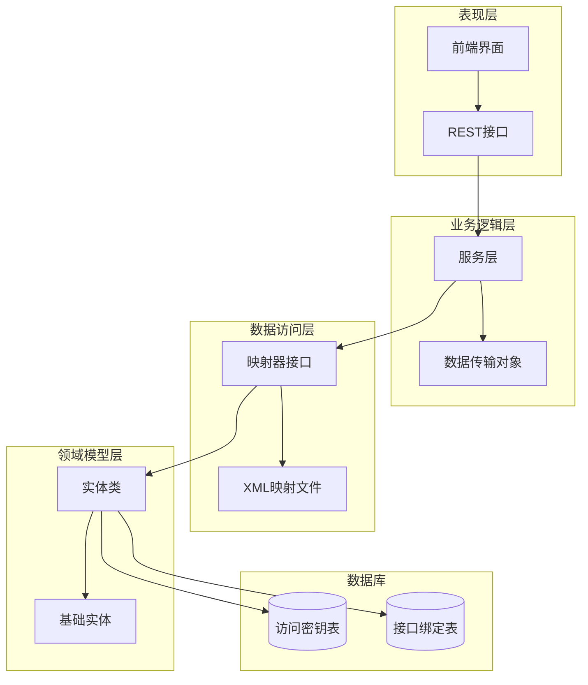
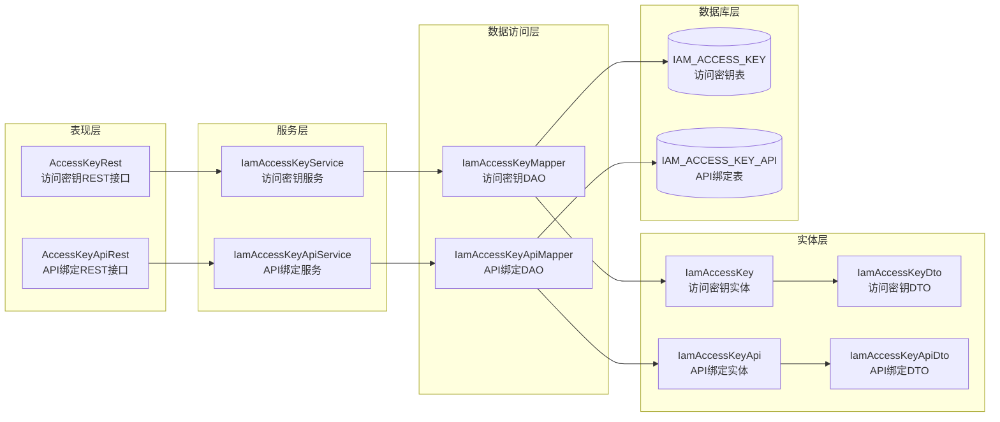
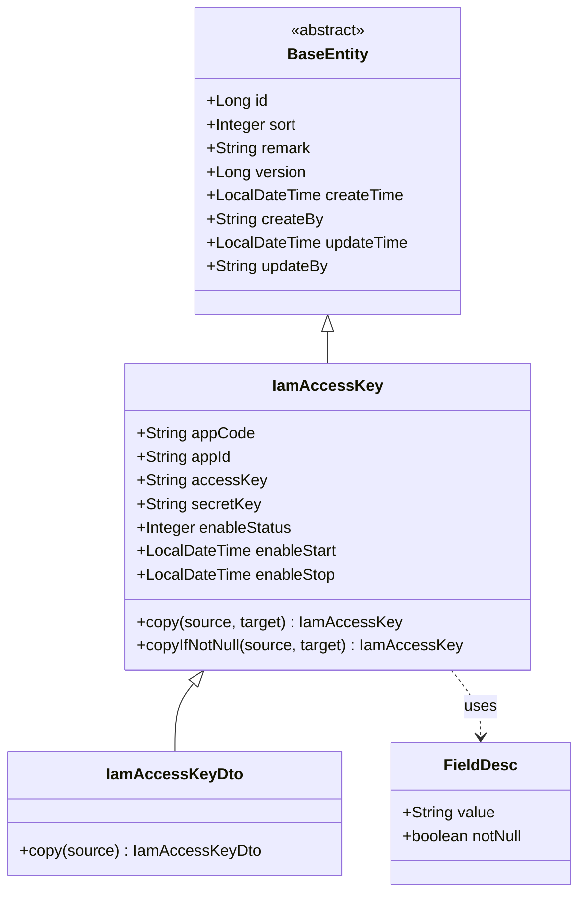
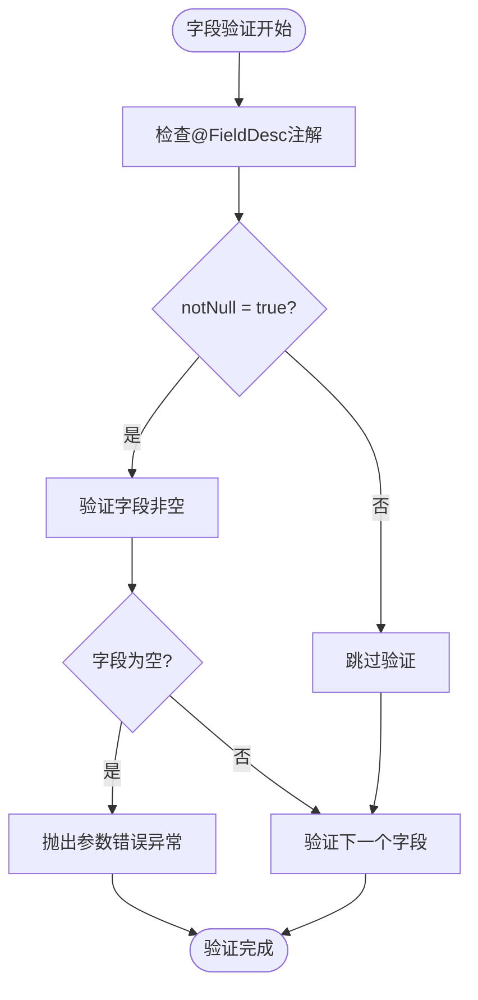
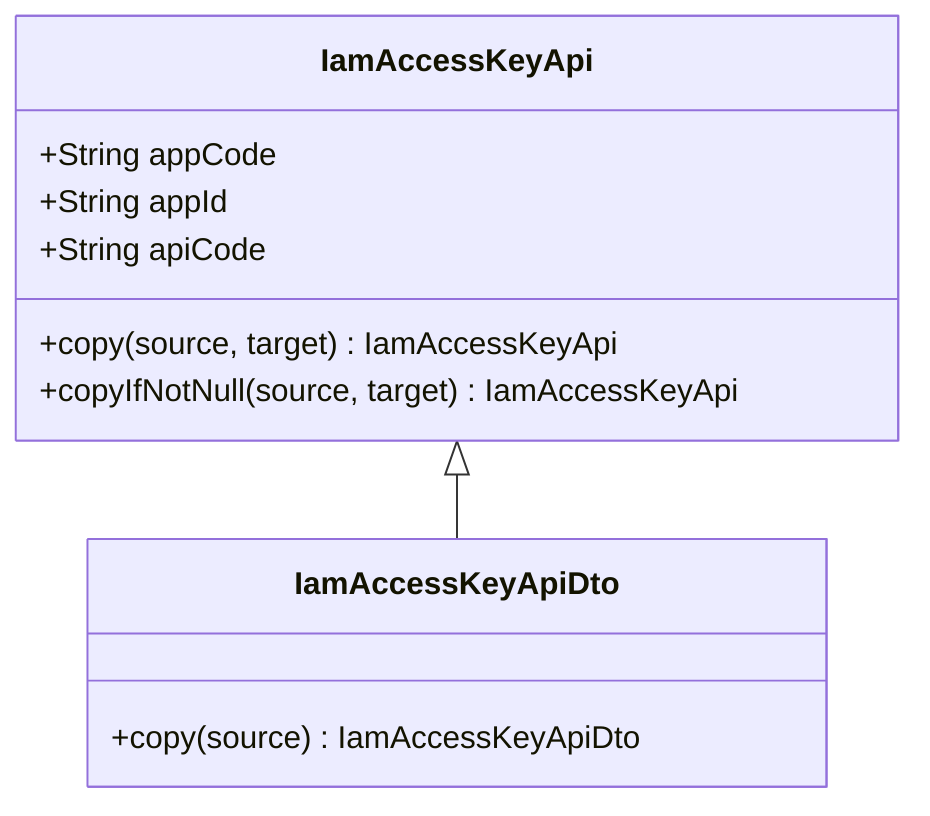
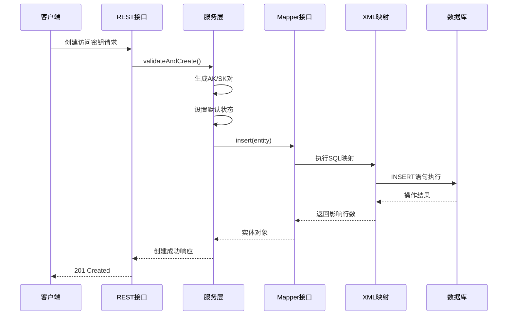
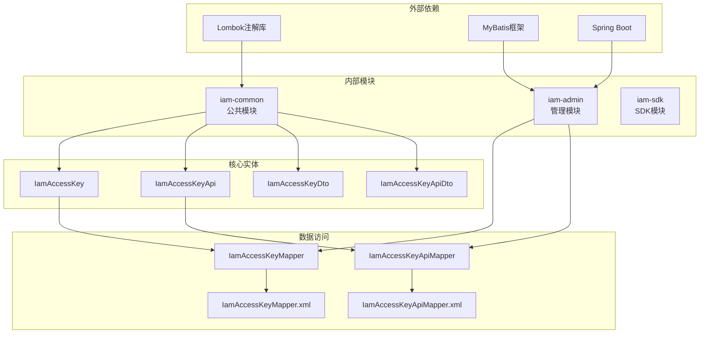

# 访问密钥实体模型

<cite>
**本文档引用的文件**
- [IamAccessKey.java](file://iam-common/src/main/java/com/wkclz/iam/common/entity/IamAccessKey.java)
- [IamAccessKeyDto.java](file://iam-common/src/main/java/com/wkclz/iam/common/dto/IamAccessKeyDto.java)
- [IamAccessKeyApi.java](file://iam-common/src/main/java/com/wkclz/iam/common/entity/IamAccessKeyApi.java)
- [IamAccessKeyApiDto.java](file://iam-common/src/main/java/com/wkclz/iam/common/dto/IamAccessKeyApiDto.java)
- [IamAccessKeyMapper.java](file://iam-admin/src/main/java/com/wkclz/iam/admin/mapper/IamAccessKeyMapper.java)
- [IamAccessKeyApiMapper.java](file://iam-admin/src/main/java/com/wkclz/iam/admin/mapper/IamAccessKeyApiMapper.java)
- [IamAccessKeyService.java](file://iam-admin/src/main/java/com/wkclz/iam/admin/service/IamAccessKeyService.java)
- [IamAccessKeyApiService.java](file://iam-admin/src/main/java/com/wkclz/iam/admin/service/IamAccessKeyApiService.java)
- [AccessKeyRest.java](file://iam-admin/src/main/java/com/wkclz/iam/admin/rest/AccessKeyRest.java)
- [AccessKeyApiRest.java](file://iam-admin/src/main/java/com/wkclz/iam/admin/rest/AccessKeyApiRest.java)
- [IamAccessKeyMapper.xml](file://iam-admin/src/main/resources/mapper/IamAccessKeyMapper.xml)
- [IamAccessKeyApiMapper.xml](file://iam-admin/src/main/resources/mapper/IamAccessKeyApiMapper.xml)
</cite>

## 目录
1. [引言](#引言)
2. [项目结构](#项目结构)
3. [核心组件](#核心组件)
4. [架构概览](#架构概览)
5. [详细组件分析](#详细组件分析)
6. [依赖关系分析](#依赖关系分析)
7. [性能考虑](#性能考虑)
8. [故障排除指南](#故障排除指南)
9. [结论](#结论)

## 引言

本文件详细阐述了IAM系统中访问密钥实体模型的设计与实现。访问密钥作为系统安全体系的重要组成部分，通过AK（Access Key）和SK（Secret Key）的组合为外部应用提供安全的身份认证和授权机制。本文档深入分析了IamAccessKey实体的设计理念、字段含义、生成机制、状态管理以及与用户实体的关联关系，并详细说明了密钥的安全策略、生命周期管理、安全审计和异常处理机制。

## 项目结构

IAM系统采用分层架构设计，访问密钥功能主要分布在以下层次：

**图表来源**
- [IamAccessKey.java:1-108](file://iam-common/src/main/java/com/wkclz/iam/common/entity/IamAccessKey.java#L1-L108)
- [IamAccessKeyMapper.java:1-21](file://iam-admin/src/main/java/com/wkclz/iam/admin/mapper/IamAccessKeyMapper.java#L1-L21)
- [AccessKeyRest.java](file://iam-admin/src/main/java/com/wkclz/iam/admin/rest/AccessKeyRest.java)

**章节来源**
- [IamAccessKey.java:1-108](file://iam-common/src/main/java/com/wkclz/iam/common/entity/IamAccessKey.java#L1-L108)
- [IamAccessKeyApi.java:1-76](file://iam-common/src/main/java/com/wkclz/iam/common/entity/IamAccessKeyApi.java#L1-L76)

## 核心组件

### 访问密钥实体设计

IamAccessKey实体是访问密钥功能的核心数据模型，采用继承自BaseEntity的基础设计模式，确保了统一的元数据管理和版本控制机制。

#### 核心字段分析

| 字段名称 | 类型 | 必填 | 描述 | 约束条件 |
|---------|------|------|------|----------|
| appCode | String | 是 | 所属应用编码 | 非空，唯一标识应用 |
| appId | String | 是 | 应用ID | 非空，关联应用表 |
| accessKey | String | 是 | 访问密钥AK | 唯一，长度固定 |
| secretKey | String | 是 | 安全密钥SK | 加密存储，不可逆 |
| enableStatus | Integer | 是 | 生效状态 | 0=禁用，1=启用，2=过期 |
| enableStart | LocalDateTime | 是 | 生效开始时间 | 时间戳格式 |
| enableStop | LocalDateTime | 是 | 生效结束时间 | 必须晚于开始时间 |

#### 状态管理机制

访问密钥采用三态状态管理模型：
- **启用状态（1）**：密钥正常生效，可进行身份验证
- **禁用状态（0）**：密钥被管理员手动禁用
- **过期状态（2）**：超出有效期自动标记为过期

**章节来源**
- [IamAccessKey.java:21-62](file://iam-common/src/main/java/com/wkclz/iam/common/entity/IamAccessKey.java#L21-L62)

### API绑定实体设计

IamAccessKeyApi实体负责管理访问密钥与具体API接口的绑定关系，实现了细粒度的权限控制。

#### 绑定关系字段

| 字段名称 | 类型 | 必填 | 描述 | 关联关系 |
|---------|------|------|------|----------|
| appCode | String | 是 | 应用编码 | 与访问密钥保持一致 |
| appId | String | 是 | 应用ID | 与访问密钥保持一致 |
| apiCode | String | 是 | API接口编码 | 关联API定义表 |

**章节来源**
- [IamAccessKeyApi.java:21-38](file://iam-common/src/main/java/com/wkclz/iam/common/entity/IamAccessKeyApi.java#L21-L38)

## 架构概览

访问密钥系统采用典型的三层架构设计，通过清晰的职责分离确保系统的可维护性和安全性。

**图表来源**
- [AccessKeyRest.java](file://iam-admin/src/main/java/com/wkclz/iam/admin/rest/AccessKeyRest.java)
- [AccessKeyApiRest.java](file://iam-admin/src/main/java/com/wkclz/iam/admin/rest/AccessKeyApiRest.java)
- [IamAccessKeyService.java](file://iam-admin/src/main/java/com/wkclz/iam/admin/service/IamAccessKeyService.java)
- [IamAccessKeyApiService.java](file://iam-admin/src/main/java/com/wkclz/iam/admin/service/IamAccessKeyApiService.java)

## 详细组件分析

### 访问密钥实体类分析

IamAccessKey实体采用了现代化的Java实体设计模式，结合Lombok注解简化代码编写。

**图表来源**
- [IamAccessKey.java:17-108](file://iam-common/src/main/java/com/wkclz/iam/common/entity/IamAccessKey.java#L17-L108)
- [IamAccessKeyDto.java:13-32](file://iam-common/src/main/java/com/wkclz/iam/common/dto/IamAccessKeyDto.java#L13-L32)

#### 字段验证机制

实体类通过FieldDesc注解实现字段级别的验证控制：

**图表来源**
- [IamAccessKey.java:21-62](file://iam-common/src/main/java/com/wkclz/iam/common/entity/IamAccessKey.java#L21-L62)

**章节来源**
- [IamAccessKey.java:17-108](file://iam-common/src/main/java/com/wkclz/iam/common/entity/IamAccessKey.java#L17-L108)

### API绑定实体类分析

IamAccessKeyApi实体专门负责管理访问密钥与API接口的关联关系。

**图表来源**
- [IamAccessKeyApi.java:17-76](file://iam-common/src/main/java/com/wkclz/iam/common/entity/IamAccessKeyApi.java#L17-L76)
- [IamAccessKeyApiDto.java:13-32](file://iam-common/src/main/java/com/wkclz/iam/common/dto/IamAccessKeyApiDto.java#L13-L32)

**章节来源**
- [IamAccessKeyApi.java:17-76](file://iam-common/src/main/java/com/wkclz/iam/common/entity/IamAccessKeyApi.java#L17-L76)

### 数据访问层设计

数据访问层采用MyBatis框架，通过Mapper接口实现数据持久化操作。

**图表来源**
- [AccessKeyRest.java](file://iam-admin/src/main/java/com/wkclz/iam/admin/rest/AccessKeyRest.java)
- [IamAccessKeyService.java](file://iam-admin/src/main/java/com/wkclz/iam/admin/service/IamAccessKeyService.java)
- [IamAccessKeyMapper.java:15-20](file://iam-admin/src/main/java/com/wkclz/iam/admin/mapper/IamAccessKeyMapper.java#L15-L20)

**章节来源**
- [IamAccessKeyMapper.java:15-20](file://iam-admin/src/main/java/com/wkclz/iam/admin/mapper/IamAccessKeyMapper.java#L15-L20)
- [IamAccessKeyApiMapper.java:17-22](file://iam-admin/src/main/java/com/wkclz/iam/admin/mapper/IamAccessKeyApiMapper.java#L17-L22)

## 依赖关系分析

访问密钥系统的依赖关系体现了清晰的分层架构和职责分离原则。

**图表来源**
- [IamAccessKey.java:1-108](file://iam-common/src/main/java/com/wkclz/iam/common/entity/IamAccessKey.java#L1-L108)
- [IamAccessKeyMapper.java:1-21](file://iam-admin/src/main/java/com/wkclz/iam/admin/mapper/IamAccessKeyMapper.java#L1-L21)

**章节来源**
- [IamAccessKey.java:1-108](file://iam-common/src/main/java/com/wkclz/iam/common/entity/IamAccessKey.java#L1-L108)
- [IamAccessKeyApi.java:1-76](file://iam-common/src/main/java/com/wkclz/iam/common/entity/IamAccessKeyApi.java#L1-L76)

## 性能考虑

访问密钥系统的性能优化主要体现在以下几个方面：

### 查询性能优化

1. **索引设计**：建议在accessKey字段上建立唯一索引，确保查询效率
2. **批量操作**：支持批量API绑定操作，减少数据库交互次数
3. **缓存策略**：热点密钥信息可考虑引入Redis缓存

### 安全性能平衡

1. **加密成本**：SK存储采用高性能加密算法，在保证安全的前提下控制计算开销
2. **连接池**：合理配置数据库连接池大小，避免高并发场景下的连接争用
3. **事务控制**：密钥创建和API绑定操作采用原子性事务，确保数据一致性

## 故障排除指南

### 常见问题及解决方案

#### 密钥生成失败

**问题描述**：访问密钥生成过程中出现重复或冲突

**排查步骤**：
1. 检查accessKey唯一性约束
2. 验证随机数生成器的种子值
3. 确认重试机制是否正常工作

#### 权限绑定异常

**问题描述**：API绑定操作返回空结果集

**排查步骤**：
1. 验证appCode和appId的一致性
2. 检查API是否存在且已启用
3. 确认绑定关系是否已正确持久化

#### 状态更新失败

**问题描述**：密钥状态变更后查询结果未更新

**排查步骤**：
1. 检查enableStatus字段的有效性
2. 验证时间范围的合理性
3. 确认版本号冲突处理机制

**章节来源**
- [IamAccessKeyMapper.java:18-18](file://iam-admin/src/main/java/com/wkclz/iam/admin/mapper/IamAccessKeyMapper.java#L18-L18)
- [IamAccessKeyApiMapper.java:20-20](file://iam-admin/src/main/java/com/wkclz/iam/admin/mapper/IamAccessKeyApiMapper.java#L20-L20)

## 结论

访问密钥实体模型通过精心设计的数据结构和严格的业务规则，为IAM系统提供了安全可靠的身份认证机制。系统采用的三态状态管理、细粒度的API绑定控制以及完善的生命周期管理，确保了密钥使用的安全性、可控性和可追溯性。

通过分层架构设计和清晰的职责分离，访问密钥功能不仅具备良好的可维护性，还为未来的功能扩展奠定了坚实的基础。建议在实际部署中重点关注性能优化和安全审计方面的配置，以确保系统在高并发场景下的稳定运行。