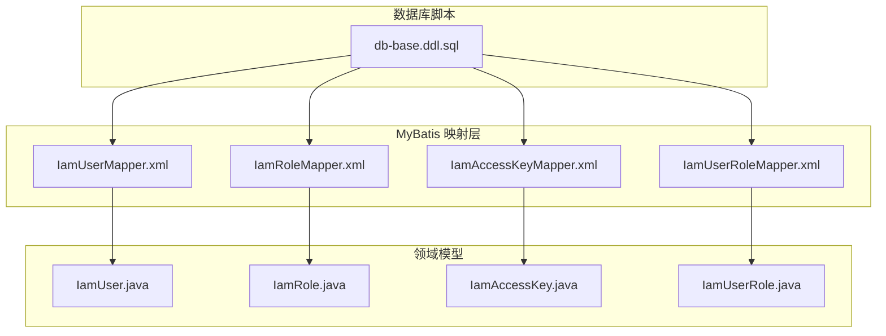
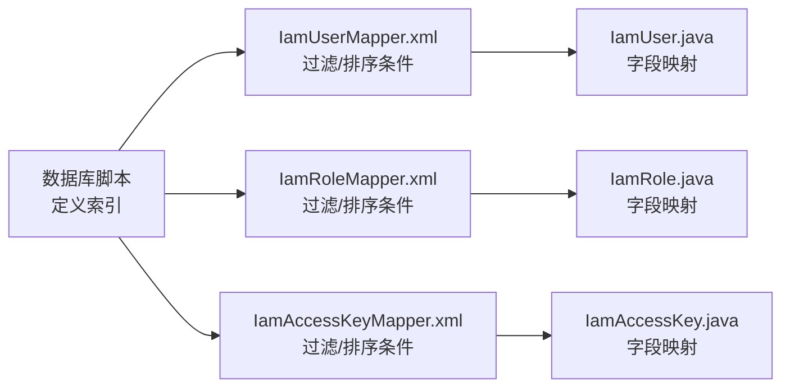

# 索引与约束

<cite>
**本文引用的文件**
- [db-base.ddl.sql](file://iam-sso/src/main/resources/db-script/db-base.ddl.sql)
- [IamUserMapper.xml](file://iam-admin/src/main/resources/mapper/IamUserMapper.xml)
- [IamRoleMapper.xml](file://iam-admin/src/main/resources/mapper/IamRoleMapper.xml)
- [IamAccessKeyMapper.xml](file://iam-admin/src/main/resources/mapper/IamAccessKeyMapper.xml)
- [IamUserRoleMapper.xml](file://iam-admin/src/main/resources/mapper/IamUserRoleMapper.xml)
- [IamUser.java](file://iam-common/src/main/java/com/wkclz/iam/common/entity/IamUser.java)
- [IamRole.java](file://iam-common/src/main/java/com/wkclz/iam/common/entity/IamRole.java)
- [IamAccessKey.java](file://iam-common/src/main/java/com/wkclz/iam/common/entity/IamAccessKey.java)
- [IamUserRole.java](file://iam-common/src/main/java/com/wkclz/iam/common/entity/IamUserRole.java)
</cite>

## 目录
1. 引言
2. 项目结构
3. 核心组件
4. 架构总览
5. 组件详解
6. 依赖分析
7. 性能考量
8. 故障排查指南
9. 结论
10. 附录

## 引言
本文件聚焦于 SH-IAM 的数据库索引与约束设计，系统性阐述主键索引、唯一索引、复合索引的设计原则与使用场景；记录外键约束、检查约束与触发器的实现现状与建议；结合查询语句与实体模型，给出索引性能优化策略、查询计划分析方法与执行效率评估要点；并提供索引维护策略、重建时机与性能监控指标，以及约束违反处理机制与数据完整性保障措施。

## 项目结构
围绕索引与约束主题，本仓库中与之直接相关的关键文件包括：
- 数据库基础建模脚本：用于定义表结构、主键与索引等
- MyBatis 映射文件：承载典型查询路径，体现索引使用意图
- 实体类：描述表字段与业务含义，辅助理解索引选择



图表来源
- [db-base.ddl.sql](file://iam-sso/src/main/resources/db-script/db-base.ddl.sql)
- [IamUserMapper.xml](file://iam-admin/src/main/resources/mapper/IamUserMapper.xml)
- [IamRoleMapper.xml](file://iam-admin/src/main/resources/mapper/IamRoleMapper.xml)
- [IamAccessKeyMapper.xml](file://iam-admin/src/main/resources/mapper/IamAccessKeyMapper.xml)
- [IamUserRoleMapper.xml](file://iam-admin/src/main/resources/mapper/IamUserRoleMapper.xml)
- [IamUser.java](file://iam-common/src/main/java/com/wkclz/iam/common/entity/IamUser.java)
- [IamRole.java](file://iam-common/src/main/java/com/wkclz/iam/common/entity/IamRole.java)
- [IamAccessKey.java](file://iam-common/src/main/java/com/wkclz/iam/common/entity/IamAccessKey.java)
- [IamUserRole.java](file://iam-common/src/main/java/com/wkclz/iam/common/entity/IamUserRole.java)

章节来源
- [db-base.ddl.sql](file://iam-sso/src/main/resources/db-script/db-base.ddl.sql)
- [IamUserMapper.xml](file://iam-admin/src/main/resources/mapper/IamUserMapper.xml)
- [IamRoleMapper.xml](file://iam-admin/src/main/resources/mapper/IamRoleMapper.xml)
- [IamAccessKeyMapper.xml](file://iam-admin/src/main/resources/mapper/IamAccessKeyMapper.xml)
- [IamUserRoleMapper.xml](file://iam-admin/src/main/resources/mapper/IamUserRoleMapper.xml)
- [IamUser.java](file://iam-common/src/main/java/com/wkclz/iam/common/entity/IamUser.java)
- [IamRole.java](file://iam-common/src/main/java/com/wkclz/iam/common/entity/IamRole.java)
- [IamAccessKey.java](file://iam-common/src/main/java/com/wkclz/iam/common/entity/IamAccessKey.java)
- [IamUserRole.java](file://iam-common/src/main/java/com/wkclz/iam/common/entity/IamUserRole.java)

## 核心组件
- 主键索引
  - 在数据库脚本中通过显式声明主键，确保每张表具备唯一标识与稳定行定位能力
- 普通索引（单列）
  - 在数据库脚本中对常用过滤或排序字段建立普通索引，以提升查询效率
- 查询路径与索引关联
  - MyBatis 映射文件中的 WHERE 条件与 ORDER BY 子句，体现了对索引的潜在需求
- 实体模型与字段映射
  - 实体类字段与数据库列一一对应，便于从 ORM 层面确认索引覆盖范围

章节来源
- [db-base.ddl.sql](file://iam-sso/src/main/resources/db-script/db-base.ddl.sql)
- [IamUserMapper.xml](file://iam-admin/src/main/resources/mapper/IamUserMapper.xml)
- [IamRoleMapper.xml](file://iam-admin/src/main/resources/mapper/IamRoleMapper.xml)
- [IamAccessKeyMapper.xml](file://iam-admin/src/main/resources/mapper/IamAccessKeyMapper.xml)
- [IamUserRoleMapper.xml](file://iam-admin/src/main/resources/mapper/IamUserRoleMapper.xml)
- [IamUser.java](file://iam-common/src/main/java/com/wkclz/iam/common/entity/IamUser.java)
- [IamRole.java](file://iam-common/src/main/java/com/wkclz/iam/common/entity/IamRole.java)
- [IamAccessKey.java](file://iam-common/src/main/java/com/wkclz/iam/common/entity/IamAccessKey.java)
- [IamUserRole.java](file://iam-common/src/main/java/com/wkclz/iam/common/entity/IamUserRole.java)

## 架构总览
下图展示与索引/约束相关的核心对象及其交互关系：数据库脚本定义表结构与索引，映射文件承载查询条件，实体类作为 ORM 契约，共同决定索引的有效性与查询性能。

```mermaid
classDiagram
class DbScript {
"+主键索引"
"+普通索引"
}
class MapperXml {
"+WHERE 条件"
"+ORDER BY 排序"
}
class Entity {
"+字段映射"
"+业务属性"
}
DbScript --> MapperXml : "提供索引支撑"
MapperXml --> Entity : "ORM 映射"
```

图表来源
- [db-base.ddl.sql](file://iam-sso/src/main/resources/db-script/db-base.ddl.sql)
- [IamUserMapper.xml](file://iam-admin/src/main/resources/mapper/IamUserMapper.xml)
- [IamRoleMapper.xml](file://iam-admin/src/main/resources/mapper/IamRoleMapper.xml)
- [IamAccessKeyMapper.xml](file://iam-admin/src/main/resources/mapper/IamAccessKeyMapper.xml)
- [IamUserRoleMapper.xml](file://iam-admin/src/main/resources/mapper/IamUserRoleMapper.xml)
- [IamUser.java](file://iam-common/src/main/java/com/wkclz/iam/common/entity/IamUser.java)
- [IamRole.java](file://iam-common/src/main/java/com/wkclz/iam/common/entity/IamRole.java)
- [IamAccessKey.java](file://iam-common/src/main/java/com/wkclz/iam/common/entity/IamAccessKey.java)
- [IamUserRole.java](file://iam-common/src/main/java/com/wkclz/iam/common/entity/IamUserRole.java)

## 组件详解

### 主键索引设计
- 设计原则
  - 每张表必须有主键，保证行级唯一性与稳定性
  - 优先选用自增整型或全局有序 ID，降低页分裂与存储碎片
- 使用场景
  - 作为连接、更新、删除的稳定定位键
  - 支撑外键引用与级联操作
- 在本项目中的体现
  - 数据库脚本中明确声明主键，确保所有核心表具备主键索引

章节来源
- [db-base.ddl.sql](file://iam-sso/src/main/resources/db-script/db-base.ddl.sql)

### 普通索引（单列）设计
- 设计原则
  - 对高频过滤条件（如 app_code、tenant_code、enable_status）建立单列索引
  - 对排序字段（如 sort、id）建立索引，避免排序开销
- 使用场景
  - 提升 WHERE 条件匹配速度
  - 减少回表次数，提高扫描效率
- 在本项目中的体现
  - 数据库脚本中对业务字段建立普通索引，满足常见查询模式

章节来源
- [db-base.ddl.sql](file://iam-sso/src/main/resources/db-script/db-base.ddl.sql)
- [IamAccessKeyMapper.xml](file://iam-admin/src/main/resources/mapper/IamAccessKeyMapper.xml)

### 复合索引设计
- 设计原则
  - 将最常用于过滤的列放在前缀位置，遵循“最左前缀”原则
  - 覆盖查询所需的所有列，减少回表
  - 平衡写入成本与查询收益，避免过度索引
- 典型候选
  - 用户查询：user_code、username、nickname、email、phone、user_status
  - 角色树形查询：app_code、parent_code、role_code
  - 访问密钥查询：app_code、app_id、enable_status
- 在本项目中的体现
  - 当前脚本已存在单列索引，建议在高频查询组合上引入复合索引以进一步优化

章节来源
- [IamUserMapper.xml](file://iam-admin/src/main/resources/mapper/IamUserMapper.xml)
- [IamRoleMapper.xml](file://iam-admin/src/main/resources/mapper/IamRoleMapper.xml)
- [IamAccessKeyMapper.xml](file://iam-admin/src/main/resources/mapper/IamAccessKeyMapper.xml)

### 外键约束
- 设计原则
  - 对跨表引用建立外键，确保参照完整性
  - 选择合适的级联策略（RESTRICT、CASCADE、SET NULL），平衡一致性与灵活性
- 在本项目中的现状
  - 未见显式外键定义；建议在涉及 iam_user_role、iam_role 等关系表时补充外键约束
- 影响与建议
  - 外键可显著降低脏数据风险，但会增加写入成本；需结合业务吞吐评估

章节来源
- [IamUserRole.java](file://iam-common/src/main/java/com/wkclz/iam/common/entity/IamUserRole.java)
- [IamRole.java](file://iam-common/src/main/java/com/wkclz/iam/common/entity/IamRole.java)

### 检查约束与触发器
- 检查约束
  - 用于限制列值范围或格式，如状态枚举、时间区间等
  - 建议在新增业务规则时补充，确保数据层面的强一致
- 触发器
  - 适用于审计日志、版本号递增、时间戳自动更新等自动化逻辑
  - 需谨慎使用，避免复杂度与性能回退
- 在本项目中的现状
  - 未发现显式检查约束与触发器定义；可在必要时按需引入

章节来源
- [IamAccessKey.java](file://iam-common/src/main/java/com/wkclz/iam/common/entity/IamAccessKey.java)

### 查询路径与索引使用
- 用户列表查询
  - 过滤条件：user_code、username、nickname、email、phone、user_status
  - 排序：id DESC
  - 建议：为上述过滤字段建立复合索引，并将 id 放在合适位置以覆盖排序
- 角色树查询
  - 过滤条件：app_code、parent_code、role_code
  - 分组与排序：sort、id
  - 建议：针对 app_code、parent_code 建立复合索引，覆盖分组与排序
- 访问密钥查询
  - 过滤条件：app_code、app_id、enable_status
  - 排序：sort、id
  - 建议：针对 app_code、app_id、enable_status 建立复合索引，覆盖过滤与排序

章节来源
- [IamUserMapper.xml](file://iam-admin/src/main/resources/mapper/IamUserMapper.xml)
- [IamRoleMapper.xml](file://iam-admin/src/main/resources/mapper/IamRoleMapper.xml)
- [IamAccessKeyMapper.xml](file://iam-admin/src/main/resources/mapper/IamAccessKeyMapper.xml)

### 索引性能优化策略
- 命中率与回表
  - 通过覆盖索引减少回表，提升查询吞吐
- 最左前缀与选择性
  - 将高选择性的列置于复合索引前部，提升过滤效率
- 写入成本权衡
  - 避免过多索引导致插入/更新变慢；定期评估索引收益
- 统计信息与直方图
  - 定期更新统计信息，帮助优化器选择最优执行计划

章节来源
- [IamUserMapper.xml](file://iam-admin/src/main/resources/mapper/IamUserMapper.xml)
- [IamRoleMapper.xml](file://iam-admin/src/main/resources/mapper/IamRoleMapper.xml)
- [IamAccessKeyMapper.xml](file://iam-admin/src/main/resources/mapper/IamAccessKeyMapper.xml)

### 查询计划分析与执行效率评估
- EXPLAIN 分析
  - 关注是否使用到目标索引、是否发生全表扫描、是否存在额外回表
- 执行时间与 IO
  - 结合慢查询日志与执行时间，评估索引带来的收益
- 并发与锁竞争
  - 高并发下的索引扫描可能引发锁竞争，需结合业务峰值进行容量规划

章节来源
- [IamUserMapper.xml](file://iam-admin/src/main/resources/mapper/IamUserMapper.xml)
- [IamRoleMapper.xml](file://iam-admin/src/main/resources/mapper/IamRoleMapper.xml)
- [IamAccessKeyMapper.xml](file://iam-admin/src/main/resources/mapper/IamAccessKeyMapper.xml)

### 索引维护策略、重建时机与监控指标
- 维护策略
  - 定期重建碎片化索引，保持 B+ 树高度与顺序性
  - 清理冗余索引，避免写入放大
- 重建时机
  - 索引碎片率超过阈值、查询性能明显下降、DDL 变更后
- 监控指标
  - 索引命中率、平均响应时间、慢查询数量、CPU/IO 利用率

章节来源
- [db-base.ddl.sql](file://iam-sso/src/main/resources/db-script/db-base.ddl.sql)

### 约束违反处理机制与数据完整性保障
- 违反处理
  - 主键冲突：返回唯一约束错误码，提示重复键值
  - 外键缺失：返回参照完整性错误，提示无效引用
  - 检查约束失败：返回校验失败错误，提示不合规值
- 保障措施
  - 在应用层捕获数据库异常，转换为统一错误码与提示
  - 在数据库层补充必要的约束定义，从源头阻断非法数据

章节来源
- [IamUserRole.java](file://iam-common/src/main/java/com/wkclz/iam/common/entity/IamUserRole.java)
- [IamAccessKey.java](file://iam-common/src/main/java/com/wkclz/iam/common/entity/IamAccessKey.java)

## 依赖分析
索引与约束设计的依赖关系体现在：数据库脚本定义索引，映射文件定义查询条件，实体类定义字段语义，三者协同决定索引的有效性与查询性能。



图表来源
- [db-base.ddl.sql](file://iam-sso/src/main/resources/db-script/db-base.ddl.sql)
- [IamUserMapper.xml](file://iam-admin/src/main/resources/mapper/IamUserMapper.xml)
- [IamRoleMapper.xml](file://iam-admin/src/main/resources/mapper/IamRoleMapper.xml)
- [IamAccessKeyMapper.xml](file://iam-admin/src/main/resources/mapper/IamAccessKeyMapper.xml)
- [IamUser.java](file://iam-common/src/main/java/com/wkclz/iam/common/entity/IamUser.java)
- [IamRole.java](file://iam-common/src/main/java/com/wkclz/iam/common/entity/IamRole.java)
- [IamAccessKey.java](file://iam-common/src/main/java/com/wkclz/iam/common/entity/IamAccessKey.java)

章节来源
- [db-base.ddl.sql](file://iam-sso/src/main/resources/db-script/db-base.ddl.sql)
- [IamUserMapper.xml](file://iam-admin/src/main/resources/mapper/IamUserMapper.xml)
- [IamRoleMapper.xml](file://iam-admin/src/main/resources/mapper/IamRoleMapper.xml)
- [IamAccessKeyMapper.xml](file://iam-admin/src/main/resources/mapper/IamAccessKeyMapper.xml)
- [IamUser.java](file://iam-common/src/main/java/com/wkclz/iam/common/entity/IamUser.java)
- [IamRole.java](file://iam-common/src/main/java/com/wkclz/iam/common/entity/IamRole.java)
- [IamAccessKey.java](file://iam-common/src/main/java/com/wkclz/iam/common/entity/IamAccessKey.java)

## 性能考量
- 选择性与基数
  - 高选择性的列更适合做索引前缀，能显著降低扫描行数
- 覆盖查询
  - 通过复合索引覆盖查询列，避免回表，提升吞吐
- 写入放大
  - 索引越多，写入成本越高；应根据读写比例动态调整
- 统计信息
  - 定期更新统计信息，确保优化器做出正确决策

## 故障排查指南
- 现象：查询变慢
  - 排查步骤：使用 EXPLAIN 分析执行计划，确认是否命中预期索引；检查是否有回表；评估索引选择性
- 现象：插入/更新变慢
  - 排查步骤：检查索引数量与类型；评估是否需要合并或删除冗余索引；关注碎片率
- 现象：约束冲突报错
  - 排查步骤：核对主键/外键/检查约束定义；在应用层转换为可读性强的错误提示；必要时补充前置校验

章节来源
- [IamUserMapper.xml](file://iam-admin/src/main/resources/mapper/IamUserMapper.xml)
- [IamRoleMapper.xml](file://iam-admin/src/main/resources/mapper/IamRoleMapper.xml)
- [IamAccessKeyMapper.xml](file://iam-admin/src/main/resources/mapper/IamAccessKeyMapper.xml)
- [IamUserRole.java](file://iam-common/src/main/java/com/wkclz/iam/common/entity/IamUserRole.java)
- [IamAccessKey.java](file://iam-common/src/main/java/com/wkclz/iam/common/entity/IamAccessKey.java)

## 结论
本项目在数据库脚本中已具备主键与单列索引的基础能力，结合 MyBatis 的查询路径与实体模型，建议进一步引入复合索引以覆盖高频过滤与排序场景；同时考虑补充外键约束与必要的检查约束/触发器，从数据库层面强化数据完整性；通过持续的查询计划分析、索引维护与监控，确保索引设计与业务增长相匹配。

## 附录
- 索引设计最佳实践清单
  - 为高频过滤列建立复合索引，遵循最左前缀原则
  - 通过覆盖索引减少回表
  - 定期重建碎片化索引，清理冗余索引
  - 更新统计信息，保障优化器决策质量
- 常见问题与解决方案
  - 过滤列选择性低：优先考虑添加选择性更高的列或拆分索引
  - 写入性能下降：评估索引数量与类型，必要时延迟或异步重建
  - 执行计划异常：检查索引统计、查询谓词与排序字段是否匹配索引结构