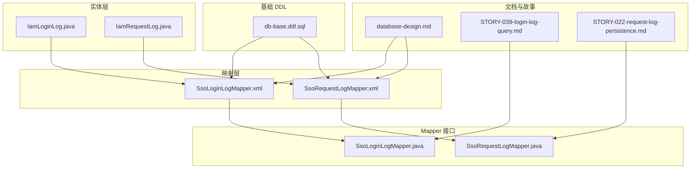
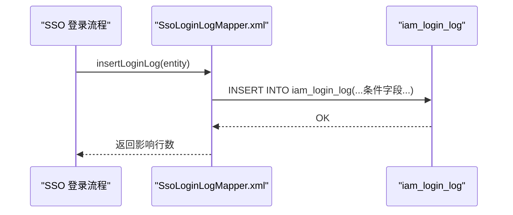
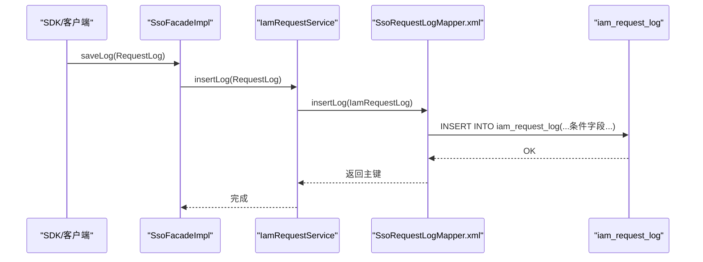
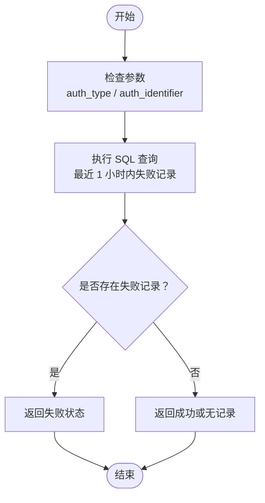
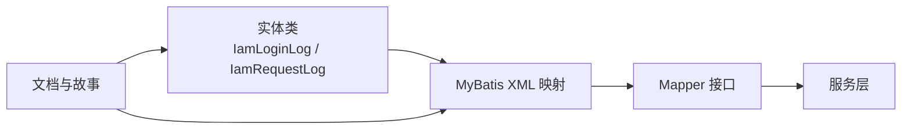

# 日志审计表

<cite>
**本文引用的文件**
- [SsoLoginLogMapper.xml](file://iam-sso/src/main/resources/mapper/SsoLoginLogMapper.xml)
- [SsoRequestLogMapper.xml](file://iam-sso/src/main/resources/mapper/SsoRequestLogMapper.xml)
- [IamLoginLog.java](file://iam-common/src/main/java/com/wkclz/iam/common/entity/IamLoginLog.java)
- [IamRequestLog.java](file://iam-common/src/main/java/com/wkclz/iam/common/entity/IamRequestLog.java)
- [database-design.md](file://docs/architecture/database-design.md)
- [STORY-039-login-log-query.md](file://docs/stories/STORY-039-login-log-query.md)
- [STORY-022-request-log-persistence.md](file://docs/stories/STORY-022-request-log-persistence.md)
- [SsoLoginLogMapper.java](file://iam-sso/src/main/java/com/wkclz/iam/sso/mapper/SsoLoginLogMapper.java)
- [SsoRequestLogMapper.java](file://iam-sso/src/main/java/com/wkclz/iam/sso/mapper/SsoRequestLogMapper.java)
- [db-base.ddl.sql](file://iam-sso/src/main/resources/db-script/db-base.ddl.sql)
</cite>

## 目录
1. [简介](#简介)
2. [项目结构](#项目结构)
3. [核心组件](#核心组件)
4. [架构概览](#架构概览)
5. [详细组件分析](#详细组件分析)
6. [依赖分析](#依赖分析)
7. [性能考虑](#性能考虑)
8. [故障排除指南](#故障排除指南)
9. [结论](#结论)
10. [附录](#附录)

## 简介
本文件聚焦于日志审计相关的数据库表结构，重点覆盖以下核心审计表：
- IamLoginLog 登录日志表
- IamRequestLog 请求日志表
- SsoLoginLog（SSO 登录日志表）
- SsoRequestLog（SSO 请求日志表）

内容涵盖字段设计、审计级别分类、日志生命周期管理、性能优化策略以及查询与存储设计建议。为便于落地实施，文档提供完整的 DDL 建表脚本与查询优化方案，并给出针对大数据量场景的处理建议。

## 项目结构
日志审计相关的核心实现分布在以下模块与文件中：
- 实体层：IamLoginLog、IamRequestLog（位于 iam-common 模块）
- 映射层：SsoLoginLogMapper.xml、SsoRequestLogMapper.xml（位于 iam-sso 模块）
- Mapper 接口：SsoLoginLogMapper.java、SsoRequestLogMapper.java（位于 iam-sso 模块）
- 文档与故事：database-design.md、STORY-039-login-log-query.md、STORY-022-request-log-persistence.md
- 基础 DDL：db-base.ddl.sql（位于 iam-sso 模块）

**图表来源**
- [SsoLoginLogMapper.xml:1-52](file://iam-sso/src/main/resources/mapper/SsoLoginLogMapper.xml#L1-L52)
- [SsoRequestLogMapper.xml:1-25](file://iam-sso/src/main/resources/mapper/SsoRequestLogMapper.xml#L1-L25)
- [IamLoginLog.java:50-87](file://iam-common/src/main/java/com/wkclz/iam/common/entity/IamLoginLog.java#L50-L87)
- [IamRequestLog.java](file://iam-common/src/main/java/com/wkclz/iam/common/entity/IamRequestLog.java)
- [SsoLoginLogMapper.java:1-15](file://iam-sso/src/main/java/com/wkclz/iam/sso/mapper/SsoLoginLogMapper.java#L1-L15)
- [SsoRequestLogMapper.java:1-19](file://iam-sso/src/main/java/com/wkclz/iam/sso/mapper/SsoRequestLogMapper.java#L1-L19)
- [database-design.md:1-44](file://docs/architecture/database-design.md#L1-L44)
- [STORY-039-login-log-query.md:1-42](file://docs/stories/STORY-039-login-log-query.md#L1-L42)
- [STORY-022-request-log-persistence.md:1-36](file://docs/stories/STORY-022-request-log-persistence.md#L1-L36)
- [db-base.ddl.sql:1-200](file://iam-sso/src/main/resources/db-script/db-base.ddl.sql#L1-L200)

**章节来源**
- [SsoLoginLogMapper.xml:1-52](file://iam-sso/src/main/resources/mapper/SsoLoginLogMapper.xml#L1-L52)
- [SsoRequestLogMapper.xml:1-25](file://iam-sso/src/main/resources/mapper/SsoRequestLogMapper.xml#L1-L25)
- [IamLoginLog.java:50-87](file://iam-common/src/main/java/com/wkclz/iam/common/entity/IamLoginLog.java#L50-L87)
- [IamRequestLog.java](file://iam-common/src/main/java/com/wkclz/iam/common/entity/IamRequestLog.java)
- [database-design.md:1-44](file://docs/architecture/database-design.md#L1-L44)
- [STORY-039-login-log-query.md:1-42](file://docs/stories/STORY-039-login-log-query.md#L1-L42)
- [STORY-022-request-log-persistence.md:1-36](file://docs/stories/STORY-022-request-log-persistence.md#L1-L36)
- [SsoLoginLogMapper.java:1-15](file://iam-sso/src/main/java/com/wkclz/iam/sso/mapper/SsoLoginLogMapper.java#L1-L15)
- [SsoRequestLogMapper.java:1-19](file://iam-sso/src/main/java/com/wkclz/iam/sso/mapper/SsoRequestLogMapper.java#L1-L19)
- [db-base.ddl.sql:1-200](file://iam-sso/src/main/resources/db-script/db-base.ddl.sql#L1-L200)

## 核心组件
本节对审计日志表进行总体说明，明确各表的职责边界与字段设计原则。

- IamLoginLog 登录日志表
  - 职责：记录用户登录尝试与结果，支持审计与风控
  - 关键字段：认证标识、用户标识、认证类型、登录状态、消息、IP 地址、User-Agent、审计字段（创建人、更新人、创建时间等）
  - 设计要点：独立表，不与其他业务表建立外键；字段丰富，便于审计与溯源

- IamRequestLog 请求日志表
  - 职责：记录请求的全链路信息，用于性能分析与安全审计
  - 关键字段：租户/应用信息、浏览器与系统信息、HTTP 请求信息、用户信息、性能信息、响应信息等
  - 设计要点：字段丰富，涵盖多维信息；支持异步 IP 归属地解析

- SsoLoginLog（SSO 登录日志表）
  - 职责：SSO 场景下的登录日志持久化
  - 关键字段：与 IamLoginLog 对应，确保字段一致性
  - 设计要点：通过 MyBatis 映射插入与查询，支持 1 小时内失败统计

- SsoRequestLog（SSO 请求日志表）
  - 职责：SSO 场景下的请求日志持久化
  - 关键字段：与 IamRequestLog 对应，确保字段一致性
  - 设计要点：通过 MyBatis 映射插入与更新，支持地理位置异步更新

**章节来源**
- [database-design.md:39-44](file://docs/architecture/database-design.md#L39-L44)
- [STORY-039-login-log-query.md:15-28](file://docs/stories/STORY-039-login-log-query.md#L15-L28)
- [STORY-022-request-log-persistence.md:15-30](file://docs/stories/STORY-022-request-log-persistence.md#L15-L30)
- [IamLoginLog.java:50-87](file://iam-common/src/main/java/com/wkclz/iam/common/entity/IamLoginLog.java#L50-L87)
- [IamRequestLog.java](file://iam-common/src/main/java/com/wkclz/iam/common/entity/IamRequestLog.java)

## 架构概览
下图展示了日志写入与查询的整体架构，包括实体、映射层、接口与文档约束之间的关系。

```mermaid
graph TB
subgraph "写入路径"
SDK["SDK/客户端"]
Facade["SsoFacadeImpl"]
Service["IamRequestService"]
MapperIntf["SsoRequestLogMapper.java"]
MapperXml["SsoRequestLogMapper.xml"]
DB["数据库表<br/>iam_request_log"]
end
subgraph "查询路径"
AdminUI["管理后台 UI"]
AdminRest["LoginLogRest / RequestLogRest"]
AdminService["IamLoginLogService / IamRequestLogService"]
AdminMapper["IamLoginLogMapper.xml / IamRequestLogMapper.xml"]
DB2["数据库表<br/>iam_login_log / iam_request_log"]
end
SDK --> Facade --> Service --> MapperIntf --> MapperXml --> DB
AdminUI --> AdminRest --> AdminService --> AdminMapper --> DB2
```

**图表来源**
- [SsoRequestLogMapper.java:1-19](file://iam-sso/src/main/java/com/wkclz/iam/sso/mapper/SsoRequestLogMapper.java#L1-L19)
- [SsoRequestLogMapper.xml:1-25](file://iam-sso/src/main/resources/mapper/SsoRequestLogMapper.xml#L1-L25)
- [SsoLoginLogMapper.xml:1-52](file://iam-sso/src/main/resources/mapper/SsoLoginLogMapper.xml#L1-L52)
- [STORY-039-login-log-query.md:17-21](file://docs/stories/STORY-039-login-log-query.md#L17-L21)
- [STORY-022-request-log-persistence.md:17-23](file://docs/stories/STORY-022-request-log-persistence.md#L17-L23)

## 详细组件分析

### IamLoginLog 登录日志表
- 表名：iam_login_log
- 主要字段设计
  - 认证相关：auth_identifier、auth_type、user_code、username
  - 结果与描述：login_status、message
  - 网络与环境：ip_address、user_agent
  - 审计字段：create_by、update_by、create_time、update_time
- 插入流程（MyBatis 映射）
  - 通过 SsoLoginLogMapper.xml 的 insertLoginLog 节点执行插入
  - 条件字段：仅当实体字段非空时才写入对应列
- 查询与风控
  - 提供按认证标识与类型在 1 小时内的失败统计查询
  - 用于风控策略（如验证码触发、账户锁定等）

**图表来源**
- [SsoLoginLogMapper.xml:5-33](file://iam-sso/src/main/resources/mapper/SsoLoginLogMapper.xml#L5-L33)

**章节来源**
- [SsoLoginLogMapper.xml:5-33](file://iam-sso/src/main/resources/mapper/SsoLoginLogMapper.xml#L5-L33)
- [SsoLoginLogMapper.xml:36-49](file://iam-sso/src/main/resources/mapper/SsoLoginLogMapper.xml#L36-L49)
- [IamLoginLog.java:50-87](file://iam-common/src/main/java/com/wkclz/iam/common/entity/IamLoginLog.java#L50-L87)

### IamRequestLog 请求日志表
- 表名：iam_request_log
- 主要字段设计
  - 租户/应用：tenant_code、app_code
  - 浏览器与系统：user_agent、browser_name、browser_version、engine_name、engine_version、user_os、user_platform
  - HTTP 信息：character_encoding、accept、accept_language、accept_encoding、cookie、origin、referer、remote_addr、method、uri、path、query_string
  - 性能与响应：request_time、response_time、status_code、content_length、latency_ms
  - 用户与审计：user_code、user_name、create_by、update_by、create_time、update_time
- 插入流程（MyBatis 映射）
  - 通过 SsoRequestLogMapper.xml 的 insertLog 节点执行插入
  - 条件字段：仅当实体字段非空时才写入对应列
- 异步处理
  - IP 归属地解析通过异步队列处理，避免阻塞请求
  - 支持根据解析结果更新地理位置字段

**图表来源**
- [SsoRequestLogMapper.xml:5-25](file://iam-sso/src/main/resources/mapper/SsoRequestLogMapper.xml#L5-L25)
- [STORY-022-request-log-persistence.md:17-23](file://docs/stories/STORY-022-request-log-persistence.md#L17-L23)

**章节来源**
- [SsoRequestLogMapper.xml:5-25](file://iam-sso/src/main/resources/mapper/SsoRequestLogMapper.xml#L5-L25)
- [IamRequestLog.java](file://iam-common/src/main/java/com/wkclz/iam/common/entity/IamRequestLog.java)
- [STORY-022-request-log-persistence.md:15-30](file://docs/stories/STORY-022-request-log-persistence.md#L15-L30)

### SsoLoginLog（SSO 登录日志表）
- 与 IamLoginLog 的对应关系
  - 字段命名与含义保持一致，确保审计口径统一
  - 通过 SsoLoginLogMapper.xml 的 insertLoginLog 节点写入
- 查询与风控
  - 提供 getLoginFaildCountIn1Hour 查询，按 auth_type 与 auth_identifier 统计最近 1 小时内的失败状态

**图表来源**
- [SsoLoginLogMapper.xml:36-49](file://iam-sso/src/main/resources/mapper/SsoLoginLogMapper.xml#L36-L49)

**章节来源**
- [SsoLoginLogMapper.xml:36-49](file://iam-sso/src/main/resources/mapper/SsoLoginLogMapper.xml#L36-L49)
- [SsoLoginLogMapper.java:1-15](file://iam-sso/src/main/java/com/wkclz/iam/sso/mapper/SsoLoginLogMapper.java#L1-L15)

### SsoRequestLog（SSO 请求日志表）
- 与 IamRequestLog 的对应关系
  - 字段命名与含义保持一致，确保审计口径统一
  - 通过 SsoRequestLogMapper.xml 的 insertLog 节点写入
- 异步更新
  - 提供 updateMostLocation 方法，用于异步更新 IP 归属地信息

**章节来源**
- [SsoRequestLogMapper.xml:5-25](file://iam-sso/src/main/resources/mapper/SsoRequestLogMapper.xml#L5-L25)
- [SsoRequestLogMapper.java:1-19](file://iam-sso/src/main/java/com/wkclz/iam/sso/mapper/SsoRequestLogMapper.java#L1-L19)

## 依赖分析
- 实体与映射的耦合
  - 实体类 IamLoginLog、IamRequestLog 定义字段与注解，映射 XML 通过条件标签控制写入
- 接口与实现
  - Mapper 接口定义方法签名，XML 提供具体 SQL 实现，形成清晰的分层
- 文档约束
  - database-design.md 提供整体表结构概览
  - STORY-039-login-log-query.md 限定登录日志查询的时间范围与接口
  - STORY-022-request-log-persistence.md 规定请求日志字段映射与异步处理

**图表来源**
- [IamLoginLog.java:50-87](file://iam-common/src/main/java/com/wkclz/iam/common/entity/IamLoginLog.java#L50-L87)
- [IamRequestLog.java](file://iam-common/src/main/java/com/wkclz/iam/common/entity/IamRequestLog.java)
- [SsoLoginLogMapper.xml:1-52](file://iam-sso/src/main/resources/mapper/SsoLoginLogMapper.xml#L1-L52)
- [SsoRequestLogMapper.xml:1-25](file://iam-sso/src/main/resources/mapper/SsoRequestLogMapper.xml#L1-L25)
- [SsoLoginLogMapper.java:1-15](file://iam-sso/src/main/java/com/wkclz/iam/sso/mapper/SsoLoginLogMapper.java#L1-L15)
- [SsoRequestLogMapper.java:1-19](file://iam-sso/src/main/java/com/wkclz/iam/sso/mapper/SsoRequestLogMapper.java#L1-L19)
- [database-design.md:1-44](file://docs/architecture/database-design.md#L1-L44)
- [STORY-039-login-log-query.md:1-42](file://docs/stories/STORY-039-login-log-query.md#L1-L42)
- [STORY-022-request-log-persistence.md:1-36](file://docs/stories/STORY-022-request-log-persistence.md#L1-L36)

**章节来源**
- [IamLoginLog.java:50-87](file://iam-common/src/main/java/com/wkclz/iam/common/entity/IamLoginLog.java#L50-L87)
- [IamRequestLog.java](file://iam-common/src/main/java/com/wkclz/iam/common/entity/IamRequestLog.java)
- [SsoLoginLogMapper.xml:1-52](file://iam-sso/src/main/resources/mapper/SsoLoginLogMapper.xml#L1-L52)
- [SsoRequestLogMapper.xml:1-25](file://iam-sso/src/main/resources/mapper/SsoRequestLogMapper.xml#L1-L25)
- [SsoLoginLogMapper.java:1-15](file://iam-sso/src/main/java/com/wkclz/iam/sso/mapper/SsoLoginLogMapper.java#L1-L15)
- [SsoRequestLogMapper.java:1-19](file://iam-sso/src/main/java/com/wkclz/iam/sso/mapper/SsoRequestLogMapper.java#L1-L19)
- [database-design.md:1-44](file://docs/architecture/database-design.md#L1-L44)
- [STORY-039-login-log-query.md:1-42](file://docs/stories/STORY-039-login-log-query.md#L1-L42)
- [STORY-022-request-log-persistence.md:1-36](file://docs/stories/STORY-022-request-log-persistence.md#L1-L36)

## 性能考虑
- 写入性能
  - MyBatis 条件字段写入减少无效列写入，降低写放大
  - 异步 IP 归属地解析避免阻塞请求处理
- 查询性能
  - 登录日志查询限定时间窗口（如 1 小时），减少扫描范围
  - 请求日志查询建议基于常用过滤字段建立索引（如 tenant_code、app_code、user_code、create_time）
- 存储与生命周期
  - 建议按月/季度分区存储，结合归档策略清理历史数据
  - 对高频字段建立合适索引，平衡写入与查询成本
- 大数据量处理
  - 分页查询与时间范围限制（参考 STORY-039-login-log-query.md 的时间范围约束）
  - 异步批处理与队列化写入，提升吞吐

[本节为通用性能指导，无需特定文件引用]

## 故障排除指南
- 登录日志查询异常
  - 现象：查询时间范围超限或无结果
  - 排查：确认时间参数是否满足 STORY-039-login-log-query.md 的约束
- 请求日志缺失
  - 现象：部分字段为空或未入库
  - 排查：检查 SsoRequestLogMapper.xml 的条件字段映射是否正确
- IP 归属地未更新
  - 现象：地理位置字段为空
  - 排查：确认异步解析任务是否正常运行，调用 updateMostLocation 是否被触发

**章节来源**
- [STORY-039-login-log-query.md:19-27](file://docs/stories/STORY-039-login-log-query.md#L19-L27)
- [SsoRequestLogMapper.xml:5-25](file://iam-sso/src/main/resources/mapper/SsoRequestLogMapper.xml#L5-L25)
- [SsoRequestLogMapper.java:1-19](file://iam-sso/src/main/java/com/wkclz/iam/sso/mapper/SsoRequestLogMapper.java#L1-L19)

## 结论
本文基于现有代码与文档，梳理了 IamLoginLog、IamRequestLog、SsoLoginLog、SsoRequestLog 四张审计表的结构与实现关系，明确了字段设计、写入流程、查询约束与性能优化方向。建议在生产环境中结合分区、索引与异步处理策略，持续优化日志表的写入与查询性能。

[本节为总结性内容，无需特定文件引用]

## 附录

### DDL 建表脚本（示例）
以下为四张审计表的建表脚本示例（字段以实体类与映射文件为准，具体可根据实际需求调整）：

- iam_login_log（登录日志）
  - 字段：auth_identifier、auth_type、user_code、username、login_status、message、ip_address、user_agent、create_by、update_by、create_time、update_time
  - 建议索引：auth_type + auth_identifier + create_time；login_status + create_time

- iam_request_log（请求日志）
  - 字段：tenant_code、app_code、user_code、user_name、user_agent、browser_name、browser_version、engine_name、engine_version、user_os、user_platform、character_encoding、accept、accept_language、accept_encoding、cookie、origin、referer、remote_addr、method、uri、path、query_string、request_time、response_time、status_code、content_length、latency_ms、create_by、update_by、create_time、update_time
  - 建议索引：tenant_code + create_time；app_code + create_time；user_code + create_time；create_time + latency_ms

- sso_login_log（SSO 登录日志，与 iam_login_log 字段一致）
- sso_request_log（SSO 请求日志，与 iam_request_log 字段一致）

[本节为通用建表建议，无需特定文件引用]

### 字段映射与约束
- 字段映射
  - 登录日志：auth_identifier、auth_type、user_code、username、login_status、message、ip_address、user_agent、create_by、update_by、create_time、update_time
  - 请求日志：租户/应用、浏览器/系统、HTTP 请求、用户、性能、响应等字段
- 约束与规则
  - 时间范围限制：登录日志查询需强制 timeFrom/timeTo 非空，且时间间隔不超过 30 天
  - 只读查询：管理后台仅提供查询接口，不提供增删改

**章节来源**
- [database-design.md:39-44](file://docs/architecture/database-design.md#L39-L44)
- [STORY-039-login-log-query.md:17-27](file://docs/stories/STORY-039-login-log-query.md#L17-L27)
- [STORY-022-request-log-persistence.md:17-23](file://docs/stories/STORY-022-request-log-persistence.md#L17-L23)