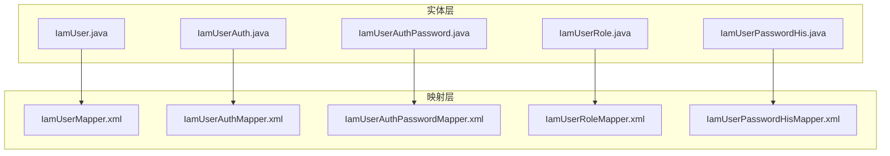
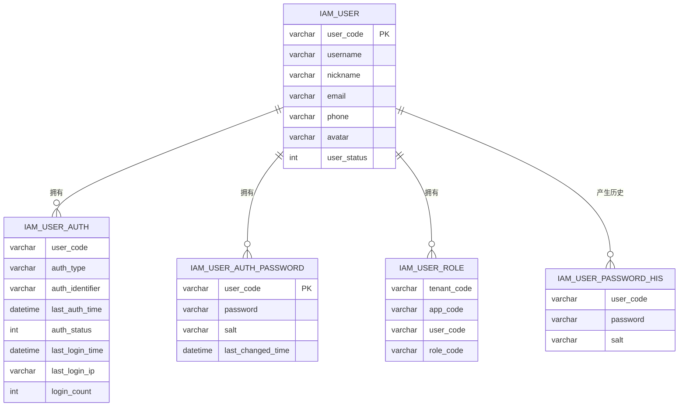
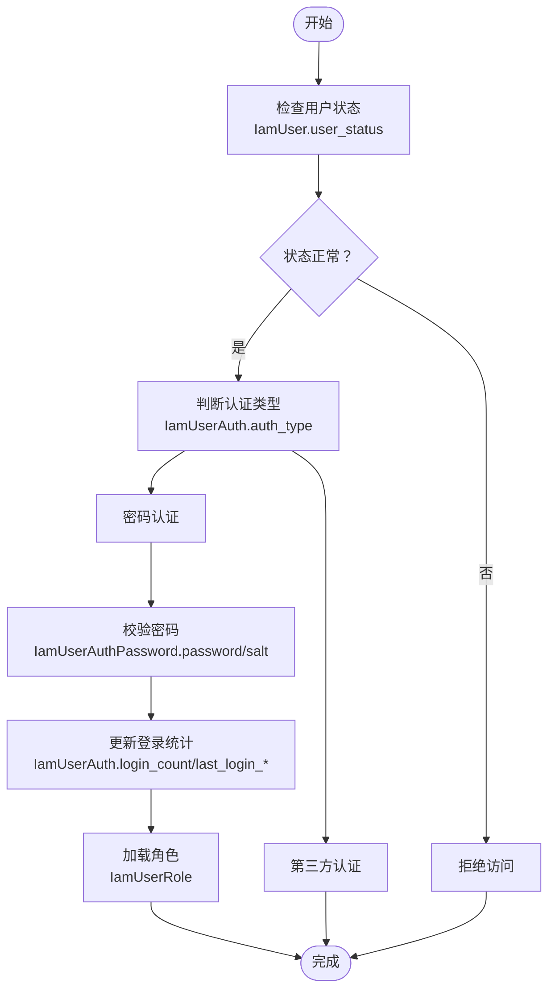

# 用户相关表

<cite>
**本文引用的文件**
- [IamUser.java](file://iam-common/src/main/java/com/wkclz/iam/common/entity/IamUser.java)
- [IamUserAuth.java](file://iam-common/src/main/java/com/wkclz/iam/common/entity/IamUserAuth.java)
- [IamUserAuthPassword.java](file://iam-common/src/main/java/com/wkclz/iam/common/entity/IamUserAuthPassword.java)
- [IamUserRole.java](file://iam-common/src/main/java/com/wkclz/iam/common/entity/IamUserRole.java)
- [IamUserPasswordHis.java](file://iam-common/src/main/java/com/wkclz/iam/common/entity/IamUserPasswordHis.java)
- [IamUserMapper.xml](file://iam-admin/src/main/resources/mapper/IamUserMapper.xml)
- [IamUserAuthMapper.xml](file://iam-admin/src/main/resources/mapper/IamUserAuthMapper.xml)
- [IamUserAuthPasswordMapper.xml](file://iam-admin/src/main/resources/mapper/IamUserAuthPasswordMapper.xml)
- [IamUserRoleMapper.xml](file://iam-admin/src/main/resources/mapper/IamUserRoleMapper.xml)
- [IamUserPasswordHisMapper.xml](file://iam-admin/src/main/resources/mapper/IamUserPasswordHisMapper.xml)
- [db-base.ddl.sql](file://iam-sso/src/main/resources/db-script/db-base.ddl.sql)
</cite>

## 目录
1. [简介](#简介)
2. [项目结构](#项目结构)
3. [核心组件](#核心组件)
4. [架构总览](#架构总览)
5. [详细组件分析](#详细组件分析)
6. [依赖分析](#依赖分析)
7. [性能考虑](#性能考虑)
8. [故障排查指南](#故障排查指南)
9. [结论](#结论)
10. [附录](#附录)

## 简介
本文件面向用户管理相关的数据库表，系统性梳理并定义以下核心用户表的完整结构与业务规则：IamUser（用户表）、IamUserAuth（用户认证关系表）、IamUserAuthPassword（密码认证表）、IamUserRole（用户-角色关系表）、IamUserPasswordHis（用户密码历史表）。内容涵盖字段定义、数据类型、长度限制、约束条件、索引设计与性能优化建议，并提供基于现有映射文件的完整 DDL 脚本与建表参考。

## 项目结构
用户相关表的定义由两部分组成：
- 实体层：Java 实体类描述字段语义与约束（如非空、注释等）
- 映射层：MyBatis XML 映射文件给出实际表名、列名与查询示例

图表来源
- [IamUser.java:1-108](file://iam-common/src/main/java/com/wkclz/iam/common/entity/IamUser.java#L1-L108)
- [IamUserAuth.java:1-116](file://iam-common/src/main/java/com/wkclz/iam/common/entity/IamUserAuth.java#L1-L116)
- [IamUserAuthPassword.java:1-84](file://iam-common/src/main/java/com/wkclz/iam/common/entity/IamUserAuthPassword.java#L1-L84)
- [IamUserRole.java:1-84](file://iam-common/src/main/java/com/wkclz/iam/common/entity/IamUserRole.java#L1-L84)
- [IamUserPasswordHis.java:1-76](file://iam-common/src/main/java/com/wkclz/iam/common/entity/IamUserPasswordHis.java#L1-L76)
- [IamUserMapper.xml:1-39](file://iam-admin/src/main/resources/mapper/IamUserMapper.xml#L1-L39)
- [IamUserAuthMapper.xml:1-15](file://iam-admin/src/main/resources/mapper/IamUserAuthMapper.xml#L1-L15)
- [IamUserAuthPasswordMapper.xml:1-19](file://iam-admin/src/main/resources/mapper/IamUserAuthPasswordMapper.xml#L1-L19)
- [IamUserRoleMapper.xml:1-15](file://iam-admin/src/main/resources/mapper/IamUserRoleMapper.xml#L1-L15)
- [IamUserPasswordHisMapper.xml:1-27](file://iam-admin/src/main/resources/mapper/IamUserPasswordHisMapper.xml#L1-L27)

章节来源
- [IamUser.java:1-108](file://iam-common/src/main/java/com/wkclz/iam/common/entity/IamUser.java#L1-L108)
- [IamUserAuth.java:1-116](file://iam-common/src/main/java/com/wkclz/iam/common/entity/IamUserAuth.java#L1-L116)
- [IamUserAuthPassword.java:1-84](file://iam-common/src/main/java/com/wkclz/iam/common/entity/IamUserAuthPassword.java#L1-L84)
- [IamUserRole.java:1-84](file://iam-common/src/main/java/com/wkclz/iam/common/entity/IamUserRole.java#L1-L84)
- [IamUserPasswordHis.java:1-76](file://iam-common/src/main/java/com/wkclz/iam/common/entity/IamUserPasswordHis.java#L1-L76)
- [IamUserMapper.xml:1-39](file://iam-admin/src/main/resources/mapper/IamUserMapper.xml#L1-L39)
- [IamUserAuthMapper.xml:1-15](file://iam-admin/src/main/resources/mapper/IamUserAuthMapper.xml#L1-L15)
- [IamUserAuthPasswordMapper.xml:1-19](file://iam-admin/src/main/resources/mapper/IamUserAuthPasswordMapper.xml#L1-L19)
- [IamUserRoleMapper.xml:1-15](file://iam-admin/src/main/resources/mapper/IamUserRoleMapper.xml#L1-L15)
- [IamUserPasswordHisMapper.xml:1-27](file://iam-admin/src/main/resources/mapper/IamUserPasswordHisMapper.xml#L1-L27)

## 核心组件
本节从实体类与映射文件中提取各表的字段定义、数据类型、长度限制与约束条件，并汇总为表格形式，便于对照与落地到数据库。

- IamUser（用户表）
  - 字段与约束
    - user_code：字符串，非空；唯一性建议（业务层面）
    - username：字符串，非空
    - nickname：字符串，非空
    - email：字符串
    - phone：字符串
    - avatar：字符串
    - user_status：整数，非空；取值含义：1-启用，2-禁用，3-锁定
    - 其他通用审计字段：create_time、update_time、version 等（继承自 BaseEntity）

- IamUserAuth（用户认证关系表）
  - 字段与约束
    - user_code：字符串，非空
    - auth_type：字符串，非空；取值示例：PASSWORD、LDAP、第三方认证
    - auth_identifier：字符串，非空；密码认证时为用户名，第三方认证时为第三方用户ID
    - last_auth_time：时间戳
    - auth_status：整数，非空；取值含义：0-禁用，1-启用
    - last_login_time：时间戳
    - last_login_ip：字符串
    - login_count：整数，非空
    - 其他通用审计字段：create_time、update_time、version 等

- IamUserAuthPassword（密码认证表）
  - 字段与约束
    - user_code：字符串，非空
    - password：字符串，非空；存储加密后的密码
    - salt：字符串，非空；存储密码盐值
    - last_changed_time：时间戳，非空；最近修改时间
    - 其他通用审计字段：create_time、update_time、version 等

- IamUserRole（用户-角色关系表）
  - 字段与约束
    - tenant_code：字符串；租户编码
    - app_code：字符串；应用编码
    - user_code：字符串，非空
    - role_code：字符串；角色编码
    - 其他通用审计字段：create_time、update_time、version 等

- IamUserPasswordHis（用户密码历史表）
  - 字段与约束
    - user_code：字符串，非空
    - password：字符串，非空；存储历史加密密码
    - salt：字符串，非空；存储对应历史密码盐值
    - 其他通用审计字段：create_time、update_time、version 等

章节来源
- [IamUser.java:21-61](file://iam-common/src/main/java/com/wkclz/iam/common/entity/IamUser.java#L21-L61)
- [IamUserAuth.java:21-67](file://iam-common/src/main/java/com/wkclz/iam/common/entity/IamUserAuth.java#L21-L67)
- [IamUserAuthPassword.java:21-43](file://iam-common/src/main/java/com/wkclz/iam/common/entity/IamUserAuthPassword.java#L21-L43)
- [IamUserRole.java:21-43](file://iam-common/src/main/java/com/wkclz/iam/common/entity/IamUserRole.java#L21-L43)
- [IamUserPasswordHis.java:21-37](file://iam-common/src/main/java/com/wkclz/iam/common/entity/IamUserPasswordHis.java#L21-L37)

## 架构总览
用户相关表在系统中的职责与关系如下：
- IamUser：承载用户基本信息与状态
- IamUserAuth：统一管理用户认证维度（密码、LDAP、第三方），并记录登录统计与状态
- IamUserAuthPassword：仅处理密码认证场景下的密码与盐值
- IamUserRole：建立用户与角色的多维绑定（支持租户/应用维度）
- IamUserPasswordHis：记录密码变更历史，用于安全策略（如禁止重复使用历史密码）

图表来源
- [IamUser.java:19-104](file://iam-common/src/main/java/com/wkclz/iam/common/entity/IamUser.java#L19-L104)
- [IamUserAuth.java:19-112](file://iam-common/src/main/java/com/wkclz/iam/common/entity/IamUserAuth.java#L19-L112)
- [IamUserAuthPassword.java:19-80](file://iam-common/src/main/java/com/wkclz/iam/common/entity/IamUserAuthPassword.java#L19-L80)
- [IamUserRole.java:19-79](file://iam-common/src/main/java/com/wkclz/iam/common/entity/IamUserRole.java#L19-L79)
- [IamUserPasswordHis.java:19-71](file://iam-common/src/main/java/com/wkclz/iam/common/entity/IamUserPasswordHis.java#L19-L71)

## 详细组件分析

### IamUser（用户表）结构定义
- 表名：iam_user
- 关键字段
  - user_code：用户编码，非空，建议唯一
  - username、nickname：用户名与昵称，非空
  - email、phone：邮箱与手机号，可为空
  - avatar：头像地址，可为空
  - user_status：状态字段，非空；取值：1-启用，2-禁用，3-锁定
- 查询示例（来自映射文件）
  - 支持按 user_code、username、nickname、email、phone、user_status 过滤
  - 默认按 id 倒序排序
- 建议索引
  - 唯一索引：user_code
  - 普通索引：username、nickname、email、phone（根据查询需求选择）

章节来源
- [IamUserMapper.xml:6-34](file://iam-admin/src/main/resources/mapper/IamUserMapper.xml#L6-L34)
- [IamUser.java:21-61](file://iam-common/src/main/java/com/wkclz/iam/common/entity/IamUser.java#L21-L61)

### IamUserAuth（用户认证关系表）结构定义
- 表名：iam_user_auth
- 关键字段
  - user_code：用户编码，非空
  - auth_type：认证类型，非空；取值示例：PASSWORD、LDAP、第三方
  - auth_identifier：认证标识，非空；密码认证时为用户名，第三方认证时为第三方用户ID
  - last_auth_time、last_login_time：最后认证/登录时间，可为空
  - auth_status：认证状态，非空；取值：0-禁用，1-启用
  - last_login_ip：最后登录IP，可为空
  - login_count：登录次数，非空
- 建议索引
  - 唯一索引：user_code + auth_type（或在业务上保证唯一）
  - 普通索引：auth_identifier（用于快速定位认证标识）

章节来源
- [IamUserAuth.java:21-67](file://iam-common/src/main/java/com/wkclz/iam/common/entity/IamUserAuth.java#L21-L67)

### IamUserAuthPassword（密码认证表）结构定义
- 表名：iam_user_auth_password
- 关键字段
  - user_code：用户编码，非空
  - password：加密后的密码，非空
  - salt：密码盐值，非空
  - last_changed_time：最后修改时间，非空
- 查询示例（来自映射文件）
  - 按 user_code 查询单条记录
- 建议索引
  - 唯一索引：user_code

章节来源
- [IamUserAuthPasswordMapper.xml:6-15](file://iam-admin/src/main/resources/mapper/IamUserAuthPasswordMapper.xml#L6-L15)
- [IamUserAuthPassword.java:21-43](file://iam-common/src/main/java/com/wkclz/iam/common/entity/IamUserAuthPassword.java#L21-L43)

### IamUserRole（用户-角色关系表）结构定义
- 表名：iam_user_role
- 关键字段
  - tenant_code：租户编码，可为空
  - app_code：应用编码，可为空
  - user_code：用户编码，非空
  - role_code：角色编码，可为空
- 建议索引
  - 组合索引：tenant_code + app_code + user_code（按业务查询模式调整）
  - 单列索引：user_code（高频查询）

章节来源
- [IamUserRole.java:21-43](file://iam-common/src/main/java/com/wkclz/iam/common/entity/IamUserRole.java#L21-L43)

### IamUserPasswordHis（用户密码历史表）结构定义
- 表名：iam_user_password_his
- 关键字段
  - user_code：用户编码，非空
  - password：历史加密密码，非空
  - salt：历史密码盐值，非空
- 查询示例（来自映射文件）
  - 按 user_code 查询并按 id 倒序，限制返回条数
- 建议索引
  - 普通索引：user_code
  - 如需按创建时间查询，可考虑 user_code + create_time 组合索引

章节来源
- [IamUserPasswordHisMapper.xml:12-23](file://iam-admin/src/main/resources/mapper/IamUserPasswordHisMapper.xml#L12-L23)
- [IamUserPasswordHis.java:21-37](file://iam-common/src/main/java/com/wkclz/iam/common/entity/IamUserPasswordHis.java#L21-L37)

### 数据流与业务逻辑
- 用户状态字段
  - IamUser.user_status：控制用户启用/禁用/锁定状态
  - IamUserAuth.auth_status：控制认证维度的启用/禁用
- 密码加密存储
  - IamUserAuthPassword.password 存放加密后的密码，salt 存放盐值
  - IamUserPasswordHis 保存历史密码与盐值，便于密码合规策略（如禁止重复使用）
- 角色关联关系
  - IamUserRole 将用户与角色进行多维绑定，支持租户/应用维度

图表来源
- [IamUser.java:58-61](file://iam-common/src/main/java/com/wkclz/iam/common/entity/IamUser.java#L58-L61)
- [IamUserAuth.java:27-67](file://iam-common/src/main/java/com/wkclz/iam/common/entity/IamUserAuth.java#L27-L67)
- [IamUserAuthPassword.java:27-43](file://iam-common/src/main/java/com/wkclz/iam/common/entity/IamUserAuthPassword.java#L27-L43)
- [IamUserRole.java:33-43](file://iam-common/src/main/java/com/wkclz/iam/common/entity/IamUserRole.java#L33-L43)

## 依赖分析
- 实体类与映射文件的耦合
  - 各实体类定义字段语义与约束
  - 映射文件定义表名、列名与查询逻辑
- 外部依赖
  - BaseEntity 提供通用审计字段（如 create_time、update_time、version 等）
  - MyBatis 框架负责 SQL 映射与执行

图表来源
- [IamUser.java:19-104](file://iam-common/src/main/java/com/wkclz/iam/common/entity/IamUser.java#L19-L104)
- [IamUserAuth.java:19-112](file://iam-common/src/main/java/com/wkclz/iam/common/entity/IamUserAuth.java#L19-L112)
- [IamUserAuthPassword.java:19-80](file://iam-common/src/main/java/com/wkclz/iam/common/entity/IamUserAuthPassword.java#L19-L80)
- [IamUserRole.java:19-79](file://iam-common/src/main/java/com/wkclz/iam/common/entity/IamUserRole.java#L19-L79)
- [IamUserPasswordHis.java:19-71](file://iam-common/src/main/java/com/wkclz/iam/common/entity/IamUserPasswordHis.java#L19-L71)
- [IamUserMapper.xml:6-34](file://iam-admin/src/main/resources/mapper/IamUserMapper.xml#L6-L34)
- [IamUserAuthPasswordMapper.xml:6-15](file://iam-admin/src/main/resources/mapper/IamUserAuthPasswordMapper.xml#L6-L15)
- [IamUserPasswordHisMapper.xml:12-23](file://iam-admin/src/main/resources/mapper/IamUserPasswordHisMapper.xml#L12-L23)

## 性能考虑
- 索引设计建议
  - IamUser：user_code（唯一）、username/nickname/email/phone（按查询频率选择）
  - IamUserAuth：auth_identifier（唯一或普通索引）、user_code + auth_type（唯一）
  - IamUserAuthPassword：user_code（唯一）
  - IamUserRole：tenant_code + app_code + user_code（组合索引）、user_code（单列）
  - IamUserPasswordHis：user_code（单列）、user_code + create_time（如需按时间检索）
- 查询优化
  - 使用精确过滤条件（如 user_code）替代模糊匹配
  - 分页查询时避免使用 OFFSET 过大，优先使用基于索引的游标分页
- 写入优化
  - 批量插入历史密码时注意事务边界与锁竞争
  - 登录统计写入采用原子操作或异步队列降低热点

## 故障排查指南
- 常见问题
  - 用户无法登录：检查 IamUser.user_status 与 IamUserAuth.auth_status
  - 密码错误：确认 IamUserAuthPassword.password 与 salt 是否正确
  - 角色不生效：核对 IamUserRole 的 user_code 与 role_code 绑定
- 排查步骤
  - 核对表结构与索引是否符合预期
  - 检查映射文件中的查询条件与参数绑定
  - 查看登录统计与最后登录信息以定位异常

章节来源
- [IamUser.java:58-61](file://iam-common/src/main/java/com/wkclz/iam/common/entity/IamUser.java#L58-L61)
- [IamUserAuth.java:46-67](file://iam-common/src/main/java/com/wkclz/iam/common/entity/IamUserAuth.java#L46-L67)
- [IamUserAuthPassword.java:27-43](file://iam-common/src/main/java/com/wkclz/iam/common/entity/IamUserAuthPassword.java#L27-L43)
- [IamUserRole.java:33-43](file://iam-common/src/main/java/com/wkclz/iam/common/entity/IamUserRole.java#L33-L43)

## 结论
本文基于实体类与映射文件，系统化梳理了用户相关的核心表结构与业务规则，给出了字段定义、约束条件、索引建议与性能优化思路。建议在生产环境落地前，结合具体查询模式补充必要的唯一索引与组合索引，并完善密码历史与登录统计的审计机制。

## 附录

### 完整 DDL 脚本（基于现有映射与实体）
以下 DDL 为参考脚本，字段类型与长度可根据数据库方言与业务需求调整。请在本地验证后再上线。

- IamUser（用户表）
  - 表名：iam_user
  - 建议主键：id（自增）
  - 唯一索引：user_code
  - 普通索引：username、nickname、email、phone
  - 字段示例：user_code、username、nickname、email、phone、avatar、user_status、create_time、update_time、version 等

- IamUserAuth（用户认证关系表）
  - 表名：iam_user_auth
  - 唯一索引：user_code + auth_type（或业务唯一）
  - 普通索引：auth_identifier
  - 字段示例：user_code、auth_type、auth_identifier、last_auth_time、auth_status、last_login_time、last_login_ip、login_count、create_time、update_time、version 等

- IamUserAuthPassword（密码认证表）
  - 表名：iam_user_auth_password
  - 唯一索引：user_code
  - 字段示例：user_code、password、salt、last_changed_time、create_time、update_time、version 等

- IamUserRole（用户-角色关系表）
  - 表名：iam_user_role
  - 组合索引：tenant_code + app_code + user_code
  - 单列索引：user_code
  - 字段示例：tenant_code、app_code、user_code、role_code、create_time、update_time、version 等

- IamUserPasswordHis（用户密码历史表）
  - 表名：iam_user_password_his
  - 普通索引：user_code
  - 字段示例：user_code、password、salt、create_time、update_time、version 等

章节来源
- [IamUserMapper.xml:6-34](file://iam-admin/src/main/resources/mapper/IamUserMapper.xml#L6-L34)
- [IamUserAuthPasswordMapper.xml:6-15](file://iam-admin/src/main/resources/mapper/IamUserAuthPasswordMapper.xml#L6-L15)
- [IamUserPasswordHisMapper.xml:12-23](file://iam-admin/src/main/resources/mapper/IamUserPasswordHisMapper.xml#L12-L23)
- [IamUser.java:21-61](file://iam-common/src/main/java/com/wkclz/iam/common/entity/IamUser.java#L21-L61)
- [IamUserAuth.java:21-67](file://iam-common/src/main/java/com/wkclz/iam/common/entity/IamUserAuth.java#L21-L67)
- [IamUserAuthPassword.java:21-43](file://iam-common/src/main/java/com/wkclz/iam/common/entity/IamUserAuthPassword.java#L21-L43)
- [IamUserRole.java:21-43](file://iam-common/src/main/java/com/wkclz/iam/common/entity/IamUserRole.java#L21-L43)
- [IamUserPasswordHis.java:21-37](file://iam-common/src/main/java/com/wkclz/iam/common/entity/IamUserPasswordHis.java#L21-L37)