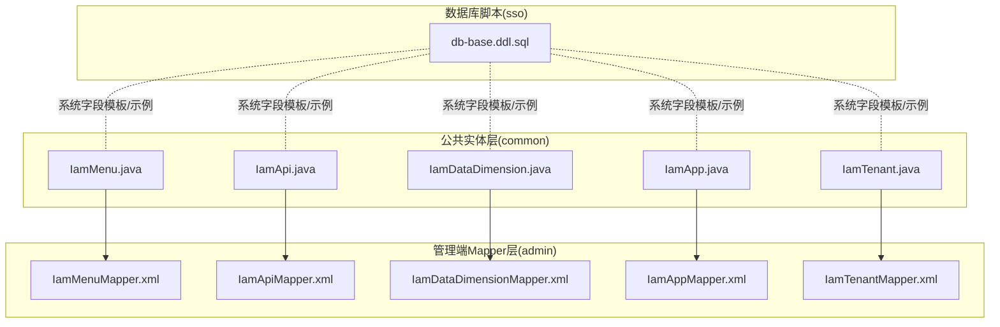
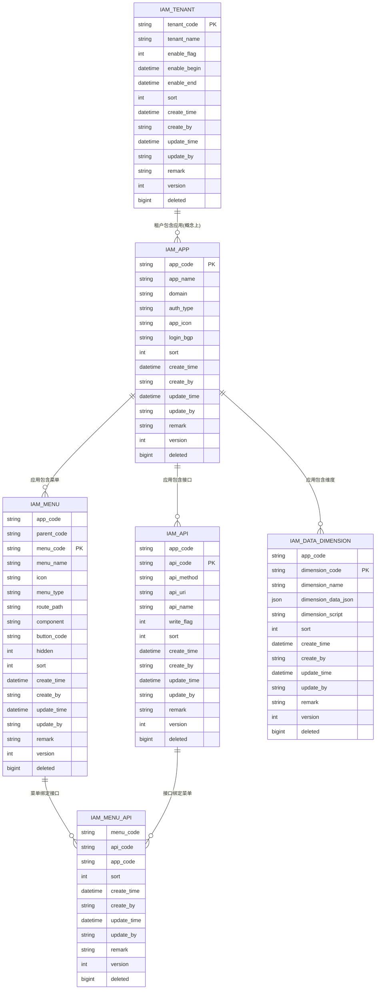
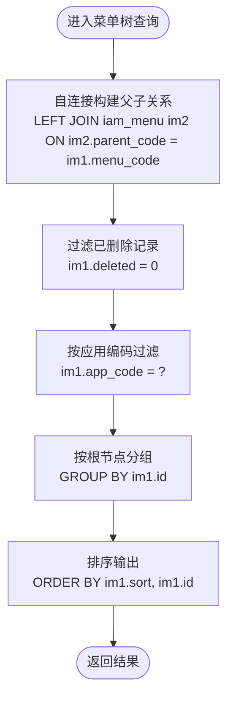
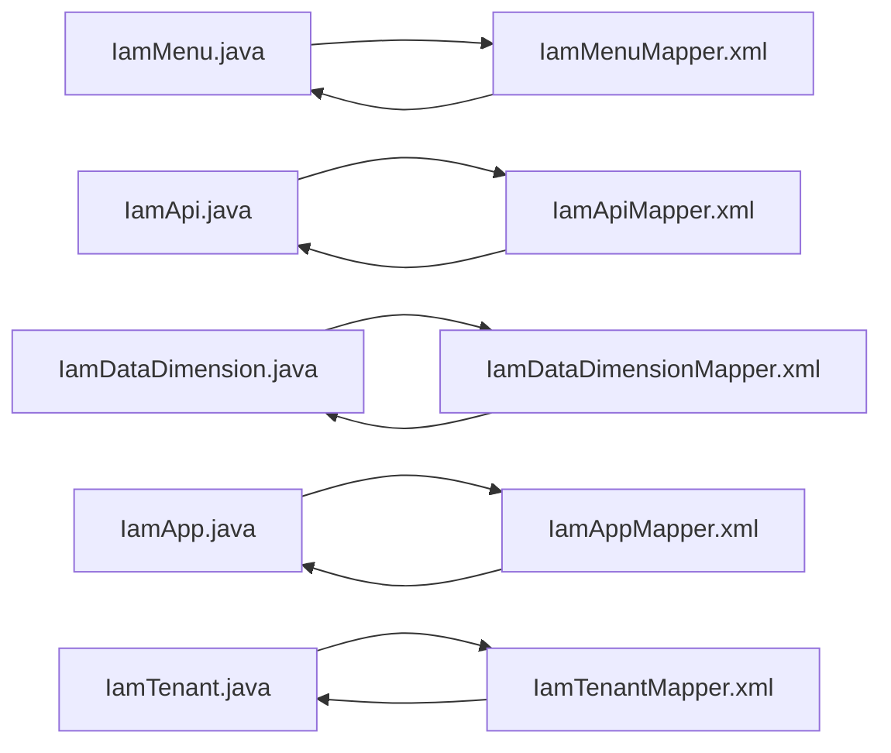

# 系统配置表

<cite>
**本文引用的文件**
- [db-base.ddl.sql](file://iam-sso/src/main/resources/db-script/db-base.ddl.sql)
- [IamMenu.java](file://iam-common/src/main/java/com/wkclz/iam/common/entity/IamMenu.java)
- [IamApi.java](file://iam-common/src/main/java/com/wkclz/iam/common/entity/IamApi.java)
- [IamDataDimension.java](file://iam-common/src/main/java/com/wkclz/iam/common/entity/IamDataDimension.java)
- [IamApp.java](file://iam-common/src/main/java/com/wkclz/iam/common/entity/IamApp.java)
- [IamTenant.java](file://iam-common/src/main/java/com/wkclz/iam/common/entity/IamTenant.java)
- [IamMenuMapper.xml](file://iam-admin/src/main/resources/mapper/IamMenuMapper.xml)
- [IamApiMapper.xml](file://iam-admin/src/main/resources/mapper/IamApiMapper.xml)
- [IamDataDimensionMapper.xml](file://iam-admin/src/main/resources/mapper/IamDataDimensionMapper.xml)
- [IamAppMapper.xml](file://iam-admin/src/main/resources/mapper/IamAppMapper.xml)
- [IamTenantMapper.xml](file://iam-admin/src/main/resources/mapper/IamTenantMapper.xml)
</cite>

## 目录
1. [简介](#简介)
2. [项目结构](#项目结构)
3. [核心组件](#核心组件)
4. [架构总览](#架构总览)
5. [详细组件分析](#详细组件分析)
6. [依赖关系分析](#依赖关系分析)
7. [性能考虑](#性能考虑)
8. [故障排查指南](#故障排查指南)
9. [结论](#结论)
10. [附录](#附录)

## 简介
本文件面向系统配置管理相关的数据库表，聚焦以下核心表的结构定义与业务规则：IamMenu（菜单表）、IamMenuApi（菜单API关联表）、IamApi（接口表）、IamDataDimension（数据维度表）、IamApp（应用表）、IamTenant（租户表）。内容涵盖字段定义、层次结构设计（如菜单树形结构）、API接口管理策略、数据维度权限模型、多租户支持方案，并提供完整的DDL建表脚本与扩展性设计建议。

## 项目结构
围绕系统配置表，代码库采用“公共实体层 + 管理端Mapper层”的分层组织方式：
- 实体层（common）：定义各表对应的Java实体类，描述字段含义与约束。
- 管理端（admin）：通过MyBatis Mapper XML声明查询与筛选逻辑，体现表间关系与业务查询路径。
- 数据库脚本（sso）：提供基础表结构示例与可复用的系统字段模板。

图表来源
- [IamMenu.java:1-132](file://iam-common/src/main/java/com/wkclz/iam/common/entity/IamMenu.java#L1-L132)
- [IamApi.java:1-108](file://iam-common/src/main/java/com/wkclz/iam/common/entity/IamApi.java#L1-L108)
- [IamDataDimension.java:1-92](file://iam-common/src/main/java/com/wkclz/iam/common/entity/IamDataDimension.java#L1-L92)
- [IamApp.java:1-100](file://iam-common/src/main/java/com/wkclz/iam/common/entity/IamApp.java#L1-L100)
- [IamTenant.java:1-127](file://iam-common/src/main/java/com/wkclz/iam/common/entity/IamTenant.java#L1-L127)
- [IamMenuMapper.xml:1-60](file://iam-admin/src/main/resources/mapper/IamMenuMapper.xml#L1-L60)
- [IamApiMapper.xml:1-101](file://iam-admin/src/main/resources/mapper/IamApiMapper.xml#L1-L101)
- [IamDataDimensionMapper.xml:1-32](file://iam-admin/src/main/resources/mapper/IamDataDimensionMapper.xml#L1-L32)
- [IamAppMapper.xml:1-52](file://iam-admin/src/main/resources/mapper/IamAppMapper.xml#L1-L52)
- [IamTenantMapper.xml:1-15](file://iam-admin/src/main/resources/mapper/IamTenantMapper.xml#L1-L15)
- [db-base.ddl.sql:1-21](file://iam-sso/src/main/resources/db-script/db-base.ddl.sql#L1-L21)

章节来源
- [IamMenu.java:1-132](file://iam-common/src/main/java/com/wkclz/iam/common/entity/IamMenu.java#L1-L132)
- [IamApi.java:1-108](file://iam-common/src/main/java/com/wkclz/iam/common/entity/IamApi.java#L1-L108)
- [IamDataDimension.java:1-92](file://iam-common/src/main/java/com/wkclz/iam/common/entity/IamDataDimension.java#L1-L92)
- [IamApp.java:1-100](file://iam-common/src/main/java/com/wkclz/iam/common/entity/IamApp.java#L1-L100)
- [IamTenant.java:1-127](file://iam-common/src/main/java/com/wkclz/iam/common/entity/IamTenant.java#L1-L127)
- [IamMenuMapper.xml:1-60](file://iam-admin/src/main/resources/mapper/IamMenuMapper.xml#L1-L60)
- [IamApiMapper.xml:1-101](file://iam-admin/src/main/resources/mapper/IamApiMapper.xml#L1-L101)
- [IamDataDimensionMapper.xml:1-32](file://iam-admin/src/main/resources/mapper/IamDataDimensionMapper.xml#L1-L32)
- [IamAppMapper.xml:1-52](file://iam-admin/src/main/resources/mapper/IamAppMapper.xml#L1-L52)
- [IamTenantMapper.xml:1-15](file://iam-admin/src/main/resources/mapper/IamTenantMapper.xml#L1-L15)
- [db-base.ddl.sql:1-21](file://iam-sso/src/main/resources/db-script/db-base.ddl.sql#L1-L21)

## 核心组件
本节对六大系统配置表进行字段定义与业务规则说明，并给出建表脚本模板。

- IamMenu（菜单表）
  - 字段要点：应用编码、父编码（顶级为0）、资源编码、名称、图标、类型（菜单/按钮）、路由地址、组件、权限标识符、隐藏标志、排序、系统字段（创建/更新信息、版本、软删）。
  - 业务规则：父子关系通过parent_code与menu_code建立；支持树形层级；按钮型菜单用于细粒度权限控制。
  - 关联查询：管理端提供按应用过滤的菜单树查询与按用户角色关联查询。

- IamApi（接口表）
  - 字段要点：模块、应用编码、路由映射编码、方法、URI、名称、白名单标记、排序、系统字段。
  - 业务规则：白名单标记用于快速识别免鉴权接口；支持按模块/应用/方法/URI/名称等条件检索。
  - 关联查询：提供选项列表、复制粘贴场景的批量查询。

- IamDataDimension（数据维度表）
  - 字段要点：应用编码、维度编码、维度名称、维度数组（优先于脚本）、维度脚本（优先级低）、排序、系统字段。
  - 业务规则：维度数组与脚本二选一，数组优先；用于动态生成数据权限范围。

- IamApp（应用表）
  - 字段要点：应用编码、应用名称、域名、鉴权类型、图标、登录页背景、排序、系统字段。
  - 业务规则：作为菜单与API的归属主体；提供应用级配置项。

- IamTenant（租户表）
  - 字段要点：租户编码（非空）、租户名称、启用标志、启用起止时间、排序、系统字段。
  - 业务规则：多租户隔离的基础；启用时间窗控制生命周期。

- IamMenuApi（菜单API关联表）
  - 字段要点：菜单编码、API编码、应用编码、排序、系统字段。
  - 业务规则：建立菜单与接口的多对多关系，支撑菜单驱动的接口授权。

章节来源
- [IamMenu.java:17-104](file://iam-common/src/main/java/com/wkclz/iam/common/entity/IamMenu.java#L17-L104)
- [IamApi.java:17-83](file://iam-common/src/main/java/com/wkclz/iam/common/entity/IamApi.java#L17-L83)
- [IamDataDimension.java:17-68](file://iam-common/src/main/java/com/wkclz/iam/common/entity/IamDataDimension.java#L17-L68)
- [IamApp.java:17-75](file://iam-common/src/main/java/com/wkclz/iam/common/entity/IamApp.java#L17-L75)
- [IamTenant.java:18-73](file://iam-common/src/main/java/com/wkclz/iam/common/entity/IamTenant.java#L18-L73)
- [IamMenuMapper.xml:5-37](file://iam-admin/src/main/resources/mapper/IamMenuMapper.xml#L5-L37)
- [IamApiMapper.xml:5-34](file://iam-admin/src/main/resources/mapper/IamApiMapper.xml#L5-L34)
- [IamDataDimensionMapper.xml:5-28](file://iam-admin/src/main/resources/mapper/IamDataDimensionMapper.xml#L5-L28)
- [IamAppMapper.xml:5-31](file://iam-admin/src/main/resources/mapper/IamAppMapper.xml#L5-L31)
- [IamTenantMapper.xml:1-15](file://iam-admin/src/main/resources/mapper/IamTenantMapper.xml#L1-L15)

## 架构总览
系统配置表围绕“应用 → 菜单/接口 → 数据维度 → 租户”的层次化设计展开，菜单树形结构与API白名单机制共同构成前端路由与后端鉴权的双引擎。

图表来源
- [IamMenu.java:17-104](file://iam-common/src/main/java/com/wkclz/iam/common/entity/IamMenu.java#L17-L104)
- [IamApi.java:17-83](file://iam-common/src/main/java/com/wkclz/iam/common/entity/IamApi.java#L17-L83)
- [IamDataDimension.java:17-68](file://iam-common/src/main/java/com/wkclz/iam/common/entity/IamDataDimension.java#L17-L68)
- [IamApp.java:17-75](file://iam-common/src/main/java/com/wkclz/iam/common/entity/IamApp.java#L17-L75)
- [IamTenant.java:18-73](file://iam-common/src/main/java/com/wkclz/iam/common/entity/IamTenant.java#L18-L73)

## 详细组件分析

### IamMenu（菜单表）
- 结构要点
  - 主键：menu_code（资源编码）
  - 层次字段：app_code（应用）、parent_code（父节点，顶级为0）、menu_code（当前节点）
  - 表现字段：menu_name、icon、menu_type（菜单/按钮）、route_path、component、button_code
  - 控制字段：hidden、sort、系统字段（创建/更新/版本/软删）
- 查询与业务
  - 管理端提供按应用过滤的菜单树查询，使用自连接统计子节点数量，便于前端渲染树形结构。
  - 支持按用户角色查询其可见菜单集合，体现RBAC授权链路。
- 建表脚本模板
  - 建议包含：主键、索引（app_code、parent_code、menu_code）、系统字段模板（参考db-base示例）。

图表来源
- [IamMenuMapper.xml:5-37](file://iam-admin/src/main/resources/mapper/IamMenuMapper.xml#L5-L37)

章节来源
- [IamMenu.java:17-104](file://iam-common/src/main/java/com/wkclz/iam/common/entity/IamMenu.java#L17-L104)
- [IamMenuMapper.xml:5-37](file://iam-admin/src/main/resources/mapper/IamMenuMapper.xml#L5-L37)

### IamApi（接口表）
- 结构要点
  - 主键：api_code（路由映射编码）
  - 关联字段：app_code（应用）、api_method（HTTP方法）、api_uri（请求路径）、api_name（接口名称）
  - 权限字段：write_flag（白名单标记），用于快速识别免鉴权或特殊接口
  - 系统字段：排序、创建/更新/版本/软删
- 查询与业务
  - 提供多维过滤：模块、应用、方法、URI、名称、白名单标记
  - 支持选项列表与复制/粘贴场景的批量查询
- 建表脚本模板
  - 建议包含：主键、常用查询索引（app_code、api_uri、api_method）、系统字段模板

章节来源
- [IamApi.java:17-83](file://iam-common/src/main/java/com/wkclz/iam/common/entity/IamApi.java#L17-L83)
- [IamApiMapper.xml:5-34](file://iam-admin/src/main/resources/mapper/IamApiMapper.xml#L5-L34)

### IamDataDimension（数据维度表）
- 结构要点
  - 主键：dimension_code（维度编码）
  - 关联字段：app_code（应用）
  - 权限字段：dimension_name（维度名称）、dimension_data_json（数组优先）、dimension_script（脚本优先级低）
  - 系统字段：排序、创建/更新/版本/软删
- 业务规则
  - 数组与脚本二选一，数组优先；用于动态生成数据权限范围，支持复杂权限表达式
- 建表脚本模板
  - 建议包含：主键、应用索引、系统字段模板

章节来源
- [IamDataDimension.java:17-68](file://iam-common/src/main/java/com/wkclz/iam/common/entity/IamDataDimension.java#L17-L68)
- [IamDataDimensionMapper.xml:5-28](file://iam-admin/src/main/resources/mapper/IamDataDimensionMapper.xml#L5-L28)

### IamApp（应用表）
- 结构要点
  - 主键：app_code（应用编码）
  - 配置字段：app_name、domain、auth_type、app_icon、login_bgp
  - 系统字段：排序、创建/更新/版本/软删
- 业务规则
  - 作为菜单、接口、数据维度的归属主体；提供应用级UI与鉴权配置
- 建表脚本模板
  - 建议包含：主键、应用名/鉴权类型等常用查询索引、系统字段模板

章节来源
- [IamApp.java:17-75](file://iam-common/src/main/java/com/wkclz/iam/common/entity/IamApp.java#L17-L75)
- [IamAppMapper.xml:5-31](file://iam-admin/src/main/resources/mapper/IamAppMapper.xml#L5-L31)

### IamTenant（租户表）
- 结构要点
  - 主键：tenant_code（租户编码，非空）
  - 生命周期：enable_flag（启用标志）、enable_begin/enable_end（启用起止时间）
  - 系统字段：排序、创建/更新/版本/软删
- 业务规则
  - 多租户隔离基础；通过启用时间窗控制租户生命周期
- 建表脚本模板
  - 建议包含：主键、启用标志/时间索引、系统字段模板

章节来源
- [IamTenant.java:18-73](file://iam-common/src/main/java/com/wkclz/iam/common/entity/IamTenant.java#L18-L73)
- [IamTenantMapper.xml:1-15](file://iam-admin/src/main/resources/mapper/IamTenantMapper.xml#L1-L15)

### IamMenuApi（菜单API关联表）
- 结构要点
  - 复合主键：menu_code + api_code + app_code
  - 关联字段：menu_code（菜单）、api_code（接口）、app_code（应用）
  - 系统字段：排序、创建/更新/版本/软删
- 业务规则
  - 菜单驱动接口授权的关键纽带；支持菜单级接口聚合与权限下发
- 建表脚本模板
  - 建议包含：复合主键、索引（menu_code、api_code）、系统字段模板

章节来源
- [IamMenuMapper.xml:5-37](file://iam-admin/src/main/resources/mapper/IamMenuMapper.xml#L5-L37)
- [IamApiMapper.xml:5-34](file://iam-admin/src/main/resources/mapper/IamApiMapper.xml#L5-L34)

## 依赖关系分析
- 实体与Mapper的耦合
  - 各实体类字段与Mapper XML中的列清单保持一致，确保ORM映射稳定
- 查询依赖
  - 菜单树查询依赖自连接与分组计数；接口查询依赖多维条件拼接；数据维度与应用查询依赖模糊匹配
- 扩展点
  - 新增字段时需同步更新实体类、Mapper XML与索引设计
  - 多租户场景下可在查询中增加tenant_code过滤（当前Mapper未体现）

图表来源
- [IamMenu.java:17-104](file://iam-common/src/main/java/com/wkclz/iam/common/entity/IamMenu.java#L17-L104)
- [IamApi.java:17-83](file://iam-common/src/main/java/com/wkclz/iam/common/entity/IamApi.java#L17-L83)
- [IamDataDimension.java:17-68](file://iam-common/src/main/java/com/wkclz/iam/common/entity/IamDataDimension.java#L17-L68)
- [IamApp.java:17-75](file://iam-common/src/main/java/com/wkclz/iam/common/entity/IamApp.java#L17-L75)
- [IamTenant.java:18-73](file://iam-common/src/main/java/com/wkclz/iam/common/entity/IamTenant.java#L18-L73)
- [IamMenuMapper.xml:1-60](file://iam-admin/src/main/resources/mapper/IamMenuMapper.xml#L1-L60)
- [IamApiMapper.xml:1-101](file://iam-admin/src/main/resources/mapper/IamApiMapper.xml#L1-L101)
- [IamDataDimensionMapper.xml:1-32](file://iam-admin/src/main/resources/mapper/IamDataDimensionMapper.xml#L1-L32)
- [IamAppMapper.xml:1-52](file://iam-admin/src/main/resources/mapper/IamAppMapper.xml#L1-L52)
- [IamTenantMapper.xml:1-15](file://iam-admin/src/main/resources/mapper/IamTenantMapper.xml#L1-L15)

## 性能考虑
- 索引设计
  - 常用过滤字段（app_code、menu_code、parent_code、api_uri、api_method、dimension_code）建议建立二级索引
  - 菜单树查询使用自连接，建议在parent_code与menu_code上建立索引以降低N+1成本
- 查询优化
  - 接口查询采用条件拼接，建议在URI与方法上建立组合索引
  - 数据维度与应用查询使用LIKE模糊匹配，建议限制前缀匹配或引入全文索引
- 分页与排序
  - 所有列表查询均按sort与id排序，建议在排序字段上建立联合索引
- 软删策略
  - 统一使用deleted字段进行软删，避免全表扫描；查询默认过滤deleted=0

## 故障排查指南
- 常见问题
  - 菜单树为空：检查parent_code与menu_code是否正确、deleted是否为0、app_code是否匹配
  - 接口白名单不生效：确认write_flag值与查询条件是否一致
  - 数据维度未生效：核对dimension_data_json与dimension_script优先级、应用编码是否匹配
  - 应用配置缺失：确认app_code唯一性与鉴权类型配置
- 排查步骤
  - 使用Mapper提供的查询SQL直接执行，定位字段映射与索引问题
  - 对比实体类字段与XML列清单，确保新增字段同步更新
  - 多租户场景下，确认查询是否加入租户过滤条件

章节来源
- [IamMenuMapper.xml:5-37](file://iam-admin/src/main/resources/mapper/IamMenuMapper.xml#L5-L37)
- [IamApiMapper.xml:5-34](file://iam-admin/src/main/resources/mapper/IamApiMapper.xml#L5-L34)
- [IamDataDimensionMapper.xml:5-28](file://iam-admin/src/main/resources/mapper/IamDataDimensionMapper.xml#L5-L28)
- [IamAppMapper.xml:5-31](file://iam-admin/src/main/resources/mapper/IamAppMapper.xml#L5-L31)

## 结论
系统配置表以清晰的层次化设计支撑菜单树、接口管理与数据维度权限模型，并通过多租户能力实现横向扩展。建议在新增字段与索引时遵循统一模板，确保查询性能与维护一致性。

## 附录
- 建表脚本模板（基于db-base示例）
  - 建议字段：主键、常用过滤索引、系统字段（排序、创建/更新信息、版本、软删）
  - 参考示例：[db-base示例脚本:1-21](file://iam-sso/src/main/resources/db-script/db-base.ddl.sql#L1-L21)
- 字段映射对照
  - 菜单：app_code、parent_code、menu_code、menu_name、icon、menu_type、route_path、component、button_code、hidden
  - 接口：app_code、api_code、api_method、api_uri、api_name、write_flag
  - 数据维度：app_code、dimension_code、dimension_name、dimension_data_json、dimension_script
  - 应用：app_code、app_name、domain、auth_type、app_icon、login_bgp
  - 租户：tenant_code（非空）、tenant_name、enable_flag、enable_begin、enable_end
  - 菜单API关联：menu_code、api_code、app_code

章节来源
- [db-base.ddl.sql:1-21](file://iam-sso/src/main/resources/db-script/db-base.ddl.sql#L1-L21)
- [IamMenu.java:17-104](file://iam-common/src/main/java/com/wkclz/iam/common/entity/IamMenu.java#L17-L104)
- [IamApi.java:17-83](file://iam-common/src/main/java/com/wkclz/iam/common/entity/IamApi.java#L17-L83)
- [IamDataDimension.java:17-68](file://iam-common/src/main/java/com/wkclz/iam/common/entity/IamDataDimension.java#L17-L68)
- [IamApp.java:17-75](file://iam-common/src/main/java/com/wkclz/iam/common/entity/IamApp.java#L17-L75)
- [IamTenant.java:18-73](file://iam-common/src/main/java/com/wkclz/iam/common/entity/IamTenant.java#L18-L73)