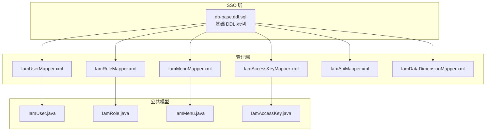
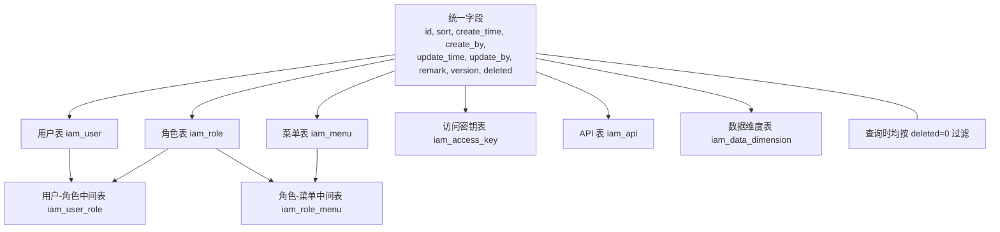
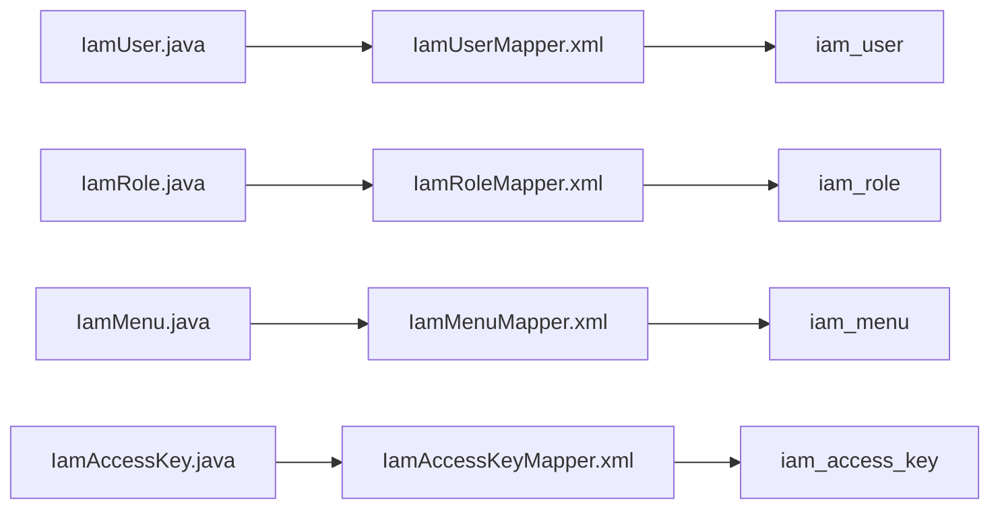

# 表结构定义

<cite>
**本文引用的文件**
- [db-base.ddl.sql](file://iam-sso/src/main/resources/db-script/db-base.ddl.sql)
- [IamUserMapper.xml](file://iam-admin/src/main/resources/mapper/IamUserMapper.xml)
- [IamRoleMapper.xml](file://iam-admin/src/main/resources/mapper/IamRoleMapper.xml)
- [IamMenuMapper.xml](file://iam-admin/src/main/resources/mapper/IamMenuMapper.xml)
- [IamAccessKeyMapper.xml](file://iam-admin/src/main/resources/mapper/IamAccessKeyMapper.xml)
- [IamApiMapper.xml](file://iam-admin/src/main/resources/mapper/IamApiMapper.xml)
- [IamDataDimensionMapper.xml](file://iam-admin/src/main/resources/mapper/IamDataDimensionMapper.xml)
- [IamUser.java](file://iam-common/src/main/java/com/wkclz/iam/common/entity/IamUser.java)
- [IamRole.java](file://iam-common/src/main/java/com/wkclz/iam/common/entity/IamRole.java)
- [IamMenu.java](file://iam-common/src/main/java/com/wkclz/iam/common/entity/IamMenu.java)
- [IamAccessKey.java](file://iam-common/src/main/java/com/wkclz/iam/common/entity/IamAccessKey.java)
</cite>

## 目录
1. [简介](#简介)
2. [项目结构](#项目结构)
3. [核心组件](#核心组件)
4. [架构总览](#架构总览)
5. [详细组件分析](#详细组件分析)
6. [依赖分析](#依赖分析)
7. [性能考虑](#性能考虑)
8. [故障排查指南](#故障排查指南)
9. [结论](#结论)
10. [附录](#附录)

## 简介
本文件面向 SH-IAM 的数据库表结构，基于仓库中的 DDL 示例与 MyBatis XML 映射文件进行系统化梳理，覆盖以下内容：
- 每个表的字段定义、数据类型、长度限制与约束
- 主键设计、索引策略与唯一性约束
- 系统通用字段（创建时间、更新时间、版本号、逻辑删除）的设计与使用规范
- 表注释说明、字段业务含义与取值范围
- 完整的 DDL 建表脚本与版本控制策略建议
- 表结构变更历史与演进路径

说明：当前仓库中仅提供了示例 DDL 与部分实体类与 XML 映射文件，因此本文以现有材料为准进行整理，并在必要处给出“概念性”补充以便读者理解整体设计。

## 项目结构
SH-IAM 的数据库相关实现主要分布在如下模块：
- iam-sso：提供基础 DDL 示例脚本，演示统一字段与索引设计
- iam-admin：提供各业务表的 MyBatis XML 映射文件，体现字段选择与查询条件
- iam-common：提供各业务实体类，标注字段描述与业务含义



图表来源
- [db-base.ddl.sql:1-21](file://iam-sso/src/main/resources/db-script/db-base.ddl.sql#L1-L21)
- [IamUserMapper.xml:1-39](file://iam-admin/src/main/resources/mapper/IamUserMapper.xml#L1-L39)
- [IamRoleMapper.xml:1-37](file://iam-admin/src/main/resources/mapper/IamRoleMapper.xml#L1-L37)
- [IamMenuMapper.xml:1-60](file://iam-admin/src/main/resources/mapper/IamMenuMapper.xml#L1-L60)
- [IamAccessKeyMapper.xml:1-34](file://iam-admin/src/main/resources/mapper/IamAccessKeyMapper.xml#L1-L34)
- [IamApiMapper.xml:1-101](file://iam-admin/src/main/resources/mapper/IamApiMapper.xml#L1-L101)
- [IamDataDimensionMapper.xml:1-32](file://iam-admin/src/main/resources/mapper/IamDataDimensionMapper.xml#L1-L32)
- [IamUser.java:1-108](file://iam-common/src/main/java/com/wkclz/iam/common/entity/IamUser.java#L1-L108)
- [IamRole.java:1-92](file://iam-common/src/main/java/com/wkclz/iam/common/entity/IamRole.java#L1-L92)
- [IamMenu.java:1-132](file://iam-common/src/main/java/com/wkclz/iam/common/entity/IamMenu.java#L1-L132)
- [IamAccessKey.java:1-108](file://iam-common/src/main/java/com/wkclz/iam/common/entity/IamAccessKey.java#L1-L108)

章节来源
- [db-base.ddl.sql:1-21](file://iam-sso/src/main/resources/db-script/db-base.ddl.sql#L1-L21)
- [IamUserMapper.xml:1-39](file://iam-admin/src/main/resources/mapper/IamUserMapper.xml#L1-L39)
- [IamRoleMapper.xml:1-37](file://iam-admin/src/main/resources/mapper/IamRoleMapper.xml#L1-L37)
- [IamMenuMapper.xml:1-60](file://iam-admin/src/main/resources/mapper/IamMenuMapper.xml#L1-L60)
- [IamAccessKeyMapper.xml:1-34](file://iam-admin/src/main/resources/mapper/IamAccessKeyMapper.xml#L1-L34)
- [IamApiMapper.xml:1-101](file://iam-admin/src/main/resources/mapper/IamApiMapper.xml#L1-L101)
- [IamDataDimensionMapper.xml:1-32](file://iam-admin/src/main/resources/mapper/IamDataDimensionMapper.xml#L1-L32)
- [IamUser.java:1-108](file://iam-common/src/main/java/com/wkclz/iam/common/entity/IamUser.java#L1-L108)
- [IamRole.java:1-92](file://iam-common/src/main/java/com/wkclz/iam/common/entity/IamRole.java#L1-L92)
- [IamMenu.java:1-132](file://iam-common/src/main/java/com/wkclz/iam/common/entity/IamMenu.java#L1-L132)
- [IamAccessKey.java:1-108](file://iam-common/src/main/java/com/wkclz/iam/common/entity/IamAccessKey.java#L1-L108)

## 核心组件
本节从“统一字段设计”“表间关系”“查询字段集合”三个维度总结核心要点。

- 统一字段设计（来自示例 DDL）
  - 主键：自增 bigint unsigned
  - 排序：int
  - 创建时间：datetime，默认 CURRENT_TIMESTAMP
  - 创建人：varchar(31)，默认 'nobody'
  - 更新时间：datetime，默认 CURRENT_TIMESTAMP ON UPDATE CURRENT_TIMESTAMP
  - 更新人：varchar(31)，默认 'nobody'
  - 备注：varchar(255)
  - 版本号：int，默认 0
  - 逻辑删除：bigint unsigned，默认 0
  - 索引：示例中包含对 biz_column 的普通索引

- 表间关系（来自 XML 查询）
  - 用户-角色-菜单：通过中间表关联（iam_user_role → iam_role_menu → iam_menu）
  - 角色树形结构：iam_role 自连接（parent_code）

- 查询字段集合（来自 XML 映射）
  - 用户表：用户编码、用户名、昵称、邮箱、手机、头像、状态等；统一包含系统字段
  - 角色表：租户编码、应用编码、父角色、角色编码、角色名称等；统一包含系统字段
  - 菜单表：应用编码、父编码、资源编码、名称、图标、类型、路由、组件、按钮码、隐藏等；统一包含系统字段
  - 访问密钥表：应用编码、应用ID、AK、SK、生效状态、生效起止时间等；统一包含系统字段
  - API 表：模块、应用编码、方法、URI、名称、写标记等；统一包含系统字段
  - 数据维度表：应用编码、维度编码、维度名称等；统一包含系统字段

章节来源
- [db-base.ddl.sql:1-21](file://iam-sso/src/main/resources/db-script/db-base.ddl.sql#L1-L21)
- [IamUserMapper.xml:6-34](file://iam-admin/src/main/resources/mapper/IamUserMapper.xml#L6-L34)
- [IamRoleMapper.xml:5-33](file://iam-admin/src/main/resources/mapper/IamRoleMapper.xml#L5-L33)
- [IamMenuMapper.xml:5-56](file://iam-admin/src/main/resources/mapper/IamMenuMapper.xml#L5-L56)
- [IamAccessKeyMapper.xml:5-31](file://iam-admin/src/main/resources/mapper/IamAccessKeyMapper.xml#L5-L31)
- [IamApiMapper.xml:5-96](file://iam-admin/src/main/resources/mapper/IamApiMapper.xml#L5-L96)
- [IamDataDimensionMapper.xml:5-28](file://iam-admin/src/main/resources/mapper/IamDataDimensionMapper.xml#L5-L28)

## 架构总览
下图展示“统一字段 + 业务表 + 关系查询”的整体设计思路：



图表来源
- [db-base.ddl.sql:1-21](file://iam-sso/src/main/resources/db-script/db-base.ddl.sql#L1-L21)
- [IamMenuMapper.xml:40-56](file://iam-admin/src/main/resources/mapper/IamMenuMapper.xml#L40-L56)
- [IamRoleMapper.xml:21-33](file://iam-admin/src/main/resources/mapper/IamRoleMapper.xml#L21-L33)

## 详细组件分析

### 用户表 iam_user
- 字段与类型（结合实体类与查询映射）
  - 用户编码：字符串，非空
  - 用户名：字符串，非空
  - 昵称：字符串，非空
  - 邮箱：字符串
  - 手机号：字符串
  - 头像：字符串
  - 状态：整数，非空（取值：1 启用，2 禁用，3 锁定）
  - 统一字段：排序、创建时间、创建人、更新时间、更新人、备注、版本号、逻辑删除
- 约束与索引
  - 主键：id
  - 逻辑删除：deleted=0
  - 建议索引：用户编码、用户名、昵称、邮箱、手机（用于检索）
- 业务含义与取值范围
  - 状态字段明确业务状态枚举
- DDL 建表脚本
  - 参考统一字段模板，结合实体类字段生成完整 DDL

章节来源
- [IamUser.java:21-61](file://iam-common/src/main/java/com/wkclz/iam/common/entity/IamUser.java#L21-L61)
- [IamUserMapper.xml:6-34](file://iam-admin/src/main/resources/mapper/IamUserMapper.xml#L6-L34)

### 角色表 iam_role
- 字段与类型
  - 租户编码：字符串
  - 应用编码：字符串
  - 父角色：字符串
  - 角色编码：字符串
  - 角色名称：字符串
  - 统一字段：排序、创建时间、创建人、更新时间、更新人、备注、版本号、逻辑删除
- 约束与索引
  - 主键：id
  - 逻辑删除：deleted=0
  - 建议索引：应用编码、角色编码（用于树形查询与快速定位）
- 业务含义与取值范围
  - 支持父子层级（parent_code），可形成角色树
- DDL 建表脚本
  - 参考统一字段模板，结合实体类字段生成完整 DDL

章节来源
- [IamRole.java:21-49](file://iam-common/src/main/java/com/wkclz/iam/common/entity/IamRole.java#L21-L49)
- [IamRoleMapper.xml:5-33](file://iam-admin/src/main/resources/mapper/IamRoleMapper.xml#L5-L33)

### 菜单表 iam_menu
- 字段与类型
  - 应用编码：字符串
  - 父编码：字符串（顶级为 0）
  - 资源编码：字符串
  - 名称：字符串
  - 图标：字符串
  - 类型：字符串（菜单/按钮）
  - 路由地址：字符串
  - 组件：字符串
  - 权限标识符：字符串
  - 隐藏：整数
  - 统一字段：排序、创建时间、创建人、更新时间、更新人、备注、版本号、逻辑删除
- 约引与索引
  - 主键：id
  - 逻辑删除：deleted=0
  - 建议索引：应用编码、父编码、资源编码（用于树形与权限查询）
- 业务含义与取值范围
  - 类型区分菜单与按钮；隐藏用于前端渲染控制
- DDL 建表脚本
  - 参考统一字段模板，结合实体类字段生成完整 DDL

章节来源
- [IamMenu.java:21-79](file://iam-common/src/main/java/com/wkclz/iam/common/entity/IamMenu.java#L21-L79)
- [IamMenuMapper.xml:5-56](file://iam-admin/src/main/resources/mapper/IamMenuMapper.xml#L5-L56)

### 访问密钥表 iam_access_key
- 字段与类型
  - 所属应用：字符串，非空
  - 应用ID：字符串，非空
  - AK：字符串，非空
  - SK：字符串，非空
  - 生效状态：整数，非空
  - 生效时间开始：日期时间，非空
  - 生效时间结束：日期时间，非空
  - 统一字段：排序、创建时间、创建人、更新时间、更新人、备注、版本号、逻辑删除
- 约束与索引
  - 主键：id
  - 逻辑删除：deleted=0
  - 建议索引：应用编码、应用ID、AK（用于鉴权与查询）
- 业务含义与取值范围
  - AK/SK 用于外部系统接入；生效状态与时间窗口用于生命周期管理
- DDL 建表脚本
  - 参考统一字段模板，结合实体类字段生成完整 DDL

章节来源
- [IamAccessKey.java:21-61](file://iam-common/src/main/java/com/wkclz/iam/common/entity/IamAccessKey.java#L21-L61)
- [IamAccessKeyMapper.xml:5-31](file://iam-admin/src/main/resources/mapper/IamAccessKeyMapper.xml#L5-L31)

### API 表 iam_api
- 字段与类型
  - 模块：字符串
  - 应用编码：字符串
  - 方法：字符串
  - URI：字符串
  - 名称：字符串
  - 写标记：整数（用于区分读写）
  - 统一字段：排序、创建时间、创建人、更新时间、更新人、备注、版本号、逻辑删除
- 约束与索引
  - 主键：id
  - 逻辑删除：deleted=0
  - 建议索引：应用编码、URI、方法（用于权限匹配与审计）
- 业务含义与取值范围
  - 写标记用于区分接口是否具备写操作能力
- DDL 建表脚本
  - 参考统一字段模板，结合实体类字段生成完整 DDL

章节来源
- [IamApiMapper.xml:5-96](file://iam-admin/src/main/resources/mapper/IamApiMapper.xml#L5-L96)

### 数据维度表 iam_data_dimension
- 字段与类型
  - 应用编码：字符串
  - 维度编码：字符串
  - 维度名称：字符串
  - 统一字段：排序、创建时间、创建人、更新时间、更新人、备注、版本号、逻辑删除
- 约束与索引
  - 主键：id
  - 逻辑删除：deleted=0
  - 建议索引：应用编码、维度编码（用于筛选与去重）
- 业务含义与取值范围
  - 用于多维数据隔离与权限控制
- DDL 建表脚本
  - 参考统一字段模板，结合实体类字段生成完整 DDL

章节来源
- [IamDataDimensionMapper.xml:5-28](file://iam-admin/src/main/resources/mapper/IamDataDimensionMapper.xml#L5-L28)

### 中间表与关系表
- 用户-角色中间表 iam_user_role
  - 字段：用户编码、角色编码、应用编码、统一字段
  - 约束：逻辑删除 deleted=0
  - 建议索引：用户编码、角色编码、应用编码
- 角色-菜单中间表 iam_role_menu
  - 字段：角色编码、菜单编码、应用编码、统一字段
  - 约束：逻辑删除 deleted=0
  - 建议索引：角色编码、菜单编码、应用编码

章节来源
- [IamMenuMapper.xml:40-56](file://iam-admin/src/main/resources/mapper/IamMenuMapper.xml#L40-L56)
- [IamRoleMapper.xml:21-33](file://iam-admin/src/main/resources/mapper/IamRoleMapper.xml#L21-L33)

## 依赖分析
- 实体类与表结构的映射关系
  - 实体类字段与 XML 映射的查询字段基本一致，体现“统一字段 + 业务字段”的设计
- 查询依赖
  - 菜单查询依赖用户-角色-菜单三层关系
  - 角色查询支持树形聚合（children_count）
- 逻辑删除依赖
  - 所有查询均以 deleted=0 作为过滤条件，确保软删除一致性



图表来源
- [IamUser.java:1-108](file://iam-common/src/main/java/com/wkclz/iam/common/entity/IamUser.java#L1-L108)
- [IamRole.java:1-92](file://iam-common/src/main/java/com/wkclz/iam/common/entity/IamRole.java#L1-L92)
- [IamMenu.java:1-132](file://iam-common/src/main/java/com/wkclz/iam/common/entity/IamMenu.java#L1-L132)
- [IamAccessKey.java:1-108](file://iam-common/src/main/java/com/wkclz/iam/common/entity/IamAccessKey.java#L1-L108)
- [IamUserMapper.xml:6-34](file://iam-admin/src/main/resources/mapper/IamUserMapper.xml#L6-L34)
- [IamRoleMapper.xml:5-33](file://iam-admin/src/main/resources/mapper/IamRoleMapper.xml#L5-L33)
- [IamMenuMapper.xml:5-56](file://iam-admin/src/main/resources/mapper/IamMenuMapper.xml#L5-L56)
- [IamAccessKeyMapper.xml:5-31](file://iam-admin/src/main/resources/mapper/IamAccessKeyMapper.xml#L5-L31)

## 性能考虑
- 索引策略
  - 对高频查询字段建立普通索引（如用户编码、角色编码、菜单编码、应用编码、AK）
  - 联合索引优先考虑最左前缀原则（如应用编码+编码组合）
- 逻辑删除
  - 统一使用 deleted 字段进行软删除，避免物理删除带来的数据不可恢复风险
- 查询优化
  - 使用 LIMIT 控制结果集大小
  - 避免 SELECT *，仅选择必要字段
- 分页与排序
  - 排序字段建议建立索引，避免大表排序导致的性能问题

## 故障排查指南
- 常见问题
  - 查询不到数据：确认 deleted=0 条件是否正确传递
  - 索引失效：检查查询条件是否命中索引最左前缀
  - 重复数据：核对唯一性约束（如应用编码+资源编码）是否满足
- 排查步骤
  - 核对实体类字段与 XML 映射字段一致性
  - 检查统一字段是否正确填充（创建人、更新人、版本号）
  - 验证中间表关联字段（用户编码、角色编码、菜单编码）是否一致

## 结论
本文件基于仓库现有 DDL 示例与 XML 映射，系统梳理了 SH-IAM 的表结构设计与使用规范。建议后续完善：
- 补充各表的完整 DDL 脚本
- 明确唯一性约束与外键关系
- 建立表结构变更的版本控制流程（如基于迁移脚本的演进）

## 附录

### 统一字段设计规范
- 主键：id（bigint unsigned, AUTO_INCREMENT）
- 排序：sort（int）
- 时间：create_time、update_time（datetime）
- 人员：create_by、update_by（varchar(31)）
- 备注：remark（varchar(255)）
- 版本：version（int, 默认 0）
- 逻辑删除：deleted（bigint unsigned, 默认 0）

章节来源
- [db-base.ddl.sql:1-21](file://iam-sso/src/main/resources/db-script/db-base.ddl.sql#L1-L21)

### 建表脚本模板（示例）
以下为“统一字段 + 业务字段 + 索引 + 注释”的建表模板示意，请根据具体表替换表名与字段定义后使用。

```sql
CREATE TABLE `iam_业务表` (
  -- 主键字段
  `id` bigint unsigned NOT NULL AUTO_INCREMENT COMMENT 'ID',
  -- 业务字段
  `biz_field` varchar(255) NOT NULL DEFAULT '' COMMENT '业务字段说明',
  -- 系统字段
  `sort` int NOT NULL DEFAULT '0' COMMENT '排序',
  `create_time` datetime NOT NULL DEFAULT CURRENT_TIMESTAMP COMMENT '创建时间',
  `create_by` varchar(31) NOT NULL DEFAULT 'nobody' COMMENT '创建人',
  `update_time` datetime NOT NULL DEFAULT CURRENT_TIMESTAMP ON UPDATE CURRENT_TIMESTAMP COMMENT '更新时间',
  `update_by` varchar(31) NOT NULL DEFAULT 'nobody' COMMENT '更新人',
  `remark` varchar(255) NOT NULL DEFAULT '' COMMENT '备注',
  `version` int NOT NULL DEFAULT '0' COMMENT '版本号',
  `deleted` bigint unsigned NOT NULL DEFAULT '0' COMMENT '逻辑删除',
  PRIMARY KEY (`id`) USING BTREE,
  KEY `idx_biz_field` (`biz_field`) USING BTREE
) ENGINE=InnoDB COMMENT='表说明';
```

图表来源
- [db-base.ddl.sql:1-21](file://iam-sso/src/main/resources/db-script/db-base.ddl.sql#L1-L21)

### 表结构变更历史与版本控制策略
- 建议采用“迁移脚本 + 版本号”的方式管理表结构变更
  - 新增字段：新增迁移脚本，记录字段名、类型、默认值、注释
  - 删除字段：保留迁移脚本，记录删除动作与影响评估
  - 修改字段：保留迁移脚本，记录旧定义与新定义对比
- 变更审批与回滚
  - 变更需经评审并记录在案
  - 提供回滚脚本，确保生产环境安全
- 文档同步
  - 变更后同步更新本表结构定义文档与实体类注释