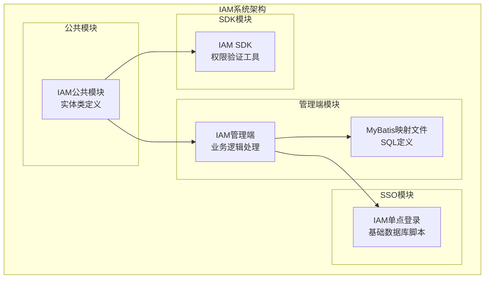
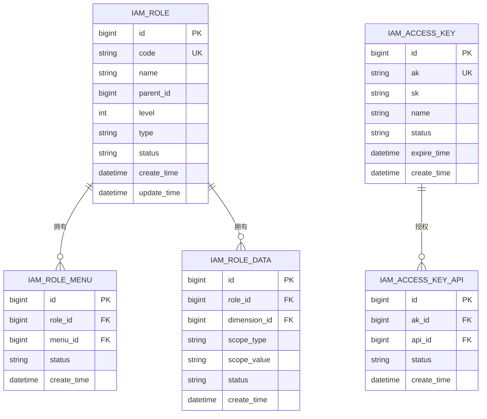
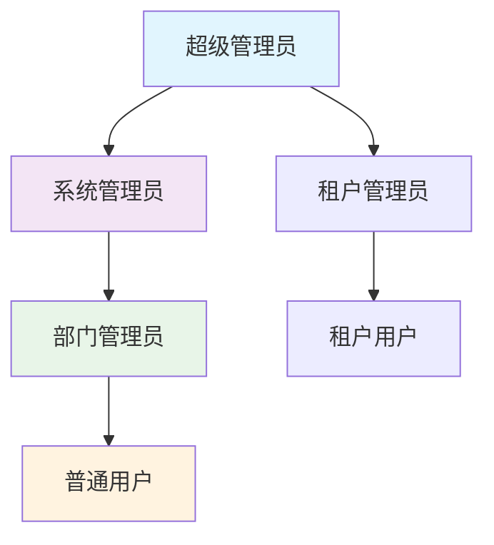
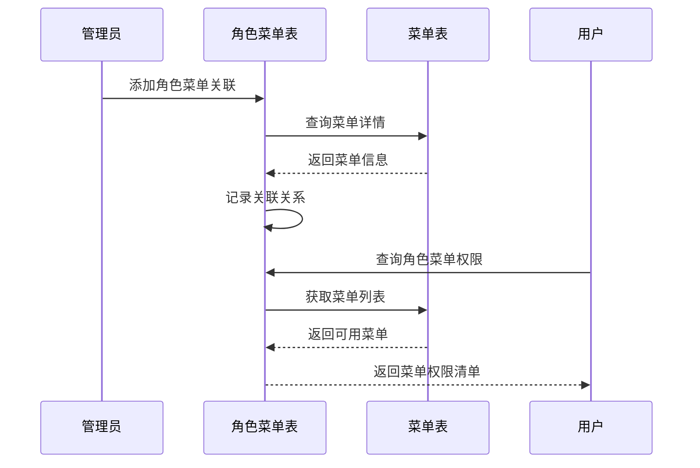
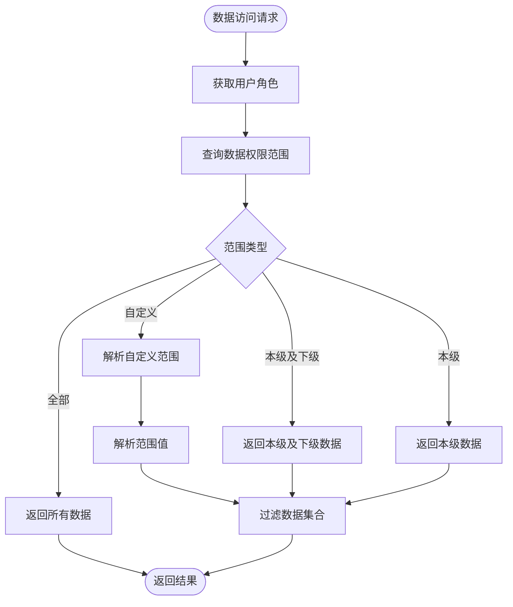
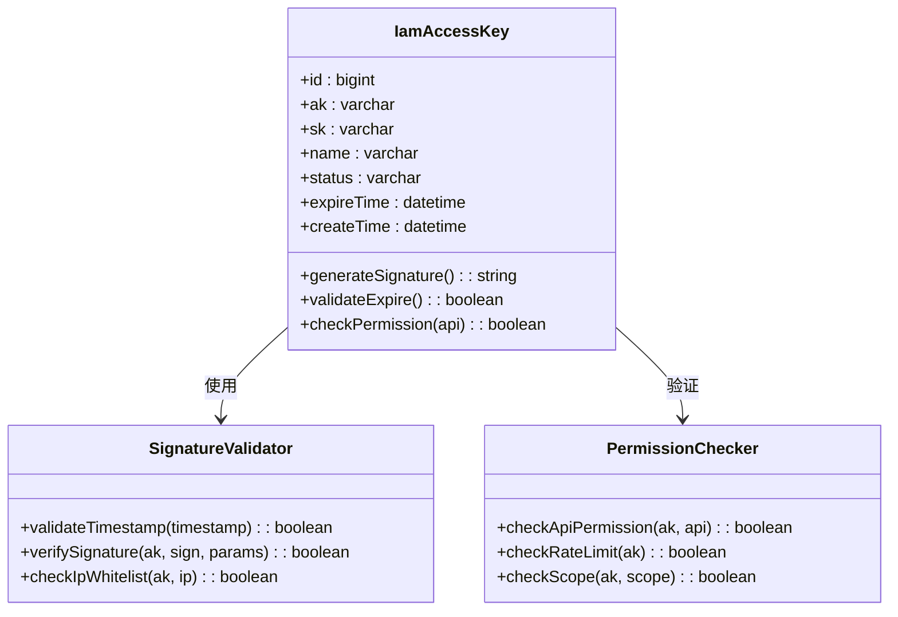
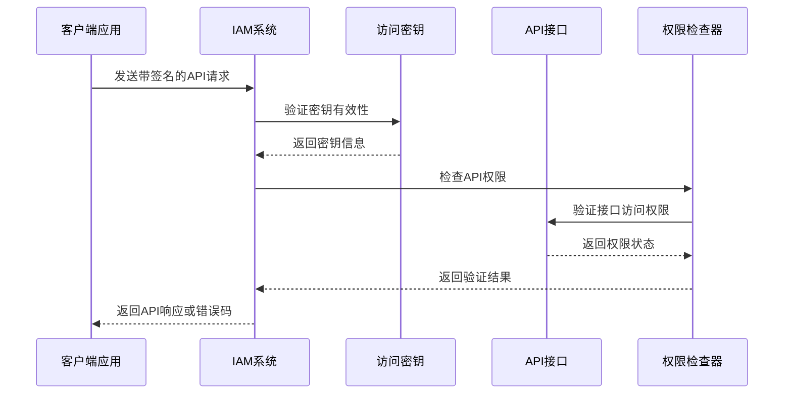
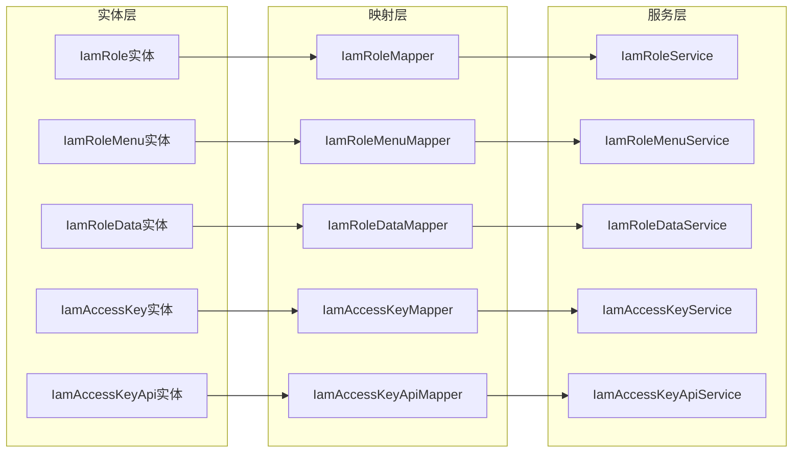

# 角色权限表

<cite>
**本文档引用的文件**
- [IamRole.java](file://iam-common/src/main/java/com/wkclz/iam/common/entity/IamRole.java)
- [IamRoleMapper.java](file://iam-admin/src/main/java/com/wkclz/iam/admin/mapper/IamRoleMapper.java)
- [IamRoleMapper.xml](file://iam-admin/src/main/resources/mapper/IamRoleMapper.xml)
- [IamRoleMenu.java](file://iam-common/src/main/java/com/wkclz/iam/common/entity/IamRoleMenu.java)
- [IamRoleMenuMapper.java](file://iam-admin/src/main/java/com/wkclz/iam/admin/mapper/IamRoleMenuMapper.java)
- [IamRoleMenuMapper.xml](file://iam-admin/src/main/resources/mapper/IamRoleMenuMapper.xml)
- [IamRoleData.java](file://iam-common/src/main/java/com/wkclz/iam/common/entity/IamRoleData.java)
- [IamRoleDataMapper.java](file://iam-admin/src/main/java/com/wkclz/iam/admin/mapper/IamRoleDataMapper.java)
- [IamRoleDataMapper.xml](file://iam-admin/src/main/resources/mapper/IamRoleDataMapper.xml)
- [IamAccessKey.java](file://iam-common/src/main/java/com/wkclz/iam/common/entity/IamAccessKey.java)
- [IamAccessKeyMapper.java](file://iam-admin/src/main/java/com/wkclz/iam/admin/mapper/IamAccessKeyMapper.java)
- [IamAccessKeyMapper.xml](file://iam-admin/src/main/resources/mapper/IamAccessKeyMapper.xml)
- [IamAccessKeyApi.java](file://iam-common/src/main/java/com/wkclz/iam/common/entity/IamAccessKeyApi.java)
- [IamAccessKeyApiMapper.java](file://iam-admin/src/main/java/com/wkclz/iam/admin/mapper/IamAccessKeyApiMapper.java)
- [IamAccessKeyApiMapper.xml](file://iam-admin/src/main/resources/mapper/IamAccessKeyApiMapper.xml)
- [db-base.ddl.sql](file://iam-sso/src/main/resources/db-script/db-base.ddl.sql)
</cite>

## 目录
1. [简介](#简介)
2. [项目结构](#项目结构)
3. [核心组件](#核心组件)
4. [架构概览](#架构概览)
5. [详细组件分析](#详细组件分析)
6. [依赖关系分析](#依赖关系分析)
7. [性能考虑](#性能考虑)
8. [故障排除指南](#故障排除指南)
9. [结论](#结论)

## 简介

本文档为IAM系统角色权限管理相关的数据库表提供了详细的表结构定义文档。涵盖了角色表、角色菜单关联表、角色数据维度表、访问密钥表以及访问密钥API关联表等核心权限控制表的完整结构定义。

IAM系统采用基于角色的访问控制（RBAC）模型，通过多层权限设计实现细粒度的权限控制。系统支持角色继承、菜单权限绑定、数据权限控制和API权限管理等功能。

## 项目结构

IAM权限管理系统主要由以下模块组成：

**图表来源**
- [IamRole.java](file://iam-common/src/main/java/com/wkclz/iam/common/entity/IamRole.java)
- [IamRoleMapper.java](file://iam-admin/src/main/java/com/wkclz/iam/admin/mapper/IamRoleMapper.java)
- [db-base.ddl.sql](file://iam-sso/src/main/resources/db-script/db-base.ddl.sql)

**章节来源**
- [IamRole.java](file://iam-common/src/main/java/com/wkclz/iam/common/entity/IamRole.java)
- [IamAccessKey.java](file://iam-common/src/main/java/com/wkclz/iam/common/entity/IamAccessKey.java)

## 核心组件

### 角色权限表结构

系统的核心权限表包括以下五个主要表：

1. **IamRole角色表** - 存储角色基本信息和层级关系
2. **IamRoleMenu角色菜单关联表** - 绑定角色与菜单权限
3. **IamRoleData角色数据维度表** - 控制数据访问范围
4. **IamAccessKey访问密钥表** - 系统外部访问凭证
5. **IamAccessKeyApi访问密钥API关联表** - 密钥与API权限绑定

每个表都采用统一的设计规范，确保权限管理的一致性和可维护性。

**章节来源**
- [IamRole.java](file://iam-common/src/main/java/com/wkclz/iam/common/entity/IamRole.java)
- [IamRoleMenu.java](file://iam-common/src/main/java/com/wkclz/iam/common/entity/IamRoleMenu.java)
- [IamRoleData.java](file://iam-common/src/main/java/com/wkclz/iam/common/entity/IamRoleData.java)
- [IamAccessKey.java](file://iam-common/src/main/java/com/wkclz/iam/common/entity/IamAccessKey.java)
- [IamAccessKeyApi.java](file://iam-common/src/main/java/com/wkclz/iam/common/entity/IamAccessKeyApi.java)

## 架构概览

**图表来源**
- [IamRole.java](file://iam-common/src/main/java/com/wkclz/iam/common/entity/IamRole.java)
- [IamRoleMenu.java](file://iam-common/src/main/java/com/wkclz/iam/common/entity/IamRoleMenu.java)
- [IamRoleData.java](file://iam-common/src/main/java/com/wkclz/iam/common/entity/IamRoleData.java)
- [IamAccessKey.java](file://iam-common/src/main/java/com/wkclz/iam/common/entity/IamAccessKey.java)
- [IamAccessKeyApi.java](file://iam-common/src/main/java/com/wkclz/iam/common/entity/IamAccessKeyApi.java)

## 详细组件分析

### IamRole角色表

IamRole表是权限系统的核心基础表，用于存储角色信息和角色层级关系。

#### 表结构定义

| 字段名 | 数据类型 | 约束条件 | 描述 |
|--------|----------|----------|------|
| id | bigint | 主键 | 角色唯一标识 |
| code | varchar | 唯一索引 | 角色编码，全局唯一 |
| name | varchar | 非空 | 角色名称 |
| parent_id | bigint | 外键 | 父角色ID，支持层级结构 |
| level | int | 非空 | 角色层级深度 |
| type | varchar | 非空 | 角色类型：系统内置/自定义 |
| status | varchar | 非空 | 角色状态：启用/禁用 |
| create_time | datetime | 非空 | 创建时间 |
| update_time | datetime | 非空 | 更新时间 |

#### 角色层级设计

系统支持多层级的角色继承机制：

**图表来源**
- [IamRole.java](file://iam-common/src/main/java/com/wkclz/iam/common/entity/IamRole.java)

#### 关键业务逻辑

1. **层级计算**：通过parent_id和level字段维护角色层级关系
2. **权限继承**：子角色自动继承父角色的所有权限
3. **状态管理**：支持角色的启用和禁用操作
4. **唯一约束**：code字段保证角色编码的全局唯一性

**章节来源**
- [IamRole.java](file://iam-common/src/main/java/com/wkclz/iam/common/entity/IamRole.java)
- [IamRoleMapper.java](file://iam-admin/src/main/java/com/wkclz/iam/admin/mapper/IamRoleMapper.java)

### IamRoleMenu角色菜单关联表

IamRoleMenu表实现了角色与菜单权限的多对多关联关系。

#### 表结构定义

| 字段名 | 数据类型 | 约束条件 | 描述 |
|--------|----------|----------|------|
| id | bigint | 主键 | 关联记录唯一标识 |
| role_id | bigint | 外键 | 角色ID |
| menu_id | bigint | 外键 | 菜单ID |
| status | varchar | 非空 | 关联状态：启用/禁用 |
| create_time | datetime | 非空 | 创建时间 |

#### 菜单权限绑定流程

**图表来源**
- [IamRoleMenu.java](file://iam-common/src/main/java/com/wkclz/iam/common/entity/IamRoleMenu.java)
- [IamRoleMenuMapper.java](file://iam-admin/src/main/java/com/wkclz/iam/admin/mapper/IamRoleMenuMapper.java)

#### 权限验证机制

系统通过递归查询实现菜单权限的完整验证：

1. **直接权限**：角色直接拥有的菜单权限
2. **间接权限**：通过角色继承链获得的权限
3. **动态权限**：结合用户上下文的数据权限过滤

**章节来源**
- [IamRoleMenu.java](file://iam-common/src/main/java/com/wkclz/iam/common/entity/IamRoleMenu.java)
- [IamRoleMenuMapper.xml](file://iam-admin/src/main/resources/mapper/IamRoleMenuMapper.xml)

### IamRoleData角色数据维度表

IamRoleData表用于控制角色对数据的访问范围，实现精细化的数据权限管理。

#### 表结构定义

| 字段名 | 数据类型 | 约束条件 | 描述 |
|--------|----------|----------|------|
| id | bigint | 主键 | 数据维度唯一标识 |
| role_id | bigint | 外键 | 角色ID |
| dimension_id | bigint | 外键 | 数据维度ID |
| scope_type | varchar | 非空 | 数据范围类型：全部/本级/本级及下级/自定义 |
| scope_value | varchar | 可空 | 自定义范围值 |
| status | varchar | 非空 | 状态：启用/禁用 |
| create_time | datetime | 非空 | 创建时间 |

#### 数据权限控制策略

**图表来源**
- [IamRoleData.java](file://iam-common/src/main/java/com/wkclz/iam/common/entity/IamRoleData.java)
- [IamRoleDataMapper.java](file://iam-admin/src/main/java/com/wkclz/iam/admin/mapper/IamRoleDataMapper.java)

#### 数据维度类型

系统支持多种数据维度控制：

1. **组织架构维度**：按部门、岗位等组织结构控制数据访问
2. **业务维度**：按业务线、项目等业务场景控制数据访问
3. **地理维度**：按地区、城市等地理信息控制数据访问
4. **时间维度**：按时间段控制数据访问权限

**章节来源**
- [IamRoleData.java](file://iam-common/src/main/java/com/wkclz/iam/common/entity/IamRoleData.java)
- [IamRoleDataMapper.xml](file://iam-admin/src/main/resources/mapper/IamRoleDataMapper.xml)

### IamAccessKey访问密钥表

IamAccessKey表用于管理系统外部访问的API密钥，实现安全的第三方集成。

#### 表结构定义

| 字段名 | 数据类型 | 约束条件 | 描述 |
|--------|----------|----------|------|
| id | bigint | 主键 | 密钥唯一标识 |
| ak | varchar | 唯一索引 | 访问密钥AK |
| sk | varchar | 非空 | 安全密钥SK |
| name | varchar | 非空 | 密钥名称 |
| status | varchar | 非空 | 状态：启用/禁用 |
| expire_time | datetime | 可空 | 过期时间 |
| create_time | datetime | 非空 | 创建时间 |

#### 密钥安全机制

**图表来源**
- [IamAccessKey.java](file://iam-common/src/main/java/com/wkclz/iam/common/entity/IamAccessKey.java)

#### 密钥生命周期管理

1. **创建阶段**：生成AK/SK对，设置初始状态
2. **激活阶段**：配置API权限和访问范围
3. **使用阶段**：进行签名验证和权限检查
4. **过期阶段**：自动失效并通知
5. **删除阶段**：彻底移除密钥信息

**章节来源**
- [IamAccessKey.java](file://iam-common/src/main/java/com/wkclz/iam/common/entity/IamAccessKey.java)
- [IamAccessKeyMapper.xml](file://iam-admin/src/main/resources/mapper/IamAccessKeyMapper.xml)

### IamAccessKeyApi访问密钥API关联表

IamAccessKeyApi表建立了访问密钥与API接口的权限绑定关系。

#### 表结构定义

| 字段名 | 数据类型 | 约定条件 | 描述 |
|--------|----------|----------|------|
| id | bigint | 主键 | 关联记录唯一标识 |
| ak_id | bigint | 外键 | 访问密钥ID |
| api_id | bigint | 外键 | API接口ID |
| status | varchar | 非空 | 关联状态：启用/禁用 |
| create_time | datetime | 非空 | 创建时间 |

#### API权限管理流程

**图表来源**
- [IamAccessKeyApi.java](file://iam-common/src/main/java/com/wkclz/iam/common/entity/IamAccessKeyApi.java)
- [IamAccessKeyApiMapper.java](file://iam-admin/src/main/java/com/wkclz/iam/admin/mapper/IamAccessKeyApiMapper.java)

#### 权限验证层次

系统采用多层权限验证确保API调用的安全性：

1. **身份验证**：验证AK/SK的有效性
2. **签名验证**：确认请求的完整性和真实性
3. **权限检查**：验证API访问权限
4. **速率限制**：防止API滥用
5. **IP白名单**：限制访问来源

**章节来源**
- [IamAccessKeyApi.java](file://iam-common/src/main/java/com/wkclz/iam/common/entity/IamAccessKeyApi.java)
- [IamAccessKeyApiMapper.xml](file://iam-admin/src/main/resources/mapper/IamAccessKeyApiMapper.xml)

## 依赖关系分析

**图表来源**
- [IamRole.java](file://iam-common/src/main/java/com/wkclz/iam/common/entity/IamRole.java)
- [IamRoleMenu.java](file://iam-common/src/main/java/com/wkclz/iam/common/entity/IamRoleMenu.java)
- [IamRoleData.java](file://iam-common/src/main/java/com/wkclz/iam/common/entity/IamRoleData.java)
- [IamAccessKey.java](file://iam-common/src/main/java/com/wkclz/iam/common/entity/IamAccessKey.java)
- [IamAccessKeyApi.java](file://iam-common/src/main/java/com/wkclz/iam/common/entity/IamAccessKeyApi.java)

**章节来源**
- [IamRoleService.java](file://iam-admin/src/main/java/com/wkclz/iam/admin/service/IamRoleService.java)
- [IamRoleMenuService.java](file://iam-admin/src/main/java/com/wkclz/iam/admin/service/IamRoleMenuService.java)
- [IamRoleDataService.java](file://iam-admin/src/main/java/com/wkclz/iam/admin/service/IamRoleDataService.java)
- [IamAccessKeyService.java](file://iam-admin/src/main/java/com/wkclz/iam/admin/service/IamAccessKeyService.java)
- [IamAccessKeyApiService.java](file://iam-admin/src/main/java/com/wkclz/iam/admin/service/IamAccessKeyApiService.java)

## 性能考虑

### 索引优化策略

1. **主键索引**：所有表的主键字段自动建立索引
2. **唯一索引**：code、ak字段建立唯一索引确保数据唯一性
3. **外键索引**：所有外键字段建立索引提高关联查询性能
4. **组合索引**：常用查询条件组合建立复合索引

### 查询优化建议

1. **分页查询**：大量数据查询时使用分页机制
2. **批量操作**：支持批量插入和更新操作
3. **缓存策略**：热点数据建立缓存机制
4. **异步处理**：耗时操作采用异步处理方式

### 数据一致性保证

1. **事务控制**：关键操作使用数据库事务保证原子性
2. **并发控制**：使用乐观锁或悲观锁防止并发冲突
3. **数据校验**：在数据库层面设置约束保证数据完整性

## 故障排除指南

### 常见问题及解决方案

#### 角色权限继承问题
- **问题现象**：子角色无法继承父角色权限
- **排查步骤**：检查parent_id和level字段是否正确设置
- **解决方案**：重新计算角色层级关系并更新相关记录

#### 菜单权限显示异常
- **问题现象**：用户登录后菜单权限不正确
- **排查步骤**：验证IamRoleMenu表中关联关系是否完整
- **解决方案**：重新同步角色菜单权限数据

#### 数据权限过滤错误
- **问题现象**：用户访问到不应访问的数据
- **排查步骤**：检查IamRoleData表中的scope_type和scope_value配置
- **解决方案**：根据实际业务需求调整数据权限范围

#### API密钥访问失败
- **问题现象**：第三方应用无法通过API密钥访问系统
- **排查步骤**：验证IamAccessKey和IamAccessKeyApi表的状态
- **解决方案**：检查密钥有效期和API权限配置

**章节来源**
- [db-base.ddl.sql](file://iam-sso/src/main/resources/db-script/db-base.ddl.sql)

## 结论

IAM系统的角色权限管理通过精心设计的数据库表结构实现了完善的权限控制体系。五个核心表相互配合，形成了从角色管理、菜单权限、数据维度到API访问的全方位权限控制机制。

系统的主要优势包括：

1. **层次化设计**：支持多层级角色继承，简化权限管理复杂度
2. **灵活的数据权限**：通过数据维度实现精细化的数据访问控制
3. **安全的API管理**：完善的密钥管理和签名验证机制
4. **可扩展性**：模块化的表结构设计便于功能扩展和维护

通过合理使用这些权限表，可以构建安全可靠的企业级权限管理系统，满足不同规模和复杂度的业务需求。