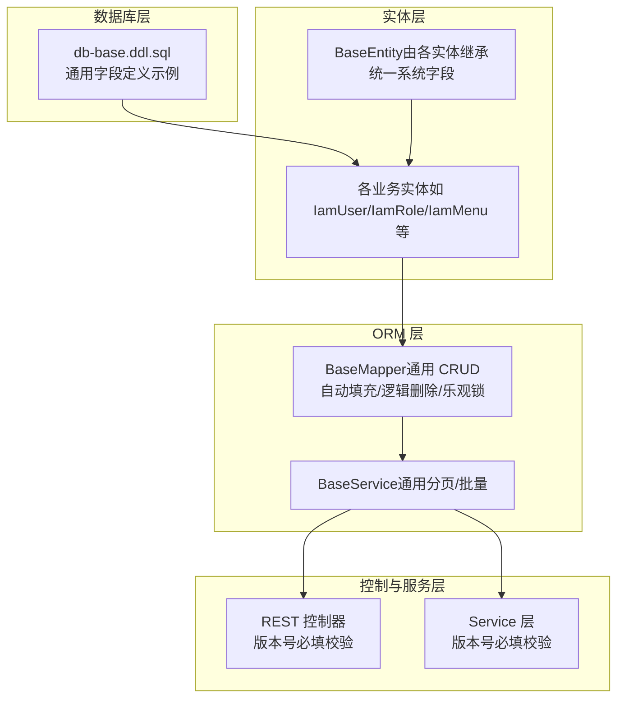
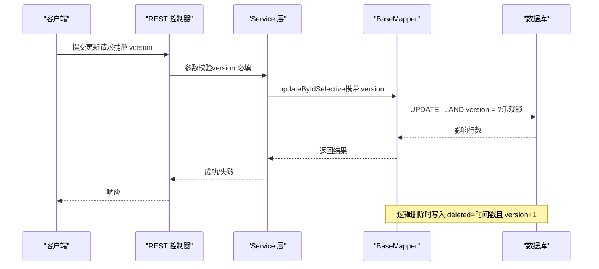
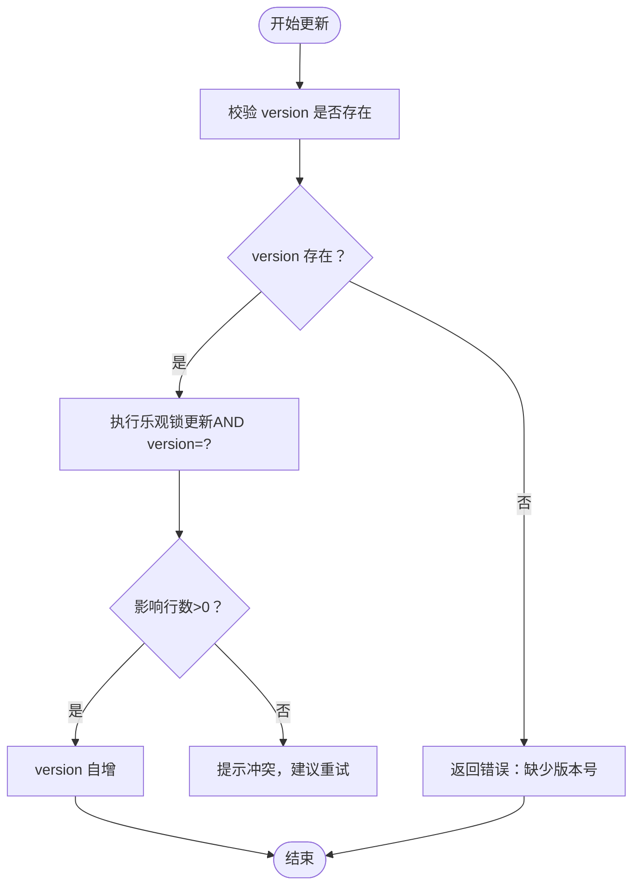
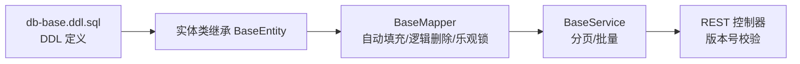

# 通用字段规范

<cite>
**本文引用的文件**
- [db-base.ddl.sql](file://iam-sso/src/main/resources/db-script/db-base.ddl.sql)
- [STORY-001-iam-entity-dto-system.md](file://docs/stories/STORY-001-iam-entity-dto-system.md)
- [SKILL.md（sh-mybatis）](file://docs/stories/SKILL.md)
- [IamUserAuthPassword.java](file://iam-common/src/main/java/com/wkclz/iam/common/entity/IamUserAuthPassword.java)
- [IamMenu.java](file://iam-common/src/main/java/com/wkclz/iam/common/entity/IamMenu.java)
- [IamRequestLog.java](file://iam-common/src/main/java/com/wkclz/iam/common/entity/IamRequestLog.java)
- [IamLoginLog.java](file://iam-common/src/main/java/com/wkclz/iam/common/entity/IamLoginLog.java)
- [IamUserAuth.java](file://iam-common/src/main/java/com/wkclz/iam/common/entity/IamUserAuth.java)
- [IamRole.java](file://iam-common/src/main/java/com/wkclz/iam/common/entity/IamRole.java)
- [IamUserRole.java](file://iam-common/src/main/java/com/wkclz/iam/common/entity/IamUserRole.java)
- [IamRoleData.java](file://iam-common/src/main/java/com/wkclz/iam/common/entity/IamRoleData.java)
- [IamTenant.java](file://iam-common/src/main/java/com/wkclz/iam/common/entity/IamTenant.java)
- [AccessKeyRest.java](file://iam-admin/src/main/java/com/wkclz/iam/admin/rest/AccessKeyRest.java)
- [ApiRest.java](file://iam-admin/src/main/java/com/wkclz/iam/admin/rest/ApiRest.java)
- [AppRest.java](file://iam-admin/src/main/java/com/wkclz/iam/admin/rest/AppRest.java)
- [MenuRest.java](file://iam-admin/src/main/java/com/wkclz/iam/admin/rest/MenuRest.java)
- [RoleRest.java](file://iam-admin/src/main/java/com/wkclz/iam/admin/rest/RoleRest.java)
- [UserRest.java](file://iam-admin/src/main/java/com/wkclz/iam/admin/rest/UserRest.java)
- [IamAccessKeyService.java](file://iam-admin/src/main/java/com/wkclz/iam/admin/service/IamAccessKeyService.java)
- [IamUserService.java](file://iam-admin/src/main/java/com/wkclz/iam/admin/service/IamUserService.java)
</cite>

## 目录
1. 引言
2. 项目结构
3. 核心组件
4. 架构总览
5. 详细组件分析
6. 依赖关系分析
7. 性能考量
8. 故障排查指南
9. 结论
10. 附录

## 引言
本规范面向 SH-IAM 系统的通用字段设计，明确所有业务表共享的系统字段：创建时间、更新时间、版本号、逻辑删除等。文档从字段定义、数据类型与约束、使用规范与业务含义、命名约定与选型原则、约束设计标准、版本控制与向后兼容等方面进行系统化梳理，并结合实际代码与数据库脚本给出落地依据。

## 项目结构
围绕通用字段，本项目的关键落点包括：
- 数据库层：统一的 DDL 示例与字段定义
- 实体层：统一继承的基类，自动具备通用字段
- ORM 层：通用 Mapper/Service 的自动填充、逻辑删除与乐观锁
- 控制层与服务层：对版本号的必填校验与并发保护

图表来源
- [db-base.ddl.sql:1-20](file://iam-sso/src/main/resources/db-script/db-base.ddl.sql#L1-L20)
- [STORY-001-iam-entity-dto-system.md:31-43](file://docs/stories/STORY-001-iam-entity-dto-system.md#L31-L43)
- [SKILL.md（sh-mybatis）:53-72](file://docs/stories/SKILL.md#L53-L72)

章节来源
- [db-base.ddl.sql:1-20](file://iam-sso/src/main/resources/db-script/db-base.ddl.sql#L1-L20)
- [STORY-001-iam-entity-dto-system.md:31-43](file://docs/stories/STORY-001-iam-entity-dto-system.md#L31-L43)
- [SKILL.md（sh-mybatis）:44-123](file://docs/stories/SKILL.md#L44-L123)

## 核心组件
本节聚焦通用字段的定义与职责边界，确保跨表一致性与可维护性。

- 创建时间 created_time
  - 数据类型：datetime
  - 默认值：CURRENT_TIMESTAMP
  - 约束：NOT NULL
  - 业务含义：记录数据首次写入的时间点，用于审计与排序
  - 落地依据：DDL 示例字段定义
- 更新时间 updated_time
  - 数据类型：datetime
  - 默认值：CURRENT_TIMESTAMP ON UPDATE CURRENT_TIMESTAMP
  - 约束：NOT NULL
  - 业务含义：记录数据最近一次更新的时间点，配合版本号实现并发控制
  - 落地依据：DDL 示例字段定义
- 版本号 version
  - 数据类型：整型（如 int）
  - 默认值：0
  - 约束：NOT NULL，配合乐观锁使用
  - 业务含义：用于并发更新时的冲突检测与重试控制
  - 落地依据：DDL 示例字段定义；ORM 层乐观锁机制
- 逻辑删除 deleted
  - 数据类型：整型或位图（如 bigint unsigned）
  - 默认值：0
  - 约束：NOT NULL
  - 业务含义：软删除标记，删除时写入当前时间戳（微秒级格式）以区分删除顺序
  - 落地依据：DDL 示例字段定义；ORM 层逻辑删除 SQL

章节来源
- [db-base.ddl.sql:11-17](file://iam-sso/src/main/resources/db-script/db-base.ddl.sql#L11-L17)
- [SKILL.md（sh-mybatis）:62](file://docs/stories/SKILL.md#L62)

## 架构总览
通用字段贯穿“数据库—实体—ORM—服务—控制”全链路，形成统一的生命周期管理与并发控制能力。

图表来源
- [SKILL.md（sh-mybatis）:68-72](file://docs/stories/SKILL.md#L68-L72)
- [AccessKeyRest.java:59](file://iam-admin/src/main/java/com/wkclz/iam/admin/rest/AccessKeyRest.java#L59)
- [IamAccessKeyService.java:57](file://iam-admin/src/main/java/com/wkclz/iam/admin/service/IamAccessKeyService.java#L57)

## 详细组件分析

### 字段定义与命名约定
- 统一命名
  - created_time：创建时间
  - updated_time：更新时间
  - version：版本号
  - deleted：逻辑删除标记
- 命名约定
  - 采用小写下划线风格（lower_case_with_underscores）
  - 与 Java 字段保持一致语义映射
- 字段选型原则
  - 时间字段统一使用 datetime，精确到毫秒或微秒级别，便于排序与去重
  - 版本号使用整型，支持原子自增与比较
  - 逻辑删除使用整型或位图，便于扩展与排序

章节来源
- [db-base.ddl.sql:11-17](file://iam-sso/src/main/resources/db-script/db-base.ddl.sql#L11-L17)
- [STORY-001-iam-entity-dto-system.md:29](file://docs/stories/STORY-001-iam-entity-dto-system.md#L29)

### 数据类型与约束设计
- created_time
  - 类型：datetime
  - 约束：NOT NULL，默认 CURRENT_TIMESTAMP
  - 作用：审计与排序
- updated_time
  - 类型：datetime
  - 约束：NOT NULL，默认 CURRENT_TIMESTAMP ON UPDATE CURRENT_TIMESTAMP
  - 作用：并发控制与审计
- version
  - 类型：整型（如 int）
  - 约束：NOT NULL，默认 0
  - 作用：乐观锁
- deleted
  - 类型：整型或位图（如 bigint unsigned）
  - 约束：NOT NULL，默认 0
  - 作用：软删除标记，写入时采用高精度时间戳以区分删除顺序

章节来源
- [db-base.ddl.sql:11-17](file://iam-sso/src/main/resources/db-script/db-base.ddl.sql#L11-L17)
- [SKILL.md（sh-mybatis）:62](file://docs/stories/SKILL.md#L62)

### 在实体中的使用规范
- 统一继承 BaseEntity，自动获得上述系统字段
- 更新场景优先使用选择性更新，避免 null 覆盖已有值
- DTO 与 Entity 的拷贝方法需保留系统字段（如 version）

章节来源
- [STORY-001-iam-entity-dto-system.md:33](file://docs/stories/STORY-001-iam-entity-dto-system.md#L33)
- [IamMenu.java:120-131](file://iam-common/src/main/java/com/wkclz/iam/common/entity/IamMenu.java#L120-L131)
- [IamUserAuth.java:103-115](file://iam-common/src/main/java/com/wkclz/iam/common/entity/IamUserAuth.java#L103-L115)
- [IamLoginLog.java:106-115](file://iam-common/src/main/java/com/wkclz/iam/common/entity/IamLoginLog.java#L106-L115)
- [IamRequestLog.java:307-315](file://iam-common/src/main/java/com/wkclz/iam/common/entity/IamRequestLog.java#L307-L315)
- [IamUserAuthPassword.java:72-83](file://iam-common/src/main/java/com/wkclz/iam/common/entity/IamUserAuthPassword.java#L72-L83)
- [IamRole.java:80-91](file://iam-common/src/main/java/com/wkclz/iam/common/entity/IamRole.java#L80-L91)
- [IamUserRole.java:74-83](file://iam-common/src/main/java/com/wkclz/iam/common/entity/IamUserRole.java#L74-L83)
- [IamRoleData.java:74-83](file://iam-common/src/main/java/com/wkclz/iam/common/entity/IamRoleData.java#L74-L83)
- [IamTenant.java:119-122](file://iam-common/src/main/java/com/wkclz/iam/common/entity/IamTenant.java#L119-L122)

### 并发控制与版本号策略
- 乐观锁
  - 更新时携带 version，SQL 中以 AND version = ? 进行校验
  - 冲突时返回失败，提示重试或提示数据已变更
- 版本号自增
  - 除逻辑删除外，常规更新均使 version 自增
- 版本号必填
  - 控制层与服务层对 version 进行显式校验，防止误传或漏传

图表来源
- [SKILL.md（sh-mybatis）:68-72](file://docs/stories/SKILL.md#L68-L72)
- [AccessKeyRest.java:59](file://iam-admin/src/main/java/com/wkclz/iam/admin/rest/AccessKeyRest.java#L59)
- [ApiRest.java:84](file://iam-admin/src/main/java/com/wkclz/iam/admin/rest/ApiRest.java#L84)
- [AppRest.java:66](file://iam-admin/src/main/java/com/wkclz/iam/admin/rest/AppRest.java#L66)
- [MenuRest.java:67](file://iam-admin/src/main/java/com/wkclz/iam/admin/rest/MenuRest.java#L67)
- [RoleRest.java:65](file://iam-admin/src/main/java/com/wkclz/iam/admin/rest/RoleRest.java#L65)
- [UserRest.java:55](file://iam-admin/src/main/java/com/wkclz/iam/admin/rest/UserRest.java#L55)
- [IamAccessKeyService.java:57](file://iam-admin/src/main/java/com/wkclz/iam/admin/service/IamAccessKeyService.java#L57)
- [IamUserService.java:55](file://iam-admin/src/main/java/com/wkclz/iam/admin/service/IamUserService.java#L55)

章节来源
- [SKILL.md（sh-mybatis）:68-72](file://docs/stories/SKILL.md#L68-L72)
- [AccessKeyRest.java:59](file://iam-admin/src/main/java/com/wkclz/iam/admin/rest/AccessKeyRest.java#L59)
- [ApiRest.java:84](file://iam-admin/src/main/java/com/wkclz/iam/admin/rest/ApiRest.java#L84)
- [AppRest.java:66](file://iam-admin/src/main/java/com/wkclz/iam/admin/rest/AppRest.java#L66)
- [MenuRest.java:67](file://iam-admin/src/main/java/com/wkclz/iam/admin/rest/MenuRest.java#L67)
- [RoleRest.java:65](file://iam-admin/src/main/java/com/wkclz/iam/admin/rest/RoleRest.java#L65)
- [UserRest.java:55](file://iam-admin/src/main/java/com/wkclz/iam/admin/rest/UserRest.java#L55)
- [IamAccessKeyService.java:57](file://iam-admin/src/main/java/com/wkclz/iam/admin/service/IamAccessKeyService.java#L57)
- [IamUserService.java:55](file://iam-admin/src/main/java/com/wkclz/iam/admin/service/IamUserService.java#L55)

### 逻辑删除与向后兼容
- 逻辑删除策略
  - 删除时写入 deleted=当前高精度时间戳，version 自增
  - 查询默认追加 deleted=0 条件，屏蔽已删除记录
- 向后兼容
  - 新增 deleted 字段不影响现有业务读取
  - 历史数据可通过迁移脚本补齐 deleted 标记，保持一致性

章节来源
- [db-base.ddl.sql:17](file://iam-sso/src/main/resources/db-script/db-base.ddl.sql#L17)
- [SKILL.md（sh-mybatis）:62](file://docs/stories/SKILL.md#L62)

## 依赖关系分析
通用字段在系统中的依赖关系如下：

图表来源
- [db-base.ddl.sql:11-17](file://iam-sso/src/main/resources/db-script/db-base.ddl.sql#L11-L17)
- [STORY-001-iam-entity-dto-system.md:33](file://docs/stories/STORY-001-iam-entity-dto-system.md#L33)
- [SKILL.md（sh-mybatis）:53-72](file://docs/stories/SKILL.md#L53-L72)

章节来源
- [STORY-001-iam-entity-dto-system.md:31-43](file://docs/stories/STORY-001-iam-entity-dto-system.md#L31-L43)
- [SKILL.md（sh-mybatis）:44-123](file://docs/stories/SKILL.md#L44-L123)

## 性能考量
- 时间字段精度
  - 使用 datetime 精确到微秒，有利于高效排序与去重
- 索引建议
  - 为 created_time、updated_time 添加索引，提升审计与排序性能
  - 为 deleted 添加索引，加速软删除过滤
- 乐观锁开销
  - version 自增与比较带来轻微 CPU 开销，但换来强一致性
- 批量更新
  - 批量更新不带乐观锁，适用于无需强一致性的场景

## 故障排查指南
- 版本号缺失
  - 现象：更新失败或提示缺少版本号
  - 排查：确认请求是否携带 version；检查前端/SDK 是否正确传递
  - 依据：REST 与 Service 层对 version 的必填校验
- 并发冲突
  - 现象：更新返回失败
  - 排查：提示重试；检查是否存在多端同时修改同一记录
  - 依据：乐观锁 AND version=?
- 逻辑删除未生效
  - 现象：删除后仍可见
  - 排查：确认 deleted 字段是否正确写入高精度时间戳；查询是否追加 deleted=0
  - 依据：逻辑删除 SQL 与查询拦截器

章节来源
- [AccessKeyRest.java:59](file://iam-admin/src/main/java/com/wkclz/iam/admin/rest/AccessKeyRest.java#L59)
- [IamAccessKeyService.java:57](file://iam-admin/src/main/java/com/wkclz/iam/admin/service/IamAccessKeyService.java#L57)
- [SKILL.md（sh-mybatis）:62](file://docs/stories/SKILL.md#L62)

## 结论
通过统一的通用字段设计与 ORM 层的自动填充、逻辑删除与乐观锁机制，SH-IAM 系统实现了跨表一致的生命周期管理与并发控制。遵循本规范可在保证数据一致性的同时，兼顾性能与可维护性，并为后续演进提供稳定的版本控制与向后兼容保障。

## 附录
- 字段清单与默认值摘要
  - created_time：datetime，NOT NULL，默认 CURRENT_TIMESTAMP
  - updated_time：datetime，NOT NULL，默认 CURRENT_TIMESTAMP ON UPDATE CURRENT_TIMESTAMP
  - version：整型，NOT NULL，默认 0
  - deleted：整型或位图，NOT NULL，默认 0
- 建议的索引
  - 对 created_time、updated_time、deleted 建立索引，优化审计与过滤性能