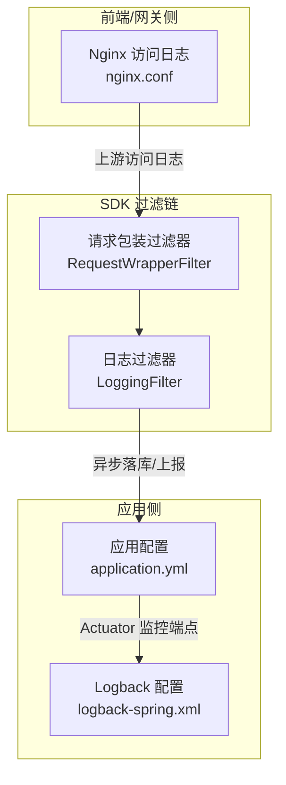
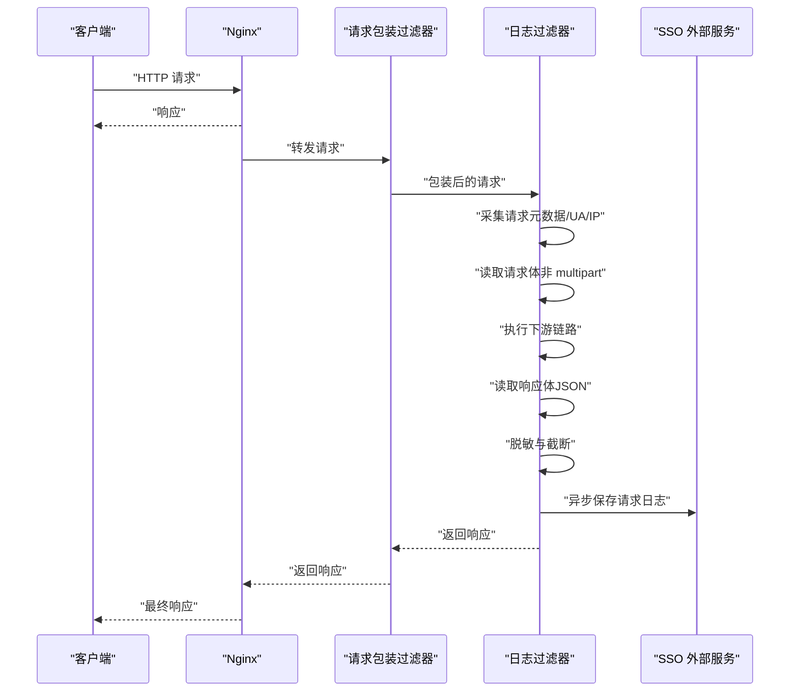
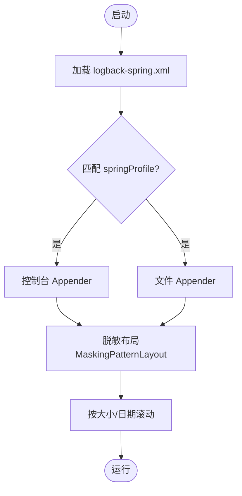
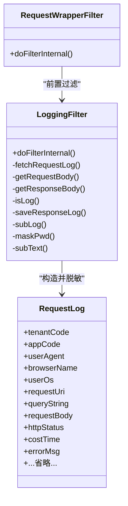
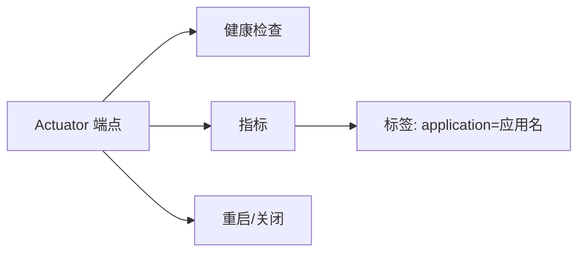
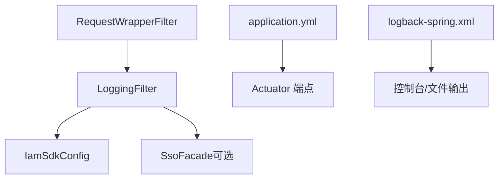

# 日志监控

<cite>
**本文引用的文件**
- [iam-admin-starter/src/main/resources/logback-spring.xml](file://iam-admin-starter/src/main/resources/logback-spring.xml)
- [iam-admin-starter/src/main/resources/config/application.yml](file://iam-admin-starter/src/main/resources/config/application.yml)
- [iam-sso-starter/src/main/resources/config/application.yml](file://iam-sso-starter/src/main/resources/config/application.yml)
- [iam-sdk/src/main/java/com/wkclz/iam/sdk/filter/LoggingFilter.java](file://iam-sdk/src/main/java/com/wkclz/iam/sdk/filter/LoggingFilter.java)
- [iam-sdk/src/main/java/com/wkclz/iam/sdk/filter/RequestWrapperFilter.java](file://iam-sdk/src/main/java/com/wkclz/iam/sdk/filter/RequestWrapperFilter.java)
- [iam-admin-ui/nginx.conf](file://iam-admin-ui/nginx.conf)
</cite>

## 目录
1. [简介](#简介)
2. [项目结构](#项目结构)
3. [核心组件](#核心组件)
4. [架构总览](#架构总览)
5. [详细组件分析](#详细组件分析)
6. [依赖关系分析](#依赖关系分析)
7. [性能考量](#性能考量)
8. [故障排查指南](#故障排查指南)
9. [结论](#结论)
10. [附录](#附录)

## 简介
本文件面向SH-IAM的日志系统与监控能力，覆盖日志配置管理、请求日志记录、错误日志处理、监控指标设计、系统健康检查与异常告警机制，并提供日志分析方法、调试技巧、紧急处理流程、日志聚合与存储策略以及查询优化建议。文档以代码为依据，确保技术细节可追溯。

## 项目结构
围绕日志与监控的关键位置如下：
- 应用侧日志配置：iam-admin-starter 的 Logback 配置与 Spring Boot Actuator 监控端点配置
- SDK 侧请求过滤链：请求包装与统一日志过滤器
- 前端/网关侧访问日志：Nginx 访问日志格式与采集

图表来源
- [iam-admin-starter/src/main/resources/logback-spring.xml:1-74](file://iam-admin-starter/src/main/resources/logback-spring.xml#L1-L74)
- [iam-admin-starter/src/main/resources/config/application.yml:28-52](file://iam-admin-starter/src/main/resources/config/application.yml#L28-L52)
- [iam-sdk/src/main/java/com/wkclz/iam/sdk/filter/RequestWrapperFilter.java:1-23](file://iam-sdk/src/main/java/com/wkclz/iam/sdk/filter/RequestWrapperFilter.java#L1-L23)
- [iam-sdk/src/main/java/com/wkclz/iam/sdk/filter/LoggingFilter.java:1-313](file://iam-sdk/src/main/java/com/wkclz/iam/sdk/filter/LoggingFilter.java#L1-L313)
- [iam-admin-ui/nginx.conf:22-36](file://iam-admin-ui/nginx.conf#L22-L36)

章节来源
- [iam-admin-starter/src/main/resources/logback-spring.xml:1-74](file://iam-admin-starter/src/main/resources/logback-spring.xml#L1-L74)
- [iam-admin-starter/src/main/resources/config/application.yml:28-52](file://iam-admin-starter/src/main/resources/config/application.yml#L28-L52)
- [iam-sso-starter/src/main/resources/config/application.yml:28-52](file://iam-sso-starter/src/main/resources/config/application.yml#L28-L52)
- [iam-sdk/src/main/java/com/wkclz/iam/sdk/filter/RequestWrapperFilter.java:1-23](file://iam-sdk/src/main/java/com/wkclz/iam/sdk/filter/RequestWrapperFilter.java#L1-L23)
- [iam-sdk/src/main/java/com/wkclz/iam/sdk/filter/LoggingFilter.java:1-313](file://iam-sdk/src/main/java/com/wkclz/iam/sdk/filter/LoggingFilter.java#L1-L313)
- [iam-admin-ui/nginx.conf:22-36](file://iam-admin-ui/nginx.conf#L22-L36)

## 核心组件
- 日志配置（Logback）
  - 控制台与文件输出，带脱敏布局；按大小与日期滚动；多环境 profile 生效
- 请求过滤链（SDK）
  - 请求包装：支持多次读取请求体，降低大文件上传内存压力
  - 统一日志过滤：采集请求/响应元数据、UA 解析、耗时统计、异步持久化
- 监控端点（Actuator）
  - 独立端口暴露健康检查、指标标签等
- 访问日志（Nginx）
  - 结构化 JSON 日志格式，便于采集与检索

章节来源
- [iam-admin-starter/src/main/resources/logback-spring.xml:10-71](file://iam-admin-starter/src/main/resources/logback-spring.xml#L10-L71)
- [iam-sdk/src/main/java/com/wkclz/iam/sdk/filter/RequestWrapperFilter.java:17-21](file://iam-sdk/src/main/java/com/wkclz/iam/sdk/filter/RequestWrapperFilter.java#L17-L21)
- [iam-sdk/src/main/java/com/wkclz/iam/sdk/filter/LoggingFilter.java:58-125](file://iam-sdk/src/main/java/com/wkclz/iam/sdk/filter/LoggingFilter.java#L58-L125)
- [iam-admin-starter/src/main/resources/config/application.yml:28-52](file://iam-admin-starter/src/main/resources/config/application.yml#L28-L52)
- [iam-admin-ui/nginx.conf:22-36](file://iam-admin-ui/nginx.conf#L22-L36)

## 架构总览
整体日志与监控路径：
- Nginx 作为入口，生成结构化访问日志
- 应用通过过滤链包装请求，采集请求/响应元数据与耗时
- 日志过滤器对敏感字段进行脱敏，异步持久化至后端服务
- Actuator 在独立端口暴露健康与指标，供外部监控系统拉取

图表来源
- [iam-sdk/src/main/java/com/wkclz/iam/sdk/filter/RequestWrapperFilter.java:17-21](file://iam-sdk/src/main/java/com/wkclz/iam/sdk/filter/RequestWrapperFilter.java#L17-L21)
- [iam-sdk/src/main/java/com/wkclz/iam/sdk/filter/LoggingFilter.java:58-125](file://iam-sdk/src/main/java/com/wkclz/iam/sdk/filter/LoggingFilter.java#L58-L125)
- [iam-admin-ui/nginx.conf:22-36](file://iam-admin-ui/nginx.conf#L22-L36)

## 详细组件分析

### 日志配置（Logback）
- 输出目标
  - 控制台与文件双通道
  - 文件按大小与日期滚动，保留历史天数
- 脱敏策略
  - 使用自定义布局，针对 JSON 中的密码字段进行掩码
- 环境配置
  - 通过 springProfile 在本地/开发/测试/预发/生产环境启用

图表来源
- [iam-admin-starter/src/main/resources/logback-spring.xml:6-71](file://iam-admin-starter/src/main/resources/logback-spring.xml#L6-L71)

章节来源
- [iam-admin-starter/src/main/resources/logback-spring.xml:10-71](file://iam-admin-starter/src/main/resources/logback-spring.xml#L10-L71)

### 请求过滤链（SDK）
- 请求包装过滤器
  - 将原始请求包装为可重复读取的缓存请求体，避免大文件上传场景下的内存峰值
- 日志过滤器
  - 采集维度：方法、URI、查询串、头信息、UA、IP、租户/应用/令牌、用户信息
  - UA 解析：浏览器、引擎、操作系统、平台
  - 耗时统计：请求开始/结束时间差
  - 敏感信息脱敏：正则匹配 JSON 中的密码字段并掩码
  - 截断策略：对超长字段进行长度限制
  - 异步持久化：通过 SSO 外部服务异步保存请求日志
  - 白名单/黑名单：静态资源后缀、特定 URI 不记录

图表来源
- [iam-sdk/src/main/java/com/wkclz/iam/sdk/filter/RequestWrapperFilter.java:17-21](file://iam-sdk/src/main/java/com/wkclz/iam/sdk/filter/RequestWrapperFilter.java#L17-L21)
- [iam-sdk/src/main/java/com/wkclz/iam/sdk/filter/LoggingFilter.java:58-313](file://iam-sdk/src/main/java/com/wkclz/iam/sdk/filter/LoggingFilter.java#L58-L313)

章节来源
- [iam-sdk/src/main/java/com/wkclz/iam/sdk/filter/RequestWrapperFilter.java:17-21](file://iam-sdk/src/main/java/com/wkclz/iam/sdk/filter/RequestWrapperFilter.java#L17-L21)
- [iam-sdk/src/main/java/com/wkclz/iam/sdk/filter/LoggingFilter.java:58-125](file://iam-sdk/src/main/java/com/wkclz/iam/sdk/filter/LoggingFilter.java#L58-L125)
- [iam-sdk/src/main/java/com/wkclz/iam/sdk/filter/LoggingFilter.java:191-225](file://iam-sdk/src/main/java/com/wkclz/iam/sdk/filter/LoggingFilter.java#L191-L225)
- [iam-sdk/src/main/java/com/wkclz/iam/sdk/filter/LoggingFilter.java:227-240](file://iam-sdk/src/main/java/com/wkclz/iam/sdk/filter/LoggingFilter.java#L227-L240)
- [iam-sdk/src/main/java/com/wkclz/iam/sdk/filter/LoggingFilter.java:242-295](file://iam-sdk/src/main/java/com/wkclz/iam/sdk/filter/LoggingFilter.java#L242-L295)

### 监控端点（Actuator）
- 独立端口暴露健康检查、指标、重启/关闭等端点
- 指标打上应用标签，便于多实例聚合
- 健康探测探针可启用

图表来源
- [iam-admin-starter/src/main/resources/config/application.yml:28-52](file://iam-admin-starter/src/main/resources/config/application.yml#L28-L52)
- [iam-sso-starter/src/main/resources/config/application.yml:28-52](file://iam-sso-starter/src/main/resources/config/application.yml#L28-L52)

章节来源
- [iam-admin-starter/src/main/resources/config/application.yml:28-52](file://iam-admin-starter/src/main/resources/config/application.yml#L28-L52)
- [iam-sso-starter/src/main/resources/config/application.yml:28-52](file://iam-sso-starter/src/main/resources/config/application.yml#L28-L52)

### 访问日志（Nginx）
- 定义结构化 JSON 日志格式，包含时间戳、Trace ID、客户端 IP、请求方法、URI、状态码、响应时间等
- 便于与后端日志串联定位问题

章节来源
- [iam-admin-ui/nginx.conf:22-36](file://iam-admin-ui/nginx.conf#L22-L36)

## 依赖关系分析
- 过滤链顺序
  - 请求包装过滤器优先于日志过滤器，保证日志过滤器能读取到已缓存的请求体
- 日志持久化依赖
  - 日志过滤器依赖 SSO 外部服务进行异步落库；若未注入，则跳过持久化
- 配置耦合
  - 日志过滤器根据配置决定是否忽略静态资源日志
  - Actuator 独立端口与标签由 application.yml 统一管理

图表来源
- [iam-sdk/src/main/java/com/wkclz/iam/sdk/filter/RequestWrapperFilter.java:17-21](file://iam-sdk/src/main/java/com/wkclz/iam/sdk/filter/RequestWrapperFilter.java#L17-L21)
- [iam-sdk/src/main/java/com/wkclz/iam/sdk/filter/LoggingFilter.java:52-55](file://iam-sdk/src/main/java/com/wkclz/iam/sdk/filter/LoggingFilter.java#L52-L55)
- [iam-admin-starter/src/main/resources/config/application.yml:28-52](file://iam-admin-starter/src/main/resources/config/application.yml#L28-L52)
- [iam-admin-starter/src/main/resources/logback-spring.xml:66-71](file://iam-admin-starter/src/main/resources/logback-spring.xml#L66-L71)

章节来源
- [iam-sdk/src/main/java/com/wkclz/iam/sdk/filter/RequestWrapperFilter.java:17-21](file://iam-sdk/src/main/java/com/wkclz/iam/sdk/filter/RequestWrapperFilter.java#L17-L21)
- [iam-sdk/src/main/java/com/wkclz/iam/sdk/filter/LoggingFilter.java:227-240](file://iam-sdk/src/main/java/com/wkclz/iam/sdk/filter/LoggingFilter.java#L227-L240)
- [iam-admin-starter/src/main/resources/config/application.yml:28-52](file://iam-admin-starter/src/main/resources/config/application.yml#L28-L52)
- [iam-admin-starter/src/main/resources/logback-spring.xml:66-71](file://iam-admin-starter/src/main/resources/logback-spring.xml#L66-L71)

## 性能考量
- 请求体缓存
  - 对非表单类型请求提前缓存请求体，避免多次读取带来的阻塞与重复解析
- 异步写日志
  - 使用线程池异步提交日志持久化，降低对主请求链路的影响
- 日志脱敏与截断
  - 避免将完整敏感信息写入日志，同时限制字段长度，降低存储与传输成本
- 滚动策略
  - 按大小与日期滚动，避免单文件过大影响读写性能

章节来源
- [iam-sdk/src/main/java/com/wkclz/iam/sdk/filter/RequestWrapperFilter.java:19-20](file://iam-sdk/src/main/java/com/wkclz/iam/sdk/filter/RequestWrapperFilter.java#L19-L20)
- [iam-sdk/src/main/java/com/wkclz/iam/sdk/filter/LoggingFilter.java:162-177](file://iam-sdk/src/main/java/com/wkclz/iam/sdk/filter/LoggingFilter.java#L162-L177)
- [iam-sdk/src/main/java/com/wkclz/iam/sdk/filter/LoggingFilter.java:233-240](file://iam-sdk/src/main/java/com/wkclz/iam/sdk/filter/LoggingFilter.java#L233-L240)
- [iam-admin-starter/src/main/resources/logback-spring.xml:59-63](file://iam-admin-starter/src/main/resources/logback-spring.xml#L59-L63)

## 故障排查指南
- 如何开启调试日志
  - 在请求参数中传入 debug=1 或在日志级别中提升为 debug，以便输出更详细的请求/响应体
- 常见问题定位
  - 若发现日志缺失：确认日志过滤器是否被正确注册、URI 是否命中“不记录”规则、静态资源后缀是否被忽略
  - 若日志中出现明文密码：检查脱敏正则是否生效、是否误用 info 级别输出
  - 若日志持久化失败：检查 SSO 外部服务是否可用、异步线程池是否饱和
- 健康检查与指标
  - 通过独立端口访问健康检查与指标，确认应用存活与资源使用情况

章节来源
- [iam-sdk/src/main/java/com/wkclz/iam/sdk/filter/LoggingFilter.java:106-124](file://iam-sdk/src/main/java/com/wkclz/iam/sdk/filter/LoggingFilter.java#L106-L124)
- [iam-sdk/src/main/java/com/wkclz/iam/sdk/filter/LoggingFilter.java:191-225](file://iam-sdk/src/main/java/com/wkclz/iam/sdk/filter/LoggingFilter.java#L191-L225)
- [iam-admin-starter/src/main/resources/config/application.yml:28-52](file://iam-admin-starter/src/main/resources/config/application.yml#L28-L52)

## 结论
SH-IAM 的日志与监控体系通过“请求包装 + 统一日志过滤 + 异步持久化 + 脱敏与截断 + 独立监控端口”的组合，实现了高可用、低侵入、可扩展的日志与监控能力。配合 Nginx 结构化访问日志，可实现端到端的请求追踪与问题定位。

## 附录

### 日志分析方法与调试技巧
- 关联分析
  - 以 Trace ID 串联 Nginx、应用日志与数据库日志，快速定位慢请求与异常
- 字段筛选
  - 优先关注：方法、URI、状态码、耗时、错误消息、租户/用户标识
- 调试开关
  - 通过 debug 参数或调整日志级别临时放大日志量，定位复杂问题

### 紧急处理流程
- 发现异常
  - 立即查看健康检查端点与最近指标，确认实例存活与资源占用
  - 检查日志过滤器是否正常工作，是否存在脱敏/截断导致的信息缺失
- 降级与恢复
  - 临时关闭部分日志记录或降低日志级别，缓解系统压力
  - 恢复后逐步恢复日志策略

### 日志聚合、存储与查询优化
- 聚合
  - 将 Nginx、应用、数据库日志统一收集至集中平台，建立统一索引
- 存储
  - 按天滚动、设置合理的保留周期；对高频接口建立分区或归档策略
- 查询
  - 建立常用维度（租户、用户、接口、状态码、耗时区间）的索引
  - 使用结构化字段进行过滤与聚合，避免全量扫描

### 监控指标与告警建议
- 指标
  - 接口 QPS、成功率、P95/P99 耗时、错误率、线程池队列长度、GC 时间
- 告警
  - 设置阈值与滑动窗口，区分严重与一般级别
  - 结合 Trace ID 与日志进行联动告警，缩短定位时间