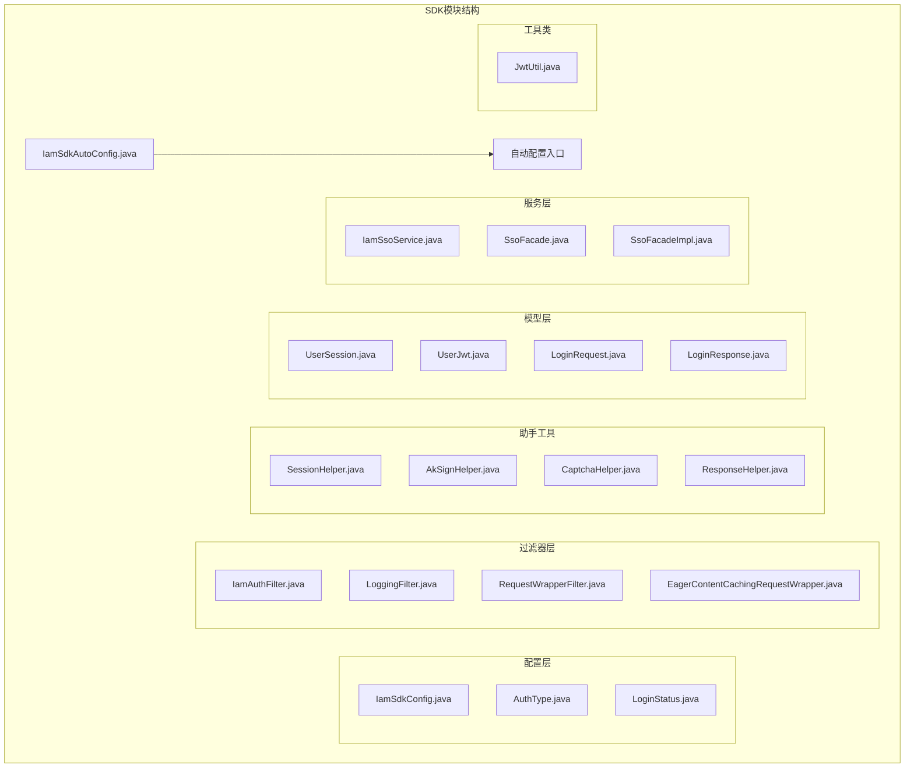
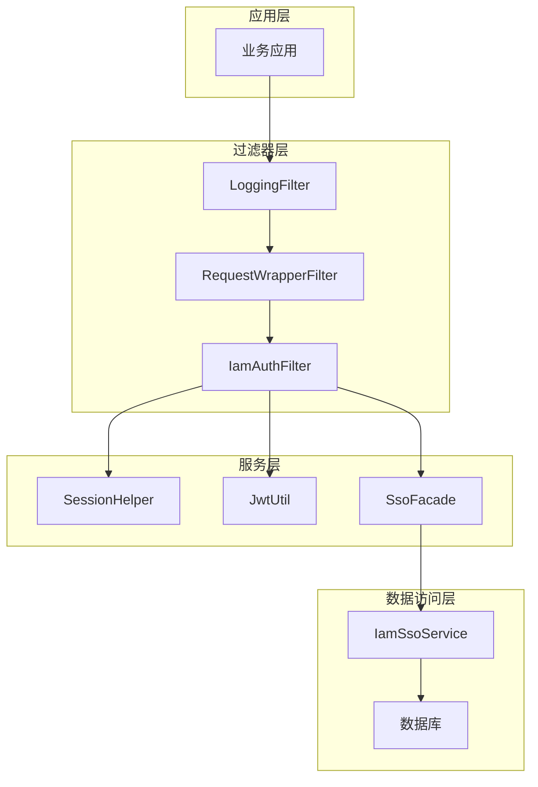
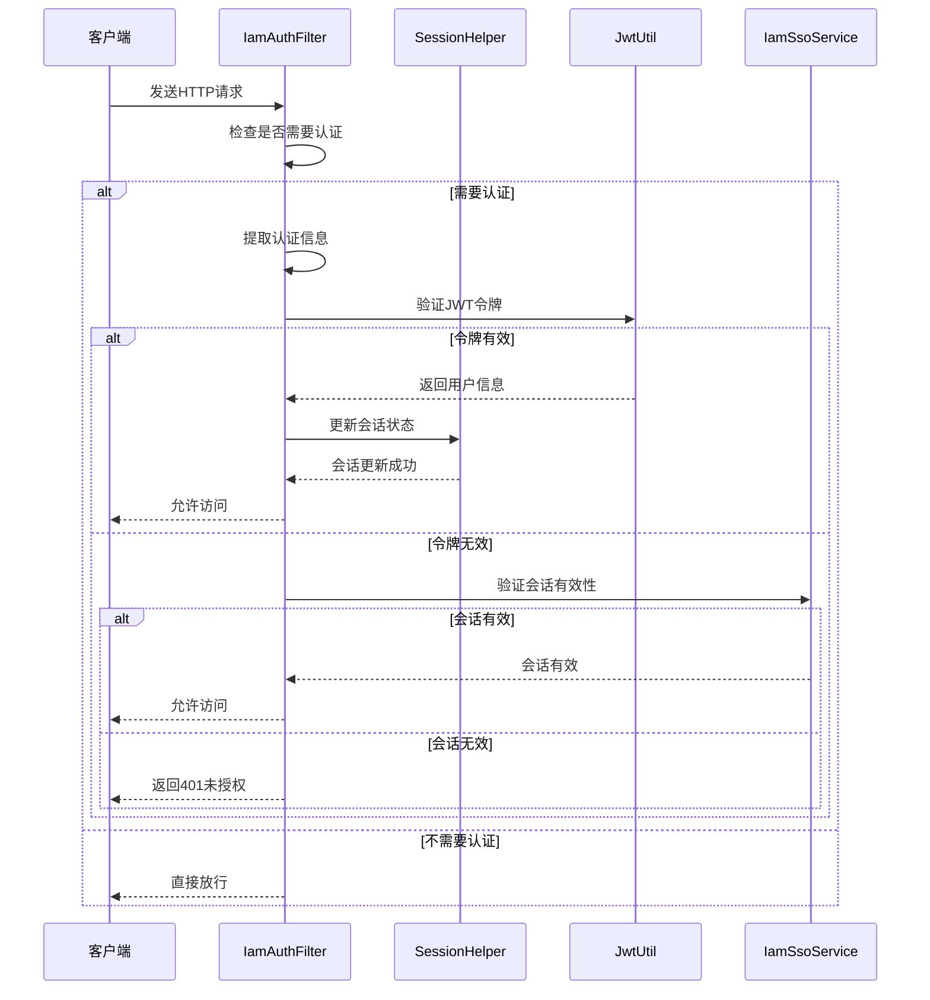
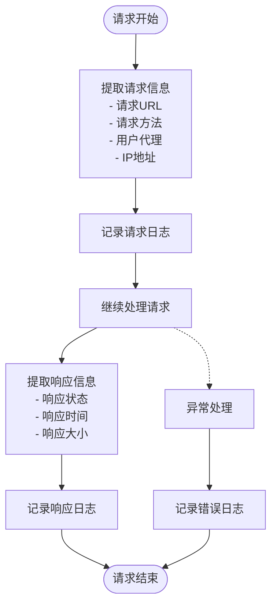
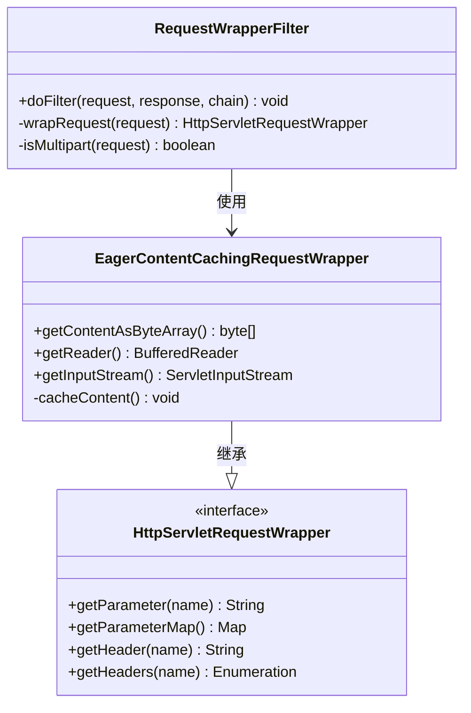
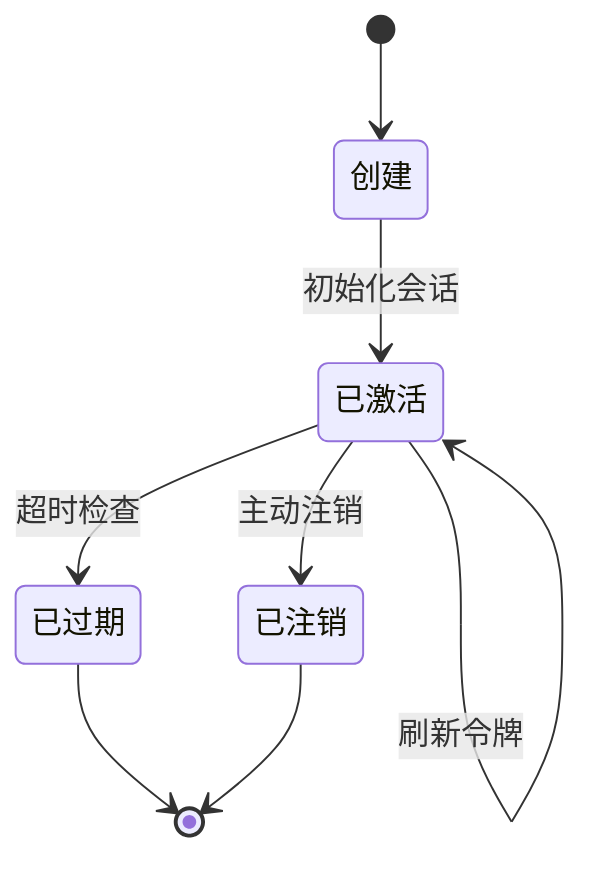
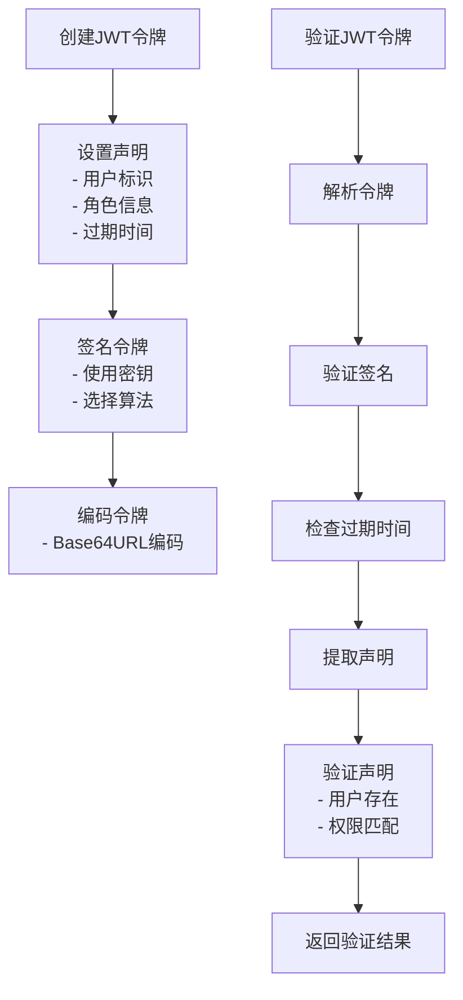
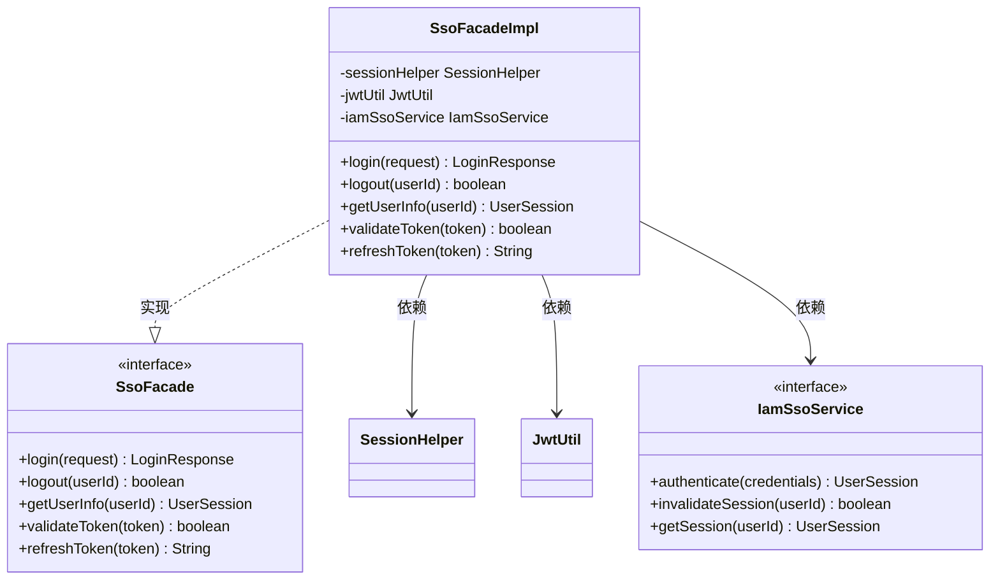
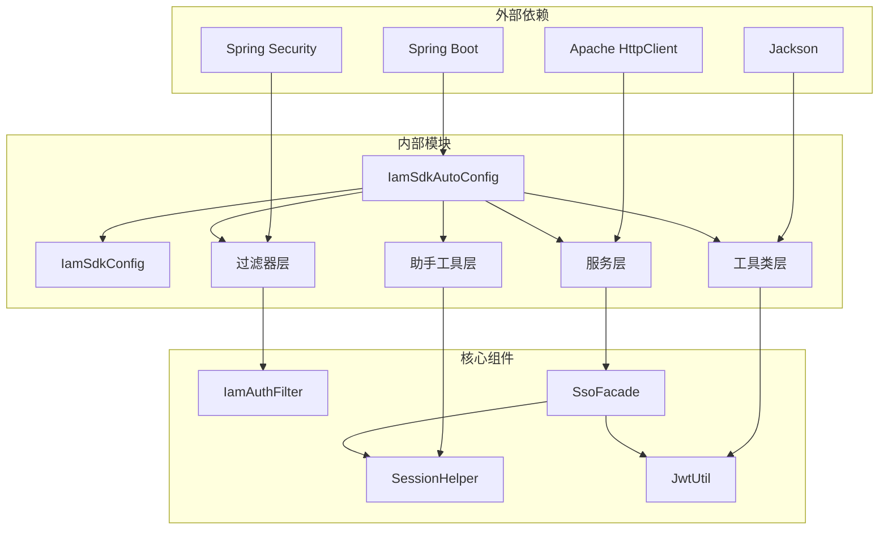

# SDK模块（iam-sdk）技术文档

<cite>
**本文档引用的文件**
- [IamSdkAutoConfig.java](file://iam-sdk/src/main/java/com/wkclz/iam/sdk/IamSdkAutoConfig.java)
- [IamSdkConfig.java](file://iam-sdk/src/main/java/com/wkclz/iam/sdk/config/IamSdkConfig.java)
- [IamAuthFilter.java](file://iam-sdk/src/main/java/com/wkclz/iam/sdk/filter/IamAuthFilter.java)
- [LoggingFilter.java](file://iam-sdk/src/main/java/com/wkclz/iam/sdk/filter/LoggingFilter.java)
- [RequestWrapperFilter.java](file://iam-sdk/src/main/java/com/wkclz/iam/sdk/filter/RequestWrapperFilter.java)
- [EagerContentCachingRequestWrapper.java](file://iam-sdk/src/main/java/com/wkclz/iam/sdk/filter/EagerContentCachingRequestWrapper.java)
- [SessionHelper.java](file://iam-sdk/src/main/java/com/wkclz/iam/sdk/helper/SessionHelper.java)
- [JwtUtil.java](file://iam-sdk/src/main/java/com/wkclz/iam/sdk/util/JwtUtil.java)
- [SsoFacade.java](file://iam-sdk/src/main/java/com/wkclz/iam/sdk/facade/SsoFacade.java)
- [SsoFacadeImpl.java](file://iam-sdk/src/main/java/com/wkclz/iam/sdk/facade/impl/SsoFacadeImpl.java)
- [UserSession.java](file://iam-sdk/src/main/java/com/wkclz/iam/sdk/model/UserSession.java)
- [UserJwt.java](file://iam-sdk/src/main/java/com/wkclz/iam/sdk/model/UserJwt.java)
- [LoginRequest.java](file://iam-sdk/src/main/java/com/wkclz/iam/sdk/model/LoginRequest.java)
- [LoginResponse.java](file://iam-sdk/src/main/java/com/wkclz/iam/sdk/model/LoginResponse.java)
- [IamSsoService.java](file://iam-sdk/src/main/java/com/wkclz/iam/sdk/service/IamSsoService.java)
- [AuthType.java](file://iam-sdk/src/main/java/com/wkclz/iam/sdk/enums/AuthType.java)
- [LoginStatus.java](file://iam-sdk/src/main/java/com/wkclz/iam/sdk/enums/LoginStatus.java)
- [org.springframework.boot.autoconfigure.AutoConfiguration.imports](file://iam-sdk/src/main/resources/META-INF/spring/org.springframework.boot.autoconfigure.AutoConfiguration.imports)
</cite>

## 目录
1. [简介](#简介)
2. [项目结构](#项目结构)
3. [核心组件](#核心组件)
4. [架构概览](#架构概览)
5. [详细组件分析](#详细组件分析)
6. [依赖关系分析](#依赖关系分析)
7. [性能考虑](#性能考虑)
8. [故障排除指南](#故障排除指南)
9. [结论](#结论)
10. [附录](#附录)

## 简介

IAM SDK模块是SH-IAM身份认证系统的核心客户端组件，提供了完整的身份认证、会话管理和安全过滤功能。该模块采用Spring Boot自动配置机制，通过过滤器链实现统一的安全控制，并提供了丰富的工具类来简化开发者的集成工作。

SDK模块的主要目标是为第三方应用提供简单易用的身份认证解决方案，包括用户登录、会话管理、JWT令牌处理和安全过滤等功能。通过标准化的接口设计和灵活的配置选项，开发者可以快速集成到各种应用场景中。

## 项目结构

IAM SDK模块采用标准的Maven项目结构，按照功能域进行组织：



**图表来源**
- [IamSdkAutoConfig.java:1-200](file://iam-sdk/src/main/java/com/wkclz/iam/sdk/IamSdkAutoConfig.java#L1-L200)
- [IamSdkConfig.java:1-150](file://iam-sdk/src/main/java/com/wkclz/iam/sdk/config/IamSdkConfig.java#L1-L150)

**章节来源**
- [IamSdkAutoConfig.java:1-200](file://iam-sdk/src/main/java/com/wkclz/iam/sdk/IamSdkAutoConfig.java#L1-L200)
- [org.springframework.boot.autoconfigure.AutoConfiguration.imports:1-50](file://iam-sdk/src/main/resources/META-INF/spring/org.springframework.boot.autoconfigure.AutoConfiguration.imports#L1-L50)

## 核心组件

### 自动配置机制

SDK采用Spring Boot的自动配置机制，通过`IamSdkAutoConfig`类实现智能配置。该配置类负责注册所有必要的Bean，包括过滤器、服务和工具类，确保SDK能够无缝集成到Spring Boot应用中。

自动配置的关键特性包括：
- 条件化Bean注册：根据应用环境动态启用或禁用特定功能
- 默认配置：提供合理的默认值，减少开发者配置负担
- 扩展性：允许开发者覆盖默认配置以满足特殊需求

### 认证过滤器链

SDK实现了三层过滤器链，每层都有特定的安全职责：

1. **日志过滤器（LoggingFilter）**：记录请求和响应信息，用于审计和调试
2. **请求包装器过滤器（RequestWrapperFilter）**：增强请求处理能力
3. **认证过滤器（IamAuthFilter）**：核心认证逻辑的执行点

### 会话管理

SessionHelper提供了完整的会话生命周期管理，包括会话创建、验证、更新和销毁等操作。支持多种会话存储策略，确保在不同部署环境下都能正常工作。

### JWT工具类

JwtUtil实现了JWT令牌的生成、解析和验证功能，遵循标准的JWT规范，支持多种加密算法和声明类型。

**章节来源**
- [IamSdkAutoConfig.java:1-200](file://iam-sdk/src/main/java/com/wkclz/iam/sdk/IamSdkAutoConfig.java#L1-L200)
- [IamSdkConfig.java:1-150](file://iam-sdk/src/main/java/com/wkclz/iam/sdk/config/IamSdkConfig.java#L1-L150)

## 架构概览

SDK的整体架构采用分层设计，各层职责明确，耦合度低：



**图表来源**
- [IamAuthFilter.java:1-300](file://iam-sdk/src/main/java/com/wkclz/iam/sdk/filter/IamAuthFilter.java#L1-L300)
- [SessionHelper.java:1-250](file://iam-sdk/src/main/java/com/wkclz/iam/sdk/helper/SessionHelper.java#L1-L250)
- [JwtUtil.java:1-200](file://iam-sdk/src/main/java/com/wkclz/iam/sdk/util/JwtUtil.java#L1-L200)

## 详细组件分析

### IamAuthFilter认证过滤器

IamAuthFilter是SDK的核心组件，负责执行用户身份认证和授权检查。其工作流程如下：



**图表来源**
- [IamAuthFilter.java:1-300](file://iam-sdk/src/main/java/com/wkclz/iam/sdk/filter/IamAuthFilter.java#L1-L300)
- [SessionHelper.java:1-250](file://iam-sdk/src/main/java/com/wkclz/iam/sdk/helper/SessionHelper.java#L1-L250)
- [JwtUtil.java:1-200](file://iam-sdk/src/main/java/com/wkclz/iam/sdk/util/JwtUtil.java#L1-L200)

#### 认证流程详解

1. **请求拦截**：过滤器拦截所有进入的HTTP请求
2. **规则匹配**：根据配置确定是否需要执行认证
3. **令牌提取**：从请求头或Cookie中提取JWT令牌
4. **令牌验证**：使用JwtUtil验证令牌的有效性和完整性
5. **会话检查**：验证用户会话状态是否有效
6. **权限验证**：检查用户是否有权访问目标资源
7. **结果处理**：根据验证结果决定放行或拒绝请求

**章节来源**
- [IamAuthFilter.java:1-300](file://iam-sdk/src/main/java/com/wkclz/iam/sdk/filter/IamAuthFilter.java#L1-L300)

### LoggingFilter日志过滤器

LoggingFilter负责记录所有经过的请求和响应信息，为系统监控和审计提供数据支持：



**图表来源**
- [LoggingFilter.java:1-200](file://iam-sdk/src/main/java/com/wkclz/iam/sdk/filter/LoggingFilter.java#L1-L200)

#### 日志记录内容

- **请求信息**：URL、HTTP方法、请求头、请求体摘要
- **响应信息**：状态码、响应时间、响应头、响应体摘要
- **用户信息**：认证用户标识、会话ID
- **系统信息**：处理时间、内存使用、线程信息

**章节来源**
- [LoggingFilter.java:1-200](file://iam-sdk/src/main/java/com/wkclz/iam/sdk/filter/LoggingFilter.java#L1-L200)

### RequestWrapperFilter请求包装器

RequestWrapperFilter提供对原始HTTP请求的增强处理能力：



**图表来源**
- [RequestWrapperFilter.java:1-250](file://iam-sdk/src/main/java/com/wkclz/iam/sdk/filter/RequestWrapperFilter.java#L1-L250)
- [EagerContentCachingRequestWrapper.java:1-200](file://iam-sdk/src/main/java/com/wkclz/iam/sdk/filter/EagerContentCachingRequestWrapper.java#L1-L200)

#### 包装器功能

- **内容缓存**：预读并缓存请求内容，支持多次读取
- **参数增强**：提供更灵活的参数访问方式
- **流处理**：支持字节流和字符流的透明处理
- **多部分处理**：正确处理multipart/form-data类型的请求

**章节来源**
- [RequestWrapperFilter.java:1-250](file://iam-sdk/src/main/java/com/wkclz/iam/sdk/filter/RequestWrapperFilter.java#L1-L250)
- [EagerContentCachingRequestWrapper.java:1-200](file://iam-sdk/src/main/java/com/wkclz/iam/sdk/filter/EagerContentCachingRequestWrapper.java#L1-L200)

### SessionHelper会话管理

SessionHelper提供完整的会话生命周期管理功能：



**图表来源**
- [SessionHelper.java:1-300](file://iam-sdk/src/main/java/com/wkclz/iam/sdk/helper/SessionHelper.java#L1-L300)
- [UserSession.java:1-150](file://iam-sdk/src/main/java/com/wkclz/iam/sdk/model/UserSession.java#L1-L150)

#### 会话状态管理

- **创建会话**：初始化用户会话，设置初始状态和属性
- **激活会话**：标记会话为活跃状态，更新最后活动时间
- **刷新会话**：延长会话有效期，更新相关属性
- **过期会话**：检测并清理过期会话
- **注销会话**：主动终止会话，清理相关资源

**章节来源**
- [SessionHelper.java:1-300](file://iam-sdk/src/main/java/com/wkclz/iam/sdk/helper/SessionHelper.java#L1-L300)
- [UserSession.java:1-150](file://iam-sdk/src/main/java/com/wkclz/iam/sdk/model/UserSession.java#L1-L150)

### JwtUtil JWT工具类

JwtUtil实现JWT令牌的完整生命周期管理：



**图表来源**
- [JwtUtil.java:1-250](file://iam-sdk/src/main/java/com/wkclz/iam/sdk/util/JwtUtil.java#L1-L250)
- [UserJwt.java:1-120](file://iam-sdk/src/main/java/com/wkclz/iam/sdk/model/UserJwt.java#L1-L120)

#### JWT令牌结构

- **头部（Header）**：包含令牌类型和签名算法信息
- **载荷（Payload）**：包含用户标识、角色、权限等声明
- **签名（Signature）**：基于头部和载荷的数字签名

**章节来源**
- [JwtUtil.java:1-250](file://iam-sdk/src/main/java/com/wkclz/iam/sdk/util/JwtUtil.java#L1-L250)
- [UserJwt.java:1-120](file://iam-sdk/src/main/java/com/wkclz/iam/sdk/model/UserJwt.java#L1-L120)

### SsoFacade门面接口

SsoFacade提供统一的单点登录服务接口：



**图表来源**
- [SsoFacade.java:1-150](file://iam-sdk/src/main/java/com/wkclz/iam/sdk/facade/SsoFacade.java#L1-L150)
- [SsoFacadeImpl.java:1-200](file://iam-sdk/src/main/java/com/wkclz/iam/sdk/facade/impl/SsoFacadeImpl.java#L1-L200)
- [IamSsoService.java:1-100](file://iam-sdk/src/main/java/com/wkclz/iam/sdk/service/IamSsoService.java#L1-L100)

#### 门面模式优势

- **简化接口**：为复杂的子系统提供简化的统一接口
- **解耦设计**：隐藏底层实现细节，降低客户端复杂度
- **易于扩展**：支持添加新的认证方式和服务功能
- **测试友好**：便于单元测试和集成测试

**章节来源**
- [SsoFacade.java:1-150](file://iam-sdk/src/main/java/com/wkclz/iam/sdk/facade/SsoFacade.java#L1-L150)
- [SsoFacadeImpl.java:1-200](file://iam-sdk/src/main/java/com/wkclz/iam/sdk/facade/impl/SsoFacadeImpl.java#L1-L200)

## 依赖关系分析

SDK模块的依赖关系体现了清晰的分层架构：



**图表来源**
- [IamSdkAutoConfig.java:1-200](file://iam-sdk/src/main/java/com/wkclz/iam/sdk/IamSdkAutoConfig.java#L1-L200)
- [IamAuthFilter.java:1-300](file://iam-sdk/src/main/java/com/wkclz/iam/sdk/filter/IamAuthFilter.java#L1-L300)

### 关键依赖特性

- **低耦合高内聚**：各组件职责明确，依赖关系清晰
- **可替换性**：通过接口抽象，支持不同实现的替换
- **向后兼容**：保持API稳定性，支持版本演进
- **性能优化**：合理的设计避免不必要的性能损耗

**章节来源**
- [IamSdkAutoConfig.java:1-200](file://iam-sdk/src/main/java/com/wkclz/iam/sdk/IamSdkAutoConfig.java#L1-L200)

## 性能考虑

### 过滤器链优化

SDK的过滤器链设计充分考虑了性能影响：

1. **短路原则**：对于不需要认证的请求立即放行
2. **异步处理**：支持异步过滤器，提高并发处理能力
3. **缓存策略**：合理使用缓存减少重复计算
4. **资源管理**：及时释放临时资源，避免内存泄漏

### 会话管理优化

- **懒加载**：只在需要时才加载会话数据
- **批量操作**：支持批量会话状态检查
- **连接池**：数据库连接使用连接池管理
- **超时控制**：合理的会话超时设置

### JWT性能优化

- **无状态设计**：JWT令牌包含所有必要信息，无需服务器存储
- **算法选择**：根据性能需求选择合适的加密算法
- **缓存机制**：缓存公钥和常用验证结果
- **压缩策略**：对大型载荷进行压缩处理

## 故障排除指南

### 常见问题及解决方案

#### 认证失败问题

**问题现象**：用户登录后仍然被拒绝访问

**可能原因**：
1. JWT令牌过期或格式不正确
2. 会话状态异常
3. 权限配置错误
4. 时间同步问题

**解决步骤**：
1. 检查JWT令牌的有效期和签名
2. 验证会话状态是否正常
3. 确认用户权限配置
4. 同步系统时间

#### 性能问题

**问题现象**：系统响应缓慢，特别是认证环节

**可能原因**：
1. 过滤器链过长
2. 数据库查询性能问题
3. 缓存配置不当
4. 网络延迟

**优化建议**：
1. 简化过滤器链配置
2. 优化数据库索引和查询
3. 调整缓存策略
4. 检查网络连接质量

#### 会话管理问题

**问题现象**：用户频繁掉线或会话状态异常

**解决方法**：
1. 检查会话超时配置
2. 验证会话存储介质
3. 监控会话数量和内存使用
4. 实施会话清理策略

**章节来源**
- [IamAuthFilter.java:1-300](file://iam-sdk/src/main/java/com/wkclz/iam/sdk/filter/IamAuthFilter.java#L1-L300)
- [SessionHelper.java:1-300](file://iam-sdk/src/main/java/com/wkclz/iam/sdk/helper/SessionHelper.java#L1-L300)

## 结论

IAM SDK模块通过精心设计的架构和完善的组件体系，为开发者提供了一个功能强大、易于使用的身份认证解决方案。其主要特点包括：

1. **自动化配置**：通过Spring Boot自动配置机制，减少开发者的配置工作
2. **模块化设计**：清晰的分层架构和职责分离，便于维护和扩展
3. **性能优化**：针对高并发场景进行了专门的性能优化
4. **安全性保障**：采用业界标准的安全协议和最佳实践
5. **易用性**：提供简洁的API和详细的文档支持

该SDK适用于各种规模的应用场景，从小型Web应用到大型企业级系统都能提供可靠的身份认证服务。

## 附录

### SDK集成示例

#### Maven依赖配置

```xml
<dependency>
    <groupId>com.wkclz.iam</groupId>
    <artifactId>iam-sdk</artifactId>
    <version>${project.version}</version>
</dependency>
```

#### Spring Boot配置

```yaml
iam:
  sdk:
    enabled: true
    jwt:
      secret: your-secret-key
      expiration: 86400
    session:
      timeout: 1800
      storage: redis
```

### 配置参数说明

| 参数名称 | 类型 | 默认值 | 描述 |
|---------|------|--------|------|
| iam.sdk.enabled | Boolean | true | 是否启用SDK |
| iam.sdk.jwt.secret | String | - | JWT密钥 |
| iam.sdk.jwt.expiration | Integer | 86400 | JWT过期时间（秒） |
| iam.sdk.session.timeout | Integer | 1800 | 会话超时时间（秒） |
| iam.sdk.session.storage | String | memory | 会话存储方式 |

### 最佳实践

1. **安全配置**：使用强密码和定期轮换密钥
2. **性能监控**：建立完善的性能监控和告警机制
3. **日志管理**：合理配置日志级别和输出格式
4. **版本升级**：定期更新SDK版本以获得最新功能和修复
5. **测试策略**：建立完整的测试体系，包括单元测试和集成测试