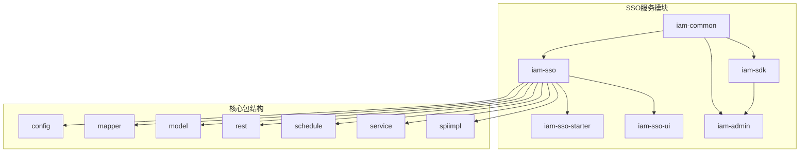
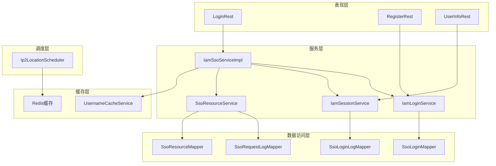
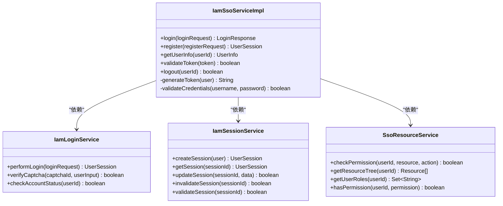
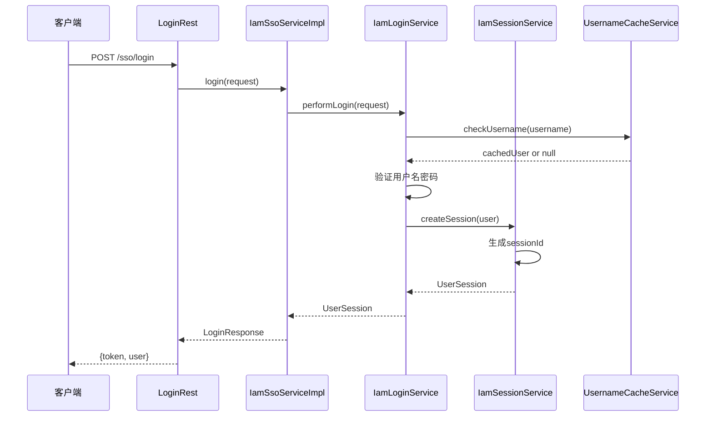
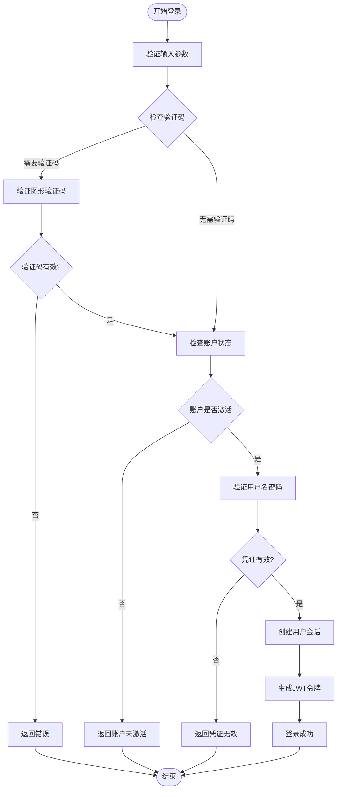
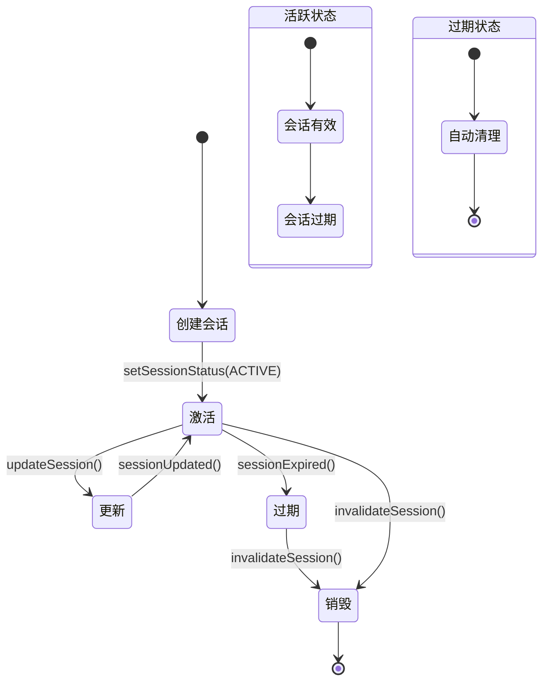
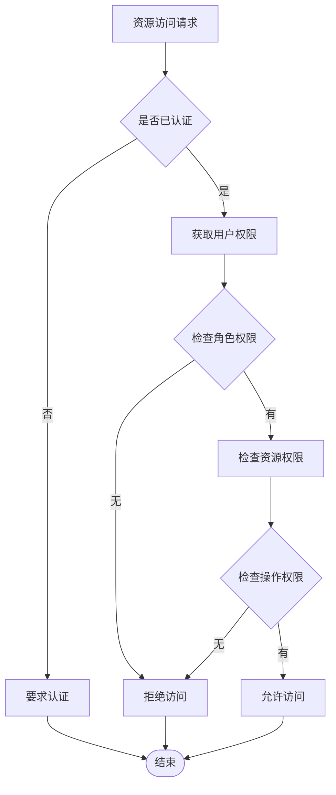
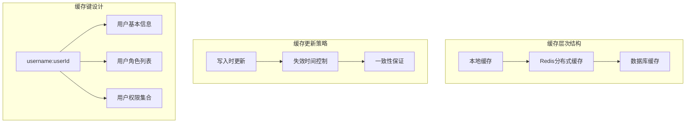
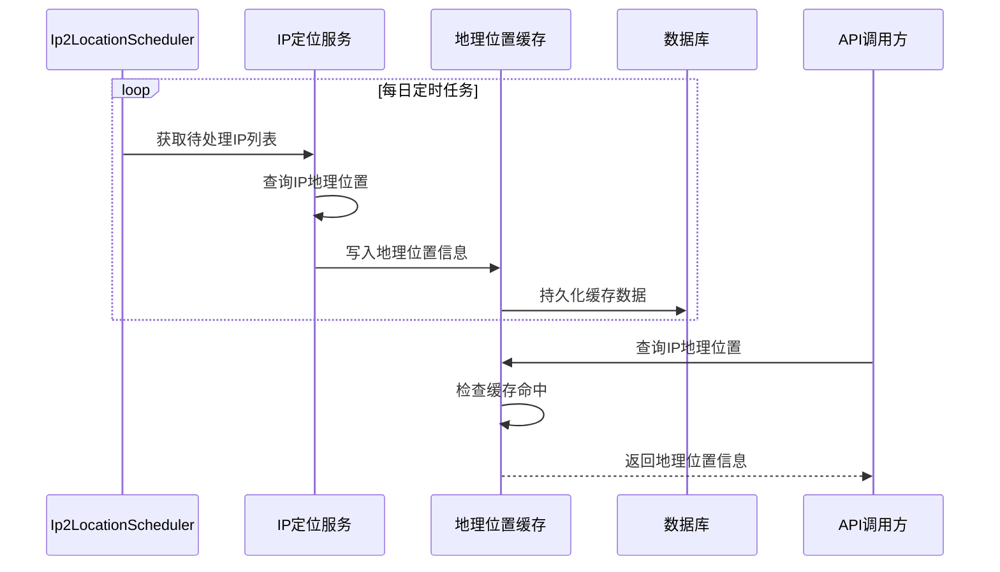
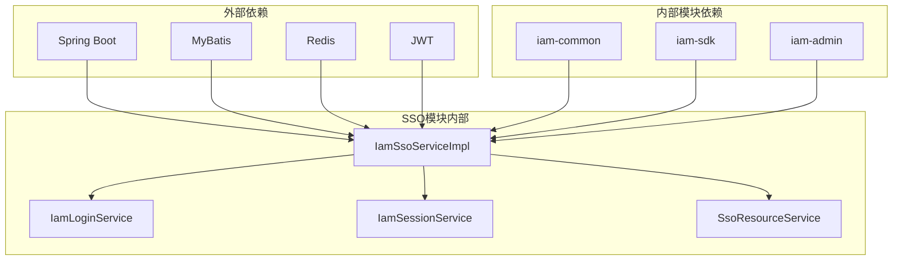

# SSO服务模块（iam-sso）技术文档

<cite>
**本文档引用的文件**
- [IamSsoServiceImpl.java](file://iam-sso/src/main/java/com/wkclz/iam/sso/service/IamSsoServiceImpl.java)
- [IamLoginService.java](file://iam-sso/src/main/java/com/wkclz/iam/sso/service/IamLoginService.java)
- [IamSessionService.java](file://iam-sso/src/main/java/com/wkclz/iam/sso/service/IamSessionService.java)
- [SsoResourceService.java](file://iam-sso/src/main/java/com/wkclz/iam/sso/service/SsoResourceService.java)
- [UsernameCacheService.java](file://iam-sso/src/main/java/com/wkclz/iam/sso/service/UsernameCacheService.java)
- [LoginRest.java](file://iam-sso/src/main/java/com/wkclz/iam/sso/rest/LoginRest.java)
- [RegisterRest.java](file://iam-sso/src/main/java/com/wkclz/iam/sso/rest/RegisterRest.java)
- [UserInfoRest.java](file://iam-sso/src/main/java/com/wkclz/iam/sso/rest/UserInfoRest.java)
- [Ip2LocationScheduler.java](file://iam-sso/src/main/java/com/wkclz/iam/sso/schedule/Ip2LocationScheduler.java)
- [IamSsoConfig.java](file://iam-sso/src/main/java/com/wkclz/iam/sso/config/IamSsoConfig.java)
- [IamSsoAutoConfig.java](file://iam-sso/src/main/java/com/wkclz/iam/sso/IamSsoAutoConfig.java)
- [IamSsoApplication.java](file://iam-sso-starter/src/main/java/com/wkclz/iam/sso/starter/IamSsoApplication.java)
- [application.yml](file://iam-sso-starter/src/main/resources/config/application.yml)
- [db-base.ddl.sql](file://iam-sso/src/main/resources/db-script/db-base.ddl.sql)
</cite>

## 目录
1. [简介](#简介)
2. [项目结构](#项目结构)
3. [核心组件](#核心组件)
4. [架构概览](#架构概览)
5. [详细组件分析](#详细组件分析)
6. [依赖关系分析](#依赖关系分析)
7. [性能考虑](#性能考虑)
8. [故障排除指南](#故障排除指南)
9. [结论](#结论)
10. [附录](#附录)

## 简介

SH-IAM SSO服务模块是基于Spring Boot构建的企业级单点登录解决方案，提供了完整的用户认证、授权和会话管理功能。该模块采用微服务架构设计，通过REST API提供标准化的服务接口，支持多租户、多应用的统一身份认证。

本模块的核心目标是为企业提供安全、可靠、高性能的单点登录服务，支持多种认证方式和灵活的权限控制机制。

## 项目结构

SSO服务模块采用标准的Maven多模块架构，主要包含以下子模块：



**图表来源**
- [IamSsoAutoConfig.java](file://iam-sso/src/main/java/com/wkclz/iam/sso/IamSsoAutoConfig.java)
- [IamSsoConfig.java](file://iam-sso/src/main/java/com/wkclz/iam/sso/config/IamSsoConfig.java)

**章节来源**
- [IamSsoAutoConfig.java](file://iam-sso/src/main/java/com/wkclz/iam/sso/IamSsoAutoConfig.java)
- [IamSsoConfig.java](file://iam-sso/src/main/java/com/wkclz/iam/sso/config/IamSsoConfig.java)

## 核心组件

SSO服务模块的核心组件包括：

### 1. 认证服务层
- **IamSsoServiceImpl**: 主要的SSO服务实现类
- **IamLoginService**: 用户登录服务
- **IamSessionService**: 会话管理服务

### 2. 资源服务层
- **SsoResourceService**: 资源访问控制服务
- **SsoFacadeImpl**: 外观模式实现类

### 3. 缓存与工具层
- **UsernameCacheService**: 用户名缓存服务
- **Ip2LocationScheduler**: IP地理位置定时任务

### 4. 接口层
- **LoginRest**: 登录REST接口
- **RegisterRest**: 注册REST接口
- **UserInfoRest**: 用户信息REST接口

**章节来源**
- [IamSsoServiceImpl.java](file://iam-sso/src/main/java/com/wkclz/iam/sso/service/IamSsoServiceImpl.java)
- [IamLoginService.java](file://iam-sso/src/main/java/com/wkclz/iam/sso/service/IamLoginService.java)
- [IamSessionService.java](file://iam-sso/src/main/java/com/wkclz/iam/sso/service/IamSessionService.java)

## 架构概览

SSO服务模块采用分层架构设计，实现了清晰的关注点分离：



**图表来源**
- [IamSsoServiceImpl.java](file://iam-sso/src/main/java/com/wkclz/iam/sso/service/IamSsoServiceImpl.java)
- [IamLoginService.java](file://iam-sso/src/main/java/com/wkclz/iam/sso/service/IamLoginService.java)
- [IamSessionService.java](file://iam-sso/src/main/java/com/wkclz/iam/sso/service/IamSessionService.java)
- [SsoResourceService.java](file://iam-sso/src/main/java/com/wkclz/iam/sso/service/SsoResourceService.java)

## 详细组件分析

### IamSsoServiceImpl 核心服务

IamSsoServiceImpl是SSO服务的主要实现类，负责协调各个服务组件完成完整的认证流程。



**图表来源**
- [IamSsoServiceImpl.java](file://iam-sso/src/main/java/com/wkclz/iam/sso/service/IamSsoServiceImpl.java)
- [IamLoginService.java](file://iam-sso/src/main/java/com/wkclz/iam/sso/service/IamLoginService.java)
- [IamSessionService.java](file://iam-sso/src/main/java/com/wkclz/iam/sso/service/IamSessionService.java)
- [SsoResourceService.java](file://iam-sso/src/main/java/com/wkclz/iam/sso/service/SsoResourceService.java)

#### 核心业务流程

**登录认证流程：**



**图表来源**
- [LoginRest.java](file://iam-sso/src/main/java/com/wkclz/iam/sso/rest/LoginRest.java)
- [IamSsoServiceImpl.java](file://iam-sso/src/main/java/com/wkclz/iam/sso/service/IamSsoServiceImpl.java)
- [IamLoginService.java](file://iam-sso/src/main/java/com/wkclz/iam/sso/service/IamLoginService.java)
- [IamSessionService.java](file://iam-sso/src/main/java/com/wkclz/iam/sso/service/IamSessionService.java)
- [UsernameCacheService.java](file://iam-sso/src/main/java/com/wkclz/iam/sso/service/UsernameCacheService.java)

**章节来源**
- [IamSsoServiceImpl.java](file://iam-sso/src/main/java/com/wkclz/iam/sso/service/IamSsoServiceImpl.java)

### IamLoginService 登录服务

IamLoginService专门处理用户登录相关的业务逻辑，包括凭证验证、验证码检查和账户状态验证。

#### 登录流程图



**图表来源**
- [IamLoginService.java](file://iam-sso/src/main/java/com/wkclz/iam/sso/service/IamLoginService.java)

**章节来源**
- [IamLoginService.java](file://iam-sso/src/main/java/com/wkclz/iam/sso/service/IamLoginService.java)

### IamSessionService 会话服务

IamSessionService负责会话的创建、管理和销毁，确保用户会话的安全性和持久性。

#### 会话生命周期管理



**图表来源**
- [IamSessionService.java](file://iam-sso/src/main/java/com/wkclz/iam/sso/service/IamSessionService.java)

**章节来源**
- [IamSessionService.java](file://iam-sso/src/main/java/com/wkclz/iam/sso/service/IamSessionService.java)

### SsoResourceService 资源服务

SsoResourceService实现基于角色的访问控制（RBAC），提供细粒度的权限验证机制。

#### 权限验证流程



**图表来源**
- [SsoResourceService.java](file://iam-sso/src/main/java/com/wkclz/iam/sso/service/SsoResourceService.java)

**章节来源**
- [SsoResourceService.java](file://iam-sso/src/main/java/com/wkclz/iam/sso/service/SsoResourceService.java)

### UsernameCacheService 用户名缓存服务

UsernameCacheService采用多级缓存策略，提升用户名查询性能。

#### 缓存策略架构



**图表来源**
- [UsernameCacheService.java](file://iam-sso/src/main/java/com/wkclz/iam/sso/service/UsernameCacheService.java)

**章节来源**
- [UsernameCacheService.java](file://iam-sso/src/main/java/com/wkclz/iam/sso/service/UsernameCacheService.java)

### IP地理位置服务

IP地理位置服务通过定时任务实现IP地址到地理位置的映射缓存。

#### IP定位服务流程



**图表来源**
- [Ip2LocationScheduler.java](file://iam-sso/src/main/java/com/wkclz/iam/sso/schedule/Ip2LocationScheduler.java)

**章节来源**
- [Ip2LocationScheduler.java](file://iam-sso/src/main/java/com/wkclz/iam/sso/schedule/Ip2LocationScheduler.java)

### REST接口设计

#### LoginRest 登录接口

LoginRest提供用户登录的REST API，支持多种登录方式。

**接口规范：**
- **URL**: `/sso/login`
- **方法**: POST
- **请求体**: LoginRequest
- **响应体**: LoginResponse

#### RegisterRest 注册接口

RegisterRest提供用户注册的REST API。

**接口规范：**
- **URL**: `/sso/register`
- **方法**: POST
- **请求体**: RegisterRequest
- **响应体**: UserSession

#### UserInfoRest 用户信息接口

UserInfoRest提供用户信息查询的REST API。

**接口规范：**
- **URL**: `/sso/user/info`
- **方法**: GET
- **响应体**: UserInfo

**章节来源**
- [LoginRest.java](file://iam-sso/src/main/java/com/wkclz/iam/sso/rest/LoginRest.java)
- [RegisterRest.java](file://iam-sso/src/main/java/com/wkclz/iam/sso/rest/RegisterRest.java)
- [UserInfoRest.java](file://iam-sso/src/main/java/com/wkclz/iam/sso/rest/UserInfoRest.java)

## 依赖关系分析

SSO服务模块的依赖关系体现了清晰的分层架构：



**图表来源**
- [IamSsoAutoConfig.java](file://iam-sso/src/main/java/com/wkclz/iam/sso/IamSsoAutoConfig.java)
- [IamSsoConfig.java](file://iam-sso/src/main/java/com/wkclz/iam/sso/config/IamSsoConfig.java)

**章节来源**
- [IamSsoAutoConfig.java](file://iam-sso/src/main/java/com/wkclz/iam/sso/IamSsoAutoConfig.java)
- [IamSsoConfig.java](file://iam-sso/src/main/java/com/wkclz/iam/sso/config/IamSsoConfig.java)

## 性能考虑

### 缓存策略优化

1. **多级缓存架构**
   - 本地缓存：减少内存访问延迟
   - Redis分布式缓存：支持集群部署
   - 数据库缓存：最终一致性保障

2. **缓存失效策略**
   - TTL过期时间设置
   - 读写分离优化
   - 批量更新机制

### 数据库优化

1. **索引优化**
   - 用户名索引
   - 会话ID索引
   - 资源权限索引

2. **连接池配置**
   - 最大连接数限制
   - 连接超时设置
   - 连接池监控

### 异步处理

1. **日志异步记录**
2. **缓存异步更新**
3. **通知异步发送**

## 故障排除指南

### 常见问题诊断

**1. 登录失败问题**
- 检查用户名密码是否正确
- 验证账户状态是否激活
- 确认验证码是否有效

**2. 会话过期问题**
- 检查会话有效期配置
- 验证Redis连接状态
- 确认会话清理任务运行情况

**3. 权限验证失败**
- 检查用户角色分配
- 验证资源权限配置
- 确认权限缓存同步

### 性能监控指标

| 指标类型 | 监控项 | 告警阈值 |
|---------|--------|----------|
| 响应时间 | 登录接口响应 | >2s |
| 缓存命中率 | 用户名缓存 | <80% |
| 数据库连接 | 连接池使用率 | >90% |
| Redis性能 | 命令执行时间 | >50ms |

**章节来源**
- [IamSsoServiceImpl.java](file://iam-sso/src/main/java/com/wkclz/iam/sso/service/IamSsoServiceImpl.java)
- [IamLoginService.java](file://iam-sso/src/main/java/com/wkclz/iam/sso/service/IamLoginService.java)
- [IamSessionService.java](file://iam-sso/src/main/java/com/wkclz/iam/sso/service/IamSessionService.java)

## 结论

SH-IAM SSO服务模块通过合理的架构设计和完善的组件实现，为企业提供了安全可靠的单点登录解决方案。模块具有以下特点：

1. **模块化设计**：清晰的分层架构，职责明确
2. **高可用性**：多级缓存和异步处理机制
3. **可扩展性**：插件化设计，支持功能扩展
4. **安全性**：完善的认证授权机制
5. **可观测性**：全面的日志和监控体系

该模块适合在企业级应用中作为统一的身份认证中心使用，能够有效简化多系统的用户认证流程，提升用户体验和系统安全性。

## 附录

### 配置示例

**application.yml 配置示例：**

```yaml
iam:
  sso:
    redis:
      host: localhost
      port: 6379
      database: 0
      timeout: 2000ms
    jwt:
      secret: your-secret-key
      expire-time: 86400000
    cache:
      ttl: 3600
      max-size: 1000
```

### API调用示例

**登录请求示例：**
```
POST /sso/login
Content-Type: application/json

{
  "username": "john.doe",
  "password": "password123",
  "captchaId": "abc123",
  "captchaValue": "ABCD"
}
```

**响应示例：**
```
{
  "success": true,
  "data": {
    "token": "eyJhbGciOiJIUzI1NiIs...",
    "user": {
      "userId": "123",
      "username": "john.doe",
      "email": "john@example.com"
    }
  }
}
```

### 集成指南

1. **服务启动**
   - 启动IamSsoApplication
   - 配置数据库连接
   - 初始化Redis缓存

2. **客户端集成**
   - 引入iam-sdk依赖
   - 配置SSO服务地址
   - 实现认证拦截器

3. **权限配置**
   - 配置用户角色
   - 设置资源权限
   - 验证权限生效

**章节来源**
- [IamSsoApplication.java](file://iam-sso-starter/src/main/java/com/wkclz/iam/sso/starter/IamSsoApplication.java)
- [application.yml](file://iam-sso-starter/src/main/resources/config/application.yml)
- [db-base.ddl.sql](file://iam-sso/src/main/resources/db-script/db-base.ddl.sql)