# 公共模块（iam-common）技术文档

<cite>
**本文档引用的文件**
- [pom.xml](file://iam-common/pom.xml)
- [IamUser.java](file://iam-common/src/main/java/com/wkclz/iam/common/entity/IamUser.java)
- [IamRole.java](file://iam-common/src/main/java/com/wkclz/iam/common/entity/IamRole.java)
- [IamMenu.java](file://iam-common/src/main/java/com/wkclz/iam/common/entity/IamMenu.java)
- [IamUserDto.java](file://iam-common/src/main/java/com/wkclz/iam/common/dto/IamUserDto.java)
- [IamRoleDto.java](file://iam-common/src/main/java/com/wkclz/iam/common/dto/IamRoleDto.java)
- [IamMenuDto.java](file://iam-common/src/main/java/com/wkclz/iam/common/dto/IamMenuDto.java)
- [PasswordHelper.java](file://iam-common/src/main/java/com/wkclz/iam/common/helper/PasswordHelper.java)
- [IpLocalCacheHelper.java](file://iam-common/src/main/java/com/wkclz/iam/common/helper/IpLocalCacheHelper.java)
- [IamUserAuthDto.java](file://iam-common/src/main/java/com/wkclz/iam/common/dto/IamUserAuthDto.java)
- [IamUserAuthPasswordDto.java](file://iam-common/src/main/java/com/wkclz/iam/common/dto/IamUserAuthPasswordDto.java)
- [IamUserRoleDto.java](file://iam-common/src/main/java/com/wkclz/iam/common/dto/IamUserRoleDto.java)
- [IamRoleMenuDto.java](file://iam-common/src/main/java/com/wkclz/iam/common/dto/IamRoleMenuDto.java)
- [IamMenuApiDto.java](file://iam-common/src/main/java/com/wkclz/iam/common/dto/IamMenuApiDto.java)
- [IamAccessKeyDto.java](file://iam-common/src/main/java/com/wkclz/iam/common/dto/IamAccessKeyDto.java)
- [IamAccessKeyApiDto.java](file://iam-common/src/main/java/com/wkclz/iam/common/dto/IamAccessKeyApiDto.java)
- [IamApiDto.java](file://iam-common/src/main/java/com/wkclz/iam/common/dto/IamApiDto.java)
- [IamAppDto.java](file://iam-common/src/main/java/com/wkclz/iam/common/dto/IamAppDto.java)
- [IamTenantDto.java](file://iam-common/src/main/java/com/wkclz/iam/common/dto/IamTenantDto.java)
- [IamDataDimensionDto.java](file://iam-common/src/main/java/com/wkclz/iam/common/dto/IamDataDimensionDto.java)
- [IamLoginLogDto.java](file://iam-common/src/main/java/com/wkclz/iam/common/dto/IamLoginLogDto.java)
- [IamRequestLogDto.java](file://iam-common/src/main/java/com/wkclz/iam/common/dto/IamRequestLogDto.java)
- [IamUserPasswordHisDto.java](file://iam-common/src/main/java/com/wkclz/iam/common/dto/IamUserPasswordHisDto.java)
</cite>

## 目录
1. [简介](#简介)
2. [项目结构](#项目结构)
3. [核心组件](#核心组件)
4. [架构概览](#架构概览)
5. [详细组件分析](#详细组件分析)
6. [依赖关系分析](#依赖关系分析)
7. [性能考虑](#性能考虑)
8. [故障排除指南](#故障排除指南)
9. [结论](#结论)

## 简介

IAM公共模块（iam-common）是SH-IAM身份认证与权限管理系统的基础设施层，为整个系统提供统一的数据模型、工具类和常量定义。该模块采用分层架构设计，包含实体类（Entity）、数据传输对象（DTO）和工具类库，为上层应用提供标准化的数据交换格式和通用功能支持。

公共模块在整个系统中扮演着核心支撑角色，向下连接数据库持久层，向上为管理端（iam-admin）、单点登录（iam-sso）和SDK（iam-sdk）等模块提供统一的数据模型和服务接口。

## 项目结构

公共模块采用标准的Maven项目结构，主要包含以下核心目录：

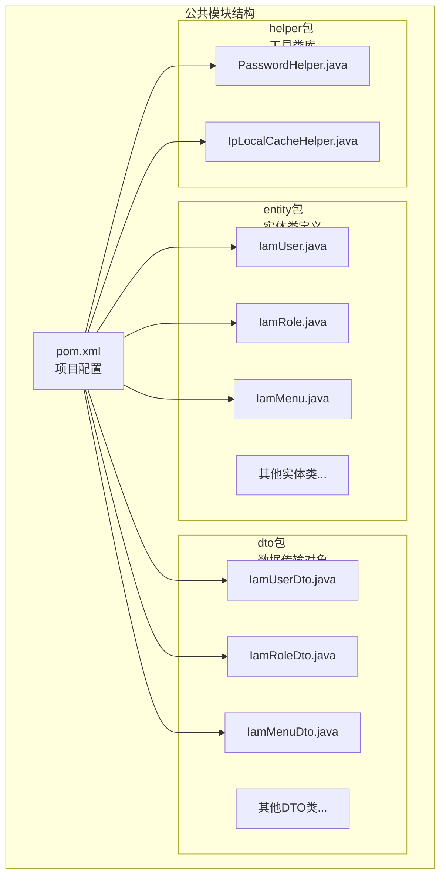

**图表来源**
- [pom.xml](file://iam-common/pom.xml)
- [IamUser.java](file://iam-common/src/main/java/com/wkclz/iam/common/entity/IamUser.java)
- [IamRole.java](file://iam-common/src/main/java/com/wkclz/iam/common/entity/IamRole.java)
- [IamMenu.java](file://iam-common/src/main/java/com/wkclz/iam/common/entity/IamMenu.java)

**章节来源**
- [pom.xml](file://iam-common/pom.xml)

## 核心组件

公共模块的核心组件包括三大类：实体类、DTO数据传输对象和工具类库。这些组件共同构成了系统的数据基础架构。

### 实体类设计原则

实体类遵循以下设计原则：
- **标准化命名**：采用统一的前缀"Iam"标识系统内实体
- **完整性约束**：包含必要的业务字段和元数据字段
- **扩展性设计**：预留扩展字段以适应未来需求变化
- **类型一致性**：确保字段类型与数据库表结构保持一致

### DTO数据传输对象

DTO类采用继承模式，每个DTO类都继承自对应的实体类，扩展了业务逻辑所需的额外字段和方法。

### 工具类库

工具类库提供系统级的通用功能，包括密码处理和IP地址缓存等核心服务。

**章节来源**
- [IamUser.java](file://iam-common/src/main/java/com/wkclz/iam/common/entity/IamUser.java)
- [IamRole.java](file://iam-common/src/main/java/com/wkclz/iam/common/entity/IamRole.java)
- [IamMenu.java](file://iam-common/src/main/java/com/wkclz/iam/common/entity/IamMenu.java)

## 架构概览

公共模块在整个SH-IAM系统中的架构位置如下：

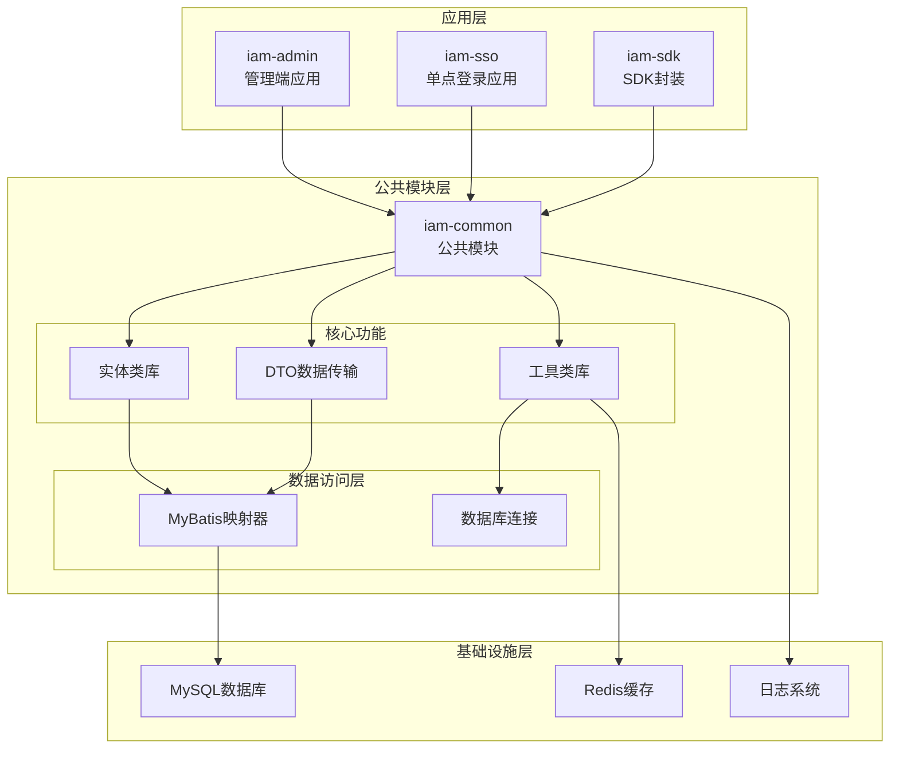

**图表来源**
- [IamUser.java](file://iam-common/src/main/java/com/wkclz/iam/common/entity/IamUser.java)
- [IamRole.java](file://iam-common/src/main/java/com/wkclz/iam/common/entity/IamRole.java)
- [IamMenu.java](file://iam-common/src/main/java/com/wkclz/iam/common/entity/IamMenu.java)

### 模块间依赖关系

公共模块作为系统的核心基础设施，为其他模块提供标准化的数据模型和服务接口。各模块通过Maven依赖关系进行集成，确保版本一致性和功能兼容性。

## 详细组件分析

### 核心实体类分析

#### IamUser 用户实体类

IamUser是用户管理的核心实体类，定义了用户的基本信息和认证相关属性。

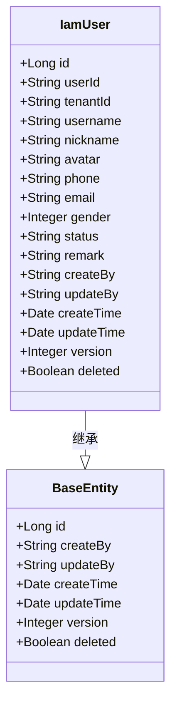

**图表来源**
- [IamUser.java](file://iam-common/src/main/java/com/wkclz/iam/common/entity/IamUser.java)

##### 字段说明

| 字段名 | 类型 | 必填 | 描述 | 用途 |
|--------|------|------|------|------|
| id | Long | 是 | 主键ID | 数据库自增主键 |
| userId | String | 是 | 用户唯一标识 | 系统内部用户ID |
| tenantId | String | 否 | 租户ID | 多租户支持 |
| username | String | 是 | 用户名 | 登录用户名 |
| nickname | String | 否 | 昵称 | 用户显示名称 |
| avatar | String | 否 | 头像URL | 用户头像地址 |
| phone | String | 否 | 手机号 | 联系方式 |
| email | String | 否 | 邮箱 | 联系方式 |
| gender | Integer | 否 | 性别 | 用户性别标识 |
| status | String | 是 | 状态 | 用户状态（启用/禁用） |
| remark | String | 否 | 备注 | 用户备注信息 |

**章节来源**
- [IamUser.java](file://iam-common/src/main/java/com/wkclz/iam/common/entity/IamUser.java)

#### IamRole 角色实体类

IamRole定义了系统中的角色概念，支持多租户环境下的角色管理。

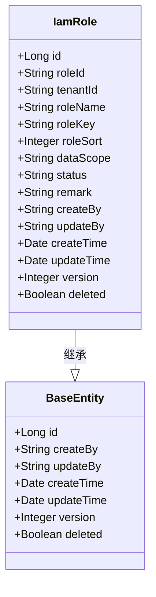

**图表来源**
- [IamRole.java](file://iam-common/src/main/java/com/wkclz/iam/common/entity/IamRole.java)

##### 字段说明

| 字段名 | 类型 | 必填 | 描述 | 用途 |
|--------|------|------|------|------|
| id | Long | 是 | 主键ID | 数据库自增主键 |
| roleId | String | 是 | 角色唯一标识 | 系统内部角色ID |
| tenantId | String | 否 | 租户ID | 多租户支持 |
| roleName | String | 是 | 角色名称 | 角色显示名称 |
| roleKey | String | 是 | 角色权限键 | 权限控制标识 |
| roleSort | Integer | 是 | 角色排序 | 角色显示顺序 |
| dataScope | String | 是 | 数据范围 | 数据权限范围 |
| status | String | 是 | 状态 | 角色状态（启用/禁用） |

**章节来源**
- [IamRole.java](file://iam-common/src/main/java/com/wkclz/iam/common/entity/IamRole.java)

#### IamMenu 菜单实体类

IamMenu定义了系统的菜单结构，支持树形菜单管理和权限控制。

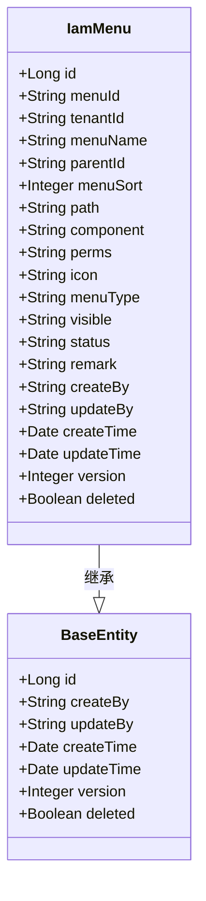

**图表来源**
- [IamMenu.java](file://iam-common/src/main/java/com/wkclz/iam/common/entity/IamMenu.java)

##### 字段说明

| 字段名 | 类型 | 必填 | 描述 | 用途 |
|--------|------|------|------|------|
| id | Long | 是 | 主键ID | 数据库自增主键 |
| menuId | String | 是 | 菜单唯一标识 | 系统内部菜单ID |
| tenantId | String | 否 | 租户ID | 多租户支持 |
| menuName | String | 是 | 菜单名称 | 菜单显示名称 |
| parentId | String | 是 | 父级菜单ID | 父级菜单关联 |
| menuSort | Integer | 是 | 菜单排序 | 菜单显示顺序 |
| path | String | 否 | 路由路径 | 前端路由路径 |
| component | String | 否 | 组件路径 | 前端组件路径 |
| perms | String | 否 | 权限标识 | 接口权限标识 |
| icon | String | 否 | 图标 | 菜单图标 |
| menuType | String | 是 | 菜单类型 | 菜单类型（目录/菜单/按钮） |
| visible | String | 是 | 可见性 | 菜单可见状态 |

**章节来源**
- [IamMenu.java](file://iam-common/src/main/java/com/wkclz/iam/common/entity/IamMenu.java)

### DTO数据传输对象分析

#### 用户相关DTO

用户相关的DTO类采用继承模式，扩展了实体类的功能，增加了业务逻辑所需的字段。

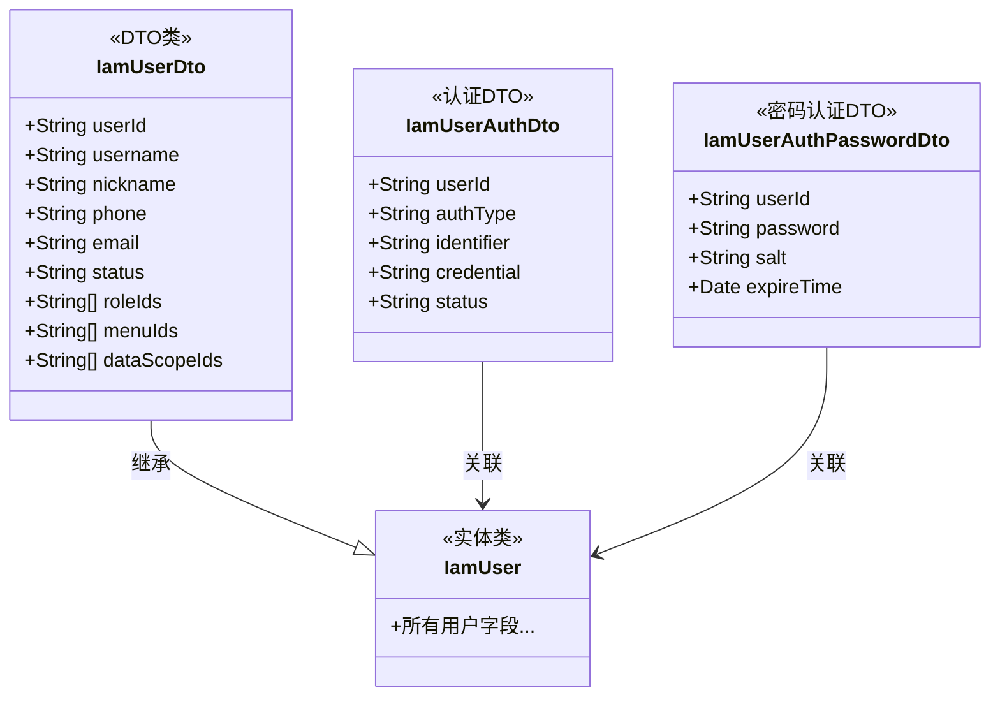

**图表来源**
- [IamUserDto.java](file://iam-common/src/main/java/com/wkclz/iam/common/dto/IamUserDto.java)
- [IamUserAuthDto.java](file://iam-common/src/main/java/com/wkclz/iam/common/dto/IamUserAuthDto.java)
- [IamUserAuthPasswordDto.java](file://iam-common/src/main/java/com/wkclz/iam/common/dto/IamUserAuthPasswordDto.java)

#### 角色相关DTO

角色相关的DTO类提供了角色管理的完整数据结构。

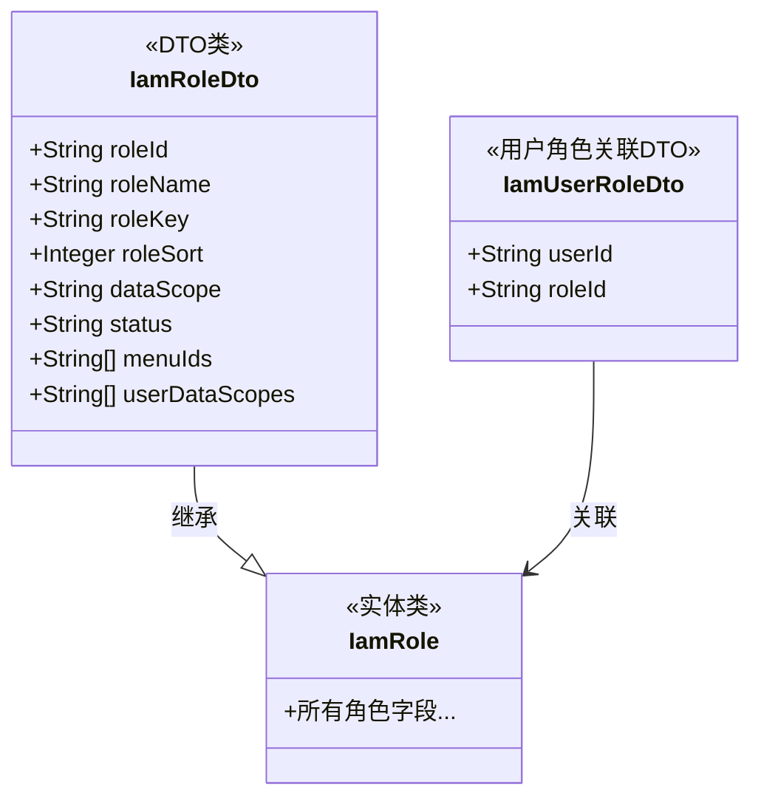

**图表来源**
- [IamRoleDto.java](file://iam-common/src/main/java/com/wkclz/iam/common/dto/IamRoleDto.java)
- [IamUserRoleDto.java](file://iam-common/src/main/java/com/wkclz/iam/common/dto/IamUserRoleDto.java)

#### 菜单相关DTO

菜单相关的DTO类支持复杂的菜单树形结构和权限控制。

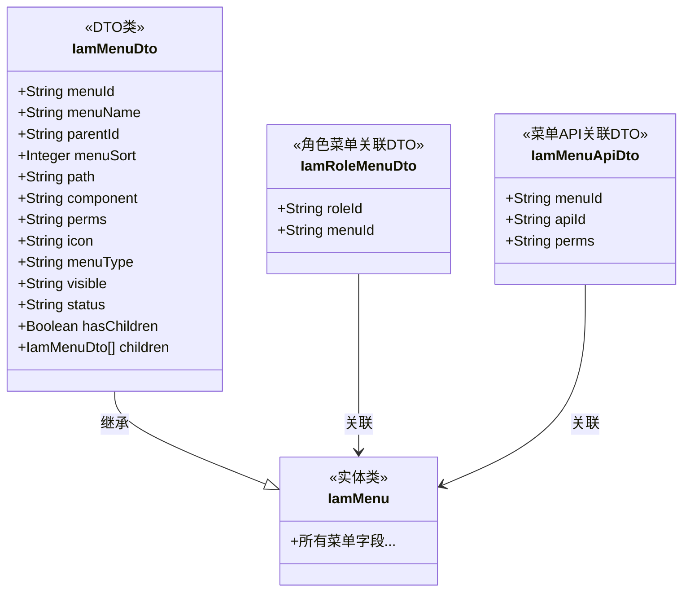

**图表来源**
- [IamMenuDto.java](file://iam-common/src/main/java/com/wkclz/iam/common/dto/IamMenuDto.java)
- [IamRoleMenuDto.java](file://iam-common/src/main/java/com/wkclz/iam/common/dto/IamRoleMenuDto.java)
- [IamMenuApiDto.java](file://iam-common/src/main/java/com/wkclz/iam/common/dto/IamMenuApiDto.java)

### 工具类库分析

#### PasswordHelper 密码处理工具

PasswordHelper提供了密码加密、验证和盐值生成等核心功能。

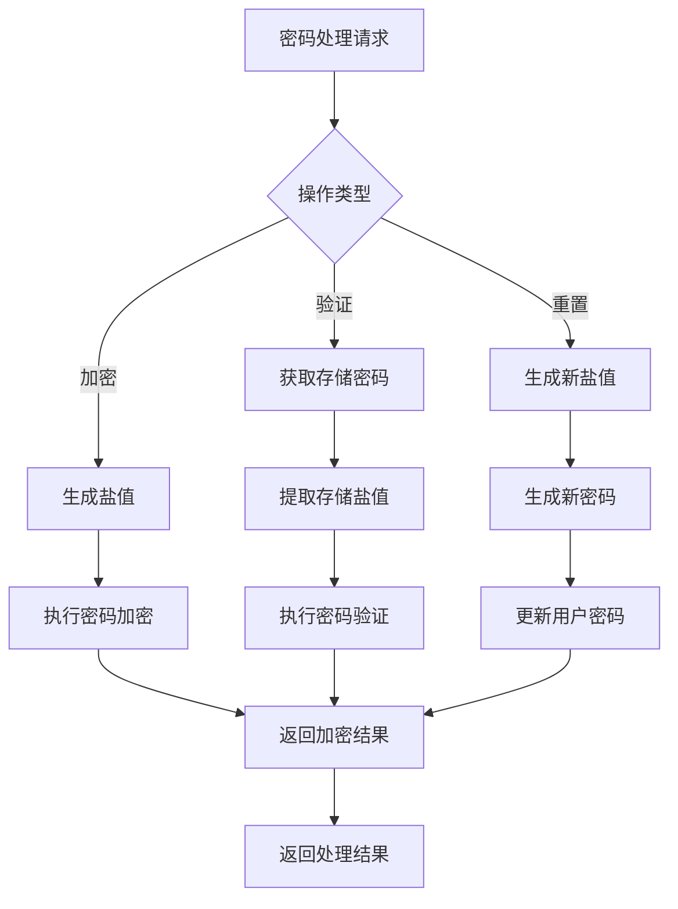

**图表来源**
- [PasswordHelper.java](file://iam-common/src/main/java/com/wkclz/iam/common/helper/PasswordHelper.java)

##### 功能特性

| 功能 | 描述 | 使用场景 |
|------|------|----------|
| 密码加密 | 使用安全算法对原始密码进行加密 | 用户注册、密码修改 |
| 密码验证 | 验证输入密码与存储密码是否匹配 | 用户登录、密码确认 |
| 盐值生成 | 生成随机盐值增强密码安全性 | 新密码创建、密码重置 |
| 密码强度检测 | 检测密码复杂度要求 | 密码策略验证 |

**章节来源**
- [PasswordHelper.java](file://iam-common/src/main/java/com/wkclz/iam/common/helper/PasswordHelper.java)

#### IpLocalCacheHelper IP地址缓存工具

IpLocalCacheHelper提供了IP地址地理位置查询和缓存功能。

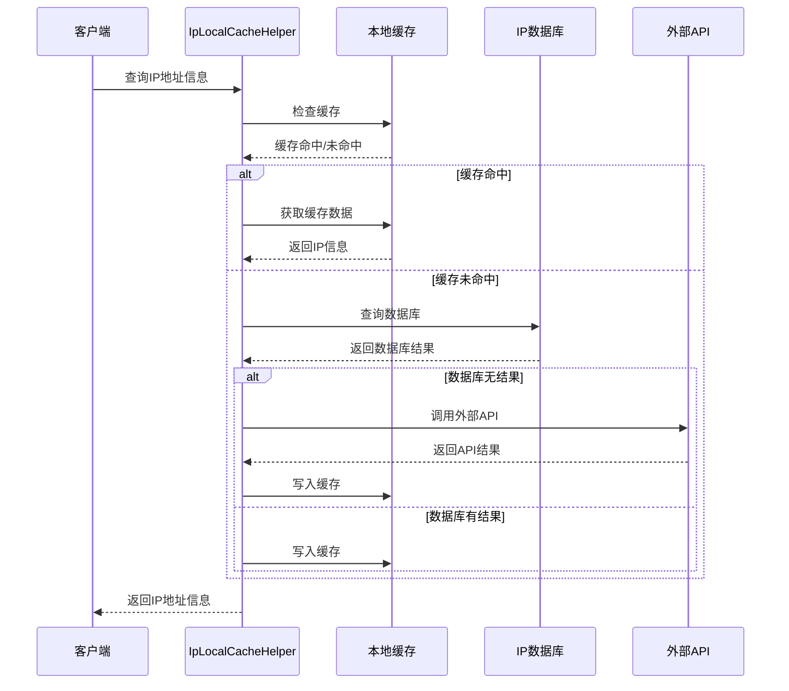

**图表来源**
- [IpLocalCacheHelper.java](file://iam-common/src/main/java/com/wkclz/iam/common/helper/IpLocalCacheHelper.java)

##### 缓存策略

| 缓存类型 | 过期时间 | 存储介质 | 适用场景 |
|----------|----------|----------|----------|
| 内存缓存 | 24小时 | JVM内存 | 高频查询IP |
| 文件缓存 | 永久 | 本地文件 | IP数据库备份 |
| Redis缓存 | 1小时 | Redis集群 | 分布式环境共享 |

**章节来源**
- [IpLocalCacheHelper.java](file://iam-common/src/main/java/com/wkclz/iam/common/helper/IpLocalCacheHelper.java)

## 依赖关系分析

### Maven依赖配置

公共模块的Maven配置展示了其核心依赖关系：

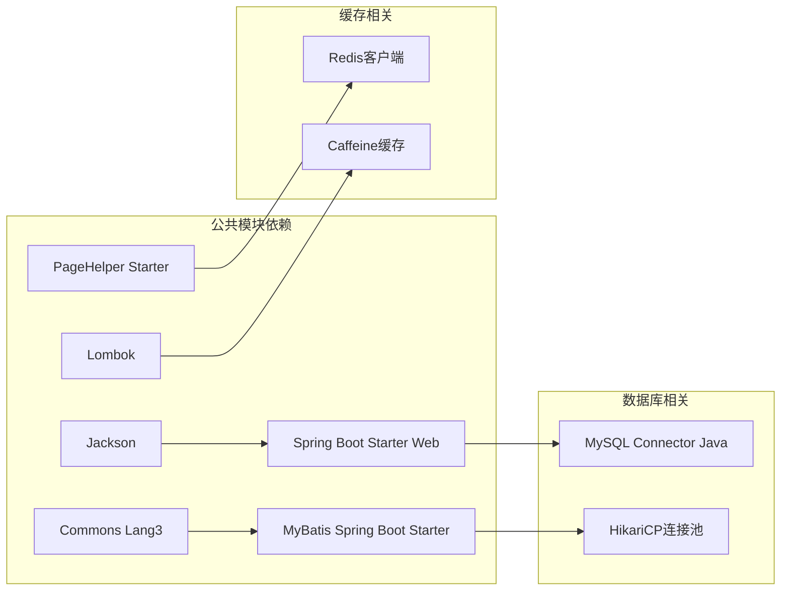

**图表来源**
- [pom.xml](file://iam-common/pom.xml)

### 模块间耦合度分析

公共模块与各应用模块的耦合关系呈现以下特点：

- **低耦合高内聚**：公共模块仅暴露必要的接口和数据模型
- **向内依赖**：各应用模块向下依赖公共模块的实体和工具
- **无反向依赖**：公共模块不依赖任何应用模块，保证独立性

**章节来源**
- [pom.xml](file://iam-common/pom.xml)

## 性能考虑

### 缓存策略优化

公共模块采用了多层次的缓存策略来提升系统性能：

1. **本地缓存**：使用Caffeine实现JVM进程内的快速访问
2. **分布式缓存**：集成Redis支持多实例共享缓存
3. **数据库缓存**：利用MyBatis二级缓存减少数据库访问

### 数据访问优化

- **批量操作**：支持批量插入、更新和删除操作
- **懒加载**：关联实体采用延迟加载避免不必要的数据传输
- **分页查询**：集成PageHelper实现高效的数据分页

## 故障排除指南

### 常见问题及解决方案

#### 密码处理异常

**问题现象**：用户密码加密失败或验证错误
**可能原因**：
- 盐值生成异常
- 加密算法配置错误
- 密码长度超出限制

**解决步骤**：
1. 检查PasswordHelper的初始化配置
2. 验证盐值生成算法
3. 确认密码长度和复杂度要求

#### IP地址查询失败

**问题现象**：IP地址查询返回空结果或超时
**可能原因**：
- IP数据库文件损坏
- 外部API调用失败
- 缓存配置异常

**解决步骤**：
1. 检查IP数据库文件完整性
2. 验证外部API访问权限
3. 清理缓存并重新加载

**章节来源**
- [PasswordHelper.java](file://iam-common/src/main/java/com/wkclz/iam/common/helper/PasswordHelper.java)
- [IpLocalCacheHelper.java](file://iam-common/src/main/java/com/wkclz/iam/common/helper/IpLocalCacheHelper.java)

## 结论

IAM公共模块（iam-common）作为SH-IAM系统的核心基础设施，通过标准化的实体类设计、完善的DTO数据传输机制和实用的工具类库，为整个系统的稳定运行提供了坚实的基础。模块采用分层架构设计，实现了良好的内聚性和低耦合性，便于维护和扩展。

公共模块的主要优势包括：

1. **标准化程度高**：统一的数据模型和接口规范
2. **扩展性强**：灵活的设计支持业务需求变化
3. **性能优化**：多层次缓存策略提升系统响应速度
4. **安全性保障**：完善的密码处理和权限控制机制

通过合理使用公共模块提供的实体类、DTO和工具类，开发者可以快速构建功能完善的身份认证与权限管理系统，为用户提供安全可靠的服务体验。