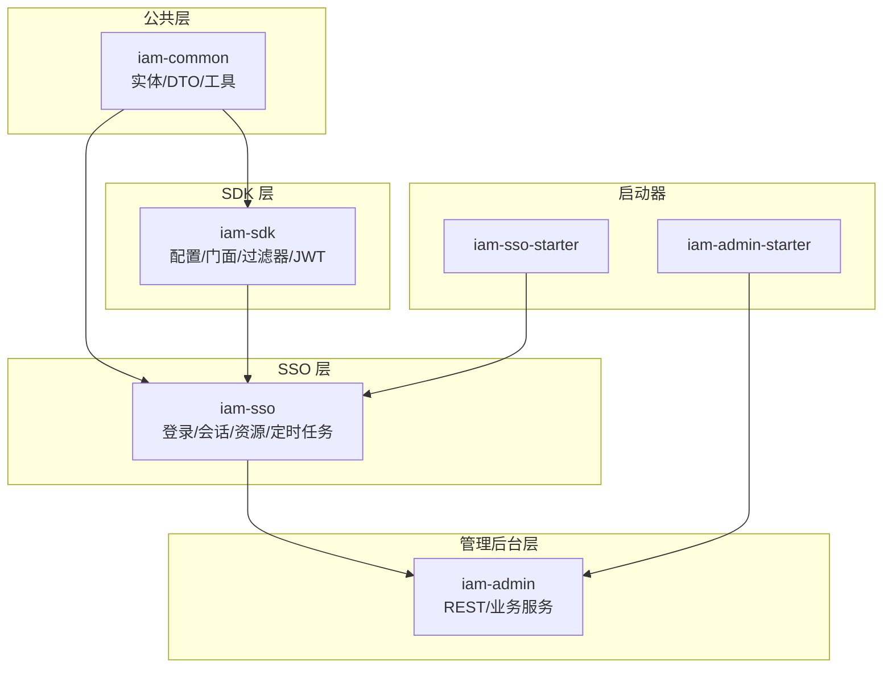
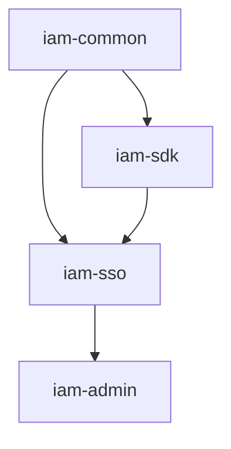
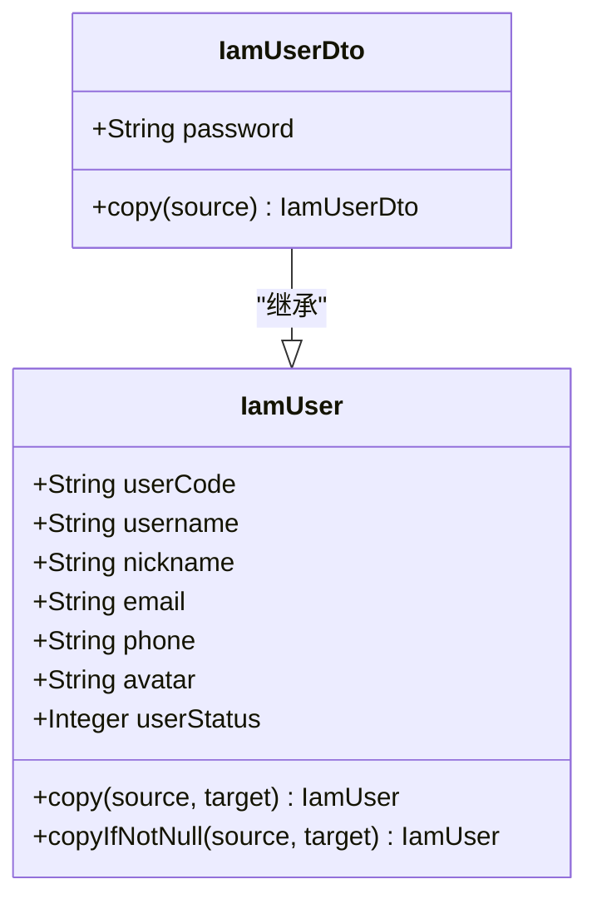
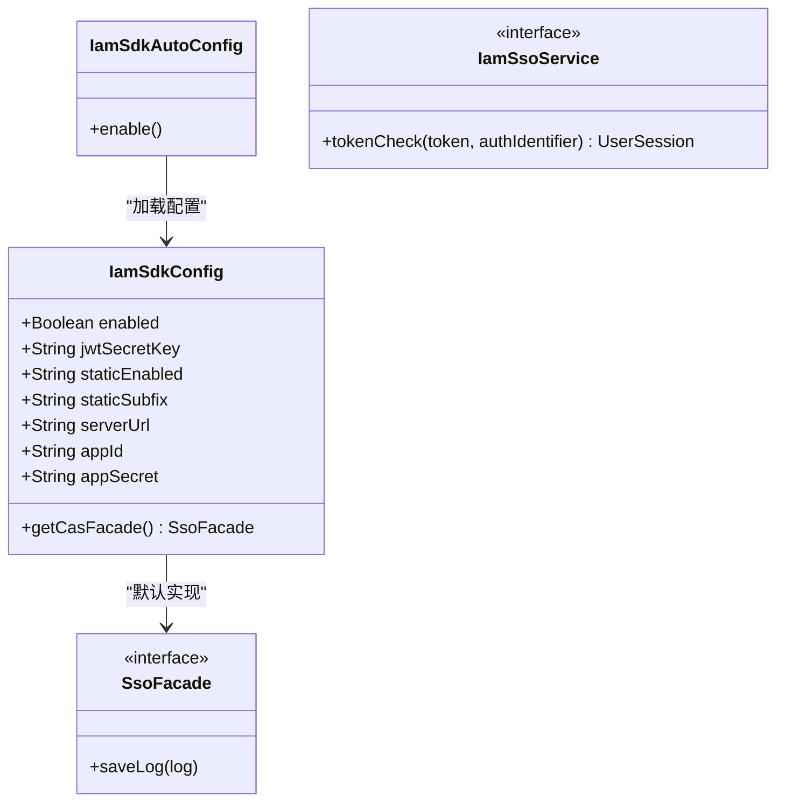
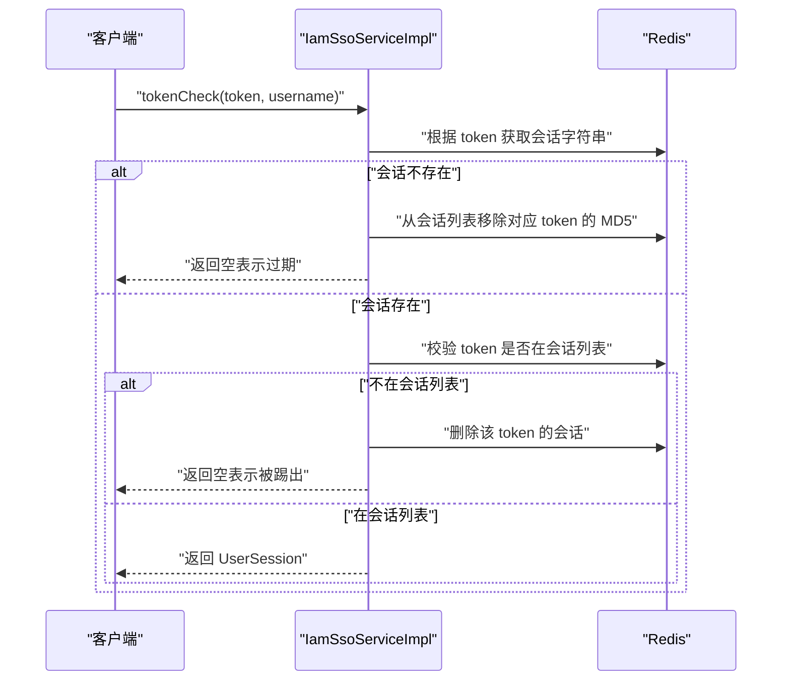
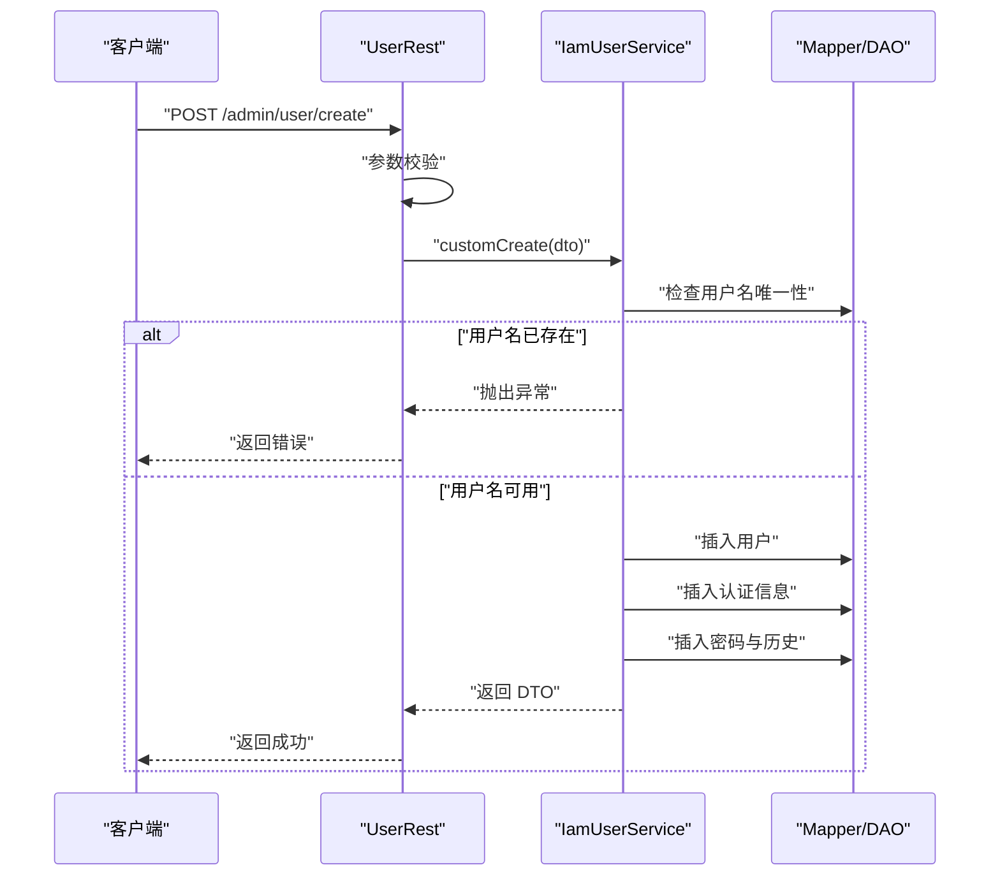
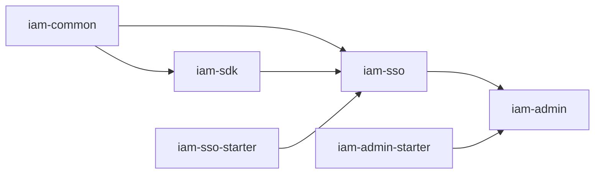

# 核心模块

<cite>
**本文引用的文件**
- [pom.xml（公共模块）](file://iam-common/pom.xml)
- [pom.xml（SDK 模块）](file://iam-sdk/pom.xml)
- [pom.xml（SSO 服务模块）](file://iam-sso/pom.xml)
- [pom.xml（管理后台模块）](file://iam-admin/pom.xml)
- [pom.xml（SSO 启动器）](file://iam-sso-starter/pom.xml)
- [pom.xml（管理后台启动器）](file://iam-admin-starter/pom.xml)
- [IamUser.java（实体）](file://iam-common/src/main/java/com/wkclz/iam/common/entity/IamUser.java)
- [IamUserDto.java（DTO）](file://iam-common/src/main/java/com/wkclz/iam/common/dto/IamUserDto.java)
- [IamSdkConfig.java（SDK 配置）](file://iam-sdk/src/main/java/com/wkclz/iam/sdk/config/IamSdkConfig.java)
- [IamSsoConfig.java（SSO 配置）](file://iam-sso/src/main/java/com/wkclz/iam/sso/config/IamSsoConfig.java)
- [IamAdminConfig.java（管理后台配置）](file://iam-admin/src/main/java/com/wkclz/iam/admin/config/IamAdminConfig.java)
- [IamSdkAutoConfig.java（SDK 自动配置）](file://iam-sdk/src/main/java/com/wkclz/iam/sdk/IamSdkAutoConfig.java)
- [IamSsoAutoConfig.java（SSO 自动配置）](file://iam-sso/src/main/java/com/wkclz/iam/sso/IamSsoAutoConfig.java)
- [IamSsoService.java（SSO 服务接口）](file://iam-sdk/src/main/java/com/wkclz/iam/sdk/service/IamSsoService.java)
- [IamSsoServiceImpl.java（SSO 服务实现）](file://iam-sso/src/main/java/com/wkclz/iam/sso/service/IamSsoServiceImpl.java)
- [SsoFacade.java（SSO 门面接口）](file://iam-sdk/src/main/java/com/wkclz/iam/sdk/facade/SsoFacade.java)
- [IamUserService.java（用户服务）](file://iam-admin/src/main/java/com/wkclz/iam/admin/service/IamUserService.java)
- [UserRest.java（用户 REST 接口）](file://iam-admin/src/main/java/com/wkclz/iam/admin/rest/UserRest.java)
</cite>

## 目录
1. [引言](#引言)
2. [项目结构](#项目结构)
3. [核心组件](#核心组件)
4. [架构总览](#架构总览)
5. [详细组件分析](#详细组件分析)
6. [依赖分析](#依赖分析)
7. [性能考虑](#性能考虑)
8. [故障排查指南](#故障排查指南)
9. [结论](#结论)
10. [附录](#附录)

## 引言
本文件面向 SH-IAM 的核心模块，系统化梳理公共模块（iam-common）、SDK 模块（iam-sdk）、SSO 服务模块（iam-sso）与管理后台模块（iam-admin）的设计理念、职责边界、接口定义与使用模式，并给出配置项、最佳实践与集成路径。文档兼顾初学者的概念性理解与资深开发者的实现细节，所有技术要点均以仓库源码为依据。

## 项目结构
SH-IAM 采用多模块分层设计：
- 公共模块（iam-common）：提供通用实体、DTO、工具类等基础能力，供其他模块复用。
- SDK 模块（iam-sdk）：封装鉴权、过滤器、JWT 工具、会话与日志门面等，作为接入方的统一入口。
- SSO 服务模块（iam-sso）：实现登录、会话校验、资源服务、定时任务等功能，依赖公共与 SDK 模块。
- 管理后台模块（iam-admin）：提供用户、角色、菜单、访问密钥等管理 REST 接口，依赖 SSO 模块。
- 启动器模块（iam-sso-starter、iam-admin-starter）：仅打包运行，跳过 install/deploy，便于独立启动。

图表来源
- [pom.xml（公共模块）:1-26](file://iam-common/pom.xml#L1-L26)
- [pom.xml（SDK 模块）:1-45](file://iam-sdk/pom.xml#L1-L45)
- [pom.xml（SSO 服务模块）:1-54](file://iam-sso/pom.xml#L1-L54)
- [pom.xml（管理后台模块）:1-42](file://iam-admin/pom.xml#L1-L42)
- [pom.xml（SSO 启动器）:1-48](file://iam-sso-starter/pom.xml#L1-L48)
- [pom.xml（管理后台启动器）:1-49](file://iam-admin-starter/pom.xml#L1-L49)

章节来源
- [pom.xml（公共模块）:1-26](file://iam-common/pom.xml#L1-L26)
- [pom.xml（SDK 模块）:1-45](file://iam-sdk/pom.xml#L1-L45)
- [pom.xml（SSO 服务模块）:1-54](file://iam-sso/pom.xml#L1-L54)
- [pom.xml（管理后台模块）:1-42](file://iam-admin/pom.xml#L1-L42)
- [pom.xml（SSO 启动器）:1-48](file://iam-sso-starter/pom.xml#L1-L48)
- [pom.xml（管理后台启动器）:1-49](file://iam-admin-starter/pom.xml#L1-L49)

## 核心组件
- 公共模块（iam-common）
  - 职责：提供统一的实体与 DTO（如 IamUser、IamUserDto），以及密码与 IP 地址缓存等辅助工具，确保跨模块数据模型一致性。
  - 关键点：实体具备字段描述注解与拷贝方法，DTO 支持从实体复制属性，便于服务层与控制器间的数据传递。
- SDK 模块（iam-sdk）
  - 职责：封装鉴权过滤器、请求包装、响应帮助、JWT 工具、会话与日志门面等，提供可插拔的自动配置与默认实现。
  - 关键点：通过 IamSdkAutoConfig 开启组件扫描；IamSdkConfig 提供开关、JWT 密钥、静态资源白名单、服务端地址等配置；SsoFacade 定义日志保存门面。
- SSO 服务模块（iam-sso）
  - 职责：实现登录态校验、会话管理、资源服务、定时任务（如 IP 地理位置缓存）等，依赖 Redis 存储会话与列表。
  - 关键点：IamSsoServiceImpl 基于 Redis 实现 token 校验与会话剔除；IamSsoAutoConfig 控制组件扫描与 Mapper 扫描。
- 管理后台模块（iam-admin）
  - 职责：提供用户 CRUD、角色/菜单/访问密钥等管理 REST 接口，基于公共模块 DTO 与服务层进行业务编排。
  - 关键点：IamUserService 实现用户创建、更新、删除与分页查询；UserRest 对外暴露 REST 接口并进行参数校验。

章节来源
- [IamUser.java（实体）:1-108](file://iam-common/src/main/java/com/wkclz/iam/common/entity/IamUser.java#L1-L108)
- [IamUserDto.java（DTO）:1-34](file://iam-common/src/main/java/com/wkclz/iam/common/dto/IamUserDto.java#L1-L34)
- [IamSdkConfig.java（SDK 配置）:1-62](file://iam-sdk/src/main/java/com/wkclz/iam/sdk/config/IamSdkConfig.java#L1-L62)
- [IamSsoConfig.java（SSO 配置）:1-29](file://iam-sso/src/main/java/com/wkclz/iam/sso/config/IamSsoConfig.java#L1-L29)
- [IamAdminConfig.java（管理后台配置）:1-18](file://iam-admin/src/main/java/com/wkclz/iam/admin/config/IamAdminConfig.java#L1-L18)
- [IamSdkAutoConfig.java（SDK 自动配置）:1-14](file://iam-sdk/src/main/java/com/wkclz/iam/sdk/IamSdkAutoConfig.java#L1-L14)
- [IamSsoAutoConfig.java（SSO 自动配置）:1-14](file://iam-sso/src/main/java/com/wkclz/iam/sso/IamSsoAutoConfig.java#L1-L14)
- [IamSsoService.java（SSO 服务接口）:1-10](file://iam-sdk/src/main/java/com/wkclz/iam/sdk/service/IamSsoService.java#L1-L10)
- [IamSsoServiceImpl.java（SSO 服务实现）:1-48](file://iam-sso/src/main/java/com/wkclz/iam/sso/service/IamSsoServiceImpl.java#L1-L48)
- [SsoFacade.java（SSO 门面接口）:1-11](file://iam-sdk/src/main/java/com/wkclz/iam/sdk/facade/SsoFacade.java#L1-L11)
- [IamUserService.java（用户服务）:1-125](file://iam-admin/src/main/java/com/wkclz/iam/admin/service/IamUserService.java#L1-L125)
- [UserRest.java（用户 REST 接口）:1-66](file://iam-admin/src/main/java/com/wkclz/iam/admin/rest/UserRest.java#L1-L66)

## 架构总览
下图展示模块间依赖与交互关系，以及自动配置如何驱动组件扫描与 Mapper 扫描。

图表来源
- [pom.xml（公共模块）:16-25](file://iam-common/pom.xml#L16-L25)
- [pom.xml（SDK 模块）:15-43](file://iam-sdk/pom.xml#L15-L43)
- [pom.xml（SSO 服务模块）:16-53](file://iam-sso/pom.xml#L16-L53)
- [pom.xml（管理后台模块）:16-23](file://iam-admin/pom.xml#L16-L23)

章节来源
- [pom.xml（公共模块）:1-26](file://iam-common/pom.xml#L1-L26)
- [pom.xml（SDK 模块）:1-45](file://iam-sdk/pom.xml#L1-L45)
- [pom.xml（SSO 服务模块）:1-54](file://iam-sso/pom.xml#L1-L54)
- [pom.xml（管理后台模块）:1-42](file://iam-admin/pom.xml#L1-L42)

## 详细组件分析

### 公共模块（iam-common）
- 设计理念
  - 统一数据模型：通过实体与 DTO 的分离，保证数据库映射与对外传输的职责清晰。
  - 可复用工具：提供实体拷贝、字段描述等能力，降低重复代码与耦合度。
- 关键实现
  - IamUser：包含用户编码、用户名、昵称、邮箱、手机号、头像、状态等字段，提供全量与非空拷贝方法。
  - IamUserDto：继承实体并扩展 DTO 行为，支持从实体复制属性。
- 使用模式
  - 服务层接收 DTO，DAO 层操作实体，避免直接暴露数据库字段。
  - 参数校验与异常处理在上层（REST 或服务层）集中处理。

图表来源
- [IamUser.java（实体）:17-104](file://iam-common/src/main/java/com/wkclz/iam/common/entity/IamUser.java#L17-L104)
- [IamUserDto.java（DTO）:13-32](file://iam-common/src/main/java/com/wkclz/iam/common/dto/IamUserDto.java#L13-L32)

章节来源
- [IamUser.java（实体）:1-108](file://iam-common/src/main/java/com/wkclz/iam/common/entity/IamUser.java#L1-L108)
- [IamUserDto.java（DTO）:1-34](file://iam-common/src/main/java/com/wkclz/iam/common/dto/IamUserDto.java#L1-L34)

### SDK 模块（iam-sdk）
- 设计理念
  - 松耦合接入：通过自动配置与条件化 Bean，按需启用 SDK 功能。
  - 安全与可运维：内置 JWT 工具、请求包装、日志门面与安全过滤器。
- 关键实现
  - IamSdkAutoConfig：开启组件扫描，默认启用。
  - IamSdkConfig：提供开关、JWT 密钥、静态资源后缀、服务端地址、应用标识等配置。
  - SsoFacade：定义日志保存门面，SDK 默认实现由自动配置注入。
  - IamSsoService：定义 token 校验接口，供上层调用。
- 使用模式
  - 在需要鉴权与日志记录的场景引入 SDK，通过配置控制行为。
  - 通过门面接口统一记录请求日志，便于审计与追踪。

图表来源
- [IamSdkAutoConfig.java（SDK 自动配置）:7-11](file://iam-sdk/src/main/java/com/wkclz/iam/sdk/IamSdkAutoConfig.java#L7-L11)
- [IamSdkConfig.java（SDK 配置）:14-61](file://iam-sdk/src/main/java/com/wkclz/iam/sdk/config/IamSdkConfig.java#L14-L61)
- [SsoFacade.java（SSO 门面接口）:6-10](file://iam-sdk/src/main/java/com/wkclz/iam/sdk/facade/SsoFacade.java#L6-L10)
- [IamSsoService.java（SSO 服务接口）:5-9](file://iam-sdk/src/main/java/com/wkclz/iam/sdk/service/IamSsoService.java#L5-L9)

章节来源
- [IamSdkAutoConfig.java（SDK 自动配置）:1-14](file://iam-sdk/src/main/java/com/wkclz/iam/sdk/IamSdkAutoConfig.java#L1-L14)
- [IamSdkConfig.java（SDK 配置）:1-62](file://iam-sdk/src/main/java/com/wkclz/iam/sdk/config/IamSdkConfig.java#L1-L62)
- [SsoFacade.java（SSO 门面接口）:1-11](file://iam-sdk/src/main/java/com/wkclz/iam/sdk/facade/SsoFacade.java#L1-L11)
- [IamSsoService.java（SSO 服务接口）:1-10](file://iam-sdk/src/main/java/com/wkclz/iam/sdk/service/IamSsoService.java#L1-L10)

### SSO 服务模块（iam-sso）
- 设计理念
  - 会话持久化：基于 Redis 存储用户会话与会话列表，支持踢人与过期清理。
  - 安全校验：结合 JWT 与 Redis，确保 token 有效性与会话一致性。
- 关键实现
  - IamSsoAutoConfig：开启组件扫描与 Mapper 扫描。
  - IamSsoServiceImpl：tokenCheck 流程包括 Redis 查询、会话列表校验、过期与踢出处理。
  - IamSsoConfig：密码过期天数、RSA 密钥对、最大并发会话数等配置。
- 使用模式
  - 在登录成功后生成 JWT 并写入 Redis 会话列表；后续请求通过 tokenCheck 校验。
  - 当会话被踢出或过期，自动清理相关键值，保障一致性。

图表来源
- [IamSsoServiceImpl.java（SSO 服务实现）:22-46](file://iam-sso/src/main/java/com/wkclz/iam/sso/service/IamSsoServiceImpl.java#L22-L46)
- [IamSsoAutoConfig.java（SSO 自动配置）:7-11](file://iam-sso/src/main/java/com/wkclz/iam/sso/IamSsoAutoConfig.java#L7-L11)

章节来源
- [IamSsoAutoConfig.java（SSO 自动配置）:1-14](file://iam-sso/src/main/java/com/wkclz/iam/sso/IamSsoAutoConfig.java#L1-L14)
- [IamSsoServiceImpl.java（SSO 服务实现）:1-48](file://iam-sso/src/main/java/com/wkclz/iam/sso/service/IamSsoServiceImpl.java#L1-L48)
- [IamSsoConfig.java（SSO 配置）:1-29](file://iam-sso/src/main/java/com/wkclz/iam/sso/config/IamSsoConfig.java#L1-L29)

### 管理后台模块（iam-admin）
- 设计理念
  - 分层清晰：REST 控制器负责参数校验与结果封装；服务层处理业务规则；DAO 层负责数据持久化。
  - 安全合规：创建用户时生成认证信息与密码历史，防止重复与弱密码滥用。
- 关键实现
  - IamUserService：提供分页查询、更新、删除与自定义创建流程（含去重、生成用户编码、插入认证与密码历史）。
  - UserRest：暴露用户管理 REST 接口，统一返回格式与参数校验。
  - IamAdminConfig：提供 API 扫描开关配置。
- 使用模式
  - 通过 UserRest 进行用户增删改查；服务层内部完成幂等与一致性处理。

图表来源
- [UserRest.java（用户 REST 接口）:34-41](file://iam-admin/src/main/java/com/wkclz/iam/admin/rest/UserRest.java#L34-L41)
- [IamUserService.java（用户服务）:77-121](file://iam-admin/src/main/java/com/wkclz/iam/admin/service/IamUserService.java#L77-L121)

章节来源
- [IamUserService.java（用户服务）:1-125](file://iam-admin/src/main/java/com/wkclz/iam/admin/service/IamUserService.java#L1-L125)
- [UserRest.java（用户 REST 接口）:1-66](file://iam-admin/src/main/java/com/wkclz/iam/admin/rest/UserRest.java#L1-L66)
- [IamAdminConfig.java（管理后台配置）:1-18](file://iam-admin/src/main/java/com/wkclz/iam/admin/config/IamAdminConfig.java#L1-L18)

## 依赖分析
- 模块依赖
  - iam-sso 依赖 iam-common 与 iam-sdk。
  - iam-admin 依赖 iam-sso。
  - 启动器模块仅打包对应模块，跳过 install/deploy 插件配置。
- 自动配置与扫描
  - SDK：IamSdkAutoConfig 控制组件扫描与启用条件。
  - SSO：IamSsoAutoConfig 控制组件扫描与 Mapper 扫描。
- 外部依赖
  - SDK：JSON、JWT、Web 启动器等。
  - SSO：MyBatis、Redis、Web、字典等。
  - Admin：Admin 模块依赖 SSO。

图表来源
- [pom.xml（公共模块）:16-25](file://iam-common/pom.xml#L16-L25)
- [pom.xml（SDK 模块）:15-43](file://iam-sdk/pom.xml#L15-L43)
- [pom.xml（SSO 服务模块）:16-53](file://iam-sso/pom.xml#L16-L53)
- [pom.xml（管理后台模块）:16-23](file://iam-admin/pom.xml#L16-L23)
- [pom.xml（SSO 启动器）:16-24](file://iam-sso-starter/pom.xml#L16-L24)
- [pom.xml（管理后台启动器）:15-23](file://iam-admin-starter/pom.xml#L15-L23)

章节来源
- [pom.xml（公共模块）:1-26](file://iam-common/pom.xml#L1-L26)
- [pom.xml（SDK 模块）:1-45](file://iam-sdk/pom.xml#L1-L45)
- [pom.xml（SSO 服务模块）:1-54](file://iam-sso/pom.xml#L1-L54)
- [pom.xml（管理后台模块）:1-42](file://iam-admin/pom.xml#L1-L42)
- [pom.xml（SSO 启动器）:1-48](file://iam-sso-starter/pom.xml#L1-L48)
- [pom.xml（管理后台启动器）:1-49](file://iam-admin-starter/pom.xml#L1-L49)

## 性能考虑
- 会话存储与查询
  - 使用 Redis ZSet 维护用户会话列表，token 以 MD5 存储，支持快速移除与评分查询。
  - tokenCheck 采用两次 Redis 访问（读取会话与查询会话列表），建议在高并发场景评估批量校验策略。
- 密码与盐值
  - 创建用户时生成随机盐值并计算哈希，历史密码同步记录，避免弱密码循环使用。
- 日志与审计
  - SDK 提供日志门面，建议结合异步队列或批处理写入，避免阻塞主流程。
- 静态资源白名单
  - SDK 配置支持静态资源后缀白名单，减少不必要的鉴权开销。

## 故障排查指南
- 登录态失效
  - 现象：tokenCheck 返回空。
  - 排查：确认 Redis 中是否存在对应 token 键；检查会话列表是否已移除；核对 JWT 密钥与签名算法。
- 会话被踢出
  - 现象：token 存在但被踢出。
  - 排查：查看会话列表中是否还包含该 token 的 MD5；必要时清理过期会话与幽灵条目。
- 用户创建失败
  - 现象：用户名重复导致异常。
  - 排查：确认用户名唯一性检查逻辑；检查认证与密码历史插入顺序。
- 配置未生效
  - 现象：SDK/SSO 配置未按预期工作。
  - 排查：确认自动配置开关与命名空间；检查 application.yml 中的配置项前缀与值。

章节来源
- [IamSsoServiceImpl.java（SSO 服务实现）:22-46](file://iam-sso/src/main/java/com/wkclz/iam/sso/service/IamSsoServiceImpl.java#L22-L46)
- [IamUserService.java（用户服务）:77-121](file://iam-admin/src/main/java/com/wkclz/iam/admin/service/IamUserService.java#L77-L121)
- [IamSdkConfig.java（SDK 配置）:18-47](file://iam-sdk/src/main/java/com/wkclz/iam/sdk/config/IamSdkConfig.java#L18-L47)
- [IamSsoConfig.java（SSO 配置）:15-24](file://iam-sso/src/main/java/com/wkclz/iam/sso/config/IamSsoConfig.java#L15-L24)

## 结论
SH-IAM 的核心模块通过清晰的分层与职责划分，实现了从公共数据模型到 SDK 接入、SSO 会话管理再到管理后台业务的完整链路。公共模块提供稳定的数据契约，SDK 提供可插拔的安全与运维能力，SSO 专注登录态与会话治理，管理后台聚焦业务编排与 REST 能力。建议在生产环境中严格管理配置项（尤其是 JWT 密钥与 RSA 密钥对），并结合 Redis 与数据库的最佳实践优化性能与一致性。

## 附录
- 配置项速览（节选）
  - SDK
    - 开关：iam.sdk.enabled
    - JWT 密钥：iam.sdk.jwt.secret-key
    - 静态资源白名单：iam.sdk.static.enabled、iam.sdk.static.subfix
    - 服务端地址与应用标识：iam.sdk.server-url、iam.sdk.app-id、iam.sdk.app-secret
  - SSO
    - 密码过期天数：iam.sso.password.expire-days
    - RSA 密钥对：iam.login.public-key、iam.login.private-key
    - 最大并发会话数：iam.sso.max-concurrent-sessions
  - 管理后台
    - API 扫描开关：iam.api.scan.enabled、iam.api.scan.insert

章节来源
- [IamSdkConfig.java（SDK 配置）:18-47](file://iam-sdk/src/main/java/com/wkclz/iam/sdk/config/IamSdkConfig.java#L18-L47)
- [IamSsoConfig.java（SSO 配置）:15-24](file://iam-sso/src/main/java/com/wkclz/iam/sso/config/IamSsoConfig.java#L15-L24)
- [IamAdminConfig.java（管理后台配置）:11-14](file://iam-admin/src/main/java/com/wkclz/iam/admin/config/IamAdminConfig.java#L11-L14)