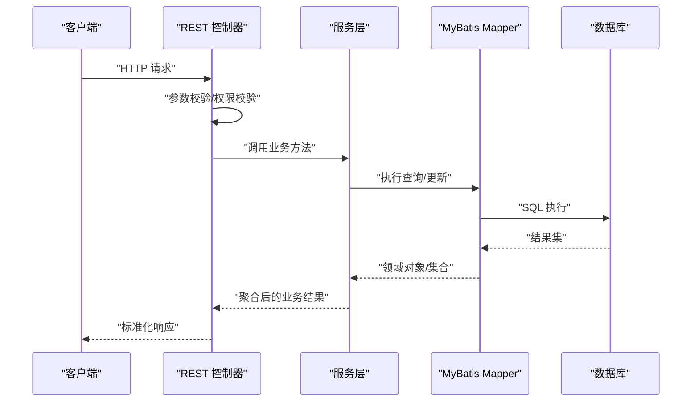
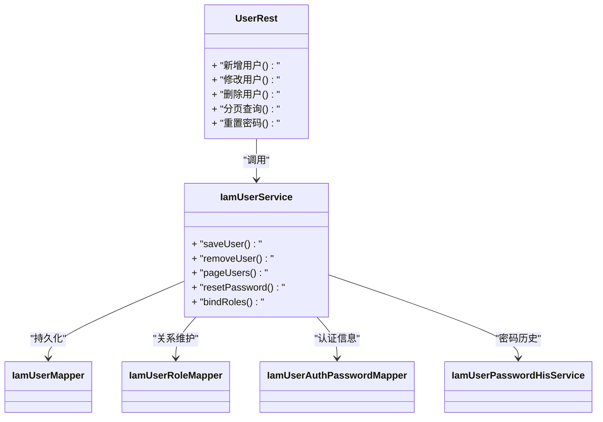
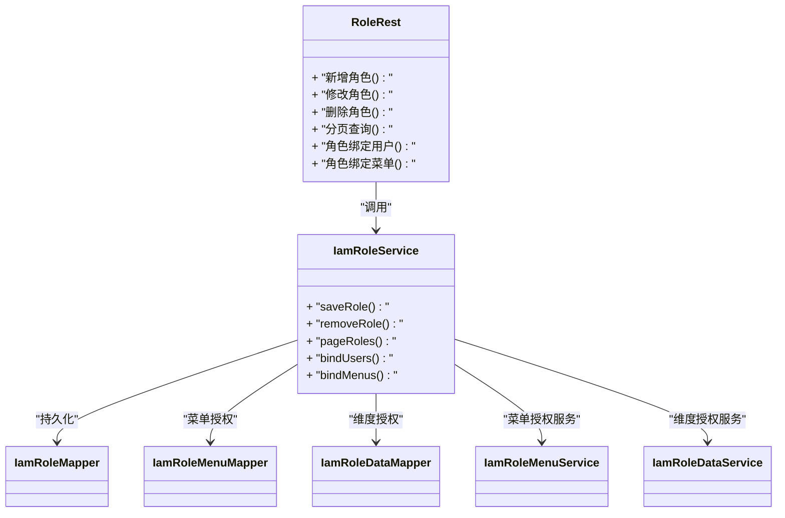
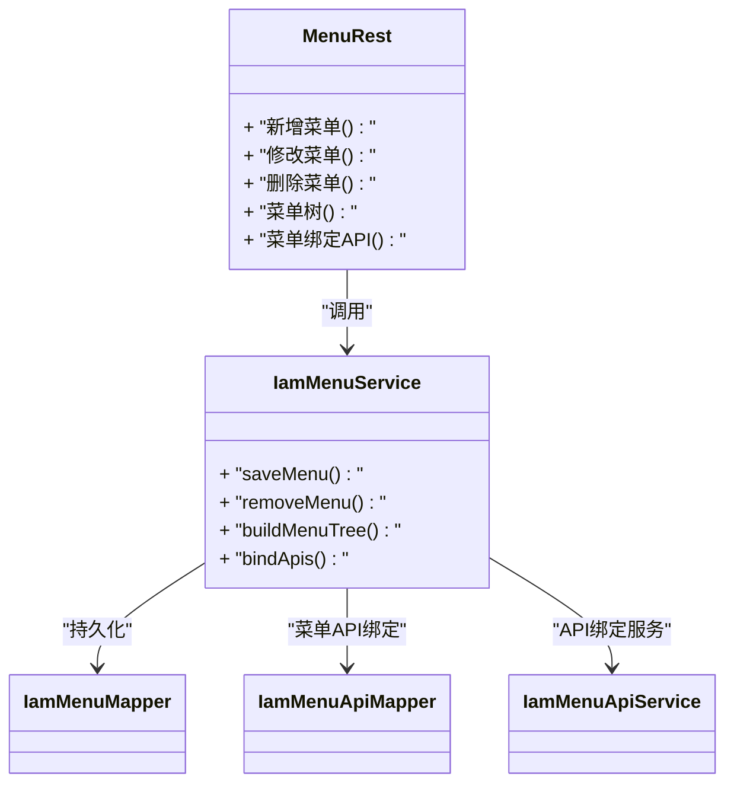
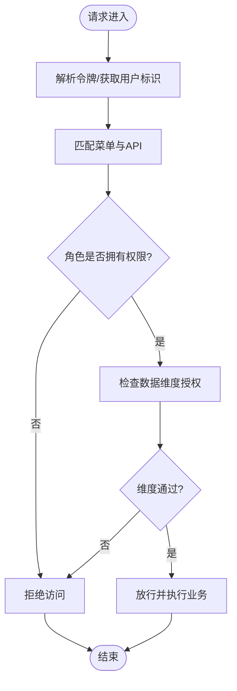
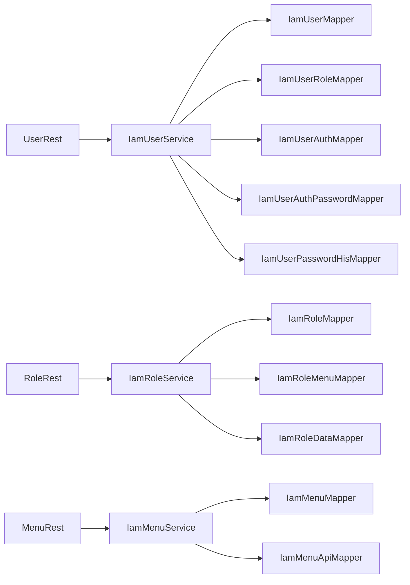

# 管理后台模块（iam-admin）

<cite>
**本文引用的文件**
- [IamAdminAutoConfig.java](file://iam-admin/src/main/java/com/wkclz/iam/admin/IamAdminAutoConfig.java)
- [Route.java](file://iam-admin/src/main/java/com/wkclz/iam/admin/Route.java)
- [IamAdminConfig.java](file://iam-admin/src/main/java/com/wkclz/iam/admin/config/IamAdminConfig.java)
- [RestfulScan.java](file://iam-admin/src/main/java/com/wkclz/iam/admin/init/RestfulScan.java)
- [UserRest.java](file://iam-admin/src/main/java/com/wkclz/iam/admin/rest/UserRest.java)
- [RoleRest.java](file://iam-admin/src/main/java/com/wkclz/iam/admin/rest/RoleRest.java)
- [MenuRest.java](file://iam-admin/src/main/java/com/wkclz/iam/admin/rest/MenuRest.java)
- [IamUserService.java](file://iam-admin/src/main/java/com/wkclz/iam/admin/service/IamUserService.java)
- [IamRoleService.java](file://iam-admin/src/main/java/com/wkclz/iam/admin/service/IamRoleService.java)
- [IamMenuService.java](file://iam-admin/src/main/java/com/wkclz/iam/admin/service/IamMenuService.java)
- [IamUserMapper.java](file://iam-admin/src/main/java/com/wkclz/iam/admin/mapper/IamUserMapper.java)
- [IamRoleMapper.java](file://iam-admin/src/main/java/com/wkclz/iam/admin/mapper/IamRoleMapper.java)
- [IamMenuMapper.java](file://iam-admin/src/main/java/com/wkclz/iam/admin/mapper/IamMenuMapper.java)
- [IamUserRoleMapper.java](file://iam-admin/src/main/java/com/wkclz/iam/admin/mapper/IamUserRoleMapper.java)
- [IamRoleMenuMapper.java](file://iam-admin/src/main/java/com/wkclz/iam/admin/mapper/IamRoleMenuMapper.java)
- [IamUserAuthMapper.java](file://iam-admin/src/main/java/com/wkclz/iam/admin/mapper/IamUserAuthMapper.java)
- [IamUserAuthPasswordMapper.java](file://iam-admin/src/main/java/com/wkclz/iam/admin/mapper/IamUserAuthPasswordMapper.java)
- [IamMenuApiMapper.java](file://iam-admin/src/main/java/com/wkclz/iam/admin/mapper/IamMenuApiMapper.java)
- [IamAccessKeyMapper.java](file://iam-admin/src/main/java/com/wkclz/iam/admin/mapper/IamAccessKeyMapper.java)
- [IamAccessKeyApiMapper.java](file://iam-admin/src/main/java/com/wkclz/iam/admin/mapper/IamAccessKeyApiMapper.java)
- [IamApiMapper.java](file://iam-admin/src/main/java/com/wkclz/iam/admin/mapper/IamApiMapper.java)
- [IamDataDimensionMapper.java](file://iam-admin/src/main/java/com/wkclz/iam/admin/mapper/IamDataDimensionMapper.java)
- [IamLoginLogMapper.java](file://iam-admin/src/main/java/com/wkclz/iam/admin/mapper/IamLoginLogMapper.java)
- [IamRequestLogMapper.java](file://iam-admin/src/main/java/com/wkclz/iam/admin/mapper/IamRequestLogMapper.java)
- [IamAppMapper.java](file://iam-admin/src/main/java/com/wkclz/iam/admin/mapper/IamAppMapper.java)
- [IamTenantMapper.java](file://iam-admin/src/main/java/com/wkclz/iam/admin/mapper/IamTenantMapper.java)
- [IamRoleDataMapper.java](file://iam-admin/src/main/java/com/wkclz/iam/admin/mapper/IamRoleDataMapper.java)
- [IamUserPasswordHisMapper.java](file://iam-admin/src/main/java/com/wkclz/iam/admin/mapper/IamUserPasswordHisMapper.java)
- [IamUserMenuService.java](file://iam-admin/src/main/java/com/wkclz/iam/admin/service/IamUserMenuService.java)
- [IamUserRoleService.java](file://iam-admin/src/main/java/com/wkclz/iam/admin/service/IamUserRoleService.java)
- [IamRoleMenuService.java](file://iam-admin/src/main/java/com/wkclz/iam/admin/service/IamRoleMenuService.java)
- [IamMenuApiService.java](file://iam-admin/src/main/java/com/wkclz/iam/admin/service/IamMenuApiService.java)
- [IamAccessKeyService.java](file://iam-admin/src/main/java/com/wkclz/iam/admin/service/IamAccessKeyService.java)
- [IamAccessKeyApiService.java](file://iam-admin/src/main/java/com/wkclz/iam/admin/service/IamAccessKeyApiService.java)
- [IamApiService.java](file://iam-admin/src/main/java/com/wkclz/iam/admin/service/IamApiService.java)
- [IamDataDimensionService.java](file://iam-admin/src/main/java/com/wkclz/iam/admin/service/IamDataDimensionService.java)
- [IamLoginLogService.java](file://iam-admin/src/main/java/com/wkclz/iam/admin/service/IamLoginLogService.java)
- [IamRequestLogService.java](file://iam-admin/src/main/java/com/wkclz/iam/admin/service/IamRequestLogService.java)
- [IamAppService.java](file://iam-admin/src/main/java/com/wkclz/iam/admin/service/IamAppService.java)
- [IamTenantService.java](file://iam-admin/src/main/java/com/wkclz/iam/admin/service/IamTenantService.java)
- [IamRoleDataService.java](file://iam-admin/src/main/java/com/wkclz/iam/admin/service/IamRoleDataService.java)
- [IamUserAuthService.java](file://iam-admin/src/main/java/com/wkclz/iam/admin/service/IamUserAuthService.java)
- [IamUserAuthPasswordService.java](file://iam-admin/src/main/java/com/wkclz/iam/admin/service/IamUserAuthPasswordService.java)
- [IamUserPasswordHisService.java](file://iam-admin/src/main/java/com/wkclz/iam/admin/service/IamUserPasswordHisService.java)
- [AutoConfiguration.imports](file://iam-admin/src/main/resources/META-INF/spring/org.springframework.boot.autoconfigure.AutoConfiguration.imports)
- [pom.xml](file://iam-admin/pom.xml)
</cite>

## 目录
1. [简介](#简介)
2. [项目结构](#项目结构)
3. [核心组件](#核心组件)
4. [架构总览](#架构总览)
5. [详细组件分析](#详细组件分析)
6. [依赖关系分析](#依赖关系分析)
7. [性能考虑](#性能考虑)
8. [故障排查指南](#故障排查指南)
9. [结论](#结论)
10. [附录](#附录)

## 简介
本文件面向管理员与开发者，系统性阐述 SH-IAM 管理后台模块（iam-admin）的整体设计与实现，覆盖用户管理、角色管理、菜单管理与权限控制等核心能力。文档重点解析 REST 控制器（如 UserRest、RoleRest、MenuRest）的 API 设计与业务逻辑，阐明服务层（IamUserService、IamRoleService、IamMenuService）的职责分工与协作机制，并深入说明 RBAC 权限模型在代码中的落地方式、数据访问层的设计模式与事务管理策略。同时提供 CRUD 操作示例、权限验证流程与数据同步机制的技术细节，以及自动化配置、路由管理与拦截器链的实现原理，帮助快速上手与扩展开发。

## 项目结构
iam-admin 模块采用分层架构：自动配置与启动引导、REST 控制层、服务层、数据访问层（Mapper/XML）、资源与配置。其核心入口通过 Spring Boot 自动装配机制加载，扫描并注册各 REST 资源；数据访问层基于 MyBatis，提供用户、角色、菜单、权限、应用、租户、日志、维度等实体的持久化能力。

```mermaid
graph TB
subgraph "自动配置与引导"
AutoCfg["IamAdminAutoConfig<br/>自动配置"]
Route["Route<br/>路由定义"]
Scan["RestfulScan<br/>REST 扫描"]
Cfg["IamAdminConfig<br/>配置类"]
end
subgraph "REST 控制层"
UR["UserRest"]
RR["RoleRest"]
MR["MenuRest"]
MoreRest["更多REST控制器..."]
end
subgraph "服务层"
USvc["IamUserService"]
RSvc["IamRoleService"]
MSvc["IamMenuService"]
UMSvc["IamUserMenuService"]
URSSvc["IamUserRoleService"]
RMSvc["IamRoleMenuService"]
MASvc["IamMenuApiService"]
AKSvc["IamAccessKeyService"]
AKASvc["IamAccessKeyApiService"]
APISvc["IamApiService"]
DimSvc["IamDataDimensionService"]
LogSvc["IamLoginLogService / IamRequestLogService"]
AppSvc["IamAppService"]
TenSvc["IamTenantService"]
RoleDSvc["IamRoleDataService"]
UAuthSvc["IamUserAuthService / IamUserAuthPasswordService / IamUserPasswordHisService"]
end
subgraph "数据访问层"
UM["IamUserMapper"]
RM["IamRoleMapper"]
MM["IamMenuMapper"]
URM["IamUserRoleMapper"]
RMM["IamRoleMenuMapper"]
UAM["IamUserAuthMapper"]
UAPM["IamUserAuthPasswordMapper"]
MAM["IamMenuApiMapper"]
AKM["IamAccessKeyMapper"]
AKAM["IamAccessKeyApiMapper"]
AIM["IamApiMapper"]
DIMM["IamDataDimensionMapper"]
LLM["IamLoginLogMapper"]
RQM["IamRequestLogMapper"]
APPM["IamAppMapper"]
TENM["IamTenantMapper"]
RDM["IamRoleDataMapper"]
UPHM["IamUserPasswordHisMapper"]
end
AutoCfg --> Scan
Scan --> UR
Scan --> RR
Scan --> MR
UR --> USvc
RR --> RSvc
MR --> MSvc
USvc --> UM
RSvc --> RM
MSvc --> MM
USvc --> URSSvc
RSvc --> RMSvc
MSvc --> UMSvc
MASvc --> MAM
AKSvc --> AKM
AKASvc --> AKAM
APISvc --> AIM
DimSvc --> DIMM
LogSvc --> LLM
LogSvc --> RQM
AppSvc --> APPM
TenSvc --> TENM
RoleDSvc --> RDM
UAuthSvc --> UAM
UAuthSvc --> UAPM
USvc --> UPHM
```

图表来源
- [IamAdminAutoConfig.java](file://iam-admin/src/main/java/com/wkclz/iam/admin/IamAdminAutoConfig.java)
- [Route.java](file://iam-admin/src/main/java/com/wkclz/iam/admin/Route.java)
- [RestfulScan.java](file://iam-admin/src/main/java/com/wkclz/iam/admin/init/RestfulScan.java)
- [UserRest.java](file://iam-admin/src/main/java/com/wkclz/iam/admin/rest/UserRest.java)
- [RoleRest.java](file://iam-admin/src/main/java/com/wkclz/iam/admin/rest/RoleRest.java)
- [MenuRest.java](file://iam-admin/src/main/java/com/wkclz/iam/admin/rest/MenuRest.java)
- [IamUserService.java](file://iam-admin/src/main/java/com/wkclz/iam/admin/service/IamUserService.java)
- [IamRoleService.java](file://iam-admin/src/main/java/com/wkclz/iam/admin/service/IamRoleService.java)
- [IamMenuService.java](file://iam-admin/src/main/java/com/wkclz/iam/admin/service/IamMenuService.java)
- [IamUserMapper.java](file://iam-admin/src/main/java/com/wkclz/iam/admin/mapper/IamUserMapper.java)
- [IamRoleMapper.java](file://iam-admin/src/main/java/com/wkclz/iam/admin/mapper/IamRoleMapper.java)
- [IamMenuMapper.java](file://iam-admin/src/main/java/com/wkclz/iam/admin/mapper/IamMenuMapper.java)

章节来源
- [IamAdminAutoConfig.java](file://iam-admin/src/main/java/com/wkclz/iam/admin/IamAdminAutoConfig.java)
- [Route.java](file://iam-admin/src/main/java/com/wkclz/iam/admin/Route.java)
- [IamAdminConfig.java](file://iam-admin/src/main/java/com/wkclz/iam/admin/config/IamAdminConfig.java)
- [RestfulScan.java](file://iam-admin/src/main/java/com/wkclz/iam/admin/init/RestfulScan.java)

## 核心组件
- 自动配置与引导：通过自动配置类加载 REST 资源，统一管理路由与拦截器链，确保模块可插拔式集成。
- REST 控制器：提供用户、角色、菜单等资源的增删改查与关联操作接口，封装参数校验、权限校验与响应格式。
- 服务层：承载业务规则与流程编排，协调多 Mapper 的组合操作，保证事务一致性与数据一致性。
- 数据访问层：基于 MyBatis Mapper 与 XML 映射，提供细粒度的数据读写能力，支撑 RBAC 关系型数据模型。
- 配置与扫描：通过自动装配与扫描机制，动态注册 REST 资源，降低手工配置成本。

章节来源
- [IamAdminAutoConfig.java](file://iam-admin/src/main/java/com/wkclz/iam/admin/IamAdminAutoConfig.java)
- [IamAdminConfig.java](file://iam-admin/src/main/java/com/wkclz/iam/admin/config/IamAdminConfig.java)
- [RestfulScan.java](file://iam-admin/src/main/java/com/wkclz/iam/admin/init/RestfulScan.java)

## 架构总览
下图展示管理后台从请求进入 REST 层，到服务层编排，再到数据访问层持久化的整体流程，以及与 MyBatis 的交互关系。

图表来源
- [UserRest.java](file://iam-admin/src/main/java/com/wkclz/iam/admin/rest/UserRest.java)
- [IamUserService.java](file://iam-admin/src/main/java/com/wkclz/iam/admin/service/IamUserService.java)
- [IamUserMapper.java](file://iam-admin/src/main/java/com/wkclz/iam/admin/mapper/IamUserMapper.java)

## 详细组件分析

### 用户管理（UserRest 与 IamUserService）
- REST 设计要点
  - 提供用户 CRUD 接口，支持分页查询、批量删除、重置密码等。
  - 对敏感字段进行脱敏处理，避免明文泄露。
  - 统一响应体结构，便于前端统一处理。
- 业务逻辑
  - 新增/修改用户时进行唯一性校验（如账号、邮箱等）。
  - 密码安全处理：加密存储、历史密码保护、过期策略。
  - 用户与角色的绑定/解绑，保持关系表一致性。
- 服务层协作
  - IamUserService 协调 IamUserMapper、IamUserRoleMapper、IamUserAuthPasswordMapper 等，确保事务边界内完成用户信息与认证信息的原子性更新。
  - 与 IamUserPasswordHisService 协作记录密码历史，防止重复使用。
- 数据模型与复杂度
  - 用户主表与认证表分离，降低耦合；用户-角色多对多关系通过中间表维护。
  - 常见查询（按条件分页、按角色筛选）时间复杂度受索引与分页策略影响。

图表来源
- [UserRest.java](file://iam-admin/src/main/java/com/wkclz/iam/admin/rest/UserRest.java)
- [IamUserService.java](file://iam-admin/src/main/java/com/wkclz/iam/admin/service/IamUserService.java)
- [IamUserMapper.java](file://iam-admin/src/main/java/com/wkclz/iam/admin/mapper/IamUserMapper.java)
- [IamUserRoleMapper.java](file://iam-admin/src/main/java/com/wkclz/iam/admin/mapper/IamUserRoleMapper.java)
- [IamUserAuthPasswordMapper.java](file://iam-admin/src/main/java/com/wkclz/iam/admin/mapper/IamUserAuthPasswordMapper.java)
- [IamUserPasswordHisService.java](file://iam-admin/src/main/java/com/wkclz/iam/admin/service/IamUserPasswordHisService.java)

章节来源
- [UserRest.java](file://iam-admin/src/main/java/com/wkclz/iam/admin/rest/UserRest.java)
- [IamUserService.java](file://iam-admin/src/main/java/com/wkclz/iam/admin/service/IamUserService.java)
- [IamUserMapper.java](file://iam-admin/src/main/java/com/wkclz/iam/admin/mapper/IamUserMapper.java)
- [IamUserRoleMapper.java](file://iam-admin/src/main/java/com/wkclz/iam/admin/mapper/IamUserRoleMapper.java)
- [IamUserAuthPasswordMapper.java](file://iam-admin/src/main/java/com/wkclz/iam/admin/mapper/IamUserAuthPasswordMapper.java)
- [IamUserPasswordHisService.java](file://iam-admin/src/main/java/com/wkclz/iam/admin/service/IamUserPasswordHisService.java)

### 角色管理（RoleRest 与 IamRoleService）
- REST 设计要点
  - 支持角色 CRUD、角色与用户的关联、角色与菜单的关联等。
  - 提供树形结构返回，便于前端渲染。
- 业务逻辑
  - 角色维度授权（RoleData）与菜单授权（RoleMenu）分离，满足细粒度权限控制。
  - 角色变更需同步刷新相关用户的权限缓存或会话状态。
- 服务层协作
  - IamRoleService 协调 IamRoleMapper、IamRoleMenuMapper、IamRoleDataMapper 等，保证角色与其授权关系的一致性。
  - 与 IamRoleMenuService、IamRoleDataService 协同完成菜单与维度授权的维护。

图表来源
- [RoleRest.java](file://iam-admin/src/main/java/com/wkclz/iam/admin/rest/RoleRest.java)
- [IamRoleService.java](file://iam-admin/src/main/java/com/wkclz/iam/admin/service/IamRoleService.java)
- [IamRoleMapper.java](file://iam-admin/src/main/java/com/wkclz/iam/admin/mapper/IamRoleMapper.java)
- [IamRoleMenuMapper.java](file://iam-admin/src/main/java/com/wkclz/iam/admin/mapper/IamRoleMenuMapper.java)
- [IamRoleDataMapper.java](file://iam-admin/src/main/java/com/wkclz/iam/admin/mapper/IamRoleDataMapper.java)
- [IamRoleMenuService.java](file://iam-admin/src/main/java/com/wkclz/iam/admin/service/IamRoleMenuService.java)
- [IamRoleDataService.java](file://iam-admin/src/main/java/com/wkclz/iam/admin/service/IamRoleDataService.java)

章节来源
- [RoleRest.java](file://iam-admin/src/main/java/com/wkclz/iam/admin/rest/RoleRest.java)
- [IamRoleService.java](file://iam-admin/src/main/java/com/wkclz/iam/admin/service/IamRoleService.java)
- [IamRoleMapper.java](file://iam-admin/src/main/java/com/wkclz/iam/admin/mapper/IamRoleMapper.java)
- [IamRoleMenuMapper.java](file://iam-admin/src/main/java/com/wkclz/iam/admin/mapper/IamRoleMenuMapper.java)
- [IamRoleDataMapper.java](file://iam-admin/src/main/java/com/wkclz/iam/admin/mapper/IamRoleDataMapper.java)
- [IamRoleMenuService.java](file://iam-admin/src/main/java/com/wkclz/iam/admin/service/IamRoleMenuService.java)
- [IamRoleDataService.java](file://iam-admin/src/main/java/com/wkclz/iam/admin/service/IamRoleDataService.java)

### 菜单管理（MenuRest 与 IamMenuService）
- REST 设计要点
  - 提供菜单 CRUD、树形结构构建、菜单与 API 的绑定等。
  - 支持懒加载与权限过滤，减少前端负担。
- 业务逻辑
  - 菜单树构建遵循父子层级关系，支持动态渲染。
  - 菜单与 API 的绑定用于接口级权限控制。
- 服务层协作
  - IamMenuService 协调 IamMenuMapper、IamMenuApiMapper，保证菜单与其 API 绑定关系的完整性。
  - 与 IamMenuApiService 协同完成菜单 API 绑定与解绑。

图表来源
- [MenuRest.java](file://iam-admin/src/main/java/com/wkclz/iam/admin/rest/MenuRest.java)
- [IamMenuService.java](file://iam-admin/src/main/java/com/wkclz/iam/admin/service/IamMenuService.java)
- [IamMenuMapper.java](file://iam-admin/src/main/java/com/wkclz/iam/admin/mapper/IamMenuMapper.java)
- [IamMenuApiMapper.java](file://iam-admin/src/main/java/com/wkclz/iam/admin/mapper/IamMenuApiMapper.java)
- [IamMenuApiService.java](file://iam-admin/src/main/java/com/wkclz/iam/admin/service/IamMenuApiService.java)

章节来源
- [MenuRest.java](file://iam-admin/src/main/java/com/wkclz/iam/admin/rest/MenuRest.java)
- [IamMenuService.java](file://iam-admin/src/main/java/com/wkclz/iam/admin/service/IamMenuService.java)
- [IamMenuMapper.java](file://iam-admin/src/main/java/com/wkclz/iam/admin/mapper/IamMenuMapper.java)
- [IamMenuApiMapper.java](file://iam-admin/src/main/java/com/wkclz/iam/admin/mapper/IamMenuApiMapper.java)
- [IamMenuApiService.java](file://iam-admin/src/main/java/com/wkclz/iam/admin/service/IamMenuApiService.java)

### 权限控制与 RBAC 实现
- RBAC 模型映射
  - 用户（User）—角色（Role）—菜单（Menu）—API（Api）构成典型的 RBAC 访问路径。
  - 角色维度授权（RoleData）用于数据级权限控制。
- 关键关系
  - 用户-角色：多对多，通过 IamUserRoleMapper 维护。
  - 角色-菜单：多对多，通过 IamRoleMenuMapper 维护。
  - 菜单-API：多对多，通过 IamMenuApiMapper 维护。
- 权限验证流程
  - 登录后生成令牌，请求携带令牌进入拦截器链。
  - 拦截器根据请求路径匹配菜单/API，结合用户角色与维度授权判断放行或拒绝。
  - 可选：将用户权限缓存至会话或集中式缓存，提升鉴权性能。

图表来源
- [IamUserRoleMapper.java](file://iam-admin/src/main/java/com/wkclz/iam/admin/mapper/IamUserRoleMapper.java)
- [IamRoleMenuMapper.java](file://iam-admin/src/main/java/com/wkclz/iam/admin/mapper/IamRoleMenuMapper.java)
- [IamMenuApiMapper.java](file://iam-admin/src/main/java/com/wkclz/iam/admin/mapper/IamMenuApiMapper.java)
- [IamRoleDataService.java](file://iam-admin/src/main/java/com/wkclz/iam/admin/service/IamRoleDataService.java)

章节来源
- [IamUserRoleMapper.java](file://iam-admin/src/main/java/com/wkclz/iam/admin/mapper/IamUserRoleMapper.java)
- [IamRoleMenuMapper.java](file://iam-admin/src/main/java/com/wkclz/iam/admin/mapper/IamRoleMenuMapper.java)
- [IamMenuApiMapper.java](file://iam-admin/src/main/java/com/wkclz/iam/admin/mapper/IamMenuApiMapper.java)
- [IamRoleDataService.java](file://iam-admin/src/main/java/com/wkclz/iam/admin/service/IamRoleDataService.java)

### 数据访问层与事务管理
- 设计模式
  - Mapper 接口 + XML 映射：通过命名空间与 SQL ID 定位具体语句，支持复杂联表查询与批量操作。
  - 分离关注点：用户/角色/菜单/权限等实体各自独立 Mapper，降低耦合。
- 事务策略
  - 服务层方法标注事务传播与回滚规则，确保用户信息、认证信息、关系表等在同一个事务中一致提交。
  - 对高并发场景建议使用合适的隔离级别与超时控制，避免长事务阻塞。
- 复杂度与优化
  - 常见查询建立复合索引（如用户账号、角色名称、菜单路径），分页查询限制最大条数。
  - 批量操作采用 JDBC 批处理或 MyBatis 批执行，减少往返次数。

章节来源
- [IamUserMapper.java](file://iam-admin/src/main/java/com/wkclz/iam/admin/mapper/IamUserMapper.java)
- [IamRoleMapper.java](file://iam-admin/src/main/java/com/wkclz/iam/admin/mapper/IamRoleMapper.java)
- [IamMenuMapper.java](file://iam-admin/src/main/java/com/wkclz/iam/admin/mapper/IamMenuMapper.java)
- [IamUserRoleMapper.java](file://iam-admin/src/main/java/com/wkclz/iam/admin/mapper/IamUserRoleMapper.java)
- [IamRoleMenuMapper.java](file://iam-admin/src/main/java/com/wkclz/iam/admin/mapper/IamRoleMenuMapper.java)
- [IamMenuApiMapper.java](file://iam-admin/src/main/java/com/wkclz/iam/admin/mapper/IamMenuApiMapper.java)

### 自动化配置、路由与拦截器链
- 自动配置
  - 通过自动配置类加载 REST 资源与相关 Bean，简化集成步骤。
- 路由管理
  - Route 类统一管理 REST 路由前缀与静态资源映射，便于集中治理。
- 拦截器链
  - 结合 SDK 模块的鉴权过滤器与日志过滤器，形成完整的请求生命周期处理链。
  - 过滤器负责令牌解析、权限判定、请求日志记录与异常拦截。

章节来源
- [IamAdminAutoConfig.java](file://iam-admin/src/main/java/com/wkclz/iam/admin/IamAdminAutoConfig.java)
- [Route.java](file://iam-admin/src/main/java/com/wkclz/iam/admin/Route.java)
- [AutoConfiguration.imports](file://iam-admin/src/main/resources/META-INF/spring/org.springframework.boot.autoconfigure.AutoConfiguration.imports)

## 依赖关系分析
下图展示模块内部主要组件之间的依赖关系，强调服务层对数据访问层的依赖以及 REST 控制器对服务层的依赖。

图表来源
- [UserRest.java](file://iam-admin/src/main/java/com/wkclz/iam/admin/rest/UserRest.java)
- [RoleRest.java](file://iam-admin/src/main/java/com/wkclz/iam/admin/rest/RoleRest.java)
- [MenuRest.java](file://iam-admin/src/main/java/com/wkclz/iam/admin/rest/MenuRest.java)
- [IamUserService.java](file://iam-admin/src/main/java/com/wkclz/iam/admin/service/IamUserService.java)
- [IamRoleService.java](file://iam-admin/src/main/java/com/wkclz/iam/admin/service/IamRoleService.java)
- [IamMenuService.java](file://iam-admin/src/main/java/com/wkclz/iam/admin/service/IamMenuService.java)
- [IamUserMapper.java](file://iam-admin/src/main/java/com/wkclz/iam/admin/mapper/IamUserMapper.java)
- [IamUserRoleMapper.java](file://iam-admin/src/main/java/com/wkclz/iam/admin/mapper/IamUserRoleMapper.java)
- [IamUserAuthMapper.java](file://iam-admin/src/main/java/com/wkclz/iam/admin/mapper/IamUserAuthMapper.java)
- [IamUserAuthPasswordMapper.java](file://iam-admin/src/main/java/com/wkclz/iam/admin/mapper/IamUserAuthPasswordMapper.java)
- [IamUserPasswordHisMapper.java](file://iam-admin/src/main/java/com/wkclz/iam/admin/mapper/IamUserPasswordHisMapper.java)
- [IamRoleMapper.java](file://iam-admin/src/main/java/com/wkclz/iam/admin/mapper/IamRoleMapper.java)
- [IamRoleMenuMapper.java](file://iam-admin/src/main/java/com/wkclz/iam/admin/mapper/IamRoleMenuMapper.java)
- [IamRoleDataMapper.java](file://iam-admin/src/main/java/com/wkclz/iam/admin/mapper/IamRoleDataMapper.java)
- [IamMenuMapper.java](file://iam-admin/src/main/java/com/wkclz/iam/admin/mapper/IamMenuMapper.java)
- [IamMenuApiMapper.java](file://iam-admin/src/main/java/com/wkclz/iam/admin/mapper/IamMenuApiMapper.java)

章节来源
- [pom.xml](file://iam-admin/pom.xml)

## 性能考虑
- 查询优化
  - 为高频查询字段建立索引，合理使用分页与投影字段。
  - 对树形结构构建采用一次性拉取与内存组装，避免 N+1 查询。
- 写入优化
  - 使用批处理与事务合并，减少数据库往返。
  - 对热点数据采用缓存（如用户权限、菜单树），降低数据库压力。
- 并发控制
  - 对唯一性约束冲突（账号、角色名等）采用幂等设计与重试策略。
  - 合理设置事务隔离级别与超时时间，避免死锁与长时间占用。

## 故障排查指南
- 常见问题定位
  - REST 层：检查请求参数、权限注解与异常拦截器输出。
  - 服务层：核对事务边界、异常回滚与日志埋点。
  - 数据访问层：确认 SQL ID、命名空间与返回类型映射。
- 日志与监控
  - 利用登录日志与请求日志服务定位异常请求与失败原因。
  - 对高频接口增加指标埋点，配合告警系统及时发现性能瓶颈。
- 快速修复建议
  - 参数校验失败：完善前端校验与后端 DTO 校验。
  - 权限不足：检查角色与菜单/API 绑定关系及维度授权。
  - 数据不一致：核查事务范围与回滚策略，必要时重建索引或修复数据。

章节来源
- [IamLoginLogService.java](file://iam-admin/src/main/java/com/wkclz/iam/admin/service/IamLoginLogService.java)
- [IamRequestLogService.java](file://iam-admin/src/main/java/com/wkclz/iam/admin/service/IamRequestLogService.java)
- [IamLoginLogMapper.java](file://iam-admin/src/main/java/com/wkclz/iam/admin/mapper/IamLoginLogMapper.java)
- [IamRequestLogMapper.java](file://iam-admin/src/main/java/com/wkclz/iam/admin/mapper/IamRequestLogMapper.java)

## 结论
iam-admin 模块以 RBAC 权限模型为核心，通过清晰的分层架构实现了用户、角色、菜单与权限的全链路管理。REST 控制器提供标准接口，服务层承担业务编排与事务一致性保障，数据访问层以 MyBatis 为基础实现高效持久化。配合自动配置、路由与拦截器链，模块具备良好的可扩展性与可维护性。建议在生产环境中进一步完善缓存策略、监控体系与异常治理，持续提升稳定性与性能。

## 附录
- 开发者扩展指南
  - 新增实体：创建 Mapper 接口与 XML，补充服务层方法与 REST 控制器接口。
  - 权限扩展：在角色维度授权与菜单-API 绑定基础上，按需扩展新的授权维度。
  - 性能优化：结合业务场景引入缓存、异步任务与分库分表策略。
- 管理员运维要点
  - 定期清理登录与请求日志，监控磁盘与数据库负载。
  - 对高风险操作（如重置密码、批量删除）增加二次确认与审计日志。
  - 建立灰度发布与回滚预案，确保变更可控。